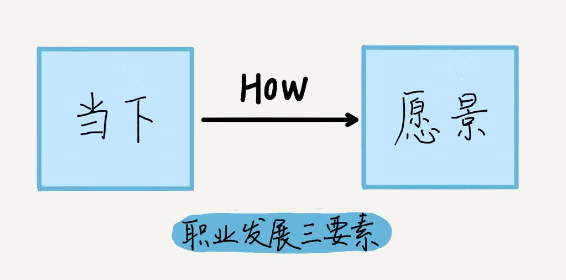
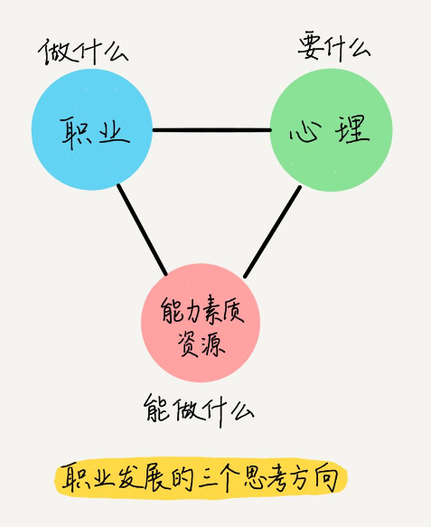
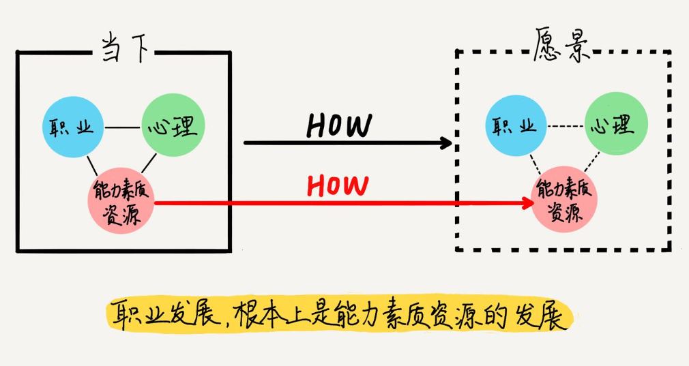
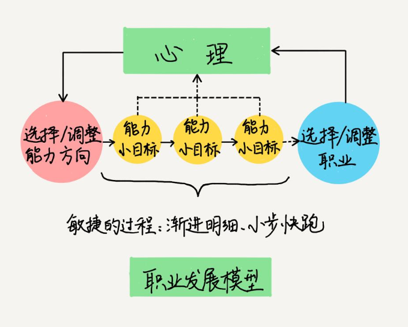
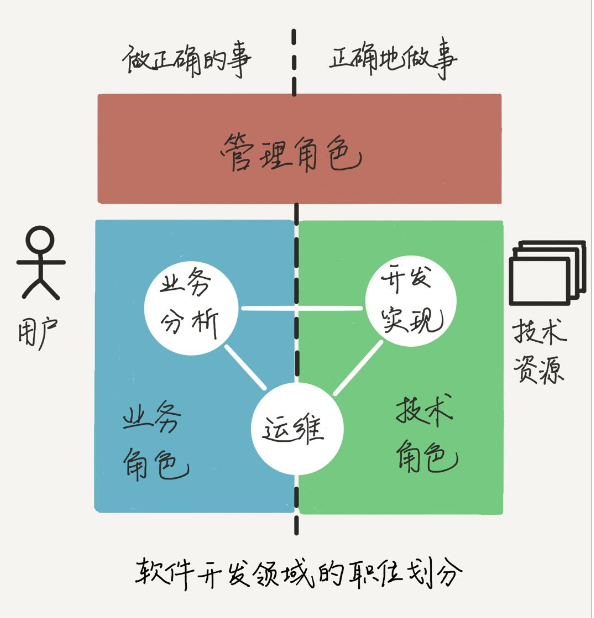

# 职业规划（上）

你好，我是白海飞。前面讨论了喜欢与擅长的关系，今天说个既实在又扎心的话题：“你真的想好要怎么发展了吗？”

这是个职业规划问题，对求职面试有什么意义呢？我们换一个场景：如果你去买火车票，却不知道目的地是哪里，行么？你只有想好职业方向朝哪里发展、怎么发展，才能明确当下该怎么做，该把简历投到哪些公司。这就是职业规划对求职面试的意义。而且，面试中有一问：“你有职业规划么？” 所以，今天我们必须得聊聊这个话题。

## 这个问题，牛人有所想，有所不想

如果你在十几年前问我这个问题，我会一脸羞愧：“这个……没想过。”后来，我也问过几个身边的牛人：

> **问：**“你刚工作的时候，是不是就有创业做 CEO 的目标了？”
>
> **答：**“没有呀，后来我看到机会才动手。做着做着，就觉得该弄出点不一样的事情了。”
>
> **问：**“你还是程序员的时候，怎么给自己定目标做技术总监的？”
>
> **答：**“我要成天想这个，就当不上总监了。能力够了，机会自然是你的了。”
>
> **问：**“你原来搞技术，现在是自媒体大 V，这是规划好的么？”
>
> **答：** “不，是意外，从来没想过做自媒体。”

看起来，大佬们一开始也不知道自己要发展的方向呀。等等，是不是我的问题有毛病？以上对话中，我还用下面的问法问过：

> **问：**“你刚工作的时候，做了些什么，对你后来创业有帮助呢？”
>
> **答：**“你知道，我比较喜欢掌控个事，另外呢，我工作中注重两方面，一个是开拓视野，另一个是积累资源……”
>
> **问：**“你觉得你是怎么一步一步从程序员，做成技术总监的？”
>
> **答：**“这个要注意技术深度和宽度，一点一点地扩展，同时把关注点扩展到技术的应用价值上。”
>
> **问：**“从架构师到自媒体大 V，有什么联系么？”
>
> **答：**“表面上看，完全是两件事，但是它们都用到了我的知识体系和表达能力，而且都是在帮助别人，都能带给我成就感。”

你看，换了个问法就能得到干货了，把问将来的目标，改成问当下的做法。这说明：**这几位牛人，并不是一开始都能把将来的路想明白，但是，也并不是什么都不想，只顾低头工作。**

那么问题来了，“想要怎么发展”，该想什么，不该想什么呢？

## 从当下到愿景

职业发展问题，有三个要素：当下（AsIs）、愿景（ToBe）和过程（How）。所以，你需要思考下面三个问题：

- 我的愿景是什么样子？
- 我当下是什么样子？
- 我要做什么，才能从当下走到愿景？

当我们思考愿景的时候，都会思考哪些层面的内容呢？首先是心理愿景，其次是职业愿景，最后是能力素质资源愿景。就是下面这个图，我分别谈谈。

1. “**心理愿景”体现你“要什么”**。我们最先想到的往往是一种工作和生活的状态，它可以反映你心理上的满足程度（图中的“心理”这个圆）。
    有的人偏事业型，兢兢业业，为了工作和事业上有所成就；有的人偏生活型，不想被工作所累，更希望好好享受时光，和家人能幸福地生活在一起。当然，有人认为先得有事业的成就，才能有物质基础享受生活；有人则质疑幸福真的需要那么多钱么？
    总之，每个人对事业和生活的平衡点不在同一个刻度上，也不在同一个时序上。你不能照搬别人的标准，也不要强逼别人服从你的标准。
2. “**职业愿景”体现你“做什么”**。 接下来我们想到的是职业愿景（对应图中的“职业”这个圆）。比如事业型的将来要开创一片天地，做 CEO、CTO 等等，或者想造福一方百姓，从政做人民公仆等等；比如生活型的想做一个安安稳稳的职员等等。
    职业包含四个维度：行业、公司、职位和级别。不同职业的社会地位、经济收入、劳动付出都不同，这些会影响到第一层说的心理愿景。所以你看，如果你把心理愿景先定好了，那职业的性质也就有设定了。
3. “**能力素质资源愿景”体现你“能做什么”。**再接下来，为了达到职业愿景，你要考虑得提高哪些能力素质和资源。比如，将来要深耕技术，或者转做管理，或者主攻业务等等，你就要考虑到能力素质资源这个角度。
    联想到第一篇[“公司到底想要什么样的人？”，](https://time.geekbang.org/column/article/79796)文章中的素质模型，你还可能要考虑到经验、技能（包括资源）、潜力如何发展上，比如提高学习能力、精益能力、领导能力等等，这些能力是做事的基础。

总体来看，以上三个层面中，心理愿景会受职业愿景的影响，你可以通过选择合适的职业来达到心理愿景；而职业愿景的达成，其实又是在拼能力素质资源（一些靠关系的咱不提哈）。因此，当你构建愿景的时候，应该留意最基本的那个方面：能力素质资源愿景，是它决定了职业愿景和心理愿景。

考虑当下的状态时，也和考虑愿景一样，涉及的也是这三个层面：心理、职业、能力素质资源。同样，能力素质资源是基础。

> **小提示：**
>
> 发展的问题，归根到底，是能力素质资源的发展问题。

这里，我们通过一个图来一形象地看一下（请注意图中的红色箭头）：

## 职业发展模型

回味一下开篇的那些对话，那些牛人一开始也看不清多年后要从事什么职业，只有心理愿景。他们的关键动作是，基于当下的条件，先选择能力方向，确定能力发展路线，在发展中选择时机调整职业。这个过程中，他们逐渐调整和接近心理愿景，获得满足感、成就感。

这正是职业规划的五个步骤：

1. **构建心理愿景**：确定你想要什么。
2. **选择或调整能力方向：** 比如具体选择哪种技术、哪种业务（行业）、什么领域的管理等等。
3. **发展：**你怎么一步一步发展这些能力？
4. **选择或调整职业：**有了这些能力素质资源之后，你要继续当前职业，还是要换个职业？
5. **反馈：**工作中获得的心理满意度，和心理愿景对比，反馈到能力、发展、职业的活动中，对其调整，或者调整心理愿景本身。

下面，我详细解释下职业发展模型中的各个环节。

1. 首先，**心理愿景的构建，也就是你想成为什么样的人，过什么样的生活。**你可能会问，我应该有什么愿景呢？对不起，这个问题我帮不上忙，因为它的答案是由你的价值观、性格、环境等复杂因素决定的。你得通过观察、尝试、感受，才能逐渐明确事业和生活的平衡点。有些鸡汤类的名句，比如“你要放过你自己”“懂得取舍”，大概是说这个话题的吧。
2. 接下来，**心理愿景影响你选择的能力方向。**关于能力方向的选择和调整，内容较多，我会在下一篇讲职业规划的文章中，挑技术、业务、管理三个方向分别阐述。
3. 一旦能力方向定了，接下来，**能力的发展路径，就是实现一个一个小目标的过程。**小目标是啥？就是既定方向上的能力分解。
    小目标怎么定？首先按能力发展方向，分解出几个适合你眼下发展的小目标。通过系统学习或工作实践，快速提高技能，达成小目标。关于学习能力、解决问题的话题，我会在专栏的第四个模块“贯通篇”详细阐述。
    等小目标达成了，再从大目标里拆出几个明确的小目标来，继续做，周而复始地循环。这是个渐进明细、小步快跑的过程，也正是敏捷项目中“版本计划”（release planning）的应用 。
    **你可能会质疑这种只清楚眼前的做法，觉得不整体搞清楚怎么能开始做呢？我们其实已经有了一个长期的大目标了，只是没必要现在就细化出所有内容。**因为在这个多变的世界，我们得用精益的观念来看问题：你永远只能处理当前条件相对稳定，而且已经明确了的情形，几个月甚至几年之后，当稳定被打破，新的变量加进来，谁知道状况会变成怎样呢，没必要现在操心。所以，远期能力发展路径不清晰，没有关系，我们保持关注，必要时调整即可。
4. 随着能力的发展和资源的积累，你可以**不失时机地选择和调整职业**。选择和调整职业的考量因素，我总结为 16 个字：**挑我所爱，选我所长，取我所利，择世所需。**
    **挑我所爱、选我所长**，这在上一篇“喜欢或擅长的工作，你该选哪一个？”中仔细讨论过了，结论是，要发展为稳定兴趣以后，再做选择，而且更重要的是，要有能力促使兴趣和擅长的发展和转化。
    **取我所利**，就是找收益大的职业。这里的收益，不仅包含物质上的收益，还包括非物质收益，比如个人成长、资源积累、精神满足等等。
    **择世所需**，选社会或者团队需要的职业，能给世界带来价值的。
5. **职业工作和生活带给你的心理感受，无时无刻都在刺激你跟心理愿景比较，从而促使你继续前行或者马上调整，进入下一个循环。**所以说，职业发展不是“早就定好”的一条清清楚楚的发展道路，而是渐进明细的、按需调整的实践过程。

纵观整个循环过程，可以看出，**职业规划，你要直接规划的不是职业变动，职业变动是结果，要直接规划的是能力素质资源的发展和提高。**

我非常欣赏 IBM 一位超级大牛的名言：“**要让职业发展追着你走，而不是你追着职业发展走。**” 其含义是说，你如果能力不到位，只追求职位升级是徒劳的，所以你不能追着职业发展走；你要先提高自己的能力，然后在公平开放的公司文化中，自然就会有合适的职位和机会让你升级，这就是职业发展追着你走。

## **总结**

以上我们讨论了职业规划的一些基本理念和方法：

- 职业发展是从当下的状态，经过努力发展，接近或者调整愿景的过程。
- 愿景包括心理愿景、职业愿景和能力素质资源愿景三个层面，它们分别对应“想要什么”“做什么”，以及“能做什么”。
- 职业规划，其实是针对自己的心理愿景，对能力素质资源的发展规划，从而实现职业的选择或调整，最后形成的心理感受，又反过来影响规划。
- 能力的发展，是个精益的过程：渐进明细，小步快跑。
- 选择或调整职业，有 16 个字的考量：挑我所爱，选我所长，取我所利，择世所需。

回到开篇的问题：“你真的想好要怎么发展了吗？” 现在你清楚职业规划包含哪些内容，该考虑什么，不应该考虑什么了吧？如果面试官这样问“你五年后想发展成什么样子”，一个合理的回答可能像下面这样：

> “哦，我还不能确定五年后能做到什么级别的职位，但是我想专注在技术上，继续深入前端开发，有机会也想提高用户交互设计的能力，因为我非常细心，而且对用户心理和行为很感兴趣，如果将来有 UX 设计的工作，我很乐意尝试。至于现在，我正在学习 VUE 框架。”

## 思考时间

我在面试中也会让应聘者说说自己的职业规划，下面我列了几个典型的回答，一起来看一下：

1. “走一步看一步吧，我还没有想太清楚。”
2. “我想三年内深入学习技术，之后再看能否走管理。”
3. “看公司需要吧，无论做哪个职位，我都会尽心去做的。”

以上回答显示了应聘者怎样的思考角度和深度？如果你是面试官，会怎样评价？如果你是应聘者，又会如何回答呢？欢迎你在留言区分享，我们一起沟通探讨。

# 职业规划（下）

今天讲职业规划的第二篇：程序员后来都去干啥了。

我刚开始工作的时候，每次上下西二旗地铁站，看着那么多人背着电脑包，眼神炯炯，脚步匆匆，心里就想，每年都要有更年轻的人挤进来，我们这些程序员将来去干啥呢？

如今十多年过去了，稳中求进的西二旗都成了程序员神往的圣地，看看我身边的小伙伴们，有人跳到别的大厂发展成总监，有人去互联网创业做了 CEO，有人进了银行，有人改行做了餐饮，有人搞起自媒体成了大 V……

但是大多数人，都像我一样，还在程序的世界里摸爬滚打。以我们团队为例，十多年来，从十几个人，发展成 200 多人的全球跨职能团队。其中，我们的领队成了全球商务系统的总负责人，汽车制造专业的程序员成了资深架构师，测试出身的小姑娘成了业务大拿，还有更多的人，一直坚守在技术岗位上，成了所在领域的专家，推动着客户成功，带领着团队成长。

那么，对于没有选择创业、没有转行的这大多数程序员来说，在软件产品团队内部是怎么发展的呢？这些角色的发展空间如何？你怎样才能判断自己适合做哪个角色呢？

好，在前一篇我介绍了职业规划的愿景和小目标，今天我们就把眼光聚焦在软件产品团队的几类角色上，以便帮助你结合自己的情况，规划个人发展方向。

## 软件产品团队的角色划分

简单地说，软件开发的工作是编写程序为用户服务。如下图所示，在这个领域，一端是用户，另一端是技术、设备等资源，中间是产品团队负责连接。用户想满足自己的需求，就需要产品团队，把资源加工成可用的软件或者服务，递交给用户，甚至负责运维，满足用户持续的使用。

我们在上图中间画一条分割线，把软件产品团队除了管理人员，一分为二，靠近用户一端的这组角色，包括产品经理、业务分析师、业务运营等职位，作用是确保产品功能体现客户价值，也就是“做正确的事”，这组角色是业务角色；而靠近技术资源一端的这组角色，包括架构师、开发、测试和系统运维人员等，负责高效高质地做出产品，也就是“正确地做事”，这组角色是技术角色。另外，在这两组角色之外，还有一组管理角色，包括项目经理、部门经理等职位，负责业务战略、项目执行、团队管理等。这样一来，我们就把软件产品团队的角色分为三类：**业务角色、技术角色、管理角色**。

虽然这三类角色的目标都是为用户递交高质量、高价值的产品服务，但各自有明显不同的关注点，他们的思维模式也不一样。为了让你更清楚地了解他们的不同，我举个例子。比如我们让这三类人分别解释一下“圆”这个图形：

- 技术人会说：拿一条绳子，按住一头不动，另一头转一圈，画出的轨迹，就是圆。（他在强调用什么工具技术来画圆。）
- 搞业务的人则会说：这个图形就像十五的月亮，每段线条都很光滑，很完美，生活中有很多地方用到它。（ 他在用形象化的语言解释圆的外观、属性，以及应用价值。）
- 搞管理的人则会把技术和业务两人叫到一起，对技术人说：“你要用什么样的绳子？这么做费不费劲？”对业务的人说：“你的说法倒是可以验证他画得好不好，可是，十五那天要是阴天你就没法验证了。” （他不关注怎么画圆，但是关注画圆的资源，最终的质量、验证方法，还有风险。）

你看到了么，技术角色关注的是设计实现，业务角色关注的是功能价值，而管理角色关注的是质量、过程控制和风险。下面我们一起详细讲讲这三类角色。

### 1. 技术角色

首先说技术角色，它包括开发、测试、架构、系统运维等职位。这些职位有什么共同点呢？

技术人员的任务，是把定义好的功能做出来。因为长时间跟计算机打交道，而计算机按照算法逻辑运行程序，所以技术人员讲求逻辑，追求细节，探究问题的根源，有追根寻底的好奇心。优秀的技术人员，除了爱钻研深度，还爱探索广度。当对某个领域的技术深入理解之后，他们能抽象出方法和模型，用于掌握日新月异的技术本源，和变化的思想模式，从而在广度上对技术有更快更好的理解。这就是**“T”型人才：纵向有技术深度，横向有技术广度，他们对新技术有敏锐的嗅觉，关注、掌握甚至引领技术发展的动态和趋势。**

我理解技术角色有以下的四个发展阶段：

1. 初级的程序员，拿到小的开发任务，能够运用团队中已经选型的技术和工具，编码实现功能，通过调试代码，理解技术的原理，训练自己的思路以便和计算机的运行逻辑同频，灵活运用编程模式，驽驾程序解决技术问题，也就是形成**算法思维**，这时他关注的是代码质量和技术问题。
2. 随着开发任务的多样化，程序员解决的问题越来越深入和复杂，逐渐接触和掌握了完整的框架和技术，通过总结，对该问题域形成模块化、体系化的认知，可以独立设计和开发，也就是形成**系统思维**。这时他关注的是某一类系统的运行效率。
3. 解决问题能力越来越强的程序员，把问题域不断拓展到新的领域，利用已经掌握的系统化知识和思考方法，能快速学习新领域的知识，掌握新领域的技术和框架，这是进行“T”型技术中广度的积累。每个技术模块都形成他知识体系中的一个节点，随着这个知识体系越长越大，他可以根据用户的需求，选择合适的技术模块，进行分拆组合，考虑成本和收益的均衡，来提供解决方案，也就是形成**架构思维**，我们称为架构师。这时架构师的他，关注的是业务和架构的最优匹配。
4. 再以后，就是对技术前瞻性的把握了，结合市场的需求变化和研究人员的成果，依托整个软件生态的发展，引入或创造新的技术，提高应用效率，满足用户需求。IBM 有很多技术大神级的人物，我很希望能有机会跟他们深度协作，这样有了体会，就能补充完善这段了。

技术是可以一直做下去的，当然，这点取决于公司的技术成长空间和个人能力素质。如果条件具备，并非像某些人说的那样，35 岁以后就要转做管理。和年轻的开发者相比，你资深在对技术本质和广度的理解，以及技术和业务的融合上。

**怎么衡量你适不适合走技术路线呢？我觉得，能不能做好技术，不在于你是不是计算机科班出身，不在于你是不是现在还处理琐碎的小任务，而在于你对底层细节的好奇心，以及是否愿意尝鲜钻研，扩充自己的知识体系。**

比如，你在饭馆第一次看到“煤球炒饭”，有研究它的欲望么？这道菜上来的时候，还蹿着火苗，你能快速搞清其原理么？你是要自己先研究一番呢，还是去“朋友圈”问别人呢？乘坐电梯，你会不会纳闷电梯用的什么调度算法？你有没有折腾出过一些小程序，被别人“把玩”？你的技术博客，曾经被人称赞或引用过么？如果是，那你可以考虑一下技术路线。

### 2. 业务角色

业务就是用户遇到的问题和要做的需求。业务角色，包括业务分析师、产品经理、客户支持、业务运维等人员。这些人一方面跟用户打交道，另一方面跟技术人员打交道，把用户不明确的需求、痛点、问题，加工转化为技术人员可理解的、高确定性的需求说明和功能定义。进一步讲，**业务角色把用户价值翻译成产品功能，保证产品团队做正确的事。**

用户是多种多样的，其原始需求和痛点也是多样的、多变的，很多时候，甚至用户自己也不清楚需求是什么，到底痛在哪里。假如用户想要一种更快的交通工具，但是他没见过汽车，就只能指着满街的马车，说想要一匹更快的马了，然后还说最好不要拉臭臭，因为他的痛点之一是现在街上马粪太多太臭。产品经理如果只理解字面意思，最后的产品也许就是穿着纸尿裤的赤兔马了。

所以，**优秀的业务角色能够换位思考，就是有同理心，能站在用户角度考虑问题，也能站在技术人员的角度理解问题。**但这并不是说，业务人员是在用户和技术人员中间摇摆，他们要有很强的主导意识，否则在用户指明要赤兔马的情况下，就不会有汽车的诞生了。这正是业务人员关注价值的表现，这也是业务难做的地方。

我觉得业务人员的发展有如下几个阶段：

1. 初级的业务人员，参与需求分析和产品功能设计，通过对用户心理和行为的调研，选用恰当的 UI/UX 元素和设计原则，并和技术人员沟通可行性，构建产品原型，同时满足技术成本要求，又提升用户满意度。这时，他关注的是**交互设计和用户体验**，即这样的操作设计能多好地实现既定功能。
2. 产品经理则主导业务分析和负责整个产品设计，推动产品的实现和运营，参与产品 Idea 的产生过程，对市场分析和产品生命规划有一定的了解。贡献在于甄别真正有价值的问题，定义产品功能和优先级，确保解决用户问题，创造用户价值，并通过产品价值指标来衡量和验证。这要求产品经理具备价值判断能力和很强的沟通能力。
3. 发展到产品总监级别，要主导市场分析和产品规划，掌握用户群体的属性，负责产品 Idea 的产生，进行产品全生命周期管理，要求有丰富的行业知识和深刻的市场洞察。此时已经兼具业务和管理职责了。
4. 再往上就该是公司老总级别了，主抓公司战略，业务方向和市场布局。负责整个公司的运作。

这么看，业务角色的发展空间很大。即使你现在只是一个测试人员，你也可以朝着业务方向发展。我之前把测试归并到技术中去了，其实用来验证产品功能的测试工作，是在看界面行为是否符合设计，这是业务人员的职责之一。在积累了大量的功能操作经验之后，可以尝试参与功能设计和用户调研之类的初级业务工作了。

**如果你对技术细节总是一头雾水，但是对用户体验倒是很有想法，你更关心别人的感受和使用习惯，有同理心，别人说很难交流的用户，你能轻松搞定。对于某款 App，你能体会到某点设计的好处，又能找出不当之处，并知道为什么。那么，说明你比较有产品意识，你真可以尝试一下业务方向。**

这里提一下技术人员看待业务代码的问题。有些涉及业务开发的工作，比如前端 UI 实现、业务数据操作、业务逻辑处理等，某些开发人员，不愿意写这些业务代码，认为这部分更靠近用户，多变、琐碎、只是逻辑控制，没有技术含量，而更愿意编写底层的框架、事务处理机制等模块，这些模块有通用性且可复用，显得很有成就感。殊不知，这些底层技术，正是为了适应业务代码的需求而编写的。如果不了解业务代码的需求，你所理解的底层技术只是代码而已，而不会明白为什么用这种技术，不会明白它和其他模块是出于什么业务目的划分边界，进而不会明白各个产品团队为什么如此组织和协作。

### 3. 管理角色

最后我们看看管理角色，它包括项目经理、业务主管、技术经理、部门经理等等（不同的公司可能用不同的名称，而且可能一人担任多职）。这些管理角色的侧重点有所不同：项目经理，负责项目的成败；业务主管，负责业务开拓和发展；技术经理负责技术开拓、技术培训；部门经理负责人员绩效、部门发展……但他们的共同目标都是优化人、财、物等资源的配置，用最小的投入，获得最大的价值产出。

这里有必要区分一下管理和领导的概念。以上说的是管理（Management），是有具体头衔的职位，管理具体事务或者人；而领导（Leading），是从管理中分离出来的影响他人的行为，不一定有具体头衔。也就是说，即使你是一个技术人员，不是部门经理，也可以在团队中具有领导力（Leadership），你的技术权威，可以影响他人的决定和行动。关于领导力的话题，我在后面的文章中会详谈。

说回到管理。管理的角色很多，我这里单说项目管理。传统项目管理者的关注点是过程和质量控制，从而达到预期的成本、范围和进度要求。在敏捷管理中，项目管理的关注点放到了人上：更注重团队成员的自我管理，项目经理转变为协调者和服务者的角色，产品经理负责价值递交，因而产品交付不再是项目经理一个人的责任，有的团队把产品经理和项目经理合并为一个角色，让同一个人承担；透明化、可视化的沟通手段，也使项目经理的沟通工作变得简单直接；团队的开放性和自主性，使创新意识和主人翁意识得到很好的发挥，项目经理不再做监工；项目经理需要开放思想，承认项目范围是可以按迭代调整的，容忍快速试错，拥抱变化，提醒和促进团队正确地做事。

尽管管理者们的管理风格多种多样，但是有一个基本的特质是：**有条理**（Organized），也就是善于安排事情的优先级和组织过程，目的是保持秩序，使过程可控。一个 Organized 团队中，角色分工明确，工作先后有序，大家配合默契，资源随用随取，流程清晰简洁，成功率很高，能够最大限度地降低不确定性。

所以想想自己，即使还没有管理的头衔，就日常的事情来说，你是否趋向“有条理”呢？比如，你习惯把常用的东西放到固定的位置么？你会按照使用场景优化它们的位置么？你正忙的时候接到一个新任务，是否先衡量一下轻重缓急，再决定要不要切换任务呢？如果是，说明你比较有条理，可以发展下管理意识。

## 角色融合

当我们刚开始工作的时候，会着力在一种角色上发展。但是发展到越高的阶段，越会发现只有一种角色的眼光和技能是不够的。拿架构师来说，如果眼里没有业务和用户，即使采用的技术再好再新，不能解决用户问题，也不是好的架构师。另外，如果架构师没有管理思维，无法在团队中发挥技术影响力，就不能把设计的精华落实到产品中去，也不能带出精兵强将来。

下面这个图，包含技术、业务、管理三个维度，我们每个人都在每个维度上有一定的能力，承担一定的职责。这样，在三个轴上围出一个三角形，这个三角形就代表了你的角色融合程度和角色跨度。尽量按照你的能力和愿景去拓宽这个三角形吧，它展示了你的能力多大、责任多大，以及对公司、对社会的价值多大。

## 总结

谈到这里，相信你已经了解了软件产品团队的三种角色，以及它们的关注点和特质。

- 技术角色：关注技术和逻辑实现，可发展为“T”型人才，需要有对技术的钻研和敏感性。
- 业务角色：关注用户和价值，有同理心。
- 管理角色：关注过程质量，有条理。

技术、业务和管理的角色，本身没有好坏之分，只是关注点不同，你需要根据自身特点，选择适合的发展方向。

如果你觉得自己是普通人，不相信自己能发展成大牛或者大神，不要紧，先别下结论。让我们先做个有“饥饿感”的普通人吧。保持这种“饥饿感”，一步一个脚印地走下去。

走着走着，你会发现身边多了很多优秀的人；

走着走着，你发现你也可以给别人营养了；

走着走着，你发现别人开始仰视你，跟随你了；

走着走着，你发现头发掉光啦（好无奈呀）……

## **思考时间**

根据上文介绍的技术、业务、管理三种角色的特质和发展阶段，请你想一下自己具有什么特质，适合发展哪类角色，当前处于哪个发展阶段呢？

欢迎在留言区分享你的想法，和大家交流互动，共同进步。

