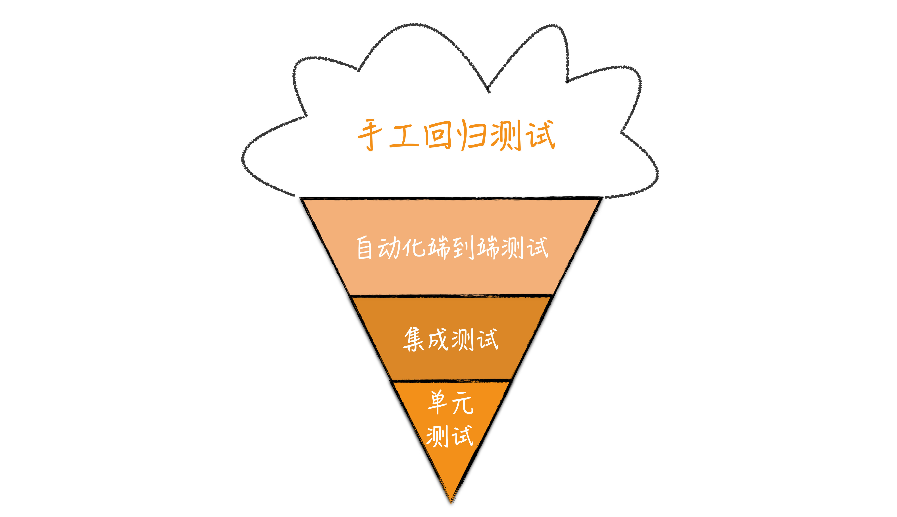
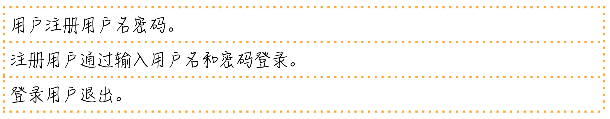
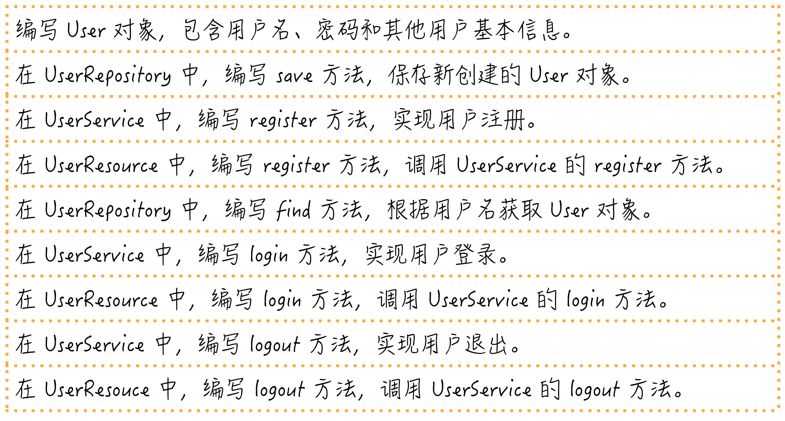
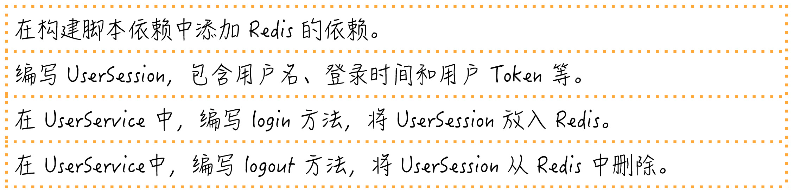
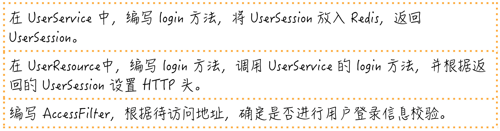
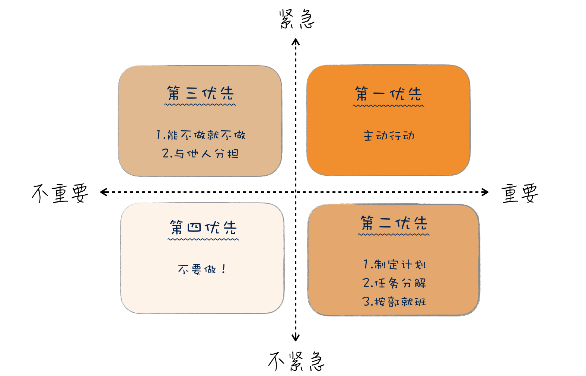

# 任务分解

动手做件事之前，请先对它进行任务分解。

多写单元测试。

我们应该编写可测的代码。

将任务拆小，越小越好。

按照 完整实现一个需求的顺序去安排分解出来的任务。

要想写好测试，就要写简单的测试。

想要管理好需求，先把需求拆小。

尽量做最重要的事。

做好产品开发，最可行的方式是采用MVP。


# 向埃隆·马斯克学习任务分解（开始任务分解）

这次我们从一个宏大的话题开始：银河系中存在多少与我们相近的文明。我想，即便这个专栏的读者主力是程序员这个平均智商极高的群体，在面对这样一个问题时，大多数人也不知道从何入手。

我来做一个科普，给大家介绍一下德雷克公式，这是美国天文学家法兰克·德雷克（Frank Drake）于 1960 年代提出的一个公式，用来推测“可能与我们接触的银河系内外星球高等文明的数量”。

下面，我要放出德雷克公式了，看不懂一点都不重要，反正我也不打算讲解其中的细节，我们一起来感受一下。


不知道你看了德雷克公式做何感想，但对于科学家们来说，德雷克公式最大的作用在于：**它将一个原本毫无头绪的问题分解了，分成若干个可以尝试回答的问题。**

随着观测手段的进步，我们对宇宙的了解越来越多，公式中大多数数值，都可以得到一个可以估算的答案。有了这些因子，人们就可以估算出银河系内可以与我们通信的文明数量。

虽然不同的估算结果会造成很大的差异，而且我们迄今为止也没能找到一个可以联系的外星文明，但这个公式给了我们一个方向，一个尝试解决问题的手段。

好吧，我并不打算将这个专栏变成一个科普专栏，之所以在这讲解德雷克公式，因为它体现了一个重要的思想：任务分解。

通过任务分解，一个原本复杂的问题，甚至看起来没有头绪的问题，逐渐有了一个通向答案的方向。而“任务分解”就是我们专栏第二模块的主题。


## 马斯克的任务分解

如果大家对德雷克公式有些陌生，我们再来看一个 IT 人怎样用任务分解的思路解决问题。

我们都知道埃隆·马斯克（Elon Musk），他既是电动汽车公司特斯拉（Tesla）的创始人，同时还创建了太空探索公司 SpaceX。SpaceX 有一个目标是，送 100 万人上火星。

美国政府曾经算过一笔账，把一个人送上火星，以现有技术是可实现的，需要花多少钱呢？答案是 100 亿美金。如果照此计算，实现马斯克的目标，送 100 万人上火星就要 1 万万亿。这是什么概念呢？这笔钱相当于美国 500 年的 GDP，实在太贵了，贵到连美国政府都无法负担。

马斯克怎么解决这个问题呢？他的目标变了，他准备把人均费用降到 50 万美元，也就是一个想移民的人，把地球房子卖了能够凑出的钱。原来需要 100 亿美金，现在要降到 50 万美金，需要降低 2 万倍。

当然，降低 2 万倍依然是一个听起来很遥远的目标。所以，我们关注的重点来了：马斯克的第二步是，把 2 万分解成 20×10×100。这是一道简单的数学题，也是马斯克三个重点的努力方向。

**先看“20”：现在的火星飞船一次只能承载 5 个人，马斯克的打算是，把火箭造大一点，一次坐 100 人，这样，就等于把成本降低 20 倍。**如果你关注新闻的话，会发现 SpaceX 确实在进行这方面的尝试，

**再来看“10”：马斯克认为自己是私营公司，效率高，成本可以降到十分之一。**他们也正在向这个方向努力，SpaceX 的成本目前已经降到了同行的五分之一。

**最后的“100”是什么呢？就是回收可重复使用的火箭。**如果这个目标能实现，发射火箭的成本就只是燃料成本了。这也就是我们频频看到的 SpaceX 试飞火箭新闻的原因。

这么算下来，你是不是觉得，马斯克的目标不像最开始听到的那样不靠谱了呢？**正是通过将宏大目标进行任务分解，马斯克才能将一个看似不着边际的目标向前推进。**


## 软件开发的任务分解

好了，和大家分享这两个例子只是为了热热身，说明人类解决问题的方案是差不多的。当一个复杂问题摆在面前时，我们解决问题的一个主要思路是分而治之。

**一个大问题，我们都很难给出答案，但回答小问题却是我们擅长的。**所以，当我们学会将问题分解，就相当于朝着问题的解决迈进了一大步。

我们最熟悉的分而治之的例子，应该是将这个理念用在算法上，比如归并排序。将待排序的元素分成大小基本相同的两个子集，然后，分别将两个子集排序，最后将两个排好序的子集合并到一起。

一说到技术，大家就觉得踏实了许多，原来无论是外星人搜寻，还是大名鼎鼎的马斯克太空探索计划，解决问题时用到的思路都是大同小异啊！确实是这样。

**那么，用这种思路解决问题的难点是什么呢？给出一个可执行的分解。**

在前面两个例子里面，最初听到要解决的问题时，估计你和我一样，是一脸懵的。但一旦知道了分解的结果，立即会有一种“柳暗花明又一村”的感觉。你会想，我要是想到了这个答案，我也能做一个 SpaceX 出来。

但说到归并排序的时候，你的心里可能会有一丝不屑，这是一个学生级别的问题，甚至不值得你为此费脑子思考。因为归并排序你已经知道了答案，所以，你会下意识地低估它。

任务分解就是这样一个有趣的思想，一旦分解的结果出来，到了可执行的步骤，接下来的工作，即便不是一马平川，也是比原来顺畅很多，因为问题的规模小了。

在日常工作中，我们会遇到很多问题，既不像前两个问题那样宏大，也不像归并排序那样小，但很多时候，我们却忘记了将任务分解这个理念运用其中，给工作带来很多麻烦。

举一个例子，有一个关于程序员的经典段子：这个工作已经做完了 80%，剩下的 20% 还要用和前面的一样时间。

为什么我们的估算差别如此之大，很重要的一个原因就在于没有很好地分解任务，所以，我们并不知道要做的事情到底有多少。

前面我们在[“为什么说做事之前要先进行推演？”](http://time.geekbang.org/column/article/76716)文章中，讲到沙盘推演，这也是一个很好的例子，推演的过程就是一个任务分解的过程。上手就做，多半的结果都是丢三落四。你会发现，真正把工作完全做好，你落掉的工作也都要做，无论早晚。

**与很多实践相反，任务分解是一个知难行易的过程。**知道怎么分解是困难的，一旦知道了，行动反而要相对来说容易一些。

在“任务分解”这个主题下，我还会给你介绍一些实践，让你知道，这些最佳实践的背后思想就是任务分解。如果你不了解这些实践，你也需要知道，在更多的场景下，先分解任务再去做事情是个好办法。

也许你会说，任务分解并不难于理解，我在解决问题的过程中也是先做任务分解的，但“依然过不好这一生。”这就要提到我前面所说难点中，很多人可能忽略的部分：可执行。

可执行对于每个人的含义是不同的，对于马斯克而言，他把 2 万分解成 20×10×100，剩下的事情对他来说就是可执行的，但如果你在 SpaceX 工作，你就必须回答每个部分究竟是怎样执行的。

同样，假设我们做一个 Web 页面，如果你是一个经验丰富的前端工程师，你甚至可能认为这个任务不需要分解，顶多就是再多一个获取网页资源的任务。

而我如果是一个新手，我就得把任务分解成：根据内容编写 HTML；根据页面原型编写页面样式；根据交互效果编写页面逻辑等几个步骤。

**不同的可执行定义差别在于，你是否能清楚地知道这个问题该如何解决。**

对于马斯克来说，他的解决方案可能是成立一个公司，找到这方面的专家帮助他实现。对你的日常工作来说，你要清楚具体每一步要做的事情，如果不能，说明任务还需要进一步分解。

比如，你要把一个信息存起来，假设你们用的是关系型数据库，对大多数人来说，这个任务分解就到了可执行的程度。但如果你的项目选用了一个新型的数据库，比如图数据库，你的任务分解里可能要包含学习这个数据库的模型，然后还要根据模型设计存储方案。

不过，在实际工作中，大多数人都高估了自己可执行粒度，低估任务分解的程度。换句话说，如果你没做过任务分解的练习，你分解出来的大部分任务，粒度都会偏大。

只有能把任务拆分得非常小，你才能对自己的执行能力有一个更清楚地认识，真正的高手都是有很强的分解能力。这个差别就相当于，同样观察一个物品，你用的是眼睛，而高手用的是显微镜。在你看来，高手全是微操作。关于这个话题，后面我们再来细聊。

一旦任务分解得很小，调整也会变得很容易。很多人都在说计划赶不上变化，而真正的原因就是计划的粒度太大，没法调整。

从当年的瀑布模型到今天的迭代模型，实际上，就是缩减一次交付的粒度。几周调整一次计划，也就不存在“计划赶不上变化”的情况了，因为我的计划也一直在变。

**如今软件行业都在提倡拥抱变化，而任务分解是我们拥抱变化的前提。**


## 总结时刻

我们从外星人探索和马斯克的火星探索入手，介绍了任务分解在人类社会诸多方面的应用，引出了分而治之这个人类面对复杂问题的基本解决方案。接着，我给你讲了这一思想在软件开发领域中的一个常见应用，分而治之的算法。

虽然我们很熟悉这一思想，但在日常工作中，我们却没有很好地应用它，这也使得大多数人的工作有很大改进空间。运用这一思想的难点在于，给出一个可执行的分解。

一方面，对复杂工作而言，给出一个分解是巨大的挑战；另一方面，面对日常工作，人们更容易忽略的是，分解的任务要可执行。每个人对可执行的理解不同，只要你清楚地知道接下来的工作该怎么做，任务分解就可以告一段落。

大多数人对于可执行的粒度认识是不足的，低估了任务分解的程度，做到好的分解你需要达到“微操作”的程度。有了分解得很小的任务，我们就可以很容易完成一个开发循环，也就让计划调整成为了可能。软件行业在倡导拥抱变化，而任务分解是拥抱变化的前提。

如果今天的内容你只记住一件事，那么请记住：**动手做一个工作之前，请先对它进行任务分解。**

最后，我想请你回想一下，你在实际工作中，有哪些依靠任务分解的方式解决的问题呢？欢迎在留言区写下你的想法。


# 测试也是程序员的事吗？（多写单元测试）

在“任务分解”这个模块，我准备从一个让我真正深刻理解了任务分解的主题开始，这个主题就是“测试”。

这是一个让程序员又爱有恨的主题，爱测试，因为它能让项目的质量有保证；恨测试，因为测试不好写。而实际上，很多人之所以写不好测试，主要是因为他不懂任务分解。

在上一个模块，我们提到了一些最佳实践，但都是从“以终为始”这个角度进行讲解的。这次，我准备换个讲法，用五讲的篇幅，完整地讲一下“开发者测试”，让你和我一起，重新认识这个你可能忽视的主题。

准备好了吗？我们先从让很多人疑惑的话题开始：程序员该写测试吗？


## 谁要做测试？

你是一个程序员，你当然知道为什么要测试，因为是我们开发的软件，我们得尽可能地保证它是对的，毕竟最基本的职业素养是要有的。

但测试工作应该谁来做，这是一个很有趣的话题。很多人凭直觉想到的答案是，测试不就该是测试人员的事吗，这还用问？

**测试人员应该做测试，这是没错的，但是测试只是测试人员的事吗？**

事实上，作为程序员，你多半已经做了很多测试工作。比如，在提交代码之前，你肯定会把代码跑一遍，保证提交的基本功能是正确的，这就是最基本的测试。但通常，你并不把它当成测试，所以，你的直觉里面，测试是测试人员的事。

但我依然要强调，测试应该是程序员工作的一部分，为什么这么说呢？

我们不妨想想，测试人员能测的是什么？没错，他们只能站在系统外部做功能特性的测试。而一个软件是由它内部诸多模块组成的，测试人员只从外部保障正确性，所能达到的效果是有限的。

打个比方，你做一台机器，每个零部件都不保证正确性，却要让最后的结果正确，这实在是一个可笑的要求，但这却真实地发生在软件开发的过程中。

在软件开发中有一个重要的概念：[软件变更成本，它会随着时间和开发阶段逐步增加。](http://www.agilemodeling.com/essays/costOfChange.htm)也就是说我们要尽可能早地发现问题，修正问题，这样所消耗掉的成本才是最低的。

上一个模块讲“以终为始”，就是在强调尽早发现问题。能从需求上解决的问题，就不要到开发阶段。同样，在开发阶段能解决的问题，就不要留到测试阶段。

你可以想一下，是你在代码中发现错误改代码容易，还是测试了报了 bug，你再定位找问题方便。

更理想的情况是，质量保证是贯穿在软件开发全过程中，从需求开始的每一个环节，都将“测试”纳入考量，每个角色交付自己的工作成果时，都多问一句，你怎么保证交付物的质量。

需求人员要确定验收标准，开发人员则要交出自己的开发者测试。这是一个来自于精益原则的重要思想：内建质量（Build Quality In）。

**所以，对于每个程序员来说，只有在开发阶段把代码和测试都写好，才有资格说，自己交付的是高质量的代码。**


## 自动化测试

不同于传统测试人员只通过手工的方式进行验证，程序员这个群体做测试有个天然的优势：会写代码，这个优势可以让我们把测试自动化。

早期测试代码，最简单的方式是另外写一个程序入口，我初入职场的时候，也曾经这么做过，毕竟这是一种符合直觉的做法。不过，既然程序员有写测试的需求，如此反复出现的东西，就会有更好的自动化方案。于是开始测试框架出现了。

最早的测试框架起源是 Smalltalk。这是一门早期的面向对象程序设计语言，它有很多拥趸，很多今天流行的编程概念就来自于 Smalltalk，测试框架便是其中之一。

真正让测试框架广泛流行起来，要归功于 Kent Beck 和 Erich Gamma。Kent Beck 是极限编程的创始人，在软件工程领域大名鼎鼎，而 Erich Gamma 则是著名的《设计模式》一书的作者，很多人熟悉的 Visual Studio Code 也有他的重大贡献。

有一次，二人一起从苏黎世飞往亚特兰大参加 OOPLSA（Object-Oriented Programming, Systems, Languages & Applications）大会，在航班上两个人结对编程写出了 JUnit。从这个名字你便不难看出，它的目标是打造一个单元测试框架。

顺便说一下，如果你知道 Kent Beck 是个狂热的 Smalltalk 粉丝，写过 SUnit 测试框架，就不难理解这两个人为什么能在一次航班上就完成这样的力作。

JUnit 之后，测试框架的概念逐渐开始流行起来。如今的“程序世界”，测试框架已经成为行业标配，每个程序设计语言都有自己的测试框架，甚至不止一种，一些语言甚至把它放到了标准库里，行业里也用 XUnit 统称这些测试框架。

**这种测试框架最大的价值，是把自动化测试作为一种最佳实践引入到开发过程中，使得测试动作可以通过标准化的手段固定下来。**


## 测试模型：蛋卷与金字塔

在前面的讨论里，我们把测试分为人工测试和自动化测试。即便我们只关注自动化测试，也可以按照不同的层次进行划分：将测试分成关注最小程序模块的单元测试、将多个模块组合在一起的集成测试，将整个系统组合在一起的系统测试。

有人喜欢把验收测试也放到这个分类里。为了简化讨论，我们暂时忽略验收测试。

随之而来的一个问题是，我们应该写多少不同层次的测试呢？理论上固然是越多越好了，但实际上，做任何事都是有成本的，所以，人们必须有所取舍。根据不同测试的配比，也就有了不同的测试模型。

有一种直觉的做法是，既然越高层的测试覆盖面越广，那就多写高层测试，比如系统测试。

当然，有些情景高层的测试不容易覆盖到的，所以，还要有一些底层的测试，比如单元测试。在这种情况下，底层的测试只是作为高层测试的补充，而主力就是高层测试。这样就会形成下面这样一种测试模型：冰淇淋蛋卷。



听说过冰淇淋蛋卷测试模型的人并不多，它是一种费时费力的模型，要准备高层测试实在是太麻烦了。

之所以要在这里提及它，是因为虽然这个概念很多人没听说过，但是有不少团队的测试实际采用的就是这样一种模型，这也是很多团队觉得测试很麻烦却不明就里的缘由。


接下来，要说说另一种测试模型，也是行业里的最佳实践：测试金字塔。


Mike Cohn 在自己的著作[《Succeeding with Agile》](http://book.douban.com/subject/5334585/)提出了测试金字塔，但大多数人都是通过 [Martin Fowler 的文章](http://martinfowler.com/bliki/TestPyramid.html)知道的这个概念。

从图中我们不难看出，它几乎是冰淇淋蛋卷的反转，测试金字塔的重点就是越底层的测试应该写得越多。

想要理解测试金字塔成为行业最佳实践的缘由，我们需要理解不同层次测试的差异。**越是底层的测试，牵扯到相关内容越少，而高层测试则涉及面更广。**

比如单元测试，它的关注点只有一个单元，而没有其它任何东西。所以，只要一个单元写好了，测试就是可以通过的；而集成测试则要把好几个单元组装到一起才能测试，测试通过的前提条件是，所有这些单元都写好了，这个周期就明显比单元测试要长；系统测试则要把整个系统的各个模块都连在一起，各种数据都准备好，才可能通过。

这个模块的主题是“任务分解”，我必须强调一点：**小事反馈周期短，而大事反馈周期长。**小事容易做好，而大事难度则大得多。所以，以这个标准来看，底层的测试才更容易写好。

另外，因为涉及到的模块过多，任何一个模块做了调整，都有可能破坏高层测试，所以，高层测试通常是相对比较脆弱的。

此外，在实际的工作中，有些高层测试会牵扯到外部系统，这样一来，复杂度又在不断地提升。

人们会本能地都会倾向于少做复杂的东西，所以，人们肯定不会倾向于多写高层测试，其结果必然是，高层测试的测试量不会太多，测试覆盖率无论如何都上不来。而且，一旦测试失败，因为牵扯的内容太多，定位起来也是非常麻烦的。

而反过来，将底层测试定义为测试主体，因为牵扯的内容少，更容易写，才有可能让团队得到更多的测试，而且一旦出现问题，也会更容易发现。

**所以，虽然冰淇淋蛋卷更符合直觉，但测试金字塔才是行业的最佳实践。**


## 当测试金字塔遇到持续集成

测试金字塔是一个重要实践的基础，它就是持续集成。当测试数量达到一定规模，测试运行的时间就会很长，我们可能无法在本地环境一次性运行所有测试。一般我们会选择在本地运行所有单元测试和集成测试，而把系统测试放在持续集成服务器上执行。

这个时候，底层测试的数量就成了关键，按照测试金字塔模型，底层测试数量会很多，测试可以覆盖主要的场景；而按照冰淇淋蛋卷模型，底层测试的数量则有限。

作为提交代码的防护网，测试数量多寡决定着得到反馈的早晚。所以，金字塔模型与持续集成天然就有着很好的配合。

需要特别注意的是，**不是用单元测试框架写的测试就是单元测试。**很多人用单元测试框架写的是集成测试或是系统测试。单元测试框架只是一个自动化测试的工具而已，并不是用来定义测试类型的。

在实际工作中，区分不同测试有很多种做法，比如，将不同的测试放到不同的目录下，或是给不同类型的测试一个统一的命名规范。

区分不同类型测试主要目的，主要是在不同的场景下，运行不同类型的测试。就像前面提到的做法是，在本地运行单元测试和集成测试，在持续集成服务器上运行系统测试。


## 总结时刻

测试是软件开发重要的组成部分，测试应该是软件开发团队中所有人的事，而不仅仅是测试人员的事。因为软件变更成本会随着时间和开发阶段逐步增加，能在早期解决的问题，就不要将它延后至下一个阶段。

在测试问题上，程序员有着天生的优势，会写代码，于是，程序员拥有了一个突出的强项，自动化测试。写测试应该是程序员工作完成的重要组成部分。

随着人们对于测试理解的加深，各种各样的测试都出现了，也开始有了**测试的分类：单元测试、集成测试、系统测试等等**。越在底层测试，成本越低，执行越快；越在高层测试，成本越高，执行越慢。

**人的时间和精力是有限的，所以，人们开始思考不同的测试如何组合。**在这个方面的最佳实践称之为测试金字塔，它强调的重点是，越底层的测试应该写得越多。**只有按照测试金字塔的方式写测试，持续集成才能更好地发挥作用。**

如果今天的内容你只能记住一件事，那请记住：**多写单元测试。**

最后，我想请你分享一下，你的团队在写测试上遇到哪些困难呢？欢迎在留言区写下你的想法。


# 什么阶段写测试（TDD）

在上一讲中，我向你说明了为什么程序员应该写测试，今天我准备与你讨论一下程序员应该在什么阶段写测试。

或许你会说，写测试不就是先写代码，然后写测试吗？没错，这是一个符合直觉的答案。但是，这个行业里确实有人探索了一些不同的做法。接下来，我们就将进入不那么直觉的部分。

既然自动化测试是程序员应该做的事，那是不是可以做得更极致一些，在写代码之前就把测试先写好呢？

有人确实这么做了，于是，形成了一种先写测试，后写代码的实践，这个实践的名字是什么呢？它就是测试先行开发（Test First Development）。

我知道，当我问出这个问题的时候，一个名字已经在很多人的脑海里呼之欲出了，那就是**测试驱动开发（Test Driven Development）**，也就是大名鼎鼎的 **TDD**，TDD 正是我们今天内容的重点。

在很多人看来，TDD 就是先写测试后写代码。在此我必须澄清一下，这个理解是错的。先写测试，后写代码的实践指的是测试先行开发，而非测试驱动开发。

下一个问题随之而来，测试驱动开发到底是什么呢？测试驱动开发和测试先行开发只差了一个词：驱动。只有理解了什么是驱动，才能理解了测试驱动开发。要理解驱动，先来看看这两种做法的差异。


## 测试驱动开发

学习 TDD 的第一步，是要记住 TDD 的节奏：“红 - 绿 - **重构**”。


红，表示写了一个新的测试，测试还没有通过的状态；绿，表示写了功能代码，测试通过的状态；而重构，就是再完成基本功能之后，调整代码的过程。

这里说到的“红和绿”，源自单元测试框架，测试不过的时候展示为红色，通过则是绿色。这在单元测试框架形成之初便已经约定俗成，各个不同语言的后代也将它继承了下来。

我们前面说过，**让单元测试框架流行起来的是 JUnit，他的作者之一是 Kent Beck。同样，也是 Kent Beck 将 TDD 从一个小众圈子带到了大众视野**。

考虑到 Kent Beck 是单元测试框架和 TDD 共同的贡献者，你就不难理解为什么 TDD 的节奏叫“红 - 绿 - 重构”了。

测试先行开发和测试驱动开发在第一步和第二步是一样的，先写测试，然后写代码完成功能。二者的差别在于，测试驱动开发并没有就此打住，它还有一个更重要的环节：**重构（refactoring）。**

也就是说，在功能完成而且测试跑通之后，我们还会再次回到代码上，处理一下代码上写得不好的地方，或是新增代码与旧有代码的重复。因为我们第二步“绿”的关注点，只在于让测试通过。

**测试先行开发和测试驱动开发的差异就在重构上。**

很多人通过了测试就认为大功告成，其实，这是忽略了新增代码代码可能带来的“坏味道（Code Smell）”。

如果你真的理解重构，你就知道，它就是一个消除代码坏味道的过程。一旦你有了测试，你就可以大胆地重构了，因为任何修改错误，测试会替你捕获到。

在测试驱动开发中，重构与测试是相辅相成的：没有测试，你只能是提心吊胆地重构；没有重构，代码的混乱程度是逐步增加的，测试也会变得越来越不好写。

**因为重构和测试的互相配合，它会驱动着你把代码写得越来越好。这是对“驱动”一词最粗浅的理解。**


## 测试驱动设计

接下来，我们再来进一步理解“驱动”：**由测试驱动代码的编写。**

许多人抗拒测试有两个主要原因：第一，测试需要“额外”的工作量。这里我特意把额外加上引号，因为，你也许本能上认为，测试是额外的工作，但实际上，测试也应该是程序员工作的一部分，这在上一篇文章中我已经讲过。

第二，很多人会觉得代码太多不好测。之所以这些人认为代码不好测，其中暗含了一个假设：代码已经写好了，然后，再写测试来测它。

如果我们把思路反过来，我有一个测试，怎么写代码能通过它。一旦你先思考测试，设计思路就完全变了：**我的代码怎么写才是能测试的，也就是说，我们要编写具有可测试性的代码。**用这个角度，测试是不是就变得简单了呢？


这么说还是有些抽象，我们举个写代码中**最常见的问题：static 方法。**

很多人写代码的时候喜欢使用 static 方法，因为用着省事，随便在哪段代码里面，直接引用这个 static 方法就可以。可是，一旦当你写测试的时候，你就会发现一个问题，如果你的代码里直接调用一个 static 方法，这段代码几乎是没法测的。尤其是这个 static 方法里面有一些业务逻辑，根据不同业务场景返回各种值。为什么会这样？

我们想想，常见的测试手法应该是什么样的？如果我们在做的是单元测试，那测试的目标应该就是一个单元，在这个面向对象作为基础设施流行的时代，这个单元大多是一个类。测试一个类，尤其是一个业务类，一般会涉及到一些与之交互的类。


比如，常见的 REST 服务三层架构中，资源层要访问服务层，而在服务层要访问数据层。编写服务层代码时，因为要依赖数据层。所以，测试服务层通常的做法是，做一个假的数据层对象，这样即便数据层对象还没有编写，依然能够把服务层写完测好。

在之前的“蛮荒时代”，我们通常会写一个假的类，模拟被依赖那个类，因为它是假的，我们会让它返回固定的值，使用这样的类创建出来的对象，我们一般称之为 Stub 对象。

这种“造假”的方案之所以可行，一个关键点在于，这个假对象和原有对象应该有相同的接口，遵循同样的契约。从设计上讲，这叫符合 Liskov 替换法则。这不是我们今天讨论的重点，就不进一步展开了。

因为这种“造假”的方案实在很常见，所以，有人做了框架支持它，就是常用的 Mock 框架。使用 Mock 对象，我们可以模拟出被依赖对象的各种行为，返回不同的值，抛出异常等等。

它之所以没有用原来 Stub 这个名字，是因为这样的 **Mock 对象往往有一个更强大的能力：验证这个 Mock 对象在方法调用过程中的使用情况，比如调用了几次。**


我们回到 static 的讨论上，你会发现 Mock 对象的做法面对 static 时行不通了。因为它跳出了对象体系，static 方法是没法继承的，也就是说，没法用一系列面向对象的手法处理它。你没有办法使用 Mock 对象，也就不好设置对应的方法返回值。

要想让这个方法返回相应的值，你必须打开这个 static 方法，了解它的实现细节，精心地按照里面的路径，小心翼翼地设置对应的参数，才有可能让它给出一个你预期的结果。

更糟糕的是，因为这个方法是别人维护的，有一天他心血来潮修改了其中的实现，你小心翼翼设置的参数就崩溃了。而要重新进行设置的话，你只能把代码重读一遍。

如此一来，你的工作就退回到原始的状态。更重要的是，它并不是你应该关注的重点，这也不会增加你的 KPI。显然，你跑偏了。

讨论到这里你已经知道了 static 方法对测试而言，并不友好。所以，如果你要想让你的代码更可测，**一个好的解决方案是尽量不写 static 方法。**

这就是“从测试看待代码，而引起的代码设计转变”的一个典型例子。

关于 static 方法，我再补充几点。**static 方法从本质上说，是一种全局方法，static 变量就是一种全局变量。我们都知道，全局方法也好，全局变量也罢，都是我们要在程序中努力消除的。一旦放任 static 的使用，就会出现和全局变量类似的效果，你的程序崩溃了，因为别人在另外的地方修改了代码，代码变得脆弱无比。**

static 是一个方便但邪恶的东西。所以，要限制它的使用。除非你的 static 方法是不涉及任何状态而且行为简单，比如，判断字符串是否为空。否则，不要写 static 方法。你看出来了，这样的 static 方法更适合做库函数。所以，我们日常写应用时，能不用尽量不用。

前面关于 static 方法是否可以 Mock 的讨论有些绝对，市面上确实有某些框架是可以 Mock static 方法的，但我不建议使用这种特性，因为它不是一种普遍适用的解决方案，只是某些特定语言特定框架才有。

更重要的是，正如前面所说，它会在设计上将你引到一条不归路上。


如果你在自己的代码遇到第三方的 static 方法怎么办，很简单，将第三方代码包装一下，让你的业务代码面对的都是你自己的封装就好了。

以我对大多数人编程习惯的认知，上面这个说法是违反许多人编程直觉的，但如果你从代码是否可测的角度分析，你就会得到这样的结论。

先测试后写代码的方式，会让你看待代码的角度完全改变，甚至要调整你的设计，才能够更好地去测试。所以，很多懂 TDD 的人会把 TDD 解释为测试驱动设计（Test Driven Design）。


还有一个典型的场景，**从测试考虑会改变的设计，那就是依赖注入（Dependency Injection）。**

不过，因为 Spring 这类 DI 容器的流行，现在的代码大多都写成了符合依赖注入风格的代码。原始的做法是直接 new 一个对象，这是符合直觉的做法。但是，你也可以根据上面的思路，自己推演一下，从 new 一个对象到依赖注入的转变。

有了编写可测试代码的思路，即便你不做 TDD，依然对你改善软件设计有着至关重要的作用。所以，**写代码之前，请先想想怎么测。**

即便我做了调整，是不是所有的代码就都能测试了呢？不尽然。从我个人的经验上看，不能测试的代码往往是与第三方相关的代码，比如访问数据库的代码，或是访问第三方服务之类的。但不能测试的代码已经非常有限了。我们将它们隔离在一个小角落就好了。

至此，我们已经从理念上讲了怎样做好 TDD。有的人可能已经跃跃欲试了，但更多的人会用自己所谓的“经验”告诉你，TDD 并不是那么好做的。

怎么做好 TDD 呢？下一讲，我会给你继续讲解，而且，我们“任务分解大戏”这个时候才开始真正拉开大幕！


## 总结时刻

一些优秀的程序员不仅仅在写测试，还在探索写测试的实践。有人尝试着先写测试，于是，有了一种实践叫测试先行开发。

还有人更进一步，一边写测试，一边调整代码，这叫做测试驱动开发，也就是 TDD。

从步骤上看，关键差别就在，**TDD 在测试通过之后，要回到代码上，消除代码的坏味道。**

测试驱动开发已经是行业中的优秀实践，学习测试驱动开发的第一步是，记住测试驱动开发的节奏：红——绿——重构。把测试放在前面，还带来了视角的转变，要编写可测的代码，为此，我们甚至需要调整设计，所以，有人也把 TDD 称为测试驱动设计。

如果今天的内容你只能记住一件事，那请记住：**我们应该编写可测的代码。**

最后，我想请你分享一下，你对测试驱动开发的理解是怎样的呢？学习过这篇内容之后，你又发现了哪些与你之前理解不尽相同的地方呢？欢迎在留言区写下你的想法。


# 任务分解（越小越好）

前面我和大家分享了 TDD 的来龙去脉，那些尚未将 TDD 烂熟于胸的同学会分为两个派别。一派是摩拳擦掌，准备动手实践一番；另一派是早就自我修炼过，但实践之路不通。所以，市面上经常会听到有人说，TDD 不实用。

但是 TDD 真的不实用吗？

和任何一门技能一样，TDD 也是需要练习的。更重要的是，你需要打通 TDD 的“任督二脉”，而这关键正是我们这个模块的主题：任务分解。而且，在今天的内容中，我还将带你领略大师级程序员的工作风范。让我们开始吧！


## TDD 从何而来？

要学最原汁原味的 TDD ，莫过于从源头学起。

从前 TDD 只在小圈子里流行，真正让它在行业里广为人知的是 Kent Beck 那本知名的软件工程之作[《解析极限编程》](http://book.douban.com/subject/6828074/)（Extreme Programming Explained）。这是一本重要的作品，它介绍了一种软件开发方法：[极限编程](http://en.wikipedia.org/wiki/Extreme_programming)。

当年他写作之时，许多人都在努力探寻瀑布开发方法之外的软件工程方法，除了极限编程，还有[特征驱动开发](http://en.wikipedia.org/wiki/Feature-driven_development)、[水晶开发方法](http://en.wikiversity.org/wiki/Crystal_Methods)等等，正是这些开发方法的探索，才有了后面敏捷方法的诞生。

极限编程对于行业最大的贡献在于，它引入了大量的实践，比如，前面提到过的持续集成、这里提到的 TDD，还有诸如结对编程、现场客户等等。

极限编程之所以叫“极限”，它背后的理念就是把好的实践推向极限。

前面提到持续集成时，我们已经介绍过这个理念，如果集成是好的，我们就尽早集成，推向极限每一次修改都集成，这就是持续集成。

如果开发者测试是好的，我们就尽早测试，推向极限就是先写测试，再根据测试调整代码，这就是测试驱动开发。

如果代码评审是好的，我们就多做评审，推向极限就是随时随地地代码评审，这就是结对编程。

如果客户交流是好的，我们就和客户多交流，推向极限就是客户与开发团队时时刻刻在一起，这就是现场客户。这种极限思维是一种很好的思考问题方式，推荐你也在工作中尝试使用一下。

虽然 TDD 只是《解析极限编程》介绍的诸多实践的一种，它却是与开发人员关系最为密切的一个实践。

随着 TDD 逐渐流行开来，人们对如何做 TDD 也越来越感兴趣，于是，Kent Beck 又专门为 TDD 写了一本书，叫[《测试驱动开发》](http://book.douban.com/subject/1230036/)。


## 大师级程序员的秘笈

《测试驱动开发》这本书很有意思。如果你只是为了了解 TDD，这本书可能很无聊。Kent Beck 在第一部分只是在写一个功能，写完一段又写一段。

这本书我看过两遍，第一遍觉得平淡无奇，这种代码我也能写。第二遍看懂他的思路时，我几乎是震惊的感觉，因为它完全是在展示 Kent Beck 的工作方式。这也是我把 TDD 放到这个部分来讲的重要原因，Kent Beck 在做的就是任务分解。任务分解，也是这本书的真正价值所在。

当时，我已经工作了很多年，自以为自己在写代码上已经很专业了。看懂 Kent Beck 的思路，我才知道，与他相比，我还不够专业。

Kent Beck 是怎么做的呢？每当遇到一件要做的事，Kent Beck 总会先把它分解成几个小任务，记在一个清单上，然后，才是动手写测试、写代码、重构这样一个小循环。等一个循环完成了，他会划掉已经做完的任务，开始下一个。

一旦在解决问题的过程中遇到任何新的问题，他会把这个要解决的问题记录在清单上，保证问题不会丢失，然后，继续回到自己正在处理的任务上。当他把一个个任务完成的时候，问题就解决完了。

你或许会纳闷，这有什么特别的吗？你不妨回答这样一个问题，你多长时间能够提交一次代码？如果你的答案超过半天，对不起，你的做法步子一定是太大了。你之所以不能小步提交，一定是牵扯了太多相关的部分。

**Kent Beck 的做法清晰而有节奏，每个任务完成之后，代码都是可以提交的。**看上去很简单，但这是大多数程序员做不到的。

只有把任务分解到很小，才有可能做到小步提交。你能把任务分解到很小，其实是证明你已经想清楚了。**而大多数程序员之所以开发效率低，很多时候是没想清楚就动手了。**

我在 ThoughtWorks 工作时，每个人都会有个 Sponsor，类似于工厂里师傅带徒弟的关系。我当时的 Sponsor 是 ThoughtWorks 现任的 CEO 郭晓，他也是写代码出身的。有一次，他给我讲了他和 Wiki 的发明者 Ward Cunningham 一起结对编程的场景。

Ward 每天拿到一个需求，他并不急于写代码，而是和郭晓一起做任务分解，分解到每个任务都很清晰了，才开始动手做。接下来就简单了，一个任务一个任务完成就好了。

当时，郭晓虽然觉得工作节奏很紧张，但思路则是非常清晰的。有时，他也很奇怪，因为在开始工作之前，他会觉得那个问题非常难以解决。结果一路分解下来，每一步都是清晰的，也没遇到什么困难就完成了。

之所以这里要和你讲 Ward Cunningham 的故事，因为他就是当年和 Kent Beck 在同一个小圈子里一起探讨进步的人，所以，在解决问题的思路上，二人如出一辙。

为什么任务分解对于 TDD 如此重要呢？因为只有当任务拆解得足够小了，你才能知道怎么写测试。

**很多人看了一些 TDD 的练习觉得很简单，但自己动起手来却不知道如何下手。中间就是缺了任务分解的环节。**

任务分解是个好习惯，但想要掌握好它，大量的练习是必须的。我自己也着实花不少时间进行练习，每接到一个任务，我都会先做任务分解，想着怎么把它拆成一步一步可以完成的小任务，之后再动手解决。


## 微操作

随着我在任务分解上练习的增多，我越发理解任务分解的关键在于：**小。**

小到什么程度呢？有时甚至可以小到你可能认为这件事不值得成为一件独立的事。比如升级一个依赖的版本，做一次变量改名。

这样做的好处是什么呢？它保证了我可以随时停下来。

我曾在一本书里读到过关于著名高尔夫球手“老虎”伍兹的故事。高尔夫球手在打球的时候，可能会受到一些外界干扰。一般情况下还好，如果他已经开始挥杆，这时候受到了干扰，一般选手肯定是继续把杆挥下去，但通常的结果是打得不理想。

而伍兹遇到这种情况，他会停下来，重新做挥杆的动作，保证了每一杆动作的标准。

伍兹能停下来，固然是经过了大量的练习，但还有一个关键在于，对于别人而言，挥杆击球是一个动作，必须一气呵成。而对伍兹来说，这个动作是由若干小动作组成的，他只不过是刚好完成了某个小动作，而没有做下一个小动作而已。

换句话说，大家同样都是完成一个原子操作，只不过，伍兹的原子操作比其他人的原子操作小得多。

同样，我们写程序的时候，都不喜欢被打扰，因为一旦被打扰，接续上状态需要很长一段时间，毕竟，我们可不像操作系统那么容易进行上下文切换。

但如果任务足够小，完成一个任务，我们选择可以进入到下一个任务，也可以停下来。这样，即便被打扰，我们也可以很快收尾一个任务，不致于被影响太多。

其实，这种极其微小的原子操作在其他一些领域也有着自己的应用。有一种实践叫微习惯，以常见的健身为例，很多人难以坚持，主要是人们一想到健身，就会想到汗如雨下的健身场景，想想就放弃了。

但如果你一次只做一个俯卧撑呢？对大多数人来说，这就不是很难的一件事，那就先做一个。做完了一个如果你还想做，就接着做，不想做就不做了。

一个俯卧撑？你会说这也叫健身，一个俯卧撑确实是一个很小的动作，重要的是，一个俯卧撑是你可以坚持完成的，如果每天做 10 个，恐怕这都是大多数人做不到的。我们知道，养成一个习惯，最难的是坚持。**如果你有了一个微习惯，坚持就不难了。**

我曾经在 github 上连续提交代码 1000 天，这是什么概念？差不多三年的时间里，每天我都能够坚持写代码，提交代码，这还不算工作上写的代码。

对于大多数人来说，这是不可思议的。但我坚持做到了，不是因为我有多了不起，而是我养成了自己的微习惯。

这个连续提交的基础，就是我自己在练习任务分解时，不断地尝试把一件事拆细，这样，我每天都至少能保证完成一小步。当然，如果有时间了，我也会多写一点。正是通过这样的方法，我坚持了 1000 天，也熟练掌握了任务分解的技巧。

**一个经过分解后的任务，需要关注的内容是有限的，我们就可以针对着这个任务，把方方面面的细节想得更加清晰。**很多人写代码之所以漏洞百出，一个重要的原因就是因为任务粒度太大。

我们作为一个普通人，能考虑问题的规模是有限的，也就很难方方面面都考虑仔细。


## 微操作与分支模型

经过这种练习之后，任务分解也就成了我的本能，不再局限于写程序上。我遇到任何需要解决的问题，脑子里的第一反应一定是，它可以怎么一步一步地完成，确定好分解之后，解决问题就是一步一步做了。

如果不能很好地分解，那说明我还没想清楚，还需要更多信息，或者需要找到更好的解决方案。

一旦你懂得了把任务分解的重要性，甚至通过训练能达到微操作的水准，你就很容易理解一些因为步子太大带来的问题。举一个在开发中常见的问题，代码开发的分支策略。

关于分支策略，行业里有很多不同的做法。有的团队是大家都在一个分支上写代码，有的是每个人拉出一个分支，写完了代码再合并回去。你有没有想过为什么会出现这种差异呢？

**行业中的最佳实践是，基于主分支的模型。**大家都在同一个分支上进行开发，毕竟拉分支是一个麻烦事，虽然 git 的出现极大地降低了拉分支的成本。

但为什么还有人要拉出一个分支进行开发呢？多半的原因是他**写的代码太多了，改动量太大，很难很快地合到开发的主分支上来。**

那下一个问题就来了，为什么他会写那么多代码，没错，**答案就是步子太大了。**

如果你懂得任务分解，每一个分解出来的任务要改动的代码都不会太多，影响都在一个可控的范围内，代码都可以很快地合并到开发的主分支上，也就没有必要拉分支了。

在我的实际工作中，我带的团队基本上都会采用基于主分支的策略。只有在做一些实验的时候，才会拉出一个开发分支来，但它并不是常态。


## 总结时刻

TDD 在很多人眼中是不实用的，一来他们并不理解测试“驱动”开发的含义，但更重要的是，他们很少会做任务分解。而任务分解是做好 TDD 的关键点。只有把任务分解到可以测试的地步，才能够有针对性地写测试。

同样听到任务分解这个说法，不同的人理解依然是不一样的。我把任务分解的结果定义成微操作，它远比大多数人理解得小。我们能将任务分解到多小，就决定了我们原子操作的粒度是多大。软件开发中的许多问题正是由于粒度太大造成的，比如，分支策略。

如果今天的内容你只能记住一件事，那请记住：**将任务拆小，越小越好。**

最后，我想请你分享一下，你身边是否有一些由于任务分解得不够小带来的问题。欢迎在留言区写下你的想法。


# 用户登录任务分解（按照完整需求去分解任务）

前面在讨论 TDD 的时候，我们说任务分解是 TDD 的关键。但这种认识依然是一种感性上的认识。今天，我们就来用一个更加具体的例子，让你看看任务分解到底可以做到什么程度。


## 用户登录任务分解实战

这个例子就是最简单的**用户登录。需求很简单，用户通过用户名密码登录。**

我相信，实现这个功能对大家来说并不困难，估计在我给出这个题目的时候，很多人脑子里已经开始写代码了。今天主要就是为了带着大家体验一下任务分解的过程，看看怎样将一个待实现的需求一步步拆细，变成一个个具体可执行的任务。

要完成这个需求，最基本的任务是用户通过输入用户名和密码登录。


用户名和密码登录这个任务很简单，但我们在第一部分讲过沙盘推演，只要推演一下便不难发现，这不是一个完整的需求。


用户名和密码是哪来的呢？它们可能是用户设置的，也可能是由系统管理员设置的。这里我们就把它们简单设定成由用户设定。另外，有用户登录，一般情况下，还会有一个退出的功能。好了，这才是一个简单而完整的需求。我们就不做进一步的需求扩展。

所以，我们要完成的需求列表是下面这样的。



假设我们就是拿到这个需求列表的程序员，要进行开发。我们先要分析一下要做的事情有哪些，也就是任务分解。到这里，你可以先暂停一会，尝试自己分解任务，之后，再来对比我后面给出分解的结果，看看差异有多少。

好，我们继续。


我们先来决定一下技术方案，就用最简单的方式实现，在数据库里建一张表保存用户信息。一旦牵扯到数据库表，就会涉及到数据库迁移，所以，有了下面的任务。


数据库的内容准备好了，接下来，就轮到编写代码的准备上了。我们准备用常见的 **REST 服务对外提供访问**。这里就采用最**常规的三层技术架构，所以，一般要编写下面几项内容。**

- **领域对象，这里就是用户。**
- **数据访问层，在不同的项目里面叫法不一，有人从 J2EE 年代继承下来叫 DAO（数据访问对象，Data Access Obejct），有人跟着 Mybatis 叫 mapper，我现在更倾向于使用领域驱动设计的术语，叫 repository。**
- **服务层，提供对外的应用服务，完成业务处理。**
- **资源层，提供 API 接口，包括外部请求的合法性检查。**

根据这个结构，就可以进一步拆解我们的开发任务了。




不知道你有没有注意到，我的**任务清单上列任务的顺序，是按照一个需求完整实现的过程。**

比如，第一部分就是一个完整的用户注册过程，先写 User，然后是 UserRepository 的 save 方法，接着是 UserService 的 register 方法，最后是 UserResource 的 register 方法。等这个需求开发完了，才是 login 和 logout。

**很多人可能更习惯一个类一个类的写，我要说，最好按照一个需求、一个需求的过程走，这样，任务是可以随时停下来的。**

比如，同样是只有一半的时间，我至少交付了一个完整的注册过程，而按照类写的方法，结果是一个需求都没完成。这只是两种不同的安排任务的顺序，我更支持按照需求的方式。


我们继续任务分解的讨论。任务分解到这里，需要看一下这几个任务有哪个不好实现。register 只是一个在数据库中存储对象的过程，没问题，但 login 和 logout 呢？

考虑到我们在**做的是一个 REST 服务，这个服务可能是分布到多台机器上，请求到任何一台都能提供同样的服务，我们需要把登录信息共享出去。**

这里我们就采用最**常见的解决方案：用 Redis 共享数据。**登录成功的话，就需要把用户的 Session 信息放到 Redis 里面，退出的话，就是删除 Session 信息。在我们的任务列表里，并没有出现 Session，所以，需要引入 Session 的概念。任务调整如下。




如果采用 Redis，我们还需要**决定一下在 Redis 里存储对象的方式**，我们可以用原生的 Java 序列化，但一般在开发中，我们会选择一个文本化的方式，这样维护起来更容易。这里选择常见的 **JSON**，所以，任务就又增加了两项。


至此，最基本的登录退出功能已经实现了，但我们需要问一个问题，这就够了吗？之所以要登录，通常是要限定用户访问一些资源，所以，我们还需要一些**访问控制的能力。**

简单的做法就是加入一个 filter，在请求到达真正的资源代码之前先做一层过滤，在这个 filter 里面，如果待访问的地址是需要登录访问的，我们就看看用户是否已经登录，现在**一般的做法是用一个 Token，这个 Token 一般会从 HTTP 头里取出来。**但这个 Token 是什么时候放进去的呢？答案显然是登录的时候。所以，我们继续调整任务列表。



至此，我们已经比较完整地实现了一个用户登录功能。当然，要在真实项目中应用，需求还是可以继续扩展的。比如：用户 Session 过期、用户名密码格式校验、密码加密保存以及刷新用户 Token 等等。


这里主要还是为了说明任务分解，相信如果需求继续扩展，根据上面的讨论，你是有能力进行后续分解的。

来看一下分解好的任务清单，你也可以拿出来自己的任务清单对比一下，看看差别有多大。


首先要说明的是，任务分解没有一个绝对的标准答案，分解的结果根据个人技术能力的不同，差异也会很大。

**检验每个任务项是否拆分到位，就是看你是否知道它应该怎么做了。**不过，即便你技术能力已经很强了，我依然建议你把任务分解到很细，**观其大略人人行，细致入微见本事。**


也许你会问我，我在写代码的时候，也会这么一项一项地把所有任务都写下来吗？实话说，我不会。因为任务分解我在之前已经训练过无数次，已经习惯怎么一步一步地把事情做完。换句话说，任务清单虽然我没写下来，但已经在我脑子里了。

不过，我会**把想到的，但容易忽略的细节写下来，因为任务清单的主要作用是备忘录。**一般情况下，主流程我们不会遗漏，但各种细节常常会遗漏，所以，想到了还是要记下来。

另外，对比我们在分解过程中的顺序，你会看到这个完整任务清单的顺序是调整过的，你可以按照这个列表中的内容一项一项地做，调整最基本的标准是，按照这些任务的依赖关系以及前面提到的“完整地实现一个需求”的原则。


最后，我要特别强调的一点，所有分解出来的任务，都是独立的。也就是说，**每做完一个任务，代码都是可以提交的。**只有这样，我们才可能做到真正意义上的小步提交。

如果今天的内容你只能记住一件事，那请记住：**按照完整实现一个需求的顺序去安排分解出来的任务。**

最后，我想请你分享一下，你的任务清单和我的任务清单有哪些差异呢？欢迎在留言区写下你的想法。


# 怎么写测试（写简单的测试）

关于测试，我们前面讲了很多，比如：开发者应该写测试；要写可测的代码；要想做好 TDD，先要做好任务分解，我还带你进行了实战操作，完整地分解了一个任务。

但有一个关于测试的重要话题，我们始终还没聊，那就是测试应该写成什么样。今天我就来说说怎么把测试写好。

你或许会说，这很简单啊，前面不都讲过了吗？不就是用测试框架写代码吗？其实，理论上来说，还真应该就是这么简单，但现实情况却往往相反。我看到过很多团队在测试上出现过各种各样的问题，比如：

- 测试不稳定，这次能过，下次过不了；
- 有时候是一个测试要测的东西很简单，测试周边的依赖很多，搭建环境就需要很长的时间；
- 这个测试要运行，必须等到另外一个测试运行结束；
- ……

如果你也在工作中遇到过类似的问题，那你理解的写测试和我理解的写测试可能不是一回事，那问题出在哪呢？

为什么你的测试不够好呢？

**主要是因为这些测试不够简单。只有将复杂的测试拆分成简单的测试，测试才有可能做好。**


## 简单的测试

测试为什么要简单呢？有一个很有趣的逻辑，不知道你想没想过，测试的作用是什么？显然，它是用来保证代码的正确性。随之而来的一个问题是，谁来保证测试的正确性？

许多人第一次面对这个问题，可能会一下子懵住，但脑子里很快便会出现一个答案：测试。但是，你见有人给测试写测试吗？肯定没有。因为一旦这么做，这个问题会随即上升，谁来保证那个测试的正确性呢？你总不能无限递归地给测试写测试吧。

既然无法用写程序的方式保证测试的正确性，我们只有一个办法：**把测试写简单，简单到一目了然，不需要证明它的正确性。**所以，如果你见到哪个测试写得很复杂，它一定不是一个好的测试。

既然说测试应该简单，我们就来看看一个简单的测试应该是什么样子。下面我给出一个简单的例子，你可以看一下。

```java
@Test
void should_extract_HTTP_method_from_HTTP_request() {
  // 前置准备
  request = mock(HttpRequest.class);
  when(request.getMethod()).thenReturn(HttpMethod.GET);
  HttpMethodExtractor extractor = new HttpMethodExtractor();
  
  // 执行
  HttpMethod method = extractor.extract(request);
  
  // 断言
  assertThat(method, is(HttpMethod.GET);
  
  // 清理
}
```

这个测试来自我的开源项目 [Moco](http://github.com/dreamhead/moco)，我稍做了一点调整，便于理解。这个测试很简单，从一个 HTTP 请求中提取出 HTTP 方法。

我把这段代码分成了四段，分别是**前置准备、执行、断言和清理**，这也是一般测试要具备的四段。

- 这几段的核心是中间的执行部分，它就是测试的目标，但实际上，它往往也是最短小的，一般就是一行代码调用。其他的部分都是围绕它展开的，在这里就是调用 HTTP 方法提取器提取 HTTP 方法。
- 前置准备，就是准备执行部分所需的依赖。比如，一个类所依赖的组件，或是调用方法所需要的参数。在这个测试里面，我们准备了一个 HTTP 请求，设置了它的方法是一个 GET 方法，这里面还用到了之前提到的 **Mock 框架**，因为完整地设置一个 HTTP 请求很麻烦，而且与这个测试也没什么关系。
- **断言是我们的预期，就是这段代码执行出来怎么算是对的。**这里我们判断了提取出来的方法是否是 GET 方法。另外补充一点，**断言并不仅仅是 assert，如果你用 Mock 框架的话，用以校验 mock 对象行为的 verify 也是一种断言。**
- 清理是一个可能会有的部分，如果你的测试用到任何资源，都可以在这里释放掉。不过，如果你利用好现有的测试基础设施（比如，JUnit 的 Rule），遵循好测试规范的话，很多情况下，这个部分就会省掉了。

怎么样，看着很简单吧，是不是符合我前面所说的不证自明呢？


## 测试的坏味道

有了对测试结构的了解，我们再来说说常见的测试“坏味道”。


首先是执行部分。不知道你有没有注意到，前面我提到执行部分时用了一个说法，一行代码调用。是的，第一个“坏味道”就来自这里。

很多人总想在一个测试里做很多的事情，比如，出现了几个不同方法的调用。请问，你的代码到底是在测试谁呢？

**这个测试一旦出错，就需要把所有相关的几个方法都查看一遍，这无疑是增加了工作的复杂度。**

也许你会问，那我有好几个方法要测试，该怎么办呢？很简单，**多写几个测试**就好了。


另一个典型“坏味道”的高发区是在断言上，请记住，**测试一定要有断言。**没有断言的测试，是没有意义的，就像你说自己是世界冠军，总得比个赛吧！

我见过不少人写了不少测试，但测试运行几乎从来就不会错。出于好奇，我打开代码一看，没有断言。

没有断言当然就不会错了，写测试的同事还很委屈地说，测试不好写，而且，他已经验证了这段代码是对的。就像我前面讲过的，测试不好写，往往是设计的问题，应该调整的是设计，而不是在测试这里做妥协。


还有一种常见的“坏味道”：**复杂**。最典型的场景是，当你看到测试代码里出现各种判断和循环语句，基本上这个测试就有问题了。

举个例子，测试一个函数，你的断言写在一堆 if 语句中，美其名曰，根据条件执行。还是前面提到的那个观点，你怎么保证这个测试函数写的是对的？除非你用调试的手段，否则，你都无法判断你的条件分支是否执行到了。

你或许会疑问，我有一大堆不同的数据要测，不用循环不用判断，我怎么办呢？**你真正应该做的是，多写几个测试，每个测试覆盖一种场景。**


## 一段旅程（A-TRIP）

怎么样的测试算是好的测试呢？有人做了一个总结 A-TRIP，这是五个单词的缩写，分别是

- **Automatic，自动化；**
- **Thorough，全面的；**
- **Repeatable，可重复的；**
- **Independent，独立的；**
- **Professional，专业的。**

下面，我们看看这几个单词分别代表什么意思。

**Automatic，自动化。**有了前面关于自动化测试的铺垫，这可能最好理解，就是把测试尽可能交给机器执行，人工参与的部分越少越好。

这也是我们在前面说，测试一定要有断言的原因，因为一个测试只有在有断言的情况下，机器才能自动地判断测试是否成功。


**Thorough，全面，应该尽可能用测试覆盖各种场景。**理解这一点有两个角度。一个是在写代码之前，要考虑各种场景：正常的、异常的、各种边界条件；另一个角度是，写完代码之后，我们要看测试是否覆盖了所有的代码和所有的分支，这就是各种测试覆盖率工具发挥作用的场景了。

当然，你想做到全面，并非易事，如果你的团队在补测试，一种办法是让测试覆盖率逐步提升。


**Repeatable，可重复的。**这里面有两个角度：某一个测试反复运行，结果应该是一样的，这说的是，每一个测试本身都不应该依赖于任何不在控制之下的环境。如果有，怎么办，想办法。

比如，如果有外部的依赖，就可以采用模拟服务的手段，我的 [Moco](http://github.com/dreamhead/moco) 就是为了解决外部依赖而生的，它可以模拟外部的 HTTP 服务，让测试变得可控。

有的测试会依赖数据库，那就在执行完测试之后，将数据库环境恢复，像 Spring 的测试框架就提供了测试数据库回滚的能力。如果你的测试反复运行，不能产生相同的结果，要么是代码有问题，要么是测试有问题。

理解可重复性，还有一个角度，一堆测试反复运行，结果应该是一样的。这说明测试和测试之间没有任何依赖，这也是我们接下来要说的测试的另外一个特点。


**Independent，独立的。**测试和测试之间不应该有任何依赖，什么叫有依赖？比如，如果测试依赖于外部数据库或是第三方服务，测试 A 在运行时在数据库里写了一些值，测试 B 要用到数据库里的这些值，测试 B 必须在测试 A 之后运行，这就叫有依赖。

我们不能假设测试是按照编写顺序运行的。比如，有时为了加快测试运行速度，我们会将测试并行起来，在这种情况下，顺序是完全无法保证的。如果测试之间有依赖，就有可能出现各种问题。

减少外部依赖可以用 mock，实在要依赖，每个测试自己负责前置准备和后续清理。如果多个测试都有同样的准备和清理呢？那不就是 setup 和 teardown 发挥作用的地方吗？测试基础设施早就为我们做好了准备。


**Professional，专业的。**这一点是很多人观念中缺失的，测试代码，也是代码，也要按照代码的标准去维护。这就意味着你的测试代码也要写得清晰，比如：良好的命名，把函数写小，要重构，甚至要抽象出测试的基础库，在 Web 测试中常见的 PageObject 模式，就是这种理念的延伸。


看了这点，你或许会想，你说的东西有点道理，但我的代码那么复杂，测试路径非常多，我怎么能够让自己的测试做到满足这些要求呢？

我必须强调一个之前讲测试驱动开发强调过的观点：**编写可测试的代码。**很多人写不好测试，或者觉得测试难写，关键就在于，你始终是站在写代码的视角，而不是写测试的视角。如果你都不重视测试，不给测试留好空间，测试怎么能做好呢？


## 总结时刻

测试是一个说起来很简单，但很不容易写好的东西。在实际工作中，很多人都会遇到关于测试的各种各样问题。之所以出现问题，主要是因为这些测试写得太复杂了。测试一旦复杂了，我们就很难保证测试的正确性，何谈用测试保证代码的正确性。

我给你讲了测试的基本结构：前置准备、执行、断言和清理，还介绍了一些常见的测试“坏味道”：做了太多事的测试，没有断言的测试，还有一种看一眼就知道有问题的“坏味道”，测试里有判断语句。

怎么衡量测试是否做好了呢？有一个标准：A-TRIP，这是五个单词的缩写，分别是 Automatic（自动化）、Thorough（全面）、Repeatable（可重复的）、Independent（独立的）和 Professional（专业的）。

如果今天的内容你只能记住一件事，那请记住：**要想写好测试，就要写简单的测试。**

最后，我想请你分享一下，经过最近持续对测试的讲解，你对测试有了哪些与之前不同的理解呢？欢迎在留言区写下你的想法。


# 需求的分解（把需求粒度拆小）

今天我们换个角度，看看需求的分解。是的，**需求也要分解。**

有一次，我和一个做开发的同事聊天，他给我讲了他近期的烦恼。

> **同事：**我们现在就是需求太多，开发的人太少，再这么干下去，哪天觉得自己抗不住了，我就拍拍屁股走人。
> **我：**你没尝试着砍砍需求？
> **同事：**怎么没尝试？产品的人都不同意。这批功能他们都说是关键功能。
> **我：**你有没有尝试把需求拆开了再砍呢？
> **同事：**还可以这样？

同事很惊讶，我一点都不意外。我们都是在说需求，但彼此对需求的理解却是大不相同。我先来问个问题，提到需求这个词，你会想到什么呢？

以我们用了好多次的登录为例，如果我问你这个需求是什么，大多数人的第一直觉还是用户名密码登录。

**基本上，闯入你脑海的需求描述是主题（epic），在敏捷开发中，有人称之为主用户故事（master story）。**

如果你对需求的管理粒度就是主题，那好多事情就没法谈了。比如，时间紧迫的时候，我想砍需求，你问产品经理，我不做登录行不行，你就等着被拒绝吧。

但是，如果你说时间比较紧，我能不能把登录验证码放到后面做，或是邮件地址验证的功能放到后面，这种建议产品经理是可以和你谈的。

这其中的差别就在于，后者将需求分解了。

大多数人可以理解需求是要分解的，但是，分解的程度不同，就是导致执行效果差异极大的根源。

以我的经验而言，**绝大多数问题都是由于分解的粒度太大造成的，少有因为粒度太小而出问题的。**所以，需求分解的一个原则是，粒度越小越好。


## 需求要分解

**“主题”只是帮你记住大方向，真正用来进行需求管理，还是要靠进一步分解出来的需求。**这里的讨论，我们会继续沿用前面专栏文章中已经介绍过的需求描述方式：用户故事，它将是我们这里讨论需求管理的基本单位。

如果你的团队用的是其他方式描述需求，你也可以找找是否有对应的管理方式。

上一个模块介绍“以终为始”，我们对用户故事的关注点主要在：用户故事一定要有验收标准，以确保一个需求的完整性。而在“任务分解”这个模块，我们看用户故事，则主要关注它作为需求分解的结果，也就是分拆出来要解决的一个个需求点。

在前面的讨论中，我们已经知道了用户故事的“长相”，但更重要的问题是，划分需求的方式有无数种，就像一块蛋糕，你可以横着切，也可以竖着切。如果你一刀不切，那就是拿着主题当用户故事。你也可以快刀飞起，把主题切碎。

每个人都会有自己喜欢的拆分方式，我相信知道拆分的重要性之后，你总会有办法的。这里，我主要想和你聊聊怎样评判拆分结果，毕竟我们要把它当作需求管理的基本单位。

只有细分的需求才能方便进行管理。什么样的需求才是一个好的细分需求呢？我们先来看看用户故事的衡量标准。


评价用户故事有一个“ **INVEST 原则**”，这是六个单词的缩写，分别是：

- **Independent，独立的。**一个用户故事应该完成一个独立的功能，尽可能不依赖于其它用户故事，因为彼此依赖的用户故事会让管理优先级、预估工作量都变得更加困难。如果真的有依赖，一种好的做法是，将依赖部分拆出来，重新调整。
- **Negotiable，可协商的。**有事大家商量是一起工作的前提，我们无法保证所有的细节都能 100% 落实到用户故事里，这个时候最好的办法是大家商量。它也是满足其它评判标准的前提，就像前面提到的，一个用户故事不独立，需要分解，这也需要大家一起商量的。
- **Valuable，有价值的。**一个用户故事都应该有其自身价值，这一项应该最容易理解，没有价值的事不做。但正如我们一直在说的那样，做任何一个事情之前，先问问价值所在。
- **Estimatable，可估算的。**我们会利用用户故事估算的结果安排后续的工作计划。不能估算的用户故事，要么是因为有很多不确定的因素，要么是因为需求还是太大，这样的故事还没有到一个能开发的状态，还需要产品经理进一步分析。
- **Small，小。**步子大了，不行。不能在一定时间内完成的用户故事只应该有一个结果，拆分。小的用户故事才方便调度，才好安排工作。
- **Testable，可测试的。**不能测试谁知道你做得对不对。这个是我们在前面已经强调过的内容，也就是验收标准，你得知道怎样才算是工作完成。

“INVEST 原则”的说法是为了方便记忆，我们这里着重讨论两个点。

第一个关注点是可协商。作为实现者，我们要问问题。只是被动接受的程序员，价值就少了一半，只要你开始发问，你就会发现**很多写需求的人没有想清楚的地方。**

在我的职业生涯中，我无数次将需求挡了回去，不是我不合作，而是我不想做一些糊涂的需求。我之所以能问出问题，一方面是出于常识，另一方面就是这里说的用户故事是否是有价值。**用户故事，之所以是故事，就是要讲，要沟通。**

还有一个更重要的关注点，也是这个模块的核心：小。无论是独立性也好，还是可估算的也罢，其前提都是小。只有当用户故事够小了，我们后续的腾挪空间才会大。

那接下来就是一个重要的问题，怎么才算小？这就牵扯到用户故事**另一个重要方面：估算。**


## 需求的估算

估算用户故事，首先要选择一个度量标准。度量用户故事大小的方式有很多种，有人用 T 恤大小的方式，也就**是 S、M、L、XL、XXL。也有人用费波纳契数列，也就是 1、2、3、5、8 等等**。有了度量标准之后，就可以开始估算了。

我们从分解出来的用户故事挑出一个最简单的，比如，某个信息的查询。这个最简单的用户故事，其作用就是当作基准。

比如，我们采用费波纳契数列，那这个最简单的用户故事就是基准点 1。其他的用户故事要与它一一比较，如果一个用户故事比它复杂，那可以按照复杂程度给个估计。

你或许会问，我怎么知道复杂程度是什么样的呢？这时候，我们前面讲过的任务分解就派上用场了，你得在大脑中快速地做一个任务分解，想想有哪些步骤要完成，然后才好做对比。

所以，你会发现，任务分解是基础中的基础，不学会分解，工作就只能依赖于感觉，很难成为一个靠谱的程序员。

**估算的结果是相对的，不是绝对精确的，我们不必像做科研一样，只要给出一个相对估算就好。**

同一个用户故事，不同的人估算出的结果可能会有差别。怎么样尽可能在团队中达成一致呢？这就需要团队中的很多人参与进来，如果团队规模不大，全员参与也可以。

如果多人进行估算，你就会发现一个有趣的现象，针对同一个用户故事，不同的人估算的结果差异很大。

如果差别不大，比如，你觉得 3 个点，我觉得 2 个点，我们协调一下就好。但如果差异很大，比如，你认为 2 个点，我认为 8 个点，那绝对是双方对任务的理解出现了巨大的差异，这个时候，我们就可以把刚才在脑中进行的任务分解“摆”到桌面上，看看差异在哪。

通常情况下，是双方对需求的理解出现了偏差，这时候负责用户故事编写的同事就要站出来，帮助大家澄清需求。所以，**一般来说，估算的过程也是大家加深对需求理解的过程。**

估算还有另外一个重要的作用：发现特别大的用户故事。**一般而言，一个用户故事应该在一个迭代内完成。**

比如，你预计大小为 1 点的用户故事要用 1 天完成，而你团队的迭代周期是两周，也就是 10 个工作日，那 13 点的任务是无论如何都完不成的。那该怎么办呢？很简单，把它拆分成多个小任务，这样一来，每个小任务都可以在一个迭代中完成了。

所以，一般来说，用户故事有可能经过两次拆分。一次是由负责业务需求的同事，比如，产品经理，根据业务做一次拆分。另外一次就是在估算阶段发现过大的用户故事，就再拆分一次。

当我们有了一个合适的用户故事列表，接下来，我们就可以安排我们的开发计划了。只要厘清用户故事之间的依赖关系，安排工作是每一个团队都擅长的事情。

我在这里想回到我们开头讨论的话题。我们常说，需求来自产品经理，但需求到底是什么，这是一个很宽泛的话题。到这里，我们已经有了一个更清晰更可管理的需求，用户故事。这时候我们再说需求调整，调整的就不再是一个大主题，而是一个个具体的用户故事了。

许多团队真正的困境在于，在开发过程中缺少需求分解的环节。在这种情况下，需求的管理基本单位就是一个主题，既然是基本单位，那就是一个不可分割的整体。团队就被生生绑死在一个巨大的需求上，没有回旋的余地。

如果团队可以将需求分解，需求的基本单位就会缩小，每个人看到的就不再是“铁板”一块，才能更方便地进行调整，才会有比较大的腾挪空间。


## 总结时刻

软件开发中，需求管理是非常重要的一环。**在需求管理上常见的错误是，需求管理的粒度太大，很多团队几乎是在用一个大主题在管理需求，这就让需求调整的空间变得很小。**

结合用户故事，我给你讲了一个好的需求管理基本单位是什么样子的，它要符合“INVEST 原则”。其中的一个关键点是“小”，只有小的需求才方便管理和调整。

什么样的需求才算小呢？我给你介绍了一种需求估算的方式，每个团队都可以根据自己的特点决定在自己的团队里，多大的需求算大。大需求怎么办？只要再进行分解就好了。

如果你对用户故事这个话题感兴趣，推荐阅读 Mike Cohn 的两本书[《User Stories Applied》](http://book.douban.com/subject/4743056/)和[《Agile Estimating and Planning》](http://book.douban.com/subject/26811747/)。

如果今天的内容你只能记住一件事，那请记住：**想要管理好需求，先把需求拆小。**

最后，我想请你分享一下，你的团队在需求管理上还遇到过哪些问题呢？欢迎在留言区写下你的想法。


# 需求管理（做最重要的事）

上一讲我们讲了需求的分解，我以用户故事为例，给你讲了我们应该把大的需求拆分成小的需求，但是不是只要把需求拆开了就万事大吉了呢？显然不是。今天我们再来探讨另一个与需求强相关的话题：需求管理。

需求管理？许多程序员的第一直觉通常是，这要么是产品经理的事，要么是项目经理的事，跟我有什么关系？我知道很多人会这么想，可我想说的是，如果你不了解需求是怎么管理的，即便是进行了需求分解，最终的结果很有可能依然是你深陷泥潭苦苦挣扎而不自知。

为什么这么说呢？我给你讲一个发生在我身边的故事。


## 最无脑的需求管理法：老板说的

有一次，我们组织了一次各团队负责人的吐槽大会，让大家把遇到的问题在台面上“摆”一下。一个开发团队的负责人说：“我这边倒排期太严重了，每个产品经理到我这里都说上线日期已经定好了，我这边资源有限，实在是抗不住了。”

出于好奇，有人问：“这些任务都一样重要吗？”

这个负责人无奈地摇摇头，“他们都说自己的任务重要。”

“他们凭什么说自己的任务重要呢？”我也问了一个问题。

这个负责人说：“他们告诉我，是老板说的。”

这是不是一个很熟悉的场景？一堆任务压过来，只是因为这是老板的一句话。我们的老板都是这么不近人情吗？其实，大概率来看，并不是。

**就凭一句“老板说的”，我们就可以判断出，产品经理缺乏对需求管理应有的理解。**而研发团队也因为无脑地接受了需求，几乎将自己压垮。

这时候，CTO 发话了：“口头的东西不算数，如果他们说是老板说的，那就让老板发邮件确认。”

我很认可 CTO 的说法，但我并不放心那个开发团队的负责人，于是我问他：“你会让产品经理这么去做吗？”果然，他犹豫了。

“产品经理可能不会和老板这么说。那你去说好了。”我们又给他提了个建议。显然，他更犹豫了，毕竟要面对大老板。

针对这种情况，我们又给出了一个解决办法，“如果你担心产品经理不这么做，你可以直接发邮件给老板，同时抄送 CTO。”

“对，可以这么做”，CTO 把责任抗了过去。这个负责人心里一下子有底了。

是不是有种似曾相识的感觉？其实，这个故事只要再往下延伸一点，就到了我们程序员身边。

作为程序员，我们面临的场景往往是，一个需求不明就里地来了，你的周末假期全部泡汤，因为你的负责人会和你说，这是老板说的。

软件行业有个段子：做软件，最理想的交付日期是什么时候？答案是昨天，其次是尽快。所有提出业务需求的人都恨不得需求早就做好了。但事实总是那么不如人意，所以，他们只能寄希望于需求被尽快实现。

如果我们等着所有需求都开发好了再上线呢？这就是当年所谓瀑布模型做的事，放在二十年前，这种做法还有生存空间，但今天这种做法显然已经不合时宜了。

关于如何做软件，我们已经讨论了很多，关键点就在于这个世界有太多的不确定，我们只好把产品的“一部分”开发好，送上线。

这就引出了一个问题，到底是选择“哪部分”优先上线呢？我们必须在宏大的理想和骨感的现实中作出取舍。这也就牵扯出需求管理的本质，实际上是个优先级的问题。


## 需求的优先级

“来自老板”，这是判断优先级最简单的答案，也是推卸责任的一个答案。其潜台词是，压力大不怪我，要怪就怪老板去。“来自老板”不应该成为优先做事的指标。

首先，我们要明确一点，优先级这种事大家也是可以谈的，大多数能当老板的人都是可以讲道理的。但要和老板谈，我们得知道怎么讲道理。准备一些基础知识，才能与各级老板探讨怎么安排工作的优先级。

为什么要区分优先级？因为时间是有限的，有限的时间内你能完成工作的上限是一定的。

怎么充分利用好有限的时间，这其实是一个时间管理的问题。所以，我们完全可以借鉴时间管理领域的一些优秀实践，帮助我们更有效地明辨优先级。

谈到时间管理，一个有效的时间管理策略是艾森豪威尔矩阵（Eisenhower Matrix），这是由美国前总统艾森豪威尔开发出的一个工具。

这个工具到了史蒂芬·柯维（Stephen Richards Covey）手里得到了发扬光大，他那本著名的《高效能人士的七个习惯》书籍将其推广至世界各地。也许这个名字你不太熟悉，看一下下面这个图你就知道了。





它将事情按照重要和紧急两个维度进行划分，也就形成了四个部分：重要且紧急，重要不紧急，不重要且紧急，不重要不紧急。

用几个程序员生活中的例子帮你理解一下。让系统不能正常运行的线上故障，就属于重要且紧急事情，不赶紧解决，就影响公司的正常运营。团队对系统升级改造就属于重要不紧急：改造好，性能也好，可维护性也得到提升；不改造，一时半会也能用。一些临时任务都属于紧急不重要，而刷朋友圈则属于既不紧急也不重要。

**按照时间管理的理念，重要且紧急的事情要立即做。重要但不紧急的事情应该是我们重点投入精力的地方。紧急但不重要的事情，可以委托别人做。不重要不紧急的事情，尽量少做。**

这个矩阵带给我们思维上最大的改变是，让人意识到事情和事情不是等价的。**如果不把精力放在重要的事情上，到最后可能都变成紧急的事情。**

比如，我们放任系统不做升级改造，过多的技术债会让系统的问题越来越多，新需求实现的速度越来越慢，最后几个看起来不大的需求就足以让团队加班加点，天怒人怨。

把这个思路带回到我们现实的需求管理中，你会发现，其实团队面临的各种需求所采用的优先级排序方式，基本上都是按照紧急程度排列的，但它们是否真的重要呢？

如果你把这个问题抛给需求的提出者，我几乎可以肯定，他们给你的答案是，他们提出的需求就是重要的。一种可能是，他们也分不清重要和紧急的差别，正如有时候我们也糊涂一样。

对于这样的场景，我们要做的就是多问一些问题。我在[“精益创业：产品经理不靠谱，你该怎么办？”](http://ime.geekbang.org/column/article/76260)文章中说过，默认所有需求都不做，直到弄清楚为什么要做这件事。

同样，需求也没那么重要，直到产品经理能说明白它为什么重要，尤其是为什么比其他需求重要。如果一个产品经理不能把几个需求排出优先级，你就可以把上面学到的内容给他讲一遍。

还有另一种可能，他给你的需求在他工作的上下文中，确实是最重要的内容了。但当有多个需求来源时，我们该如何确认哪个需求是最重要的呢？这时，才到了真正需要老板出场的时刻。


## 站在老板面前(扩大自己的上下文)

在[“解决了很多问题，为什么你依然在‘坑’里？”](http://time.geekbang.org/column/article/76567)文章中，我曾经讲过，大家不要局限于程序员这个角色，不同角色真正的差异是工作上下文的不同。每个人都在自己的上下文里工作，上下文也就局限了很多人的视野。

试想，两个产品经理出现在你面前，一个告诉你，公司要拓展新方向，这个功能要做；另一个却说，公司要进一步盈利，那个功能必须做。

在你看来，他们两个说得都对，听上去都挺重要的。但骨感的现实是，你把两件事都接下来，等着你的是累死都完不成的任务。

这个时候，我们能做的是什么呢？跳出这个上下文，到更大的上下文中。你判断不了哪个需求更重要，就请更高一级的老板来判断。

有了基础知识的储备，我们终于可以站在了老板面前。你可以告诉老板：我资源有限，需要将这两个需求排个序，看哪个更重要。我的上下文有限，需要你帮我判断一下。

老板会和你说这起两个需求的起源，扩展盈利的需求是竞争对手都已经有了，客户也问这边要，再不做会影响客户关系，尤其是新财年快到了，下个阶段的合同会受到影响。而另外的新业务是某天一个高端聚会上得到的新启发，想尝试一下，他也不确定这个想法能带来多少收益，就让产品部门试一下。

听了老板的信息，你顿时明白这两件事的重要性，你也知道该如何面对两个产品经理了。

老板比你们的上下文大，因为他有看待这个问题更多的维度。所以，在你们眼里无比纠结的事情，老板几句话就云开雾散了，在他眼里，那根本不叫事。

如果你看过刘慈欣的《三体》，就会知道，这其实是“降维攻击”。另一个你可能熟悉的说法叫大局观。我经常和人说，**当员工想不明白的事，换成老板的视角就全明白了。**

我鼓励每个程序员在更大的上下文中工作，也就是想让人获得更多的思考维度。而今天的内容主要告诉你，如果自己的上下文不足时，我们可以引入新的元素，比如征求老板意见，扩大自己的上下文。

再发散讲几句，为人做事同样要不断扩展自己的上下文，这也就是我们常说的涨见识。

很多所谓的人生难题不过是因为见识有限造成的。比如，如果你觉得公司内总有人跟你比技术，莫不如把眼光放得长远一些，把自己放在全行业的水平上去比较。因为你是为自己的职业生涯在工作，而不是一个公司。


## 总结时刻

需求分解之后，最重要的是，排列需求的优先级。优先级的排列方式有很多，我们可以借鉴时间管理的方法，把事情按照重要和紧急的维度进行划分，得到了四个象限。我们要尽可能把精力放在重要的事情上，而不是把紧急的事情当成优先级排序的方式。

需求分解成一个个小块，其实也分解了原本合一的上下文。如果想要有效地管理需求，尤其是确定事情的重要程度，一种方式是找回丢失的上下文。如果我们自己无法判断上下文，一种好的办法是，引入外部更大的上下文。

如果今天的内容你只能记住一件事，那请记住：**尽量做最重要的事。**

最后，我想请你分享一下，你的团队在日常的需求管理中，还遇到哪些问题呢？欢迎在留言区写下你的想法。


# 最小的代价做产品（MVP）

前面我们讲了开发任务的分解和需求管理的分解，这些都是针对“已经确定好要做的事情”的分解策略，今天我们再上一个台阶，聊聊面对那些不确定的产品功能该如何分解。

产品经理的想法层出不穷，但是，如果我们一味闷着头实现产品经理的想法，无论你有多大的开发团队都是不够用的。我们要学会用最小的代价做产品。

谈到产品这个话题，在[“精益创业：产品经理不靠谱，你该怎么办？”](http://time.geekbang.org/column/article/76260)这篇文章中，我给你分享了精益创业的理念，任何的想法都要放到真实世界中检验。

我们的直觉当然是把所有的东西都实现了再去检验，但是世界不会停下来等着我们。事实也一次又一次教育我们，“憋大招”的瀑布式软件开发已经成为不合时宜的“老古董”。那我们的理想怎么实现呢？唯有分解。

我们前面提到，精益创业就是通过不断地尝试在真实世界中验证产品想法，其中一个重要的实践是最小可行产品（Minimum Viable Product，MVP），我们这次就把这个实践展开讨论一下。

什么叫最小可行产品？就是“刚刚好”满足客户需求的产品。客户需求好理解，怎么算“刚刚好”呢？其中的关键在于理解“最小”和“可行”。


## 最小的代价

先说“最小”。这里的“最小”，指的是最小的代价。怎么叫最小的代价，就是能不做的事情就不做，能简化的事情就简化。

首先，我们必须清楚一件事，**我们要做的是验证一个想法的可行性，甚至不是为了开发一个软件，开发软件只是一种验证手段。**

很多程序员都会有一个认识上的误区，容易把解决方案当做问题。我们开发软件的目的是为了解决问题，如果不写软件就把问题解决了，岂不是更好。

我先讲一个自己的经历，帮你理解一下什么叫“最小”。有一次，有一个朋友找我帮忙，他手头有一些制造业的客户，想做一个物联网相关的项目，帮助这些客户改造设备，实现物联网功能。

该怎么着手呢？把软件写好，给客户试用吗？这样时间太长，成本太高。那么，我们是怎么做的呢？

第一步，我们要验证这样一个想法是否可行。我们做了一个产品文档，就好像我们已经有了这个产品一样，让负责销售的同事拿着这个文档给客户讲讲，看看客户对这个想法的反映。

在这个过程中，我们验证了基本的想法，已有设备进行物联网化改造的需求存在，客户看到了这样的一个东西，各种各样的想法和要求就会冒出来。

此外，我们还获得了一个额外的收获，我们知道了客户对于这样一个产品能够接受的价格区间，这可以帮助团队给产品进行适当的定价。

验证了方向上的想法，我们开始进入到具体的产品设计阶段。这个阶段我们想验证的是，我们给出的产品设计用户是否可以接受。于是，我们决定把这个产品的交互做出来。

得益于原型工具的快速发展，我们用一个原型工具做出了相对完整的用户界面，而且把各种交互流都做出来了。在用户看来，这几乎就是完整的软件了。

他们甚至可以在自己的设备上体验一下这个产品用起来是什么感觉的。一旦上手用起来，他们就会抛出各种细节的问题：如果这样就好了，如果能做到这个就太棒了。当然，他们也会说，这个东西我不需要。

这个时候，我们就可以知道，我们在产品上的假设哪些是好的，哪些是不流畅的。团队拿到这些反馈，就可以再调整产品设计，然后，再给到用户去测试，如此反复进行。有的时候，产品会在一天之内改好几个版本。

经过多轮测试下来，团队有了一大堆的用户反馈，而且是来自真实用户的反馈。接下来，就是整理这些用户反馈，决定哪些可以真正的开发出来，这时候，团队才真正进入到开发阶段。

不知道你注意到了没有，迄今为止，**这个团队验证了一大堆的想法，而代码却是一行都没有写，所有花费的工作量都是有针对性的验证。**

我们经常听到一个段子，叫“就差一个程序员了”。这说的是，一个创业者把前期的准备都做好，就差程序员把产品开发出来了。

按照 MVP 的思想，这个创业者做的就是对的，前提是他真的把前期准备都做好了。

开发软件是一件成本很高的事情。如果只是验证想法，无论是创业方向，还是产品设计，我们可以找到各种各样的手段，不用写代码。

即便我们不是在做一个新产品，我们依然可以运用这个“最小代价”的理念在日常工作中做事。比如，怎么来衡量产品经理的产品设计是不是好的。我会问，这个功能不做，用户会怎么样？有没有什么替代方案等等。以此来帮助产品经理想清楚自己的产品设计是否真的有价值。


## 可行的路径(P2P案例)

说完了"最小"，我们再来看"可行"。可行是要找到一条路径，给用户一个完整的体验。做程序员出身的人，对软件系统的认识总是一个模块一个模块的，相对比较弱的方面是缺少一个完整的图景。

但从产品可行的角度，我们需要转换一下思路，**不是一个模块做得有多完整，而一条用户路径是否通畅。**

我再给你分享一个我当年做 P2P 项目经历，这里的 P2P 指的是个人对个人的互联网借贷平台。

这是一个从头开始的项目，项目方和所有的项目方一样，希望昨天这个项目就上线了，如果不能，那就尽快上线一个版本。他们给我们一个时间线，第一个上线的版本是一个月之后。

摆在我们面前的问题是，无论如何，在一个“一穷二白”的基础上，要在一个月内完成一个完整的借贷平台是不太可能的。

时间有限，我们只能做最基本的东西，许多运营上的想法，比如，发红包代金券之类的，第一期一律不做。即便如此，我们仍然认为完成完整的借贷循环是不现实的。

于是，我们就开始从需求完整性的角度动脑筋。这是一个借贷系统，其最基本的模型是：贷款方贷款之后，一次性拿到所有的钱，然后用等额本息的方式每个月还款，最后一个月剩多少钱一次性全还了。

我们在这个模型中找到了一个关键点，每个月还款。换句话说，第一笔贷款发生之后，最早的一笔还款是发生在一个月之后的。

于是，我们做了一个决定，第一个版本只包含贷款能力。是的，这个版本只能贷款，不能还款。因为用户一个月之内不会用到这个功能，你从页面上，完全看不出这样的能力缺失，因为一个月内，根本没有任何用户有可还的款项。

因为缩减了项目规模，我们在预期的一个月内完成所有开发，成功地把项目送上了线。第一批早期用户就开始了使用。从用户的视角看，这是一个功能完整的项目，虽然简单了点，但它是完整的。

当然，我们把还款排到了下一期。按照我们两周一迭代的节奏，在第一期上线两周之后，我们就会上线还款功能，届时贷款方将拥有一个真正的还款功能。

不过，这个还款功能只是每期的等额本息还款，最后的一次性还剩余所有贷款的功能，我们依然是不支持的。因为根据需求设计，最后一次还款最早发生在一年之后。

在我们把基本的功能全部送上线之后，这个系统就是一个真正的、完整的借贷平台了。但是，相对于其他提供相同能力的平台而言，这个系统依然还是很简单。比如，常见的运营功能、短期借贷计划，这个平台都没有。

但我们有了基础，接下来，就是在基础上叠加，而且随着项目方自己团队的构建，我们拥有了够大的团队，可以同时做几个大需求了。

就这样，几个月之后，我们就逐步上线了一个功能相对完整的 P2P 平台。在这个过程中，我们每个阶段都会上线新功能，从用户可见的角度，他看到的始终是一个完整的平台，其中的变化只有站在内部实现者的角度才能看得清楚。

和大家分享这个例子，主要是想破除大家对于一个“完整”系统概念的认识。**当时间有限时，我们需要学会找到一条可行的路径，在完整用户体验和完整系统之间，找到一个平衡。**

站在开发团队的角度，我们怎样把 MVP 理念运用在自己的工作中呢？当产品经理有一大堆要实现的功能时，我们就可以根据 MVP 理念，从这些产品功能中找出一条最小的可行路径，重新安排一个合理的开发计划。


## 总结时刻

产品同样需要分解，目前在探索产品的不确定性上的最佳实践是精益创业，而精益创业就包含了将庞大的产品分而治之的方式：最小可行产品（Minimum Viable Product，MVP）。最小可行产品就是“刚刚好”满足客户需求的产品。

**想要在实践中运用好最小可行产品的理念，就是要用最小的代价找到一条可行的路径。**最小的代价就是能不做的事就不做，能简化的事情就简化。

程序员经常愿意用自己的代码解决问题，而写代码通常是代价非常高的解决方案，它应该成为最后的产品解决方案。

可行的路径，是一条完整的用户体验路径，至少在用户眼中是这样的。我们常常会想给客户一个完整的系统，但在时间有限的情况下，我们必须学会分解。

如果今天的内容你只能记住一件事，那请记住：**做好产品开发，最可行的方式是采用 MVP。**

最后，我想请你分享一下，你遇到或听说过采用 MVP 或类似方法解决问题的案例吗？欢迎在留言区写下你的想法。


