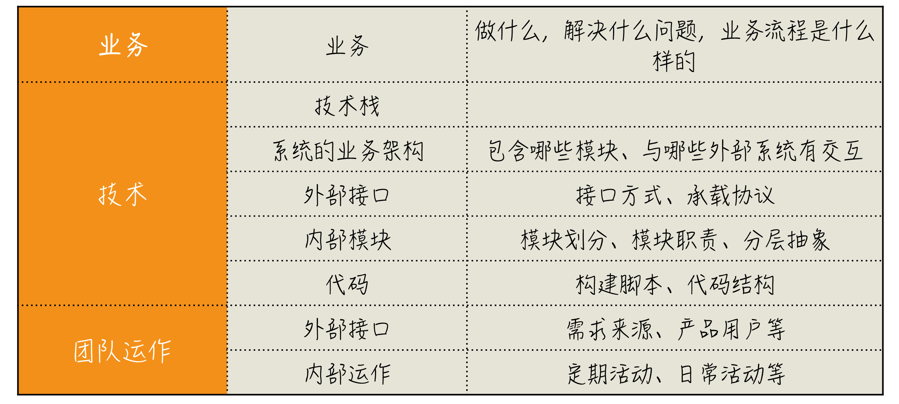
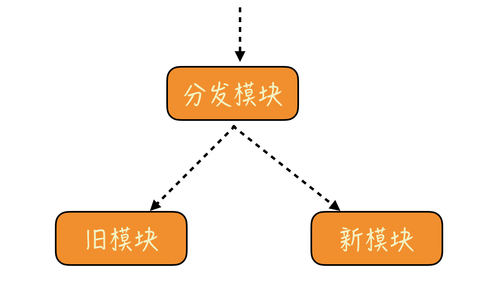
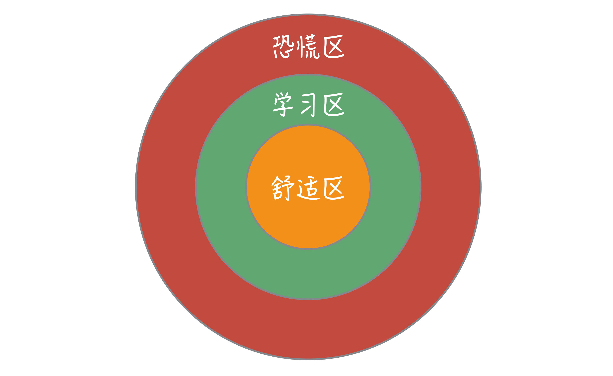

# 综合应用-职业生涯场景

了解一个项目，从大图景开始。

小步改造遗留系统，不要回到老路上。

在学习区工作和成长。

# 新入职一家公司，怎么快速进入工作状态？

经过前面几个模块的学习，我们分别领略了各个原则在不同场景下的应用，相信你对于这些原则的理解也上了一个台阶。但实际工作并不会清晰地告诉你，到底该运用哪个原则来解决问题。

所以，在接下来的三讲中，我挑选了程序员职业生涯中三个非常经典的场景，与你一起看看怎么在实际的工作中运用好已经学习到的这些原则。

在综合运用这个模块的第一讲，我们就来谈谈，当你加入一家新公司时，应该怎么做。

IT 行业快速发展，无数的机会涌现了出来，程序员频繁流动是这个行业的一个典型特征。频繁换工作，无论是对公司，还是对个人都是成本很高的一件事。所以，在加入一个新公司时，怎么让自己快速融入，尽快发挥价值，是摆在我们面前的一个重要问题。

以行业标准来看，我换工作的速度是很低的，但因为之前工作的原因，我需要到不同的公司与不同的人合作，每到一个新公司，工作的内容就是全新的，就如同换了一个新工作一般。因为合作周期有限，我不可能像普通员工入职新公司一样，花几个月时间慢慢熟悉，只能在尽可能短的时间内，快速上手，而且还要提出自己的新想法。

那我是怎么做的呢？其实，我就是运用这个专栏里提到的各种方法解决这个问题。下面我就来分享一下具体的做法。

## 运用思考框架

还记得专栏之初我提出的思考框架吗？我们要问三个问题：

- Where are we?（我们现在在哪？）
- Where are we going?（我们要到哪儿去？）
- How can we get there?（我们如何到达那里？）

先来看第一个问题，如果刚刚加入一家公司，哪怕我们不是一脸懵，也只是对公司业务有一个简单地了解，这是我们的现状。

第二个问题来看看我们的目标。一般来说，我们都是打算在新公司大展身手，但这个答案太宽泛了，我们还需要进一步细化。在这个公司长远的发展是以后的事，我们还是把第一步的目标制定成能够达到上手工作的程度，比如，能够解决日常的项目问题。

那接下来，我们就需要回答第三个问题了，怎么才能够达到这个目标呢？我们需要做一个分解。

你可以回想一下过往的工作经验，要在一个项目上工作起来，先要了解什么呢？很多人的第一反应是技术，我是程序员嘛，当然就是技术优先了。估计大多数人进到项目里，都是一头奔进代码里，然后，从各种细节研究起来。技术肯定是你要了解的，但它不应该是第一位的。

**技术解决的是“怎么做”的问题，而我们第一个应该了解的问题是“做什么”。**一个软件到底在做什么，能够回答这个问题的就是业务。所以，我们排在第一优先级的事情应该是业务。

了解业务和技术都只是让你扮演好你个人的角色，但我们通常都是在一个团队内工作的，所以，还要解决好与其他人协作的问题，这就需要我们了解团队本身是如何运作的。

好，我们已经将大目标做了一个分解，得到了三个小目标：

- 业务；
- 技术；
- 团队运作。

## 从大图景入手

接下来，我们来针对每一个目标，进一步看看需要了解哪些内容。

#### 业务

首先是业务。这是程序员入手新项目时最容易忽略的点。在这个专栏中，我在不同的模块中都说到了知识结构的重要性，没有结构的知识是零散的。所以，不管做任何项目，都要先从大图景入手。只有了解了大图景，各种知识才能各归其位。

**对于一个普通的程序员来说，业务就是这个大图景。**

如果你了解了业务，你自己就可以推演出基本的代码结构。但反过来，如果让你看了代码，从中推演出业务，那几乎是不可能的。

事实上，每次了解到一个业务，我都会在脑子中过一下，如果是我做这个业务，我会怎么做。这样一来，我就会先在整体上有一个预判，后面再对应到实际的代码上，就不会那么陌生了。

要了解业务，我一般都会请人给我讲一下，这个业务是做什么的，解决什么样的问题，具体的业务流程是什么样子的，等等。

在初期的了解中，我并不会试图弄懂所有的细节，因为我的目标只是建立起一个基本的框架，有了这个初步的了解，后续再有问题，我就知道该从哪里问起了。

理论上，了解业务是每个程序员都该做的事，但事实上，这也常常是出问题的地方。在请别人给我讲解业务的过程中，我发现，很多人是分不清业务和技术的，经常把二者混在一起讲。如果你跟着他的思路走，很容易就会陷入到对细节的讨论中。

所以，了解业务时，一定要打起精神，告诉自己，这个阶段，我要了解的只是业务，千万别给我讲技术。

#### 技术

了解完业务，就该到技术了。这是程序员最喜欢的话题。但即便是了解技术，也要有个顺序，所以，我们先从宏观内容开始。第一个问题就是这个系统的技术栈：Java、JavaScript 还是.NET，这样，我就可以对用到的工具和框架有个大致的预期。

接下来是系统的业务架构，这个系统包含了哪些模块，与哪些外部系统有交互等等。最好能够有一张或几张图将架构展现出来。现实情况是，不少项目并没有现成的图，那就大家一起讨论，在白板上一起画一张出来，之后再来慢慢整理。

有了一个初步的体系，接下来，就可以稍微深入一些。

我会选择从外向内的顺序了解起。首先是外部，这里的外部包括两个部分：

- 这个系统对外提供哪些接口，这对应着系统提供的能力；
- 这个系统需要集成哪些外部系统，对应着它需要哪些支持。

一旦涉及到与外部打交道，就涉及到外部接口是什么样子的，比如，是用 REST 接口还是 RPC（Remote Procedure Call，远程方法调用） 调用，抑或是通过 MQ（Message queue，消息队列）传递消息。

不要简单地认为所有接口都是你熟悉的，总有一些项目会采用不常见的方式，比如，我曾见过有系统用 FTP 做接口的。

所有这些都相当于信息承载方式，再进一步就是了解具体的信息是什么格式，也就是协议。

今天常见的协议是 JSON 格式，或者是基于某个开源项目的二进制编码，比如：[Protocol Buffers](http://developers.google.com/protocol-buffers/)、[Thrift](http://thrift.apache.org) 等等。一些有年头的系统可能会采用那时候流行的协议，比如：XML；有一些系统则采用自己特定领域的协议，比如，通信领域有大量 3GPP 定义的协议。

一般来说，从外部接口这件事就能看出一个项目所处的年代，至少是技术负责人对技术理解的年代。

了解完外部，就该了解内部了。了解内部系统也要从业务入手，对应起来就是，这个系统由哪些模块组成，每个模块承担怎样的职责。如果系统已经是微服务，每个服务就应该是一个独立的模块。

通常这也是一个发现问题的点，很多系统的模块划分常常是职责不清的，因此会产生严重的依赖问题。在前面的内容中，我多次提到限界上下文，用限界上下文的视角衡量这些模块，通常会发现问题，这些问题可以成为后续工作改进的出发点。

业务之后是技术，对应着我需要了解分层。前面说过，[分层结构反应着系统的抽象。](http://time.geekbang.org/column/article/88309)我希望了解一个模块内部分了多少个层，每个层的职责是什么。了解了这些对系统的设计，也就对系统有了一个整体的认识。

设计之后，就到了动手的环节，但还不到写代码的时候。我会先从构建脚本开始，了解项目的常用命令。我预期从版本控制里得到的是一个可以构建成功的脚本，如果不是这样，我就知道哪里需要改进了。

最后才是代码，比如，代码的目录结构、配置文件的位置、模块在源码上的体现等等，这是程序员最熟悉的东西，我就不多说了。作为初步的接触，了解基本的东西就够了，代码是我们后期会投入大量精力的地方，不用太着急。

#### 团队运作

最后，我们还要了解一下团队运作。同样从外部开始，这个团队有哪些外部接口，比如，需求是从哪来的，产品最终会由谁使用，团队需要向谁汇报。如果有外部客户，日常沟通是怎么安排的。

再来就是内部的活动，一方面是定期的活动，比如，站会、回顾会议、周会，这些不同活动的时间安排是怎样的；另一方面是团队的日常活动，比如，是否有每天的代码评审、是否有内部的分享机制等等。

通过了解这些内容，基本上可以大致判断出一个团队的专业程度，也可以知道自己需要帮助的时候，可以找谁帮忙，为自己更好地融入团队打下基础。

你也许会问，了解这么多东西需要很长时间吧？其实不然，因为只需要从整体上有认知，如果有人很清楚团队现状的话，你可以去请教，也许一天就够了，这也是我往往能够快速上手的原因。接下来，就该卷起袖子干活了！

## 总结时刻

我给你介绍了怎么把前面学到的知识运用在了解一个项目上，按照业务、技术和团队运作三个方面去了解。

大多数程序员习惯的工作方式，往往是从细节入手，很难建立起一个完整的图景，常常是“只见树木不见森林”，而我的方式则是**从大到小、由外而内**，将要了解的内容层层分解，有了大图景之后，很容易知道自己做的事情到底在整体上处于什么样的位置。我把上面的内容总结了成一份供你参考。

附赠一点小技巧：使用“行话”。在交流的过程中，学习一点”行话“。这会让人觉得你懂行，让你很快得到信任，尽早融入团队。

如果今天的内容你只能记住一件事，那请记住：**了解一个项目，从大图景开始。**

最后，我想请你分享一下，你在入职一个新公司遇到过哪些困难呢？欢迎在留言区写下你的想法。

# 面对遗留系统，小步改造

在上一讲中，结合着“新入职一家公司”的场景，我给你讲了如何在具体情况下应用我们前面学到的知识。这一讲，我们再来选择一个典型的实际工作场景，将所学综合应用起来。这个场景就是面对遗留系统。

在《[34 | 你的代码是怎么变混乱的？](http://time.geekbang.org/column/article/87845)》中，我给你讲了代码是会随着时间腐化的，无论是有意，还是无意。即便是最理想的场景，代码设计得很好，维护得也很精心，但随着技术的不断升级进步，系统也需要逐步升级换代。

比如，我们一直认为电信是一个独特的领域，与 IT 技术是完全独立的，学好 CT（Communication Technology，通信技术）就可以高枕无忧了。但随着 IT 技术的不断发展，今天的电信领域也开始打破壁垒，拥抱 IT 技术，提出了 ICT 的概念（Information and Communications Technology，信息通信技术）。

所以，无论怎样，系统不断升级改造是不可避免的事。问题是，你连自己三个月前写的代码都不愿意维护，那当面对庞杂的遗留系统时，你又该何去何从呢？

很多人的第一直觉是，我把系统重写一下就好了。不经思考的重写，就像买彩票一样，运气好才能写好，但大多数人没有这么好运气的，我们不能总指望买彩票中大奖改变生活。那有什么稍微靠谱的一点的路呢？

## 分清现象与根因

面对庞大的遗留系统，我们可以再次回到思考框架上寻找思路。

- Where are we?（我们现在在哪？）
- Where are we going?（我们要到哪儿去？）
- How can we get there?（我们如何到达那里？）

第一个问题，面对遗留系统，我们的现状是什么呢？

我在这个专栏前面的部分，基本上讨论的都是怎么回答目标和实现路径的问题。而对于“现状”，我们关心的比较少。因为大多数情况下，现状都是很明显的，但这一次不一样。也许你会说，有什么不一样，不就是遗留系统，烂代码，赶紧改吧。但请稍等！

请问，遗留系统和烂代码到底是不是问题呢？其实并不是，**它们只是现象，不是根因。**

在动手改动之前，我们需要先分析一下，找到问题的根因。比如，实现一个直觉上需要两天的需求，要做两周或更长时间，根因是代码耦合太严重，改动影响的地方太多；再比如，性能优化遇到瓶颈，怎么改延迟都降不下来，根因是架构设计有问题，等等。

所以，最好先让团队坐到一起，让大家一起来回答第一个问题，现状到底是什么样的。还记得我在《[25 | 开发中的问题一再出现，应该怎么办？](http://time.geekbang.org/column/article/83841)》中提到的复盘吗？这就是一种很好的手段，让团队共同确认现状是什么样子的，找到根因。

为什么一定要先做这个分析，直接重写不就好了？因为如果不进行根因分析，你很难确定问题到底出在哪，更关键的是，你无法判断重写是不是真的能解决问题。

如果是架构问题，你只进行模型的调整是解决不了问题的。同样，如果是模型不清楚，你再优化架构也是浪费时间。所以，我们必须要找到问题的根源，防止自己重新走上老路。

## 确定方案

假定你和团队分析好了遗留系统存在问题的根因，顺利地回答了第一个问题。接下来，我们来回答第二个问题：目标是什么。对于遗留系统而言，这个问题反而是最好回答的：重写某些代码。

你可能会问，为什么不是重构而是重写呢？以我对大部分企业的了解，如果重构能够解决的问题，他们要么不把它当做问题，要么早就改好了，不会让它成为问题。所以我们的目标大概率而言，就是要重写某些代码。

但是，在继续讨论之前，我强烈建议你，**先尝试重构你的代码，尽可能在已有代码上做小步调整，不要走到大规模改造的路上，因为重构的成本是最低的。**

我们真正的关注点在于第三个问题：怎么做？我们需要将目标分解一下。

要重写一个模块，这时你需要思考，怎么才能保证我们重写的代码和原来的代码功能上是一致的。对于这个问题，唯一靠谱的答案是测试。对两个系统运行同样的测试，如果返回的结果是一样的，我们就认为它们的功能是一样的。

不管你之前对测试是什么看法，这个时候，你都会无比希望自己已经有了大量的测试。如果没，你最好是先给这个模块补测试。因为只有当你构建起测试防护网了，后续的修改才算是走在坚实的道路上。

说到遗留代码和测试，我推荐一本经典的书：Michael Feathers 的《[修改代码的艺术](http://book.douban.com/subject/2248759/)》（Working Effectively with Legacy Code），从它的英文名中，你就不难发现，它就是一本关于遗留代码的书。如果你打算处理遗留代码，也建议你读读这本书。

在 2007 年，我就给这本书写了一篇[书评](http://book.douban.com/review/1226942/)，我将它评价为“这是一本关于如何编写测试的书”，它会教你如何给真实的代码写测试。

这本书对于遗留系统的定义在我脑中留下了深刻印象：遗留代码就是没有测试的代码。这个定义简直就是振聋发聩。按照这个标准，很多团队写出来的就是遗留代码，换言之，自己写代码就是在伤害自己。

有了测试防护网，下一个问题就是怎么去替换遗留系统，答案是分成小块，逐步替换。你看到了，这又是任务分解思想在发挥作用。

我在《[36 | 为什么总有人觉得 5 万块钱可以做一个淘宝？](http://time.geekbang.org/column/article/88764)》中提到，淘宝将系统改造成 Java 系统的升级过程，就是将业务分成若干的小模块，每次只升级一个模块，老模块只维护，不增加新功能，新功能只在新模块开发，新老模块共用数据库。新功能上线，则关闭老模块对应功能，所有功能替换完毕，则老模块下线。

这个道理是普遍适用的，差别只是体现在模块的大小上。如果你的“小模块”是一个系统，那就部署新老两套系统，在前面的流量入口做控制，逐步把流量从老系统转到新系统上去；如果“小模块”只在代码层面，那就要有一段分发的代码，根据参数将流程转到不同的代码上去，然后，根据开发的进展，逐步减少对老代码的调用，一直到完全不依赖于老代码。

这里还有一个小的建议，按照分模块的做法，将新代码放到新模块里，按照新的标准去写新的代码，比如，测试覆盖率要达到 100%，然后，让调用入口的地方依赖于这个新的模块。

最后，有了测试，有了替换方案，但还有一个关键问题，新代码要怎么写？

要回答这个问题，我们必须回到一开始的地方，我们为什么要做这次调整。因为这个系统已经不堪重负了，那我们新做的修改是不是一定能解决这个问题呢？答案是不好说。

很多程序员都会认为别人给留下的代码是烂摊子，但真有一个机会让你重写代码，你怎么保证不把摊子弄烂？这是很多人没有仔细思考过的问题。

如果你不去想这个问题，即便今天你重写了这段代码，明天你又会怨恨写这段代码的人没把这段代码写好，只不过，这个被抱怨的人是你自己而已。

要想代码腐化的速度不那么快，一定要在软件设计上多下功夫。**一方面，建立好领域模型，另一方面，寻找行业对于系统构建的最新理解。**

关于领域模型的价值，我在专栏前面已经提到过不少次了。有不少行业已经形成了自己在领域模型上的最佳实践，比如，电商领域，你可以作为参考，这样可以节省很多探索的成本。

我们稍微展开说说后面一点，“寻找行业中的最新理解”。简言之，我们需要知道现在行业已经发展到什么水平了。

比如说，今天做一个大访问量的系统，我们要用缓存系统，要用 CDN，而不是把所有流量都直接转给数据库。而这么做的前提是，内存成本已经大幅度降低，缓存系统才成为了标准配置。拜 REST 所赐，行业对于 HTTP 的理解已经大踏步地向前迈进，CDN 才有了巨大的进步空间。

而今天的缓存系统已经不再是简单的大 Map，有一些实现得比较好的缓存系统可以支持很多不同的数据结构，甚至支持复杂的查询。从某种程度上讲，它们已经变成了一个性能更好的“数据库”。

有了这些理解，做技术选型时，你就可以根据自己系统的特点，选择适合的技术，而不是以昨天的技术解决今天的问题，造成的结果就是，代码写出来就是过时的。

前面这个例子用到的是技术选型，关于“最新理解”还有一个角度是，行业对于最佳实践的理解。

其实在这个专栏里，我讲的内容很多都是各种“最佳实践”，比如，要写测试，要有持续集成，要有自动化等等，这些内容看似很简单，但如果你不做，结果就是团队很容易重新陷入泥潭，继续苦苦挣扎。

既然选择重写代码，至少新的代码应该按照“最佳实践”来做，才能够尽可能减缓代码腐化的速度。

总之，**改造遗留系统，一个关键点就是，不要回到老路上。**

## 总结时刻

我们把前面学到的各种知识运用到了“改造遗留系统”上。只要产品还在发展，系统改造就是不可避免的。改造遗留系统，前提条件是要弄清楚现状，知道系统为什么要改造，是架构有问题，还是领域模型混乱，只有知道根因，才可能有的放矢地进行改造。

改造遗留系统，我给你几个建议：

- 构建测试防护网，保证新老模块功能一致；
- 分成小块，逐步替换；
- 构建好领域模型；
- 寻找行业中关于系统构建的最新理解。

如果今天的内容你只能记住一件事，那请记住：**小步改造遗留系统，不要回到老路上。**

最后，我想请你分享一下，你有哪些改造遗留系统的经验呢？欢迎在留言区分享你的做法。

# 如何走好程序员这条路

在前面两讲，我结合着两个程序员要直接面对的场景，讨论了如何综合运用前面学习到的知识，这一讲的内容可能不涉及到实际的应用场景，但与每个人的发展息息相关。我想谈谈如何走好程序员这条路。

## 焦虑的程序员

让我们再次用思考框架分析一下问题。首先，现状是什么？关于这个问题，我并不打算讨论个体，因为每个人的情况千差万别，我准备从整体入手。

IT 行业是一个快速发展变化的行业，一方面，我们不断地看到有人快速取得成功，另一方面，我们也听到了许多充满焦虑的声音。获得大的成功总是一个小概率事件，大多数人面对的还是日常的柴米油盐。

**我们的焦虑来自于对未来的不确定性，而这种不确定性是一个特定时代加上特定行业的产物。**

如果把时间倒回到上个世纪 80 年代之前，虽然当时的生活条件一般，但很少有人会为未来的发展焦虑，因为那时候，人们可以清晰地看到自己未来的人生，尽管那种人生可能是平淡的。

但今天的我们处在一个人类历史上少有的快速发展时代，我们看不清以后的人生，大脑却还停留在上一代人的思维习惯上。

IT 行业在国内的大发展也就最近 20 多年的事，行业里很少有走过完整职业生涯的程序员。也正是因为如此，我们经常会产生了各种焦虑：

- 我刚刚入行时，有人问，程序员能做到 30 岁吗？
- 我快 30 岁时，有人问，35 岁还能做程序员吗？
- 我 35 岁时，讨论变成了 40 岁的程序员该怎么办。

估计等国内有越来越多的程序员走完了整个职业生涯，就会有人关心，程序员退休之后的生活应该是什么样子了。

从长期来看，只要生活中还有需要用自动化解决的问题，程序员这个群体还是很有前景的。但随着时间的推移，程序员这个职业的溢价也会越来越低，单纯凭借身处这个行业就获得好发展的可能性也越来越低，想让自己的职业生涯走得更顺畅，还需要找到更好的目标，不断努力。

## 成为 T 型人

我们再来回答下一个问题：目标是什么。也许这时候，每个人脑子里想到的职业发展路线都不一样，但我准备用一个统一的目标回答你：成为 T 型人。

**什么叫 T 型人？简言之，一专多能。**

**有了“一专”，“多能”才是有意义的，否则，就是低水平重复，而这正是很多人职业生涯不见起色的真正原因。**

**这里的“专”不是熟练，而是深入。**你可能是个有着 10 年丰富经验的程序员，但实际上只不过是重复了 10 年解决同样难度的问题而已，这根本就不算深入，也就没有做到真正意义上的“一专”。

你会发现很多优秀的人，在很多方面都会很优秀，这是“一专”带来的触类旁通。

当你有了“一专”，拓展“多能”，就会拥有更宽广的职业道路。比如，我拥有了深厚的技术功底，通晓怎么做软件：

- 如果还能够带着其他人一起做好，就成了技术领导者。
- 如果能够分享技术的理解，就有机会成为培训师。
- 如果能够在实战中帮助别人解决问题，就可以成为咨询师。

反过来，当你有了“多能”，也可以拓宽你的视野，帮你认清自己的“一专”怎样更好地发挥价值，而不是狭隘地认为自己有了技术，就已经天下尽在掌握了。视野窄，缺乏大局观，也成为了许多程序员再进一步的阻碍。事实上，这个专栏里的很多内容都是帮你打开“多能”的视角。

也许你会说，我在公司已经独挡一面了，应该算有“一专”了吧？但我想说的是，可能还不够。只做一个公司的专家，受一个公司的波动影响太大，而成为行业的专家，才会降低自己职业生涯的风险。

有时，我在面试时会问候选人这样一个问题：“如果让你在一次技术大会上做分享，你会讲什么呢？”我真正的问题是，以行业标准衡量，你觉得你在哪个方面是专家呢？

大多数人从来没有思考过这个问题，他们只是日常在完成自己的工作，即便在某一方面已经做得很不错了，但依然算不上专家，因为他们缺乏深度思考。

比如，你非常熟悉 Kafka，知道它的各种参数，也读过它的实现原理。但如果我问你，Kafka 为什么要把自己定位成一个分布式流平台，它要想成为一个流平台，还要在哪方面做得更好？你的答案是什么呢？

这其中的差别就是，前面所谓的熟悉，只是熟悉别人的思考结果，而后面则是一个没有现成答案的东西。学习微积分是有难度，但同发明微积分相比，难度根本不在一个层次上。当然，我不是说你要熟悉所有工具的发展过程，而是自己要在一个特定的方面拥有深度的思考。

也许你会说，这个要求实在是太高了吧！没错，这确实是一个很高的要求。但“取法于上，仅得为中；取法于中，故为其下。”

其实，很多人的焦虑就源自目标太低，找不到前进的动力。给自己定下一个可以长期努力的目标，走在职业的道路上才不致于很快丧失动力。

## 在学习区成长

现在我们来回答第三个问题，怎么达到目标。既然要朝着行业中的专家方向努力，那你就得知道行业中的专家是什么样。我的一个建议是，向行业中的大师学习。

你或许会说，我倒是想向大师学习，但哪有机会啊！好在 IT 行业中的许多人都是愿意分享的，我们可以读到很多大师级程序员分享的内容。

我在入行的时候，有幸读了很多经典之作，比如，出身贝尔实验室的很多大师级程序员的作品，诸如《[C 程序设计语言](http://book.douban.com/subject/1139336/)》《[程序设计实践](http://book.douban.com/subject/1173548/)》、《[Unix 编程环境](http://book.douban.com/subject/1033144/)》等，还有一些像 Eric Raymond 这样沉浸编程几十年的人写出的作品，诸如《[Unix 编程艺术](http://book.douban.com/subject/1467587/)》，以及前面提及的 Kent Beck、Martin Fowler 和 Robert Martin 等这些人的作品。

读这些书的一个好处在于，你的视野会打开，不会把目标放在“用别人已经打造好的工具做一个特定的需求”，虽然这可能是你的必经之路，但那只是沿途的风景，而不是目标。

接下来，我们要踏上征程，怎么才能让自己的水平不断提高呢？我的答案是，找一个好问题去解决，解决了一个好的问题能够让你的水平快速得到提升。什么是好问题？就是比你当前能力略高一点的问题，比如：

- 如果你还什么都不会，那有一份编程的工作就好。
- 如果你已经能够写好普通的代码，就应该尝试去编写程序库。
- 如果实现一个具体功能都没问题了，那就去做设计，让程序有更好的组织。
- 如果你已经能完成一个普通的系统设计，那就应该去设计业务量更大的系统。

为什么要选择比自己水平高一点的问题？这与我们学习成长的方式有关。Noel Tichy 提出了一个“学习区”模型，如下图所示：

- 最内层是舒适区（Comfort Zone），置身其中会让人感觉良好，但也会因为没有挑战，成长甚微，你可以把它理解成做你最熟悉的事情。
- 最外层是恐慌区（Panic Zone），这是压力极大的地方，完全超出了你的能力范围，你在其中只会感到无比的焦虑。
- 中间的是学习区（Learning Zone），事情有难度，又刚好是你努力一下可以完成的，这才是成长最快的区域。

根据这个模型，只有一直身处学习区才能让人得到足够的成长，所以，我们应该既选择比自己能力高一点的问题去解决，不要总做自己习惯的事，没有挑战，也不要好大喜功，一下子把自己的热情全部打散。

在学习区成长，就不要满足于当前已经取得的成绩，那已经成为你的舒适区。因为我们有远大的目标在前面指引，完成日常的工作只不过是个人成长路上的台阶。

也许你会说，我的工作不能给我个人成长所需的机会，怎么办呢？实际上，别人只会关心你是否完成工作，成长是自己的事情，很多机会都要靠自己争取，前面提到的那些具体做法完全是你可以在工作范围内，自己努力的事情。

如果你当前的工作已经不能给你提供足够好的问题，那就去寻找一份更有挑战性的工作。在 IT 行业，跳槽似乎是一件很常见的事，但很多人跳槽的时候，并不是以提升自己为目标的。造成的结果是，不断地做同一个层面的工作，自然也就很难提升自己的水平。

为什么程序员都愿意到大厂工作？因为那里有高水平的人和好的问题。但如果只是到大厂去做低水平的事，那就是浪费时间了。所以，即便你真的想到大厂工作，与谁一起工作，做什么事，远比进入大厂本身要重要得多。

如果你真的能够不断向前进步，迟早会遇到前面已经没有铺就好的道路，这时候，就轮到你创造一个工具给别人去使用了。比如，2012 年，我在项目中受困于集成问题，却找不到一个我想要的、能在单元测试框架里用的模拟服务器，于是，我写了[ Moco](http://github.com/dreamhead/moco)。

最后，我还想鼓励你分享所得。我在《[28 | 结构化：写文档也是一种学习方式](http://time.geekbang.org/column/article/84663)》中和你说过，输出是一种将知识连接起来的方式，它会让人摆脱固步自封，也会帮你去创造自己的行业影响力，机会会随着你在行业中的影响力逐渐增多，有了行业影响力，你才有资格成为行业专家。

当你成为了一个行业级别的专家，就可以在这条路上一直走下去，而不必担心自己是不是拼得过年轻人了，因为你也在一直前进！

## 总结时刻

程序员是一个充满焦虑的群体，焦虑的本质是对未来的不确定。工作在这个时代的程序员是一个特殊的群体，一方面，这个大时代为我们创造了无数的机会，另一方面，因为程序员是一个新的行业，所以，很多人不知道未来是什么样子的，焦虑颇深。

从目前的发展来看，IT 行业依然是一个非常有前景的行业，但想在这条路上走好，需要我们成为 “T ”型人才，也就是“一专多能”。一专多能的前提是“一专”，让自己成为某个方面的专家。这个专家要放在行业的标准去看，这才能降低因为一个公司的波动而造成的影响。

成为行业专家，要向行业的大师学习，给自己定下一个高的目标，然后是脚踏实地，找适合自己的问题去解决，让自己一直在学习区成长。

如果今天的内容你只能记住一件事，那请记住：**在学习区工作和成长。**

最后，我想请你分享一下，你有哪些保持自己竞争力的心得呢？欢迎在留言区写下你的想法。

