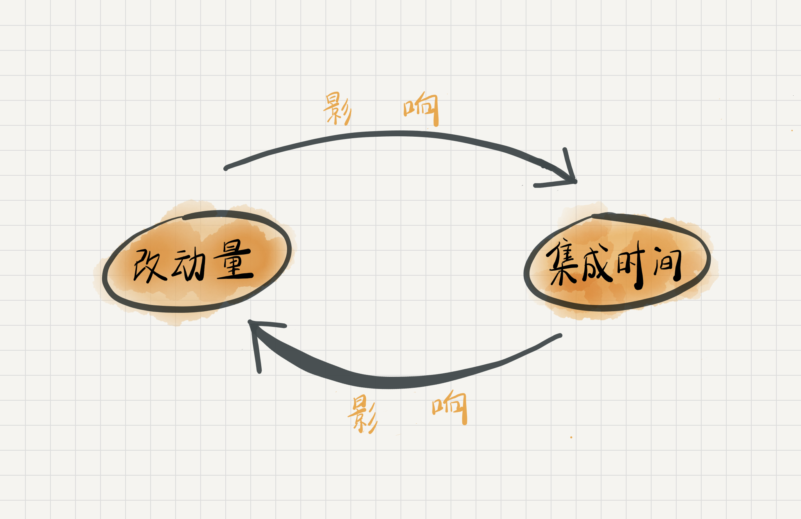
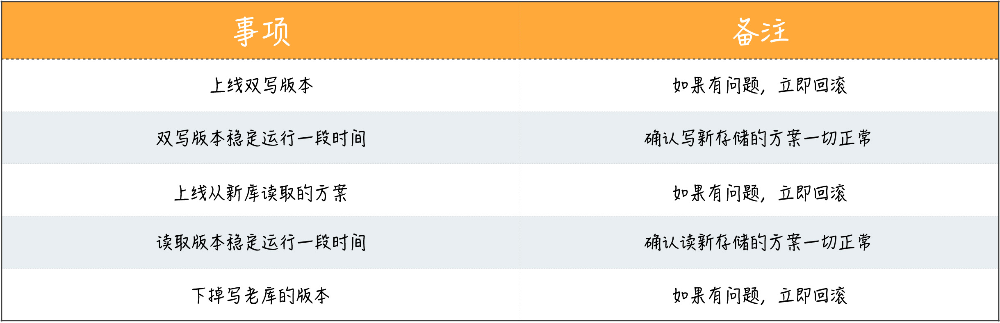

# 以终为始

遇到事倒着想

做任何事，先定义好完成的标准

做任何需求或任务之前，先定义好验收标准

尽早提交代码去集成

默认所有需求都不做，知道弄清楚为什么要做这件事

扩大自己工作的上下文，别把自己局限于一个程序员的角色上

在动手做一件事之前，先推演一遍。

问一下自己，我的工作是不是可以用数字来衡量。

设计你的迭代0清单，给你的项目做体检

# 以终为始PK顺序思考

今天内容的开始，我希望你可以先来思考一个问题：**如果让你设计一个登录功能，你会怎么做？**

我曾在公司内部做过这样一个练习，我扮演客户，让大家帮我设计一个登录功能。同事们一听就高兴了，登录不就是用户名加密码嘛，我熟啊，我还可以设计出验证码、找回密码、第三方登录等等功能。

更有个别动作快的同事，甚至已经开始设计数据库表，考虑用 Redis 做缓存了。整个过程下来，大家彼此讨论得热火朝天，唯一没人理会的就是我这个“客户”。

讨论结束，扮演客户的我告诉大家，作为一个“土豪”，我打算做一个打车软件，用户可以通过手机号接收验证码的方式进行登录。你可以想见，同事们一副“被套路了”的表情。是的，他们设计那套用户名密码登录完全是文不对题。

虽然这是一个简单的练习，但反映的却是我们日常面对的真实工作场景：许多人都是刚刚听到别人要求做的一个功能，就开始脑补接下来的一切。导致的结果，就是付出的努力毫无意义。

那么问题出在哪呢？因为我们欠缺了“以终为始”的思维习惯。

## 什么是以终为始？

一种反直觉的思维方式------以终为始

以终为始，就是在做事之前，先想想结果是什么样子的。

说起来很简单，但做到并不容易。因为我们**习以为常的思维模式是线性而顺序的**，第一步做完，做第二步；第二步做完，做第三步。

这也情有可原。我们人类都是从远古时代演化而来，在那个食不果腹的时代里，倒着思考的用途并不大，人们甚至不确定自己能否见到明天的太阳。几十万年的进化留给我们很多短视的行为和思考习惯，因为这样的做法最为节省能量，把目光放长远是需要额外消耗能量的。

**“以终为始”是一种反直觉的思维方式，是大多数人不具备的。**所以，日常生活中，我们看到很多有趣的现象。

比如，大学毕业时，有很多人想考研，如果你问他为什么要考研，得到的理由通常是为了找个好工作。但考研真的能帮他找个好工作吗？不一定，因为找工作和考研根本就不是同一棵技能树。

如果真的是想找个好工作，那你就应该了解工作的要求是什么，怎样才能掌握工作要求的技能。

从后面这个角度出发，你会发现考研只是通往工作诸多道路中的一条，其他的路径也是可以到达的。比如，你应该找个实习的地方锻炼一下职业技能。这就是“以终为始”思考问题的方式。

回到前面“设计登录功能”的例子，对比“以终为始”的思维，你也许会替我的同事抱不平，他们或许也有“以终为始”的思路，只不过，他们的“终”和我这个客户的“终”不一样罢了。这就要说到做软件，本质上是在构建一个“集体想象”。

## 集体想象

想象的共同体

如果你读过尤瓦尔·赫拉利的《人类简史》或《未来简史》，有一个说法你一定不陌生：想象的共同体。作者认为，人类历史发展的一个重要因素是“集体想象”，无论是国家、宗教，还是法律、习俗，都是人们达成的“集体想象”。**人类就是认同了这些“集体想象”的一个共同体。**

我们这些做软件的人其实就是一个想象的共同体，这个“集体想象”就是我们要做的软件，任何想象都需要一个载体将其展现出来，我们编写软件的过程就是将这个“集体想象”落实的过程。

既然是“集体想象”，那么在载体将想象呈现出来之前，我们的想象很难统一起来，都或多或少存在差异。

所以，**任何事物都要经过两次创造：一次是在头脑中的创造，也就是智力上的或者第一次创造（Mental/First Creation），然后才是付诸实践，也就是实际的构建或第二次创造（Physical/Second Creation）。**

我们在工作中遇到的很多问题，其实就是在于第一次创造没有做好，就进入到第二次创造。所以，我们在工作中会遇到很多“惊喜”，准确地说，是惊吓。

**相比于第一次创造，第二次创造是一件成本很高的事。**我们知道，软件开发最费时费力，一旦投入大量精力做出来，却发现与理解偏差甚大，所有人都会欲哭无泪。

所以，在动手做事之前，我们要在第一次创造上多下一些功夫，将相关各方的“集体想象”统一起来。以建筑为例，就是先在图纸上构思各种细节。对应到做软件，我们也可以做很多事，比如：

- 要给用户看产品的样子，可以用原型工具把它做出来，而不是非得把完整功能开发出来；
- 要呈现服务接口的样子，可以用模拟服务器搭出一个服务，而不用等后端全部开发完毕；
- 要让程序员知道要开发产品的细节，可以在任务上描述出软件各种场景给出的各种行为。

再回到前面“设计一个登录功能”的例子上，我的同事们在构建的其实是他们自己的想象，而不是我们共同的想象。这其中最大的一个区别就在于，**没有人会为他们自己的想象买单的**。

所以说，**他们看到的“终”不是真正的终，只是一个自我的“终”，至于看到什么样的“终”，这取决于每个人的见识。**

**对做软件的人来说，我们应该把“终”定位成做一个对用户有价值的软件**，能够为别人带来价值，自己的价值才能体现出来。

至此，你对“以终为始”已经有了一个初步的认识，有了这种思维方式，我们可以在工作中怎样运用它呢？

## 规划和发现

软件行业有很多英雄传说，一个人或者一个团队连续奋战一段时间，写好了一个软件，在上线前夜发现了一个问题，然后冒着“不成功便成仁”的风险，通宵达旦解决了问题，一战成名。

这种故事听起来让人热血沸腾，但仔细想想，为什么总在最后一刻发现问题？除了时间压力确实大的情况以外，大多数情况，**他们还是一开始没有想好就动手了。**

在团队内部，我一直坚持“以终为始”，让大家在执行任务之前，先倒着想想再动手规划，这样规划出来的工作更能瞄准真正的目标。举一个之前做产品的例子，当年在创业的时候，我们打算做一个物联网开发平台，但具体应该做成什么样子呢？

有了“以终为始”的思维，我们考虑的是别人会怎么用我们的平台。我们设计的方式是，用户到我们的网站，阅读相关文档，然后参考文档一步一步照着做。

这其中的一个关键点是：文档，特别是**《起步走》的文档**，这是用户接触我们这个平台的第一步，决定了他对我们产品的第一印象。

所以，我们决定从写《起步走》这个文档开始，这个文档描绘了用户怎样一步一步使用我们的开发平台，完成第一个“Hello World”级别的应用。**请注意，这个时候，我们一行代码都没有写。**

写好了这个《起步走》文档，团队的所有人对于我们的平台要做成什么样子，已经有了一个比较初步的认识。更重要的是，我们可以拿着这个文档，去和外部的人讨论这个尚未出世的平台。

人类是一个擅长脑补的群体，一旦有人看到了这个文档，他就已经可以构想出这个平台已经存在的样子，进而给出各种各样的反馈：“我认为这个地方可以这样做”“我觉得那个地方可以改改”。

所有这些**反馈都是真实的**，因为他们已经“看到了”一个真实的东西。正是这些真实的反馈，让我们逐渐地锁定了目标。之后，我们才开始动手写代码。

**“以终为始”的方式，不仅仅可以帮我们规划工作，还可以帮我们发现工作中的问题。**

有一次，我的团队在开发一个大功能，要将现有的系统改造成支持多租户的系统。也就是说，别的商家可以到我们的平台上发起申请，拥有和我们现有平台一样的能力。

功能来了，各个团队将任务分解，然后就各忙各的去了。但我有着习惯性的不安，总担心丢点什么，于是催着项目经理梳理一下上线流程。

是的，上线流程，虽然我们的代码还没开发完，但是本着“以终为始”的态度，我们就假设各个部分已经开发好了，来想一想上线应该怎么做。

果不其然，一梳理上线流程，我们便发现了问题：怎么识别不同的租户呢？有人给出的方案是设置一个 HTTP 头。但谁来设置这个 HTTP 头呢？没人仔细想过。于是，一个潜在的问题就这样被发现了，至少不用在未来为它加班了。至于解决方案，作为程序员，我们有的是办法。

事实上，**在今天的软件开发实践中，已经有很多采用了“以终为始”原则的实践。**

比如**测试驱动开发**。测试是什么？就是你这段代码的“终”，只有通过测试了，我们才有资格说代码完成了。当然，测试驱动开发想做好，并不是先写测试这么简单的。

比如**持续集成**，我们是要交付一个可运行的软件，倒着来想，最好的做法就是让软件一直处于可运行的状态，那就是持续地做集成。

概括地说，**践行“以终为始”就是在做事之前，先考虑结果，根据结果来确定要做的事情。**

这是“以终为始”这个内容版块的开篇，后面我会给你介绍这个原则在不同场景下的应用，也会引入一些现在行业内的最佳实践进行解析。相信会对你的实际工作有帮助。

## 总结时刻

有一段时间，网上流传着一个帖子，亚马逊 CTO 介绍**亚马逊是如何开发一项产品**的，简单来说，他们采用向后工作的方法，开发一项产品的顺序为：

1. **写新闻稿；**
2. **写 FAQ（常见问题解答）；**
3. **写用户文档；**
4. **写代码。**

今天我带你了解了“以终为始”的做事思路，回过头再来看这个帖子，相信你不难理解为什么亚马逊要这么做事情了。

**人们习惯采用顺序思考的思维方式**，几十万年的进化将这种思考模式刻在了我们的基因里。要成为更好的自己，我们要克服自身的不足，而这个做法很简单，那就是**“以终为始”，做事倒着想，先考虑结果。**

**人类是一个想象的共同体，做软件的团队更是如此，而我们写出来的软件是我们将“集体想象”落地的载体。**

任何事物都要经过两次创造：**一次是在头脑中的创造，也就是智力上的或者第一次创造（Mental/First Creation），然后才是付诸实践，也就是实际的或第二次创造（Physical/Second Creation）。我们应该在第一次创造上多下功夫，统一集体想象，让目标更明确。**

“以终为始”的思维可以帮助我们更好地规划我们手头任务，也可以帮助我们发现过程中的问题。

如果今天的内容你只能记住一件事，那请记住：**遇到事情，倒着想。**

# DoD（定义完成的标准）

开始今天的讨论之前，我们先来看一个小故事。小李是一个程序员，有一天，项目经理老张来到他身边，和他商量一个功能特性的进度：

> 老张：这有一个任务需要完成，你看一下。
> 小李：这个不难，两天就能做完，两天以后就能上线。

两天以后，老张又来到小李的身边验收工作：

> 老张：怎么样，做完了吗？今天能上线吗？
> 小李：我的代码写完了。
> 老张：测试人员测过了吗？
> 小李：还没有。
> 老张：那今天能测完吗？
> 小李：那我就不知道了。
> 老张：什么？我可是答应了业务的人，今天一定要上线的！

很明显，老张有些愤怒，而小李也有些委屈。于是，老张、小李和测试人员一起度过了一个不眠之夜。

听完这个故事，你有什么感想呢？先不急，我们继续看后面的故事。

又过了几天，老张又来找小李，给小李安排一个很简单的功能。在小李看来，一天就能搞定，而按照老张给出的时间表，小李有两天时间处理这个功能。小李心中暗喜：看来我可以“偷得浮生一日闲”了。

两天以后，老张又来检查工作。

> 老张：这个功能开发完了吗？
> 小李：写完了，你看我给你演示一下。

小李熟练地演示了这个新写好的功能，这次老张很满意：

> 老张：做得不错。单元测试都写了吧？
> 小李：啊？还要写单元测试吗？
> 老张：要不为啥给你两天的时间？

怎么会这样？小李心里很委屈，自己明明已经很好地完成了工作，老张是不是故意在找自己的麻烦呢？

好，故事讲完了。是不是有些似曾相识的感觉呢？为什么小李辛辛苦苦地工作，老张却总能挑出毛病来呢？老张是不是来挑刺的呢？其实，老张才没那么闲，小李的委屈主要是因为他和老张**对于“完成”有着不一样的理解。**换句话说，他们之间**存在一个理解的鸿沟。**

## 理解的鸿沟

在这个模块里，我们讨论的主题是“以终为始”。那我们第一个问题就是，“终”到底是什么？在前面这个例子里，“终”就是“完成”，可是，小李认为他的活已经做完了，老张却认为他没做完。

怎么会这样？二人之所以有分歧，归根结底，就在**于二人对“完成”的定义理解的不同。**

在第一个故事里，作为项目经理，老张认为“完成”应该是“上线运行”，而程序员小李则认为“完成”是“功能代码编写完毕”。这中间存在的理解偏差，包括了测试人员的测试工作，可能还包括了运维人员的上线工作。

在第二个故事里，老张给了小李两天时间。小李认为这两天都是编写功能代码的，而老张想的是，小李应该自己写好功能代码和单元测试，可能还包括了功能测试，这中间的差异是测试代码的工作量。

因为双方的理解不一致，所以无论怎样努力，小李都不可能达成项目经理老张的要求，正所谓“南辕北辙”。

那该怎么办呢？小李会说，我又不是老张肚子里的蛔虫，怎么才能和他达成一致呢？答案很简单，既然双方的理解有差异，那就把这个差异弥合上，后面的问题便也不是问题了。

弥合差异的方式有很多，有一个**最佳实践，它的名字叫 DoD（Definition of Done，完成的定义），**从这个概念的名字便不难看出，它就是为了解决软件开发中常见的“完成”问题而生的。

## 完成的定义

DoD 这个概念本身并不复杂，它就是告诉我们怎样算是完成了，尽量减少因为理解偏差造成的各种浪费。具体怎么做呢？就是团队在开始工作前，先制定 DoD。以前面的场景为例，团队可以规定：

> 特性开发完成，表示开发人员经过了需求澄清、功能设计、编写代码、单元测试，通过了测试人员的验收，确保代码处于一个可部署的状态，相关文档已经编写完毕。

> 开发完成，表示开发人员编写好功能代码，编写好单元测试代码，编写好集成测试代码，测试可以通过，代码通过了代码风格检查、测试覆盖率检查。

大家都是聪明人，一旦 DoD 确定好了，谁该做什么事就一目了然了。这个时候，如果小李说“我已经开发完了”，却只是写好了功能代码，那就别怪老张手下无情了。

好了，你已经知道 DoD 是什么了，它简单到让人一目了然，相信你很快就能知道该怎样把它用到你的工作里。不过，我们不仅要知道怎么用，还要知道怎样让 DoD 更好地发挥作用。

- **DoD 是一个清单，清单是由一个个的检查项组成的，用来检查我们的工作完成情况。**DoD 的检查项，就是我们开发产品所需的一系列有价值的活动。比如：编写代码、编写测试代码、通过测试人员验收等。什么样的活动是有价值的，也许每个团队的认识是不同的。但如果你的团队认为除了功能代码，其他都没价值，也许这是个信号，说明你的团队整体上是缺乏职业素养的，在这样的团队工作，前景并不乐观。
- **DoD 的检查项应该是实际可检查的。**你说代码写好了，代码在哪里；你说测试覆盖率达标了，怎么看到；你说你功能做好了，演示一下。
- **DoD 是团队成员间彼此汇报的一种机制。**别把“汇报”想复杂了，最简单的汇报就是说一句“这个功能做完了”。**当我们有了 DoD，做事只有两种状态，即“做完”和“没做完”。**在团队协作中，我们经常会听到有人说“这个事做完了 80%”，对不起，那叫没做完，根本没有 80% 做完的说法。

在前面的讨论中，我们所说的 DoD 只是从个人层面入手。在团队层面，我们也可以定义 DoD。

- 某个功能的 DoD，比如：这个功能特性已经开发完成，经过产品负责人的验收，处于一个可部署的状态。
- 一个迭代的 DoD，比如：这个迭代规划的所有功能已经完成。
- 一次发布的 DoD，比如：整个软件处于可发布的状态，上线计划已经明确。

## 站在 DoD 的肩膀上

至此，我们只是从软件开发团队内部协作的角度来谈 DoD。但实际上，**它不仅局限在团队内部协作上，如果你可以放开思路，会发现 DoD 的思维在工作中用途非常广泛。**比如，当我们需要和其他团队合作开发一个接口时，我们都知道第一步就是要把接口定义下来。

那么，怎样才算定义完成？很多团队认为落在字面上就够了。但是有了 DoD 的思维，我们**定义接口，就会去明确定义可检查的检查项。**那么在定义接口这件事上，什么才是“可检查”的呢？我们可以参照一个可运行的接口来进行评估。只要检查：

- 服务方提供的接口是不是和这个可运行的接口返回值是一样的；
- 调用方是否可以和这个可运行的接口配合使用。

谁错了，谁改去。你可能会问，应该参照哪些可运行的接口呢？这不难解决，现在**模拟服务器的框架**到处都是。如果你不介意的话，我的 [Moco](http://github.com/dreamhead/moco) 就是这样一个开源项目，你可以看一下。

在协作中一旦确立好 DoD，我们甚至可以通过流程把它固化下来，从而更高效高质地完成工作。当然，我们在工作生活中难免会有一些临时的工作，它们没有复杂到需要一个流程，但是也可以用 DoD 思维来高效地解决。比如：

> 经常会有人过来，让我帮忙做些事。运用 DoD 的思维，我首先会问他我具体要做哪些事，确认好细节（相当于定义好“检查项”），然后我就知道，这个忙我能帮到什么程度。

> 我请别人帮忙的时候，也会很清楚告诉他，哪些事是需要他做的，尽量减少不必要的误解。

**DoD 是一个的思维模式，是一种尽可能消除不确定性，达成共识的方式。**我们本着“以终为始”的方式做事情，DoD 让我们能够在一开始就把“终”清晰地定义出来。

人与人协作中，经常会出现各种问题，根本原因就是，有太多因为理解差异造成的误解，进而浪费了大量的时间，而 DoD 就是一种将容易产生歧义的理念落到实处的方法。

## 总结时刻

好，我们来总结一下今天学到的内容。首先，你应该知道，人与人协作，总会有这样或那样的理解差异。开始协作之前，我们最好先同步一下彼此的理解，确保之后不会因为理解不一致，而让协作方措手不及。

怎样解决大家的理解偏差呢，我介绍了 DoD（完成的定义），它是行业中的一种最佳实践，能够在团队内部很好地同步大家对“完成”的理解。好的 DoD 是一个可以检查的清单，可以确保你不遗漏任何事情。

如果深入领会 DoD，你会发现 DoD 可以灵活应用在不同的协作场景中。比如应用于个人工作、团队工作，甚至跨团队工作。当然，你也可以将它灵活地运用于各种生活场景，弥合人与人理解之间的差异，更好地协作与沟通。

如果今天的内容你只能记住一件事，那请记住：**在做任何事之前，先定义完成的标准。**

# 接到需求任务，你要先做哪件事？（定义验收标准）

我们书接上文，继续讲程序员小李的故事。这次小李接到一个新的需求，让他开发一个**单点登录的服务**，经过几天的奋战，他顺利地写完了所有的代码。正好产品经理小王路过他身边，顺便问了他一下。

> 小王：单点登录做得咋样了？
> 小李：做完了，我给你演示一下。

小李演示了一遍自己做的功能，小王看上去很满意。

> 小王：不错。不过，怎么没有支持验证码？
> 小李：为什么要做这个？
> 小王：这不就是登录的一部分吗？
> 小李：哪里规定要做验证码了？
> 小王：现在做登录哪有不用验证码的？

我想你已经嗅到了双方谈话的火药味，这个时候如果双方都不能很好地控制自己的情绪，那接下来一场体力的较量可能就一触即发了。

为什么双方会有这么大的分歧呢？其中一个重要的原因是，开始实现这个需求之前，任务双方都没有清晰地定义好边界，没能把需求描述清楚。

## 需求描述的问题

在软件开发中，**程序员做什么一般都由需求来定义**。我们都知道，需求是软件开发的一个重要组成部分，但你可能并没有仔细想过，不同的需求描述方式，可能会影响我们程序员对需求的理解。

**因为信息的传递是会衰减的，你不可能把你理解的信息 100% 传递给另外一个人，而这中间，如何传递，也就是如何描述将直接决定衰减的比例。**

很多公司的软件开发模式是基于功能列表的，这个列表“规定”了程序员要做的功能，各个组从产品经理那里领来开发列表，然后“照单抓药”开始写代码。但是，通常这种功能列表只是一些简单的描述，你并不能看到全局。

很多团队的一个状态就是，程序员们都知道要开发的功能是什么，但这个功能是谁在什么样的场景下使用的，很多人却回答不上来。如果你去问他为什么要开发这个功能，他通常会说：这是功能列表里规定的。

**这种功能列表式的需求描述方式，将一个完整的需求敲成了碎片。** 只有所有功能全部开发完成，对接在一起的时候，才是“破镜重圆”的时刻。

也就是说，**不到最后一刻，大多数人并没有一个完整的图景，这就相当于看不到完整的“终”**。顺着这个思路做下去，你会在最后关头遇到许多意料之外的问题，其结果必然是手忙脚乱。

根据这种基于功能列表的需求描述，每个组在安排工作的时候，都会按照自己的理解进行功能排列。

所以，当你的组完成了一个功能时，这个功能却可能上不了线，因为你还要依赖于其他组的工作，而这个组不巧，却刚好把相关的功能开发排在了后面。

这还只是**两个组之间有依赖的情况，如果需要多个组协同，可以想象，状况会多么糟糕。**

所以，当我们对产品经理说“时间不足，砍掉一些需求吧。”得到的答案肯定是，“对不起，做不到，**因为需求已破碎，没办法调整。”**

因此，一些新的需求描述方式也就应运而生，这其中，**用户故事（User Story）**是我最喜欢的一种方式。它是站在用户的角度来描述了一个用户希望得到的功能，关注用户在系统中完成一个动作需要经过怎样的路径。既然它是“故事”，它就需要是一个**完整的场景，可**以讲述出来。

## “用户故事”有什么用？

我们先来以用户密码登录为例，看看用户故事长什么样？一个完整的用户故事大致包含以下几个部分：

- **标题，简要地说明这个用户故事的主要内容**，比如：注册用户使用用户名密码登录。
- **概述，简要地介绍这个用户故事的主要内容，一般会用这样的格式：**
    **As a （Role）, I want to （Activity）, so that （Business Value）.**
    意思就是：作为一个什么角色，要做什么样的事，以便达成一种怎样的效果。其中最重要的是，告诉别人为什么要做这件事，虽然只有一句话，却往往是很多人欠缺的思考，只知做，不知为何做。
    举个概述的例子：作为一个注册用户，我想要通过用户密码登录，以便我可以使用注册用户才能够使用的服务。
- **详述，详细地描述这个用户故事的完整流程，我们会把操作流程、用户界面等信息都放到这里。**
    比如：用户使用正确用户名和密码登录，就可以登录成功；如果密码不正确，则登录页面提示用户“用户名密码不正确”。基本上，看到这个部分，程序员就可以在心中描绘出这个用户故事的样子了。
    超出范围的部分，比如：第三方登录不在范围内，这个部分主要是限定人们不要进一步发散。
- **验收标准，这个部分会描述一个正常使用的流程是怎样的，以及各种异常流程系统是如何给出响应的，这是程序员常常会欠缺的思考。它会把详述中很多叙述的部分变成一个具体的测试用例。**比如，下面我给出的两个验收用例：
    正常场景：给定一个注册用户张三，其用户名是 zhangsan，密码是 foobar，当张三使用 zhangsan 和 foobar 登录系统时，可以成功登录，登录成功后，跳转到用户中心。
    异常场景：给定一个注册用户张三，其用户名是 zhangsan，密码是 foobar，当张三使用 zhangsan 和 wrong 登录系统时，登录失败，在登录页面上提示“用户名密码不正确”。

在前面的例子中，小张和小王之所以会对需求是否完成产生分歧，是因为**大家对于需求完成的定义不同。对**于这种情况，我们能怎么办呢？

这个模块的主题是“以终为始”，现在你看到了用户故事是如何描述需求的，你或许已经知道我要说什么了，没错，这里非常关键的一点就是“验收标准”。很多人学习用户故事，认为最重要的是记住“As…, I want to …, so that …”这样的需求描述方式。

在我看来，无论采用哪种需求描述方式，这部分也都是能说清楚的。那我们要从用户故事中学到什么呢？我认为就是**用户故事的关键点：验收标准，它可以清晰地定义出需求边界。**

**验收标准非常重要的一环是异常流程的描述。**大部分程序员都擅长解决正常流程，而异常流程则是最容易忽略的，也是产生扯皮的关键环节。既然容易扯皮，我们就在一开始把它定义清楚。怎么才算做完需求呢？验收标准说了算。

采用用户故事之后，我经常在**写完了主要流程之后，再去看一下验收标准，为自己的开发查缺补漏。**因为我知道，那是标准，达不成就不算任务完成。

当我们说自己开发完成，可以交给测试人员测试时，我们需要照着验收标准给测试人员演示一遍，证明我们的系统确实能够跑通。这之后，测试人员才会把系统接手过去，做更系统的测试。

**验收标准给出了这个需求最基本的测试用例，它保证了开发人员完成需求最基本的质量。**如果你了解 **BDD（Behavior-Driven Development，也就是“行为驱动开发”）**，就可以按照验收标准中给出的内容编写验收测试用例了。

在实际工作中，许多产品经理把需求交给开发人员之前，很多细节是没想清楚的，那种功能列表式的需求常常只包含了正常路径，那些缺失的细节就是在后续的过程中，由开发人员补全的。用户故事就是一种固定的格式，让他们把这些应该想清楚的问题想清楚。

**如果你的团队采用用户故事的格式进行需求描述固然好，如果不能，在功能列表中，补充验收标准也会极大程度地改善双方协作的效率。**

## 你的角色

或许你会有这样的疑问，如果产品经理通过用户故事的方式，将需求实现细节都描绘得清清楚楚，那我们程序员的发挥空间在哪里？请注意，**验收标准所给出实现细节应该是业务上的，程序员在这种问题上思考才是真正意义上的浪费时间，我们的发挥空间应该是在技术实现上。**

然而，在现实情况中，很多团队做不到这种程度。

你会发现，我们在开发中之所以会“丢三落四”，很重要的一个原因是，在开发一个功能特性的时候，因为一些环节的缺失，我们不得已扮演了很多的角色，其中之一就是产品经理。**你是一个专业的程序员，但大多数情况下，你却只是一个业余的产品经理，“丢三落四”就在所难免了。**

或许你会说，我在一个小公司工作，公司没那么多人，没有专门的产品经理，只有我们几个“全世界都缺”的程序员，需求都是老板扔给我们的，谁来帮我们写验收标准呢？

没办法，答案只能是你自己。**虽然你名义上是程序员，但当拿到一个需求的时候，你要做的事不是立即动手写代码，而是扮演产品经理的角色，分析需求，圈定任务范围。**相信我，事前分析绝对比你拿一个写好的系统给老板，而他却告诉你这不是他想要的，好太多了。

另外我想提醒你注意的是，**扮演不同角色的时候，我们的思考模式是不同的。**还是以开发用户名密码登录为例，你想到的可能是：输入正确的用户名和密码可以正常登录，输入错误的用户名和密码不能登录，而且给出提示。

如果你只扮演开发人员的角色，想到这些就算不错了。但如果你扮演的是产品经理的角色，会从产品的角度进行思考，也就会看到不同的内容，比如：

- 登录是否需要验证码
- 是否需要第三方登录
- 用户名和密码的长度在系统内是否有限制
- 密码是否需要满足一定的规则
- ……

我知道，如果让你来填写，这个列表会更长。可能这并不是我们都需要完成的功能，但站在分析的角度，这都是我们要考虑的问题，一个登录功能，绝不仅仅是用户名和密码校验那么简单的。我们能想到这些，仅仅是因为我们正在扮演一个不同的角色。

所以，如果你要兼顾开发人员和产品经理两个角色，建议你**先扮演好产品经理的角色，多花点时间把验收标准制定好，再回到开发人员的角色上去写代码。**毕竟，**最好维护的代码是没有写出来的代码。**

## 总结时刻

**需求，是软件开发中的一个关键环节，一旦需求理解出现问题，势必会造成大量的浪费。**传统的功能列表只是简单罗列了要实现的功能，丢失了大量的上下文，会导致团队成员对于需求“只见树木不见森林”。

而在比较大的团队中，更是会将一个功能分拆到多个小团队中，每个人看到的只是功能碎片。于是，后来产生了其他的需求描述方式，比如**用例和用户故事**。

在实际的开发过程中，大量的分歧来自于对“需求完成”的定义。当我们把“以终为始”的原则应用在需求领域中，就会注意到，用户故事有一个非常重要的组成部分是**验收标准**。

**验收标准不仅仅描述出了正常流程，也会关注到异常流程的处理，它也是我们验收测试用例的起点。**一旦事先定义好验收标准，大量的扯皮工作就随之烟消云散了。

理解了验收标准的作用，即便我们不使用用户故事来定义需求，依然可以把用户故事中的关键点应用到自己的实践中，在功能列表的每个功能定义中，增加验收标准。

如果今天的内容你只能记住一件事，那请记住：**在做任何需求或任务之前，先定好验收标准。**

# 持续集成（尽早提交代码去集成）

上一讲我们探讨了需求的“完成”，你现在知道如何去界定一个需求是否算做完了，这要看它是不是能够满足验收标准，如果没有验收标准，就要先制定验收标准。这一点，对于每一个程序员来说都至关重要。

在今天这一讲中，我们假设需求的验收标准已经制定清楚，接下来作为一个优秀的程序员，你就要撸起袖子准备开始写代码了。

不过在这里，我要问你一个问题：“是不是写完代码，工作就算完成了呢？”你或许会疑惑，难道不是这样吗？那我再问你：“代码是技术团队的交付物吗？”

你是不是发现什么不对劲了。没有人需要这堆文本，人们真正需要的是一个可运行的软件。**写代码是程序员的职责，但我们更有义务交付一个可运行的软件。**

交付一个可运行的软件，通常不是靠程序员个体奋战就能完成的，它是开发团队协作的结果。我们大多数人都工作在一个团队中，那我们写的代码是不是能够自然而然地就和其他人的代码配合到一起呢？显然没那么简单。

如果想将每个程序员编写的代码很好地组合在一起，我们就必须做一件事：**集成。**

但是集成这件事情，该谁做，该怎么做呢？我不知道你有没有思考过这个问题。在开始这个话题之前，我先给你讲个故事。

## 集成之“灾”

2009 年，我在一个大公司做咨询。对接合作的部门里有很多个小组，正在共同研发一个项目。他们工作流程是，先开发一个月，等到开发阶段告一段落，大项目经理再把各个小组最精锐成员调到一起开始集成。对他们来说，集成是一件大事，难度很大，所以要聚集精英来做。

这个项目是用 **C 语言编写**的，所以，**集成的第一步就是编译链接**。大家把各个小组写好的程序模块编译到一起，哪个模块有问题，哪个小组的精英就出手解决它。

如果第一天，所有模块能够编译链接到一起，大家就要谢天谢地了。之后才进入到一个**正式“联调”的过程**。

“联调”的目标，是把一个最基本的流程跑通，这样，集成才算完成。而对他们这个项目来说，“联调”阶段更像是场“灾难”。

为什么？你想想，一个大部门有若干个团队，每个团队都在为同一个项目进行代码开发，周期为一个月。这一个月期间，所有团队的程序模块汇总在一起，体量会非常庞大。那么这些内容中，出现错误需要改动的可能性也就非常大，需要改动的量也就非常大。因此他们集成“联调”所需要的时间也会非常长。

即便他们调动各组精英，完成一次项目集成的时间至少也需要 2～3 天，改动量稍大，可能就要一周了。虽然我不知道你所处公司的现状是什么样的，但大概率地说，你在职业生涯中，会遇到过类似的场景。那怎么去解决这个问题呢？

## 迈向持续集成

聪明的你作为旁观者一定会想，在这个故事里，**为什么他们要在开发一个月后才做集成呢？为什么不能在开发一周后，甚至是更短的时间内就集成一次？**

这是一个行业中常见的痛点，所以，就会有人不断地尝试改进，最先取得的突破是“每日构建”。

**1996 年**，**Steve McConnel 出版了一本著作《Rapid Development》，国内译作《快速软件开发》。**在这本书中，作者首次提出了解决集成问题的优秀实践：**Daily Build，每日构建。**通过这个名字，我们便不难看出它的集成策略，**即每天集成一次。**

这在当时的人看来，已经是“惊为天人”了。就像上面提到的例子一样，当时的人普遍存在一种错误认知：集成不是一件容易的事，需要精英参与，需要很长时间，如果每天都进行集成，这是想都不敢想的事情。

实际上，每日构建背后的逻辑很简单：既然一段时间累积下来的改动量太过巨大，那一天的时间，累积的改动量就小多了，集成的难度也会随之降低。

你会看到，对比最后做集成和每日构建，这两种不同的做法都是在处理改动量和集成时间的关系。只不过，一个是朝着“长”的方向在努力，一个则瞄准“短”的方向。最后的事实证明，“长”的成了恶性循环，“短”的成了最佳实践。

既然，我们认同了只要增**加集成的频率，就可以保证在每次集成时有较少的改动量，从而降低集成难度。**

那问题来了？究竟要在开发后多久才进行一次集成呢？是半天、两个小时、还是一个小时呢？**倘若这个想法推演到极致，是否就变成了只要有代码提交，就去做集成？**

没错，正是基于这样的想法，有人尝试着**让开发和集成同时进行**，诞生了一个关于集成的**全新实践：持续集成。**

持续集成一个关键的思维破局是，将原来分成两个阶段的开发与集成合二为一了，也就是**一边开发一边集成。**

持续集成这个想法固然好，但是不是需要有专人负责盯着大家的工作，只要有人提交了代码，这个负责人就要去集成呢？显然，这在真实工作中是行不通的。

既然是程序员的想法，程序员解决问题的方案自然就是自动化这个过程。于是，有人编写了一个脚本，**定期去源码服务器上拉代码，出现程序更新时，就自动完成构建。**

后来，人们发现这段脚本与任何具体项目都是无关的。于是，把它进一步整理并发布出来，逐步迭代发展成为今天广为人知的**持续集成服务器**。

在 2000 年时，“软件行业最会总结的人**” Martin Fowler 发**布了一篇重量级文章“[Continuous Integration](http://martinfowler.com/articles/continuousIntegration.html)”。

之后一年，由 Martin Fowler 所在的 ThoughtWorks 公司发布了**市面上第一款持续集成服务器 CruiseControl。**CruiseControl 可谓是持续集成服务器的鼻祖，后来市面上的服务器基本都是在它的基础上改良而来的。

Martin Fowler 的重磅文章和首款持续集成服务器的问世，让软件行业对持续集成进行了更为深入的探讨，人们对于持续集成的认知程度一路走高，持续集成服务器成为了开发团队在集成阶段最得心应手的工具。围绕着持续集成的一系列行为准则逐渐成型。

以至于发展到 2006 年，Martin Fowler 不得不重写了“[Continuous Integration](http://martinfowler.com/articles/continuousIntegration.html)”这篇文章。之后人们更是以持续集成为基础，进一步拓展出**持续交付**的概念。

人类对工具是有偏爱的，持续集成服务器的发布，将持续集成从一项小众实践逐步发展成为今天行业的“事实”标准。

## “地面上”的持续集成

然而，即便持续集成已经发展多年，至今**整个行业在对它的应用上，却并未达到同步的状态。**有趣的是，有一部分公司虽然还无法实现持续集成，但是**因为持续集成服务器的出现，反而可以做到每日构建。**

这不难理解，每日构建的概念虽然早早就提出来了，但在那个时期，行业里真正践行每日构建的公司并不多，其根本原因就在于，**每日构建最初都是一些指导原则，缺乏工具的支持。**而**每日构建和持续集成最根本的区别在于构建时机**，而这只是持续集成服务器的一个配置选项而已。

当然，行业内有一部分公司已经可以将持续集成运用得得心应手，而也有相当大的一部分人还在为集成而痛苦不堪，比如我前面提到的咨询项目。

这个项目是我在 2009 年时参与的。也就是说，此时距离 Martin Fowler 最初写下“[Continuous Integration](http://martinfowler.com/articles/continuousIntegration.html)”已经过去了 9 年，甚至距离这篇文章的更新版发布也已经过去了 3 年，更不要说距离 McConnell 提出“每日构建”已经 13 年。

即便以当时的时间坐标系来看，这个项目的集成实践水平至少落后行业 10 年以上。没错，他们甚至连每日构建都还差很远。

时至今日，持续集成早就是成熟得不能再成熟的实践了。然而，据我所知，许多公司依然处于集成要依赖于“英雄”的蛮荒阶段。

**虽然我们在同一个时代写代码做开发，但在技术实践层面，不同的团队却仿佛生活在不同的年代。**这也是我们要学习的原因。

也许，目前国内对于持续集成的实践水平还处于较为原始的状态，这是个坏消息。但好消息是，我们可以通过更多的学习，对集成有足够的了解，从而**一步到位地进入到最先进的状态中。**

无需停留在以精英为核心的集成时代，也可以完全不理会每日构建，我希望你拥有这个时代的集成观，直接开始持续集成。

如果有了持续集成的集成观，我们该怎么看待开发这件事呢？开发和集成就不再是两个独立的过程，而是合二为一成为一体。

基于这样的理解，我们就不能再说代码写完了，就差集成了，因为这不叫开发的完成。**一个好的做法是尽早把代码和已有代码集成到一起，而不应该等着所有代码都开发完了，再去做提交。**

怎样尽早呢？你需要懂得任务分解，这是我们在之后的**“任务分解**”主题下会讲到的内容。

## 总结时刻

在软件开发中，编写代码是很重要的一环，但**程序员的交付物并不应该是代码，而是一个可工作的软件。当**我们在一个团队中工作的时候，**把不同人的代码放在一起，使之成为一个可工作软件的过程就是集成。**

在很长一段时间内，**集成都是软件行业的难题，改动量和集成时间互相影响。**幸运的是，不同的人在不同的方向尝试着改变，结果，同时加大改动量和集成时间的人陷入了泥潭，而调小这两个参数的人看到了曙光。

每日构建作为早期的一种“最佳实践”被提了出来，但因为它基本上都是原则，没有得到广泛的应用。当人们进一步“调小”参数后，诞生了一个更极致的实践：**持续集成，也就是每次提交代码都进行集成。**

真正让持续集成成为行业最佳实践的是，Martin Fowler 的文章以及持续集成服务器。持续集成的思维让我们认识到，开发和集成可以合二为一。我们应该把开发的完成定义为代码已经集成起来，而站在个体的角度，我们应该尽早提交自己的代码，早点开始集成。

如果今天的内容你只能记住一件事，那请记住：**尽早提交代码去集成。**

# 精益创业MVP（弄清楚为什么做需求）

前面谈到验收标准时，我们说的实际上是确定性需求，也就是说，我们已经知道了这个需求要怎么做，就差把它做出来了。而有时候，我们**面对的需求却是不确定的**，比如，产品经理有了一个新想法，那我们该如何应对呢？

今天，我们从 IT 行业一个极为经典的话题开始：程序员如何面对产品经理。我先给你讲一件发生在我身边的事。

有一次，我们一大群人在一个大会议室里做一个**产品设计评审**，来自产品团队和技术团队的很多人都参与到这个评审中。一个产品经理正对着自己的设计稿，给大家讲解一个新的产品特性。

这个公司准备将自己的服务变成了一个云服务，允许第三方厂商申请，这个产品经理给大家讲解的就是第三方厂商自行申报开通服务的流程。听完前面基本情况的介绍，我举手问了几个问题。

> 我：这个服务会有多少人用？
> 产品经理：这是给第三方厂商的人用的。
> 我：我问的是，这个服务会有多少人用。
> 产品经理：每个第三方厂商的申请人都会用。
> 我：好，那你有预期会有多少第三方厂商申请呢？
> 产品经理：呃，这个……我们没仔细想过。
> 我：那现在给第三方厂商开通服务的具体流程是什么。
> 产品经理：第三方厂商申请，然后，我们这边开通。
> 我：好，这个过程中，现在的难点在哪里？这个审批过程能让我们的工作简化下来吗？
> 产品经理：……
> 我：那我来告诉你，现在开通第三方厂商服务，最困难的部分是后续开通的部分，有需要配置服务信息的，有需要配置网络信息的。目前，这个部分还没有很好的自动化，前面审批的部分能够自动化，对整个环节优化的影响微乎其微。

我的问题问完了，开发团队的人似乎明白了什么，纷纷表示赞同我的观点。这个审批流程本身的产品设计并不是问题，但我们的时间和资源是有限的，关键在于，要不要在这个时间节点做这个事。准确地说，这是优先级的问题。

此刻，作为开发团队一员的你，或许会有种快感，把产品经理怼回去，简直大快人心。好吧，作为一个正经的专栏，我们并不打算激化产品经理和开发团队的矛盾，而是要探讨**如何做事情才是合理的。**

之所以我们能很好地回绝了产品经理不恰当的需求，是因为我们问了一些好问题，但更重要的是，**我们为什么能问出这些问题。**

## 产品经理是个新职业

在做进一步讨论之前，我们必须认清一个可悲的现状，**IT 行业中大多数人的专业程度是不够的。**

IT 行业是一个快速发展的行业，这个行业里有无数的机会，相对于其它行业来说，薪资水平也要高一些，这就驱使大量的人涌入到这个行业。

也因为这是一个快速发展的行业，很多职位都是新近才涌现出来的，比如，在 2010 年之前很少有专职的前端工程师，之前的工程师往往要前后端通吃。

产品经理便是随着创业浪潮才风起云涌的职位。既然这是个“新”职位，往往是没有什么行业标准可言的。所以，你会看到很多行业乱象：很多人想进入 IT 行业，一看程序员需要会写代码，觉得门槛高，那就从产品经理开始吧！这些人对产品经理岗位职责的理解是，告诉程序员做什么。

这和郭德纲口中外行人“如何认识相声”是一个道理，以为会说话就能说相声，殊不知，**这是个门槛极高的行业**。产品经理也一样，没有良好的逻辑性，怎么可能在这个行业中有好的发展。

如果你遇到的产品经理能给出一个自洽的逻辑，那么恭喜你，你遇到了还算不错的产品经理。多说一句，这个行业中专业度不够的程序员也有很多，人数比产品经理还多，道理很简单，因为程序员的数量比产品经理的数量多。

这么说并不是为了黑哪个职位，而是要告诉大家，**我们必须要有自己的独立思考，多问几个为什么，尽可能减少掉到“坑”里之后再求救的次数。**

回到前面的主题，我们该怎么与产品经理交流呢？答案还在这个部分的主题上，以终为始。我们是要做产品，那就需要倒着思考，这个产品会给谁用，在什么场景下怎么用呢？

这个问题在 IT 行业诞生之初并不是一个显学，因为**最初的 IT 行业多是为企业服务的**。企业开发的一个特点是，有人有特定的需求。在这种情况下，开发团队只要把需求分析清楚就可以动手做了，在这个阶段，团队中的一个关键角色是业务分析师。即便开发出来的软件并不那么好用，企业中强行推动，最终用户也就用了。

后来，**面向个人的应用开始出现**。在 PC 时代和早期的互联网时代，软件开发还基本围绕着专业用户的需求，大部分软件只要能解决问题，大家还是会想办法用起来的。

但是随着互联网深入人心，软件开始向各个领域蔓延。越来越多的人进入到 IT 行业，不同的人开始在各个方向上进行尝试。这时候，**软件开发的主流由面向确定性问题，逐渐变成了面向不确定性问题。**

IT 行业是这样一个有趣的行业，一旦一个问题变成通用问题，就有人尝试总结各种最佳实践，一旦最佳实践积累多了，就会**形成一套新的方法论。敏捷开发的方法论就是如此诞生的**，这次也不例外。

## 精益创业

最早成型的面向不确定性创造新事物的方法论是**精益创业（Lean Startup）**，它是 Eric Ries 最早总结出来的。他在很多地方分享他的理念，不断提炼，最终在 2011 年写成一本同名的书：《精益创业》。

看到精益创业这个名字，大多数人会优先注意到“创业（Startup）”这个词。虽然这个名字里有“创业”二字，但它并不是指导人们创业挣大钱的方法论。正如前面所说，**它要解决的是面向不确定性创造新事物。**

只不过，创业领域是不确定性最强而且又需要创造新事物的一个领域，而**只要是面向不确定性在解决问题，精益创业都是一个值得借鉴的方法论。**比如，打造一个新的产品。

精益创业里的“精益”（Lean）是另外一个有趣的词。精益这个词来自精益生产，这是由丰田公司的大野耐一和新乡重夫发展出来的一套理论。

这个理论让人们开始理解**价值创造与浪费之间的关系**。

创造价值是每个人都能理解的，但减少浪费却是很多人忽略的。所以，把这几个理念结合起来，精益创业就是在尽可能少浪费的前提下，面向不确定性创造新事物。

那精益创业到底说的是什么呢？其实很简单。我们不是要面向不确定性创造新事物吗？**既然是不确定的，那你唯一能做的事情就是“试”。**

怎么试呢？试就要有试的方法。**精益创业的方法论里，提出“开发（build）- 测量（measure）- 认知（learn）”这样一个反馈循环。**就是说，当你有了一个新的想法（idea）时，就把想法开发成产品（code）投入市场，然后，收集数据（data）获取反馈，看看前面的想法是不是靠谱。

得到的结果无非是两种：好想法继续加强，不靠谱的想法丢掉算了。不管是哪种结果，你都会产生新的想法，再进入到下一个循环里。在这个反馈循环中，你**所获得的认知是最重要的**，因为它是经过验证的。在精益创业中，这也是一个很重要的概念：**经过验证的认知（Validated Learning）。**

既然是试，既然是不确定这个想法的有效性，最好的办法就是以**最低的成本试**，达成同样一个目标，尽可能少做事。精益创业提出一个非常重要的概念，**最小可行产品，也就是许多人口中的 MVP（Minimum Viable Product）**。简言之，少花钱，多办事。

许多软件团队都会陷入一个非常典型的误区，不管什么需求都想做出来看看，殊不知，把软件完整地做出来是最大的浪费。

## 你为什么要学习精益创业？

或许你会问，我就是一个程序员，也不打算创业，学习精益创业对我来说有什么用呢？答案在于，**精益创业提供给我们的是一个做产品的思考框架，我们能够接触到的大多数产品都可以放在这个框架内思考。**

有了框架结构，我们的生活就简单了，当产品经理要做一个新产品或是产品的一个新特性，我们就可以用精益创业的这几个概念来检验一下产品经理是否想清楚了。

**比如**，你要做这个产品特性，你要验证的东西是什么呢？他要验证的目标是否有数据可以度量呢？要解决的这个问题是不是当前最重要的事情，是否还有其他更重要的问题呢？

如果上面的问题都得到肯定的答复，那么验证这个目标是否有更简单的解决方案，是不是一定要通过开发一个产品特性来实现呢？

有了这个基础，回到前面的案例中，我对产品经理提的问题，其实就是在确定这件事要不要做。事实上，他们当时是用一个表单工具在收集用户信息，也就是说，这件事有一个可用的替代方案。鉴于当时还有很多其它需求要完成。我建议把这个需求延后考虑。

## 总结时刻

程序员与产品经理的关系是 IT 行业一个经典的话题。许多程序员都会倾向于不问为什么就接受来自产品经理的需求，然后暗自憋气。

实际上，**产品经理是一个新兴职业，即便在 IT 这个新兴行业来看，也算是新兴的。**因为从前的 IT 行业更多的是面向确定性的问题，所以，需要更多的是**分析**。只有**当面向不确定性工作时，产品经理才成为一个行业普遍存在的职业**。所以，在当下，产品经理并不是一个有很好行业标准的职位。

比较早成型的面向不确定创造新事物的方法论是精益创业，它提出了“开发（build）- 测量（measure）- 认知（learn）”这样一个反馈循环和最小可行产品的概念。

当产品经理让我们做一个新的产品特性时，我们可以从精益创业这个实践上得到启发，向产品经理们问一些问题，帮助我们确定产品经理提出的需求确实是经过严格思考的。

如果今天的内容你只记住一件事，那请记住：**默认所有需求都不做，直到弄清楚为什么要做这件事。**

最后，我想请你回想一下，你和产品经理日常是怎样做交流的呢？欢迎在留言区写下你的想法。

# 扩大自己的上下文（不局限于程序员的角色）

在前面的内容中，我给你介绍了几个体现“以终为始”原则的实践，包括怎样界定**工作是否完成的 DoD**、**怎样判定需求是否完成的验收标准**、还有怎**样验证产品经理给出的产品特性是否合理的精益创业理念。**

了解了这些内容，可能你会想：我为什么要关心这些啊？我是程序员啊！难道我不应该安安静静地写程序吗？为什么要操心其他人的工作做得好坏？如果我管了那么多事，我还是不是一个程序员，到底哪里才是我的“终”呢？

今天这一讲，我们就来聊聊这个让许多人困惑的问题。因为只有要**跳出程序员的角色看问题，工作才会变得更加高效。**

## “独善其身”不是好事

在需要与人协作的今天，独善其身可不一定是好的做法。我先给你讲一个发生在我身边的故事。

有一次，我的团队要开发一个数据服务层，准备作为一个基础设施提供给核心业务系统。开发没多久，一个团队成员和我说，他的工作进展不顺利，卡在了一个重要问题上，他想不明白该如何在多个实例之间分配 ID。

我听完之后，有些疑惑，为什么要考虑这个和功能无关的问题呢？他解释说，因为我们的**系统需要保证消息的连续性，所以他设计了消息 ID，这样下游系统可以就通过消息 ID 识别出是否有消息丢失。**

这是没错的，但我奇怪的是，他为什么要在多个实例之间协调呢？他给出的理由是，这么做，是**出于考虑应对将来有多实例并发场景的出现。**然而事实是，我们当下的需求应对的是单实例的情况。

我了解情况之后，马上跟他说清楚这一点，让他先把第一步做出来。这个同事还是有些担心未来如何做扩展。我告诉他，别纠结，先把第一步做出来，等后面真的有需求，我们再考虑。同事欣然答应了。

其实，这个同事的技术能力非常强，如果我不拦着他，他或许真能实现出一个完美的技术方案，但正如他自己所纠结的那样，这个方案可能要花掉他很长时间。但这真的是我们想要的吗？以现阶段的目标来看，根本没有这样的需求。

我们一直在强调“以终为始”。所谓“终”，其实就是我们的做事目标。虽然大家工作在一起，朝着一个共同的大目标前进，但真的到了一个具体的问题上，**每个人看到的目标却不尽相同。**

我之所以能把同事从一个纠结的状态中拉出来，**是因为我看到的是需求，而他看到的是一个要解决的技术问题。**所以，我们俩在对目标的理解上是有根本差异的。

你也许会认为，我和同事之所有这样的差异，是角色上的差异，我在项目里承担的角色要重一些，而且我的工作时间比同事要长一些。但不知道你有没有想过，不同角色的差异到底在哪里呢？

## 角色的差异

作为一个在职场工作的人，每个人都有一颗渴望得到认可的心，希望自己在职业的阶梯上步步高升。假如今天就让你往上走一个台阶，比如，你原来在项目里打杂，现在成为项目的主力，或者，你已经对项目细节驾轻就熟，即将委任你为项目负责人。你是否能胜任呢？

你需要补充的东西是什么？换句话说，你和你职业台阶中的上一级那个人，差异到底是什么？

也许你会说，他比我来的时间长，或者说，他每天的主要工作就是开会。如果真的是这样，那是不是只要你凑足这个条件，就可以到达他的位置呢？显然不是。

**不同角色工作上真正的差异是上下文的不同。**

这是什么意思呢？以前面的问题为例，你在项目里打杂，你只能关注到一个具体的任务，而项目主力心目中是整个系统。**虽然写的代码都一样，但你看到的是树木，人家看到的是森林，他更能从全局思考。**

同样，项目负责人的工作，虽然包括在项目组内的协调，但还有一部分工作是跨项目组的，他需要考虑你们项目组与其他组的互动。所以，他工作的上下文是在各组之间，包括技术和产品等方面。

再上升一个层面，部门负责人要协调内部各个组，同时要考虑部门之间的协调。而公司负责人考虑的上下文甚至要跳脱公司内部，进入到行业层面。

你可能会问，好了，我知道不同角色的上下文有差异了，但这对我意味着什么呢？

我们先从工作角度看。回到前面我分享的那个故事，你可能注意到了，**我并不是靠技术能力解决了问题，而是凭借对需求的理解把这个问题绕过去了。**

之所以我能这样做，原因就在于我是在一个更大的上下文里工作。类似的故事在我的职业生涯中发生过无数次，许多令程序员愁眉不展的问题，换个角度可能都不是问题。

技术是一把利刃，程序员相信技术可以改变世界，但并不是所有问题都要用技术解决。有这样一种说法，手里有了锤子，眼里都是钉子。花大力气去解决一个可能并不是问题的问题，常常是很多程序员的盲区。

之所以称之为盲区，是因为很多人根本看不见它，而看不见的原因就在于上下文的缺失，也就是说，你只在程序员的维度看问题。

多问几个为什么，交流一下是不是可以换个做法，许多困惑可能就烟消云散了。**而能想到问这样的问题，前提就是要跳出程序员角色思维，扩大自己工作的上下文。**

虽然我不是项目主力，但不妨碍我去更深入地了解系统全貌；虽然我不是项目负责人，但不妨碍我去了解系统与其他组的接口；同样，虽然我不是项目经理，但我可以去了解一下项目经理是怎样管理项目的；虽然我不是产品经理，但了解一个产品的设计方法对我来说也是有帮助的。

**当你对软件开发的全生命周期都有了认识之后，你看到的就不再是一个点了，而是一条线。**与别人讨论问题的时候，你就会有更多的底气，与那些只在一个点上思考的人相比，你就拥有了降维攻击的能力。

现在你知道为什么你的工作总能让老板挑出毛病了吧！没错，**工作的上下文不同，看到的维度差异很大**。**单一维度的思考，在多维度思考者的眼里几乎就是漏洞百出的。**

当扩大了自己工作的上下文时，我们的目标就不再局限于一个单点，而是会站在更高的维度去思考，解决问题还有没有更简单的方案。许多在低一级难以解决的问题，放到更大的上下文里，根本就不是问题。

我的职业生涯中经常遇到这样的情况，在一个特定的产品设计下，我总觉得设计的技术方案有些不优雅的地方，而只要**产品设计微调一下，技术方案一下子就会得到大幅度提升。**在这种情况下，我会先去问产品经理，是否可以这样调整。只要不是至关重要的地方，产品经理通常会答应我的要求。

## 在更大的上下文工作

扩展自己工作的上下文，目光不再局限于自己的一亩三分地，还可以**为自己的职业发展做好布局**。在这个方面，我给你分享一个不太成功的案例，就是我自己的故事。

我是属于愚钝型的程序员，工作最初的几年，一直把自己限定在程序员的上下文里，最喜欢的事就是安安静静地写代码，把一个系统运作机理弄清楚会让我兴奋很长一段时间。

我的转变始于一次机缘巧合，当时有一个咨询项目，负责这个项目的同事家里有些事，需要一个人来顶班，公司就把我派去了。

到了咨询项目中，我自己习惯的节奏完全乱掉了，因为那不是让代码正常运作就可以解决的问题，更重要的是与人打交道。

有很长一段时间，我一直处于很煎熬的状态，感谢客户没有把我从这个项目赶出来，让我有了“浴火重生”的机会。

为了让自己从这种煎熬的状态中摆脱出来，我必须从代码中走出来，尽量扩大自己思考的边界。经过一段时间的调整，我发现与人打交道也没那么难，我也能更好地理解一个项目运作的逻辑，因为项目运作本质上就是不同人之间的协作。

突破了自己只愿意思考技术的限制，世界一下子宽阔了许多。所以，后来才有机会更多地走到**客户现场**，看到更多公司的项目运作。虽然我工作过的公司数量并不多，但我却见过很多公司是如何工作的。

再后来，我有机会参与一个新的分公司建设工作中，这让我有了**从公司层面进行思考的角度**。对于员工招聘和培养，形成了自己一套独立的思考。

这些思考在我创业的过程中，帮我建立了一支很不错的团队。而创业的过程中，我又有了更多机会，去面对其他公司的商务人员，从而建立起一个更大的上下文，把思考从公司内部向外拓展了一些。

回过头来看自己的生涯时，我发现，因为**不愿意拓展自己的上下文，我其实错过了很多职业发展的机会**。所幸我还有机会突破自己，让自己走出来，虽然走的速度不如理想中快，但至少一直在前进，而不是原地打转。这也是我告诫你一定要不断扩大自己工作上下文的原因。

**机会总是垂青那些有准备的人，尤其在公司规模不大的时候，总有一些跳跃式的发展机会。**

我见过有人几年之内从程序员做到公司中国区负责人，只是因为起初公司规模不大，而他特别热心公司的很多事情，跳出了固定角色的思维。所以，当公司不断发展，需要有人站出来的时候，虽然没有人是完全合格的，但正是他的热心，让他有了更多的维度，才有机会站到了前排。

当然，**随着公司规模越来越大，这种幅度极大的跳跃是不大可能的**。江湖上流传着一个华为的故事，一个新员工给任正非写了封万言书，大谈公司发展，任正非回复：“此人如果有精神病，建议送医院治疗，如果没病，建议辞退。”

**因为一旦公司规模大了，你很难了解更大的上下文，很多关于公司的事情，你甚至需要从新闻里才知道。**

本质上，一个人能在自己的工作范围内多看到两三级都是有可能的。在公司规模不大时，从基层到老板没有太多层级，跳跃就显得很明显，而公司一大，层级一多，从低到顶的跳跃就不太可能了，但跨越级别跳跃是可能的。

所以我希望你跳出程序员思维，这不仅仅是为了工作能够更高效，也是希望你有更好的发展机会。

## 总结时刻

程序员总喜欢用技术去解决一切问题，但很多令人寝食难安的问题其实根本不是问题。之所以找不出更简单的解决方案，很多时候原因在于程序员被自己的**思考局限住了**。

**不同角色工作真正的差异在于上下文的差异。**在一个局部上下文难以解决的问题，换到另外一个上下文甚至是可以不解决的。所以说无论单点有多努力也只是局部优化，很难达到最优的效果。

想把工作做好，就需要不断扩大自己工作的上下文，多了解一下别人的工作逻辑是什么样的，**认识软件开发的全生命周期。**

扩大自己的上下文，除了能对自己当前的工作效率提高有帮助，对自己的职业生涯也是有好处的。随着你看到的世界越来越宽广，得到的机会也就越来越多。

如果今天的内容你只记住一件事，那请记住：**扩大自己工作的上下文，别把自己局限在一个“程序员”的角色上。**

最后，我想请你分享一下，在你的工作中，有哪些因为你扩大了工作上下文而解决的问题呢？欢迎在留言区写下你的想法。

# 第一次智力创造（做事前推演一遍）

经过前面的学习，想必你已经对“以终为始”这个原则有了自己的理解。你知道接到一个任务后，要做的不是立即埋头苦干，而是要**学会思考，找出真正的目标。**那目标明确之后，我们是不是就可以马上开始执行了呢？

先不着急给出你的答案，今天的内容从一个技术任务开始。

## 一个技术任务

你现在在一家发展还不错的公司工作。随着业务的不断发展，原来采用的关系型数据库越发无法满足快速的变化。于是，项目负责人派你去做个**技术选型**，**把一部分业务迁移到更合适的存储方式上。**

经过认真的调研和思考，你给负责人提出了自己的建议，“我们**选择 MongoDB**。”出于对你的信任，负责人无条件地同意了你的建议，你获得了很大的成就感。

在你的喜悦尚未消退时，负责人进一步对你委以重任，让你来出个**替代计划**。替代计划？你有些不相信自己的耳朵，嘴里嘟囔着：“把现在存到数据库的内容写到 MongoDB 不就成了，我就一个表一个表地替换。难道我还要把哪天替换哪个表列出来吗？”

刚刚还对你欣赏有加的负责人，脸色一下子沉了下来。“只有表改写吗？”他问你。你一脸懵地看着他，心里想，“不然呢？”

“上线计划呢？”负责人问。

“我还一行代码都没写呢？”你很无辜地看着负责人。

“我知道你没写代码，我们就假设代码已经写好了，看看上线是怎样一个过程。”

“不是发新版本就好了吗？”你还是不知道负责人到底想说什么。

“你能确定新版代码一定是对的吗？”

虽然你已经叱咤编程很多年，但作为老江湖，一听这话反而是有些怯的。“不能。”你痛快地承认了。

“一旦出错，我们就回滚到上一个版本不就成了。”常规的处理手段你还是有的。

“但数据已经写到了不同的存储里面，查询会受到影响，对不对？”负责人一针见血。

“如果这个阶段采用两个数据存储双写的方案，新代码即便出问题，旧存储的代码是正常，我们还有机会回滚。”你一下子就给出了一个解决方案，咱最不怕出问题了。

“对。”负责人认同了你的做法，一副没看错人的神情。“让你出上线方案，就是为了多想想细节。”

你终于明白了负责人的良苦用心，也就不再大意。很快，你就给出了一份更详尽的**上线方案。**

你把这个方案拿给负责人看，信心满满，觉得自己够小心，一步一步做，没有任何问题。但负责人看了看你的上线计划，眉头逐渐锁了起来，你知道负责人还是不满意，但不知道还差在哪里？

“原有的数据怎么办？”负责人又问了一个问题。你一下子意识到，确实是问题。“没有原有数据，一旦查询涉及到原有数据，查询的结果一定是错的。所以，还应该有一个**原有数据的迁移任务**。”你尴尬地笑了笑。

负责人微笑着看着你。“好吧，从我的角度看差不多了，你可以再仔细想想。然后，排一个开发任务出来吧！”

你当然不会辜负负责人的信任，很快排出了**开发任务。**

看着排出的任务，你忽然困惑了。最开始只是想写个读写新库的组件，怎么就多出这么些任务。此外，你还很纳闷为什么负责人总是能找到这么多问题。

## 一次个人回顾

你想起之前的工作里有过类似的场景，那个负责人也是让你**独立安排任务**。通常，你最初得到的也是一个简单的答案，从当时的心境上看，你是很有成就感的。

只是后来的故事就不那么美妙了，上线时常常出现各种问题，你和其他同事们手忙脚乱地处理各种异常。当时顶着巨大压力解决问题的场景，你依然记忆犹新。解决完问题离开公司时，天空已经泛起鱼肚白。

而似乎自从加入了现在的公司，这种手忙脚乱的场景少了很多。你开始仔细回想现在这个负责人在工作中的种种。从给大家机会的角度来看，这个负责人确实不错，他总会让一个人独立承担一项任务。只不过，他会要求大家先将任务分解的结果给他看。

拿到组里任何一个人的开发列表之后，他都会问一大堆问题，而且大多数情况下，他都会问到让人哑口无言。说句心里话，每次被他追问心里是挺不舒服的，就像今天这样。

本来在你看来挺简单的一件事，经过他的一系列追问，变成了一个长长的工作列表，要做的事一下子就变多了。毕竟谁不愿意少做点活呢！

不过，你不得不承认的一点是，加入这个公司后，**做事更从容了**。

你知道无论做的事是什么，那些基本的部分是一样的，差别体现在**事前忙，还是事后忙，**而现在这家公司属于事前忙。于是，你开始把前一家公司上线时所忙碌的内容，和现在负责人每次问的问题放在一起做对比。

这样一梳理，你才发现，原来负责人问的问题，其实都是**与上线相关的问题**。包括这次的问题也是，上线出问题怎么办，线上数据怎么处理等等。

你突然意识到一个关键问题，其实负责人每次问的问题都是类似的，无论是你还是其他人，他都会关心上线过程是什么样，给出一个上线计划。即便我们还一行代码都没有，他依然会让我们**假设如果一切就绪，应该怎样一步一步地做。**

你终于明白了，之前的项目之所以手忙脚乱，因为那时候只想了功能实现，却从来没考虑过上线，而且问题基本上都是出在上线过程中的。你想到了上次参加一个社区活动，其中的一个大牛提到了一个说法：“**最后一公里**”。

想到这，你赶紧上网搜了一下**“最后一公里”，这个说法指的是完成一件事，在最后也是最关键的步骤。**你才意识到，“最后一公里”这个说法已经被应用在很多领域了，负责人就是站在“最后一公里”的角度来看要发生的事情。

嗯，你学会了一招，以后你也可以站在“最后一公里”去发现问题了，加上你已经具备的推演能力，给出一个更令人满意的任务列表似乎更容易一些。

把这个问题想清楚了，你重新整理了自己的思路，列出了一个自己的问题解决计划。

- 先从结果的角度入手，看看最终上线要考虑哪些因素。
- 推演出一个可以一步一步执行的上线方案，用前面考虑到的因素作为衡量指标。
- 根据推演出来的上线方案，总结要做的任务。

不过，更令你兴奋的是，你**拥有了一个看问题的新角度**，让自己可以再上一个台阶，向着资深软件工程师的级别又迈进了一步。

## 通往结果之路

好了，这个小故事告一段落。作为我们专栏的用户，你可能已经知道了这个故事要表达的内容依旧是“以终为始”。关于“以终为始”，我们前面讲的内容一直是看到结果，结果是重要的。然而，**通向结果的路径才是更重要的。**

这个世界不乏有理想的人，大多数人都能看到一个宏大的未来，但这个世界上，真正取得与这些理想相配成绩的人却少之又少，大部分人都是泯然众生的。

宏大理想是一个目标，而走向目标是需要一步一个脚印地向前走的。唐僧的目标是求取真经，但他依然用了十几年时间才来到大雷音寺。唐僧西天取经有一个极大的优势，他达成目标的路径是清晰的，从长安出发，向着西天一路前行就好。

**对比我们的工作，多数情况下，即便目标清晰，路径却是模糊的。**所以**，不同的人有不同的处理方式。有些人是走到哪算哪，然后再看；有些人则是先推演一下路径，看看能走到什么程度。**

在我们做软件的过程中，这两种路径所带来的差异，已经在前面的小故事里体现出来了。一种是前期其乐融融，后期手忙脚乱；一种是**前面思前想后，后面四平八稳**。我个人是推崇后一种做法的。

或许你已经发现了，这就是我们在“以终为始”主题的开篇中，提到的**第一次创造或者智力上的创造**。如果不记得了，不妨回顾一下[《02 | 以终为始：如何让你的努力不白费？》](http://time.geekbang.org/column/article/74834)。

实际上，早就有人在熟练运用这种思想了。**在军事上，人们将其称为沙盘推演，或沙盘模拟。**军队通过沙盘模拟军事双方的对战过程，发现战略战术上存在的问题。这一思想也**被商界借鉴过来，用来培训各级管理者。**

这个思想并不难理解，我们可以很容易地将它运用在工作中的很多方面。比如：

- 在做一个产品之前，先来推演一下这个产品如何推广，通过什么途径推广给什么样的人；
- 在做技术改进之前，先来考虑一下上线是怎样一个过程，为可能出现的问题准备预案；
- 在设计一个产品特性之前，先来考虑数据由谁提供，完整的流程是什么样的。

最后这个例子也是软件开发中常遇到的，为数不少的产品经理在设计产品时，只考虑到用户界面是怎样交互的，全然不理会数据从何而来，造成的结果是：累死累活做出来的东西，完全跑不通，因为没有数据源。

很多时候，我们欠缺的只是在开始动手之前做一遍推演，所以，我们常常要靠自己的小聪明忙不迭地应对可能发生的一切。

希望通过今天的分享，能让你打破手忙脚乱的工作循环，让自己的工作变得更加从容。

## 总结时刻

即便已经确定了自己的工作目标，我们依然要在具体动手之前，**把实施步骤推演一番，完成一次头脑中的创造，也就是第一次创造或智力上的创造。**这种思想在军事上称之为沙盘推演，在很多领域都有广泛地应用。

在软件开发过程中，我们就假设软件已经就绪，看就绪之后，要做哪些事情，比如，如何上线、如何推广等等，这样的推演过程会帮我们发现前期准备的不足之处，进一步丰富我们的工作计划。**为了不让我们总在“最后一公里”摔跟头，前期的推演是不可或缺的，也是想让团队进入有条不紊状态的前提。**

如果今天的内容你只记住一件事，那请记住：**在动手做一件事之前，先推演一番。**

最后，我想请你思考一下，如果把你在做的事情推演一番，你会发现哪些可以改进的地方呢？欢迎在留言区写下你的想法。

# 数字衡量工作

今天的分享从日常工作开始。请你回想一下，你每天到岗之后做的第一件事是什么呢？然后你来猜猜我的答案是什么？你可能猜不到，我每天到公司之后，第一件正事是**看数字**。

我现在服务于一家做**数字资产的公司**，我们提供的是一个 24 小时运行的服务。从加入这家公司的第一天开始，公司的人就给我不断灌输一个重要理念——看数字。在我座位的正前方，摆着一个巨大的显示器，上面展示着各种不断变换的曲线、柱状图和数字，这些数字反映的是各种系统运行的指标。

我们就是每天看着这些指标，来发掘一些线上系统问题的，一旦某些指标出现自己不能理解的异常，就要着手调查。

你或许会纳闷，我们不是在探讨“以终为始”吗？怎么变成了一个关于监控的讨论呢？别急，我们确实还在讨论“以终为始”，因为数字是诠释“终”的最好方式。

我们前面讨论了各种“终”，但通常靠语言定义的“终”，或多或少都会存在一些模糊的地方，也就是容易产生误解的地方。而数字却是一个明明白白的“终”。比如，测试覆盖率要求 100%，即便你做到了 99.9%，不达标就是不达标，没什么好说的，说破天也是不达标。

再比如，之前内容我们讲到精益创业时，提到了一个重要的反馈循环：开发（build）- 测量（measure）- 认知（learn）。你会发现，在这个循环中，开发（build）是可控的，认知（learn）必须是得到反馈之后才能有的。所以，这里面最需要我们回答的问题是测量（measure）。而这里的测量，**最好的检验标准当然就是数字。**

或许你会说，数字我们都很熟，还用讲吗？不过在我看来，你还真的未必习惯于使用数字。

## 熟悉而陌生的数字

从进化的角度来看，人们做事更多是依赖于直觉的。数字，是人类在非洲大草原上奔跑了许久之后才创造出来的东西。著名科普著作《从一到无穷大》的开篇有这么一个故事：

> 两个匈牙利贵族决定做一次数数的游戏，看谁说出的数字大。
> 一个贵族说：“好，那你先说吧！”
> 另一个绞尽脑汁想了好几分钟，说了一个数字：“3”。
> 现在轮到第一个贵族苦思冥想了，他想了一刻钟，然后说：“好吧，你赢啦!”

这个故事听起来有些荒诞，但一些非洲探险家证实，在某些原始部族里，不存在比 3 大的数词。如果问他们有几个孩子，而这个数字大于 3 的话，他就会回答“许多个”。

虽然我们中华民族是一个重视教育的民族，现在也都承认数学是一门重要的基础知识。但我们还是习惯性地观其大略，因为在日常生活领域里，除了买东西发工资，需要对数字斤斤计较的场合并不多。

历史的车轮在不停地滚滚向前，当今社会所面临的复杂度已经远远超过凭直觉就能把事情做好的程度。

**一些人说，自己靠直觉就能把事情做好，其实这是一种误解，因为那种所谓的直觉，通常是一种洞见（Insight），洞见很大程度上依赖于一个人在一个领域长期的沉淀和积累，而这其实是某种意义上的大数据。**

我们都在说，人类马上就要进入智能时代了。之所以这么说，主要是现在人工智能技术不断地向前发展着。而人工智能作为一门在 50 年代就已经问世的技术，直到最近几年才得到大踏步的前进，主要**归功于基础设施的发展。**

在人工智能领域，基于统计的方法早就在学术界提了出来，但由于当时的技术条件所限，人们的数据采集和存储能力都有限，当时的“大”数据和今天的大数据完全不是一个量级的概念。

直到进入到互联网时代，**随着处理数据量的增加，基础设施在不断地拓展，进而促使人们采集更多的数据，**这个正向反馈也造就了今天的大数据。

原本因为缺乏足够数据支撑，难以施展拳脚的 AI 算法，在今天一下子有了足够的表演空间，从一个边缘角色成为了舞台中心的主角。

今天谈到人工智能，人们主要会谈三件事：**算法、算力和数据。**

算法几乎是行业共有的，而算力在云计算普及的今天也不再是稀缺资源，所以，数据几乎成了兵家必争之“物”。于是，我们看到的现象是各个公司都在努力地搜集各种数据，让数据成为自己的竞争力。所以，在大方向上，数据采集是一个行业共识。

但是，作为这个世界上最了解数据价值的一批人，我们程序员只是在努力地把数据用于不断改善别人的生活，而对于自己日常工作的改善，则思考得少之又少。

我们更习惯的讨论方式依然是靠直觉。比如：增加了这个特性**可能**会让用户增长，做了这个调整**应该**会让系统的压力变小。

在一些简单的情形下，或者说大家信息对称、知识背景相差无几的情况下，这样的讨论是很容易得到认同的。**而当事情复杂到一定程度时，简单地靠感觉是很难让人相信的。**

所以，在我们的工作中，经常会发生的一个现象是，一个人说，我觉得这个有作用，另一个人说，我觉得那个没有。几个“觉得”下来，双方就开始进入了隔空对话的环节，谁也无法说服谁。

如果换成**用数字的方式进行讨论，效果就会更好。**有一次，为了改善用户体验，我们准备进行一次主页改版。产品团队希望在主页上加上大量的内容，而开发团队则认为太多的内容会导致主页加载变慢，进而造成用户体验下降。

正当这个对话即将进入“空对空”的讨论之时，我们找到了一个测量指标：主页加载速度。只要保证主页加载速度，产品团队就可以按照自己的理解来做调整。于是，一个即将不可挽回的讨论，变成了在一定约束条件下的讨论，双方谁也不再思维发散，讨论就能继续推进了。

如果你认同了数据本身的价值，那么再结合“以终为始”的理念，我们就应该**在着手做一件事之前，先来想怎么去测量。**无论是在讨论产品特性，还是功能开发，“信口雌黄”是容易的，**落到数字上，人们就会多想一下，这是对彼此的约束。**

## 从数字出发

前面的内容我们都是在说应该重视测量指标，重视数字。接下来，我就分享下几个我在实际工作中运用数字的案例，让你看看习惯用数字去思考问题之后，会拓宽哪些思考的维度。

首先是基于数字进行技术决策。有一次，我们打算做一个技术改进，给系统增加一些缓存，减轻数据库的压力。大家一起设计了两个技术方案。如果查询是特定的，我们就准备简单地在某些方法上加上缓存；如果查询是五花八门的，就准备用一个中间件，使用它的查询方案。

系统现在的情况到底是什么样的呢？我们发现并不能立刻回答这个问题。于是，大家决定在系统中增加一些统计指标，让数据给我们答案。然后根据数据反映出的情况，进行具体的决策。

其次是一个准备上线的案例。当时，我们是要做一个影响力比较大的系统升级，因为这是一个系统的关键模块，上下游系统都会受到影响。

谁也不能确定哪个模块会在上线过程中出问题。于是，设计了一个全新的数据面板，将相关的几个模块的核心指标都摆在上面。而我们要做的就是在上线的同时，观察这些指标的变化。

所幸的是，这次上线影响不大，几个指标一路平稳，而大家的信心就源自这些提前准备好的指标。

再次，看一个从数字中发现问题的例子。由于各种历史原因，我们的重点指标面板上，会有几个指标表示的是类似的东西。

比如，某个模块的处理能力，一个指标是站在这个模块内部度量的，而另一个指标则是由这个模块上下游系统度量的。在大多数情况下，它们的表现是一致的。结果有一天两者突然出现了很大的差异，内部度量表现依然良好，而外部度量则出现了很大的延迟。

于是，我们开始追问为什么。一路追寻下来，我们发现，是这个模块内部需要定期将内部状态持久化下来，而在那个时间段内，这个模块就会停止从上游读取数据。所以，在内部看一切正常，而外部看则延迟较大。随后，我们找到了方案，解决了这一问题。

最后再说一个行业中的例子，据我所知，行业里的某些公司已经开始做所谓的 AIOps，也就是通过人工智能的方式，从数据中，发现更多运维的问题。无论哪种做法，都是为了**从数字中发现问题，让系统更稳定。**

我的一个同事有个观点非常值得玩味，他说，从数字上看，好的系统应该是“死水一潭”。

我是赞同这个观点的，因为出现波动尤其是大幅度波动，又不能给出一个合理解释的话，就说明系统存在着隐患。而让系统稳定，正是我们工作的一个重要组成部分。

回到这一讲的开头，我说每天工作中的一个重要组成部分就是看数字，其实就是在尝试着从数字的趋势中发现问题，如今团队已经习惯了“给个数字看看”这样的沟通方式，内部扯皮的机会也相应地减少了一些。

## 总结时刻

随着智能时代的来临，人类社会开始逐渐认识到数据的重要性。但我们这群 IT 人在通过数据为其他人服务的同时，却很少把数字化的思维带到自己的工作范围内。这也是工作中很多“空对空”对话的根源所在。

结合着“以终为始”的思考，如果我们可以在一开始，就设计好测量工作有效性的指标，那么就可以更有目的性地去工作了。

而如果我们习惯了用数字去思考，就可以在很多方面让数字帮助我们。我举了几个小例子，比如：基于数据进行技术决策、预先设定系统指标，以及发现系统中的问题等等。希望你也可以把数字思维带到你的日常工作中。

如果今天的内容你只记住一件事，那请记住：**问一下自己，我的工作是不是可以用数字衡量。**

最后，我想请你分享一下，你的工作中，有哪些应用数字解决问题的场景呢？欢迎在留言区写下你的想法。

# 迭代0（准备项目启动前清单）

关于“以终为始”，我们已经从各个方面讲了很多。你或许会想，既然我们应该有“以终为始”的思维，那么在项目刚开始，就把该准备的东西准备好，项目进展是不是就能稍微顺畅一点儿呢？

是这样的，事实上这已经是一种常见的实践了。今天，我们就来谈谈在一开始就把项目准备好的实践：**迭代 0**。

为什么叫迭代 0 呢？在“敏捷”已经不是新鲜词汇的今天，软件团队对迭代的概念已经不陌生了，它就是一个完整的开发周期，各个团队在迭代上的差别主要是时间长度有所不同。

一般来说，第一个迭代周期就是迭代 1，然后是迭代 2、迭代 3，依次排列。从名字上你就不难发现，**所谓迭代 0，就是在迭代 1 之前的一个迭代，所以，我们可以把它理解成开发的准备阶段。**

既然迭代 0 是项目的准备阶段，我们就可以把需要提前准备好的各项内容，在这个阶段准备好。事先声明，**这里给出的迭代 0，它的具体内容只是基本的清单**。在了解了这些内容之后，你完全可以根据自己项目的实际情况，扩展或调整这个清单。

好，我们来看看我为你准备的迭代 0 清单都包含了哪些内容。

## 需求方面

### 1. 细化过的迭代 1 需求

一个项目最重要的是需求，而在**迭代 0 里最重要的是，弄清楚第一步怎么走**。当我们决定做一个项目时，需求往往是不愁的，哪些需求先做、哪些需求后做，这是我们必须做决策的。迭代 0 需要做的事，就是把悬在空中的内容落到地上。

在需求做好分解之后，我们就会有一大堆待开发的需求列表。注意，这个时候需求只是一个列表，还没有细化。因为你不太可能这个时候把所有的内容细化出来。如果你做过 **Scrum 过程，你的 backlog 里放的就是这些东西**。

然后，我们要**根据优先级从中挑出迭代 1 要开发的需求，优先级是根据我们要完成的最小可行产品（minimum viable product，MVP）来确定的，这个最小可行产品又是由我们在这个迭代里要验证的内容决定的。**一环扣一环，我们就得到了迭代 1 要做的需求列表。

确定好迭代 1 要做的需求之后，接下来就要把这些需求细化了，细化到可执行的程度。前面讲[用户故事](http://time.geekbang.org/column/article/75100)时，我们已经说过一个细化需求应该是什么样子的，这里的关键点就是要把验收标准定义清楚。

所以，我们要**在迭代 0 里，根据优先级来确定迭代 1 要做的需求，然后进行细化。**

### 2. 用户界面和用户交互

如果你的项目是一个有用户界面的产品，给出用户界面，自然也是要在迭代 0 完成的。另外，还有一个东西也应该在迭代 0 定义清楚，那就是用户交互。

我见过很多团队只给出用户界面，然后，让前端程序员或者 App 程序员根据界面去实现。程序员实现功能没问题，但**定义交互并不是程序员这个角色的强项，它应该是需求的一部分。**

如何让用户用着舒服，这是一门学问。我们在市面上看到很多难用的网站或 App，基本上都是程序员按照自己习惯设计出来的。

现如今，我们可以很容易地在市面上找到**画原型的工具**，某些工具用得好的话，甚至可以达到以假乱真的地步。如果能再进一步的话，甚至可以用一些模拟服务器的工具，把整个交互的界面都做出来。作为 **Moco 这个模拟服务器**的开发者，我很清楚，一个原型可以达到怎样的高度。

所以，一个有用户界面的项目需要在迭代 0 中给出用户界面和用户交互。

## 技术方面

### 1. 基本技术准备

技术方面，需要在项目一开始就准备好的事比较多。其中有一些是你很容易想到的，比如：在进入迭代 1 开始写代码之前，我们需要**确定技术选型，确定基本的技术架构等等。也许你还能想到，数据库表结构也是这个阶段应该准备的。**

确实，这些东西都应该是在一个项目初期准备的，也是大家容易想到的。接下来，我来补充一些大家可能会遗漏的。

- 持续集成

关于持续集成，通常的第一反应是搭建一个持续集成服务器。没错，但还不够。这里的重点其实是**构建脚本**。因为持续集成服务器运行的就是构建脚本。

那要把什么东西放在构建脚本里呢？最容易想到的是编译打包这样的过程。感谢现在的**构建工具，它们一般还会默认地把测试也放到基本的构建过程中。**

但仅有这些还是不够，我们还会考虑把更多的内容放进去，比如：**构建 IDE 工程、代码风格检查、常见的 bug 模式检查、测试覆盖率等等。**

持续集成还有一个很重要的方面，那就是持续集成的展示。为什么展示很重要？当你的持续集成失败时，你怎么发现呢？

一个简单的解决方案是：摆个大显示器，用一个 CI Monitor 软件，把持续集成的状态展示在上面。更有甚者，会用一个实体的灯，这样感官刺激更强一些。

在“以终为始”这个模块中，我们提到集成的部分时，只讲了要做持续集成，后面我们还会再次讲到持续集成，和你说说持续集成想做好，应该做成什么样子。

- 测试

测试是个很有趣的东西，程序员对它又爱又恨。一般来说，运行测试已经成为现在很多构建工具的默认选项，如果你采用的工具没有这个能力，建议你自己将它加入构建脚本。

让你为一个项目补测试，那是一件非常痛苦的事，如果**在一开始就把测试作为规范加入进去的话，那么在边开发边写测试的情况下**，相对来说，写测试痛苦度就低多了，团队成员也就容易遵守这样的开发规范。

**把测试当作规范确定下来的办法就是把测试覆盖率加入构建脚本。**

大多数团队提起测试，尤其是开发者测试，多半想到的都是**单元测试和集成测试**。把整个系统贯穿在一起的“端到端测试”却基本上交给其他人来做，也有不少团队是交给测试团队专门开发的特定程序来做。

在今天的软件开发中，有一些更适合描述这类测试的方法，比如 **BDD，再比如 Specification by Example。**你可以简单地把它们理解成一种描述系统行为的方式。还有一点做得好的地方是，有一些软件框架很好地支持了这种开发方法，比如 **Cucumber**。如果你有这种测试，不妨也将它**加入构建脚本**。

### 2. 发布准备

- 数据库迁移

如果你做的是服务器端开发，多半离不开与数据库打交道。只要是和数据库打交道，强烈建议你**把数据库变更管理起来。**

管理数据库变更的方式曾是很多团队面临的困扰。好在现在已经有了很多工具支持，比如，我最近喜欢的**工具是 flyway，**它可以把每一次数据库变更都当作一个文件。这样一来，我们就可以把数据库变更放到版本控制工具里面，方便进行管理。

管理变更有几种不同的做法，一种是**每个变更是一个文件，一种是每一次发布是一个文件。**各有各的好处，你可以根据需要，自行选择。

- 发布

技术团队擅长做功能开发，但**上线部署或打包发布**却是很多团队在前期最欠考量的内容，也是很多团队手忙脚乱的根源。

如果一开始就把部署或发布过程自动化，那么未来的生活就会轻松很多。如果你**采用的是 Docker，就准备好第一个可以部署的 Dockerfile；如果是自己部署，就编写好 Shell 脚本。**

其实你会发现，上面提到的所有内容即便不在迭代 0 做，在项目的各个阶段也会碰到。而且一般情况下，即便你在迭代 0 把这些工作做好了，后续依然要不断调整。但我依然建议你在迭代 0 把这些事做好，因为它会给你的项目定下一个基调，一个自动化的基调。

## 日常工作

最后，我们来看一下，如果在迭代 0 一切准备就绪，你在迭代 1 应该面对的日常工作是什么样的。

> 你从已经准备好的任务卡中选了一张，与产品经理确认了一些你不甚清楚的几个细节之后，准备实现它。你从代码仓库更新了最新的代码，然后，开始动手写代码。

> 这个任务要在数据库中添加一个字段，你打开开发工具，添加了一个数据库迁移文件，运行了一下数据库迁移工具，一切正常，新的字段已经出现在数据库中。

> 这个任务很简单，你很快实现完了代码，运行一下构建脚本，代码风格检查有个错误，你顺手修复了它。再运行，测试通过了，但测试覆盖率不够，你心里说，偷懒被发现了。不过，这是小事，补几个测试就好了。一切顺利！

> 你又更新了一下代码，有几个合并的问题。修复之后，再运行构建脚本，全过，提交代码。

> 你伸了一个懒腰，完成任务之后，你决定休息片刻。忽然，持续集成的大屏幕红了，你的提交搞砸了。你立刻看了一下代码，有一个新文件忘提交了，你吐了一下舌头赶紧把这个文件补上了。不一会儿，持续集成大屏幕又恢复了代表勃勃生机的绿色。

> 你休息好了，准备开始拿下一个任务。

这就是一个正常开发该有的样子，在迭代 0 时，将准备工作做好，后续你的一切工作就会变得井然有序，出现的简单问题会很快地被发现，所有人都在一种有条不紊的工作节奏中。

## 总结时刻

在这一讲中，我给你介绍了迭代 0 的概念，它是在正式开发迭代开始之前，进行一些基础准备的实践。我给了一份我自己的**迭代 0 准备清单**，这份清单包含了需求和技术两个大方面，你可以参照它设计你自己的迭代 0 清单。

根据我的经验，对比这个清单，大多数新项目都在一项或几项上准备得不够充分。**即便你做的不是一个从头开始的项目，对照这个清单，也会发现项目在某些项上的欠缺，可以有针对性地做一些补充。**

如果今天的内容你只记住一件事，那么请记住：**设计你的迭代 0 清单，给自己的项目做体检。**

最后，我想请你思考一下，如果让你来设计迭代 0 清单，它会包含哪些内容呢？欢迎在留言区写下你的想法。

