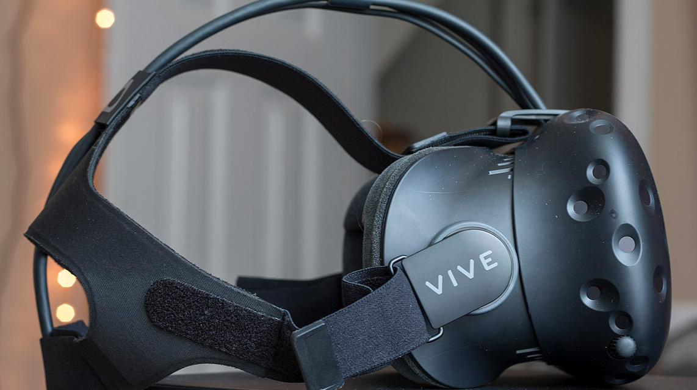

# 半条命的Dota帝国Valve：半条命

今天我要说的是一家总部设在西雅图的知名游戏公司 Valve Software，即维尔福软件公司。

早期在西雅图创业的公司，都有微软的背景，比如说 Expedia、RealNetworks 等，这源于微软在上市以后股票大涨几十倍，造就了一批衣食无忧又有想法的人。Valve 的两位创始人也出自微软，他们是加布 · 纽维尔（Gabe Newell）和麦克 · 哈灵顿（Mike Harrington）。

这两位大神都是非常热爱游戏的骨灰级玩家。他们作为 Windows 操作系统的早期开发者，在微软混到衣食无忧之后，便决定自己创业开发游戏。两个毫无游戏开发经验的人，第一个创业想法居然是做一家游戏公司，实在有点不可思议。

更重要的是，他们并不想做那些相对简单的游戏，而是要做一款震撼全世界的游戏。当然，老司机虽然不懂游戏开发，基本功却相当扎实。要知道，能够写操作系统的人，写程序的能力肯定极强。

Valve 公司名的由来已经不可考了，这个看似普通的名字，并不妨碍它成为这 20 年里最有影响力的游戏公司。

历经一圈考察以后，编程界的老司机，却也是游戏界“菜鸟”的两人决定实行“拿来主义”，用 Quake 的引擎开发了一款 3D 动作游戏。这款被命名为《半条命》的游戏，在未来的 20 年间红遍全球，吸引了无数的骨灰级粉丝。

游戏不只是开发这么简单，它还需要发行商，正好当时同在西雅图东区的游戏发行商 Sierra Online 打算发行一款动作游戏。于是双方达成了发行协议，Valve 的两位创始人接下来可以专心打造游戏了。

这款游戏第一次亮相是在 1997 年的 E3 游戏展，当时只是个半成品，所谓“是骡子是马拉出来溜溜”这句话永远都是成立的。Valve 的两位老司机虽然初入游戏圈，但雏凤清于老凤声，他们的游戏《半条命》一登场，就吸引了大量的目光。

这款游戏和当时流行的其他游戏有一个显著的不同，它既没有全场打打杀杀，也没有利用过场动画来讲故事这种老套的方式。反之，它的故事就发生在游戏的过程中，游戏就在故事中进行，极强的代入感让大家深切感受到了这款游戏的与众不同。

E3 上一炮打响，让大家知道这注定会是一款大红大紫的游戏。然而，接下来的事情，就如同任何一款知名游戏一样，跳票发生了。本来预期 1997 年下半年能够发布的游戏，到了年底还是没有影子，Sierra Online 开始怀疑这个公司是否真的有能力把游戏做完。怀疑的种子一旦种下，就慢慢开始成长。

游戏的开发并不顺利，老司机遇到新难题，确实没想那么多。于是游戏继续跳票，到了 1998 年春天仍然没有影子，夏天同样没有交付。在拖了一年以后，1998 年感恩节附近，这款游戏终于上市了。

《半条命》游戏一上市，就吸引了大量的玩家，市场评价不是一般得好。这无疑是个传奇：两个毫无游戏开发经验的人，在经过两年多时间之后，通过第一款游戏一举站上了游戏界的巅峰。

公司之后的发展，和其他人预想的不太一样。大家觉得，成功以后他们应该会迅速发布第二个系列，很多游戏公司以往都是这样做的，然而 Valve 却有不同的想法。

MOD 大法在游戏里是很常见的一个东西。也就是说，游戏公司开放一部分代码或者工具，其他游戏玩家在此基础上制作扩展包，有些时候这种扩展包甚至是一个崭新的游戏。有的游戏公司非常支持 MOD，但也有强烈反对者。Valve 的两位创始人虽然是游戏开发界的新手，但确实是游戏玩家里的“老司机”，他们对于 MOD 是非常支持的。

《半条命》成功以后，Valve 公司走向了一条阳光灿烂的 MOD 大道。《半条命》的大量代码被开放，而社区玩家开始了 MOD，这种 MOD 里很多游戏质量都不低，其中最负盛名的是《反恐精英》。

《反恐精英》完全颠覆了《半条命》的游戏玩法。和《半条命》的全员无差别大乱斗不同，《反恐精英》是一款多人回合制射击游戏，人物和人物之间也差异显著。从 1999 年推出 Beta 测试版后，它一直就非常受欢迎。

Valve 很开心地把《反恐精英》团队买下，加入了自己的公司。之后《反恐精英》系列也发行了好几个续作，这不仅让 Valve 赚了大量的金钱，更收罗了很多游戏开发人才。虽然是大家都玩的 MOD 大法，只有 Valve 赚得笑开了花。

这个时候创始人之一的哈灵顿因为理念不合离开了团队，开始长假，并在此后创办了新的公司且被谷歌收购。其实，哈灵顿的离去始终是个迷，他自己没有谈过，纽维尔也没有谈过，我们在公开资料里也查询不到什么。但因为他的离去，2000 年后的 Valve，主要都是创始人纽维尔在管理了。

在 MOD 大法这条路上越走越远的 Valve 已经多年没有新作，市场上对《半条命 2》的呼声也越来越高。时隔 5 年后的 2003 年，Valve 终于展出了《半条命 2》。然而时也运也，在游戏即将发行的时候，《半条命 2》的源代码和其他相关素材被黑客窃取，公布在了网上。

更重要的是，这个被偷窃的版本是个未完成品。未完成的《半条命 2》不仅难玩，而且有无数的 Bug，让久久等待《半条命》续作的玩家大为失望。而这种失望直接反映在销售上，玩家们纷纷通过各种途径表示不会去买即将上市的游戏。最终新的游戏发行商 Vivend Universal 决定放弃在 2003 年发行《半条命 2》。

Valve 当然不是吃素的，而纽维尔和游戏玩家有着很好的关系。他决定出手，一边向 FBI 报警，一边让社区帮忙寻找那个罪大恶极的黑客。我常常这样想，上帝是公平的，有些人智商高了情商就比较低，这次黑了 Valve 的黑客也未能免俗。

黑了 Valve 并泄露了源代码的黑客主动现身，并且表示希望为 Valve 工作。而纽维尔则一边表示愿意提供职位，希望对方来美国，一边却和 FBI 联系，准备抓捕这个大胆的黑客。黑客终究是没来美国，就在德国被抓了。

于此同时，Valve 和发行商也开始打起官司来。这场官司的主要争议在于，Valve 觉得自己可以通过自己的渠道发行纯下载版本的《半条命 2》，而不需要通过发行商，但是发行商则认为自己买断了所有的发行权限。

这场官司打了一段时间，已经严重影响到游戏的发行，再打下去，对谁都不好。双方庭外和解之后，这个屡次跳票，负面新闻不断的《半条命 2》终于在 2004 年的夏天发行。此时，距离《半条命 1》已经过去了 6 年。

Valve 在所不惜也要打官司，希望保留数字下载的发行权，是和它正在做的一个东西紧密相关的。那就是被誉为游戏界 iTunes 的 Steam 平台，它比起 Valve 发行的游戏，在今天对 Valve 的影响更为重要。有关 Steam 平台和《半条命 2》的后续情况，我们下回分解。

# 半条命的Dota帝国Valve：Steam平台

上回说到经历了代码被偷，以及和发行商打官司的事件之后，《半条命 2》终于发行了。这款游戏最终没有让人失望，Valve 出品必属精品，这是必然的。

《半条命 2》里面的 NPC（即“非玩家角色”）有很高的人工智能属性，这和当时发行的很多游戏都不同。而《半条命 2》使用了 Valve 后来非常著名的 Source 引擎，加上《半条命 2》里面独有的物理引擎，一切都让这款游戏显得非常独特。

比如说，在《半条命 2》里面因为有对重力的处理，枪支不但可以射击，还可以扔向游戏里面的任何人物或者物体，并且产生符合现实物理系统应有的反应。总之一切都很美好。

前面我提到 Valve 和发行商打官司，这其实是因为 Valve 公司注意到了一个很严重的问题：游戏发行靠发行商，而发行商不一定靠谱。因此，在开发《半条命 2》的同时，Valve 就开始打造一个叫作 Steam 的游戏下载和发行平台。

这个想法在当时是非常先进的，Steam 平台就相当于游戏界的 iTunes。此系统是 BT 协议的发明者布拉姆 · 科恩（Bram Cohen）亲自操刀开发设计的，它运用了和 BT 类似的点对点下载的思想，下载游戏的速度非常快。

Steam 平台问世于 2002 年，和新版的《反恐精英：零点行动》一同发行，目前已经成为世界上最大的游戏发行和分销平台，无数公司在上面发行和更新各种各样的游戏。Valve 公司希望从游戏制作厂商向游戏发行厂商的转型企图，在 Steam 平台上显现得淋漓尽致。

更重要的是，Steam 的游戏发行方式和传统游戏发行商不同，它允许很多独立的游戏制作商通过互联网方便地发行游戏。而且，它的下载方式又非常先进，下载速度很快。所有的一切，共同造就了 Steam 系统今天全球最大游戏发行平台的事实。

Valve 公司为了推行 Steam 平台也是不遗余力。《半条命 2》的发行自然成为了推行 Steam 平台非常重要的举措，Steam 平台允许玩家预先下载游戏《半条命 2》，然后在发行日就可以直接玩，这让玩家们欢欣鼓舞。当然，游戏好是基本前提，否则自然无法帮助推广 Steam 平台。

《半条命 2》是如此成功，以至于 Valve 公司把它移植到了各大游戏主机上。和一年前那个命途多舛的《半条命》泄密版比起来，这无疑彰显了 Valve 公司非常令人佩服的执行力。

按照 Valve 的传统，《半条命 2》肯定是要继续走 MOD 路线的。作为对 MOD 最为友善的游戏公司之一，Valve 在《半条命》上赚的不是一星半点，《半条命 2》延续这个套路也是很自然的事。

眼看着如此成功的《半条命 2》，Valve 决定做点儿别的事来帮助推广 Steam。Valve 的第一次尝试是用《半条命 2》的引擎做了一个非常简短的续集，称为《半条命 2》的第一集。这个续集很短，所以售价很便宜，并通过 Steam 平台卖出去。

这个迅速出现的产品，既没有耗费 Valve 很多时间去开发，又让它延续了《半条命 2》的热度，因此在推广 Steam 的道路上走出了很成功的一步。然而毕竟这个东西比较短，热度很快就过去了。

为了推广 Steam，不遗余力的 Valve 决定祭出捆绑大旗。我们知道很多公司成名以后都喜欢用捆绑策略，因为这样做成本低，效果好。这次捆绑涉及 5 个游戏：《半条命 2》《半条命 2》续集第一集、续集第二集，还有《军团要塞 2》，以及解密游戏《传送门》。这次捆绑销售总体来说是成功的，反正新游戏买了也没多花钱，能玩则玩，即使没意思也无伤大雅。

到 2008 年的时候，业界在猜测应该是推出《半条命 3》的时候，Valve 却决定推出一款新的游戏：《求生之路》。而《半条命 3》至今依然遥遥无期，不知道是否还有出 3 的可能。

《求生之路》这款游戏又实现了一次跨越，它是一个可以联网四人组队的游戏。问题在于，这款游戏会根据玩家以前的表现来调整游戏的难度：简单来说，如果是新手，那么打游戏的时候敌人就会弱一些，而道具则会多一些；如果是高玩，那么对不起，等待你的是地狱模式。

这种游戏设定是以前没有过的，这让《求生之路》变得非常吸引人，于是全球的玩家们从对《半条命》续集的期盼，迅速转移到了《求生之路》上。可是正当大家都在为《求生之路》痴迷，觉得 Valve 公司肯定会大量开发资料片和开放 MOD 的时候，Valve 公司却出人意料地宣布，《求生之路 2》在一年后就开始开发。

这一下子就炸锅了。最主要的原因还是花了钱的玩家觉得受骗了，好端端地等待资料片的变成了等待续集，那么多钱买的游戏居然很快就没办法通过资料片继续扩展下去了，而是非要重新花更多的钱买新版。这次的事情闹得非常大，很多玩家宣布，就算《求生之路 2》发布了，也绝不购买。

这场风波愈演愈烈，Valve 公司也没什么良策。玩家最终分裂成了《求生之路 1》和《求生之路 2》两派，我想这是 Valve 公司始料未及的，而 Valve 应对这次危机的做法，就是让时间去缓解。慢慢地，《求生之路 2》的队伍逐渐壮大，此事也就顺利蒙混过关了。不过，这确实是自《半条命》代码被盗以来，Valve 公司经历的最大危机。

此后几年 Valve 公司不痛不痒地以一年一个的速度发行了几款游戏，这些游戏当然都多少引起了不少反响，但是和《半条命》比起来，始终都有差距。

同时 Valve 公司投入了很多精力去推广它的 Steam 平台，Steam 平台做得是风生水起。Valve 公司代表业界给很多小的游戏制作者和个人提供了很好的发行平台，这一点我们还是需要感谢 Steam 的。

时间很快过去，一晃又是 4 年，Valve 公司的《半条命 3》依然遥遥无期。这个时候一件很重大的事情进入了 Valve 的视野。这里涉及另外一个非常著名的游戏公司暴雪的一款非常著名的网游《魔兽世界》，和一个在《魔兽世界》里 MOD 的地图。

接下来就将是 Dota 的故事！Dota 的出现，让 Valve 公司接下来几年的工作重心都围绕着它展开，至于《半条命》的续集，早就被抛诸脑后了。

# 半条命的Dota帝国Valve：Dota 2

在 Steam 平台和游戏《半条命》之外，现在大家对于 Valve 关注度最大的是一款叫作 Dota 2 的游戏。

简单来说，Dota 2 是由 Valve 开发的一款免费的多人在线竞技类游戏。基本的玩法是两支队伍各有 5 位成员，在游戏地图上对抗，每位成员可以从 113 位英雄里面选择一位作为自己的角色。游戏的最终目的是摧毁对方基地里面的关键建筑：遗迹。

Dota 2 有遍及世界的专业比赛，其中最大的国际邀请赛则由 Valve 公司举办，每年一度在西雅图的钥匙球体育馆（Key Arena）进行。中国竞技队水平很高，但是传统上逃不过“奇数年输，偶数年赢”的命运。去年是 2017 年，输了。

Dota 2 比赛的时候，西雅图吸引了无数的 Dota 迷，可谓一票难求。与此同时，比赛奖金也一直都是千万美元级别的。至于明星战队和明星成员们，在世界各地也是非常有名。美国各类竞技比赛的直播，当然也是让直播平台和相关选手赚到手抽筋。

在 Dota 2 比赛的那天，我的朋友圈里面到处都是相关信息。很多程序员要么请假，要么偷跑出去到现场围观比赛。在我办公的地方，那层楼空了一小半，90 后全部失踪了。第二天回来他们一脸沮丧的样子，比输球还可怕。

我一直都觉得，一款游戏是如此火爆，实在是有点让我这样的伪游戏玩家不可思议。当然隔行如隔山，有喜欢打游戏的，有喜欢玩二次元的，有喜欢写文章的。重要的是，你只要知道 Dota 2 实在异常火爆就是了。

这款游戏为什么叫 Dota 2 呢？因为 Dota 本身并非是 Valve 开发的。Dota 起源于 2003 年，最初是暴雪公司《魔兽争霸 3》里面的一张自定义地图。在《魔兽 3》的扩展包《冰封王座》发布以后，类似的自定义地图纷纷涌现出来，并以其独有的特色开始流行。这其中最著名的当属史蒂夫 · 菲克（Steve Feak）制作的 Dota 全明星地图。

后来这张地图的制作者菲克和他的朋友史蒂夫 · 梅思康（Steve Mescon）成立了官方的 Dota 社区，紧接着又成立了 Dota 全明星有限责任公司。在 2005 年的时候，菲克从 Dota 项目上退了出来。他的另一位好友冰蛙（IceFrog）接替他成为了项目的负责人。

在 2009 年的时候，新负责人冰蛙和老创始人梅思康理念不合闹开了。此事最后导致冰蛙离开，并且自己搞了一个新的社区网站。

冰蛙的离开让 Valve 里面的 Dota 粉丝们有了些想法，Dota 粉丝和 Valve 的创始人纽维尔交流之后，决定联系冰蛙。开始可能也只是随意聊聊，但是很快冰蛙就成为了 Valve 的雇员。Valve 公司决定在冰蛙的领导下，使用 Valve 公司研发的起源引擎，开发一款类似的新游戏，游戏被命名为 Dota 2。

所谓的 Dota 2 自然是一个类似 Dota 的全新游戏，但不再是暴雪《魔兽争霸》的定制地图，而是一款独立的游戏，可以不依赖于暴雪公司的《魔兽争霸》独立运行。同时，这款游戏也连接了 Valve 公司最为著名的 Steam 游戏平台，将在 Steam 平台上开放给广大玩家。

作为一个合格的商人，纽维尔看到了 Dota 这个名字背后的商机，他立刻注册了 Dota 的商标。这种行为其实多少是有争议的，因为 Dota 这个称呼并非 Valve 最开始使用的。果不其然，此事引发了史蒂夫 · 菲克和史蒂夫 · 梅思康成立的 Dota 全明星公司和 Valve 之间的一场官司。

Dota 全明星公司几经转手以后，暴雪获得了授权，代表 Dota 全明星公司，对 Valve 的商标权的合法性提起申诉。于是暴雪和 Valve 这两个游戏界的庞然大物，在 2011 年就 Dota 的商标问题打起了官司。

这场官司前后持续了一年多，最后的裁决总体上有利于 Valve，Valve 公司得以保留 Dota 的商标权。但是作为裁决的一部分，第三方也可以使用 Dota 这个商标，只要不从事营利行为。

有人觉得这是一年以后 Dota 2 上线宣布免费玩的原因之一。因为如果说 Dota 2 自己不是免费玩的话，那么暴雪公司估计分分钟可以搞起一个免费的 Dota 克隆版来。这样一来 Valve 公司肯定赚不到好处。当然这也只是坊间传闻，不太可能从 Valve 公司内获得确认了。

Dota 2 的第一次测试源于 2011 年的第一届国际 Dota 邀请赛，之后游戏长期处于 Beta 状态。等到 2013 年 Dota 2 正式发布的时候，游戏早就有超过 300 万的活跃用户了。根据一个不是最新的统计，如今 Dota 相关的用户流量，占全球互联网流量的 3%。这些年来，Dota 2 的游戏上线率一直维持在百万用户级别，一款游戏能够达到如此的高度，堪称游戏发展史上的里程碑。

Dota 2 的基本运营模式非常有意思，就是所谓的免费玩模式。Valve 在 2012 年就宣布了，它们开发的 Dota 2 将会永久保留免费玩的模式。这个免费玩和我们国内的网游模式并不相同。国内网游很多时候游戏是免费玩的，但是花了钱才可以拿到更强力的装备，所以人民币玩家可以轻松地打败免费玩家。而 Valve 并不给花钱的玩家提供额外的道具角色，免费玩家和花钱的，在战斗力上没有任何区别。

Dota 2 主要的盈利模式来源于一个叫作 Dota 商店的东西。在这里，你可以买到游戏中可使用的装饰性道具。更重要的是，这个系统可以让玩家发布自己的创意。玩家创意如果入选，玩家就可以通过这种方式赚钱，这是 Valve 公司公布的现在 Dota 2 在线的主要赚钱方式。

至于以 Dota 2 衍生出去的世界各地的各种比赛，以及围观比赛所需要购买的在线或者现场的入场券，这些东西的收入则更是可观。一句话总结，虽然说游戏是免费玩的，作为竞技类游戏，Valve 公司从来都没少在游戏里面赚到钱。

由于 Valve 公司是私人企业，从来不需要对外公布财务信息，因此它到底是通过卖东西赚到了更多的钱，还是通过组织竞技比赛赚到了更多的钱，大家只能猜测一下。

Dota 2 本来是用 Valve 公司的起源引擎开发的，2015 年的时候 Valve 公司宣布下一代引擎起源 2 代，这个引擎随即被用来重新开发 Dota 2。在 Dota 2 的发展历史里，因为这次重新开发，导致了用户的大量流失。这是 Dota 2 有史以来第一次，也是唯一的一次大量客户流失。客户流失历经小半年，才逐渐恢复到起源 2 引擎改版发布前的水平。

Dota 2 堪称现在 Valve 公司几年内的重心，而 Steam 平台由于 Dota 2 的加入，也让更多的游戏得以展现给更多的玩家。这种相辅相成的发展模式，给 Valve 公司的未来带来了无限可能，也让 Valve 公司越发成为一家在游戏界举足轻重的公司。

亲爱的朋友，你觉得当初 Valve 公司为什么要介入 Dota 后续项目的开发？冰蛙又为什么选择了 Valve 呢？

#  半条命的Dota帝国Valve：无领导管理

前面我说到了最近几年大红大紫的游戏 Dota 2，今天和你一起看看 Valve 公司在管理和招人上的故事。你会发现，Valve 公司在人事方面可能是世界上最有特色的公司之一。

Valve 公司的第一个原则是，公司里面没有任何一个人需要向他人汇报工作。当然这也就意味着公司内没有所谓的 CEO、CTO、总裁、副总裁、总监、经理等等职位，员工之间没有上下级关系。在 Valve 里面，公司是彻底扁平化的。这种扁平化意味着每个人都可以做任何事，也意味着如果你想去问别人你到底要做什么的话，其实没人能给你答案。

我第一次听到这个公司文化的时候，真的是非常吃惊，因为在任何一个组织里，没有秩序就意味着没有产出。大家都是平级的，也就是大家都不需要负责人。Valve 公司的新员工手册上写到：我们不需要任何人管，谁也不需要向谁汇报。

要去 Valve 公司参观并不难，如果你是个 Dota 2 的粉丝，报上你的账号，就可以预约。不过作为一个伪游戏迷，我就没有这份幸运了。但是我有幸听参观过的朋友说起，这个公司的开发环境非常奇特，也可以说非常得“奇葩”。

一个员工被招进来以后，他也不知道要干什么，别人也不会告诉他要做什么。Valve 的办公桌下面有滑轮，所以员工可以把自己的桌子随便移动到一个项目组里去，听听别人聊天。聊出兴趣来以后，就进那个组里工作了。

基本上可以说，在 Valve 里面每个人想要干什么，兴趣最重要。员工可以加入他们认为自己最感兴趣最喜欢的组里去。有些员工非常厉害，可以在若干个组之间穿梭，有些员工则有办法拉起一波人开启新项目。从这一点来看，Valve 招的都是那些主动意愿非常强的人。

这当然不是什么坏事情，但一定程度上或许也可以解释为什么 Valve 的游戏经常跳票。不管是为了质量还是为了创意，跳票可能都是 Valve 的文化里不可或缺的一部分。不然的话，员工的主观能动性没有发挥好，可能就做不出高质量的产品了。

但是我们知道，任何软件的开发，都有很多很有挑战的活，也有很多非常无趣的事情。Valve 是怎么做到在让每个人都能发挥自己兴趣的同时，又确保那些脏活累活都有人妥妥地干掉呢？

Valve 更有意思的是招人不拘一格。Valve 公司招人的标准，很多时候是不确定的，似乎不管什么样的人才，只要有意义有特色，都可能被招。比如说我们打开 Valve 的网站看一看，迈克 · 安宾德（Mike Ambinder）这位老兄位列员工表第一位。他是计算机和心理学双学士、心理学博士。他在自我介绍中表示，自己在公司内的职责很模糊，但大体上是把心理学的知识和方法论运用到游戏里。

我突然之间就能理解了，为什么网上对 Vavle 的游戏评价总是“特别的引人入胜”“挑战人的极限却不过”，想来这与公司里有个心理学博士天天琢磨什么样的游戏才符合人的心理，一定是不无关系。

比如说莱斯利 · 里德（Leslie Redd）这位 Vavle 的前员工，如今的创业公司 CEO。在加入 Valve 之前，她是某高中的管理员，因为使用了 Valve 游戏传送门来给学生上物理课，而被 Valve 的创始人相中加入了 Valve。这算得上是非常得不拘一格招人了。

有关 Valve 公司用人最不拘一格的事情，莫过于雅典大学经济学教授亚尼斯 · 瓦鲁法基斯（Yanis Varoufakis）一篇博文里的故事了。亚尼斯是欧洲著名的经济学家，经常在网上写一些博文，分析欧洲经济形势、希腊经济危机等。

按照他自己的说法，某天他突然收到了一封信。通常情况下他收到的信太多，这种类似垃圾邮件的信都是直接删了不读的，但是那天却鬼使神差地读了起来。写信的人自称是一家叫作 Valve 的公司的 President。由此看来，创始人在和外面联系时还是需要一个名称的：Valve 虽然没有 CEO，但是却有个 President。

这位 President，也就是 Valve 的创始人加布 · 纽维尔（Gabe Newell），在邮件里他大大夸赞了亚尼斯一把，然后表示要邀请他来西雅图访问 Valve，顺便探讨一下在游戏这样的虚拟世界里面，经济学的规律是如何运作的。亚尼斯就这样跑到了西雅图，经过一番交谈，他决定通过兼职方式加入 Valve，作为他们的驻站经济学家。

亚尼斯之所以对这份工作感兴趣，按照他自己的说法是，在虚拟世界里每一笔交易和行为都有详细的记录。从经济学的角度来说，虚拟社区的数据详尽，一点儿不差，任何分析都可以基于完整的数据做出来。

与之相反，现实中我们的经济行为不可能被完整记录下来。所以现实世界里面的经济学研究需要利用大量的统计学知识，做很多的假设。这样一来，对于现实世界的经济学研究难免做不到精确。而虚拟世界的这个优势，可以让经济学研究完全抛弃传统的基于统计的方式，使用绝对准确而完整的数据，做出传统经济学上完全无法做到的分析和研究。

当然，对于 Valve 公司来说，请一个经济学家来提供咨询，对于他们如何在数字世界里面赚钱，肯定是非常有意义的。然而我必须说，这种读了别人的博文以后就打算请人来面谈，面谈完了就让人来做自己员工的做法，除了 Valve，我还没有听说过第二个公司。

以上都是这家公司好的一面，但是 Valve 其实也面临员工离职的问题。离职的原因大都指向了一件事情，就是创始人纽维尔既不愿意把公司卖掉，也不愿意上市。这样一来，那些指望着公司上市以后期权可以大量盈利套现的员工，自然会在等待中慢慢失望，直至离开公司。

Valve 最初成立依赖的就是创始人自己的钱财投入，此后也从未向资本市场募集过一分钱。而且 Valve 公司盈利好，不缺钱。这样一来资本市场想要从 Valve 公司分一杯羹就比较难了。但是在 Valve 公司漫长的发展历史上，一直不缺想收购 Valve 的公司，收购价从最初的几千万美元，到近期报价 10 亿美元，收购价可谓诚意满满。然而纽维尔接受其他人采访时，态度非常明确，在他有生之年多半是不会改变这个念头了。

那么亲爱的朋友，你是不是愿意去一家没有老板，干活凭兴趣，招人看缘分，但是却永远上不了市的公司工作呢？

# 半条命的Dota帝国Valve：虚拟现实

Valve 公司其实还是一家以“创新”著称的公司。早年在《半条命》里面的创新主要在于游戏情节，但后来将 Steam 作为游戏分发平台打造，其开始时间比 iTunes 还要早。

最近这段时间，有两条消息值得你我注意。其中最为轰动的是苹果公司总裁蒂姆 · 库克（Tim Cook）访问了 Valve，没有人知道两者达成了什么协议，但据我猜测，可能和硬件设备有关。而我们应该知道，Valve 关注硬件领域的事情由来已久，库克的访问或许会让人感觉好奇，但不见得令人惊讶。我们只需要拭目以待，相信很快可以看到接下来会发生什么。

另外一则消息是：HTC 把自己手机制造业务员工的一半，大约 2000 人“卖”给了谷歌。这个举动可以让谷歌获得手机制造能力，而 HTC 则可以集中精力去做虚拟现实硬件。HTC 的这个举动同样不是让人特别吃惊，它早年以手机制造起家，然而这些年来手机业务却一年不如一年，市场占有率在任何一个国家都早已不在前三之列。相反，这些年里 HTC 在虚拟现实设备的世界里却是风生水起。一款叫作 Vive 的设备，为 HTC 带来了极高的声誉和大量的金钱。

这个名字叫作 Vive 的东西，正是 Valve 和 HTC 合作的产物。HTC 在很大程度上是把自己的未来赌在了虚拟现实上，而 Valve 公司在游戏上的成功，为 HTC 的豪赌备好了很多必要条件。两者相结合，未来很可能会创造出一条一般人难以想象的大道。

Valve 进入虚拟现实的时间同样很早，2012 年就已经开发出一款头戴式显示器。但问题是 Valve 毕竟不是硬件公司，其技术积累有限，做出来的东西笨重，不适合玩家使用，不过作为开发虚拟现实游戏的实验设备是绰绰有余了。Valve 里面的一个团队就在拿着这台原型机乐此不疲地开发游戏。

与此同时，Oculus 的创始人帕尔默 · 洛基（Palmer Luckey）发起众筹开发著名的 Oculus Rift，一款为电子游戏设计的头戴式显示器（即“头显”）。Valve 自己的研发过程非常不顺利，但是 Oculus 的存在让他们看到了希望。于是 2014 年 1 月份双方宣布合作，共同推进虚拟现实技术的发展。

当时帕尔默对 Vavle 已经掌握的虚拟现实技术非常欣赏，认为这是世界上最牛的虚拟现实技术之一。此话是不是有夸张或者广告的成分，我们就不得而知了。

“花开两朵，各表一枝”，此时决定跨界尝试做虚拟现实设备的手机制造商 HTC，在增强现实和虚拟现实之间游走了一段时间后，最终决定集中精力做虚拟现实。

但是很遗憾，手机市场的老对手三星已经发布了基于三星手机的虚拟现实附件，这让 HTC 对于自己的未来到底应该怎么走很是困惑。左思右想之余，他们决定脱离手机做一套完整而独立的虚拟现实设备，瞄准的正是 Oculus 的市场，决定趁早抢占高端市场，而不是像三星那样做手机的附件。也许正是因为这个原因，HTC 的手机业务衰弱了。

非常戏剧性的是，1 月份还在和 Oculus 相谈甚欢的 Valve，到了同年 3 月份就开始和 HTC 勾搭，而被 Facebook 买下的 Oculus 不再提 Valve 有多牛了。据大家猜测，是 Facebook 对 Oculus 的这次收购让 Valve 和 Oculus 的合作出了问题。但无论如何，最牛的游戏公司 Valve 的虚拟现实梦因此变得崎岖起来。

俗话说“山不转水转”，一家不行还有另外一家。HTC 和 Valve 合作的东西，就是后来非常有名的 VR 头显 Vive。有些游戏开发厂商拿到了早期的原型机，据说 Vive 的最初版本颇有 Vavle 自己 2012 年做的那个头显的模样。但是做硬件的 HTC 加入以后，Vive 不断改进和迭代，渐渐变得小巧而实用起来，慢慢成了今天我们看到的样子。

Vive 的最初研发，保密工作做得非常好。这个项目后面涉及很多公司，其中有一些是开发应用和游戏的，还有一些是提供各种硬件的，但是自始至终都没有泄露太多信息。

之所以如此保密，我想一方面可能是敬畏于被 Facebook 收购以后 Oculus 背后强大的技术和资金支持，很多参与这个项目的公司觉得得罪不起。另外一方面，这些参与的公司，尤其是游戏公司，多半是脚踩两只船，准备自己的游戏同时登陆 Vive 和 Oculus 平台。对外保密也有助于他们和 Oculus 的合作或潜在合作不受影响。不管怎么说，种种原因都让这个项目非常低调，一点儿不符合 HTC 的传统。

Vive 的亮相始于 2015 年的世界移动通信大会，这次发布会非常成功。两周以后，Vive 又在游戏开发者大会上进行了展示。无论是哪场发布会，这个突如其来的虚拟现实产品，都惊艳全场。很多人都没有想到，在 Oculus 之外，会有一个做手机的厂商，和一个做游戏的厂商，一起合作利用这个虚拟现实的硬件设备上杀入市场。

Valve 游戏背书，HTC 硬件制造，让这款产品在 2015 年达到了相当的高度。在市面上，Oculus 的设备是标杆，而 Vive 在很大程度上可以媲美 Oculus 的设备。加上 Vive 的定位就是高端设备，相对低廉的价格，而成本也是 HTC 等很多中国台湾企业比美国企业更擅长做的事情。所有情况加在一起，Vive 注定将是一款非常畅销的产品。

到了 2016 年，Vive 正式发布了消费者版本，且消费版和展示版变化不大。这个版本不仅价格低廉，和 Oculus 的设备售价比起来简直是良心价白菜价，而且有着良好的性能表现，因此深受用户欢迎。

但是在那一年，有一些游戏是 Oculus 上独家的，这让买了 Vive 的人很不开心。我们知道玩游戏的人，很多也都是黑客高手。于是在“宝宝不开心宝宝有情绪”的情况下，某个黑客高手把 Oculus 的限制给黑了。

事实证明，黑掉以后，便宜很多的 Vive 照样可以玩那些游戏，Oculus 毕竟还是太贵了。此事后来也是闹得沸沸扬扬，Oculus 推出了反破解手段，但是又再次被破解掉，如此循环往复。不管怎么样，这从侧面证明了价廉物美的 Vive 的确是市场上非常好的 VR 设备。

作为 2016 年以来市场上性价比最高的 VR 设备，Vive 的出现给 Vavle 和 HTC 都赢得了大量的赞誉。Vive 又再接再厉地迎来了新一代产品 Vive Pre。新版本调整了很多硬件上的位置，也减重不少。

时至今日，Vive 已经是新一代虚拟现实产品里面的佼佼者。所以 HTC 有信心离开自己不赚钱的手机业务，全力以赴做虚拟现实市场了。

亲爱的朋友，你怎么看待 Valve 跨界进入虚拟现实设备的研发，以及选择和 HTC 的合作呢？你对 Vive 的市场和前途又有什么看法？欢迎留言和我探讨。

# Gabe Newell：Valve帝国制度的利弊

Valve 是一家极具特色的游戏公司。Valve 有非常卖座的游戏，有被誉为游戏界 iTunes 的游戏发行平台 Steam，有人气爆棚的联网游戏 Dota 2，还有代表着未来的虚拟现实技术。在整个电子游戏界，你真的很难再找出第二家这样面面俱到，又每个方面都做得出彩的公司。

Valve 又是一个在组织架构上独具一格的公司。在 Valve，大家都是平等的。虽然现实通常像小说《动物庄园》里著名的谚语那样，“有些人比另外一些人更平等”，但是最起码 Valve 在的组织架构上，没有谁向谁汇报的关系，大家一起对公司负责。

Valve 公司在招人上同样是不拘一格，所招之人往往具有鲜明特色、有主见、能力强，每个人多少都有独当一面的能力。

而且，Valve 是一家持续盈利的私人公司。自从另外一个创始人退出以后，现在的大股东就一个人：创始人加布 · 纽维尔（Gabe Newell）。

在我看来，这家公司不可复制。它的制度，它的运作方式，它的招人方式，都是只有在特定情况下才能诞生的，并不具有普遍性。因此，把它当作一个案例来研究会很吸引人，但如果学习它的经验，希望运用到其他公司里面去，就很难说会是一个什么样的结果了。

Valve 公司的优点，前面已经说过，这里我简单总结一下。

1. 这家公司的每个人都有很强的战斗力，能够独当一面，所以公司整体实力很强。
2. 公司有很民主的氛围，也鼓励大家别具一格地去创新，所以公司的产品非常耀眼。
3. 公司的创始人很有大局观，能审时度势。无论早年做 Steam 平台还是后来做 Dota 2，又或者是进军虚拟现实，都是在恰当的时候做了恰当的事情的典范。
4. Valve 公司没有上下级关系，这也在很大程度上避免了政治斗争的内耗。
5. Valve 公司创立之初创始人就不缺钱，现在整个公司都不差钱，一直都不需要引进任何投资。因此，Valve 公司受资本市场的操控和影响非常小，能够独立做很多的事情。

Valve 的缺点同样非常的明显，而且也同样的不可复制。这也可以从几个方面来看。

第一个方面，公司的层级汇报制度几乎是现在大小公司的基石，因为我们都知道明确责任和权力在公司管理上非常重要，通常即便是非常小的创业公司，也离不开组织架构上的层级关系。让所有人自由发挥做所有的事情，这种方式一实施，一万个公司里面可能最多存活一个公司，那还是烧高香了。

这套制度在 Valve 里面能够实施，首先得益于全体员工对公司创始人纽维尔的认可，即便公司里产生了矛盾，也可由他进行协调。不会产生矛盾的组织是不存在的，但纽维尔的个人威信足以平衡这种矛盾。

其次是 Valve 公司财大气粗，但是公司员工却不多。而且员工各个有主见有能力。这样一来，Valve 公司有很多钱可以给员工们很大的自由空间去发挥，哪怕搞砸了一些事情，也就当经验去学习了。

再次是 Valve 公司从来没有打算扩大公司规模。Valve 只打算在自己擅长的几个领域里面深耕细作，而不是进军新领域，把公司扩张到更大的规模。这是纽维尔可以保证不需要层级和汇报关系的基础。试想一下，一个公司如果大到几千人、几万人，还可以没有任何层级和汇报关系的话，会是怎样一番景象。

如果后来者要学习 Valve，保持公司内的每个人都是平等的，没有层级没有汇报关系，又有没有可能呢？这家公司至少需要具备这样一些要素：

1. 一个能摆平大家，又很有战略眼光的创始人；
2. 一群数目不多，但是各个都自主能干的员工；
3. 很多很多的钱；
4. 公司并不打算大规模的扩张，愿意数十年如一日地维持公司员工规模。

我想这些条件对于几乎任何一家公司都要求太高了。Valve 公司成长到今天，变成这个样子，肯定有其必然性也有偶然性。但是不管怎么样，这是非常难复制的。无论是创业者还是企业管理者，看看热闹就好，切记不要邯郸学步。

第二个方面，这家公司对待资本的态度，它从创业之初开始至今都没有引入资本的力量，所以 Valve 很大程度上都是属于纽维尔一个人的公司。这个特点也决定了纽维尔可以在公司里面一言九鼎，从而有效地帮助他“摆平”公司内的所有员工。

但是完全不引入资本，需要几个前提条件。

- 首先，在创业的阶段，创业者自己就很有钱。如果缺钱的话，公司在某些发展阶段总归是需要引入投资才能撑下去的。

- 其次，这家公司在创业的最初期，就可以大规模盈利，而不是说需要持续烧钱。

    
    那么我们试想一下，互联网行业发展了这么久，到今天又有多少个企业家出来创业就不怕烧钱的呢？又有什么产业公司一创业就开始大把盈利的呢？Valve 的创始人从微软公司上市攫取了第一桶金，之后又进入个人计算机游戏这个当时可以迅速大把盈利的产业。这些先决条件造就了今天它独具特色的状态。而我们目前新创业的公司，显然内部外部条件都不一定具备了。

- 再次，这家公司的股权制度涉及对员工是否公平的问题。这也很难让创业公司去复制，很多人加入创业公司会是因为创业公司的股权，如果公司成功上市了，可以给自己带来大量的财富。但是在 Valve 公司现在这个状态下，基本上就是纽维尔一个人的公司。公司员工是不持股的。因为就算是持股，反正公司也不会卖掉或者上市，公司员工手里的股票也没有变现的空间。

    
    这就涉及到底对员工是不是公平的问题了。在 Valve 公司里工作的人，当然各个都是能手。我相信他们的薪水也不低，但是这个公司里的员工要想财富自由，同样比较困难。因为公司股票不上市，财富也就不会爆炸式增长。这对纽维尔其实影响不大，但是对公司的员工，影响就不小了。

    
    从这个角度讲，其他企业是不敢这样做的，一个永不上市的企业，尤其在其初创阶段，对当今市面上优秀的人才来说，吸引力并不是很大。

总结一下，我觉得 Valve 公司本身非常有特色，而纽维尔作为公司创始人和实际掌控者，展现了高度的大局观和管理能力。但是 Valve 公司的这套独具特色的制度，对于大家来说，唯一的作用可能就是分析研究，因为并不具备普适性，其他公司其他人学不来也没必要学。如果一定要学的话，反而可能造成邯郸学步的结果。

