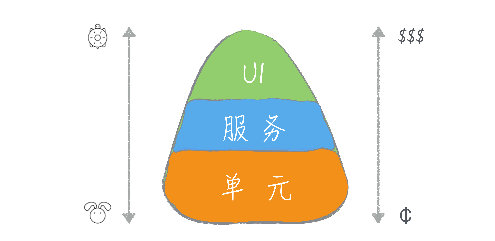
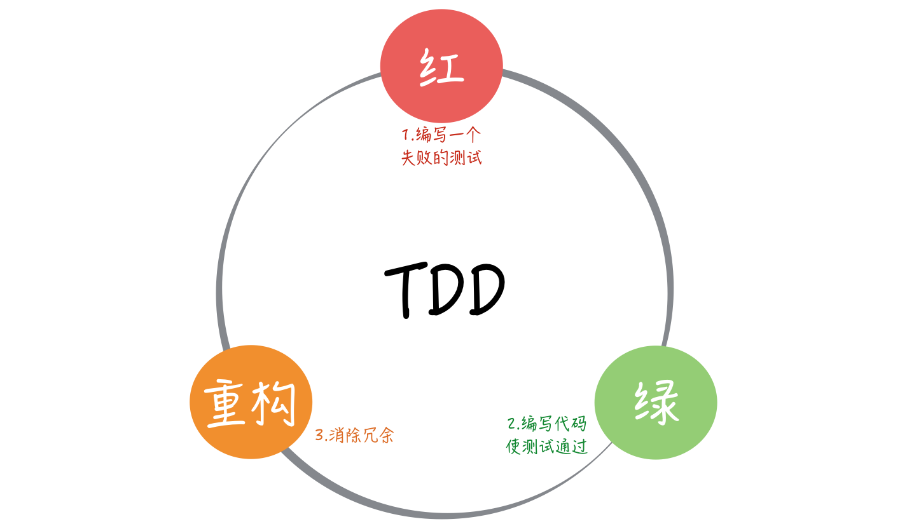

# 任务分解

动手做件事之前，请先对它进行任务分解。

多写单元测试。

我们应该编写可测的代码。

将任务拆小，越小越好。

# 向埃隆·马斯克学习任务分解（开始任务分解）

这次我们从一个宏大的话题开始：银河系中存在多少与我们相近的文明。我想，即便这个专栏的读者主力是程序员这个平均智商极高的群体，在面对这样一个问题时，大多数人也不知道从何入手。

我来做一个科普，给大家介绍一下德雷克公式，这是美国天文学家法兰克·德雷克（Frank Drake）于 1960 年代提出的一个公式，用来推测“可能与我们接触的银河系内外星球高等文明的数量”。

下面，我要放出德雷克公式了，看不懂一点都不重要，反正我也不打算讲解其中的细节，我们一起来感受一下。

不知道你看了德雷克公式做何感想，但对于科学家们来说，德雷克公式最大的作用在于：**它将一个原本毫无头绪的问题分解了，分成若干个可以尝试回答的问题。**

随着观测手段的进步，我们对宇宙的了解越来越多，公式中大多数数值，都可以得到一个可以估算的答案。有了这些因子，人们就可以估算出银河系内可以与我们通信的文明数量。

虽然不同的估算结果会造成很大的差异，而且我们迄今为止也没能找到一个可以联系的外星文明，但这个公式给了我们一个方向，一个尝试解决问题的手段。

好吧，我并不打算将这个专栏变成一个科普专栏，之所以在这讲解德雷克公式，因为它体现了一个重要的思想：任务分解。

通过任务分解，一个原本复杂的问题，甚至看起来没有头绪的问题，逐渐有了一个通向答案的方向。而“任务分解”就是我们专栏第二模块的主题。

## 马斯克的任务分解

如果大家对德雷克公式有些陌生，我们再来看一个 IT 人怎样用任务分解的思路解决问题。

我们都知道埃隆·马斯克（Elon Musk），他既是电动汽车公司特斯拉（Tesla）的创始人，同时还创建了太空探索公司 SpaceX。SpaceX 有一个目标是，送 100 万人上火星。

美国政府曾经算过一笔账，把一个人送上火星，以现有技术是可实现的，需要花多少钱呢？答案是 100 亿美金。如果照此计算，实现马斯克的目标，送 100 万人上火星就要 1 万万亿。这是什么概念呢？这笔钱相当于美国 500 年的 GDP，实在太贵了，贵到连美国政府都无法负担。

马斯克怎么解决这个问题呢？他的目标变了，他准备把人均费用降到 50 万美元，也就是一个想移民的人，把地球房子卖了能够凑出的钱。原来需要 100 亿美金，现在要降到 50 万美金，需要降低 2 万倍。

当然，降低 2 万倍依然是一个听起来很遥远的目标。所以，我们关注的重点来了：马斯克的第二步是，把 2 万分解成 20×10×100。这是一道简单的数学题，也是马斯克三个重点的努力方向。

**先看“20”：现在的火星飞船一次只能承载 5 个人，马斯克的打算是，把火箭造大一点，一次坐 100 人，这样，就等于把成本降低 20 倍。**如果你关注新闻的话，会发现 SpaceX 确实在进行这方面的尝试，

**再来看“10”：马斯克认为自己是私营公司，效率高，成本可以降到十分之一。**他们也正在向这个方向努力，SpaceX 的成本目前已经降到了同行的五分之一。

**最后的“100”是什么呢？就是回收可重复使用的火箭。**如果这个目标能实现，发射火箭的成本就只是燃料成本了。这也就是我们频频看到的 SpaceX 试飞火箭新闻的原因。

这么算下来，你是不是觉得，马斯克的目标不像最开始听到的那样不靠谱了呢？**正是通过将宏大目标进行任务分解，马斯克才能将一个看似不着边际的目标向前推进。**

## 软件开发的任务分解

好了，和大家分享这两个例子只是为了热热身，说明人类解决问题的方案是差不多的。当一个复杂问题摆在面前时，我们解决问题的一个主要思路是分而治之。

**一个大问题，我们都很难给出答案，但回答小问题却是我们擅长的。**所以，当我们学会将问题分解，就相当于朝着问题的解决迈进了一大步。

我们最熟悉的分而治之的例子，应该是将这个理念用在算法上，比如归并排序。将待排序的元素分成大小基本相同的两个子集，然后，分别将两个子集排序，最后将两个排好序的子集合并到一起。

一说到技术，大家就觉得踏实了许多，原来无论是外星人搜寻，还是大名鼎鼎的马斯克太空探索计划，解决问题时用到的思路都是大同小异啊！确实是这样。

**那么，用这种思路解决问题的难点是什么呢？给出一个可执行的分解。**

在前面两个例子里面，最初听到要解决的问题时，估计你和我一样，是一脸懵的。但一旦知道了分解的结果，立即会有一种“柳暗花明又一村”的感觉。你会想，我要是想到了这个答案，我也能做一个 SpaceX 出来。

但说到归并排序的时候，你的心里可能会有一丝不屑，这是一个学生级别的问题，甚至不值得你为此费脑子思考。因为归并排序你已经知道了答案，所以，你会下意识地低估它。

任务分解就是这样一个有趣的思想，一旦分解的结果出来，到了可执行的步骤，接下来的工作，即便不是一马平川，也是比原来顺畅很多，因为问题的规模小了。

在日常工作中，我们会遇到很多问题，既不像前两个问题那样宏大，也不像归并排序那样小，但很多时候，我们却忘记了将任务分解这个理念运用其中，给工作带来很多麻烦。

举一个例子，有一个关于程序员的经典段子：这个工作已经做完了 80%，剩下的 20% 还要用和前面的一样时间。

为什么我们的估算差别如此之大，很重要的一个原因就在于没有很好地分解任务，所以，我们并不知道要做的事情到底有多少。

前面我们在[“为什么说做事之前要先进行推演？”](http://time.geekbang.org/column/article/76716)文章中，讲到沙盘推演，这也是一个很好的例子，推演的过程就是一个任务分解的过程。上手就做，多半的结果都是丢三落四。你会发现，真正把工作完全做好，你落掉的工作也都要做，无论早晚。

**与很多实践相反，任务分解是一个知难行易的过程。**知道怎么分解是困难的，一旦知道了，行动反而要相对来说容易一些。

在“任务分解”这个主题下，我还会给你介绍一些实践，让你知道，这些最佳实践的背后思想就是任务分解。如果你不了解这些实践，你也需要知道，在更多的场景下，先分解任务再去做事情是个好办法。

也许你会说，任务分解并不难于理解，我在解决问题的过程中也是先做任务分解的，但“依然过不好这一生。”这就要提到我前面所说难点中，很多人可能忽略的部分：可执行。

可执行对于每个人的含义是不同的，对于马斯克而言，他把 2 万分解成 20×10×100，剩下的事情对他来说就是可执行的，但如果你在 SpaceX 工作，你就必须回答每个部分究竟是怎样执行的。

同样，假设我们做一个 Web 页面，如果你是一个经验丰富的前端工程师，你甚至可能认为这个任务不需要分解，顶多就是再多一个获取网页资源的任务。

而我如果是一个新手，我就得把任务分解成：根据内容编写 HTML；根据页面原型编写页面样式；根据交互效果编写页面逻辑等几个步骤。

**不同的可执行定义差别在于，你是否能清楚地知道这个问题该如何解决。**

对于马斯克来说，他的解决方案可能是成立一个公司，找到这方面的专家帮助他实现。对你的日常工作来说，你要清楚具体每一步要做的事情，如果不能，说明任务还需要进一步分解。

比如，你要把一个信息存起来，假设你们用的是关系型数据库，对大多数人来说，这个任务分解就到了可执行的程度。但如果你的项目选用了一个新型的数据库，比如图数据库，你的任务分解里可能要包含学习这个数据库的模型，然后还要根据模型设计存储方案。

不过，在实际工作中，大多数人都高估了自己可执行粒度，低估任务分解的程度。换句话说，如果你没做过任务分解的练习，你分解出来的大部分任务，粒度都会偏大。

只有能把任务拆分得非常小，你才能对自己的执行能力有一个更清楚地认识，真正的高手都是有很强的分解能力。这个差别就相当于，同样观察一个物品，你用的是眼睛，而高手用的是显微镜。在你看来，高手全是微操作。关于这个话题，后面我们再来细聊。

一旦任务分解得很小，调整也会变得很容易。很多人都在说计划赶不上变化，而真正的原因就是计划的粒度太大，没法调整。

从当年的瀑布模型到今天的迭代模型，实际上，就是缩减一次交付的粒度。几周调整一次计划，也就不存在“计划赶不上变化”的情况了，因为我的计划也一直在变。

**如今软件行业都在提倡拥抱变化，而任务分解是我们拥抱变化的前提。**

## 总结时刻

我们从外星人探索和马斯克的火星探索入手，介绍了任务分解在人类社会诸多方面的应用，引出了分而治之这个人类面对复杂问题的基本解决方案。接着，我给你讲了这一思想在软件开发领域中的一个常见应用，分而治之的算法。

虽然我们很熟悉这一思想，但在日常工作中，我们却没有很好地应用它，这也使得大多数人的工作有很大改进空间。运用这一思想的难点在于，给出一个可执行的分解。

一方面，对复杂工作而言，给出一个分解是巨大的挑战；另一方面，面对日常工作，人们更容易忽略的是，分解的任务要可执行。每个人对可执行的理解不同，只要你清楚地知道接下来的工作该怎么做，任务分解就可以告一段落。

大多数人对于可执行的粒度认识是不足的，低估了任务分解的程度，做到好的分解你需要达到“微操作”的程度。有了分解得很小的任务，我们就可以很容易完成一个开发循环，也就让计划调整成为了可能。软件行业在倡导拥抱变化，而任务分解是拥抱变化的前提。

如果今天的内容你只记住一件事，那么请记住：**动手做一个工作之前，请先对它进行任务分解。**

最后，我想请你回想一下，你在实际工作中，有哪些依靠任务分解的方式解决的问题呢？欢迎在留言区写下你的想法。

# 测试也是程序员的事吗？（多写单元测试）

在“任务分解”这个模块，我准备从一个让我真正深刻理解了任务分解的主题开始，这个主题就是“测试”。

这是一个让程序员又爱有恨的主题，爱测试，因为它能让项目的质量有保证；恨测试，因为测试不好写。而实际上，很多人之所以写不好测试，主要是因为他不懂任务分解。

在上一个模块，我们提到了一些最佳实践，但都是从“以终为始”这个角度进行讲解的。这次，我准备换个讲法，用五讲的篇幅，完整地讲一下“开发者测试”，让你和我一起，重新认识这个你可能忽视的主题。

准备好了吗？我们先从让很多人疑惑的话题开始：程序员该写测试吗？

## 谁要做测试？

你是一个程序员，你当然知道为什么要测试，因为是我们开发的软件，我们得尽可能地保证它是对的，毕竟最基本的职业素养是要有的。

但测试工作应该谁来做，这是一个很有趣的话题。很多人凭直觉想到的答案是，测试不就该是测试人员的事吗，这还用问？

**测试人员应该做测试，这是没错的，但是测试只是测试人员的事吗？**

事实上，作为程序员，你多半已经做了很多测试工作。比如，在提交代码之前，你肯定会把代码跑一遍，保证提交的基本功能是正确的，这就是最基本的测试。但通常，你并不把它当成测试，所以，你的直觉里面，测试是测试人员的事。

但我依然要强调，测试应该是程序员工作的一部分，为什么这么说呢？

我们不妨想想，测试人员能测的是什么？没错，他们只能站在系统外部做功能特性的测试。而一个软件是由它内部诸多模块组成的，测试人员只从外部保障正确性，所能达到的效果是有限的。

打个比方，你做一台机器，每个零部件都不保证正确性，却要让最后的结果正确，这实在是一个可笑的要求，但这却真实地发生在软件开发的过程中。

在软件开发中有一个重要的概念：[软件变更成本，它会随着时间和开发阶段逐步增加。](http://www.agilemodeling.com/essays/costOfChange.htm)也就是说我们要尽可能早地发现问题，修正问题，这样所消耗掉的成本才是最低的。

上一个模块讲“以终为始”，就是在强调尽早发现问题。能从需求上解决的问题，就不要到开发阶段。同样，在开发阶段能解决的问题，就不要留到测试阶段。

你可以想一下，是你在代码中发现错误改代码容易，还是测试了报了 bug，你再定位找问题方便。

更理想的情况是，质量保证是贯穿在软件开发全过程中，从需求开始的每一个环节，都将“测试”纳入考量，每个角色交付自己的工作成果时，都多问一句，你怎么保证交付物的质量。

需求人员要确定验收标准，开发人员则要交出自己的开发者测试。这是一个来自于精益原则的重要思想：内建质量（Build Quality In）。

**所以，对于每个程序员来说，只有在开发阶段把代码和测试都写好，才有资格说，自己交付的是高质量的代码。**

## 自动化测试

不同于传统测试人员只通过手工的方式进行验证，程序员这个群体做测试有个天然的优势：会写代码，这个优势可以让我们把测试自动化。

早期测试代码，最简单的方式是另外写一个程序入口，我初入职场的时候，也曾经这么做过，毕竟这是一种符合直觉的做法。不过，既然程序员有写测试的需求，如此反复出现的东西，就会有更好的自动化方案。于是开始测试框架出现了。

最早的测试框架起源是 Smalltalk。这是一门早期的面向对象程序设计语言，它有很多拥趸，很多今天流行的编程概念就来自于 Smalltalk，测试框架便是其中之一。

真正让测试框架广泛流行起来，要归功于 Kent Beck 和 Erich Gamma。Kent Beck 是极限编程的创始人，在软件工程领域大名鼎鼎，而 Erich Gamma 则是著名的《设计模式》一书的作者，很多人熟悉的 Visual Studio Code 也有他的重大贡献。

有一次，二人一起从苏黎世飞往亚特兰大参加 OOPLSA（Object-Oriented Programming, Systems, Languages & Applications）大会，在航班上两个人结对编程写出了 JUnit。从这个名字你便不难看出，它的目标是打造一个单元测试框架。

顺便说一下，如果你知道 Kent Beck 是个狂热的 Smalltalk 粉丝，写过 SUnit 测试框架，就不难理解这两个人为什么能在一次航班上就完成这样的力作。

JUnit 之后，测试框架的概念逐渐开始流行起来。如今的“程序世界”，测试框架已经成为行业标配，每个程序设计语言都有自己的测试框架，甚至不止一种，一些语言甚至把它放到了标准库里，行业里也用 XUnit 统称这些测试框架。

**这种测试框架最大的价值，是把自动化测试作为一种最佳实践引入到开发过程中，使得测试动作可以通过标准化的手段固定下来。**

## 测试模型：蛋卷与金字塔

在前面的讨论里，我们把测试分为人工测试和自动化测试。即便我们只关注自动化测试，也可以按照不同的层次进行划分：将测试分成关注最小程序模块的单元测试、将多个模块组合在一起的集成测试，将整个系统组合在一起的系统测试。

有人喜欢把验收测试也放到这个分类里。为了简化讨论，我们暂时忽略验收测试。

随之而来的一个问题是，我们应该写多少不同层次的测试呢？理论上固然是越多越好了，但实际上，做任何事都是有成本的，所以，人们必须有所取舍。根据不同测试的配比，也就有了不同的测试模型。

有一种直觉的做法是，既然越高层的测试覆盖面越广，那就多写高层测试，比如系统测试。

当然，有些情景高层的测试不容易覆盖到的，所以，还要有一些底层的测试，比如单元测试。在这种情况下，底层的测试只是作为高层测试的补充，而主力就是高层测试。这样就会形成下面这样一种测试模型：冰淇淋蛋卷。

听说过冰淇淋蛋卷测试模型的人并不多，它是一种费时费力的模型，要准备高层测试实在是太麻烦了。

之所以要在这里提及它，是因为虽然这个概念很多人没听说过，但是有不少团队的测试实际采用的就是这样一种模型，这也是很多团队觉得测试很麻烦却不明就里的缘由。

接下来，要说说另一种测试模型，也是行业里的最佳实践：测试金字塔。

Mike Cohn 在自己的著作[《Succeeding with Agile》](http://book.douban.com/subject/5334585/)提出了测试金字塔，但大多数人都是通过 [Martin Fowler 的文章](http://martinfowler.com/bliki/TestPyramid.html)知道的这个概念。

从图中我们不难看出，它几乎是冰淇淋蛋卷的反转，测试金字塔的重点就是越底层的测试应该写得越多。

想要理解测试金字塔成为行业最佳实践的缘由，我们需要理解不同层次测试的差异。**越是底层的测试，牵扯到相关内容越少，而高层测试则涉及面更广。**

比如单元测试，它的关注点只有一个单元，而没有其它任何东西。所以，只要一个单元写好了，测试就是可以通过的；而集成测试则要把好几个单元组装到一起才能测试，测试通过的前提条件是，所有这些单元都写好了，这个周期就明显比单元测试要长；系统测试则要把整个系统的各个模块都连在一起，各种数据都准备好，才可能通过。

这个模块的主题是“任务分解”，我必须强调一点：**小事反馈周期短，而大事反馈周期长。**小事容易做好，而大事难度则大得多。所以，以这个标准来看，底层的测试才更容易写好。

另外，因为涉及到的模块过多，任何一个模块做了调整，都有可能破坏高层测试，所以，高层测试通常是相对比较脆弱的。

此外，在实际的工作中，有些高层测试会牵扯到外部系统，这样一来，复杂度又在不断地提升。

人们会本能地都会倾向于少做复杂的东西，所以，人们肯定不会倾向于多写高层测试，其结果必然是，高层测试的测试量不会太多，测试覆盖率无论如何都上不来。而且，一旦测试失败，因为牵扯的内容太多，定位起来也是非常麻烦的。

而反过来，将底层测试定义为测试主体，因为牵扯的内容少，更容易写，才有可能让团队得到更多的测试，而且一旦出现问题，也会更容易发现。

**所以，虽然冰淇淋蛋卷更符合直觉，但测试金字塔才是行业的最佳实践。**

## 当测试金字塔遇到持续集成

测试金字塔是一个重要实践的基础，它就是持续集成。当测试数量达到一定规模，测试运行的时间就会很长，我们可能无法在本地环境一次性运行所有测试。一般我们会选择在本地运行所有单元测试和集成测试，而把系统测试放在持续集成服务器上执行。

这个时候，底层测试的数量就成了关键，按照测试金字塔模型，底层测试数量会很多，测试可以覆盖主要的场景；而按照冰淇淋蛋卷模型，底层测试的数量则有限。

作为提交代码的防护网，测试数量多寡决定着得到反馈的早晚。所以，金字塔模型与持续集成天然就有着很好的配合。

需要特别注意的是，**不是用单元测试框架写的测试就是单元测试。**很多人用单元测试框架写的是集成测试或是系统测试。单元测试框架只是一个自动化测试的工具而已，并不是用来定义测试类型的。

在实际工作中，区分不同测试有很多种做法，比如，将不同的测试放到不同的目录下，或是给不同类型的测试一个统一的命名规范。

区分不同类型测试主要目的，主要是在不同的场景下，运行不同类型的测试。就像前面提到的做法是，在本地运行单元测试和集成测试，在持续集成服务器上运行系统测试。

## 总结时刻

测试是软件开发重要的组成部分，测试应该是软件开发团队中所有人的事，而不仅仅是测试人员的事。因为软件变更成本会随着时间和开发阶段逐步增加，能在早期解决的问题，就不要将它延后至下一个阶段。

在测试问题上，程序员有着天生的优势，会写代码，于是，程序员拥有了一个突出的强项，自动化测试。写测试应该是程序员工作完成的重要组成部分。

随着人们对于测试理解的加深，各种各样的测试都出现了，也开始有了**测试的分类：单元测试、集成测试、系统测试等等**。越在底层测试，成本越低，执行越快；越在高层测试，成本越高，执行越慢。

**人的时间和精力是有限的，所以，人们开始思考不同的测试如何组合。**在这个方面的最佳实践称之为测试金字塔，它强调的重点是，越底层的测试应该写得越多。**只有按照测试金字塔的方式写测试，持续集成才能更好地发挥作用。**

如果今天的内容你只能记住一件事，那请记住：**多写单元测试。**

最后，我想请你分享一下，你的团队在写测试上遇到哪些困难呢？欢迎在留言区写下你的想法。

# 什么阶段写测试（TDD）

在上一讲中，我向你说明了为什么程序员应该写测试，今天我准备与你讨论一下程序员应该在什么阶段写测试。

或许你会说，写测试不就是先写代码，然后写测试吗？没错，这是一个符合直觉的答案。但是，这个行业里确实有人探索了一些不同的做法。接下来，我们就将进入不那么直觉的部分。

既然自动化测试是程序员应该做的事，那是不是可以做得更极致一些，在写代码之前就把测试先写好呢？

有人确实这么做了，于是，形成了一种先写测试，后写代码的实践，这个实践的名字是什么呢？它就是测试先行开发（Test First Development）。

我知道，当我问出这个问题的时候，一个名字已经在很多人的脑海里呼之欲出了，那就是**测试驱动开发（Test Driven Development）**，也就是大名鼎鼎的 **TDD**，TDD 正是我们今天内容的重点。

在很多人看来，TDD 就是先写测试后写代码。在此我必须澄清一下，这个理解是错的。先写测试，后写代码的实践指的是测试先行开发，而非测试驱动开发。

下一个问题随之而来，测试驱动开发到底是什么呢？测试驱动开发和测试先行开发只差了一个词：驱动。只有理解了什么是驱动，才能理解了测试驱动开发。要理解驱动，先来看看这两种做法的差异。

## 测试驱动开发

学习 TDD 的第一步，是要记住 TDD 的节奏：“红 - 绿 - **重构**”。

红，表示写了一个新的测试，测试还没有通过的状态；绿，表示写了功能代码，测试通过的状态；而重构，就是再完成基本功能之后，调整代码的过程。

这里说到的“红和绿”，源自单元测试框架，测试不过的时候展示为红色，通过则是绿色。这在单元测试框架形成之初便已经约定俗成，各个不同语言的后代也将它继承了下来。

我们前面说过，**让单元测试框架流行起来的是 JUnit，他的作者之一是 Kent Beck。同样，也是 Kent Beck 将 TDD 从一个小众圈子带到了大众视野**。

考虑到 Kent Beck 是单元测试框架和 TDD 共同的贡献者，你就不难理解为什么 TDD 的节奏叫“红 - 绿 - 重构”了。

测试先行开发和测试驱动开发在第一步和第二步是一样的，先写测试，然后写代码完成功能。二者的差别在于，测试驱动开发并没有就此打住，它还有一个更重要的环节：**重构（refactoring）。**

也就是说，在功能完成而且测试跑通之后，我们还会再次回到代码上，处理一下代码上写得不好的地方，或是新增代码与旧有代码的重复。因为我们第二步“绿”的关注点，只在于让测试通过。

**测试先行开发和测试驱动开发的差异就在重构上。**

很多人通过了测试就认为大功告成，其实，这是忽略了新增代码代码可能带来的“坏味道（Code Smell）”。

如果你真的理解重构，你就知道，它就是一个消除代码坏味道的过程。一旦你有了测试，你就可以大胆地重构了，因为任何修改错误，测试会替你捕获到。

在测试驱动开发中，重构与测试是相辅相成的：没有测试，你只能是提心吊胆地重构；没有重构，代码的混乱程度是逐步增加的，测试也会变得越来越不好写。

**因为重构和测试的互相配合，它会驱动着你把代码写得越来越好。这是对“驱动”一词最粗浅的理解。**

## 测试驱动设计

接下来，我们再来进一步理解“驱动”：**由测试驱动代码的编写。**

许多人抗拒测试有两个主要原因：第一，测试需要“额外”的工作量。这里我特意把额外加上引号，因为，你也许本能上认为，测试是额外的工作，但实际上，测试也应该是程序员工作的一部分，这在上一篇文章中我已经讲过。

第二，很多人会觉得代码太多不好测。之所以这些人认为代码不好测，其中暗含了一个假设：代码已经写好了，然后，再写测试来测它。

如果我们把思路反过来，我有一个测试，怎么写代码能通过它。一旦你先思考测试，设计思路就完全变了：**我的代码怎么写才是能测试的，也就是说，我们要编写具有可测试性的代码。**用这个角度，测试是不是就变得简单了呢？

这么说还是有些抽象，我们举个写代码中**最常见的问题：static 方法。**

很多人写代码的时候喜欢使用 static 方法，因为用着省事，随便在哪段代码里面，直接引用这个 static 方法就可以。可是，一旦当你写测试的时候，你就会发现一个问题，如果你的代码里直接调用一个 static 方法，这段代码几乎是没法测的。尤其是这个 static 方法里面有一些业务逻辑，根据不同业务场景返回各种值。为什么会这样？

我们想想，常见的测试手法应该是什么样的？如果我们在做的是单元测试，那测试的目标应该就是一个单元，在这个面向对象作为基础设施流行的时代，这个单元大多是一个类。测试一个类，尤其是一个业务类，一般会涉及到一些与之交互的类。

比如，常见的 REST 服务三层架构中，资源层要访问服务层，而在服务层要访问数据层。编写服务层代码时，因为要依赖数据层。所以，测试服务层通常的做法是，做一个假的数据层对象，这样即便数据层对象还没有编写，依然能够把服务层写完测好。

在之前的“蛮荒时代”，我们通常会写一个假的类，模拟被依赖那个类，因为它是假的，我们会让它返回固定的值，使用这样的类创建出来的对象，我们一般称之为 Stub 对象。

这种“造假”的方案之所以可行，一个关键点在于，这个假对象和原有对象应该有相同的接口，遵循同样的契约。从设计上讲，这叫符合 Liskov 替换法则。这不是我们今天讨论的重点，就不进一步展开了。

因为这种“造假”的方案实在很常见，所以，有人做了框架支持它，就是常用的 Mock 框架。使用 Mock 对象，我们可以模拟出被依赖对象的各种行为，返回不同的值，抛出异常等等。

它之所以没有用原来 Stub 这个名字，是因为这样的 **Mock 对象往往有一个更强大的能力：验证这个 Mock 对象在方法调用过程中的使用情况，比如调用了几次。**

我们回到 static 的讨论上，你会发现 Mock 对象的做法面对 static 时行不通了。因为它跳出了对象体系，static 方法是没法继承的，也就是说，没法用一系列面向对象的手法处理它。你没有办法使用 Mock 对象，也就不好设置对应的方法返回值。

要想让这个方法返回相应的值，你必须打开这个 static 方法，了解它的实现细节，精心地按照里面的路径，小心翼翼地设置对应的参数，才有可能让它给出一个你预期的结果。

更糟糕的是，因为这个方法是别人维护的，有一天他心血来潮修改了其中的实现，你小心翼翼设置的参数就崩溃了。而要重新进行设置的话，你只能把代码重读一遍。

如此一来，你的工作就退回到原始的状态。更重要的是，它并不是你应该关注的重点，这也不会增加你的 KPI。显然，你跑偏了。

讨论到这里你已经知道了 static 方法对测试而言，并不友好。所以，如果你要想让你的代码更可测，**一个好的解决方案是尽量不写 static 方法。**

这就是“从测试看待代码，而引起的代码设计转变”的一个典型例子。

关于 static 方法，我再补充几点。**static 方法从本质上说，是一种全局方法，static 变量就是一种全局变量。我们都知道，全局方法也好，全局变量也罢，都是我们要在程序中努力消除的。一旦放任 static 的使用，就会出现和全局变量类似的效果，你的程序崩溃了，因为别人在另外的地方修改了代码，代码变得脆弱无比。**

static 是一个方便但邪恶的东西。所以，要限制它的使用。除非你的 static 方法是不涉及任何状态而且行为简单，比如，判断字符串是否为空。否则，不要写 static 方法。你看出来了，这样的 static 方法更适合做库函数。所以，我们日常写应用时，能不用尽量不用。

前面关于 static 方法是否可以 Mock 的讨论有些绝对，市面上确实有某些框架是可以 Mock static 方法的，但我不建议使用这种特性，因为它不是一种普遍适用的解决方案，只是某些特定语言特定框架才有。

更重要的是，正如前面所说，它会在设计上将你引到一条不归路上。

如果你在自己的代码遇到第三方的 static 方法怎么办，很简单，将第三方代码包装一下，让你的业务代码面对的都是你自己的封装就好了。

以我对大多数人编程习惯的认知，上面这个说法是违反许多人编程直觉的，但如果你从代码是否可测的角度分析，你就会得到这样的结论。

先测试后写代码的方式，会让你看待代码的角度完全改变，甚至要调整你的设计，才能够更好地去测试。所以，很多懂 TDD 的人会把 TDD 解释为测试驱动设计（Test Driven Design）。

还有一个典型的场景，**从测试考虑会改变的设计，那就是依赖注入（Dependency Injection）。**

不过，因为 Spring 这类 DI 容器的流行，现在的代码大多都写成了符合依赖注入风格的代码。原始的做法是直接 new 一个对象，这是符合直觉的做法。但是，你也可以根据上面的思路，自己推演一下，从 new 一个对象到依赖注入的转变。

有了编写可测试代码的思路，即便你不做 TDD，依然对你改善软件设计有着至关重要的作用。所以，**写代码之前，请先想想怎么测。**

即便我做了调整，是不是所有的代码就都能测试了呢？不尽然。从我个人的经验上看，不能测试的代码往往是与第三方相关的代码，比如访问数据库的代码，或是访问第三方服务之类的。但不能测试的代码已经非常有限了。我们将它们隔离在一个小角落就好了。

至此，我们已经从理念上讲了怎样做好 TDD。有的人可能已经跃跃欲试了，但更多的人会用自己所谓的“经验”告诉你，TDD 并不是那么好做的。

怎么做好 TDD 呢？下一讲，我会给你继续讲解，而且，我们“任务分解大戏”这个时候才开始真正拉开大幕！

## 总结时刻

一些优秀的程序员不仅仅在写测试，还在探索写测试的实践。有人尝试着先写测试，于是，有了一种实践叫测试先行开发。

还有人更进一步，一边写测试，一边调整代码，这叫做测试驱动开发，也就是 TDD。

从步骤上看，关键差别就在，**TDD 在测试通过之后，要回到代码上，消除代码的坏味道。**

测试驱动开发已经是行业中的优秀实践，学习测试驱动开发的第一步是，记住测试驱动开发的节奏：红——绿——重构。把测试放在前面，还带来了视角的转变，要编写可测的代码，为此，我们甚至需要调整设计，所以，有人也把 TDD 称为测试驱动设计。

如果今天的内容你只能记住一件事，那请记住：**我们应该编写可测的代码。**

最后，我想请你分享一下，你对测试驱动开发的理解是怎样的呢？学习过这篇内容之后，你又发现了哪些与你之前理解不尽相同的地方呢？欢迎在留言区写下你的想法。

# 任务分解（越小越好）

前面我和大家分享了 TDD 的来龙去脉，那些尚未将 TDD 烂熟于胸的同学会分为两个派别。一派是摩拳擦掌，准备动手实践一番；另一派是早就自我修炼过，但实践之路不通。所以，市面上经常会听到有人说，TDD 不实用。

但是 TDD 真的不实用吗？

和任何一门技能一样，TDD 也是需要练习的。更重要的是，你需要打通 TDD 的“任督二脉”，而这关键正是我们这个模块的主题：任务分解。而且，在今天的内容中，我还将带你领略大师级程序员的工作风范。让我们开始吧！

## TDD 从何而来？

要学最原汁原味的 TDD ，莫过于从源头学起。

从前 TDD 只在小圈子里流行，真正让它在行业里广为人知的是 Kent Beck 那本知名的软件工程之作[《解析极限编程》](http://book.douban.com/subject/6828074/)（Extreme Programming Explained）。这是一本重要的作品，它介绍了一种软件开发方法：[极限编程](http://en.wikipedia.org/wiki/Extreme_programming)。

当年他写作之时，许多人都在努力探寻瀑布开发方法之外的软件工程方法，除了极限编程，还有[特征驱动开发](http://en.wikipedia.org/wiki/Feature-driven_development)、[水晶开发方法](http://en.wikiversity.org/wiki/Crystal_Methods)等等，正是这些开发方法的探索，才有了后面敏捷方法的诞生。

极限编程对于行业最大的贡献在于，它引入了大量的实践，比如，前面提到过的持续集成、这里提到的 TDD，还有诸如结对编程、现场客户等等。

极限编程之所以叫“极限”，它背后的理念就是把好的实践推向极限。

前面提到持续集成时，我们已经介绍过这个理念，如果集成是好的，我们就尽早集成，推向极限每一次修改都集成，这就是持续集成。

如果开发者测试是好的，我们就尽早测试，推向极限就是先写测试，再根据测试调整代码，这就是测试驱动开发。

如果代码评审是好的，我们就多做评审，推向极限就是随时随地地代码评审，这就是结对编程。

如果客户交流是好的，我们就和客户多交流，推向极限就是客户与开发团队时时刻刻在一起，这就是现场客户。这种极限思维是一种很好的思考问题方式，推荐你也在工作中尝试使用一下。

虽然 TDD 只是《解析极限编程》介绍的诸多实践的一种，它却是与开发人员关系最为密切的一个实践。

随着 TDD 逐渐流行开来，人们对如何做 TDD 也越来越感兴趣，于是，Kent Beck 又专门为 TDD 写了一本书，叫[《测试驱动开发》](http://book.douban.com/subject/1230036/)。

## 大师级程序员的秘笈

《测试驱动开发》这本书很有意思。如果你只是为了了解 TDD，这本书可能很无聊。Kent Beck 在第一部分只是在写一个功能，写完一段又写一段。

这本书我看过两遍，第一遍觉得平淡无奇，这种代码我也能写。第二遍看懂他的思路时，我几乎是震惊的感觉，因为它完全是在展示 Kent Beck 的工作方式。这也是我把 TDD 放到这个部分来讲的重要原因，Kent Beck 在做的就是任务分解。任务分解，也是这本书的真正价值所在。

当时，我已经工作了很多年，自以为自己在写代码上已经很专业了。看懂 Kent Beck 的思路，我才知道，与他相比，我还不够专业。

Kent Beck 是怎么做的呢？每当遇到一件要做的事，Kent Beck 总会先把它分解成几个小任务，记在一个清单上，然后，才是动手写测试、写代码、重构这样一个小循环。等一个循环完成了，他会划掉已经做完的任务，开始下一个。

一旦在解决问题的过程中遇到任何新的问题，他会把这个要解决的问题记录在清单上，保证问题不会丢失，然后，继续回到自己正在处理的任务上。当他把一个个任务完成的时候，问题就解决完了。

你或许会纳闷，这有什么特别的吗？你不妨回答这样一个问题，你多长时间能够提交一次代码？如果你的答案超过半天，对不起，你的做法步子一定是太大了。你之所以不能小步提交，一定是牵扯了太多相关的部分。

**Kent Beck 的做法清晰而有节奏，每个任务完成之后，代码都是可以提交的。**看上去很简单，但这是大多数程序员做不到的。

只有把任务分解到很小，才有可能做到小步提交。你能把任务分解到很小，其实是证明你已经想清楚了。**而大多数程序员之所以开发效率低，很多时候是没想清楚就动手了。**

我在 ThoughtWorks 工作时，每个人都会有个 Sponsor，类似于工厂里师傅带徒弟的关系。我当时的 Sponsor 是 ThoughtWorks 现任的 CEO 郭晓，他也是写代码出身的。有一次，他给我讲了他和 Wiki 的发明者 Ward Cunningham 一起结对编程的场景。

Ward 每天拿到一个需求，他并不急于写代码，而是和郭晓一起做任务分解，分解到每个任务都很清晰了，才开始动手做。接下来就简单了，一个任务一个任务完成就好了。

当时，郭晓虽然觉得工作节奏很紧张，但思路则是非常清晰的。有时，他也很奇怪，因为在开始工作之前，他会觉得那个问题非常难以解决。结果一路分解下来，每一步都是清晰的，也没遇到什么困难就完成了。

之所以这里要和你讲 Ward Cunningham 的故事，因为他就是当年和 Kent Beck 在同一个小圈子里一起探讨进步的人，所以，在解决问题的思路上，二人如出一辙。

为什么任务分解对于 TDD 如此重要呢？因为只有当任务拆解得足够小了，你才能知道怎么写测试。

**很多人看了一些 TDD 的练习觉得很简单，但自己动起手来却不知道如何下手。中间就是缺了任务分解的环节。**

任务分解是个好习惯，但想要掌握好它，大量的练习是必须的。我自己也着实花不少时间进行练习，每接到一个任务，我都会先做任务分解，想着怎么把它拆成一步一步可以完成的小任务，之后再动手解决。

## 微操作

随着我在任务分解上练习的增多，我越发理解任务分解的关键在于：**小。**

小到什么程度呢？有时甚至可以小到你可能认为这件事不值得成为一件独立的事。比如升级一个依赖的版本，做一次变量改名。

这样做的好处是什么呢？它保证了我可以随时停下来。

我曾在一本书里读到过关于著名高尔夫球手“老虎”伍兹的故事。高尔夫球手在打球的时候，可能会受到一些外界干扰。一般情况下还好，如果他已经开始挥杆，这时候受到了干扰，一般选手肯定是继续把杆挥下去，但通常的结果是打得不理想。

而伍兹遇到这种情况，他会停下来，重新做挥杆的动作，保证了每一杆动作的标准。

伍兹能停下来，固然是经过了大量的练习，但还有一个关键在于，对于别人而言，挥杆击球是一个动作，必须一气呵成。而对伍兹来说，这个动作是由若干小动作组成的，他只不过是刚好完成了某个小动作，而没有做下一个小动作而已。

换句话说，大家同样都是完成一个原子操作，只不过，伍兹的原子操作比其他人的原子操作小得多。

同样，我们写程序的时候，都不喜欢被打扰，因为一旦被打扰，接续上状态需要很长一段时间，毕竟，我们可不像操作系统那么容易进行上下文切换。

但如果任务足够小，完成一个任务，我们选择可以进入到下一个任务，也可以停下来。这样，即便被打扰，我们也可以很快收尾一个任务，不致于被影响太多。

其实，这种极其微小的原子操作在其他一些领域也有着自己的应用。有一种实践叫微习惯，以常见的健身为例，很多人难以坚持，主要是人们一想到健身，就会想到汗如雨下的健身场景，想想就放弃了。

但如果你一次只做一个俯卧撑呢？对大多数人来说，这就不是很难的一件事，那就先做一个。做完了一个如果你还想做，就接着做，不想做就不做了。

一个俯卧撑？你会说这也叫健身，一个俯卧撑确实是一个很小的动作，重要的是，一个俯卧撑是你可以坚持完成的，如果每天做 10 个，恐怕这都是大多数人做不到的。我们知道，养成一个习惯，最难的是坚持。**如果你有了一个微习惯，坚持就不难了。**

我曾经在 github 上连续提交代码 1000 天，这是什么概念？差不多三年的时间里，每天我都能够坚持写代码，提交代码，这还不算工作上写的代码。

对于大多数人来说，这是不可思议的。但我坚持做到了，不是因为我有多了不起，而是我养成了自己的微习惯。

这个连续提交的基础，就是我自己在练习任务分解时，不断地尝试把一件事拆细，这样，我每天都至少能保证完成一小步。当然，如果有时间了，我也会多写一点。正是通过这样的方法，我坚持了 1000 天，也熟练掌握了任务分解的技巧。

**一个经过分解后的任务，需要关注的内容是有限的，我们就可以针对着这个任务，把方方面面的细节想得更加清晰。**很多人写代码之所以漏洞百出，一个重要的原因就是因为任务粒度太大。

我们作为一个普通人，能考虑问题的规模是有限的，也就很难方方面面都考虑仔细。

## 微操作与分支模型

经过这种练习之后，任务分解也就成了我的本能，不再局限于写程序上。我遇到任何需要解决的问题，脑子里的第一反应一定是，它可以怎么一步一步地完成，确定好分解之后，解决问题就是一步一步做了。

如果不能很好地分解，那说明我还没想清楚，还需要更多信息，或者需要找到更好的解决方案。

一旦你懂得了把任务分解的重要性，甚至通过训练能达到微操作的水准，你就很容易理解一些因为步子太大带来的问题。举一个在开发中常见的问题，代码开发的分支策略。

关于分支策略，行业里有很多不同的做法。有的团队是大家都在一个分支上写代码，有的是每个人拉出一个分支，写完了代码再合并回去。你有没有想过为什么会出现这种差异呢？

**行业中的最佳实践是，基于主分支的模型。**大家都在同一个分支上进行开发，毕竟拉分支是一个麻烦事，虽然 git 的出现极大地降低了拉分支的成本。

但为什么还有人要拉出一个分支进行开发呢？多半的原因是他**写的代码太多了，改动量太大，很难很快地合到开发的主分支上来。**

那下一个问题就来了，为什么他会写那么多代码，没错，**答案就是步子太大了。**

如果你懂得任务分解，每一个分解出来的任务要改动的代码都不会太多，影响都在一个可控的范围内，代码都可以很快地合并到开发的主分支上，也就没有必要拉分支了。

在我的实际工作中，我带的团队基本上都会采用基于主分支的策略。只有在做一些实验的时候，才会拉出一个开发分支来，但它并不是常态。

## 总结时刻

TDD 在很多人眼中是不实用的，一来他们并不理解测试“驱动”开发的含义，但更重要的是，他们很少会做任务分解。而任务分解是做好 TDD 的关键点。只有把任务分解到可以测试的地步，才能够有针对性地写测试。

同样听到任务分解这个说法，不同的人理解依然是不一样的。我把任务分解的结果定义成微操作，它远比大多数人理解得小。我们能将任务分解到多小，就决定了我们原子操作的粒度是多大。软件开发中的许多问题正是由于粒度太大造成的，比如，分支策略。

如果今天的内容你只能记住一件事，那请记住：**将任务拆小，越小越好。**

最后，我想请你分享一下，你身边是否有一些由于任务分解得不够小带来的问题。欢迎在留言区写下你的想法。

