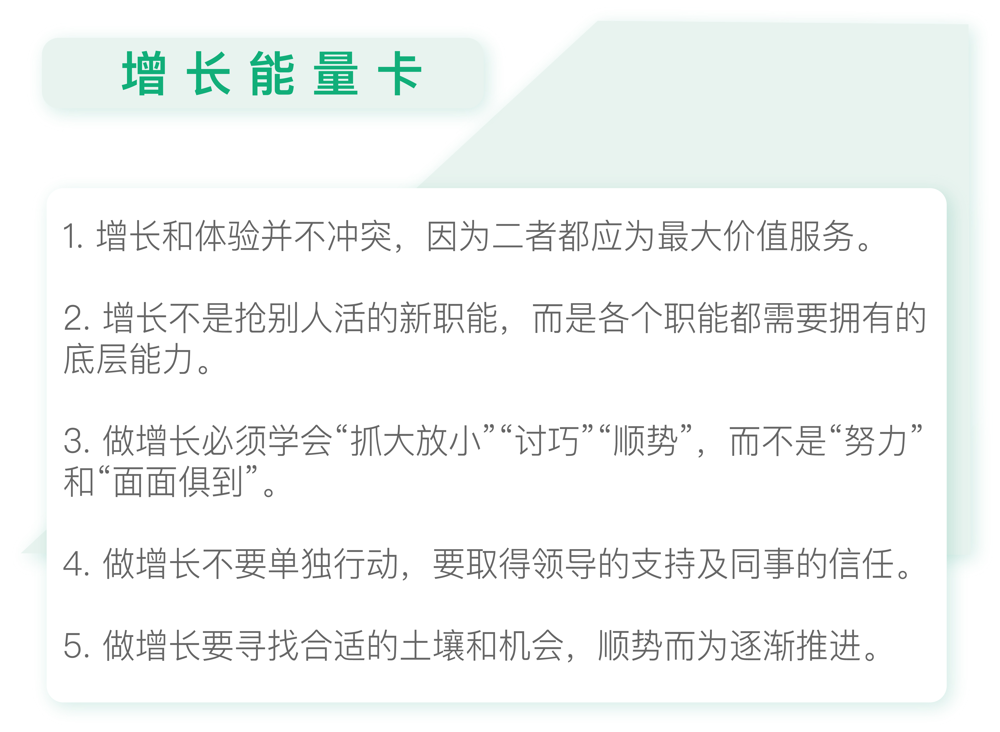

#  做增长如何处理职能间的矛盾？

今天我要跟你分享的主题是在实际的增长工作中如何处理不同职能间的矛盾和冲突。

国外很多公司都设有专门的增长团队，直接向 CEO 汇报，为的就是避免和其他部门产生冲突。

因为增长需要全局视角，会涉及到大量跨部门的协同工作，这样很可能会影响到其他部门的日常工作，毕竟资源总是有限的。

另外，就是人们普遍认为增长和体验之间存在冲突，所以需要有增长团队和传统的职能团队同时存在，好形成制衡关系。

## 增长和体验并不冲突

增长和体验之间真的存在冲突吗？

如果你已经理解了“增长”不是绩效指标的提升，而是以用户为中心带来产品价值的提升；“体验”也不是你理解的要把最好的带给用户，而是把用户最想要的、最核心的给他，同时忽略其它不重要的，用最小成本触发“增长”。

那**增长和体验其实并不冲突**。

比如，有一款阅读产品，本来用户可以在网络上阅读它里面的完整文章，可现在为了提升 App 的下载量，改成只显示 30% 内容，如果想继续阅读就要去下载 App。

这样下载量确实得到了很大的提升，可设计师认为这样影响了用户体验，背离了“以用户为中心”的初衷，认为增长和体验难以两全。

其实依我看，如果能抓住用户的核心需求，这两者并不矛盾。

就以这个阅读产品来说，如果它的核心优势是文章质量好，那对于用户来说，只要能阅读到他想要的文章就好了，他并不在乎是不是要为此多下载一个 App。

第一讲中提到的 Doodle 的例子也是如此：用户只要能轻松下载到游戏打发时间就好了，他并不在乎画面效果是否够酷炫。

也就是说，只要能满足核心需求，用户完全可以忽略其它的小瑕疵。况且这些“瑕疵”还可能和他的核心需求相冲突呢，毕竟“鱼和熊掌不可兼得”。

所以做增长必须要学会“**抓大放小**”，而职能角色最容易犯的错误就是过于关注专业性，太过追求“面面俱到”。

中国有很多老话，比如“一白遮百丑”“柿子要捡软的捏”“擒贼先擒王”等等，都是在强调抓大放小，力求用最小成本获取最大价值。

## 做增长不是抢别人“饭碗”

之前我对外以设计师身份进行增长主题演讲时，台下经常有产品经理问我：你们做的这些事看起来好像把产品经理和运营的活都给抢了？他们不会有意见吗？你们是怎么推行的？

确实，增长这个“新物种”好像成为了传统职能的巨大威胁，尤其是谁都可以做增长这件事，就更让人恐慌了。

但真实情况并非很多人想的那样，增长不是抢别人活的新职能，而是各个职能都需要拥有的底层能力。

我举个例子你就明白了。

有个电视剧叫《法医秦明》，以男主人公法医秦明的视角展开，讲述了他和法证李大宝、刑警队大队长林涛组成的黄金组合携手其他警官屡破要案的故事。

在看剧的过程中，我留意到弹幕中不断出现类似的评论：现在的法医都没事干了吗？法医为什么出现场？有了这样的法医，警察都可以放假了……

的确，在大家的眼中，法医应该穿着白大褂，老老实实地低头解剖尸体才对。离开了手术台，去任何地方都是“不务正业”的表现。

然而实际上，法医出现场以后，结合尸体上观察到的细节，能够帮助刑侦发现更多线索有助破案。而不是仅出具一份验尸报告了事。

这不是跟现在互联网的情况很相似吗？职业分工过细使得很多人只关注自己“份内”的工作，而忽略了彼此协作获取终极价值。

在这个电视剧里，围绕最终的价值“破案”，法医秦明没有拘泥于自己固有的工作范围，而是和刑侦紧密配合，最终实现了更大的价值。

所以你说他有增长意识吗？肯定是有。他做了和增长相关的事情吗？当然是做了。他抢了别人饭碗吗？没有！

这就是我想告诉大家的，做增长不会抢走别人的光芒，而是你好、我好、大家好。

人人都具有增长需要的协作意识，朝着最大价值出发，那么人人都可以获得自己最终想要的。

当然，前提是一定要做好充分的沟通，确保是合作关系而不是闷头动了别人的奶酪。

## 步步为营做增长

如果真正理解了增长的含义，那么不同职位之间的冲突、增长和体验之间的冲突，理论上都只是伪命题而已。当然，想做好增长，除了掌握方法之外，还要特别注意推行的手段，要戒骄戒躁，“步步为营做增长”。

经常有人问我：你是怎么在公司中把这套东西推行起来的？不会遭到反对及各种阻力吗？

其实并非大家想的那样我们要去“努力”推行什么。如果一件事情一定要特别“努力”的话，说明这件事时机未到或是方式不对。

增长本身是一件四两拨千斤的事情，所以要的是“巧”，而不是费劲气力不讨好。所以对于增长来说，“方法”比“努力”重要的多，大家一定要记住下面这三点。

首先，做增长**不能单独行动**。

你要先获得领导的支持，然后在过程中拉上相关同事一起，让大家发现这个事情对公司对产品都有很大帮助，这样才容易推行下去。

我建议大家现在就尝试走动起来，和自己的领导以及相关的业务同事好好聊一聊。一方面促进感情为后面的合作打下良好基础，另一方面也是要及时了解领导层的方向及想法，以及其他同事都在做什么、关心什么，这样才可能打通“职能墙”，助力增长。

我注意到很多朋友都不喜欢主动和领导沟通，这是很不利于自己未来的职业发展的。之前有学员在我的鼓励下尝试主动去沟通，效果非常好，困扰自己很久的问题立刻就解决了。

其次，做增长**要缓慢推进**，不要伤筋动骨大动干戈。

先从一点小事做起，得到认可后再慢慢延展，这样才容易得到支持及需要的资源。

比如在宜人贷，我们最早从优化 H5 营销落地页面开始，再慢慢优化 App 的 H5 介绍页，继而优化 App 其他页面，再到组件化批量增长，最后又到唤醒沉睡用户……

整个过程感觉润物细无声，在不知不觉中就积累了惊人的成果。

所以，我们从来不觉得自己曾经多么“努力”的推行什么，而是一步一个脚印顺势而为。

第三，做增长要**寻找合适的土壤和机会**。

经常有人问我，你为什么离开阿里后不继续在大公司工作，为什么要选择宜人贷？

一位行业前辈的话可以替我回答：“在大公司，你能学会很多‘套路’，然而靠套路无法成为高手”。这一点我非常认同，套路会深深地把你角色化，让你更有章法地工作，但却不再习惯创新和决策。

就好像我们认为法医一定要老老实实解剖尸体一样，这就是对角色固化的认知。而创新正相反，要突破思维限制找到一个新的发力点，也就是“巧劲儿”，这是做增长的必要条件。

我在之前做线上课时经常要告诉“大厂”的学员去掉不必要的“套路”，寻找关键点。

有“大厂”学员跟我说这个过程让他备感挣扎，因为这意味着要放弃原有的那个“专业”的自我，重组一个新的自我。听到这句话我倍感欣慰，因为我知道他找到感觉了。

好了，我们的预习部分到这里就结束了，后面会进行正式的内容讲解。

欢迎你继续学习，祝你学完课程后“弯道超车”，在工作中取得突破性的进展。

## 思考题

以文中提到的阅读产品为例，在你的手边有没有类似的机会，通过“抓大放小”，用一种最简单的方式找到实现增长的路径呢？

如果你觉得有点难度，那就尝试主动去和领导沟通一下吧，了解公司目前的大方向，也请他给你一些指引，看看有没有意外的收获？

