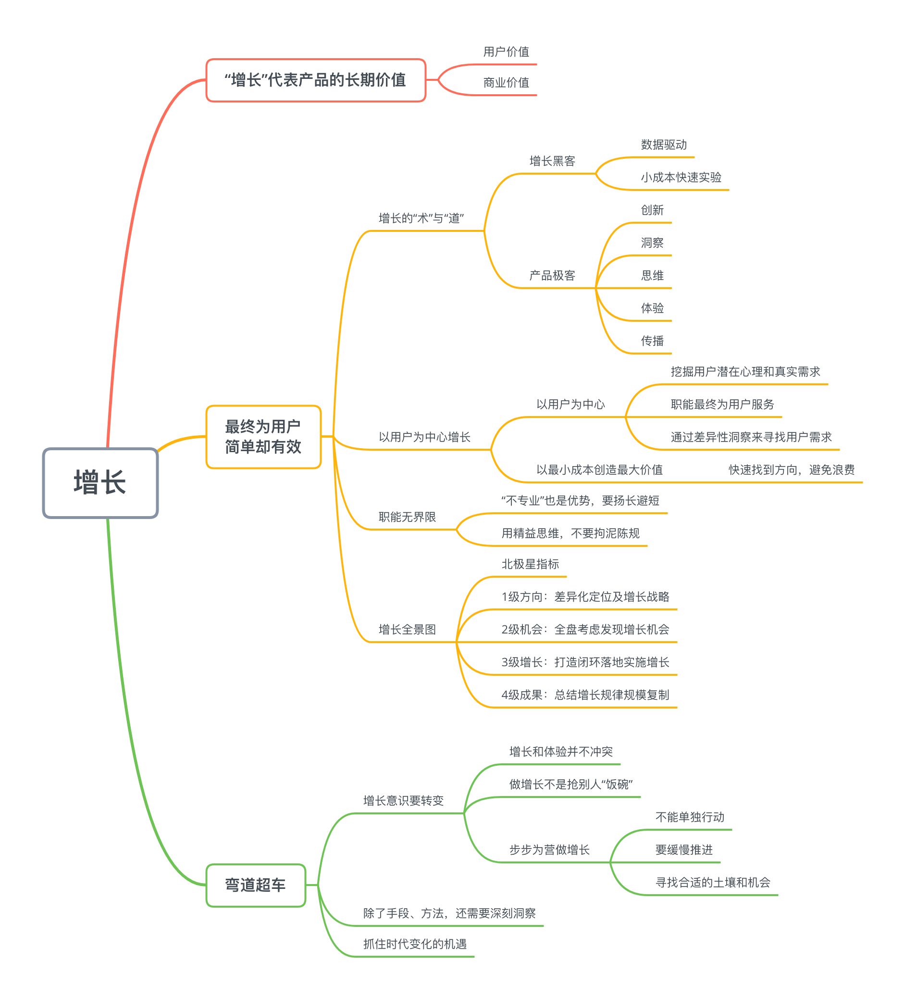
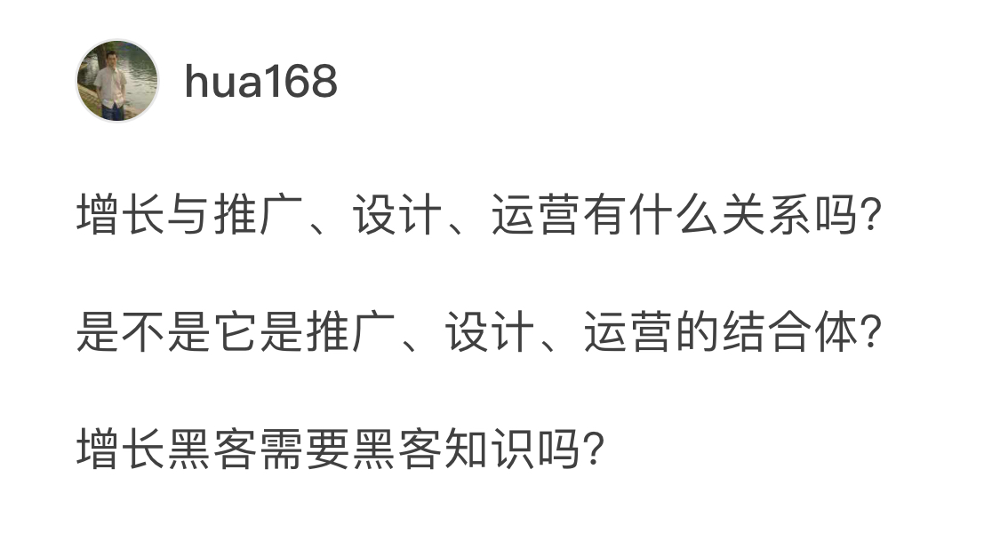
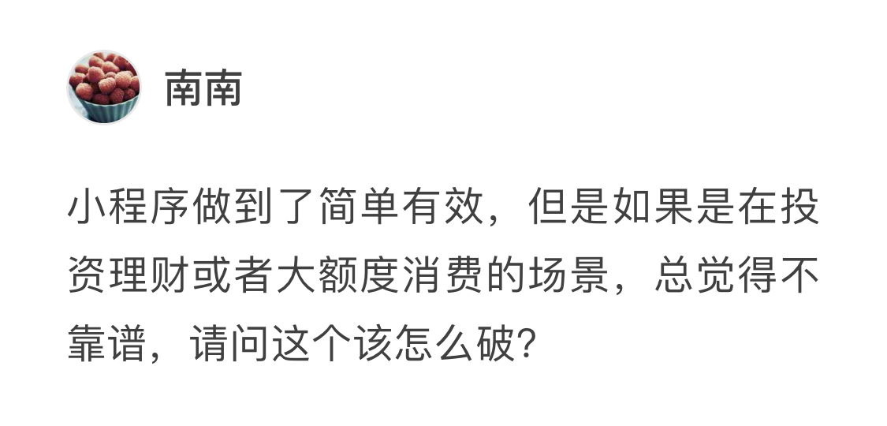
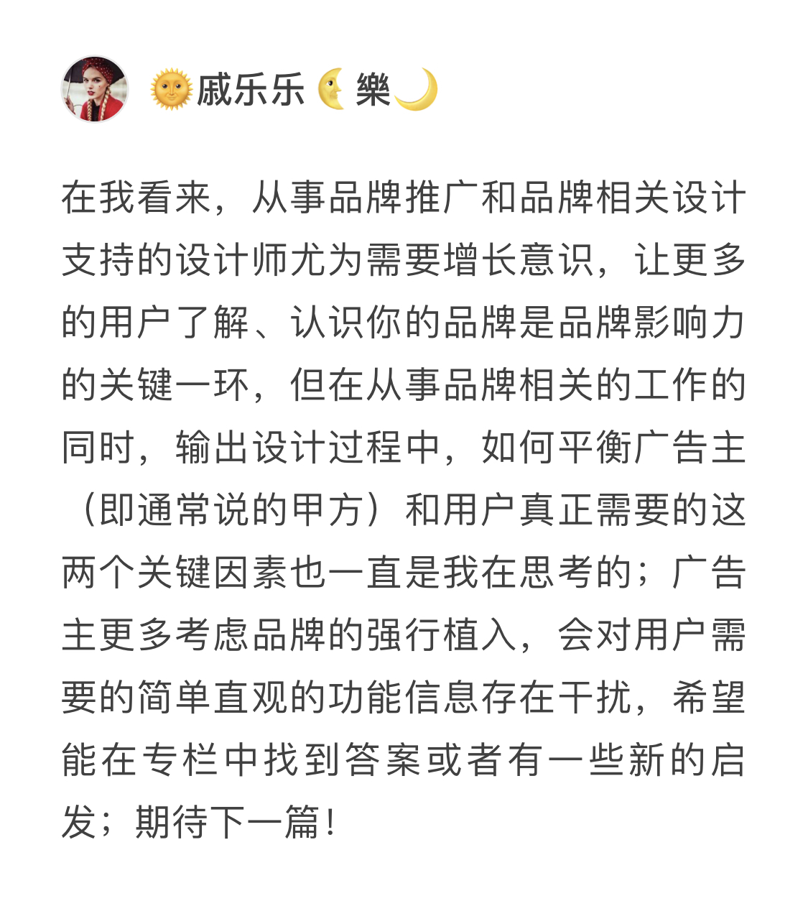
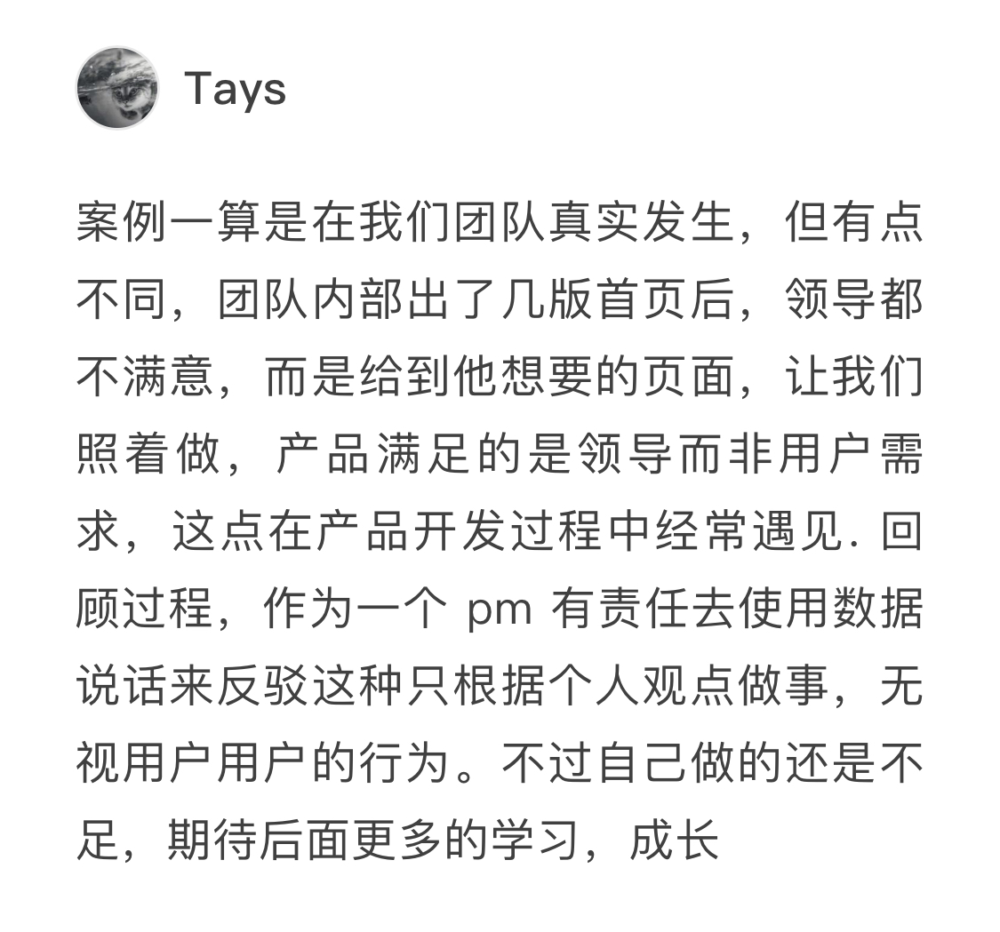
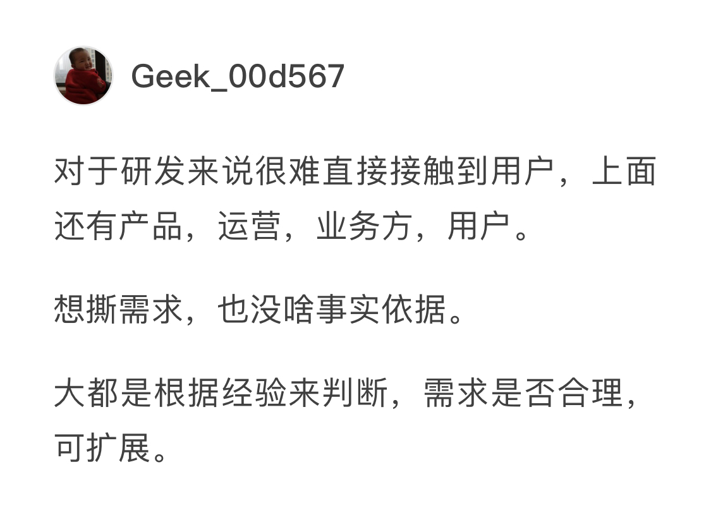
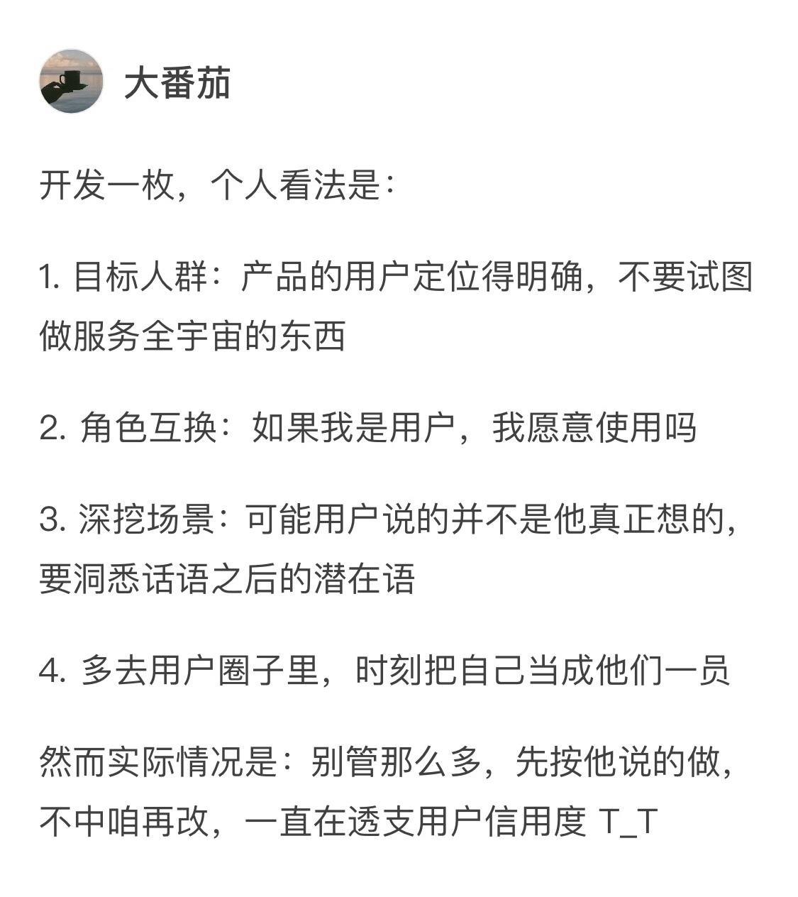
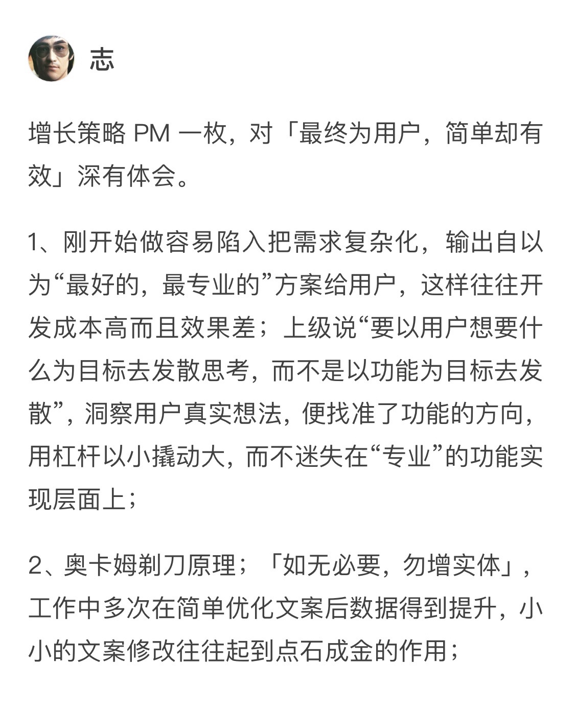
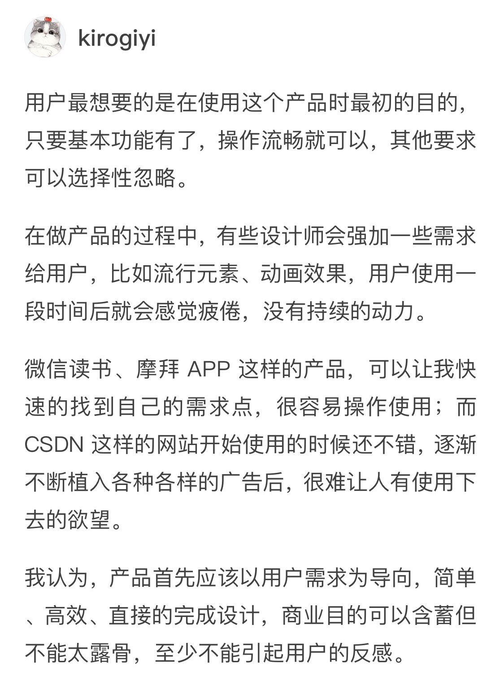
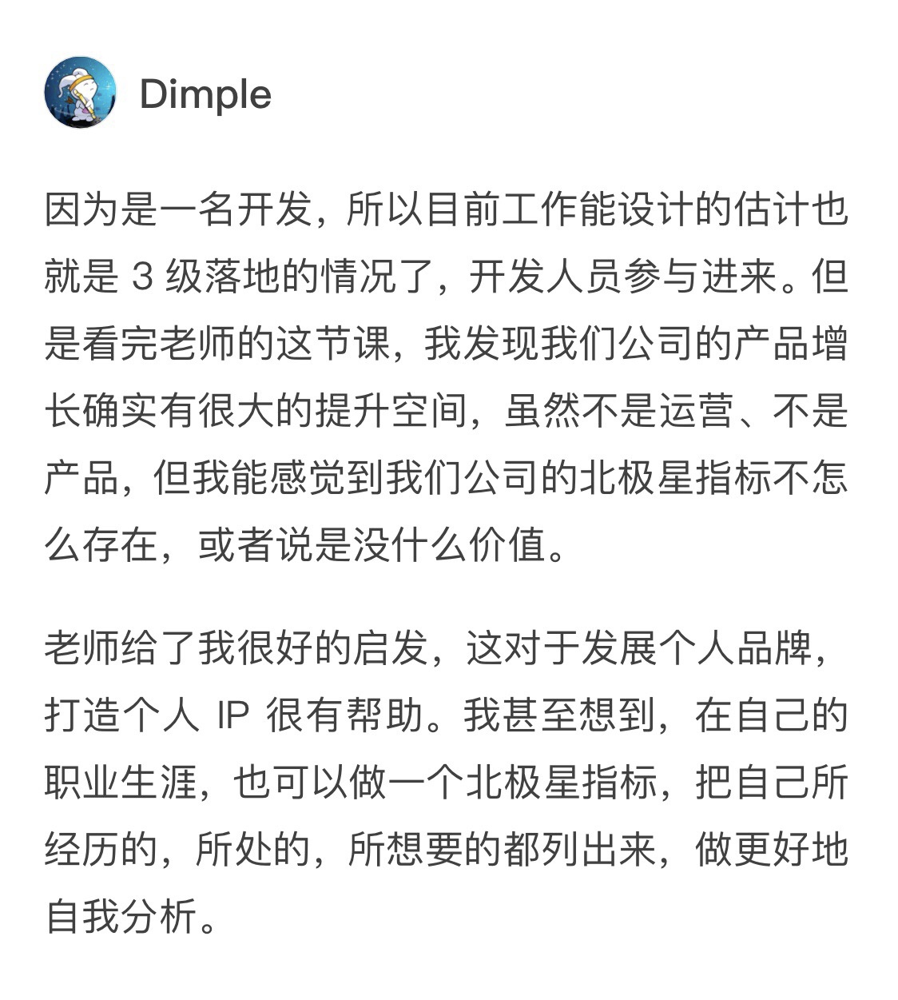

# 答疑

两周时间过去，我们的预习部分已经结束了。在经过 4 讲预习内容之后，相信你对“增长”已经有了一定的了解。

不过为了加深你的印象，我想在正文之外做个补充，将预习部分中的内容重新梳理一遍，以帮助你更好地理解。

## 思维导图

也是偶然间，我看到有同学以思维导图的形式自行总结知识点，觉得这是一个可以推广的学习方法。

**如果你还没有自行建立一个明确的逻辑体系**，在这里我想用思维导图的形式帮你搭建一个框架。

这会是一个比较粗略的框架，你可以在这个框架内自行更改、补充。你要注意的是，不要拘泥于框架之中，因为给出它的最终目的，是让你形成独属于你自己的“增长攻略”。

除了这张[思维导图](https://static001.geekbang.org/resource/image/cd/23/cde31a7a7fd22fb7aa23b2f9b8f67523.png)之外，我还想把预习中的一些留言问答贴上来给你。

虽然小标题是“问题答疑”，今天的内容中也有几条并不是提问，而是同学们的个人洞见，我觉得他们的想法也可能对你有所帮助。

## 问题答疑

------

### 001

从“从 0 开始做增长”这个题目就可以看出来，学习这个专栏不需要增长基础。

其实增长不分岗位，是一种普适性的思维意识，专栏里面也介绍了很多实践技巧，互联网人群也可以了解以拓宽视野。学“增长”就像读大学一样，更重要的是培养一种思考问题的方式。这就是大学和技能培训班的区别。

------

### 002

增长是任何职能都需要具有的一种价值导向的思维。这就好像以前大家都说要有用户意识、体验意识是一个道理。

只不过在互联网进入下半场以后，大家更关心实际的价值，而不再追求泛泛的体验，这是时代的进步。

我认为增长黑客是增长时代的开拓者，率先考虑用创意、营销、数据等方式来驱动增长。“黑客”从字面上理解，有点不按常理出牌、无所不用其极的感觉。它背后缺乏的是可以复用的方法体系，别人学习的时候往往学到的是表面上的“壳”，这样解决不了实际问题。

这就好像初级的设计师经常借鉴他人的创意、风格一样，这些表层的东西有学习的必要，但是无法解决深层次的用户、产品问题。

所以，时代在进步，增长黑客也将面临进一步的升级。

------

### 003

“简单有效”不是单指形式上的简单，而是在思路上出奇不意，找到一击制胜的关键点，实现上未必简单。

目前很多企业都在开发金融类微信小程序，只不过它们并不是照搬了 APP 的功能，而是有所取舍做了精简，目标在于导流、客服和宣传。同一个产品的 APP 和小程序，这两者的北极星指标也是不一样的。

------

### 004

这让我突然想到前一段时间铂爵旅拍和 BOSS 直聘的电梯广告，让人不胜其烦。后来 BOSS 直聘很快换了一个新广告，虽然也是在不断重复，但是比之前柔和了不少，这让我对它倍添好感。

增长不是简单地复用已知的规律，也不是没完没了的想新创意，而是用“聪明”的方式寻找用户喜好和价值利益的平衡点。

------

### 005

其实这种情况我以前也遇到过。开始我以为是老板比较偏执，后来才发现因为我们思考问题不在一个维度上，老板懒得多废话。

所以，我觉得有两种情况，一种是老板确实主观需要通过数据来反馈；另外我们也需要多找老板沟通，了解他背后的想法和诉求。

------

### 006

看到这个问题，我突然想到一个朋友的例子可以解释你面临的问题。

有一位开发在头脑风暴会议中提出，每次发售理财产品的时候系统都会预警。这个现象引起了业务方的高度关注，他们经过研究，决定加大对理财产品的投入。

所以，研发想做增长时，不一定要把关注点放在撕需求上，而是可以从自己的优势出发，以技术专家视角提出需求方难以观察到的点，助力增长。

------

### 007

其实做增长也需要找到合适的环境和时机。

在产品初创阶段，快速迭代完善功能可能对产品生死来说更加重要，这本质上也是一种增长策略。到了合适的时机，企业才会重视精细化运营，那个时候你的作用就更大了。所以，顺势而为就好。

------

### 008

对于这位同学的感悟，我想谈谈自己的一点感想。

普通人喜欢不断地做加法，而大神们喜欢不断地做减法。还记得以前的洗衣机和电视机遥控器吗？上面布满了密密麻麻的各种按钮。但是那个时候大家的认知就是这样，觉得东西越多越好，这样就赚到了，这跟以前的人们从小物资紧缺有很大的关系。

而现在的物质世界太丰富了，所以人们开始去繁求简，这也是时代进步的表现。

所以，过去的经验和教训未必都正确。我们唯一的做法就是跟随时代的进步，改变旧有的意识。这也是为什么需要不断学习的原因。

------

### 009

我特别喜欢“以用户为中心增长”的这套理论，有个很重要的原因，就是你必须要学会“忘我”，这也是佛家所主张的，无形无意、顺其自然、无我无形。

这样你才能分出心来发现用户真正要的是什么。这不正是修行之道吗？做增长和修行修心其实也有异曲同工之妙。

------

### 010

其实我想讲这个课的初衷，就是希望能帮更多人思想升级，可以更好地把握自己的人生。毕竟在我们的生活中，工作不应该是全部，我们自己的人生“增值”才是最重要的。感谢你讲出了我的心声，也帮助更多小伙伴们理解这个课的终极价值。

