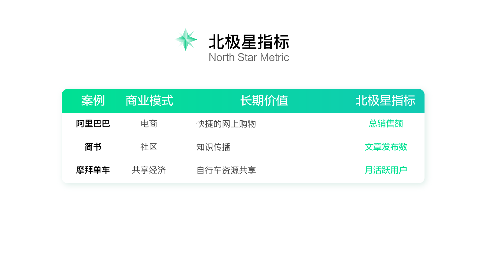
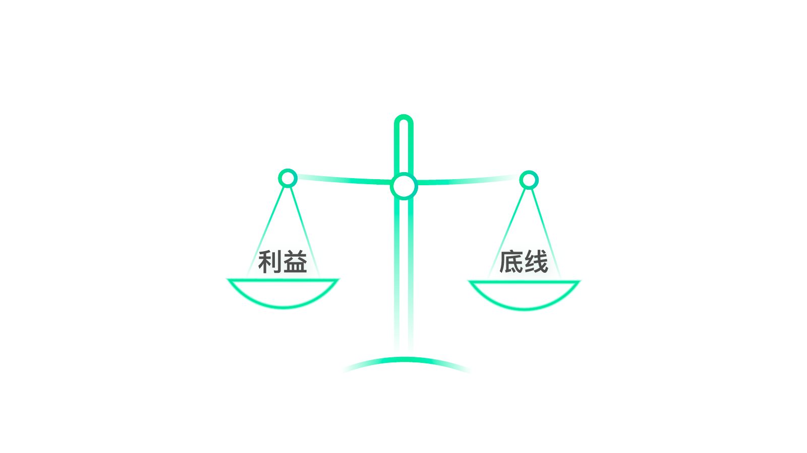
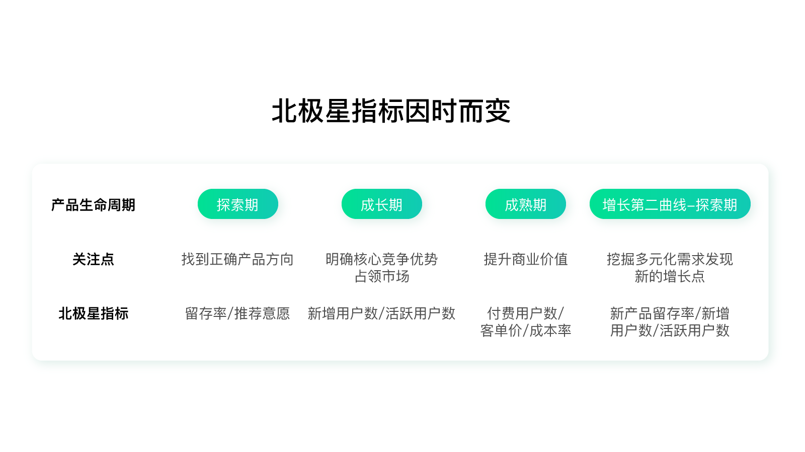
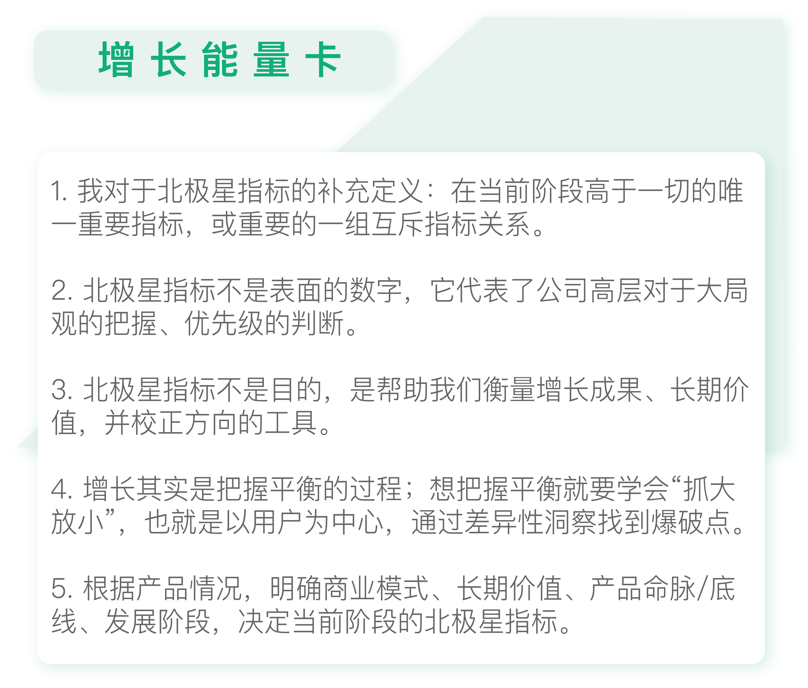

# 正确目标

今天我要与你分享的主题是“如何找对做增长时的正确目标”。

我们都知道在做一件事情之前，最重要的是要确立目标和方向，否则就会漫无目的地乱跑乱撞，花费了大量时间和精力，却得不到什么结果。

你可能会质疑：在生活中有很多人都有定目标的习惯，但是最后还是以失败告终了。这是因为光有目标是不够的，你还要保证目标是正确、有意义的。

在实际工作中情况就变得更加复杂了：我们不仅需要目标，还需要正确的、符合企业最高利益的目标，也就是增长目标。否则即使你再努力、再拼命加班，也很难产生什么价值。现实就是这么残酷。

所以今天，我想和你探讨：如何定下正确的增长目标，以帮助我们后续可以少走弯路直达目的地。

## 找到正确的增长目标

说到增长目标，就不得不提到一个非常棒的概念：**北极星指标**（North Star Metric），又叫 OMTM（One Metric That Matters，**第一关键指标**）。

之所以叫北极星指标，是因为这个指标一旦确立，就像北极星一样，高高闪耀在天空中，指引着全公司上上下下，向着同一个方向迈进。目前它已经逐渐成为许多公司指导产品发展的重要指标。

给你举一个行业经典案例吧。早期 Facebook 的北极星指标是月活跃用户数；MySpace 的北极星指标是注册用户数。

Facebook 的领导层认为公司的运营策略要对实际用户价值负责；而 Myspace 的领导层选择了短期利益，即通过运营推广策略疯狂拉新，用漂亮的数字讨好投资人。

最后的结局显而易见：Facebook 逆势赶超，成为世界最受瞩目的社交产品；而 MySpace 却遗憾退出了市场。

所以说，北极星指标不只是表面上看到的一个简单数字，**它代表了公司高层对于优先级的判断**，判断在企业发展过程中，什么因素是最重要的，该如何衡量。

那么北极星指标和增长的关系是什么呢？

我在前面的预习中讲过：增长的过程是“以用户为中心，通过差异性洞察找到爆破点，持续地以最小成本创造最大价值。这个“价值”不是短期价值，而是反映了企业的长期价值。

比如下图中的几个例子：

所以说，**北极星指标其实就是对增长成果的衡量，并且为增长带来了明确的方向**。

## 增长目标 VS 传统目标

第一次听到北极星指标是在 2017 年的 GrowingIO 增长大会上。这个概念源自硅谷的增长黑客，它的出现让人眼前一亮，一下子解决了困扰我多年的问题。

以前我们更多的是用绩效管理工具 KPI 衡量工作成果，这产生了很多问题，比如：

- 过于强调业绩，可能忽略重要但短期内难以被量化的工作；
- 为了着急完成眼前的 KPI 有时候不得不损失更长远的利益；
- 各部门、各职能由于 KPI 不一致可能出现矛盾冲突；
- ……

类似的问题太多太多，都是因为缺乏一个自上至下的、明确统一的、有价值的指标，使得众多执行人员只见树木不见森林。

最后的结果就是所有人都很忙、很拼命，但是产品或者企业可能并没有往好的方向发展，那当然也就无缘增长了。

北极星指标的出现很好地解决了上述问题，它关注企业发展的长期价值，促使所有人朝一个方向努力，避免部门内耗、大幅提升效率和价值。

但需要注意的是，**北极星指标不是目的，而是帮助我们衡量价值并校正方向的工具**，最终我们要做到的是**通过有针对性的服务用户提升企业的长远价值**，这才是目的；这和达成短期 KPI 有本质的区别。

有关北极星指标和 OKR、KPI 这类管理工具的更多区别，我们会在后面讲到。

上述内容大部分都是我从会议、书籍和网上相关文章学到的，对我帮助非常大。但在实践过程中我逐渐有了不同的领悟，也许对前人的观点是个额外的补充，在这里想重点谈一谈。

## 在天平两端寻找平衡

北极星指标的概念是“第一关键指标”，并且强调“唯一性”。从书上和网上能找到的案例来看，同类型产品的北极星指标也都很类似。

比如电商都是“销售额”、社区都是“文章发布数”或“问题回答数”之类的。但在实际工作中你会发现这太理想化了。

举个例子，淘宝和京东表面上看都是电商，但是再细分下去，二者的模式其实有很大区别。

淘宝是平台模式、京东是自营模式，即使长期价值都是“便捷的网上购物”，最终的北极星指标也是不同的。京东的北极星指标里一定会包含对成本的考量，因为自营的利润很低，成本就是命脉。

再比如宜人贷借款，我们不仅要考虑放款量，还要考虑风险等各项成本，因为对于金融来说，风险控制是命脉。

很多时候，重要指标的关系就像天平两端，一头上去了，另一头必定会下去，导致给企业带来其它的损失。

比如，业绩高了，成本自然会上升或安全隐患事故增加。所以我们要做的是保证企业“命脉”或核心价值稳定的前提下提升业绩，这和“最小成本创造最大价值”的增长概念是一致的。

举几个例子：“低成本高贷款余额”“GMV 提升的同时投诉量降低”“转化提升的同时一线城市用户占比提升”。

这些北极星指标都出现了两个重心。但是因为两个重心之间有互斥的关系，所以设立北极星指标的要点不在于分别处理两个指标，而是要用一种更聪明的方式去把握平衡点。

**在实际工作中，推荐寻求一组互斥的指标关系作为北极星指标。**

找到这样的北极星指标并不困难，只要你对业务有一定的了解：第一，知道**企业的底线**，比如安全、成本、质量、体验等等，保证它们不逾越红线；第二，再看**企业想要追求的另一端**是什么，比如营收、资本利益等等。

然后你就可以造句了：在×××降低 / 提升的同时×××提升 / 降低。

你明白这个思路了吗？是不是很简单？所以**增长其实就是把握平衡的过程**。

想把握平衡就要像前面文章讲的学会“抓大放小”，抓住事物的主要矛盾忽略次要矛盾而不是面面俱到。

如何抓住主要矛盾？就是以用户为中心，通过差异性洞察找到爆破点，这个爆破点就是主要矛盾。关于怎样做到差异性洞察，我在后面的内容（模块二）里会具体讲解，你不用着急。

除此之外，我还注意到北极星指标并不像很多书中的案例那样是固定的，而是会因时而变。

## 北极星指标因时而变

以前，我一直以为北极星指标就像产品定位一样，既然定了就不要随便改，否则就失去了意义，但后来我发现这样的理解有些片面了。

企业长远价值确实不会轻易改变，但**在产品的不同生命周期，关注点是不同的，聚焦的指标自然也是不同的**。

比如，对于一个在线音乐社区产品来说，一开始可以把北极星指标定义为“总收听时间”，但是随着产品的发展壮大，这个指标必然会到达瓶颈。毕竟每个人每天能花在听歌上的时间总是有限的，不可能无限扩张下去。这个时候，我们就需要调整北极星指标了。

在从 0 到 1 的探索期，我们要关注的是如何找到正确的产品方向，这时的北极星指标可以选择与留存、推荐意愿相关的指标。

方向明确后，产品进入高速成长期，我们关注的是如何明确核心竞争优势以快速占领市场，那么北极星指标可以替换为与新增用户活跃度相关的指标。

之后产品发展增速放缓，进入成熟期，我们可能会更关注商业利润，那么北极星指标会倾向于和营业额、成本相关的指标。

再往后，产品可能会慢慢出现稳定甚至衰退的迹象，这时我们就需要继续探索新的方向，开始第二个探索期，如此循环往复。

当然，这只是个简单的示例，实际上我们还是要根据自己产品的情况，先明确商业模式、长期价值、产品底线，在此基础上再看处于什么发展阶段，决定当前最合适的指标。

## 思考题

你认为你目前所负责的产品或项目的北极星指标是什么呢？你是如何得出来的？

