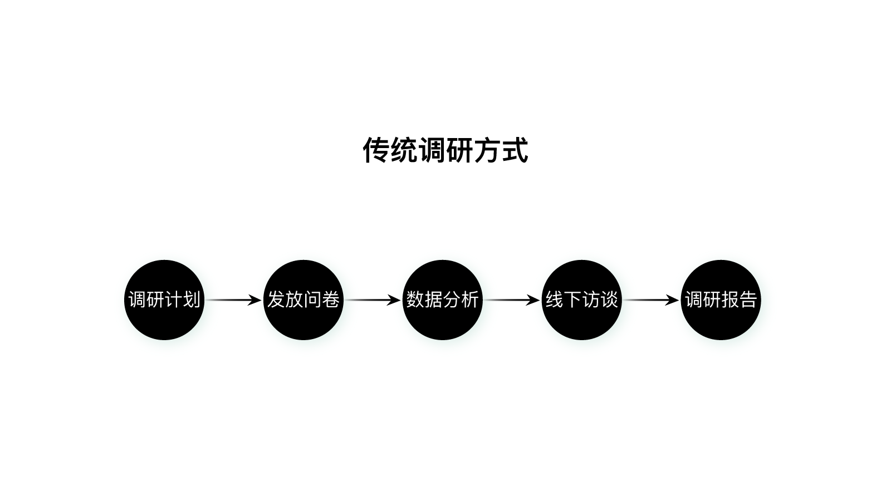
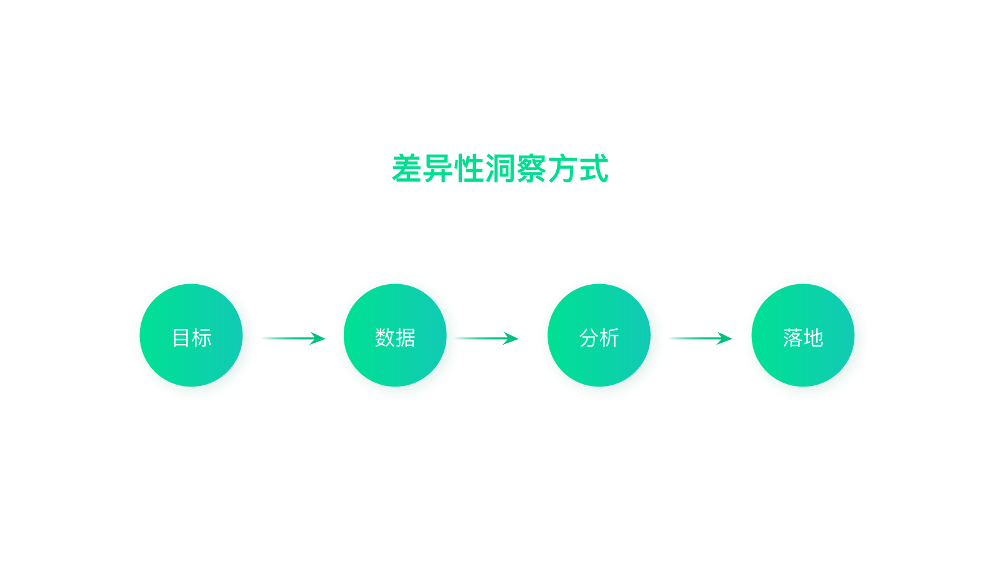
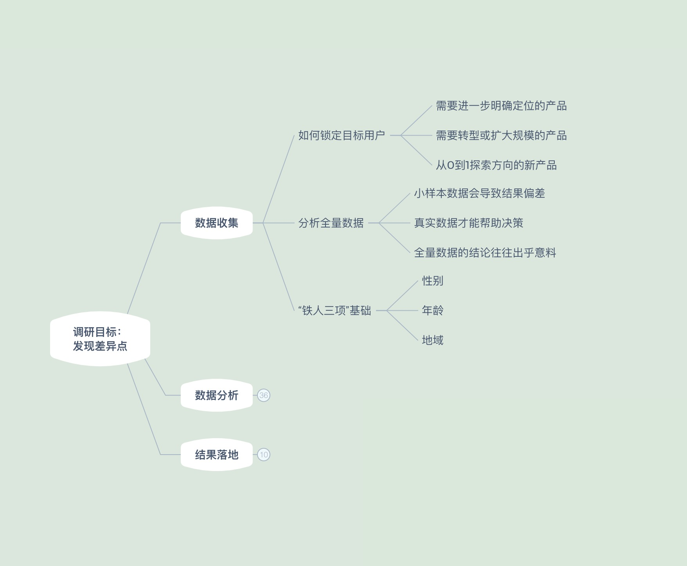
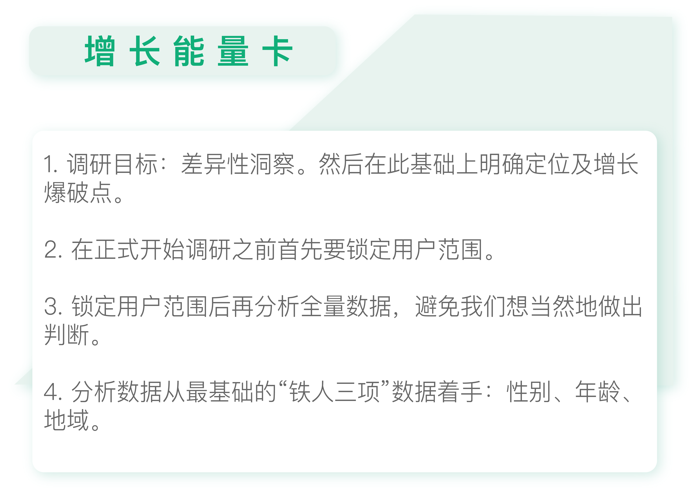

# 调研目标：在差异性洞察中找到爆破点

从今天开始，我会正式教你如何在全新的调研方式中获取洞察。

传统的调研方式大概有以下几个步骤：制定调研计划、发放问卷、数据分析、线下访谈、写调研报告。这种方式的**缺点是过于重视方法及流程**，结果冗长缺乏重点，更是谈不上什么洞察。

其实用户调研并不需要那么麻烦，我们只需要先考虑调研**目标**，再考虑看什么**数据**（包括数据分析和访谈信息），如何**分析数据**，结果如何**落地**，就可以了。

## 锁定目标用户

在开始调研之前，我们首先要锁定用户范围。下面我给你简单地举几个例子，看看不同的产品如何锁定自己的用户范围。

### 需要进一步明确定位的产品

我刚去宜人贷的时候，宜人贷已经有了数千万体量的用户，在业内位居前列。

但即使是这样，公司内部也没有人能说清楚和众多竞品相比，宜人贷的核心优势到底是什么，产品定位是什么，在营销层面应该如何宣传等等。

大家都是凭感觉，看数据来判断。但即使数据好了，也并不清楚它背后的原因是什么。

这是因为在产品前期、中期，大都是快速迭代、野蛮生长，所以往往不会把太多的精力放在调研上，这是一种很常见的现象。

但是那个时候，宜人贷已经在行业占据了稳定的位置，且增长正在逐步放缓。如果继续放任这种情况，产品增长将很快陷入瓶颈，并浪费大量资源。

所以，在那个时候，宜人贷很有必要**针对现有用户**进行一次大规模的调研，摸清楚用户特征及产品差异化的定位，助力进一步增长。

### 需要转型或扩大规模的产品

除了像宜人贷这样需要进一步明确定位的产品，急需转型或者扩大规模的产品也需要做好用户范围的锁定。我想用小红书为你举例。

小红书是一款用户数上亿的分享社区 App，90 后和 95 后是其中最活跃的用户群体。

我前些天听了一场小红书的分享，得知他们在一线城市的渗透率已经很高了，如果想要更多人使用，就要下沉到二线城市。

这个时候，小红书要关注的，更多的是潜在用户。

除了需要**调研已经在使用**小红书的二线城市用户，看看这些用户率先使用的原因是什么。同时，还需要**调研未使用过**小红书的二线城市用户，看看潜在用户不使用小红书的原因以及他们的诉求。

### 从 0 到 1 探索方向的新产品

对于从 0 到 1 的产品来说，一开始没有成型的产品，也没有用户，那么该如何定位目标人群呢？我还是举分众传媒的例子来说明。

首先，分众明确了要**寻找一个细分市场**，把产品做在一个足够小的点和足够小的客户群上，并且要将它做透，做到完美。这也是“分众”名称的由来。

那么如何找到这个细分市场呢？那要**看现在主流的市场是什么，再和它差异化竞争**。

当时主流的广告媒体是电视，而央视是其中的巨无霸。但是分众察觉到年轻人很少看电视，而有钱人没时间看电视。既然央视已经专门针对有时间看电视的用户，那分众就去做没时间看电视的用户。

明确市场定位之后，分众又继续思考如何确定目标人群。这时候**北极星指标**就至关重要了：做一个广告传媒产品，最重要的是用户容易被品牌影响并促成购买。

顺着这个思路，分众首先排除了 8 亿农村人口，因为绝大多数做广告的产品都是针对都市人群的。

然后。分众又将剩下的 5 亿城市受众中 20 岁以下的青少年和 50 岁以上的中老年人排除在外，因为青少年没有消费能力，而中老年人不容易被新的品牌影响。

最后，再筛选出月收入 3000 元以上的人，这样符合分众北极星指标的人就只剩 1.5 亿人了。这 1.5 亿人虽然只占中国人口的 10%，但却占据了城市消费的 70%。

所以，分众将主要的客户群体定位为月收入 3000 元以上的城市人群。

讲到这里，可以简单总结一下。

如果你的产品已经有了大量的用户，但是不清楚定位，那就去**调研现有用户**，摸索清楚定位。

如果你的产品定位比较明确，但目前增长陷入瓶颈，面临转型或扩大规模，那么就需要重点**调研潜在用户**。

如果你的产品还处于 0 到 1 的阶段，那么就需要顺着**北极星指标先定位目标人群**，再进行调研。

后面我主要以第一种情况为例详细说明如何做调研。因为第一种情况学会了，后面的情况你也能轻松地举一反三了。

## 分析全量数据

无论是上述哪一种情况，我们都需要先对全量数据有大致的了解，方便我们有整体上的认识，原因主要有三个。

第一，传统用户研究比较倾向于问卷数据或访谈数据，这种小样本的数据势必会导致结果上的偏差。

第二，在现今这个时代，产品越来越多元化、用户也由过去的一二线城市不断下沉，拼多多的崛起足以证明这点。

而不同城市的人群在生活方式上的差异非常大，所以随着时代的发展，我们平时能接触到的用户，可能和我们的主流用户相差甚远。因此，一定要通过全量的真实数据帮助我们做进一步的决策。

第三，全量数据的结果往往和我们的日常认知大相径庭。

比如罗振宇在 2019 年跨年演讲中提到：淘宝 2018 年计划在春晚做广告，他们知道春晚流量很大，但是不确定有多大。毕竟身边的人都在讨论双十一，而看春晚的人却是越来越少的。

为了稳妥起见，他们决定在 2017 年双十一的基础上再扩容 3 倍，来应对春晚流量。结果呢？春晚当晚登录的实际峰值，远远超过了双十一，是双十一流量的 15 倍。

这个事件让我十分感慨。**我们经常想当然地做出判断，却对真相一无所知**。这个时候，如果能提前做一些准备，多做一些调研，会帮助我们有更清醒的认识。

这也解释了为什么我们从传统调研报告中很难得到深刻的洞见。样本量的限制、受访人群的限制等，都阻碍了我们获得事实的真相，使我们难以发现和原有不同的认知。最终得到的似乎都是一些本来就知道的讯息。

## 铁人三项基础

全量数据分析很重要，但听起来似乎操作会非常复杂。随着技术的发展，你现在能够收集到的数据越来越多，很容易就看花了眼，不知道该从何入手。

这里给你提供一个“捷径”，你可以先从最基本的三大数据项着手，即**“性别”“年龄”“地域”**，我称之为“铁人三项”数据。

“铁人三项”数据是最基础的数据，所有产品通用，而且非常容易挖掘出差异点。

毕竟男人和女人之间的差别、不同年龄层产生的代沟，不同地区的人迥异的生活方式都足够写出好几本笑话集。除了上一讲中介绍过的百度指数这样的小工具外，如果有条件的话还你可以进行更深入的分析。

今天的内容就先到这里了，在下一讲中我们一起探讨如何具体地进行数据分析。

## 用户调研知识地图

有关用户调研这一部分的知识很多，我以自己讲到的内容为主线画了一张“用户调研知识地图”。

随着专栏的推进，这个知识地图的内容会越来越丰富。同时，我也希望你在阅读的过程中自己进一步总结归纳，在地图中加入你自己的认知、经验、感悟，使它最终成为属于你自己的、独一无二的增长知识地图。

## 思考题

你的产品属于哪种情况：是定位不清晰，还是增长陷入瓶颈，还是从 0 到 1 呢？你锁定的目标人群是什么？

