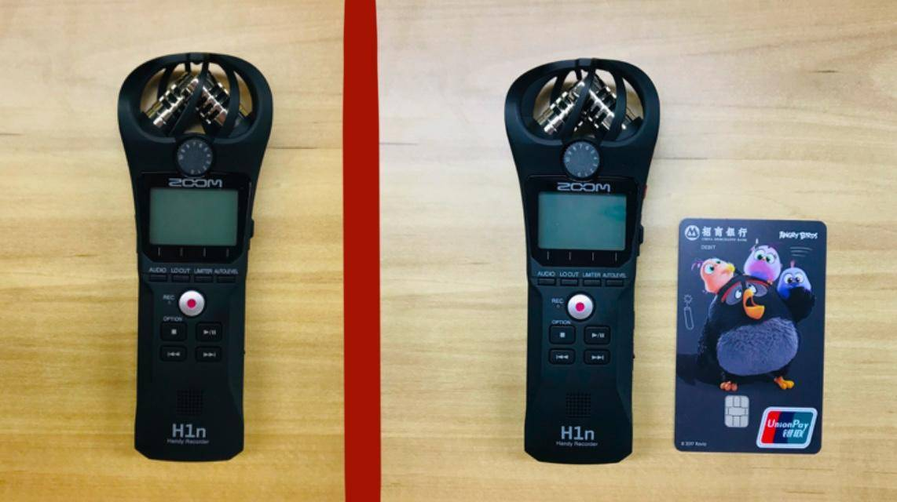
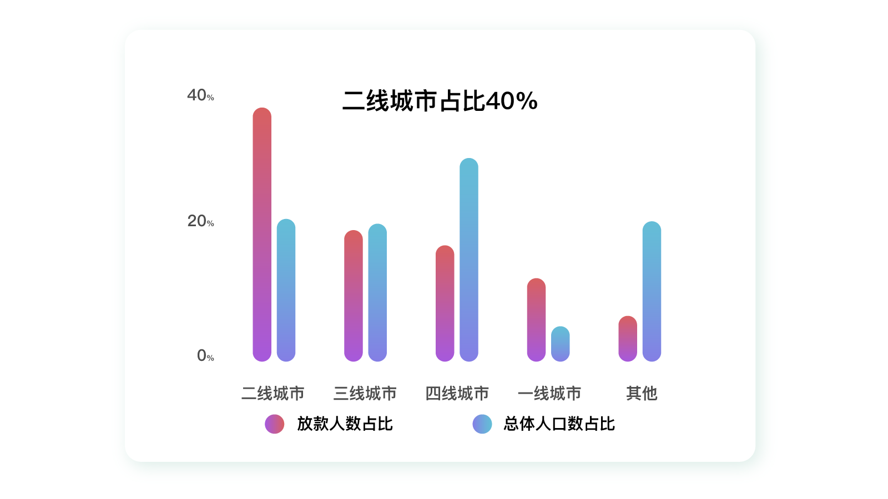
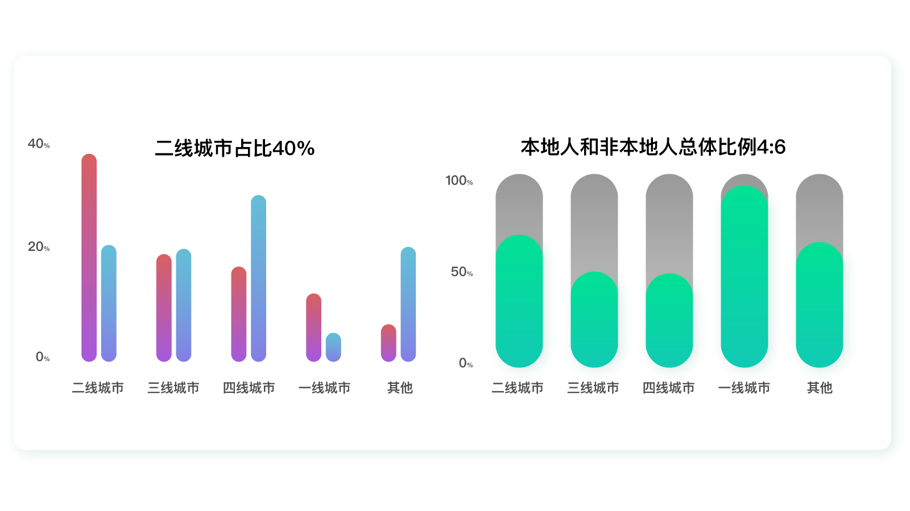
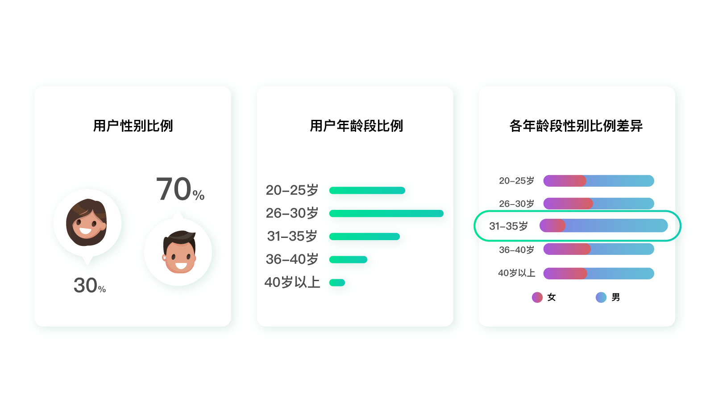
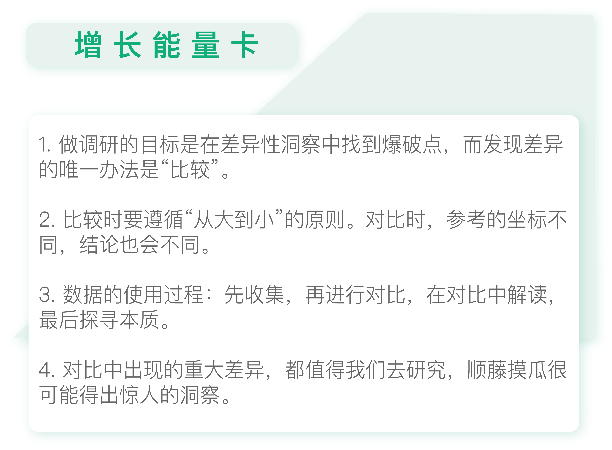

# 数据分析：在“花式对比”中发现玄机

我们接上一讲内容，继续探讨用户调研中如何进行数据分析。

## “比较”胜过千言万语

前面我们说了要强调洞察，也就是发现差异、探索未知。那**如何发现差异呢？唯一的办法就是“比较”**。如果没有比较，差异就无从谈起。

比如，你想在淘宝上卖一个小巧的录音笔。那么你拍照时，可以在录音笔的旁边再放一个苹果手机或者一张银行卡，这样你的顾客就会清楚地知道这个录音笔到底有多大。一个简单的比较胜过千言万语的描述。

这就解释了为什么在企业中，传统的调研报告内容虽然面面俱到，却难以让人收获意外惊喜，答案就是“缺乏比较”。传统的调研报告只有各种平铺直叙的结论，很难让人有抓到重点、眼前一亮的感觉。

## 坐标不同，结论不同

那么如何做好数据的对比分析呢？

如果以“铁人三项”数据中的地域数据为例，首先你可以看一下各省 / 市 / 城市类型（比如一线 / 二线 / 三线……）的占比，然后可以再分别做如下几项对比：

- 和全国或全网平均水平的对比；
- 和同行业平均水平的对比；
- 和主要竞品的对比。

对比分析时，你要注意一点，对比的顺序应该主要按照“**从大到小**”的原则。为什么呢？当我们想去了解一件未知的事情时，首先需要宏观了解，然后再微观了解。

比如，对一个从未见过树的人形容树，你一定是先说树又高又大，然后再说树上面的枝叶、树纹等其它细节。如果这个顺序颠倒过来，那就似盲人摸象了。

我们来看一个例子。

假设，某借款产品的一线用户占比（一线城市用户占总用户比例）为 5%，而一线城市人口占全国比例为 4%。这样对比来看的时候，似乎这款产品在一线城市的渗透率还可以。

但如果同行业产品的一线城市用户平均占比达到了 10%，该产品比行业平均水平低了 5%，这就说明该产品在一线城市其实是有较大的进步空间的。

如果市场规模相似的竞品在一线城市用户占比达到了 20%，那就说明该产品在一线城市和它的竞品相比差距很大，你就需要去挖掘差距产生的原因。

如果不方便拿到行业数据或竞品数据，那只看和全国的对比（可参考人口普查结果），也能看出很多问题来。

比如上图，如果单独看借款产品的地域数据（当地用户人数占产品总用户人数比例：红色柱状图），我们可以看到该借款产品用户数量在二线城市占比最高，再往后是三线城市、四线城市，一线城市排的很靠后。

这样看来好像该产品适合做人群下沉，去更多小城市发展。但事实真的是这样吗？

如果你结合了全国的人口数据（当地人口占全国人口比例：蓝色柱状图）再进行分析，你会发现一线城市和二线城市的相对比例远高于三线、四线城市。也就是说，该借款产品明显更受一二线城市用户的喜爱。

而三四线城市用户绝对占比之所以比一线城市多，只是因为三四线城市的人口基数大而已，并不能证明产品更适合他们。

这个例子足以说明，**如果不加以对比，光看表面数据很容易得出错误的结论**。这也是传统调研报告的结果很难被采用的原因。

## 打破沙锅探究到底

当然仅仅通过对比来解读数据还是不够，这只是让我们能够明白表象，接下来还需要明白为什么会呈现出这种表象，也就是要探寻本质，这样数据才有价值。

**所以，数据的使用过程，是先从收集数据开始，然后进行对比，在对比中解读，最后探寻本质。**现在很多公司尚未迈出第一步，还有大量的数据分析师和用户研究员停留在第一步。但其实最有价值的是后面两步。

如何通过数据提供的表象探寻本质呢？接着前面的例子来说：在对比中我们发现这个借款产品的地域分布和全国平均地域分布有较大差异，为什么会这样呢？这就是一个很好的切入点，可以继续深挖下去。记住，**只要在对比中出现重大差异，都值得我们去研究，顺藤摸瓜很可能就会得出惊人的洞察**。

想一下，“地域”这个字段还有什么相关属性值得进一步分析呢？如果你没有头绪，可以先从如何界定地域这个角度来看。

比如，我们现在判断地域，是看用户目前在哪个城市，但是其实他可能并不是当地人。所以每个用户其实可能出现两个地域：一个是出生地，一个是现在生活的地方。

根据这个特殊性，我们可以分析一下不同类型的城市中本地人和非本地人口的占比。

在这里，我们又可以发现特殊的差异：一二线城市的非本地人口占比远高于本地人口占比。而越是外地人占比多的地方，用户就越偏爱这个借款产品。

这是为什么呢？通过后面的用户访谈，我们发现外地人生活压力大，需要买房、贷款、还有教育、日常开支等。而本地人往往都有房子住，生活压力小很多，自然就没有太多贷款需求。所以，对于这个借款产品来说，未来考虑“人群上移”可能比“人群下沉”更合适。

不知道你有没有发现，分析到这里，其实又出现了一个新的问题：对于一二线城市的用户来说，可以接触到的借款产品非常多，那这个产品的**核心优势**是什么呢？这个确实难以通过数据呈现出来，所以我们后续还需要通过用户访谈来洞察。

分析完地域，我们可以以此类推，分别分析“性别”“年龄”数据。接下来，我们还可以把铁人三项数据进行交叉对比分析。任意选择两个字段，比如“年龄”“性别”，就可以看到不同年龄段性别比例的差异。如果在两个不同的年龄段，性别比例差异过大，那么就值得深挖一下了。

比如上图，如果一款产品的用户性别比例是 30% 女性、70% 男性。

那么正常情况下，该产品在任何一个年龄段的性别比例数值都应该是相近的。如果在某一个年龄段，比如 31~35 岁，突然出现了女性 10%，男性 90% 的情况，那么这个地方就值得去探究了。

怎么样？整个过程是不是就像探案一样？**任何与常理违背、或者和平均水平不一致的地方，可能都是金矿**。

我再带着你把整个“探案”的过程回顾一遍：

1. 调取产品“性别”“年龄”“地域”数据。
2. 在对比中发现“性别”“地域”与全国平均水平差异较大。
3. 增加地域字段进一步交叉分析，发现和外地人占比多少有关。
4. 通过常识或后期调研判断出，本地人和外地人生活方式不同导致对产品需求不同，外地人需求更大。
5. “性别”“年龄”“地域”间可再交叉分析，进一步探索差异（可省略）……

以上这些思路只是参考，欢迎你在实际工作中多多发散，发掘出更多有意思的“花式对比”和“探案”心得。

## 用户调研知识地图

今天我们的用户调研知识地图推进到了数据分析的部分。希望你可以在知识地图中，根据自己的见解和实际情况进行补充。

## 思考题

尝试分析一下目前你负责的产品的用户数据，试着通过对比来解读，看看有没有不一样的发现？

