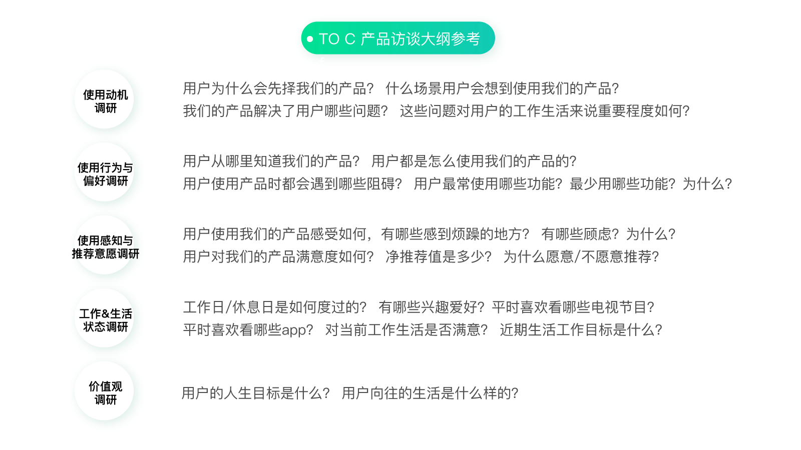
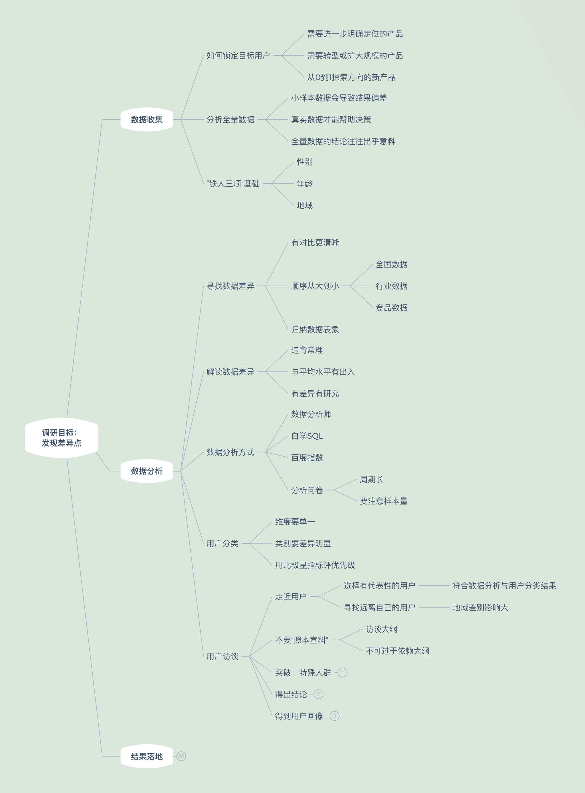
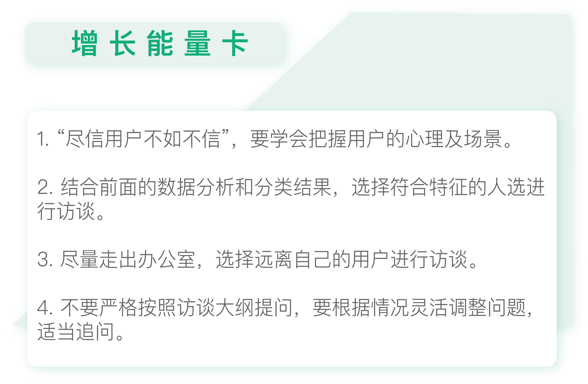
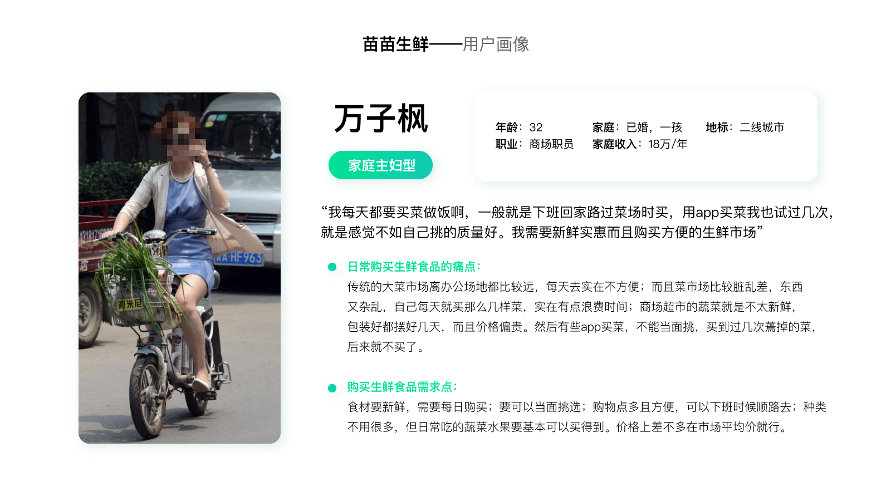
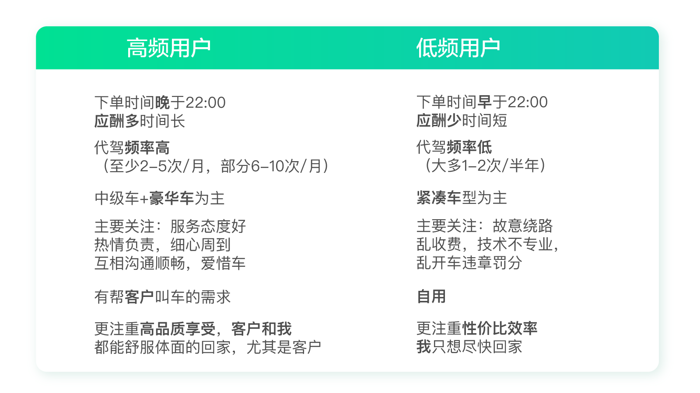
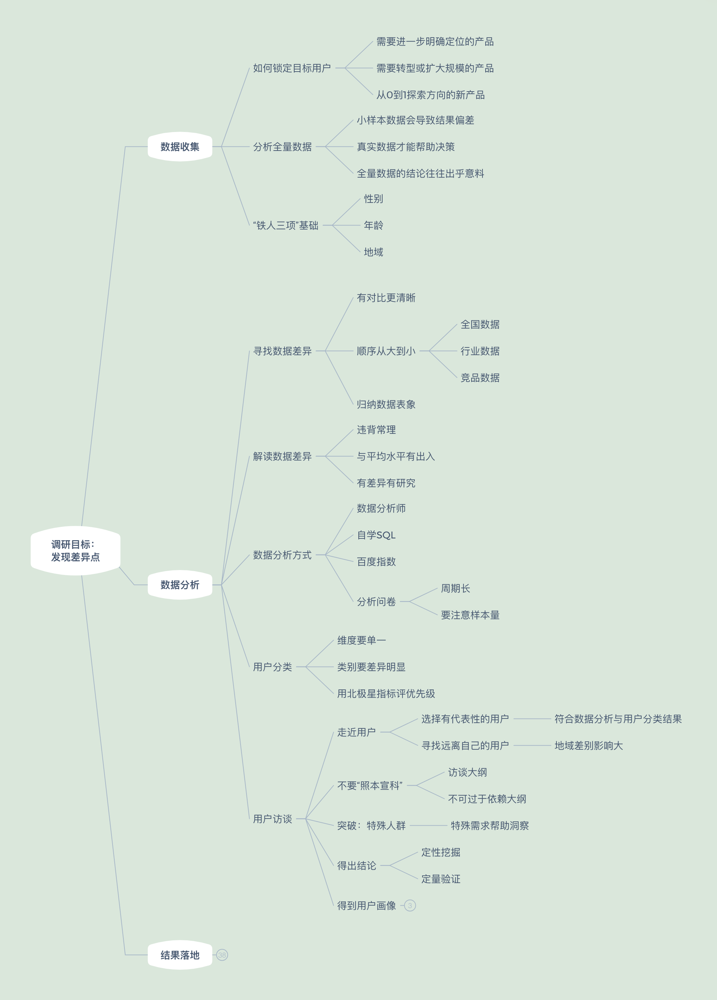
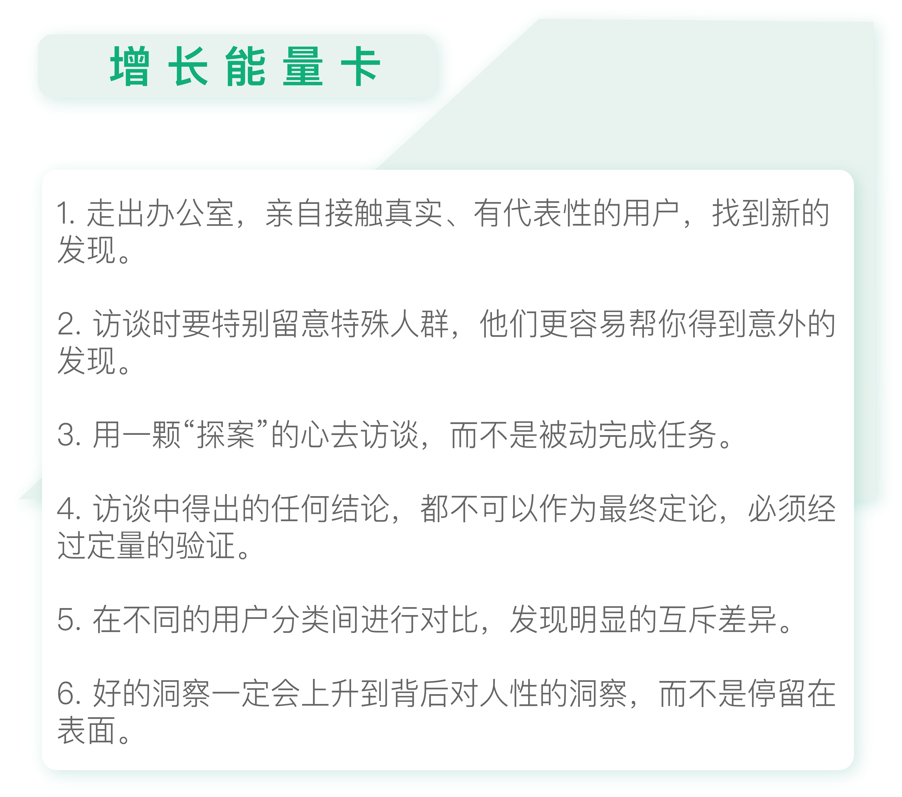

# 用户访谈：像侦探一样寻找破案线索（上）

今天我会和你探讨如何通过用户访谈进一步挖掘用户的差异点，达成调研目标。

在上一讲中我讲了如何做用户分类。分好类别后，我们可以通过现有的数据生成简单的用户画像。当然，仅有这些信息肯定是不够的，为了更深入地挖掘差异点，还需要结合**用户访谈**。

## 传统访谈常见的问题

我参与过很多次的用户访谈。可以说，这是一项比较耗时的工作，每个用户都需要访谈 1~2 个小时左右。如果是大型的用户调研，可能需要正式访谈十几名用户，最后还要汇总报告。

从表面上看，整个过程严谨、专业、有条不紊。但实际上，这里可能会产生很多问题。

首先，愿意来到你的办公室接受访谈的人群，本身可能就比较特别，并不能代表平均水平。这样研究的结果会存在偏差。

其次，很多调研人员并不了解业务，这可能导致研究出的结果很难落地。

第三，来自同一个城市的用户，难免都比较相似，难以帮助你洞察到有价值的差异点。

第四，用户说的未必代表自己的真实想法。

有个经典的故事，说的是某公司为一款即将面市的游戏机做调研，请了很多用户过来。其中一个问题是问用户希望这款游戏机是什么颜色的，很多人都选择了黄色。访谈结束后公司拿出了不同颜色的游戏机让用户挑选以感谢他们配合调查，结果发现绝大部分用户都拿走了黑色的游戏机。

当然，这不能怪用户“言行不一致”，而是用户在看到真实的颜色之后，可能发现和自己想象的并不一样。

所以，访谈其实是门学问，要**把握好用户的心理和场景**，不能用户说什么就是什么，这样反而是在给自己“挖坑”。

在接下来的两讲中，我会给你介绍访谈时的一些注意事项，帮助你用最短的时间最高效地获取到洞察，而不会像传统方式一样费力不讨好，甚至得到错误的方向，那样就太得不偿失了。

## 选择有代表性的用户

首先是要选择有代表性的用户，否则就会南辕北辙，离目标越来越远了。所谓的“有代表性”的用户，就是**结合前面的数据分析和分类结果，选择符合特征的人选**。

比如宜人贷把用户分为工薪族及小微企业主，结合之前对“年龄”“性别”“地域”的分析结果，选择若干二线城市、25~35 岁之间、数量接近的工薪族男性及小微企业主进行访谈。

访谈人数没有固定的要求，可以是各 5 个，也可以是各 10 个，最重要的是在这个过程中我们是否可以洞察到有价值的信息。

## 寻找远离自己的用户

在前面的文章里，我提到只要看三项数据“年龄”“性别”“地域”就可以挖掘到很多信息。

尤其是“地域”：国内外的差距、北方和南方的差距、甚至同一个省的不同城市，都有巨大的差异。这里面的学问真是太多了，访谈的时候很容易挖出东西来。

先拿国内外的差异来说吧。

分众传媒的电梯广告，在中国的传媒领域是个创举，但这个点子在美国就行不通。因为美国地广人稀，楼也不会建的很高，安装成本又高……

国外很多不错的产品来了中国频繁遭遇“滑铁卢”，而国内却不断有原创的产品冒出来领先全球，比如共享单车、手机支付等等，这无疑是和国内特殊的国情有关。

再拿国内的差异来举例。

我有个朋友在银行工作，她参加了两年微众组织的全国银行业调研。参与实地调研的时候，她发现，国内不同地域的用户特点相差非常大。

比如深圳和扬州，两地人的收入不同、家庭结构不同、房价不同、购房资金来源不同、贷款压力不同、视野不同……太多太多了。

扬州房价 2 万一平米，基本都是本地人，结婚一般都是家长全款买房，所以很多年轻人都是挣多少花多少。深圳房价 8 万一平米，大部分都是外地人，所以千方百计地理财。

除了地域外，年龄也是如此。它后面隐藏着很多，比如你的家庭结构、人生节点、重要开支等等信息。

当然这只是从金融的角度看。如果从不同业务来看，都有不同的信息隐藏在“性别”“年龄”“地域”这三个主要因素后面。

我这个朋友之前还做过旅游产品，当时她就发现：扬州年轻人有钱想消费了，就特别喜欢去南京，他们觉得去省会就很开心；但是深圳年轻人就喜欢去香港或者出国。所以，地域信息中还隐藏着旅行偏好。

因此，为了能更了解我们的用户，一定要尽量走出习惯的办公环境，多走到用户身边，尤其是和我们距离很远的用户。这样我们更容易发现原先不知道的信息，也更有可能获得洞察。

在宜人贷，我们当初选择去哪里访谈用户时，有很多二线城市可供选择。但我们并没有选择石家庄这样临近的城市，而是选择了更远的武汉。

一是因为我们武汉的用户占比高于占全国人口的比例，也就是倾向度更高；二是因为武汉离我们远，我们对当地情况不了解，这就意味着容易有更多收获和发现。最后事实也证明，那一次的调研效果非常好，有了重大的发现，在下一讲我会具体提到。

讲到这，你可能会说：“我没有机会去外地调研啊。”可你真的一点办法都没有吗？不是的。

一方面，你需要主动找领导争取机会；另一方面，也可以退而求其次寻找你身边符合条件的人。你可以先确定想要访谈的用户特征，比如男性、25-30 岁、在武汉打工。然后可以寻找身边符合条件或条件接近的朋友、亲戚，或是朋友的朋友。

好好利用你的“朋友圈”进行调研，说不定你会洞察到非常有价值的信息。

## 不要“照本宣科”

选定好用户，接下来就可以正式进行访谈了。

一般来说访谈有个大致的范围，可以参考下图。

我们一般会以此为蓝本撰写访谈大纲，并逐一询问用户。除了用户的基本信息外，里面包含有使用动机、使用行为与偏好、使用感知与推荐意愿、工作及生活状态、价值观调研等等。

**有大纲本来是件好事，但是千万不要过于依赖大纲。**

这些内容仅作为参考，重点是挖掘它背后的东西。所以一定要随机应变、保持警醒，一旦发现什么“不对劲”的地方就立刻深挖下去。

我们之前所有洞察到的关键点，几乎都不来自于这些常规问题，而是在“临场发挥”的新问题中得到的。

我记得早年在网易工作时，我们有个专门做用户研究的同学邀请了产品经理旁听他的访谈。产品经理事后很不满意，说这个用研太不懂业务了。明明很多问题都可以进一步深挖的，用研却点到即止，只是机械地完成大纲里的提问。

所以我经常觉得，做调研不需要多专业，而是要有一颗好奇心，其实它和破案没有什么两样。

## 用户调研知识地图

根据今天的专栏内容，用户调研知识地图中补充了“分析”这部分的新支点。重点在于如何做好用户访谈。

## 思考题

试着按照我说的方式列出筛选条件及分好类别的用户名单，并准备访谈大纲。访谈时注意随机应变，看看会不会有什么意外的发现？

# 用户访谈：像侦探一样寻找破案线索（下）

在上一讲中，我介绍了如何选择受访用户，以及准备访谈大纲。今天我们来谈谈访谈时的要点以及事后如何总结。

## 关注特殊人群

我们在访谈的过程中，要特别关注“特殊人群”。真正的洞察往往出现在调研“特殊人群”的过程中。

什么是特殊人群呢？特殊人群的种类很多。

比如“高价值用户”，也就是最活跃、付费最多的那群“死忠粉”；“精明型用户”，也就是喜欢货比三家的人；“爱表达型用户”，说起话来滔滔不绝；“深入思考型用户”，有独立的思想对产品有深入的见解；性格及举动奇怪的人，比如狂热收藏者或特殊癖好者；老弱病残孕等等。

这些特殊类型的用户可以放大各种细微的情感及体验，帮助我们得到洞察。

举个特别简单的例子，我曾经参加过一个为期 5 天的线下活动。活动场地只有垫子没有靠背，一天下来腰酸背疼，但是也觉得可以忍受。

有一天有个孕妇自己带了个带靠背的垫子，但是除了主办方，谁也没多留意这个细节。之后再参加这个活动时，我们发现所有的垫子都被替换成了带折叠靠背的垫子，还增加了折叠小桌子。

那一期活动的口碑爆棚，大家赞不绝口，说太舒服了。这就是一个很典型的通过特殊人群带给我们洞察，并得到改进机会的例子。

再举个宜人贷的例子。

在宜人贷调研过程中，我们开始调研了好几位用户，虽然也有不少收获，但并没有特别激动人心的发现。直到我们遇到了一位用过十几款同类产品的用户。我问这些产品之间有什么区别，什么情况下用我们的产品，什么情况下用其它产品？用户的回答出乎意料：“当我需要借几千块时，我就用其它产品，当我需要借几万时，我就用宜人贷。”

这个回答让我惊喜万分，原来对于二线城市的用户来说，我们的产品借款额度远高于其它竞品，这是有绝对优势的。

而这一点我们以前都不知道，毕竟自己试用的话同类产品给的额度都差不太多，但是没想到对于二线城市用户来说有如此大的差异！

所以我想，在产品日益多元化、用户群体多元化的今天，坐在办公室里体验各种竞品差异的时代已经过去了，只有**亲自接触真实、有代表性的用户，才能有所发现。**

当然特殊人群比较难遇到。想要找到他们，一方面可以通过数据分析及问卷设置相关问题来筛选，另一方面，我们要有耐心且有一双善于发现的眼睛。

我有个学员跟我说：“我们这个部门是个特别严谨的部门，所以我拿不到用户的有效数据和资料，我就开始调研周围的朋友，朋友的朋友的朋友，终于发现了一个跟我们日常认知不一样的点。借着一次公司开科技大会的机会，我把我的发现讲了出来，引起了大家的高度重视，现在推动了整个产品的研发。”

所以不要再抱怨没有条件做数据分析或访谈了，只要有心，你就能克服一切困难！

后来我还有一个新的感悟，就是如果想在访谈中获取洞察，前面讲到的几点因素缺一不可。

比如宜人贷调研的成功，我认为有三点原因。

1. 我们选择了远离自己的城市武汉，接触到了和我们平时遇见的非常不一样的人，自然容易有不同的发现。
2. 没有严格遵循访谈大纲的问题，根据情况适当调整、巧妙追问。
3. 很幸运遇到了一位特殊的用户，并且留意到了他的特殊。

也就是说，一个成功的洞察是这几种因素共同起作用的结果，而非单一原因导致的。

## 先定性挖掘，再定量验证

需要特别注意的是，**访谈中得出的任何结论，都不可以作为最终定论**，因为这有可能只是个别现象，不代表它具有普适性。尤其是在“特殊人群”身上发现的洞察，就更需要谨慎验证。

比如在宜人贷调研中，我们发现很多用户为了贴补家用都在兼职创业。也就是说他们有一份稳定的工作，但是与此同时可能还是保险代理员，或者合伙开了家美发店，或者投资了家餐厅，又或者做一些兼职工作等等。

为了验证这个发现，我们投放了一次问卷，提供了多种职业类型选项，并允许用户多选。最终确实验证了大部分用户都是兼职创业人群。

反之，如果通过问卷分析，我们发现大部分用户并非兼职创业者，那就证明访谈得到的这个洞察只是个别现象，并不成立。

## 传统的用户画像为什么不好用？

访谈及定量验证完成后，我们需要按照不同的用户分类描述特征。传统的调研报告往往事无巨细，不仅包含各个字段的详细分析，还会生成用户画像，例如下图。

用户画像把访谈时的发现提炼并虚拟成一个人的形象，优点是帮助项目组成员了解用户，而不是像以前那样通过一堆冷冰冰的数字来想象用户。

但它的缺点也显而易见，其实还是之前说的那个老问题——不落地。

因为内容过多，导致看的人记不住、抓不住重点，难以形成深刻的印象，最后自然很难落地。这也和我们“发现差异点”的初衷相去甚远。

我有个做代驾产品的朋友，最近也遇到类似的问题。他们的代驾产品想主打高端人群方向，所以对高端人群做了深入的调研。

但是并没有得到什么特别的发现，结论非常普通，诸如：用户最关注的是安全，其次是专业、舒适、便捷，再其次是尊重、优越，最后是关爱。

你看了这些结论有感觉到“差异性”吗？很明显，没有。

朋友说他已经非常尽力了，这个项目做了好几个月，进行了各种专业的分析，但确实结果平平，没有什么惊喜。

这就是传统调研的通病，最后得出的总是这些“不痛不痒”的结论。那应该如何改善，找到令人眼前一亮的“差异性”呢？其实很简单，就是两个字：**对比**。**没有对比就不可能看出差异**。

## 对分类人群进行对比探寻差异

拿朋友这个案例来说，北极星指标是“提高运营收入”，运营收入 = 客单价 * 下单量。可以从消费频次这个角度把用户分成高频用户和低频用户两类。

通过把两类用户进行对比，朋友马上有了重要的发现。

高频用户使用的主要原因是商业应酬，普遍在晚上十点以后下单；而低频用户使用的主要原因是朋友聚会，普遍在晚上十点以前下单。前者有帮客户叫车的需求，所以对服务、体验特别在意，对价格不敏感；后者主要是自己用，注重性价比和效率。

我们都知道中国人好面子，对商务人士来说更是如此：自己受点委屈没关系，如果客户不满意了，单子丢了那可是天大的事情，前面所有努力就都白费了。

你看，这么一对比，一下子从表面上的“安全”“专业”“关爱”这些平平的字眼上升到了**背后对人性的洞察**。所以，“洞察”一定不能停留在表面，而是要挖掘用户背后潜在的诉求和细微的心理活动。

有了这样的洞察，朋友对后面的优化有了明确的想法：之前为了体现“专业”和“关爱”，他考虑完善会员制度；但现在他决定把重点集中在“帮客户叫车”的新功能开发上。也就是说，不一样的洞察使他在决策质量上有了天壤之别。

我有个做了多年用户研究的朋友听过我的理念后，说最近突然领悟到：这就好像淘金一样，你不冲到最后一粒金就还是一堆沙，没用的。

我很喜欢这个比喻，的确，无论是做市场分析还是用户研究、数据分析，都是一样的，必须有淘金者的耐心和魄力，才能真正从沙子中淘到黄金。而不是像以往那样交了一摞分析报告就了事。

## 用户调研知识地图

根据今天的专栏内容，用户调研知识地图中补充了“分析”这部分中有关用户访谈的新支点。

## 思考题

列出北极星指标以及你的用户分类思路，根据访谈及定量验证结果，对比不同的用户类别挖掘差异点，注意要上升到对人性的思考。

