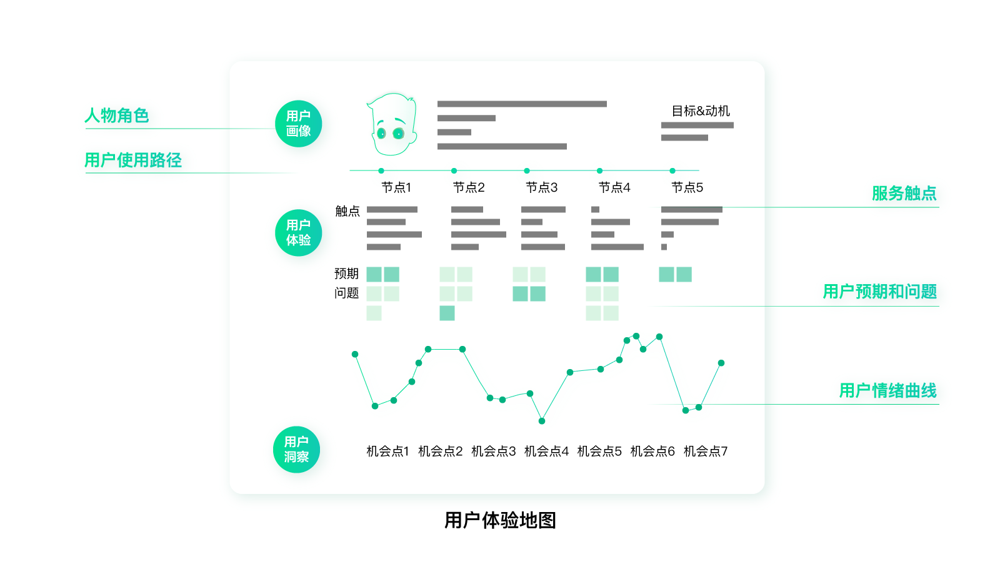
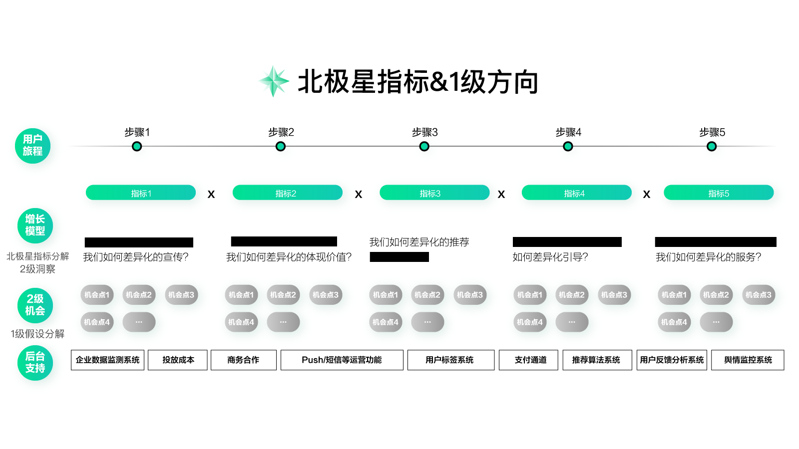
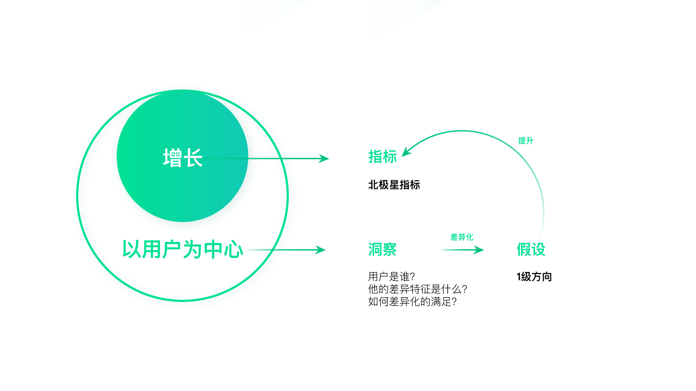
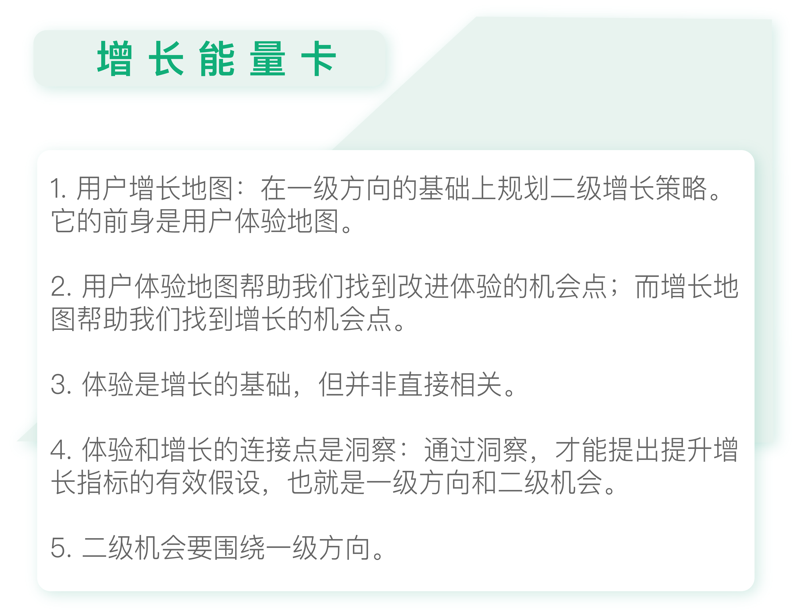

# 统筹全局的用户增长地图

在上一讲中，我们学习了通过用户旅程分解北极星指标，这只是制定增长策略的第一步。同时它也是我今天要教你的新工具“用户增长地图”中的一部分。

## 用户体验地图与增长地图

什么是用户增长地图呢？

用户增长地图是用来帮助我们在一级方向的基础上规划二级增长策略的，它的前身是用户体验地图。

说起用户体验地图，产品经理和设计师们应该都不会陌生。它通过画一张图，用一种讲故事的方式，从用户视角出发，记录他们与产品或服务接触、互动的完整过程，从而帮助我们找到改进体验的机会。

用户体验地图的出现，可以帮助设计师一览全局地俯视整体体验情况，避免过度关注局部细节；可以帮助产品经理从用户视角考虑问题，避免过度关注功能逻辑。

上图是一个示例，我们可以根据情况在此基础上增加或删减内容。由于用户体验地图不是我要讲的重点，在网上也能查到很多相关内容，所以这里只做简单介绍。

用户体验地图大体包含如下内容：

### 1. 人物角色

简单的用户画像，以及目标和动机。比如：二三线城市的兼职创业者，需要借几万块用于资金周转。

### 2. 使用路径

类似上一讲提到的用户旅程，只不过这里可以尽量详细。比如：看到广告→注册→下载 App→选择借款产品→申请借款→放款成功→按时还款。

### 3. 服务触点

这是指用户接触到产品或服务的方式。使用路径上的每一个节点都可能对应着多个触点。比如“看到广告”这个节点，可能对应着电视广告、网络广告、户外广告等多个广告触点。

### 4. 预期问题

用户在每一个节点下，他的预期是什么？问题又是什么。

比如注册时，用户预期可以看到详细的产品说明，并快速注册通过；而他遇到的问题可能是信息不全不足以帮助他做决策，或者注册流程出现问题等等。

### 5. 情绪曲线

用户处在每一个节点中的情绪是高兴的还是愤怒的？连成曲线，我们就可以知道哪个地方的体验还不错，哪个地方的体验很糟糕。这样可以帮助我们优先改进体验糟糕的地方，从而提升整体体验。具体打算如何改进呢？你可以把相关的洞察和想法写在对应的节点下面。

用户体验地图的好处是能够从用户视角全局化地改进体验，这是做增长的基础。

我们前面一直在说，要以用户为中心增长。很明显，用户体验地图确实是“以用户为中心”，但却未必能带来增长，也就是未必能带来总体价值上的提升。因为用户在某个点体验不好，不代表他最终体验不好。即便最终体验很好，也不代表他会为产品持续贡献价值。

举个例子，对于借款用户来说，只要能借到足够的钱就行，过程中每个节点的体验问题只要不影响到最终借款，用户其实都不会那么在意。

再比如，朋友请我去五星级酒店吃饭，我感觉体验特别好，但我自己很可能不会去，因为我不是目标人群。

可见，**体验是增长的基础，但并非直接相关。**我们最重要的是满足好用户的核心需求，并把它做透，而不强调把每一点都做到极致。在资源有限的情况下，一定要“四两拨千斤”而非“面面俱到”。

因此，我们可以在用户体验地图的基础上稍做改良，把它变成以价值为导向的用户增长地图。

## 用户增长地图的绘制

用户增长地图同样从用户视角出发，记录他们与产品或服务接触的关键过程。我们一直强调“以用户为中心增长”，所以这点是至关重要的。此外，**用户增长地图以增长为导向，帮助我们在全局中找到“四两拨千斤”的关键环节并提出相应的增长策略。**那么它是怎么做到的呢？来看看增长地图的内容吧。

### 1. 北极星指标 & 一级方向

既然要做增长，那一定离不开北极星指标做方向指引，所以我们把它写在最上面。紧接着是一级方向，前面我们已经讲过，它是围绕北极星指标的最重要的战略方向。

### 2. 用户旅程 & 增长指标

在上一讲我提到过，用户旅程是用户接触产品或服务的过程，这里要求选择和北极星指标相关的关键路径。这样，我们就把一个大的北极星指标分解成了若干个关键的二级增长指标。

### 3. 二级洞察

前面我们花了很多篇幅讲如何围绕北极星指标做一级洞察，这里其实也是类似的。只不过这里的指标变成了从北极星指标分解出来的二级增长指标而已。

### 4. 二级机会

我们具体要做什么事情，才能围绕一级方向提升北极星指标。之前我们结合北极星指标和差异性的用户洞察，得到了一级方向。这里需要结合二级增长指标和二级洞察，得到对应的二级机会。

## 二级洞察与二级机会

前两部分在上一讲已经简单提到过，现在我们重点说说二级洞察和二级机会。其实整个过程相当于一级方向的迷你微缩版。我们先来回顾下一级方向画布，看看一级方向是怎么得来的。

**指标：**

- 产品目前所处阶段及关注点（探索期 / 成长期 / 成熟期 / 新的探索期）
- 当前阶段的北极星指标

**洞察：**

- 用户范围 / 分类 / 优先级（围绕北极星指标）
- 用户画像（用户差异性洞察，需要数据支撑）
- 定位（三级大炮）

**假设：**

- 一级方向（围绕定位最高级的事项）

这里面可以分成三大块：指标、洞察、假设。它们之间的关系是：**通过洞察，提出能够最终提升指标的假设**。而在用户体验地图里，我们只是直接改进体验让用户变得更加满意。

你可以看到，这两者的思维是截然不同的。因为用户满意并不代表对应的指标就能够提升。前者是制造惊喜，而后者只是弥补漏洞。

洞察里包含三部分内容：用户是谁？他的差异特征是什么？如何差异化的满足？

二级洞察则以此类推：通过二级洞察，提出能够最终提升二级增长指标的二级假设。二级洞察以一级洞察为基础，在此基础上需要额外关注：**用户当前**特别关注什么？如何差异化的满足？

由此我们得到一系列二级机会：比如拓展某个营销渠道、开发某个功能、优化某个页面等等。当然，不管做什么，都**需要围绕一级方向**。

举个例子，比如你的一级方向是“突出额度高”，那么你的某个二级机会“优化营销 banner”，则需要在 banner 上突出额度高。

在下一讲，我们会通过若干实例来进一步讲解用户增长地图，帮助你找到具体的增长机会。

## 思考题

今天的思考题是，请基于北极星指标和一级方向，试着写出你的产品的用户增长地图。不过写不清楚也不要担心，我们在后面几讲还会继续详细讲述。

