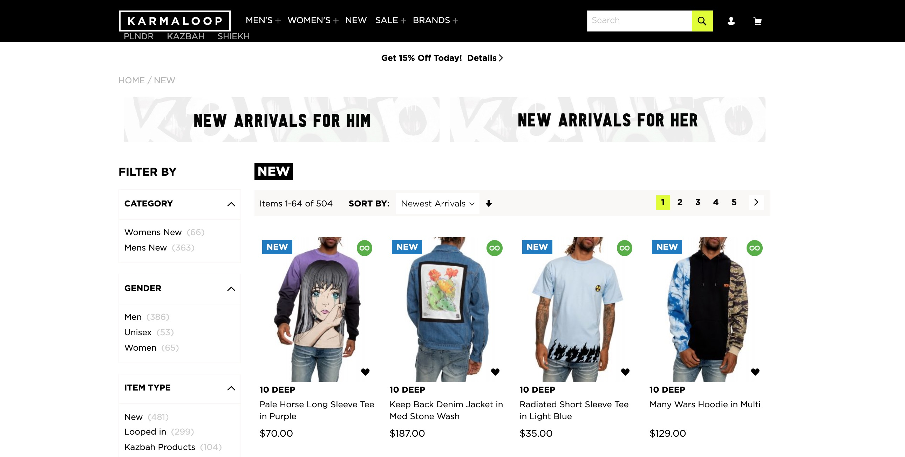
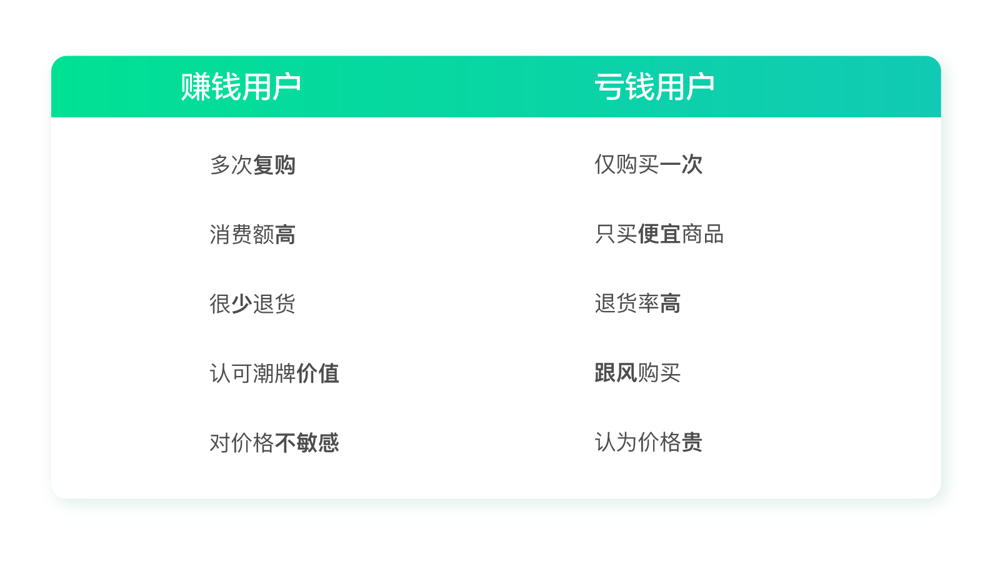

# 为一家濒临破产的公司制定增长策略（上）

模块三的内容马上就要收尾了，到现在为止，我们已经了解了一级方向和二级机会。也许你觉得自己的概念已经学习的不错了。不要着急，我们很快就会在模块四中，学习怎么具体地落地执行。

在下一个模块开始之前，我们先用之前学习到的内容来分析一个案例，做一个小练习。因为篇幅有些长，所以我分成了上、中、下三讲。

这个练习是这样的：把一个市面上的增长案例用我们学过的方法套用、演练一遍。

这样做，一是为了熟练掌握我们前面学习过的内容；二是通过这个练习，以后你可以尝试把自己知道的增长案例复盘一遍，做到知其然，并知其所以然。这样就解决了以往我们学习增长知识，只能看别人的华丽案例，却不知如何复用的窘境。

这个练习使用的是一个海外案例，这个“逆风翻盘”的案例非常有意思，你可能曾经看过，我在这里简单叙述一下。

美国潮牌电商巨头 Karmaloop 由于扩张过度，不幸破产，公司被廉价转手于人。一位传奇人物德鲁·萨诺茨基（Drew Sanocki）临危受命，出任这家公司的 CMO，围绕获客、激活、留存、增加收入这几个关键点，用一系列增长策略挽救了这家公司。

如果你有兴趣的话，可以上网搜一下这个案例，文章中我就不再赘述了。

这一讲中的内容主要是结合前二十几讲的内容，谈谈我自己对这个案例的理解和一些不一样的观点，帮助你在下一讲更好地进行模拟分析演练。

## 打江山与守江山同样重要

很多人看完这个案例后都会惊叹于德鲁超强的营销能力。

但其实一家公司想要成功，**开创者的作用是不容忽视的。**德鲁之所以能在这么短的时间让一家公司起死回生，本质上是因为这是一家定位正确、对用户有价值的公司。否则德鲁再怎么运作都于事无补。

这家公司的开创者，名字叫格雷格·塞尔科（Greg Selkoe），本科毕业于罗林斯学院人类学专业。2000 年的时候，格雷格在他父母的地下室里创建了 Karmaloop 这个潮牌电商平台。这起源于他自己爱好的街舞、涂鸦等”边缘文化“。同时，他还患有多动症（注意缺陷多动障碍）。在 2013 年的一次采访里，他还重点表达了多动症是怎样帮助他取得成功的。

还记得我前面说过的做增长很重要的一点是**发现自身优势，寻找最长板**吗？这位创始人的个性特征和学业背景可能并不符合主流的社会要求，但是他**另辟蹊径，在另一个小众群体里找到了自我价值**。

后来，这家公司不断壮大，每年的营收都是成倍增长，甚至有嘻哈巨星为他站台点赞。2013 年，公司登上顶峰，营业额达到上亿美金，远远甩开其它潮牌电商，稳居行业第一，成为了美国最大的潮牌经销平台。但由于格雷格经营不善，大肆扩张，在 2014 年公司就已经出现了巨额亏损。

中国有句古话叫“打江山容易，守江山难”。的确，开拓一个新领域和妥善经营业务，对人的要求是完全不一样的。

开拓一个新领域需要大胆创新，结合自己的优势找对目标人群，提供差异化的服务，也就是我们说的“一级方向”。而稳定妥善地经营业务需要的是励精图治，既要秉承一级方向，又要精细化运营，得出“二级机会”。这两者缺一不可。**无论是创新者还是经营者，其实都在为增长发挥巨大的作用。**

## “魔法数字”不是万能的

如果你去看过 Karmaloop 的案例，你就会知道德鲁是通过数据分析，发现了高价值用户的秘密：80% 的情况下，高价值用户会在第一次购物后的 30 天内完成第二单。

我在[第 22 讲](https://time.geekbang.org/column/article/98396)也提到过：LinkedIn 用户一周内添加 5 个社交关系，Facebook 用户 10 天内添加 7 个好友，就能够保证较高的留存率。

这就是增长黑客口中津津乐道的“魔法数字”，第三方数据分析平台 GrowingIO 甚至还为此做了一个功能，帮助你找到“魔法数字”。

表面上看，“魔法数字”好用又神奇，但其实在实际应用中想要使用它是困难重重的。因为大多数的公司，根本找不到自己的“魔法数字”。这就好像大海捞针一般，可遇不可求。

包括在[第 11 讲](https://time.geekbang.org/column/article/92909)提到的“聚类分析”，也属于类似的情况。通过数据分析把用户分成不同的类别的方法未必每次都能奏效，你需要不停地调整分类维度来“碰运气”。

德鲁之所以能成功地找出“魔法数字”，是因为他并不完全依靠数据，而是先提出了问题：高价值用户究竟花多久完成第二次购买？顺着这个问题，他才发现了重要的规律。

**但是如何提出正确的问题呢？**这可让很多人犯了难。毕竟不是所有产品都能直接套用这个思路。这也是很多人看了若干经典增长黑客案例，在实际工作中还是无从下手的原因。

## 抓大放小，把重要事情做到极致

格雷格之所以没有坚持到最后，是因为他想做的事情太多了，但是哪件都没有做好。

2008 年，格雷格拿到了一大笔融资，有了花不完的钱，之后就开始大肆扩张，建立了一系列品牌。你还记得因广告语“凡客体”火遍大江南北的凡客吗？不得不说，太过快速的扩张也是压倒凡客的重要原因之一。

当然，现在说起来你知道这样做是不对的，但是作为当事人，这样的情况真的很难避免。因为一家公司势头正好的时候，卖什么都很赚钱，当发现不对劲的时候往往为时已晚。这时即便做出一系列举措去节约成本，公司也已经元气大伤了。

格雷格不仅热衷于扩张品牌，还筹划了一档电视节目，去进一步强调自己在潮流界的地位。这时公司赚钱的速度已经远远赶不上烧钱的速度了。结果，所有扩张计划均以失败告终，仅电视节目就烧掉了 1400 万美金，节目也没有上线。

为了偿还贷款，格雷格在紧急情况下又做出了一系列错误的决策。比如采取降价策略清理库存，很多高端品牌都能看到 40% 以上的折扣。这完全违背了产品的核心价值，不仅没有挽回收入，反而使得众多品牌商纷纷撤出。

为了进一步降低成本，格雷格决定采用直发模式，即自己不囤货，是顾客下单后由品牌商直接发货。但是，当时的客服和物流根本跟不上订单进度，经常会出现顾客收不到货又退不了款的情况。这一举动让 Karmaloop 的老客户们也逐渐失望离去。就这样，一步错，步步错，2015 年的时候局面彻底失控，公司的营业额缩水到原来的一半，公司正式宣告破产。

可以看到，在运营公司方面，格雷格和德鲁的风格完全不一样。

格雷格是粗放型的花钱，烧钱引流，但也正因为他敢想敢干，才开创了这家公司。而德鲁是精细化运营，力图把一件事情做到极致。比如，德鲁首先去寻找高价值用户，因为他知道这 20% 的高价值用户可能贡献出的是 80% 的收入。然而现实中，我们大多数时候却把这 20% 的高价值金主当作普通人来对待，这显然是不合理的。

这也就是我在专栏里一直在反复强调的，做增长要抓大放小，找到关键核心，把它做深做透，才能“四两拨千斤”的增长。

## 如何找到万能的增长思路？

德鲁的案例基本还是来自于 AARRR 的思路，即获客、激活、留存、变现、传播。顺着这个思路，德鲁做出了很棒的策略，取得了很好的效果。

但这个时候你可能就会问了：这些具体策略怎么得出来的？换到我的产品里怎么办？

很明显，AARRR 的思路过于宽泛，里面的这些决策细节是无法被复制的。但是你可以通过前面二十几讲中的内容和思路，把这个例子复盘一遍，明白要如何通过一定的程序得出具体策略。

如果你现在无法自行复盘也没有关系，在下一讲，我会带你手把手地把这个例子串一遍，用“一级方向”“二级机会”的步骤一步步地帮助你复习。

你也可以用这套方法去分析其它的增长案例，都没有问题。因为这是一套通用的、解决问题的、非常具体的思考框架，它可以用在任何产品上。它的目的就是解决大量增长案例背后缺乏具体的方法论基础、很难被复用的问题。

## 思考题

今天的思考题要求你先去看 Karmaloop 的增长案例以及这篇文章，自行做个复盘。这里不强求你马上就会套用“一级方向”“二级机会”的体系，也不建议你简单复制别人长篇大论的评价，更多的是希望你有些自己的、不一样的思考在里面。

# 为一家濒临破产的公司制定增长策略（中）

今天我们需要按照一级方向和二级机会的思路，复盘 Karmaloop 这家公司的增长案例，看看你能否为它制定出合适的增长策略。

## 回顾一级方向画布

还记得我们的一级方向画布中有几个要点吗？忘记了也没有关系，我们来一起回顾一下它的内容吧。

1. 产品目前所处阶段（探索期 / 成长期 / 成熟期 / 新的探索期）；
2. 当前阶段的北极星指标；
3. 用户范围 / 分类 / 优先级（围绕北极星指标）；
4. 用户画像（用户差异性洞察，需要数据支撑）；
5. 定位（三级大炮）；
6. 一级方向（围绕定位最高级的事项）。

## 分析一级增长方向

现在，我们尝试用一级方向画布来分析 Karmaloop 的增长案例。

### 1. 产品目前所处阶段

第一步，是产品目前所处的阶段。

很明显，Karmaloop 这家公司的经营方向是潮牌电商，这个方向已经经过了市场的验证，并且曾经为它带来了可观的营收，后来只是因为经营不善才倒闭的。所以，这家公司的方向是非常明确的。因此，它可以算作是处在成长期。

### 2. 当前阶段的北极星指标

第二步，当前阶段的北极星指标。当然，案例里 Karmaloop 的“当前”已经是过去时了，不过为了方便讲解，我们还是这样称呼吧。

通过第一步，我们知道了该产品处于成长期。而产品在成长期一般追求高速增长，结合 Karmaloop 当时资不抵债的实际情况，关注点在于把量做大的同时还要盈利，让这家公司起死回生。

所以，“用户量增长且盈利”是该产品当前阶段的北极星指标。

### 3. 用户范围 / 分类 / 优先级

第三步，是围绕北极星指标划分用户范围，做好用户的分类和优先级排序。

如果你根据潮牌产品的“小众”特性和之前 Karmaloop 的经营已经积累了一大批忠实用户的实际情况来思考的话，在用户范围上，你就会很自然地把重点放在唤醒老用户上。当然，也需要适当拉新。

在用户分类上，围绕北极星指标“用户量增长且盈利”，我们可以把用户简单地分为两类，一类是让公司亏钱的用户，一类是让公司赚钱的用户。没错，不是所有的用户都让公司赚钱的，当时有很多用户都在让 Karmaloop 亏钱。

由于该公司有近 10 年的交易数据，所以通过 RFM（最近一次交易时间、交易次数、交易金额）模型很容易建立用户价值分层。再结合各项成本，计算出满足什么条件的用户在为公司赚钱，满足什么条件的用户在让公司亏钱。结合性别、年龄、地域等信息，对满足条件的用户进行访谈，再定量验证，得到用户分类及典型特征对比。

你可以在图片中看到，让 Karmaloop 赚钱和亏钱的用户分别有什么特征。

通过对比，你可以明显地看出来：目前的赚钱用户是发自内心的喜欢潮牌，愿意为了潮牌多花钱，而且会经常穿；而亏钱用户就只是抱着尝试的心态，发现不合适自己也就不再购买了。

看到这儿，你可能会觉得肯定是赚钱的用户是我们的目标。

其实不一定。围绕北极星指标“用户量增长且盈利”，我们需要从两方面考虑：一，是谁的量更大；二，是谁的利润高（由于之前对所有人的优惠策略一致，所以这里粗略的看消费金额就可以了）。

通过数据分析，发现赚钱用户只占 1.3% 的访问量，很明显这个量实在是太小了。但是，他们在访问量只占 1.3% 的情况下，贡献了 43% 的收入。这个对比是不是很惊人？但是，由于这部分人太少，他们的贡献收入也没有过半，所以我们还是需要考虑到更大的那部分“亏钱用户”。

亏钱用户的数量是有了，但是这部分人群体量越大赔的就越多，如何才能两全其美呢？办法只有一个，那就是尽量把他们变成赚钱的用户。可是，对潮牌根本不感兴趣的用户，能转变成赚钱的用户吗？

在[第 1 讲](https://time.geekbang.org/column/article/89601)和[第 13 讲](https://time.geekbang.org/column/article/94000)里我都提到过，**理解用户要上升到“人性洞察”的层面**，挖掘到用户的潜在需求。

很多用户确实是抱着试试看的想法购买，买回来觉得不满意就不再买了。但是，这里面可能包含了各种因素，比如刚好买到了一件不合适的衣服，刚好号码不合适，刚好购物体验不好，刚好没有得到闺蜜的夸奖……如果你能**投其所好**，**适当地挽回**，有可能他就会变成你未来的忠实粉丝。

“访谈”就是用来解决这个问题的。你可以针对这部分人群做深入的访谈，看看他们放弃的原因是什么。如果能找到答案，说不定你只需要付出很小的努力就可以挽回大量的用户。

从案例里，你应该已经看到了，德鲁更多的是用测试的方式。比如，为了唤醒流失老用户，他把流失的老用户划分成许多个 10000 人的小组，逐步测试不同的方案。

- 10-30% 范围内的折扣；
- 下次购买返现金；
- 送礼品卡；
- CEO 亲笔信及电话
- ……

经过不懈的努力，在经历过 20 多次失败的测试后，德鲁才找到了一套最佳组合。

这里不是说测试不好，而是想指出：在缺乏洞察的基础上测试，真的无异于大海捞针。这样虽然也有可能成功，但无疑是非常低效的。你我都不是德鲁，可能连试错的机会都不会有他那么多。在没有那么多机会可以去试验的情况下，一开始就找好方向，对我们来说更为重要。

### 4. 用户画像

第四步，是用户画像。

通过常识来分析：在 Karmaloop 经营的如此糟糕的情况下，留下的这些“赚钱用户”绝对是真爱粉，他们是实实在在认可潮牌价值的。但是潮牌毕竟是小众文化，如果想把量做起来，就不得不重视大量“跟风”的用户群体。

就拿名牌包来说吧。真正认可它的品牌价值，且符合这个消费档次的人群并不多。它的销量很大程度上是靠普通人撑起来的。

为什么很多收入不高的普通人也会买很贵的包？从人性的角度来说，是为了抬高自己的价值，满足内心的缺失感。看着手里几千块的月薪，却能有朝一日换一个名牌包，这带给人的是一种满足感，好像自己也变成了有钱人。

潮牌也是如此。它与名牌产品一样，是带有符号价值的。穿上潮牌会让人感觉很酷、很潮、很有个性，这是很多大众内心期盼的，而不一定要真正的拥有“潮”的精神。

至于价格，大众一般都会在意价格的。但是如果你的东西能满足某种人性的需要，即使是一个爱讨价还价的人也会变得非常慷慨，就好像我说的名牌包的例子。

这也符合增长的实质，找到用户潜意识中最需要的点，忽略其他次要的点。现在，让我们来看看经过校正的用户画像。

通过这个画像，你可以看到抓住“渴望潮流”这个人性诉求，正是“四两拨千斤”的关键。

### 5. 定位

接下来我们再讨论定位，这是第五步。

这里就要用到我们的营销定位三级大炮了。通过前面的分析，我们已经得出了 Karmaloop 的公司优势、产品优势和目标群体。

很显然，Karmaloop 的公司优势是：创始人的潮牌精神在大众心中根深蒂固，并且做得比较早占领了市场；产品优势是建立了潮牌文化，自营模式能够保证体验；目标群体是认可潮牌价值及渴望潮流的人。

### 6. 一级方向

第六步，就是得出一级方向了。

围绕“用户量增长且盈利”这个北极星指标，我们最重要的方向是什么呢？当然是要突出和强调潮牌定位。尤其是要让人感觉它并不是一个特别小众的文化，只要穿上我们的衣服你也能变成潮流达人。这样才能拉拢那些渴望跟风、仰望潮牌的群体。同时，这样也能够让大家不会太关注价格，提高利润。

分析到这里，一级方向的部分就完成了。接下来你知道要做什么了吗？没错，接下来我们就要围绕一级方向去制定二级增长策略。由于篇幅有限，我们会在下一讲内容中继续。

看到这里，我想你也有所体会。这和增长黑客的思路的确不太一样，增长黑客更倾向于直接进入二级策略部分，通过经验、假设，以及大量的实验得出结论。这种方式的弊端显而易见：缺乏洞察导致实验效率较低；缺乏底层的方法论支撑，假设及经验难以被复用等等。

而我这里讲的思路其实是产品极客和增长黑客思路的结合，非常的偏重前期的洞察和分析，后面还要结合数据实验验证。

我知道很多同学可能非常期待看到具体的、能即学即用的实操案例，而不是太多的理念和分析。但是我想说的是，即学即用、立竿见影的东西是不存在的。掌握底层方法和思路，才是“弯道超车”的唯一法门。

## 思考题

今天的思考题是，请你试着用一级方向画布去分析其它的增长案例，看看是否能找到人性洞察背后那个最关键的点。

# 为一家濒临破产的公司制定增长策略（下）

今天我们接上一讲内容，看看要如何围绕一级方向，通过用户增长地图为 Karmaloop 制定二级增长策略。

## 回顾用户增长地图

我们先来回顾一下用户增长地图的内容，你还记得吗？这里一共有 4 点。

1. 北极星指标 & 一级方向
2. 用户旅程 & 增长指标
3. 二级洞察（正向 & 负向）
4. 二级机会

现在，我会带着你逐一完成这些内容，告诉你要如何用这几点来分析案例。我建议在每个具体部分展开之前，你能够先按照自己的理解把它们写下来，然后再参考我的内容，这样更有助于你日后的实战。

## 分析二级增长策略

准备好了吗？现在我们来尝试分析 Karmaloop 的二级增长策略。

### 1. 北极星指标 & 一级方向

第一步，是北极星指标和一级方向，我们已经通过上一讲的内容得出了结论。

根据上一讲的内容，Karmaloop 现阶段的北极星指标是“用户量增长且盈利”；一级方向是“突出和强调潮牌定位”。

### 2. 用户旅程 & 增长指标

第二步，是用户旅程和增长指标。

Karmaloop 是个海外产品，你应该是没有用过，所以为了方便你理解，我会按照常规电商网站的流程来梳理。那么用户旅程和对应的增长指标可以分为 5 点。

- 被吸引：广告曝光及朋友推荐；
- 访问网站并注册：网站访问量、注册率；
- 选择商品并加入购物车：加车率；
- 支付：首次购买率、新用户平均订单金额；
- 持续购买：已有老用户数、老用户重复购买比例、老用户平均订单金额。

通过表格，相信你能更清楚直观地看到这个用户旅程。

### 3. 二级洞察

接下来我们加入第三步，二级洞察。这里，我们要先回答一级洞察的核心内容，即**用户是谁？它的差异特征是什么？如何差异化地满足？**

通过上一篇文章的分析，得到的一级洞察是：用户是认可潮牌文化的小众群体，以及渴望潮流、渴望被认同的大众群体。应该通过强调潮牌地位的领先者来差异化的满足用户群体。

那么与这个一级洞察对应的二级洞察是什么呢？还记得之前讲过的正负双向洞察吗？这里就要用上了。

我们先来说正向二级洞察，因为优点比缺点更重要。还记得那五个关于二级洞察的参考问题吗？我把这五个问题与用户旅程对应，一一列在下面这个表格里供你参考。

对应的，我们可以以二级洞察参考问题为方向来得到正向二级洞察。这些洞察有的是来自前面的用户洞察，有的是来自于数据分析。数据分析可以是跟自己产品相关的，也可以是行业数据带来的启发。

现在我们再来看看负向的二级洞察。

表格里同样是根据负向二级洞察的参考问题来得到负向二级洞察。你可以自行查看。

### 4. 二级机会

第四步，也是最重要的一步，我们需要结合正向的二级洞察和负向的二级洞察得到增长机会。

这里需要注意的是：**所有的二级机会不管怎么做，都需要围绕一个核心**，那就是突出潮牌精神，强化 Karmaloop 的潮牌领导地位，强调它的价值和文化。缺少了这个核心，再怎么做都只是机械的操作和执行，最终的效果自然也很难令人满意。

这就好像画匠和大师的区别，画匠虽然可以画其“形”，却无法画其“神”。我们学习增长案例，**既要关注他们的操作手段，更重要的是要揣摩背后的核心精神**，这些东西才是最重要的。而市面上总结的增长案例恰恰隐藏掉了这些关键的东西，只是把表面上的策略告诉你。所以你即便完全照做，也觉得效果并不好。

说这些是真心希望**大家不要太依赖具体的案例和操作**，如果你不知道背后的思考路径，只是简单的模仿和复制，那其实和你想要快速见效的初衷反而会背道而驰。

总之，一级方向画布和用户增长地图给我们提供了清晰的框架，帮助我们明确大方向并做好重要的决策而不遗漏关键的内容。相信通过它们，以后不管再遇到什么案例，你都可以按照这个逻辑去梳理，而不是看着别人的“经验之谈”不知从何下手。

希望你可以多加练习，慢慢地，你就会融会贯通，看到市面上任何增长案例都能知道它从何处来，又能到何处去，因为你心中已经有了一个非常坚实的逻辑框架。

好了，到现在，最艰难的“拔高”的部分终于结束了，感谢你坚持到这里。从下一讲开始，我将为你讲解具体落地执行的部分。

## 思考题

按照我教你的方法，复盘市面上的某个增长案例，找找感觉。

