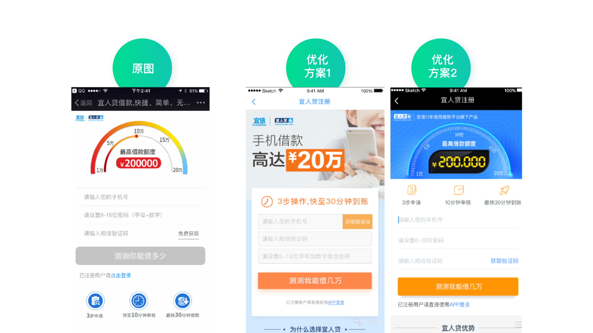

# 案例解析：打造增长闭环（上）

上一讲中，我们介绍了精益闭环的思路。今天，我会通过几个简单的案例帮助你进一步理解它的使用方法。

由于精益闭环处在三级的位置，所以在正式讲解案例之前，我们还需要回顾下一级和二级的内容。了解好“来龙”，才找得到“去脉”。

以宜人贷为例，围绕“以用户为中心增长”的思路，我们通过差异性洞察得到一级方向画布，内容如下：

1. **产品目前所处阶段及关注点：**成长期到成熟期，在保证稳定的基础上谋求快速发展
2. **当前阶段的北极星指标：**低成本高贷款余额
3. **用户范围 / 分类 / 优先级：**现有用户群体 / 兼职创业人群
4. **用户画像：**二线城市多、兼职创业多、资金周转多（数据略）
5. **定位：**行业领军企业、雄厚的风控实力—> 额度高—> 二线城市用户
6. **一级方向：**突出额度高

围绕一级方向，我们制作了二级用户增长地图。还记得我在第 23 讲里提到的为用户增长地图排列优先级吗？我在地图上标出了当前阶段内三件最重要的事情。

怕你忘记，我在这里再简单复述一遍排列优先级的思路。

以设计团队为例，我们需要考虑结合我们的能力，如何提升北极星指标。结合用户增长地图，我们决定先优化借款流程，保证用户来了以后使用顺畅（否则通过营销手段拉来的用户到了后面留不住，前面的工作也相当于浪费了）。然后再优化 H5 营销落地页、产品介绍 H5 页面，最后优化 App 首页和其它页面。

这是因为优化 H5 成本低、见效快；而 App 要考虑发版时间，相对来说麻烦很多。所以，可以先优化 H5，在实验的过程中发现规律，然后再把规律复用到 App 页面上，让 App 的提升一步到位。

现在我们就按照这个优先级来逐一介绍案例。

## 案例 1：流程优化

由于以前的借款流程较复杂、体验欠佳，所以我们用传统的用户体验地图的方法重新优化了借款流程。

我们在用户体验地图中罗列出用户的关键路径，看每个路径节点下会遇到什么问题，并进行改进。优化后的流程简练了不少，页面数量也比以前少了，大家都对这次优化充满信心。

然而上线后却发现效果无法评估，这是为什么呢？

因为数据波动太大了，而这个波动和这次改版无关，是各种业务因素导致的正常波动。对于借款流程来说，风控规则的改变、数据的清洗和抓取等都会影响到转化，这确实不是通过界面优化就能改变的。

这也体现出无数一线工作者，**比如设计师、开发人员的心声：我们做了这么多工作，最后该如何验证这些工作的价值？**

这确实很难，因为影响最终数据的可能因素太多了，而每个职能贡献的只是其中一部分。那么如何评估某个职能在其中的具体作用，就非常困难了。这也是为什么很多人想转型产品或项目经理的原因，因为负责人更有话语权，也更容易“代表”其他人的工作成果。

这是传统工作方式导致的明显弊端，如果用精益闭环的思路，这个问题就迎刃而解。拿这个案例来说，验证这次改版的价值，关键就在“分解”。

我们具体分析一下这段流程的具体节点。

节点一，是用户填写资料并提交。很明显，这部分的转化不会受业务因素的干扰，完全取决于界面体验。

节点二，是用户提交资料后的审核。能否审核通过需要考虑的因素就非常多了。比如，刚才说的风险政策、数据抓取情况等等。这些因素都是不确定的，所以会导致转化率明显波动。

节点三，是展示审核结果，也就是告诉用户是否可以借款，能借多少钱，需要还多少钱等等。然后，用户需要确认他是否要借钱。这部分的转化涉及的因素也比较多，包括审核结果、用户意愿、客服跟进等等。

所以，我们可以把重心放在节点一，重点看流程优化后，这一节点的转化情况。结果果然不出所料：节点一的转化率环比提升了 27%；节点二无法验证，因为数据波动明显，通过 AB 测试也只提升了 2%；节点三的转化率环比提升了 5%。

通过分解的思路，我们解决了传统方式下设计优化难以被量化的问题。

我再带你用精益闭环的四个步骤回顾一下这整个过程。

首先是指标，通过用户增长地图，我们可以看到对应的指标是“流程转化率提升”。其次是假设，为了让流程转化率提升，从设计团队的能力出发，目前最好的方式是优化界面流程体验。再次是分解，根据前面的分析，我们把整个流程分解成三部分。最后是实验，对于受业务因素影响较大的部分，可以进行 AB 测试，其它的看环比数据即可。

说完流程优化的案例，我们再看看另一个 H5 营销落地页优化的例子。

## 案例 2：H5 营销落地页优化

这个页面本来是运营找外部的合作方设计的，并不归我们团队负责。但是经过分析，我们知道 H5 营销落地页对提升北极星指标起到至关重要的作用，所以我们找到运营同学商讨，要主动参与这个页面的优化工作，得到了运营同学的支持。

为什么说它特别重要呢？

因为我们当时主要的获客方式就是精准营销，在这方面会投入很高的营销成本，而用户点击了精准营销的广告后都会来到这个营销落地页面进行注册，继而下载 App 成为我们的用户。假设每年公司在精准营销上投入 1 亿，如果你能把营销落地页的转化提升 100%，那么就相当于为公司节约了 5000 万的成本。这不就是对工作成果最直接的量化方式吗？

但是在实际优化的过程中，我们发现困难重重。设计同学出了各式各样的方案，效果都不理想，数据均没有明显提升，甚至还下降了。

这是在我们过往的工作中经常遇到的问题，数据提升好像和你多“专业”，花费了多少时间精力没有必然联系。所以，很多人都认为设计是不可被量化的。其实并不是不能量化，而是设计没有做到“点”上，这个“点”就是我之前反复说的那个增长的爆破点。

我们还是用精益闭环的思路来捋一下 H5 营销落地页的优化过程。

首先是指标，通过用户增长地图，我们可以看到对应的指标是“注册转化率提升”。

其次是假设，怎样做才能提升转化呢？为什么之前做了全面的改进却总是不行呢？我们和运营同学进行了深入的探讨，运营同学通过他们的投放经验告诉我们：“虽然你们觉得仪表盘风格貌不惊人，但同样风格的 banner 的点击效果可是非常好呢”。所以，运营建议先不要改首屏，这样风险太高了。听取了运营同学的建议后，我们决定先优化首屏下面的部分，也就是产品介绍部分。

接下来是分解，产品介绍部分具体应该怎么优化呢？是整体优化，还是只改颜色，只改版式，只改文案？……可以改的东西实在是太多了。在这里，我们**遵循“从大到小”的原则**，先大改，大改效果不好，再小改，这样是效率最高的。

说到“从大到小”，你是不是觉得有点耳熟？没错，在第 10 讲，我们提到过探索数据需要遵循“从大到小”的原则，先宏观比较，再微观比较，这也是我们认识世界的通用逻辑。可见真理总是相通的。

最后是实验，因为是 H5 页面，我们可以采用 AB 测试的方式，同时上若干版本，看哪一个效果更好。比如第一次我们同时上了四个版本，当然都是首屏不变只改动首屏下面的部分，一共 3 个样式，方案 2 和方案 4 只是颜色不同。最后的结果是方案 3 胜出，同时在方案 2 和 4 之间，方案 2 胜出，这样我们就可以确定蓝色比红色效果好。

经过 AB 测试，我们发现方案 3 的注册转化率居然提升了 30% 以上。这个结果让业务领导和运营的同事都非常吃惊，因为这个页面的转化本身就很高，也是很多同行效仿的对象。在我们日常的优化中，转化很少能提升超过 5%。所以对这个结果，大家都感到欣喜万分。

你看到了吗，**同样的设计师，同样的设计水平，只是换了做事的方法，就导致了结果的迥然不同，可见方法的重要性。**

有了这么好的成绩，是不是就完了呢？当然不是。

别忘了，我们只是改进了这个页面的一部分，接下来我们还可以用更小的分解因子去改进其它部分。比如，分别改进头图区、功能区、图标区等等。这就是分解的好处，它可以让改进源源不绝，而不是成为一锤子买卖。

每一次的改进，数据都有所提升，不过因为分解的颗粒度变小了，所以数据提升的幅度自然也小了，但好在每一次优化都会有提升。经过 40 天的集中实验，最终这个页面的转化累计提升 70% 以上，为公司节约了巨额的营销成本。

有人问我那是不是以后想改某个页面，就这样不断分解、测试就可以了，是不是就不需要前面的用户洞察和一级方向了。其实不是这样的，早期的这些无效版本都是我们在做用户洞察之前设计的，而后面的版本是在用户洞察之后做的，可以看出来差别非常大。

因为访谈过用户，我们才能真实的感受到用户是一群什么样的人，他们勤劳、朴实，喜欢醒目、直接的信息。所以我们的布局变得更规整、内容更详尽、信息更醒目，视觉风格更“接地气”，这些都和访谈时得到的洞察有关。另外围绕一级方向，我们也特别突出了额度。

可以说，如果没有这些洞察，测试效率会变得很低，只能靠无限“猜测”，自然就不会在这么短的时间内有这么多的提升了。

## 思考题

如果你有接触过类似的工作，尝试用精益闭环的思路重新梳理一下，看是否有不一样的结果？

# 案例解析：打造增长闭环（下）

今天我们接上一讲的内容，继续介绍一个关于首页改版的案例。

## 案例 3：首页改版

说到首页改版，我想你一定不会陌生，这是全公司都会关注的大事。别看好像只是一个页面，但里面会牵扯到多方利益资源。所以，首页的优化非常不好做，需要协调各种关系，让大家都能尽量满意。

但是内部满意了，用户又不一定会满意。任何的调整都可能会引起用户短期的不适应，但是一直不改又不行。所以，首页改版这事真的是横竖都不好做。

我们团队最近就遇到过这样的窘境：由于业务有所调整，需要把首页的产品模块由 6 个改成 3 个。设计师机械地照做，结果发现页面不够长，撑不满一屏，只好把上面的 banner 和图标区域加大了一些，又在底部加了个 logo。很明显这完全谈不上任何规划和“设计”，只是用补洞的方式在被动支持需求。

最后的结果显而易见，所有人都不满意。包括设计师本人也觉得这样改很丑，但是需求就是这么提的，他也觉得很无奈。

图中最左边是改版前，中间是第一次修改的版本，右边是最终的方案。从图中可以看到，修改后的版本虽然满足了需求，但是整个界面看上去捉襟见肘。这是因为界面是一个整体，任何一点改动都可能会影响到整体。

这让我突然想起一位美术老师说的：“你把最好看的眼睛、眉毛、鼻子、嘴、脸型摆到一起，未必是一个美女，因为局部好看放到整体未必是好的”。我想这是一样的道理。

所以，**好的产品经理或设计师，一定要学会全局规划**，而不是头痛医头，脚痛医脚。

那么具体应该怎么优化呢？在过往的工作经验中，我发现大家在做具体优化的时候又容易走另一个极端，就是过度分析。

比如上图，这位设计师写了近百页 PPT，用到了各种方法论、做了非常全面而细致的分析，并给出了两个设计方案。这样做耗时耗力不说，还非常容易遭到产品经理的质疑：“这个地方不符合我的要求，我的业务诉求是这样子的……”可以说双方完全是在鸡同鸭讲，因为他们的思路根本就不在一个频道上。

**不考虑整体也不行，面面俱到的分析也不行**，那到底要怎样呢？我们还是来试试精益闭环的思路。

### 指标

首先是指标，从用户增长地图上我们可以看到“优化首页”对应的指标是借款转化率，也就是说这个指标是一个基础的必须要考虑的指标。另外首页有一个很重要的作用，就是流量分发，把正确的用户引导到正确的地方去。

那么在这里应该如何确定主推什么内容呢？还记得我们在这里做过的二级洞察的内容吗，就是公积金人群的资质更好、获批通过率更高、获批额度更高、逾期率更低。这完全符合我们低成本高贷款余额的目标。

所以，我们需要在首页引导更多用户点击公积金产品。也就是说，首页“公积金点击提升”是我们另一个重要目标。鉴于当时公司更关注降低成本，所以我们只要在保证“借款转化稳中有升”的情况下“提升公积金产品的转化率”就可以了。

当然这个指标不是说我们自己知道就行了，还要让大家达成一致意见，并根据指标排列优先级。

所以，我们约了一个会议，把所有相关的产品经理和运营都叫过来，明确这次改版的目的和指标。在得到大家的认可后，再让所有人畅所欲言的提需求，把这些需求一一记录下来。这里面当然也包括一些看起来不太靠谱的需求，比如换肤，比如照着某某竞品做个一样的酷炫的功能等等。

接下来，我们根据北极星指标排列优先级，把和提升指标关联度强的排在前面，关联度小的排在后面。完全无关的，比如换肤之类的划掉。由于有了指标做指导，即便可能会有损个别人的利益，大家也都能快速达成一致。

比如，我们以前一直把 banner 放在最明显的位置，但实际上 banner 点击率很低。而且经过测试后发现，banner 放在底部也并不影响点击率，最重要的是它的优先级肯定不如产品推荐更重要。这样的话就可以把它放在不那么显眼的位置，取而代之的是固定的产品推荐位置。

### 假设

说完指标，我们再看看假设。

因为指标是“借款转化率提升，公积金点击提升”，而其中公积金转化提升更加重要。所以，对应的假设就很容易得出了，分别是“借款入口醒目”“突出公积金”“降低视觉噪音”。

### 分解

第三步是分解。围绕每一个假设，我们需要考虑用什么样的方式能够达成。

比如，针对“借款入口醒目”这个假设，对应的分解策略是“借款产品入口置顶”“banner 区和工具区置底”。原因我之前已经分析过了，banner 区和工具区对提升北极星指标都没有那么重要。之前把它们放在上面只是因为思维定势，因为大家都是这么做的，或者已经习惯 banner 放在最上方了，却没有认真的思考背后的意义是什么。

针对“突出公积金”这个假设，对应的分解策略是“通过数字和大按钮引导点击”“公积金入口置顶”。以前公积金模块只是相对来说位置靠前、面积更大一些，但并没有特别突出的感觉，现在则做了很大的调整。

针对“降低视觉噪音”这个假设，对应的分解策略是“中性色展现专业感”“大面积颜色区分功能区域”。视觉的同学最终通过颜色对比，很好的突出了重要的区域，弱化了不重要的部分。

而我们再看以前的版本。旧版本在视觉表现上明显缺乏层次感，看不出优先级的区分。这是因为当时的设计者对于优先级并没有十分明确的判断。

### 实验

最终的方案说明如下图。以前我们总是需要写很多页的方案推导及详细的说明，但现在只要一页纸即可。

从图中你可以看到，借款区替代了原来 banner 的位置，放在了最显眼的地方，颜色十分突出，衬托出大大的数字“200000”，展现了我们的高额度。banner 和工具区则被放在了下面的位置上。当然，这个方案还有一些其它的小细节。比如最上方有“宜人贷，大额借款首选”字样，突出产品定位等等。

右边是辅助说明，比如每个具体的假设和对应的分解是什么，如何体现在界面中。这样我们通过精益闭环思路和方案阐述这两页纸，就可以非常清楚的阐述整体设计方案，并且保证和业务方站在同一个频道上对话。这种方式完胜过去的百页 PPT 或者不经大脑的“补洞”行为。

上线后数据表现完全超出了预期，虽然整体借款转化提升不多，但公积金入口的点击提升了 44%，公积金用户占比的提升极大地降低了风险成本，为公司带来了可观的收益。

## 思考题

如果你有接触过类似的工作，尝试用精益闭环的思路重新梳理，看是否有不一样的结果？

