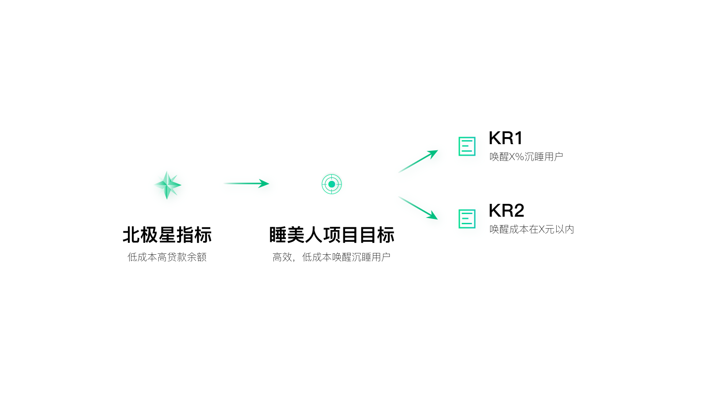
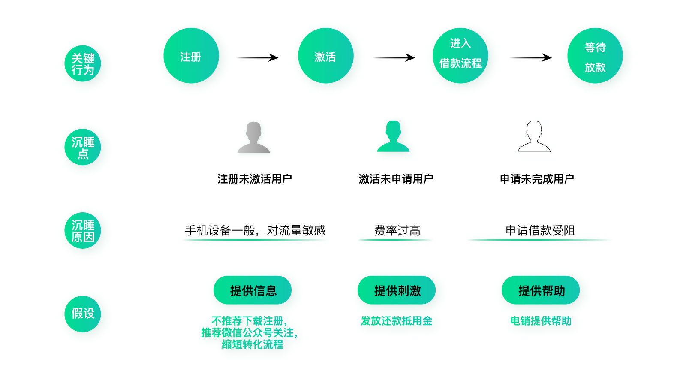

# 案例解析：唤醒沉睡用户（上）

前面我介绍了几个简单的使用精益闭环的例子，今天我来为你介绍一个比较复杂的例子：唤醒沉睡用户。

为什么我们要做唤醒沉睡用户这件事情呢？

还记得我说的负向二级洞察吗？前面三个例子是由正向二级洞察得到的机会，而唤醒沉睡用户是从负向二级洞察中得到的。如果你印象不深了，可以再回顾一下[第 22 讲](https://time.geekbang.org/column/article/98396)和[第 23 讲](https://time.geekbang.org/column/article/98511)的相关内容。

当时宜人贷已经有了亿级的注册用户，再想新增用户自然就很难了，毕竟中国的人口是有限的，其中有借款需求的人就更少了。况且大家都知道，最近几年获客成本越来越高，所以我们再继续付费做精准营销已经不是最合适的方式了。

那么在这种情况下，要如何进一步做增长呢？

我们找了不同职能的同事去了解增长机会点，最终从一位数据科学家口中得知（专家视角），在这上亿的注册用户里，真正在我们这里借款的只占很少一部分，大部分用户注册后并没有产生后续行为，成为了我们的沉睡用户。如果我们能适当唤醒这部分用户，哪怕只是很小的一部分，都可以用更小的成本带来更多的实际借款用户。

这个发现让我们感到十分振奋。但是可惜的是，公司当时并没有足够的资源深入地做这件事情，也尚未有人发起申请，所以我们**决定主动**找运营的同学合作，尝试用研究分析加实践的方式，唤醒沉睡用户。

由于之前我们并没有运营经验，也没有做过类似的事情，所以刚开始也不知道该从何入手。运营的同学之前采用的方式比较简单，就是在特定时间内群发短信，并且没有再后续跟进。我们希望能找到更好的方式。

这时候我想到，能不能用精益闭环的思路试试呢，说不定会有新的启发。于是，我们开始了这次探索。

## 围绕北极星指标明确项目 OKR

为此我们专门立了个项目——“睡美人项目”。首先，我们要做的是给这个项目明确目标。

需要注意的是，由于“唤醒沉睡用户”涉及到多个用户旅程节点，所以无法直接从用户增长地图上找到对应指标。但是，我们可以参考北极星指标给出适合项目的目标。

比如，当时的北极星指标是低成本高贷款余额，那么对应“唤醒沉睡用户”这个项目，项目目标自然就是“低成本、高效地唤醒沉睡用户”了。

OKR 的 O 有了，接下来要分解 KR。很明显，这里可以分出两个 KR，分别是：

- KR1，唤醒×% 沉睡用户；
- KR2，唤醒成本在×元以内。

这里的具体数值是通过和运营同学深入探讨得到的。他们会通过经验告诉我们，什么样的数字会让他们感觉效果一般，什么样的数字会让他们感觉惊喜。我们一般会选择让他们感到惊喜的数字作为目标。

关于 OKR 制度，当时的老板曾经提出过非常明确的要求：**一是要足够创新；二是要行业领先；三是对公司有价值。**这些要求令我受益匪浅。所以我们定目标，一定不会定容易实现的目标，而是要尽量定有挑战性的。

## 通过常识找到假设的思路

指标定下来，接着就要提出假设了。你可能会以为，要想提出正确的假设，一定要有非常扎实的运营基础、有专业的知识和技能才能提的出来。而实际上未必如此，**有的时候依据常识就可以提出假设。**这正是增长的魅力，它亦正亦邪，既可以遵循逻辑，也可以不按牌理出牌。只要能提升价值，可以无所不用其极。

就这个案例来说，我们提出的三大假设是：找到对的人，在对的时间，用对的方式来唤醒。

你看，这需要所谓专业的技能和经验吗？完全就是常识。所以不要畏惧你不熟悉的领域，很多情况下问题并没有那么复杂，只是我们习惯用专业的思路去想的很复杂而已。

现在我们针对这三大假设逐一进行分析。

## 找到对的人：高潜用户

首先，我们要找到“对”的人，如何找呢？还记得我们在[第 11 讲](https://time.geekbang.org/column/article/92909)中学过的吗，**围绕北极星指标把目标用户做个分类，通过对比，明确目标用户特征。**这里其实是类似的，只不过这里是以项目为单位，所以看项目指标，也就是“高效低成本唤醒沉睡用户”就可以了。

要想高效低成本唤醒沉睡用户，当然要去找容易被唤醒的用户了。越容易被唤醒，成本就越低。

什么样的用户更容易被唤醒呢？

我们主要看两点，一是用户资质，二是借款意愿。为什么要看用户资质呢？这和我们的业务属性有关系。对于借款产品来说，用户并不是有借款意愿就能成功，我们还需要审核用户的资质，资质过关了才能够获批额度。所以这和普通的电商产品类的转化是不一样的。

至于借款意愿，主要是看用户行为，比如曾经操作到哪一步了，是否离终点已经很近了。还有就是最近活跃的时间，离现在越近，越容易被唤醒。

所以，可以**根据资质、关键行为、最近活跃时间这三个维度，对用户进行分层**。这和 RFM 模型是类似的。

### 1. 用户资质

如何明确用户资质呢？可以先把用户分成两类，一类是成功借款用户，一类是未成功借款用户。分析这两类人群的画像对比，得到一些规律（以下内容非真实信息，仅做示例）。

这里面涉及到很多数据分析的工作，而我们团队的同学之前并没有数据分析的经验，为此还自学了 SQL。其实 SQL 并不难学，一两周足以了。说这些其实是想分享给你一个观点：**做增长并不限定固定的职能或技能，而是要以价值为导向不断拓宽自己的各项能力。增长的能力模型永无边界。**

找到了这些特征后，我们可以根据用户是否符合这些特征以及符合的程度，把他们的资质做个类别划分。比如资质高、中、低。

### 2. 关键行为

说完资质，我们再来看用户关键行为。还记得我在第 19 讲中提到过的用户旅程吗？在这里，我们列出用户沉睡的关键旅程，然后找到其中的沉睡点，分别是：注册未激活、激活未申请、申请未完成。

如果排优先级的话，应该是注册未激活＜激活未申请＜申请未完成。因为用户实际走过的流程越多，说明借款意愿越强，也就越容易被唤醒。

正因为这样，之前运营的同学已经对容易被唤醒的用户进行了一些工作，而注册未激活却没有人做过，因为这确实是块难啃的骨头。但是换个角度看，注册未激活的用户量是最大的，也是最有空间的，所以我们迎接挑战，把它也作为这次工作的重点。

### 3. 最近活跃时间

接下来我们再看最近活跃时间，按照用户最后活跃时间距离当前天数，分成短、中、长三类。

## 用户分层

明确分类的维度、优先级，以及每个维度下的细分变量及优先级，就可以对用户进行分层了。由于这里有 3 个分层维度，每个分层维度下又有 3 个细分变量，所以可以把用户分为 3×3×3=27 类。

很明显这个分类太多了。还记得我以前说过的**抓大放小、四两拨千斤**吗？这里我们可以只抓最重要的，也就是用户资质高、最近活跃过的用户。然后在这些用户里，再分成注册未激活、激活未申请、申请未完成三类就可以了。

到这里，我们就已经找出了高潜用户，并明确了他们的分类。在下一讲，我们继续探讨如何找到正确的唤醒时间以及正确的唤醒方式。

你有没有发现，这个项目并不是一个简单的执行工作，里面需要做大量的分析。而这里面的分析其实已经不限于三级了，而是涉及到前面讲的很多一级、二级方面的东西，比如用户分类、对比，用户旅程等。

所以，**一级、二级、三级并不是绝对的，而是要灵活运用。**就这个项目来说，难度要比前面两讲介绍的界面优化的项目复杂很多，需要定义方向、策略的能力，所以即便这是一个三级项目，也需要用到一级、二级方面的知识点和能力。

## 思考题

你可以仔细总结下这个案例，看能不能用前面讲过的方法自己分析一下类似的工作？

# 案例解析：唤醒沉睡用户（下）

今天我们接上一讲内容，继续介绍唤醒沉睡用户的案例。

上一讲中，我们提出了三大假设：找到“对的人”、在“对的时间”、用“正确的方式”唤醒用户。并且明确了“对的人”，也就是高潜用户及分类。今天我们继续分析对的方式以及对的时间。

### 找到对的方式：最佳唤醒方式

如何找到最佳唤醒方式呢？还记得用户增长地图里根据洞察提出机会的方式吗？这里也是类似的。

我们之前把用户分成了三类，分别是注册未激活用户、激活未申请用户、申请未完成用户。这三类也刚好代表了三个重要的用户旅程节点。

围绕这三个旅程节点，我们可以结合数据分析及用户访谈，试图洞察出用户沉睡的原因，并提出唤醒方式。

比如对于注册未激活用户，他们在 H5 营销落地页面上注册了以后，发现还要下载 App，可能就望而却步了。因为一些用户手机设备一般，对流量敏感，不想额外耗费太多流量。对于这样的用户，可以推荐用户关注微信公众号，在公众号上也可以实现借款或引导下载 App。

而对于激活未申请用户，他们虽然下载了 App，但却没有进一步的行为，是因为一些用户没找到合适的借款产品或觉得费率太高。针对这些用户，可以提供更详细的解释说明并尝试发放还款抵用金，或推荐用户一些优惠活动等。

最后是申请未完成用户，他们已经填写了部分信息，但没有走完全部借款流程，很可能是在借款的过程中受到了阻碍，或不符合当前产品的申请条件。如果这个时候有客服提供帮助，就很可能促成转化。当然如果能针对用户常见的问题适当改进界面说明及体验，也会有一定成果。

所以，**最佳的唤醒方式，就是针对不同类的人群，提供最适合的方式**。

### 找到对的时间：最佳唤醒时间

找到对的人和对的方式后，如何找到对的唤醒时间呢？其实这相当于对“时间”这个大变量维度做小变量分解，所以我们还是**遵循分解从大到小的原则**。

首先以年和周为单位，看需求旺盛期。因为借款是有旺季和淡季之分的，每年 12 月到春节前是贷款旺季。另外，工作日比节假日贷款需求更高。这些结论一方面可以通过数据统计得出，另一方面也可以根据常识得出。

接下来以天为单位，看转化窗口期。也就是看用户有实际行为后的第几天最有可能被唤醒。

我们分析历史数据并做成图表，看用户最后使用产品的第一天、第二天……到第 N 天的自然转化情况（图片仅做示意，非真实数据）。找到曲线中的“转折点”，也就是没有按照自然规律直线下降的时间节点，尽量把握住这个时间节点唤醒用户。

当然，这里不能盲目地观察数据，还要多和内部同事交流，看某一天转化提升真的是因为自然转化，还是其他团队的同学做了什么事情导致的。

最后，是以小时为单位看借款活跃期。通过数据可以看到，从上午十点到晚九点之前是活跃时间。

这样我们就大致了解了唤醒时间这个“大变量”下面的“小变量”。

## 通过分解层层细分变量

前面我们已经大致梳理了三大假设，即对的人、对的事、对的时间，以及对应的分解思路。

然而这些只是最基本的，我们还需要在此基础上**分解或平行发散更多必要的内容**，直到完全可以落地执行。

比如，“提供刺激”表面上已经是在三级假设的基础上做的分解了，但很明显它还可以再进一步分解。因为“提供刺激”这个思路又能衍生出很多种方式，可以提供实际的优惠、也可以用通知的方式鼓励用户回来等等。

再比如“对的人”这里，除了前面分析的用户类型外，还可以再考虑用户来源、用户属性等等，建议越多越好。因为变量越多，做实验就越有可能找到效果好的。100 个选择总比 10 个选择更好。当然在后面实际测试时，我们还是会从中做筛选。

这里我也忍不住想补充上一讲说的那个问题：一级、二级、三级只是个不断向下分解的思路，它们的位置不是绝对的。如果一个三级项目够复杂，那可能不仅用到一级、二级的思路，还能再向下做很多级分解。**当你面临一个问题不知道该如何下手时，就可以按照这个思路不断分解到最小颗粒度，直到解决问题为止。**

## 正交试验大幅提升实验效率

现在我们要进行到实验环节了，但是有个很大的问题，就是这么多的变量组合，这要实验多少次才能穷尽啊？

这和前面的优化流程或者界面的实验难度，可完全不是一个量级的。我们最终的目的是从所有种可能中找出一种最佳组合。

这里为你介绍正交试验的思路，它可以大幅减少实验次数。正交试验设计也叫 DOE（Design of Experiment），它是由罗纳德·费雪（Sir Ronald Aylmer Fisher）在 20 世纪初提出的，最早用于工业设计，后来由日本统计学家田口玄一发扬光大。

如图，假设现在有 3 个维度，每个维度下有 3 个细分变量，那我们一共需要实验 3×3×3=27 次。但是统计学家发现，其实并不需要进行完所有的实验才能找到效果最好的组合，只要选择其中有代表性的变量组合进行实验就够了。因为通过过往的统计经验，不具代表性的变量组合效果并不好，可以直接忽略。

图中绿色的节点就是有代表性的点，它们的特征是均匀分散、齐整可比。在网上可以找到正交表，通过正交表就能够查到具有代表性的点，如果不明白可以询问公司里的数据分析人员。通过正交试验，原来需要测试 27 次，现在只要测 9 次就可以了。这大大提升了实验效率。

最终，我们仅做了 9 次实验，就从若干变量组合中找到了一组最佳变量组合。使用这组变量组合唤醒用户，唤醒率比之前提升 1 倍，唤醒成本比之前降低 59%，试验次数比之前减少了 89%。

当然，如果有条件的话，也可以用机器学习的方式分析最佳变量组合。

## 精益闭环思路唤醒沉睡用户

在项目一开始的时候，我就问项目成员，我们是否可以用精益闭环的思路来做这个项目。当时我心里其实也没有底，毕竟我们之前从来没接触过正式的运营以及数据分析工作，也没有用精益闭环的思路处理过这么复杂的问题。但大家最终还是愿意抱着试一试的心态去探索，没想到成功地帮助我们解决了问题，并取得了用户数量快速增长的效果。

这充分说明了**精益闭环的通用性**，它可以解决各种职能的问题；也说明了正确的思路不亚于传统的专业、技能、经验。

**也许在不远的将来，不会再有这么多职能的区分**，大家都能够用类似的思想去做事情。职能变得不再重要，因为技术和数据越来越受到重视，它们可以替代大量的简单重复性工作。剩下的是能够提出策略的人以及少量的执行者。

## 思考题

继续总结这个案例，看你是否能通过它深入理解精益闭环的思路，并应用到自己现在的工作中？

