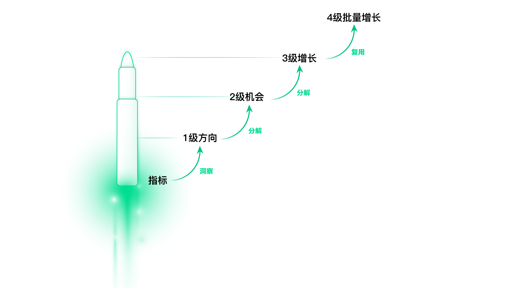
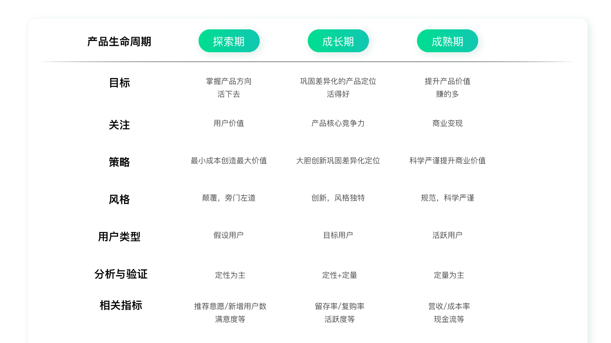
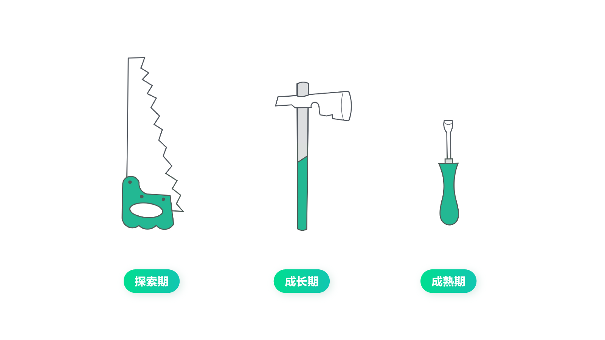
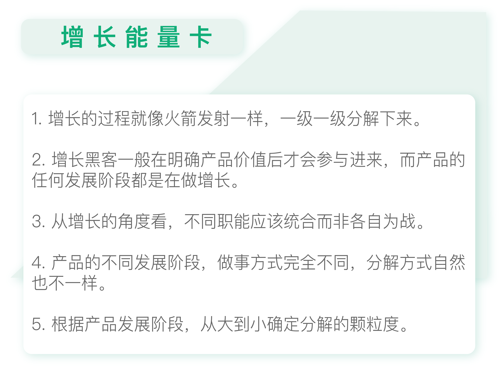

# 没有分解，就无缘增长

通过前几讲的案例，我想你已经对精益闭环的理念和实战有较深的理解了。

精益闭环里的四步：指标、假设、分解、实验，其实和前面的内容息息相关。比如“指标”对应的是北极星指标分解下来的指标，北极星指标是我们第一模块的内容；“假设”要通过洞察提出，这在第二模块、第三模块花了大量的篇幅重点讲解。最后的“实验”我们将在下一个模块重点学习。

很显然，在第四模块里，“分解”是我们非常重要的内容。你发现这个有趣的规律了吗？

## 分解的宏观意义

分解就**好像火箭发射一样，一级一级地解体**。

最开始是指标，然后围绕指标、通过洞察得到一级假设（一级方向）；再用同样的指标、洞察、假设的思路分解一级假设得到二级假设（二级机会）；然后再用指标、洞察、假设、分解、实验的思路，分解二级假设落地三级增长；接下来沉淀实验的成果，不断复用、延展，带来四级批量增长。

可以说**整个增长过程的核心，就是分解**。确定目标，也就是未来想要达成的方向，然后从一级分解到二级、再到三级、再到四级……直至增长落地并不断持续下去。这就是宏观的分解。

## 分解的微观意义

关于一级和二级的分解，我们前面已经阐述过很多了，这里就不再赘述了。现在我们重点讲讲三级的分解。

很多人问我，精益闭环里的分解具体应该怎么分，如何决定分解的颗粒度。其实这是一个很大的话题。就前面几个案例，你可以发现分解的程度都不一样，有的分的比较粗，有的分的非常细，那么这是由什么决定的呢？

### 产品生命周期

想要知道这个答案，我们就不得不从产品生命周期说起了。假设，我们把产品的成长过程分为四个阶段：探索期、成长期、成熟期、二次探索期。

- 探索期：从 0 到 1 摸索方向的阶段；
- 成长期：方向稳定后的快速扩张阶段；
- 成熟期：用户体量十分庞大、增长放缓阶段；
- 二次探索期：成熟期之后的新的方向探索，好继续带来指数级的增长。

这和增长黑客倡导的企业发展要经历的四个阶段：PSF、PMF、CPF、EMF 本质上是一样的。在这里我简单地解释一下。

PSF（Problem-Solution Fit）阶段：问题和解决方案阶段。这是一个从 0 到 1 的提出价值假设的阶段。在这个阶段，更多的是发现市场上的问题，然后做方案去解决问题，看与市场需求是否匹配。这相当于刚才说的探索期。

PMF（Product-Market Fit）阶段：产品和市场匹配阶段。这是一个从 1 到 N 的提出增长假设的阶段。在这个阶段，需要吸引更多的用户进来，来验证 PSF 阶段的想法是否具有更大的市场空间。这相当于成长期。

CPF（Channel-Product Fit）阶段：渠道与产品匹配阶段。通过精细化运营、数据分析、数据驱动调整各种营销渠道、营销方式和产品之间的适配性，大幅提升增长效率。这相当于成熟期。

EMF（Enterprise-Market Fit）阶段：企业与市场匹配阶段。思考在下一个阶段整个公司如何和市场进行下一次匹配。也就是如何通过创新寻找下一个增长点，这可能需要 CEO 进行各种各种的战略布局。这相当于二次探索期。

还记得我之前提过的 Karmaloop 的案例吗？创始人格雷格解决的就是探索期和成长期的问题，之后的 CMO 德鲁解决的则是成熟期的问题。**一般来说，增长黑客要到 PMF 阶段以后才会参与进来，他们认为好的产品才是增长的根本。**

所以，千万不要把增长黑客和增长混淆起来，很多人其实是分不清楚这两者的，以为增长 = 增长黑客 = 营销裂变，或者以为增长就是各种“术”的操作，这是非常狭隘的理解。

企业发展要经历的这四个阶段都属于增长的范畴，因为**增长不仅仅是数字的提升**，增长代表了价值。

另外我们也可以发现，这四个阶段和产品生命周期的四个阶段本质上并无区别，是完全可以一一对应上的。那为什么行业内还会出现各种各样的概念呢？这是因为产品生命周期的概念是**从产品的角度**提出的，而企业发展要经历的那套字母阶段是增长黑客**从营销的角度**提出的。**角度不同，概念自然也就不同了。**

我在写《破茧成蝶 2》的时候就发现，**产品和设计上的各种概念其实完全可以统合起来**，“以用户为中心”和“以产品为中心”其实没有任何区别。因为你可以理解为“做产品即做用户”，做设计本质上也是服务用户。

而现在，**产品和运营的概念也一样可以统合起来。**因为无论是做产品，还是做营销，本质都是在做增长，即提升产品价值。所以无论是产品、运营、设计、技术，还是其它职位，大家都是在为同样的目标努力，不一定非要从自己职能的专业角度出发创造“专属”概念。

很多人问我做增长具体需要学什么课程，其实你不管学习什么课程，都少不了各种概念和名词，因为目前大家还会**本能的受限于各种职能角度**。如果维度不够高，难免陷入到眼花缭乱的概念里。但是如果你理解了本质的东西，再看各种概念，就很容易融会贯通了。藏在各种概念外壳中的真理，往往无比简单而纯粹。

**增长本身就是要打通职能角度，综合地看问题。**它既不是产品、也不是运营，我们在学习时一定要注意打破“本能”的思维限制。

### 确定分解的颗粒度

既然产品的发展阶段可以统合起来，那这里我们就统一用探索期、成长期、成熟期、二次探索期来解释吧。

为什么要分成四个阶段呢？因为**不同阶段的目的不同、关注点不同，对应的策略、工作方式、相关指标等都是不一样的。**比如探索期需要颠覆性创新，成长期需要大胆创新，成熟期需要规范、科学严谨。这就解释了为什么 Karmaloop 的创始人格雷格能创办一家有趣的公司，却无法带领它走向辉煌。创新不能墨守成规，但运营可是需要精细化操作的。

至于分解，也是类似的：探索期的分解是要保留最核心的功能及特质，看它是否能跑通，是否有人愿意使用，如果不对就立刻换方向再继续尝试；成长期的分解是在此基础上不断增加新的功能模块，让它日臻完善；而成熟期的分解是要精雕细作。就像前面说的 H5 营销落地页一样，小到颜色、字号、图标样式等，我们都在不断测试。

举个简单的例子，你就明白了。假设你有一片森林，里面有数万棵树木，你需要选择其中一棵把它雕琢成理想的形象。可是这么多树木应该选哪一棵呢？一开始你需要一把大锯子，快速砍开看，如果发现不是自己想要的，就立刻换下一棵树。等你找到了理想的树木后，你需要一把斧子，快速把它劈成你想要的大体形状。接下来你需要一把小锉刀精雕细琢，直至把它雕琢成一件艺术品。

如果用错了分解的工具会怎样呢？想象一下，当最开始挑选木材时，如果你使用的是小锉刀，那么当别人已经试验过无数方向，积累了无数宝贵经验时，你还在原地踏步。但如果在该用小锉刀的时候，你使用了一把大斧子，那就会立刻前功尽弃。

这就不难解释为什么我们一开始优化营销落地页总是不能成功了，因为我们用错了工具，一上来就大刀阔斧的修改，但其实现在需要的是一把小锉刀精雕细琢。

如果你不能确定当前的阶段以及应该如何分解，那就**“从大到小”去探索，**这样是效率最高的。也就是先用锯子，效果不好换成斧子，效果还不好就换成小锉刀。这样就能让我们快速找到合适的分解颗粒度，从而落地增长。

## 思考题

对于你现在正在负责的产品，你认为它处于什么阶段，应该如何分解？

