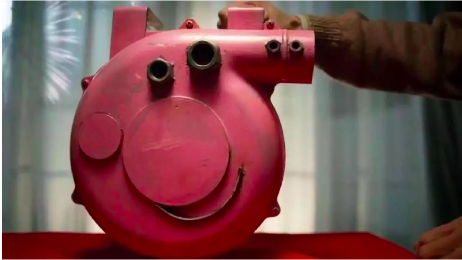
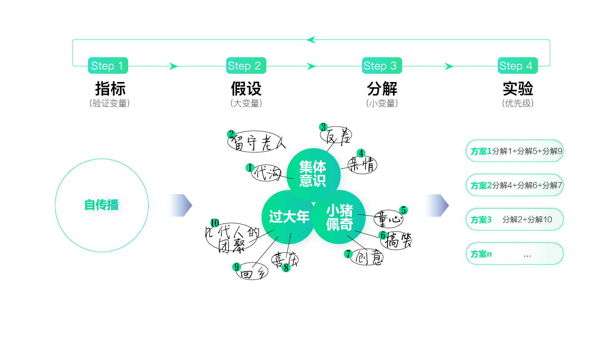
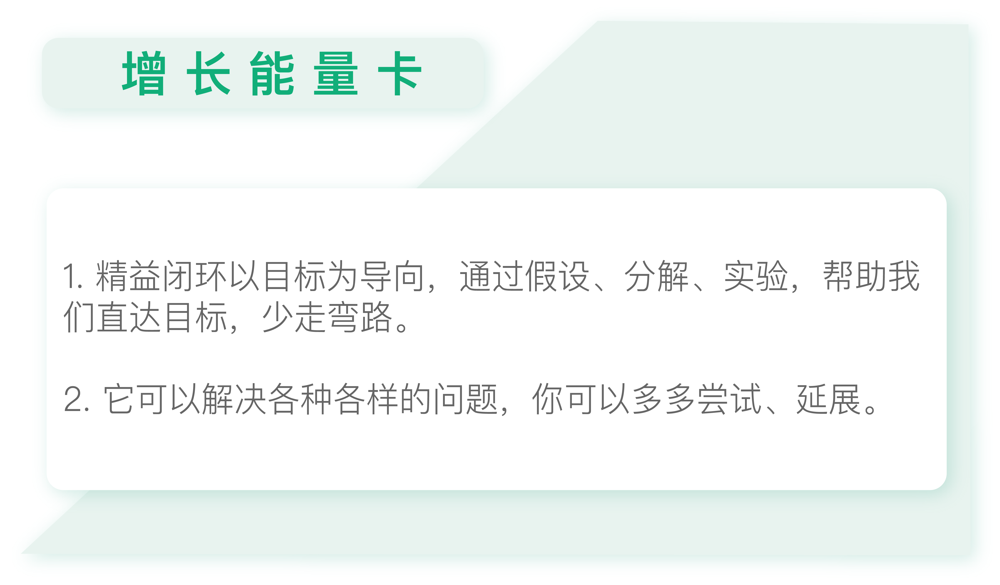

# 三级落地：无限场景应用

前面我们学习了精益闭环的思路，也讲解了不少案例。其实精益闭环的思路可以应用在各种事项上，今天我们就来讲解一些有意思的延伸案例。

## 如果让你构思“啥是佩奇”

不仅产品设计、需求文档可以用到精益闭环的思路，创意类的工作也同样适用。你还记得年初刷爆朋友圈的短片“啥是佩奇”吗？

这条不到 6 分钟的短片在发布后的短短几个小时就成星火燎原之势，像病毒一样蔓延了全网，仅在微博就达到了两千多万次播放。如果你还没看过的话，可以上网搜索一下。

当时我就在想，这导演怎么这么有创意呢？这么有意思的短片是怎么构思出来的呢？同时，我想知道如果用精益闭环的思路能帮助我构思类似的创意吗？答案是可以的。

### 指标

首先，我们来看指标。制作这个短片是为了宣传电影《小猪佩奇过大年》。所以肯定是看的人越多越好。从一些新闻中，我得知这个短片的制作经费非常有限，所以不可能请明星宣传或花钱投广告。

那么这个短片的指标很明显，就是要达到自传播（网络中称为“自来水”）的效果，也就是通过大家的口口传播、自发宣传，让更多人看到。

在同样的推广成本下，受众的自发传播可以让我们获得远高于成本本身能达到的推广效果。在有限的制作、推广经费的限制下， 整个视频能借助的平台和曝光度都不会很多，但是如果形成自发传播，就可以让视频的平台数量和曝光度呈指数型上涨。

### 假设

接下来是假设。我们先看一下宣传主体——《小猪佩奇过大年》，因为这个短片就是为了宣传《小猪佩奇过大年》，所以短片里必须要体现出“小猪佩奇”以及“过大年”的元素。

但是，如何能让更多人愿意口口相传呢？也就是说如何打动大众呢？

这时我们就不得不引入“集体意识”这个概念。集体意识是社会成员全体在长久的日常的社会交往活动中，通过协作、沟通、相互作用而形成的。简单来说，就是能得到大众认同的，约定俗成的，且代代相传的情感或认知。利用好集体意识，更容易引起大众的共鸣。

所以，我们有了三大假设，分别是“过大年”“小猪佩奇”“集体意识”。

### 分解

现在要分解了，围绕每一个假设，我们都能联想到很多相关元素。

过年是我们的传统风俗，围绕“过大年”，我们可以联想到“几代人的团聚”“喜庆”“回乡”“买票难”等等。而围绕“小猪佩奇”，看到过这个动画的人可以联想到“童心”“搞笑”“创意”等等。但并不是所有人都看过小猪佩奇。所以，这里需要倚重“过大年”的假设。“集体意识”里面有很多东西，这里可以重点寻找和“过大年”“小猪佩奇”有交集的部分，另外也要尽量靠近社会热点，这样才能让大众关注。

你可以试着自己联想一下，联合三点假设，这样是不是就很容易联想到了“留守老人”“代沟”“反差”“亲情”等关键点了？这些都是可以打动人心、引起社会关注的内容。

在这个过程中，你可以给每条分解都标个序号，通过各种组合，得到几个不同的序列组作为备选方案。看，这样就可以出多个创意方案了，是不是很有意思？

## 新手参加游戏比赛如何胜出

精益闭环的思路不仅适用于撰写需求文档、优化产品设计方案、挖掘创意，还适合于解决特定问题，比如规划项目。

我有个朋友参加了一个名为“48 小时开发游戏”的活动，虽然她们没有取得最后的胜利，但是还是有很大的收获。她们认为最后失败的原因是游戏设计的太复杂了，优秀的获胜作品都非常非常得简单。

如果用精益闭环的思路你会如何规划这个项目呢？

### 指标

首先，我们来看北极星指标，大家既然来参加这个比赛，肯定是希望取得胜利。那么如何取得胜利呢？当然是要先搞清楚比赛规则。

这个比赛的主题是“家”，每个小组需要围绕主题，用 48 小时进行设计及开发，之后会给每个小组 1 分钟的时间进行展示，然后结合现场反响及评委的意见给出最终的结果。

很明显，这 1 分钟的展示至关重要。你需要在 1 分钟内展示完整个游戏，还要让人留下深刻的印象。要满足这两个限制条件，这个游戏就不能太过复杂，并且需要配合精彩有感染力的演讲。

而朋友那个小组的游戏光是讲思路就得至少花 5 分钟，还画了一百多组家具场景来配合，最后的结果可想而知。

### 假设

接下来我们再看假设。怎么做才能在 1 分钟内让人完全理解这个游戏，并印象深刻呢？我想到了三个关键词：思路简单、有创意、好实现。

这样就明确了工作方式：把更多的时间花在思考创意上，而不是用在设计和开发上。

### 分解

现在我们再来分解假设，围绕“思路简单”，可以发散出各种各样的想法，比如“包饺子”“找钥匙”“逃离”“思乡”“相遇”……

然后再看怎么能让这些想法变得非常有创意。比如，有个小组用中国古文化诠释“相遇”的意义，这个思路让人眼前一亮。他们的游戏也非常简单，就是两个人各自控制手柄，在一个球体上随机行走，走过的地方就会长出小草；当二人相遇时，就会在那个位置开出一朵花。虽然听起来十分简单，但是正因为简单才好记忆，才能给人留下深刻的印象。

最后，是“好实现”，前面大家一定会讨论很多的创意，最后衡量取舍的标准，就是看哪个容易实现，毕竟只有不到 48 小时的时间。

### 实验

完成游戏开发后的演讲，我认为就相当于实验环节了。在这个过程中可以清晰地看到在场人员的反响，然后反思哪些地方做得好，哪些地方做得不够，需要以后再继续改进。

如果当初可以用这个思路去规划工作的话，我想朋友就不会在比赛中失利了。其实很多人都是如此，在接到一个任务后就直接考虑该如何执行，最后不仅费时费力，效果还不理想。不如先花一点时间进行方向定位、任务拆解和时间规划，这样更容易取得事半功倍的效果。

## 如何判断自己的工作是有价值的

看到这里你有没有联想到，在实际工作中大家也经常会遇到类似的情况呢？大多数人都是被动完成领导安排的工作，或是想当然地做一些自认为很有价值的工作，任劳任怨、兢兢业业，最后却并没有得到领导的重视或好评，这是为什么呢？

因为工作分很多种，有对公司重要的，也有不重要的，我之前经常强调“四两拨千斤”，很可能你把“千斤”扛住了，却和最关键的“四两”无缘。看起来干的很多，但却并不是非常有价值。

那么如何判断自己的工作是对公司、对老板有价值的呢？这确实不太容易直接量化。但是我有个朋友提出了一个很好的假设：**让你的工作成为老板年终汇报的一页 PPT**。

你的工作能否成为老板年终汇报的一页 PPT 呢？

如果不能，那就要好好反思一下了。毕竟老板的目标就是北极星指标，如果你做的所有工作都对提升北极星指标毫无帮助，那自然就不会出现在老板的视野里。所以，这确实是一个很好的假设。

接下来再进行具体事项的细分：比如认真思考一下老板的目标是什么，然后想想他以往会汇报哪些内容，看看自己未来可以在哪方面发力去帮助老板达成目标，具体要做什么等等。

这样做，我们就离想达成的目标不远了。

到这里，精益闭环的部分就完全讲完了。在下一讲我们会进入一个新的模块。希望你可以活学活用，尝试在生活中用精益闭环的思路解决问题，产生不一样的结果。

## 思考题

今天的思考题是，你最近有遇到什么困难的任务或选择吗？尝试用精益闭环的思路，看看是否能够更好地解决？

