# 手把手教你设计一次成功的实验（上）

今天我们进入了第五个模块：小小实验让增长稳稳落地。

这一讲我们来学习如何设计并执行一次成功的实验，由于内容较多，会分为上下两讲。

想做好一个实验，需要注意以下几点，**分别是分解实验变量、多维度排列优先级、可视化时间安排、量化结果并复盘。**为什么这几点这么重要呢？我想通过一个“题外”的故事来为你解释。

今天我看到了一篇文章，讲的是一个曾经很普通的女生如何通过正确的方法，用短短一个假期的时间从班里的“差生”逆袭成优等生，并陆续考上了清华、哈佛的故事。带着满满的好奇心，我阅读完了她的学习方法。

读完之后，我发现其实她的方法和精益闭环如出一辙：先定大目标，然后把目标分解成一个个关键事项，结合时间轴（相当于优先级）列出完整计划，再把计划贴在家里明显的位置提醒自己。就这样，仅仅经过一个暑假，她就脱胎换骨，成绩由原来的中下游变成了前几名。大家都对她的变化感到十分震惊。

她是这样解释的：成功不仅需要清晰的目标，还要把目标化成一个个可量化、可实现的阶段性“待办事项”。不仅知道要什么，还要知道怎么做，时刻关注自己的表现，时刻看到自己的进步，自然就不再迷茫。

另外，通过可视化的方式把时间规划和待办事项结合到一起，让自己既有清晰的目标和具体事项安排，又有明确的时间。

最后，把这些内容写在卧室的白板上，抬头就能看到；或者设成手机屏保，每次用手机都能看到。这是源自**心理学上的“曝光效应”**。也就是多看目标，多提醒自己目标的存在，越看就越想实现，不断刺激我们的情绪和斗志。

这个思路让我感触很深，最初我们的用户增长设计团队也只是一个非常普通的支持团队，工作质量一般、效率也不高。但是使用精益闭环的思路后，我们用很短的时间就创造了一个又一个奇迹，让领导刮目相看，与此同时我们也没有增加很多额外的工作量。

也许你的工作一开始就顺风顺水，这时你很可能不会去思考什么问题，只以为一切都是天时地利人和。但当你开始遇到问题、解决问题，并回头分析自己的行为时，你才有可能明白：好的方法真的是可以让普通人快速逆袭的。

下面我就逐一介绍一下实验的要点。

## 分解实验变量

首先是分解实验变量，这个在前面已经讲了不少了。常见的有**单变量测试和多变量测试**。

单变量测试的应用很好理解，比如说我们这次单独测试按钮颜色，其他的都不改变。那么按钮颜色就是单独的测试变量。即便你要测无数种颜色，这也是一个单变量测试。

多变量测试就是同时测试多种变量，像我在第 31 讲里提到的“唤醒沉睡用户”的案例，就是多变量测试。

如果还拿优化按钮样式来举例，那么通过分解，你可以考虑优化按钮颜色、位置、形状。如果优化其中一种，就是单变量测试；如果同时优化两种或三种，就是多变量测试。

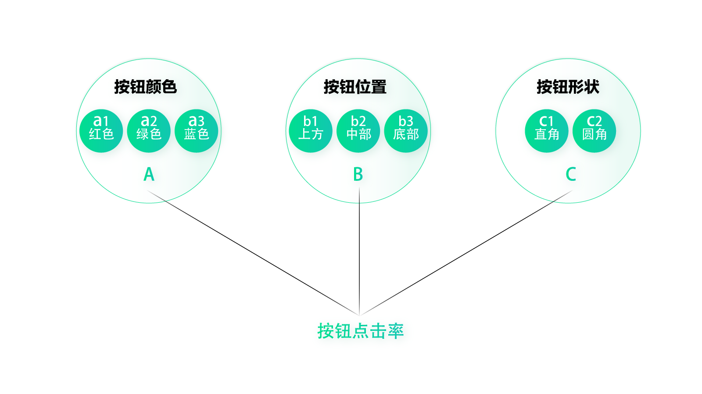

在每个变量下面，我们还需要再细分测试变量。比如按钮颜色，可以分解出 a1 红色；a2 绿色；a3 蓝色……按钮位置，可以分解出 b1 上方；b2 中部；b3 底部……按钮形状，可以分解出 c1 直角；c2 圆角……

假如我们同时选择按钮颜色和位置这两个变量做测试，那么就需要交叉所有的小变量组合，其中有：a1b1；a1b2；a1b3；a2b1；a2b2；a2b3；a3b1；a3b2；a3b3。一共 9 种组合。

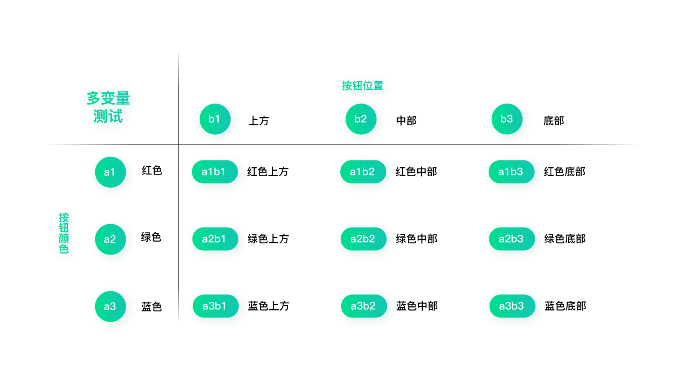

当然这里只是个示例，给你展示如何分解变量做测试。但如果真的是优化界面，我是不建议用这种机械的方式来测试的。**很多公司或个人太过推崇实验文化****，****而越来越不愿意动脑去思考。**实际上，实验只能从已知的组合中挑出最好的，却不能帮助我们探索未知。所以，我们还是尽量要用洞察 + 验证的方式来做增长。

还记得我在第 28 讲举过的营销落地页的例子吗？当时只是讲了最基础的设计思路，优化了界面风格及内容。后来我们一直在持续优化，提出了更多的假设并进行分解。我想这也是很多人关心的问题：**如何能源源不断地提出假设和分解？**我们是怎么做的呢？

首先，我们进行了一轮头脑风暴，模拟用户看到这个页面的场景（前提是我们之前已经做了深入的用户调研），思考他希望看到什么、他想到了什么、希望听到什么、可能会说些什么……然后提炼出用户痛点和用户诉求。

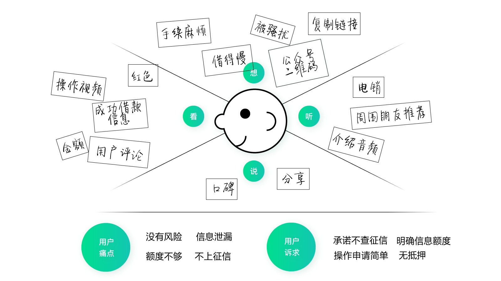

接下来我们把用户诉求提炼成几个典型的分类，这些分类就是三级假设；再把其它内容分别摆放进对应的分类位置里，这些内容就是每个假设下面分解出来的具体事项。

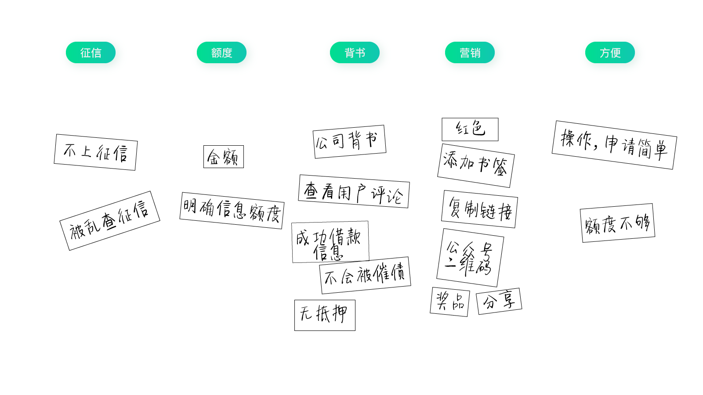

如果是传统的设计思路，可能会根据实现难度排列优先级，然后全部优化后进行开发。但在这里，我们需要先经历一轮又一轮的筛选机制。

## 多维度排列优先级

首先，是看**指标**，即这些内容是否可以提升指标；如果比较确定，则保留进测试计划；如果认为不能（比如根据过往实验经验）则删除。

其次，是看**提升指标的可能性**，可能性越大的排在前面，可能性小的排在后面。

再次，是秉持“**从大到小**”的思路，先做大优化，再做小细节优化。

最后，是看**实现难度**。对于 H5 页面来说，这项几乎可以忽略不计。

**按照这几个维度去筛选并排列优先级，并标出序号**，比如 a1、a2、a3……b1、b2、b3……

当然对于大神来说，也许并不需要这么麻烦，他可以很快地根据前期洞察想到提升指标的假设。但如果是一群普通人打增长持久战，那就需要这种**成体系的方法**了。

结合这个案例，我们可以使用单变量测试的方式，这样有助于我们了解到底什么情况下能够提升指标，什么情况下不能。比如 a1 代表“查看用户评论”，那就可以做个 AB 测试，A 版本可查看用户评论，B 版本保持不变。这样我们就可以明确“查看用户评论”的功能是否能够提升转化。

这引出了两个新的问题：一个问题是做 AB 测试应该切多少量；另一个问题是什么情况下用单变量测试，什么情况下用多变量测试。

为了谨慎，一**般我们不会五五分做 AB 测试，而是切出一个较小的渠道，或较小的量级来进行测试，如果实验效果不错再切出更多的流量测试**。比如，可以先保持 90% 的流量不变，剩下的 10% 流量里各切 5% 进行 AB 测试。当然也得看总量，一般来说 AB 测试要保证每个样本量上千。如果想要更严谨的话，可以进行置信区间的计算，这个我们在下一讲会具体介绍。

至于什么情况用单变量测试，什么情况用多变量测试，我认为也是要综合来看。如果**变量之间有强烈的关联，那么就需要多变量测试。**比如唤醒沉睡用户的案例，对什么样的人在什么样的时间用什么样的方式去唤醒，很明显这些大变量之间有极强的关联性，是无法独立测试的。另外就是看产品发展阶段，**越到成熟期越推荐单变量测试，**因为我们需要精细化的考量独立因素对最终指标的影响。

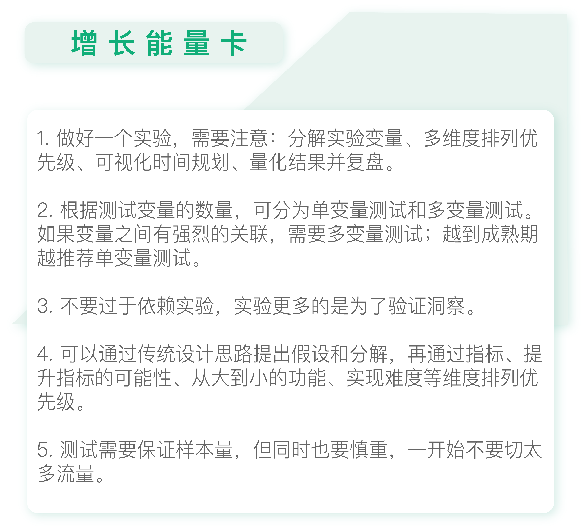

## 思考题

你可以尝试做一个实验计划，分解出待测试的事项并排列优先级。

# 手把手教你设计一次成功的实验（下）

今天我们接上一讲内容，继续学习如何做一次成功的实验。

以营销落地页优化为例，上一讲我们已经确定了待测试的事项，并排列好优先级，现在我们就需要制定具体的时间计划了。

## 可视化时间安排

**可视化时间安排，是为了让你可以更直观地接收时间计划。**没有时间计划，一切的安排都是空谈。最好能按照下表，制定一个详尽的实验计划表。里面包含了具体时间、实验目的、实验假设、设计内容、实验结果及实验结论。

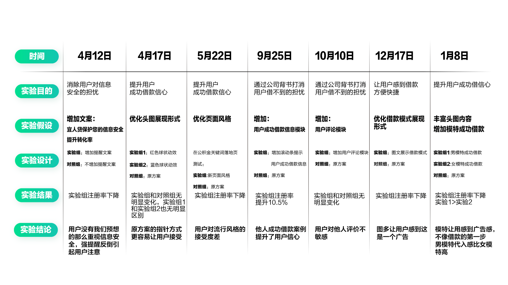

当然，你需要让所有相关成员都能看到这个表，对近期的实验计划了然于心。如果能把它贴在白板上，或是大家都能看到的最显眼的位置就更好了。这样可以提醒大家按计划完成工作，并及时了解实验进度及结果。

## 量化结果并复盘

每一次实验的结果，我们都需要把它记录下来并进行分析。不过，你**表面上看到的实验结果，可未必是可靠的。**

### 别再被 AB 测试结果误导

举个例子，当你抛一次硬币的时候，它可能是正面朝上；你抛两次或者三次，可能它还是正面朝上。但是你能说正面朝上的概率是 100% 吗？肯定不能。当你抛到一定次数时，你会发现正面朝上的概率基本稳定在 50% 左右。所以，**做实验必须保持一定的量级，否则结果不具有代表性。**

另外，**做实验需要考虑时间周期。**比如一个大型的首页改版，一般要看一个月以上的数据，因为一开始用户会感觉不习惯，经过一段时间才能养成新的习惯。所以不能看几天数据就盲目判断结果。

即使一个小型的实验，也需要看一段时间的数据，待数据基本保持稳定了再下论断。

我们再来看下面这样一个测试数据：A 版本 UV1000，注册数 30，注册转化率 3%；B 版本 UV1020，注册数 41，注册转化率 4.01%。先不考虑时间的问题，你能判断 B 版本比 A 版本效果更好吗？

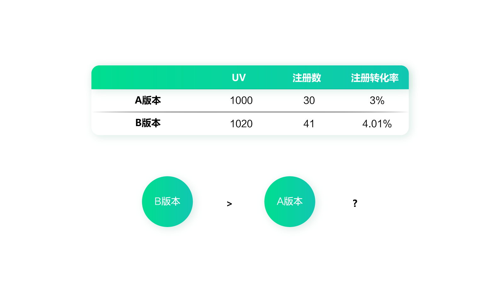

通过前面的分析，我们知道无法确定 B 版本比 A 版本好，因为不知道样本量是否足够。那么到底该如何判断实验结果呢？这就要引入置信区间的概念了。

### 置信区间：评估 A/B 测试结果的利器

置信区间是一个统计学名词，它以区间形式对产生这个样本的总体的参数分布中的某一个未知参数值给出估计。相对于点估计（用一个样本统计量来估计参数值）而言，置信区间还包含了估计的精确度信息。

这个概念可能有些难懂，不过用在 A/B 测试里，你可以简单地理解成：置信区间是用来表示实验的误差范围的。

要知道，早期科学实验中科学家们是不承认实验有误差的。因为他们认为所有的测量都必须是精确的，只要出现了误差，那一定是实验出现了错误。不过现在我们都知道了，其实误差是不可避免的。即使实验条件再精确，也是无法完全避免随机干扰的影响。所以，做科学实验时往往需要实验能够复现，而且要测量多次，再用取平均值之类的手段才能得出最终的结果。

为了排除偶然因素，进行多次测试是有效的办法。就像前面说的，只要你扔硬币的次数足够得多，正面朝上的概率总是能接近 50% 的，但却不会绝对等于 50%。

所以，在科学实验中，总是会在结果上加一个误差范围。

给你举个通俗一点的例子吧，假设有个天才儿童小明，经过测量，我们得知小明的智商是 140，测量误差是±10。也就是说，小明智商数值的区间是 [140-10，140+10]。给出这样一个智商范围，你能知道他的确切智商吗？很明显，你无法确切地知道。虽然我们确定小明的真实智商值只有一个，但这个数值可以是这个误差范围内的任意数字。

这里的误差范围，或者说误差区间，在统计概率中就叫做置信区间。

### 置信区间的计算方式

做过抽样调查的人都知道，由于样本量不足，实验结果可能产生很大的偏差。于是，很多人会产生这样的问题：在抽样调查中，样本能在多大程度上代表总体？有没有公式可以拿来表示？

其实这个问题本质上就是想知道数据统计的误差范围是多少，也就是置信区间。为了了解置信区间的计算方法，我在网上查阅了很多内容，这里面包含了点估计、区间估计；中心极限定理与大数定理；标准差与标准误差、置信区间公式等等。如果你没有专业的数理统计知识，理解起来还是比较费劲的。

我原来也整理了这些数学原理的内容，但是后来还是删掉了。因为我在给自己的朋友们讲解测试方法的时候发现，对于大部分人来说，他们并不需要知道背后复杂的数学原理，只需要有人快速告诉他们这个实验结果靠谱不靠谱就够了。

判断实验结果是不是靠谱，我们就需要看置信水平了。简单来说，如果置信水平为 95％，就意味着当我们抽样 100 次的时候，可以得到 100 个区间，而这其中大约 95 个置信区间是符合我们设定的条件的（95% 是统计学中常用的置信水平，如果置信水平过低容易得出错误结论）。

回到刚才那个例子，你只需要知道常用的置信水平是 95%（也可以定为 99%）。也就是说，如果我们能证明 B 版本比 A 版本好的概率在 95% 以上，就可以认为 B 版本更好了。

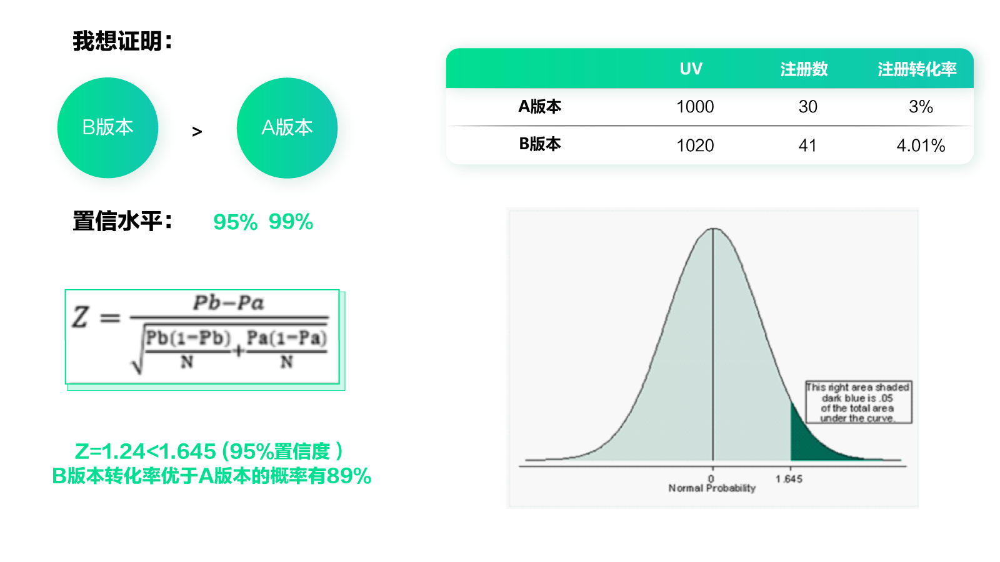

通过上面这张图里的数据例子，我们得到 B 版本转化率优于 A 版本的概率有 89%。如果置信水平定为 95% 的话，那么不能证明 B 版本效果更好。

我们再来看另一个例子：A 版本 UV2000，注册数 60，注册转化率 3%；B 版本 UV2020，注册数 82，注册转化率 4.05%。

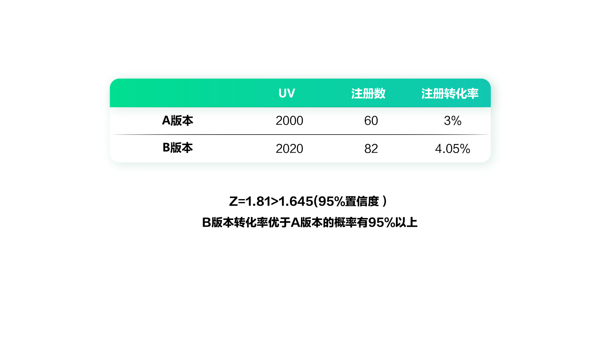

最后计算出的结果是：B 版本转化率优于 A 版本的概率有 95% 以上。因此在 95% 置信度的限制下，我们可以得出“B 版本比 A 版本效果更好”的结论。

具体的计算方式其实并不难，只需要把关键数值代入到公式里就可以了，但这依然有些麻烦。于是我们研发了一个免费的置信区间小程序，新手不需要学习专业的统计学知识，不需要套公式，也能快速评估实验结果。

### 不懂置信区间，独家小程序帮你忙

在微信小程序里，搜索“置信区间计算”，就可以看到这个小程序了。

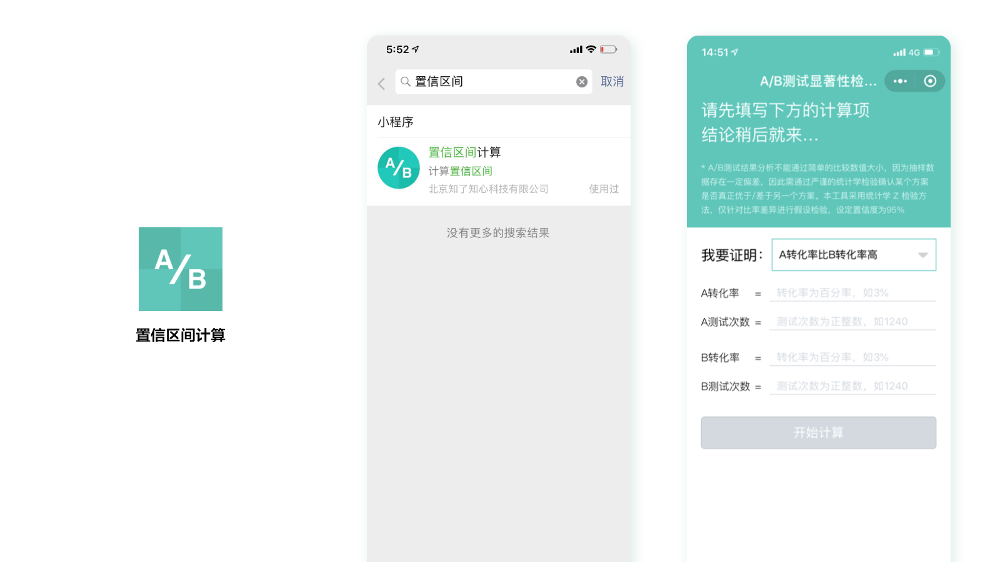

这里，我们只要把 A、B 方案的转化率和测试次数分别输入进去，就可以立刻得到结果了。是不是很方便呢？

当然了，希望大家**在实验中不要过于依赖置信区间的概念**，毕竟增长是一件灵活、四两拨千斤的事情，而且我们也一直在强调“去专业化”。专业虽然是必要的，但是太执着于“专业”就没必要了。更重要的是洞察和判断，你千万不要被“专业”绑架。

### 分析实验结果，准备下一次实验

即便有了明确的实验结果，也不要盲目的做论断，还**要分析数据背后的原因，知其然更知其所以然**，这个实验才有意义。

比如下图这个实验，A 版本是原始版本，B 和 C 是测试版本。AB 测试的结果是 A 版本数据好于 B 版本数据，B 版本数据好于 C 版本数据。

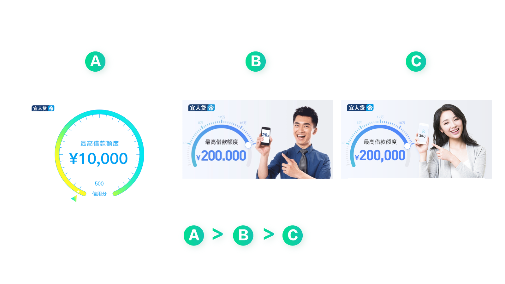

那我们就需要分析了，为什么原始版本最好。根据以前的调研结果，我们很容易理解用户喜欢简单易懂的图形，不喜欢太多视觉元素干扰。并且凭借常识我们也可以判断，加了人物形象后页面有点营销的味道，而用户想要的是稳定、可靠、值得信赖的感觉。

但是为什么男性形象比女性形象更好呢？这就有点让人摸不着头脑了。毕竟我们大部分用户都是男性，男性不是应该喜欢看美女才对吗？经过反复讨论，我们认为这和一个心理学现象“代入感”有关。

用户更喜欢看到和自己类似的，或者自己想成为的人。比如 B 版本，会让人感觉到，自己也能像那个男性一样成功借到钱，非常开心的样子。但是他看到 C 版本，就不会有这种感觉，会觉得这和自己没有关系。

所以从这个实验中，我们不仅可以知道哪个版本效果更好，还可以得出两条重要的结论：

- 用户更喜欢简洁的视觉元素，画面应该重点强调专业、信赖感。
- 用户喜欢和他相关的形象，产生场景代入感。

有了这样的结论，就可以指导我们在此基础上准备下一次的实验，而不会像没头苍蝇一样乱打乱撞了。

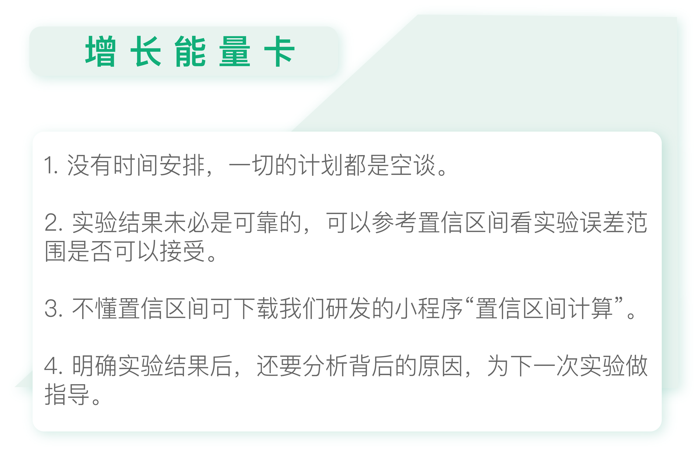

## 思考题

今天的思考题是，继续上次的实验计划，加入可视化的时间安排，以及对实验结果的预期和分析。

