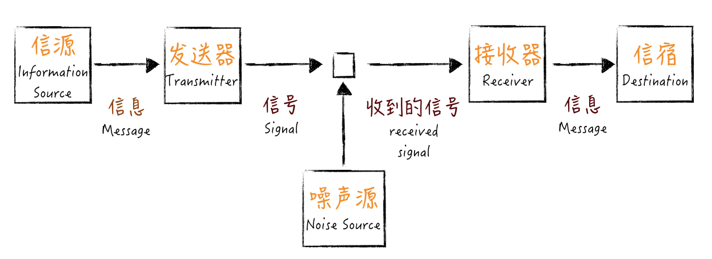
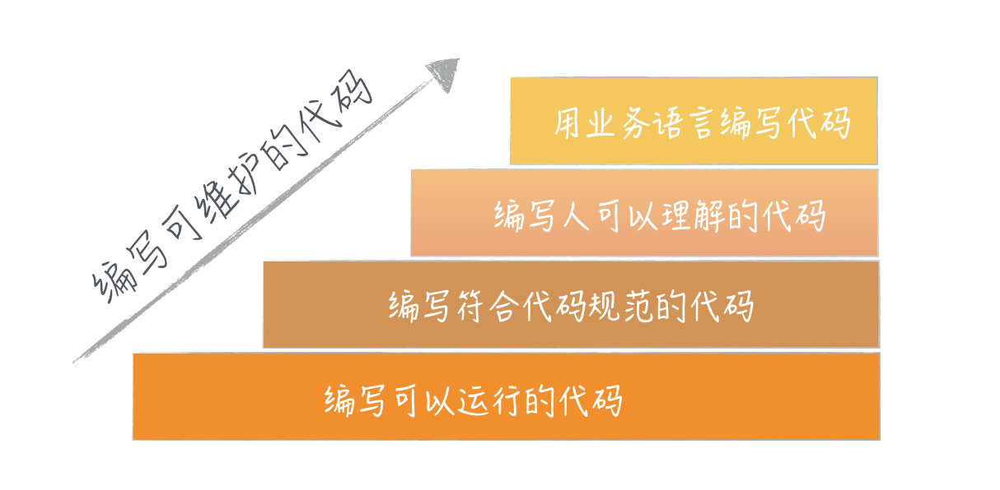
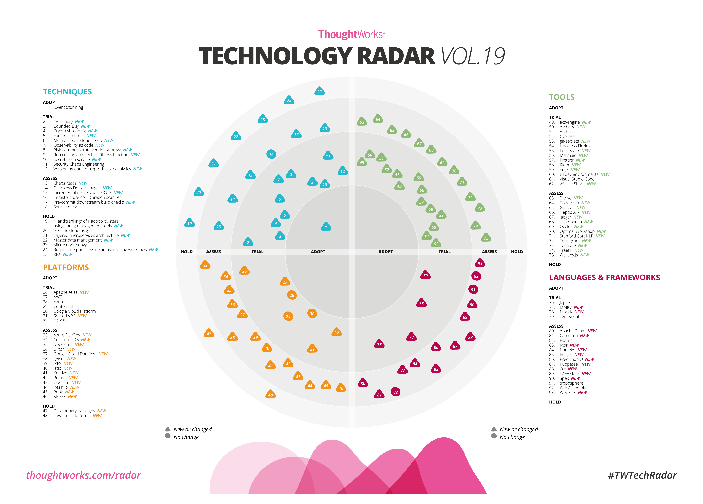
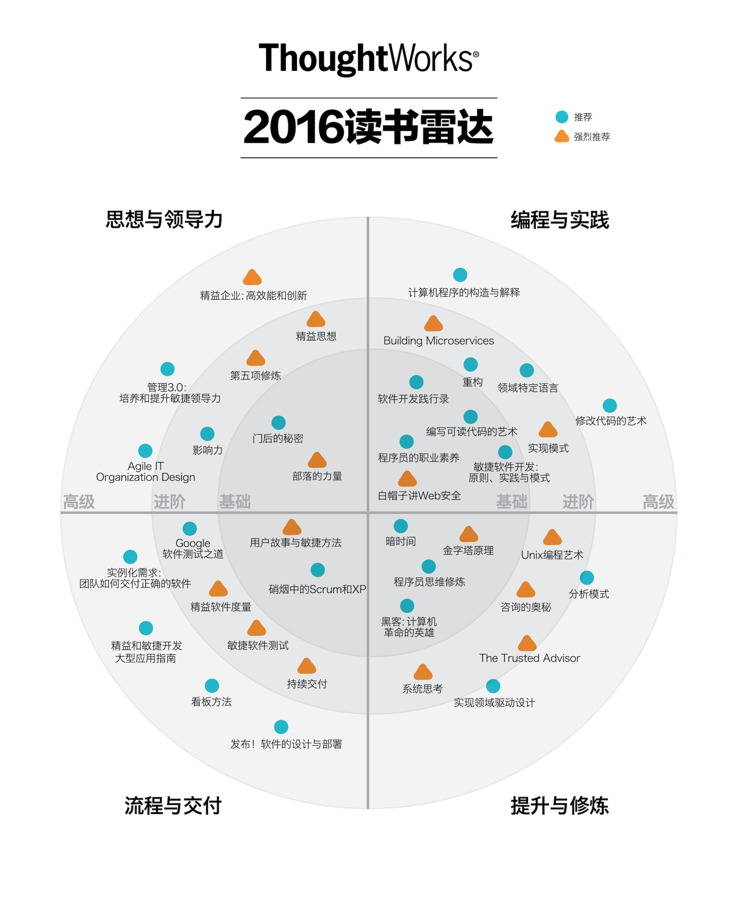
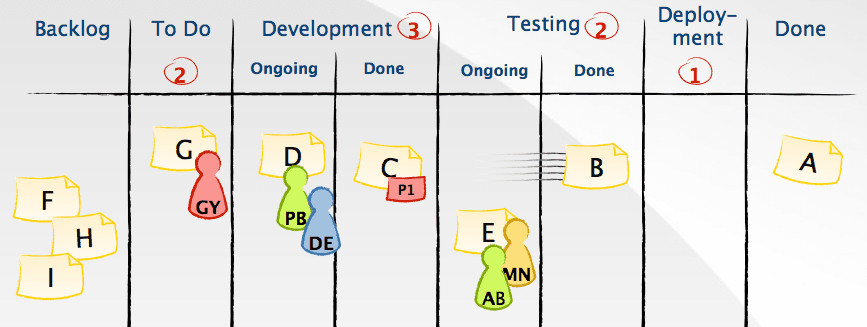
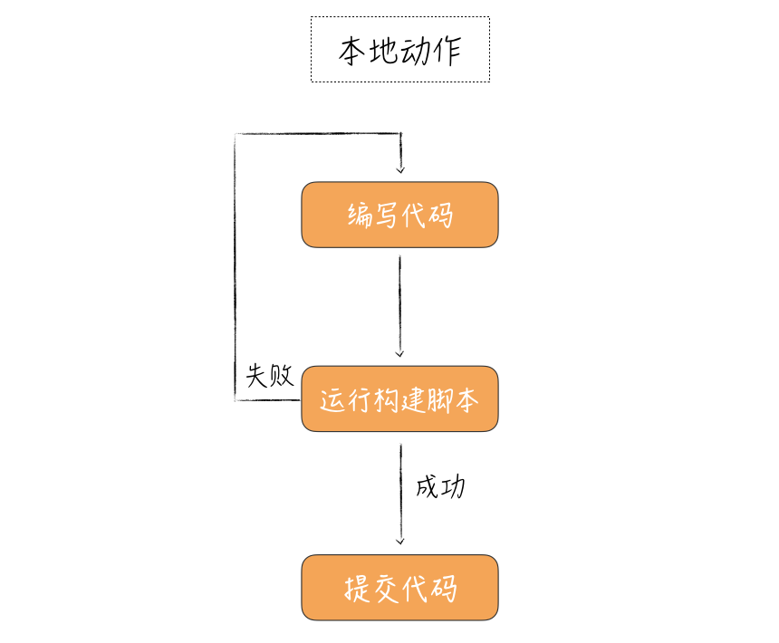
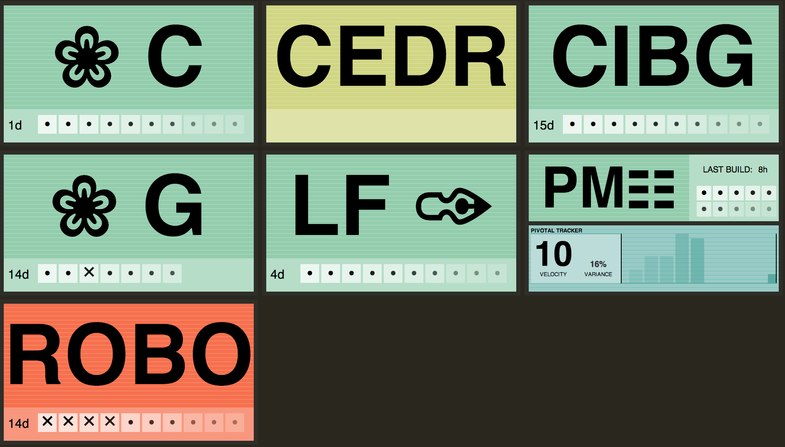

# 沟通反馈

通过沟通反馈，不断提升自己的编解码能力。

用业务的语言写代码。

对面对面沟通，少开会。

多尝试用可视化的方式沟通。

做好持续集成的关键是快速反馈。

定期复盘，找准问题根因，不断改善。

多走进用户。

# 生活在真实的世界中（提升编解码能力）

从今天起，我们要开启一个新的模块：**沟通反馈。**

如果看到沟通反馈几个字，你就以为我打算在这里教一些谈话技巧，那你还真的想错了。

在这个模块里，我打算与你讨论的主题是，生活在真实世界中。沟通反馈和生活在真实世界这两个话题是怎么联系到一起的呢？请听我慢慢道来。

《大富翁》里的沙隆巴斯有句口头禅：人生不如意，十之八九！但是不知道你有没有想过这样的一个问题，为什么人生如此不如意？如果这是一篇鸡汤文，我应该告诉你世事艰辛。但我要说的是，真实的原因往往是因为你想得太美好，用我们做软件的例子来看一下：

- 在我们的愿望中，做出来的产品应该一举成名，现实却是惨淡经营；
- 在我们的愿望中，产品经理给出的需求应该是清晰明了的，现实却是模模糊糊；
- 在我们的愿望中，写出来的代码，应该是快捷无错的，维护也很容易，现实却是 bug 百出，越修改，修改的时间就越长；
- 在我们的愿望中，你给我布置任务，我应该迅速地理解到关键，现实却是做出来的与你的目标根本就是天差地别；
- ……

为什么会这样？欢迎来到真实世界，真实世界不是以美好愿望驱动的，它有着自己的运行规律。虽然我们都生活在同一个世界中，但每个人理解世界的方式确实是千差万别。

**我们努力地学习各种知识，为的就是更好地理解这个世界的运作方式，而沟通反馈，就是我们与真实世界互动的最好方式。**

你也许会好奇，为什么我们对世界的理解会出现偏差？接下来，让我们一起用一个信息论的视角看一下。

## 一个信息论视角的解释

1948 年，克劳德·香农（Claude Elwood Shannon）在《贝尔系统技术学报》（Bell System Technical Journal）上发表了一篇论文《通信的数学原理》（A Mathematical Theory of Communication），这是现代信息论的开端。我们程序员熟知的通信、数据压缩、密码学、自然语言处理等诸多领域都有信息论的身影。

我们这里要借鉴的是香农信息论中的一个通信模型，如下图所示：

这个图中包含了几个要素：

- 信源（Information Source），它负责产生信息（Message）。
- 发送器（Transmitter），它会对信息进行某些操作，也就是对信息编码，产生信号（Signal）。
- 信道（Channel），它是信号传送的媒介。
- 接收器（Receiver），它是对信号执行发送器的逆操作，解码信号，提取出信息。
- 信宿（Destination），它负责接收信息。

当然，图中还有一个因素叫做噪声（Noise），指的是削弱信号的东西。不过，它并不是我们这里讨论的重点，我们暂时忽略它。

我们用一个实际工作中的例子来理解一下这个过程。假设你的项目经理来给你布置一项工作，在这里，项目经理就是一个信源。他的想法就是他的消息，他要把这件事告诉你，先要在大脑中做一次编码，转换成语言表达出来。他说出来的这段话就是信号。

比如，这个信号是“完成一个需求”。这段话通过信道，也就是空气传播到你耳朵里，接收到这段话之后，你会按照自己对这段话的理解进行解码，作为信宿的你，形成了自己的想法，这就是你接到的消息，整个过程就完成了。

我们来看一下，理解偏差是怎么产生的。

项目经理给你传输的信号是“完成一个需求”，在项目经理脑子中，这个信号的原始信息可能是这样的：编写完成这个功能所需的代码，然后为这段代码写好自动化测试，再将它与现有系统集成好，通过测试人员的验证。

而在学习这个专栏之前，你从“完成一个需求”这个信号中解码出来的信息却是：把功能代码写完。这样，问题就出现了。即便这里忽略了噪声的干扰，当编码和解码不是一个版本的时候，无论如何，项目经理的信息都很难准确地传达到你这里。

**这就是人们往往对世界产生误解的原因。**

信息的传达要经过编码和解码两个过程，无论是编码出现问题，还是解码出现问题，都会造成信息的不准确。

一方面，有些人表达不清楚，一件简单的事，他说了半天，你依然是云里雾里。这就相当于，信源发出的信息经过编码得到的信号已经不准确了。

另一方面，就像听一些技术演讲，人家说得很清楚，但因为自己没有相关背景，依然无法得知人家表达的信息。这就相当于信号虽然准确，但我们没有对应的解码装置，信号无法转成有效信息。

再有就是像前面这个例子，收发双方编解码器不配套，同样的信号得到的信息截然不同，信息传达的目的也不能很好地完成。

有了理论做基础，我们就容易理解世界为什么总和我的理解不一样，这就是编解码的过程出了问题。**因为每个人经历见识的差异，造成了各自编解码器的差异。**世界是同一个世界，每个人看到的却是千姿百态。

如果想在这个真实的世界中生活得更幸福一些，我们能做点什么呢？那就是改善我们的编解码器。怎么改善自己的编解码器呢？这就是“沟通反馈”这个模块要讨论的内容。

## 改善编解码

站在改善编解码效果的角度，我们要考虑哪些问题呢？

首先，我们要考虑一下编码器的效果。换句话说，当我们想把信息传达给别人的时候，我们得把信息编码成一个有效的信号，至少要保证在我们这里信息不丢失。

我举个例子，有一次，我在客户现场做咨询，客户的一个程序员给我介绍他们的系统，他讲了二十分钟，我还是听得一头雾水。于是，我打断他，花了五分钟用我的语言给他讲了一遍，然后问他，“你想说的是不是这个意思？”。他猛劲点头，“就是这样的。”

为什么会这样呢？究其原因就是，他上来就在给我讲实现细节，完全没有任何铺垫。

要知道，我是来了解情况的，所以，我的背景知识肯定是不足的，凭空理解这些细节是非常困难的一件事。从沟通的角度上看，这么做浪费了大量的时间，因为在过程中，我要不断地让他给我补充这些缺失的背景。**这几乎是很多程序员讲东西的通病：讲东西直奔细节。**

我在面试中也经常遇到过类似的情况，一些候选人上来就给我讲技术细节，我对他做过的系统一无所知，所以，我只好打断他，让他先把背景给我介绍一下。

同样，很多人抱怨别人不能理解自己，其实，首先应该想的问题是，自己到底有没有把话说清楚。这就是编码器出现问题的情况。

其次，我们还要考虑一下解码器的效果，也就是说，当一个信号呈现在我们面前时，作为接收者，我们是否能够有效地解码信息。

著名作家王小波曾经讲过一个花剌子模信使的故事，说的是中亚古国花剌子模有一个奇怪的风俗，凡是给君王带来好消息的信使，就会得到提升，给君王带来坏消息的人则会被送去喂老虎。如此一来，谁还敢把坏消息带给君王呢？但问题是，君王不听坏消息，坏消息就不存在了吗？

这就相当于解码器出了问题，过滤掉了很多真实的信息。但真实世界就是真实世界，它不会按照人们的美好愿望运行。

再举一个我们身边的例子，能做程序员的人，大多是很聪明的人， 当几个人一起讨论问题时，别人往往刚开了个头，他就认为自己已经理解了别人的想法，然后开始表达自己的观点。信息都不全，何谈解码。所以，开发团队的讨论中常常出现一个人高谈阔论，却离题万里的情况。

我们要想让自己更好地工作生活，就必须接纳真实世界的反馈，而接纳真实世界的反馈，一是需要我们打开自己的接收器，把信号接纳进来，让反馈进来，这是解码的前提；二是扩展见识，提升自己解码器的效果，更好地理解别人要表达的内容到底是什么。

说了编码器和解码器可能出现的问题，我们再来看另外一个可能造成影响的问题：**编解码器算法，也就是怎么协调沟通双方更有效地进行沟通。**

既然前面已经说了算法不够好会影响到信息的传递，那接下来的问题就是怎样找到一个好的算法。其实，我们从始至终在讲的各种最佳实践就是一个个好的算法，帮助我们改善沟通的效果。

还是回到前面提到“完成一个需求”的例子，我们在“以终为始”模块已经讲过了，通过制定“完成的定义”就可以帮助改善这个过程。**这就相当于，沟通的双方都有了一个编解码手册。**

当“完成一个需求”这样的信号发出时，作为接收方，你的解码动作就变成了，先要查一下手册里，关于“完成一个需求”的标准动作都有哪些。于是，你对事情的估计也就不会再那么简单了。

在“沟通反馈”这个模块下，我还会给你介绍各种“算法”，也就是最佳实践，帮你在工作中提高“信息”传递的效率。

回到我们这部分主题上，**沟通反馈就是改善编码、解码以及算法的方式。**无论是“发送”得更清楚，还是“接收”得更明白，抑或是通过各种协调算法，都是为了让通信的双方做好准备。

## 总结时刻

人生不如意，十之八九，之所以很多人有如此多的不如意，很大原因在于我们对真实世界有着很多不切实际的幻想，美好的愿望并不能驱动这个世界，在软件开发中也是如此。虽然人和人生活在一个世界中，但对世界的理解却是千差万别的。

我们借用了信息论的一个通信模型解释为什么每个人看到的世界会有如此大的差异，其核心就在于，人和人拥有不同的编解码器。想要在这个真实世界中生活得更幸福一些，需要我们不断地改善自己的编解码器。

改善编解码，需要从几个角度着手，分别是：编码器，让信息能输出更准确；解码器，减少信号过滤，改善解码能力；还有编解码算法，也就是各种来自行业的“最佳实践”，协调沟通的双方。

如果今天的内容你只能记住一件事，那请记住：**通过沟通反馈，不断升级自己的编解码能力。**

最后，我想请你回想一下，你在工作中遇到过哪些因为沟通反馈不畅造成的问题呢？欢迎在留言区写下你的想法。

# 代码（用业务的语言写代码）

关于“沟通反馈”的话题，我准备从代码开始讲起，毕竟我们程序员是靠代码与机器进行沟通的。

写代码是每个程序员的职责，程序员们都知道要把代码写好。但究竟什么叫写好呢？每个人的理解却是各有差异。

## 编写可维护的代码

初涉编程的程序员可能觉得能把功能实现出来的代码，就是好代码，这个阶段主要是基本功的学习，需要掌握的是各种算法、数据结构、典型的处理手法、常用的框架等等。

经过一段时间工作，日常工作所需的大多数代码，在你看来都是不在话下的。尤其像搜索和问答网站蓬勃发展之后，你甚至不需要像我初入职场时那样，记住很多常见的代码模式，现在往往是随手一搜，答案就有了。

再往后，更有追求的程序员会知道，仅仅实现功能是不够的，还需要写出可维护的代码。于是，这样的程序员就会找一些经典的书来看。

> 我在这方面的学习是从一本叫做《程序设计实践》（The Practice of Programming）的书开始的，这本书的作者是 Brian Kernighan 和 Rob Pike，这两个人都出身于大名鼎鼎的贝尔实验室，参与过 Unix 的开发。

写出可维护的代码并不难，它同样有方法可循。今天，我们用写代码中最简单的一件事，深入剖析怎样才能写出可维护的代码，这件事就是命名。

## 命名难题

> 计算机科学中只有两大难题：缓存失效和命名。
> —— Phil Karlton

这是行业里流传的一个经典说法，无论是哪本写讲代码风格的书，都会把命名放在靠前的位置。

估计你开始写程序不久，就会有人告诉你不要用 a、b、c 做变量名，因为它没有意义；步入职场，就会有人扔给你一份编程规范，告诉你这是必须遵循的。

不管怎样，你知道命名是很重要的，但在你心目中，合格的命名是什么样的呢？

想必你知道，命名要遵循编码规范，比如：Java 风格的 camelCase，常量命名要用全大写。

但是，这类代码规范给出的要求，大多是格式上的要求。在我看来，这只是底线，不应该成为程序员的追求，因为现在很多编码规范的要求，都可以用静态检查工具进行扫描了。

我们的讨论要从名字的意义说起。作为程序员，我们大多数人理解为什么要避免起无意义的名字，但对于什么样的名字是有意义的，每个人的理解却是不同的。

**名字起得是否够好，一个简单的评判标准是，拿着代码给人讲，你需要额外解释多少东西。**

比如，我们在代码评审中会看到类似这样的场景：

> 评审者：这个叫 map 的变量是做什么用的？
> 程序员：它是用来存放账户信息的，它的键值是账户 ID，值就是对应的账户信息。
> 评审者：那为什么不直接命名成 accounts？

你知道评审者给出的这个建议是什么意思吗？如果不能一下子意识到，遇到类似的问题，你可能会和这个程序员一样委屈：这个变量本来就是一个 map，我把它命名成 map 怎么了？

变量的命名，实际上牵扯到一个重要问题，**代码到底是给谁写的？**

## 代码为谁而写？

> 任何人都能写出计算机能够理解的代码，只有好程序员才能写出人能够理解的代码。
> —— Martin Fowler

代码固然是程序员与机器沟通的重要途径，但是，机器是直白的，你写的代码必须是符合某种规则的，这一点已经由编译器保证了，不符合规则的代码，你想运行，门都没有。

所以，只要你的代码是符合语言规则的，机器一定认。要让机器认，这并不难，你写得再奇怪它都认。行业里甚至有专门的混乱代码比赛。比如，著名的 IOCCC（The International Obfuscated C Code Contest，国际 C 语言混乱代码大赛）。

**但是，我们写代码的目的是与人沟通，因为我们要在一个团队里与人协同工作。**

与人沟通，就要用与人沟通的方式和语言写代码。人和机器不同，人需要理解的不仅是语言规则，还需要将业务背景融入其中，因为人的目的不是执行代码，而是要理解，甚至扩展和维护这段代码。

**人要负责将业务问题和机器执行连接起来，缺少了业务背景是不可能写出好代码的。**

我们在“[为什么世界和你理解的不一样](http://time.geekbang.org/column/article/80755)”这篇内容中就讲过，沟通的时候，输出时的编码器很重要，它是保证了信息输出准确性的关键。

很多程序员习惯的方式是用计算机的语言进行表达，就像前面这个例子里面的 map，这是一种数据结构的名字，是面向计算机的，而评审者给出的建议，把变量名改成 accounts，这是一个业务的名字。

**虽然只是一个简单的名字修改，但从理解上，这是一步巨大的跨越，缩短了其他人理解这段代码所需填补的鸿沟，工作效率自然会得到提高。**

## 用业务语言编程

写代码的时候，尽可能用业务语言，会让你转换一个思路。前面还只是一个简单的例子，我们再来看一个。

我们用最常用的电商下单过程来说，凭直觉我们会构建一个订单类 Order。什么东西会放在这个类里呢？

首先，商品信息应该在这个类里面，这听上去很合理。然后，既然是电商的订单，可能要送货，所以，应该有送货的信息，没问题吧。再来，买东西要支付，我们会选择一些支付方式，所以，还应该有支付信息。

就这样，你会发现这个订单类里面的信息会越来越多：会员信息可能也要加进去，折扣信息也可能会加入。

你是一个要维护这段代码的人，这个类会越来越庞大，每个修改都要到你这里来，不知不觉中，你就陷入了一个疲于奔命的状态。

如果只是站在让代码运行的角度，这几乎是一个无法解决的问题。我们只是觉得别扭，但没有好的解决方案，没办法，改就改呗！

但如果我们有了看业务的视角，我们会问一个问题，这些信息都放在“订单”是合理的吗？

我们可以与业务人员交流，询问这些信息到底在什么场景下使用。这时候你就会发现，商品信息主要的用途是下单环节，送货信息是在物流环节，而支付信息则用在支付环节。

有了这样的信息，你会知道一件事，虽然我们在用一个“订单”的概念，但实际上，在不同的场景下，用到信息是不同的。

所以，更好地做法是，把这个“订单”的概念拆分了，也就有了：交易订单、物流订单和支付订单。我们原来陷入的困境，就是因为我们没有业务知识，只能笼统地用订单去涵盖各种场景。

如果你在一个电商平台工作，这几个概念你可能并不陌生，但实际上，类似的错误我们在很多代码里都可以看到。

再举个例子，在很多系统里，大家特别喜欢一个叫“用户”的概念，也把很多信息塞到了“用户”里。但实际上，在不同的场景下，它也应该是不同的东西：比如，在项目管理软件中，它应该是项目管理员和项目成员，在借贷的场景下，它应该是借款方和贷款方等等。

要想把这些概念很好地区分出来，你得对业务语言有理解，为了不让自己“分裂”，最好的办法就是把这些概念在代码中体现出来，给出一个好的名字。这就要求你最好和业务人员使用同样的语言。

如果了解**领域驱动设计（Domain Driven Design，DDD）**，你可能已经分辨出来了，我在这里说的实际上就是领域驱动设计。把不同的概念分解出来，这其实是限界上下文（Bounded Context）的作用，而在代码里尽可能使用业务语言，这是通用语言（Ubiquitous Language）的作用。

所以，一个好的命名需要你对业务知识有一个深入的理解，遗憾的是，这并不是程序员的强项，需要我们额外地学习，但这也是我们想写好代码的前提。现在，你已经理解了，取个好名字，并不是一件容易的事。

## 总结时刻

代码是程序员与机器沟通的桥梁，写好代码是每个程序员的追求，一个专业程序员，追求的不仅是实现功能，还要追求代码可维护。如果你想详细学习如何写好代码，我推荐你去读 Robert Martin 的《代码整洁之道》（Clean Code），这本书几乎覆盖了把代码写好的方方面面。

命名，是写程序中最基础，也是一个程序员从业余走向专业的门槛。我以命名为基础，给你解释了写好代码的提升路径。最初的层次是编写可以运行的代码，然后是编写符合代码规范的代码。

对于命名，最粗浅的理解是不要起无意义的名字，遵循编码规范。但名字起得是否够好，主要看是否还需要额外的解释。很多程序员起名字习惯于采用面向实现的名字，比如，采用数据结构的名字。

再进一步提升，编写代码是要写出人可以理解的代码。因为代码更重要的作用是人和人沟通的桥梁，起一个降低其他人理解门槛的名字才是好名字。

实际上，我们很多没写好的程序有一些原因就是名字起错，把一些概念混淆在一起了。想起好名字，就要学会用业务语言写代码，需要尽可能多地学习业务知识，把业务领域的名字用在代码中。

如果今天的内容你只能记住一件事，那请记住：**用业务的语言写代码。**

最后，我想请你思考一下，想要写好代码，还有哪些因素是你特别看重的？欢迎在留言区写下你的想法。

# 轻量级沟通（少开会，多面对面沟通）

今天我们来探讨一个很多程序员日常工作中，经常碰到却会带来困扰的话题：开会。

## 头疼的开会

有一次，我听到两个程序员在聊天。一个资深程序员说：“还是晚上好，我可以一门心思写代码”，另一个年轻程序员不解地问：“你白天也可以写啊。”

资深程序员很无奈，“我倒是这样想，可是白天参加那么多会，哪有工夫啊！我的代码就只能加班写了。”

这段对话听上去让人有点心酸，但这种现象，确确实实广泛存在于程序员的日常工作中，尤其是你经验丰富又在一个大组织中工作，这几乎成了你的宿命。在这些程序员的认知中，开会太多影响了他们写代码。

你以为我想讨伐开会吗？并不是，开会本身并没有错，因为开会的本意是将大家组织起来解决问题。但请你回想一下，你参加的会议有多少解决了问题呢？

**开会是为了解决问题，但真实情况却是开了会又没有解决多少问题，这真是一个奇特的矛盾。**

回想一下，你参加过的会议里面，有没有效果特别好的呢？在我职业生涯中，**凡是效果特别好的会议，基本上都是用来做信息同步的。**比如，领导宣布一个事情，这种会议几乎不会浪费时间。宣布消息，大家收到消息，结束。

那效果不好的会议是什么样呢？几乎都是那些讨论会，你一言我一语，每个会几乎无一例外，都有几个擅长打岔的，这个会基本上都会跑偏，时间就会这样一分一秒地流逝了。

我给你举个例子，我之前参加过一个上线计划的评审会，这个团队的负责人要把相关利益方都召集起来，其中包括上下游可能会受影响的团队、测试、运维等等，一个不大的会议室里挤满了人。

这个负责人刚开始讲方案没几分钟，下游团队的负责人就站出来问：“这个方案为什么要这么做？我担心会对我们系统造成影响。”讲方案的人只好停下来解释。结果是越解释，细节越多，双方你来我往，一个方案评审会，就转变成一个技术讨论会了。

测试和运维的同事本来是想来听技术方案，以便为后续的工作做准备的。看着双方的讨论，一脸无奈，因为他们知道，方案没确定好，所有的事情还是下回再说吧！

怎么样？是不是很熟悉的感觉。为什么会这样？**因为他们选错了沟通方式。**

开会是一种重量级的沟通，几乎是我们日常工作中最重的。它有很强的仪式感，所以，大家相对来说会很重视。而且会议通常会牵扯到很多人，尤其是与这个事情相关度不那么高的人。

你可以想一下，有多少次开会，你是在精力集中的？如果你是高度集中的，那恭喜你，你是高效地参与其中。但更多时候，你可能神游天外，因为讨论的内容可能与你关系不大，或者你已经听不懂了，你坐在那里的唯一原因是，主持人还没宣布会议结束。

用开会这种重量级的方式讨论问题，就好比杀鸡用了牛刀，这是不恰当的。那该怎么解决这个问题呢？很简单，杀鸡用鸡刀。

## 轻量级沟通

实际上，真正在会议上能够积极参与讨论的人并不会觉得会议是浪费时间，因为高度参与其中，人是进入到心流状态的，时间流逝很快。觉得浪费时间的，往往是没有参与其中的人。

换句话说，会议之所以给人留下如此不堪的印象，一个重要的原因是，真正参与讨论的人并不多。所以，我们换个角度思考一下，只要把这些真正参与讨论的人拉到一起讨论不就好了？

**所以，改善会议的第一个行动项是，减少参与讨论的人数。**

有人会说，我这个讨论有好几个议题，每个议题要不同的人参与，那你要做的是，分别找这几个人专门讨论，而不是把大家放到一起。

不知道你发现没有，在讨论行动项的时候，我用的是“讨论”，而没有提到“会议”两个字。我之前说过了，会议是一种重量级的沟通方式。所以，我们会倾向于选择一种轻量级的沟通方式，比如面对面沟通，这样一来，每个人的压力就会小很多。

相比于会议的形式，面对面沟通因为注意力有限，参与的人数不可能太多。也因为参与的人数相对少一些，每个人的投入也会更多一些。

**所以，我们的第二个行动项是，如果你要讨论，找人面对面沟通。**

一旦理解了这些改进方式，我们就可以改进自己的行为方式。如果有一个问题需要讨论，我要做的是，分别找到相关人针对关心的主题进行讨论，然后，我把讨论的结果汇总再去征求大家意见。如果大家达成一致了，我才会选择开会。

这个时候，开会的目的不再是讨论，而是信息同步：我准备这么干了，相关各方已经同意了，知会大家一下，结束。

## 站立会议

我前面说过了，开会并非都是不好的，一些信息同步的会还是有必要的。

举个例子，有一种实践叫站会（Standup）。很多公司都在实践它，站会甚至成为每天的开工仪式。一般的做法是，早上大家来上班了，先开一个站会，让大家同步一下昨天的工作，然后开始今天的工作。

有的人一听到站会这个形式就会皱起眉头。如果是这样，多半是你的团队“站”错了。

你知道，这个会为什么是“站”会吗？因为按照一般人的习惯，站的时间不会太长，因为站的时间长，累啊！所以，如果站会超过 10 分钟，你的站会一定是错的。

也许你会说，这点时间恐怕不够给我们站会吧？因为每个人都有一大堆要说的。请问，你觉得其他人说那么多，你关心吗？现实是，一旦一个人说多了，跟你关系又不大，你就开始思维发散了。

所以，在总长固定的情况下，每个人发言的时间一定是有限的。在有限的时间内，你能说什么呢？我建议你只说三件事：

- 我昨天做了什么？
- 我今天打算做什么？
- 我在过程中遇到了什么问题，需要请求帮助。

**“做了什么”** ，是为了与其他人同步进展，看事情是否在计划上。一旦偏离计划，请主动把它提出，这样，项目经理可以过问，因为这会涉及到是否要调整项目计划；

**“要做什么”** ，是同步你接下来的工作安排。如果涉及到与其他人协作，也就是告诉大家，让他们有个配合的心理准备；

**“问题和求助”**， 就是与其他人的协作，表示：我遇到不懂的问题，你们有信息的话，可以给我提供一下。

这三件事都是与别人相关的，几句话快速说完，结束。因为这些事情与别人相关，所以，大家的注意力可以相对集中一些。

你或许会问，如果我的问题很复杂，需要讨论该怎么办。对不起，那是另外一件事，你可以在站会结束之后，找相关人去讨论，不要在这个会上浪费大家时间。在站会上，你只要在问题和求助中告诉大家，你有一个问题，需要相关人讨论，结束。

为了让大家保持注意力集中，我的一些团队还用过发言令牌的方式。比如，找一个毛绒玩具，谁拿到“令牌”谁发言，然后，随机地扔给一个人，一旦这个人走神，大家一下子就能发现了。

一些有趣的方式、短暂的时间，以及与所有人相关的事情，因为满足了这三点，所以普遍来说，这种站会效果还可以。

关于站会，有一个典型的错误是，有些团队把站会开成了汇报会。项目负责人指定一个个轮流发言，说的人都向负责人在汇报工作，其他人自然就容易走神了，因为事情与己无关。

还有一点你可能会有疑问，我所在的团队比较大，一个人几句话时间也会很长。

当团队很大时，更应该做的是把团队拆分了，因为你不太可能与 20 个人紧密地工作在一起。沃顿商学院曾经做过一项研究，5-12 个人是一个恰当的团队规模，每个人在其中都能发挥自己的重要作用。

## 总结时刻

开会是很多程序员的困扰，太多的会议甚至会影响到你工作的进展。开会的本意是为了解决问题，但实际上，大多数会议并不能很好地解决问题。因为会议是一种重量级的沟通方式，很多人参加会议时，并不能很好地参与其中。

如果你想用会议的形式与别人讨论问题，最好放弃这种打算，面对面的沟通是最好的方式。因为面对面沟通很轻，人数相对少，每个人参与度就会高很多。基于这种改进，我们可以把大部分会议都改成信息同步的会，效率就会得到提高。

我还给你介绍了一种特殊的会议：站会。之所以采用站会的方式，就是要控制时间。在站会上每个人说什么，我给了你一个建议的格式：

- 我昨天做了什么？
- 我今天打算做什么？
- 我在过程中遇到了什么问题，需要请求帮助。

如果你经常组织别人开会，请你想一下，是不是自己没有利用好开会这件事；如果你经常被别人组织开会，不妨把这篇文章转发给他，让他别总是开会“讨论”问题。

如果今天的内容你只能记住一件事，那请记住：**多面对面沟通，少开会。**

最后，我想请你思考一下，你在工作中，还遇到过哪些因为开会带来的问题呢？欢迎留言与我写下你的想法。

# 可视化的沟通方式（技术雷达）

作为一个程序员，在这个技术快速发展的时代，我们唯有不断学习，才能保证自己不为时代所抛弃。那你是怎么跟上技术发展步伐的呢？

就个人经验而言，我会关注一些技术网站，最典型的就是 **InfoQ**。这样，我可以快速了解到技术发展的动向，比如，什么时候出了个新东西、哪个项目又有了重大的更新、某些技术有了哪些新的应用场景等等。

另外，我还有一种更系统地了解新知识的方式：**ThoughtWorks 技术雷达**。之所以我很喜欢这种方式，因为它是**“可视化”**的。

## 什么是技术雷达？

[ThoughtWorks 技术雷达](http://www.thoughtworks.com/radar)是由 ThoughtWorks 技术咨询委员会（Technology Advisory Board）编写的一份技术趋势报告，每 6 个月发布一次。ThoughtWorks 的项目多样性足够丰富，所以它能够发现诸多技术趋势。因此，相比于行业中其它的预测报告，技术雷达更加具体，更具可操作性。

ThoughtWorks 是我的老东家，所以，我在接触技术雷达的时间很早。我在 2013 年就已经开始与人讨论微服务，并在项目中尝试使用 Docker，而这一切信息的来源都是技术雷达。不过，我这里想和你讨论并不是技术雷达到底有多优秀，而是带你看看技术雷达这种组织知识的可视化形式。

技术雷达用来追踪技术，在雷达图的术语里**，每一项技术表示为一个 blip，也就是雷达上的一个光点。**

然后用**两个分类元素组织这些 blip：象限（quadrant）和圆环（ring）**，其中，象限表示一个 blip 的种类，目前有**四个种类：技术、平台、工具，还有语言与框架。**

圆环表示技术一个 blip 在技术采纳生命周期中所处的阶段，目前这个**生命周期包含四个阶段：采用（Adopt）、试验（Trial）、评估（Assess）和暂缓（Hold）。**

每次技术雷达发布之后，我会特别关注一下**“采用”** 和 **“暂缓”**两项。

“采用”表示强烈推荐，我会去对比一下自己在实际应用中是否用到了，比如，在 2018 年 11 月的技术雷达中，事件风暴（Event Storming）放到了“采用”中，如果你还不了解 [事件风暴](http://www.eventstorming.com) 是什么，强烈建议你点击链接了解一下。

**“暂缓”** 则表示新项目别再用这项技术了，这会给我提个醒，这项技术可能已经有了更优秀的替代品，比如，Java 世界中最常见的构建工具 Maven 很早就放到了**“暂缓”**项中，但时至今日，很多人启动新项目依然会选择 Maven，多半这些人并不了解技术趋势。

从

这几年的发展趋势来看，技术雷达在“采用”和“暂缓”这两项上给出的推荐，大部分是靠谱的。

至于“试验”和“评估”两项，有时间的时候，我会慢慢看，因为它们多半属于新兴技术的试验区，主要的作用是用来让我开拓视野的。

**雷达图是一种很好的将知识分类组织的形式，它可以让你一目了然地看到并了解所有知识点，并根据自己的需要，决定是否深入了解。**

所以，我的前同事们借鉴了这个形式，做出了一个程序员的读书雷达，将程序员的应该阅读的书籍做了一个整理。

事实上，这种将内容通过可视化方式的组织起来的形式非常好用，ThoughtWorks 鼓励每个组织都建立自己的知识雷达，甚至提供了一个工具辅助你将雷达图构建出来。

**在我看来，雷达图不仅仅适用于组织，也可以适用于团队。**

我也曾经按照雷达图的方式将自己的团队用到的技术组织起来。把最需要了解的技术必须放在内环，比如：一个 Java 项目。我会要求程序员了解 Java，向外扩展的就是你在这个团队内工作会逐渐接触到的技术，比如，像 Docker 这种与部署相关的知识。至于最外面一层，就是被我们放弃掉的技术，比如，Maven。

这样一来，团队成员可以更清晰地了解到团队中所用的技术。当有新人加入团队时，这个雷达可以帮助新人迅速地抓住重点，他的学习路径就是从内环向外学习。所以，我也推荐你打造自己团队的技术雷达。

> [构建技术雷达](https://www.thoughtworks.com/cn/radar/byor)
> [构建雷达的程序库](https://github.com/thoughtworks/build-your-own-radar)

你是否想过，为什么雷达图的形式可以帮助你更好地理解知识呢？**因为人的大脑更擅长处理图像。**

## 可视化的优势

在远古时代，人脑处理的内容大多是图像，比如，哪里有新的果实，哪里猛兽出没，文字则是很久之后才产生的。现在普遍的一种说法是，大约在公元前 3500 年左右，许多文明才刚刚发展出书写系统，相比于人类的历史来说，这几乎是微不足道的。

就人脑的进化而言，**处理图像的速度远远快于处理文字，**所以，有“一图胜千言”的说法。

通过创建图像、图标或动画等进行信息交流的形式，就是可视化（Visualization）。可视化有很多种不同的分类，我们最常用的应该是数据可视化和信息可视化。

我在“[你的工作可以用数字衡量吗](http://time.geekbang.org/column/article/76929)”这篇文章里说过，我上班第一件事是“看”数字，这就是典型的数据可视化，而上面介绍的技术雷达，就属于信息可视化。

很多做软件的人习惯于用文字进行沟通，一般在软件开发过程中，需要编写各种文档，但并不是所有的场景，文字都是好的沟通方式，所以，也会有很多人尝试着将可视化应用在软件开发过程中。

估计大多数程序员最熟悉的表达方式应该是流程图，如果你做过软件设计，可能还听说过 UML（统一建模语言，Unified Modeling Language）。如果使用得当，这种方式会极大地提高表达的准确性，降低其他人理解的门槛。

在日常工作中，你最熟悉的可视化方式，大概就是在纸上或白板上画的图。以我的经验看，很多人画这个图太随意，如果你也是这样，我给你一个建议，先写字后画框，这样图会显得整洁一些。

## 什么是看板？

我们再来看一个实践，这就是将“可视化”应用在工作中的典型案例：看板。

看板，是一种项目管理工具，它将我们正在进行的工作变得可视化。这个实践来自精益生产，前面讲精益创业时，我给介绍了“精益”这个来自丰田公司的管理理念。精益的理念在软件行业已经已经非常流行了，很多软件开发实践都是从“精益”而来，看板就是其中之一。

看板属于那种几乎是看一眼就知道怎么用的实践。它将工作分成几个不同的阶段，然后，把分解出来的工作做成一张卡片，根据当前状态放置到不同的阶段中。如果你采用了我们专栏之前讲过的用户故事，那么每个用户故事就是一张卡片。

在实际工作中，每当一个工作完成之后，它就可以挪到下一个阶段，工作怎么算完成就是由我们前面提到的 DoD 来决定的。

当然，要用好看板，还可以使用一些小技巧。比如，用不同颜色的卡表示不同类型的工作，给每个人一个头像，增添一些乐趣。

看板可以帮助你一眼看出许多问题，比如，你的团队中有 5 个人，却有 8 个正在进行的任务，那一定是有问题的。因为一个人多线程工作，效果不会好。用“精益”的术语来说，我们应该限制 WIP（Work-In-Progress）；再有，如果待开发的卡最多，那就证明现在的瓶颈在于开发，而不是其它阶段。

运用看板的方式，还有一个有趣的细节：使用实体墙还是电子墙。实体墙不难理解，就是找一面墙把看板做出来。现在有很多公司专门在做协同办公软件，其中的项目管理部分用到的就是看板理念，这就是电子墙的由来。

关于这点，顺便说一下我的建议，如果你的团队是在一起工作的，请考虑使用实体墙，除非你的办公空间实在太小。因为它可以方便地调整，也可以当做站会的集合地点，还可以让别人看见你们的工作或是问题，这样做的最大优势在于增强了人与人的互动。

电子墙的优势在于，随处可访问、数据不会丢失、便于统计等等，但每次访问它，都需要专门打开电脑，还是比较麻烦的。一种将二者结合的办法是，使用一个大电视，专门用来展示电子墙。

总之，看板就是要让工作在大家面前展现出来。

## 总结时刻

我给你介绍了一种结构化学习新知识的方式：技术雷达。

技术雷达就是一种将技术信息组织起来的方式。它通过将技术按照“象限”和“圆环”两个维度进行分类，让人可以直观地看到并理解不同的技术所处的发展阶段。

雷达图是一种很好的形式，不仅可以用在组织技术，还可以用来组织其它信息，比如，读书雷达。每个公司都可以利用雷达图的形式组织自己所有的技术，每个团队也可以利用雷达图的形式组织自己团队用到的技术，这样，方便团队成员结构化地理解用到技术，也方便新人的学习。

雷达图实际上是一种可视化的方法，人脑对于图像处理速度更快，因此，可视化是改善沟通的一种方式。大多数软件过程习惯采用文字的方式进行表达，对于“可视化”利用的还不够。当然，还是有一些利用“可视化”的方法，比如，流程图、UML 等。

最后，我给你介绍了一个利用可视化进行信息沟通的实践：看板。看板把工作分成了几个不同的阶段，在看板上对应不同的列，然后，每个任务作为一张卡贴在上面。每完成一张卡，就把这张卡挪到下一个阶段。

看板可以帮你发现许多问题，比如，当前进展是否合适，是否有人同时在做很多的事，发现当前工作的瓶颈等等。

如果今天的内容你只能记住一件事，那请记住：**多尝试用可视化的方式进行沟通。**

最后，我想请你思考一下，你在工作中，有哪些用到可视化方法解决沟通问题的场景？欢迎留言区写下你的想法。

# 持续集成（快速反馈）

在“以终为始”那个模块，我们留下了一个巨大的尾巴。在“[持续集成：集成本身就是写代码的一个环节](http://time.geekbang.org/column/article/75977)”这篇文章中，我们是站在“以终为始”的角度阐述了集成，尤其是持续集成的重要性。

但怎么做好持续集成，才是很多人真正关心的内容。今天，我们就来谈谈如何做好持续集成。

既然我们打算讨论持续集成，不妨停下来先思考一个问题：你对持续集成的第一印象是什么。

**持续集成？Jenkins？没错，很多人对持续集成第一印象都是持续集成服务器，也就是 CI 服务器，当年是 CruiseControl，今天换成了 Jenkins。**

也正是因为如此，很多人就把 CI 服务器理解成了持续集成。我就曾经接触过这样的团队，他们恨不得把所有的事情都放在 CI 服务器上做：在 CI 服务器上做了编译，跑了代码检查，运行了单元测试，做了测试覆盖率的统计等等。

或许你会疑问，这有什么不对的吗？

在做软件这件事上，我们不会用对与错去衡量，我只能说，这种做法是可行的，但它不是最佳实践。我希望你去思考，有没有比这更好的做法呢？

想要回答这个问题，我们还是要回到持续集成的本质上去。持续集成的诞生，就是人们尝试缩短集成周期的结果。为什么要缩短周期呢？因为我们希望尽早得到反馈，知道自己的工作结果是否有效。

所以，想要做好持续集成，就需要顺应持续集成的本质：尽快得到工作反馈。

由此，我们便得到持续集成的关键点，你只要记住一句话，**快速反馈。**

快速反馈，这句分成两个部分，快速和反馈，这也就引出了持续集成的两个重要目标：**怎样快速地得到反馈，以及什么样的反馈是有效的。**

## 快速得到反馈

我们回到前面的例子上，把各种检查放到 CI 服务器上执行，它可以让我们知道代码是不是有问题，这是一个有效的反馈，但它的反馈够快速吗？虽然比起没有持续集成的状态，它是好很多。但是，我们需要问一个问题，能不能更快地得到反馈呢？

显然，我们还可以做得更快。在自己的开发机上执行这些检查，就会比在 CI 服务器快。也就是说，**执行同样的操作，本地环境会快于 CI 服务器环境。**

为什么会这样呢？我们先来看看所有检查在 CI 服务器上执行，每个程序员的动作是什么样的。

我们写好代码，然后需要提交代码，等待 CI 服务器运行检查结果，然后，用 CI 监视器查看执行结果。如果没问题，继续做下一个任务，如果有错误，修复错误，再执行同样的过程。

再来看看本地执行的动作。运行构建脚本，如果一切正确，你可以选择提交代码或是继续下一个任务，如果失败，立即修复。

对比之下，在本地运行这些检查，你不需要提交，不需要等 CI 服务器开始执行，不需要跑到额外的地方查看检查结果。所以，这个操作比提交到服务器上会快很多。

另外，这里还有一个关键点，我们的操作是连续的。一旦检查结果出错了，我们立刻进入修复环节。作为程序员，我们太了解连续操作的重要性了。这就像打游戏时，我们感觉不到时间流逝一般，有人把这种状态称之为“心流”。

而提交代码，等待 CI 服务器的检查结果，就等于强迫你停下来，你的心流就被打断了。

如果你对心流的概念感兴趣，可以去读米哈里·契克森米哈赖的著作[《心流》](http://book.douban.com/subject/27186106/)，这位作者就是心流概念的提出者。

前面我们只是在说，你作为程序员个体，使用持续集成的效果，这只是为了简化讨论。接下来，我们向更真实的世界靠拢，引入另一个重要的因素：团队协作。

假设你的团队就是在 CI 服务器上执行检查。你兴高采烈地写完一段代码准备提交，结果，此时你隔壁的同事手快一筹，先提交了，你不得不停下来等他。如果很不幸，你同事的检查失败的话，那么他又要把它修复好，你等的时间就更长了。

一个小问题也就罢了，如果是个大问题，他可能要修很长一段时间。这个时候，你除了等待，也没有更好的选择。如此一来，大把的时间就被浪费掉了。

这里我们要“插播”持续集成中重要的一个提交纪律：**只有 CI 服务器处于绿色的状态才能提交代码。**有检查在运行不能提交，有错误不能提交。原因很简单，如果这个时候多个人提交了代码，检查失败了，那问题到底算谁的呢？

反之，如果一次只有一个人提交代码，责任是明确的。如果团队不大，这个纪律相对还好执行，提交之前看一眼，或是喊一声就可以了。

如果团队稍微有一点规模，可以用一个小东西当作令牌，谁拿到了谁来提交。如果真的有人在 CI 服务器还在运行的时候，提交了代码怎么办？很简单，谁提交谁负责，错了就他修，谁让他违反纪律了。

好，你已经理解了我说的重点：**不能把检查只放到 CI 服务器上执行。**那该怎么做呢？答案已经呼之欲出了，那就是在本地开发环境上执行。

想做好持续集成的一个关键点是，**用好本地构建脚本（build script），保证各种各样的检查都可以在本地环境执行。**

一旦有了构建脚本，你在 CI 服务器上的动作也简单了，就是调用这个脚本。也就是说，本地检查和 CI 服务器上的动作是一致的。

至于什么样的内容适合放在构建脚本里，这个话题我们先放一放，把它留到后续“自动化”模块再做讨论。

在“任务分解”模块中，我与你讨论了“小”动作在工作中的重要性，“小”动作完成得越快，工作反馈得到也越快，所以说，也只有坚持不懈地做“小”动作，才能缩短反馈周期。

现在我们把这个道理与持续集成结合起来理解，我们的工作流程就变成了这样：

每完成一个任务，在本地运行构建脚本，如果有问题，就修复；没问题，则可以同步代码。如果 CI 服务器上没有正在运行的服务，就可以提交代码了。

提交代码中最麻烦的动作，其实是合并代码。不过，因为我们做的是小任务，改动的代码量并不大，所以，即便有需要合并的代码，量也不会很大，所需的脑力以及工作时间都会少很多。如此一来，我们的开发效率才可能能真正得到提高。

当团队真正地实施起持续集成，你会发现随着时间增加，本地检查的时间会越来越长。原因有很多，比如，代码越来越多，测试也越来越多。总之，检查的时间长了，就会对集成的速度造成影响。

这个时候，本着快速反馈的理念，我们就必须想办法。比如，有的团队做了分布式测试运行，有的团队将测试分类，就是我们在测试金字塔中讲到的分类，在本地执行单元测试和集成测试，而把更复杂的系统测试放到 CI 服务器上运行。

**简单来说，我们的目的就是快速地得到反馈。**

## 得到有效的反馈

说完了“快速”，我们再来看看做好持续集成的第二个重点：**反馈，也就是怎么得到有效的反馈。**

为什么需要反馈，道理很简单，我们得知道自己做得对不对。你可能会问，根据前面的说法，如果本地和 CI 服务器上执行的是一样的脚本，我在本地通过了，还用关心 CI 服务器的反馈吗？

当然要。因为还会出现很多其他问题，比如说最简单的一种情况是，你漏提交了一个文件。

好，既然我们要关注持 CI 服务器的反馈，下一个问题就是，它怎么反馈给我们呢？

我们还是从一种常见的错误入手。有些团队做持续集成用的反馈方式是什么呢？答案是邮件。

以邮件进行反馈，问题出在哪里呢？很明显，邮件不是一种即时反馈的工具。

我不知道有多少人会把邮件客户端当作日常的工具，就我个人习惯而言，一天查看几次邮件就算不错了，如果以邮件作为反馈方式，很有可能是出错了很长时间，我都无知无觉。

我们前面一直在强调快速，需要的是**即时反馈，一旦邮件成了持续集成链条中的一环，无论如何都快不起来。**

那你可以怎么做呢？在前面各种讨论中，我其实已经透露了**答案：持续集成监视器，也是 CI 监视器。**

CI 监视器的原理很简单，CI 服务器在构建完之后，会把结果以 API 的方式暴露出来，早期有 RSS 和 ATOM 格式，后来有 JSON 的格式。得到的结果就可以用不同的方式进行展现了。市面上有很多 CI 监视器的软件，有的是拿到结果之后，做一个视觉呈现，有的是做桌面通知。

现在，我们终于要讲到这个部分的重点了：**怎么呈现是有效的？**

答案很简单：**怎么引人注目，怎么呈现。**

比如，很多团队的做法是，用一个大屏幕将持续集成的结果展示出来，这样一来，持续集成的结果所有人都能看到，一旦出错了，即便你一时疏忽，也会有人来提醒你。

还有一些感官刺激的做法，比如，有人用上了红绿灯，测试失败则红灯闪烁；还有人甚至配上了语音，用喇叭高喊：“测试失败了，请赶紧修复。”我在一个视频里见过一个更夸张的做法：有人用玩具枪，出错了，就瞄准提交者开上一枪。

你是聪明的程序员，你应该能想到更多有趣的玩法。

为什么要这么做呢？这里的重点是，想做好持续集成，需要整个团队都关注持续集成。

这些引人注目的做法，就是要提高持续集成的关注度。否则，即便持续集成的技术环节做得再出色，人的注意力不在，持续集成也很难起到作用。

所以，你看到了，持续集成的反馈，尤其是出错之后的反馈方式，几乎是所有实践中最为高调的，它的目的就是要引人注目。

这里再插播一条持续集成的纪律：**CI 服务器一旦检查出错，要立即修复。**原因很简单，你不修，别人就不能提交，很多人的工作就会因此停顿下来，团队的工作流就会被打断，耽误的是整个团队的工作。

如果你一时半会修不好怎么办，撤销你的提交。更关键的原因是，团队对于持续集成的重视度，长时间不修复，持续集成就失去了意义，人们就会放弃它，持续集成在你的项目中，也就发挥不出任何作用了。

## 总结时刻

持续集成是软件开发中的重要实践，做好持续集成的关键在于，快速反馈。这里面有两个目标，怎样快速地得到反馈，以及什么样的反馈是有效的。

做好快速反馈，要把本地能做好的事情，在本地做好；也要通过小步提交的方式，加快代码开发的节奏。什么是有效的反馈？一是即时的反馈，二是引人注目的反馈。有很多种持续集成相关的工具可以帮助我们达成有效的反馈。

想要做好持续集成，还要有一些纪律要遵循：

- 只有 CI 服务器处于绿色的状态才能提交代码；
- CI 服务器一旦检查出错，要立即修复。

如果今天的内容你只能记住一件事，那请记住：**做好持续集成的关键在于，快速反馈。**

最后，我想请你分享一下，你的团队做持续集成吗？遇到过哪些困难呢？欢迎留言与我们分享。

# 回顾会议，5个为什么（定期复盘，找到问题根因）

看过《圣斗士星矢》的同学大多会对其中的一个说法印象颇深：圣斗士不会被同样的招数击败两次。

我们多希望自己的研发水平也和圣斗士一样强大，可现实却总不遂人愿：同样的线上故障反复出现，类似的 Bug 在不同的地方一再地惹祸，能力强的同学每天就在“灭火”中消耗人生。我们难道就不能稍微有所改善吗？

如果在开发过程中，同样的问题反复出现，说明你的团队没有做好复盘。

## 什么是复盘？

复盘，原本是一个围棋术语，就是对弈者下完一盘棋之后，重新把对弈过程摆一遍，看看哪些地方下得好，哪些下得不好，哪些地方可以有不同甚至是更好的下法等等。

**这种把过程还原，进行研讨与分析的方式，就是复盘。**

现如今，复盘的概念已经被人用到了很多方面，比如，股市的复盘、企业管理的复盘，它也成为了许多人最重要的工具，帮助个体和企业不断地提升。这其中最有名的当属联想的创始人柳传志老爷子，他甚至把“复盘”写到了联想的核心价值观里。

为什么复盘这么好用呢？在我看来有一个重要的原因，在于**客体化。**

俗话说，当局者迷，旁观者清。以我们的软件开发作为例子，在解决问题的时候，我们的注意力更多是在解决问题本身上，而很少会想这个问题是怎么引起的。

当你复盘时，你会站在另外一个视角，去思考引起这个问题的原因。这个时候，你不再是当事者，而变成了旁观者。你观察原来那件事的发生过程，就好像是别人在做的一样。你由一个主观的视角，变成了一个客观的视角。

**用别人的视角看问题，这就是客体化。**

在软件开发领域，复盘也是一个重要的做法，用来解决开头提到那些反复出现的问题，只不过，它会以不同的方式呈现出来。

## 回顾会议

回顾会议是一个常见的复盘实践，定期回顾是一个团队自我改善的前提。回顾会议怎么开呢？我给你分享我通常的做法。

作为组织者，我会先在白板上给出一个主题分类。我常用的是分成三类：“做得好的、做得欠佳的、问题或建议”。

还有不同的主题分类方式，比如海星图，分成了五大类：“继续保持、开始做、停止做、多做一些、少做一些”五类。

分类方式可以根据自己团队的喜好进行选择。我之所以选用了三类的分类方式，因为它简单直观，几乎不需要对各个分类进行更多的解释。

然后，我会给与会者五分钟时间，针对这个开发周期内团队的表现，按照分类在便签上写下一些事实。比如，你认为做得好的是按时交付了，做得不好的是 Bug 太多。

这里面有两个重点。**一个是写事实，不要写感受。**因为事实就是明摆在那里的东西，而感受无法衡量，你感觉好的东西，也许别人感觉很糟糕。

另外，**每张便签只写一条，因为后面我要对便签归类。**因为大家是分头写的，有可能很多内容是重复的，所以，要进行归类。

五分钟之后，我会号召大家把自己写的便签贴到白板上。等大家把便签都贴好了，我会一张一张地念过去。

这样做是为了让大家了解一下其他人都写了些什么，知道不同人的关注点是什么。一旦有哪一项不清楚，我会请这张便签的作者出来解释一下，保证大家对这个问题的理解是一致的。在念便签的同时，我就顺便完成了便签归类的工作。

等到所有的便签都归好类，这就会成为后续讨论的主题，与会者也对于大家的关注点和看到的问题有了整体的了解。

做得好的部分，是大家值得自我鼓励的部分，需要继续保持。而我们开回顾会议的主要目的是改善和提升，所以，我们的重点在于解决做得不好的部分和有问题出现的地方。

在开始更有针对性的讨论之前，我会先让大家投个票，从这些分类中选出自己认为最重要的几项。我通常是给每人三票，投给自己认为重要的主题。每个人需要在诸多内容中做出取舍，你如果认为哪一项极其重要，可以把所有的票都投给这个主题。

根据大家的投票结果，我就会对所有的主题排出一个顺序来，而这就是我们要讨论的顺序。我们不会无限制的开会，所以，通常来说，只有最重要的几个主题才会得到讨论。

无论是个人选择希望讨论的主题，还是团队选择最终讨论的主题，所有人都要有“优先级”的概念在心里。然后，我们就会根据主题的顺序，一个一个地进行讨论。

讨论一个具体的主题时，我们先会关注现状。我会先让写下反馈意见的人稍微详细地介绍他看到的现象。比如，测试人员会说，最近的 Bug 比较多，相比于上一个开发周期，Bug 增加了 50%。

然后，我会让大家分析造成这个现象的原因。比如，有人会说，最近的任务量很重，没有时间写测试。

再下来，我们会尝试着找到一个解决方案，给出行动项。比如，任务重，我们可以让项目经理更有效地控制一下需求的输入，再把非必要的需求减少一下；测试被忽略了，我们考虑把测试覆盖率加入构建脚本，当测试覆盖率不足时，就不允许提交代码。

请注意，**所有给出的行动项应该都是可检查的，而不是一些无法验证的内容。**比如，如果行动项是让每个程序员都“更仔细一些”，这是做不到的。因为“仔细”这件事很主观，你说程序员不仔细，程序员说我仔细了，这就是扯皮的开始。

而我们上面给出的行动项就是可检查的，项目经理控制输入的需求，我们可以用工作量衡量，还记得我们在讨论用户故事中提到的工作量评估的方式吗？

控制工作量怎么衡量？就是看每个阶段开发的总点数是不是比上一个阶段少了。而测试覆盖率更直接，直接写到构建脚本中，跑不过，不允许提交代码。

好，列好了一个个的行动项，接下来就是找责任人了，责任人要对行动项负责。

比如，项目经理负责需求控制，技术负责人负责将覆盖率加入构建脚本。有了责任人，我们就可以保障这个任务不是一个无头公案。下一次做回顾的时候，我们就可以拿着一个个的检查项询问负责人任务的完成情况了。

## 5 个为什么

无论你是否采取回顾会议的方式进行复盘，分析问题，找到根因都是重要的一环。

你的团队如果能一下洞见到根因固然好，如果不能，那么最好多问一些为什么。具体怎么问，有一个常见的做法是：5 个为什么（5 Whys）。这种做法是丰田集团的创始人丰田佐吉提出的，后来随着丰田生产方式而广为人知。

为什么要多问几个为什么？因为初始的提问，你能得到的只是表面原因，只有多问几个为什么，你才有可能找到根本原因。

我给你举个例子。服务器经常返回 504，那我们可以采用“5 个为什么”的方式来问一下。

- 为什么会出现 504 呢？因为服务器处理时间比较长，超时了。
- 为什么会超时呢？因为服务器查询后面的 Redis 卡住了。
- 为什么访问 Redis 会卡住呢？因为另外一个更新 Redis 的服务删除了大批量的数据，然后，重新插入，服务器阻塞了。
- 为什么它要大批量的删除数据重新插入呢？因为更新算法设计得不合理。
- 为什么一个设计得不合理的算法就能上线呢？因为这个设计没有按照流程进行评审。

问到这里，你就发现问题的根本原因了：设计没有经过评审。找到了问题的原因，解决之道自然就浮出水面了：一个核心算法一定要经过相关人员的评审。

当然，这只是一个例子。有时候，这个答案还不足以解决问题，我们还可以继续追问下去，比如，为什么没有按流程评审等等。

**所以，“5 个为什么”中的“5”只是一个参考数字，不是目标。**

“5 个为什么”是一个简单易上手的工具，你可能听了名字就知道该怎么用它。有一点需要注意的是，问题是顺着一条主线追问，不能问 5 个无关的问题。

无论是“回顾会议”也好，“5 个为什么”也罢，其中最需要注意的点在于，不要用这些方法责备某个人。我们的目标是想要解决问题，不断地改进，而不是针对某个人发起情感批判。

## 总结时刻

在软件研发中，许多问题是反复出现的，很多开发团队会因此陷入无限“救火”中，解决这种问题一个好的办法就是复盘。

复盘，就是过程还原，进行研讨与分析，找到自我改进方法的一个方式。这种方式使我们拥有了客体化的视角，能够更客观地看待曾经发生过的一切。这种方法在很多领域中都得到了广泛的应用，比如股市和企业管理。

在软件开发中，也有一些复盘的实践。我给你详细介绍了“回顾会议”这种形式。

无论哪种做法，分析问题，找到根因是一个重要的环节。“5 个为什么”就是一个常用的找到根因的方式。

如果今天的内容你只能记住一件事，那请记住：**定期复盘，找准问题根因，不断改善。**

最后我想请你分享一下，你的团队是怎么解决这些反复出现的问题呢？欢迎在留言区写下你的做法。

# 走进用户（聆听用户的声音）

在前面的专栏内容中，我们讨论过几次与产品经理的交流：你应该问问产品经理为什么要做这个产品特性，要用 MVP（最小可行产品）的角度，衡量当前做的产品特性是不是一个好的选择。

但还有一个问题可能困扰着我们：怎么判断产品经理说的产品特性是不是用户真的需要的呢？

很多时候，产品经理让你实现一个产品特性，你感觉这么做好像不太对，却又说不出哪不对，想提出自己的看法，却不知道从哪下手。之所以会遇到这样的问题，一个重要的原因就是，你少了一个维度：用户视角，你需要来自真实世界的反馈。

## 吃自家的狗粮

产品经理无论要做什么，他都必须有一个立足的根基：为用户服务。所以，如果你了解了用户怎么想，你就有资本判断产品经理给出的需求，是否真的是用户需要的了。

**而作为一个程序员，欠缺用户视角，在与产品经理的交流中，你是不可能有机会的，因为他很容易用一句话就把你打败：“这就是用户需求。”**

很多程序员只希望安安静静地写好代码，但事实上，对于大多数人来说，安安静静是不太可能写好代码的，只有不断扩大自己的工作范围，才可能对准“靶子”。

今天我们讨论的角度，就是要你把工作范围扩大，**由听产品经理的话，扩大成倾听用户的声音。**

作为程序员，你应该听说过一个**说法“Eat your own dog food”（吃自家的狗粮）**。这个说法有几个不同的来源，都是说卖狗粮的公司真的用了自家的狗粮。

从 1988 年开始，这个说法开始在 IT 行业流行的，微软的保罗·马瑞兹（Paul Maritz）写了一封“Eating our dog food”的邮件，提到要“提高自家产品在内部使用的比例。”从此，这个说法在微软迅速传播开来。

如今，自己公司用自己的产品几乎成了全行业的共识。抛开一些大公司用这个说法做广告的因素，不断使用自家的产品，会让你多出一个用户的视角。

在挑毛病找问题这件事上，人是不需要训练的，哪里用着不舒服，你一下子就能感受到。所以，不断地使用自家产品，你自己就是产品的用户，这会促使你不断去思考怎么改进产品，再与产品经理讨论时，你就自然而然地拥有了更多的维度。

比如，前面在讨论 MVP 时，我曾经讲过一个我做 P2P 产品的经历。在这个项目中，我就作为用户在上面进行了一些操作。当自己作为用户使用时，就发现了一些令人不爽的地方。

比如，一开始设计的代金券只能一次性使用，如果代金券金额比较大，又没那么多本金，只能使用代金券的一部分，就会让人有种“代金券浪费了”的感觉。

于是，我就提出是不是可以把代金券多次使用。很快，产品就改进了设计。**这种改进很细微，如果你不是用户，只从逻辑推演的角度是很难看到这种差异的。**

## 当你吃不到狗粮时

不过，不是每家公司的产品都那么“好吃”。“吃自家狗粮”的策略对于那些拥有“to C”产品的公司来说，相对是比较有效的。但有时候，你做的产品你根本没有机会用到。

我曾经与很多海外客户合作过，我做的很多产品，自己根本没有机会使用。比如，我做过五星级酒店的审计平台。除了能对界面上的内容稍微有点感觉之外，对于使用场景，我是完全不知道的。

如果没有机会用到自己的产品，我们该怎么办呢？我们能做的就是尽可能找机会，去到真实场景里，看看用户是如何使用我们软件的。

比如，做那个酒店审计平台时，我就和客户一起到了一家五星级酒店，看着他们怎样一条一条地按照审计项核查，然后把审计结果登记在我们的平台上。

那些曾经只在写程序时见到的名词，这回就活生生地呈现在我眼前了。后来再面对代码时，我看到就不再是一个死板的程序了，我和产品经理的讨论也就更加扎实了。

有的团队在这方面有比较好的意识，会主动创造一些机会，让开发团队成员有更多机会与用户接触。

比如，让开发团队到客服团队轮岗。接接电话，听听用户的抱怨，甚至是谩骂。你会觉得心情非常不好，但当你静下来的时候，你就会意识到自己的软件有哪些问题，如果软件做得不好，影响会有多大。

这时，你也就能理解，为什么有的时候，很多业务人员会对开发团队大发雷霆了，因为他们是直接面对用户“炮火”的人。

我们为什么要不断地了解用户的使用情况呢？因为用户的声音是来自真实世界的反馈。不去聆听用户声音，很容易让人自我感觉良好。还记得在 “[为什么世界和你的理解不一样](http://time.geekbang.org/column/article/80755)” 中，我们提到的那个只接收好消息的花剌子模国国王的例子吗？

我们要做一个有价值的产品，这个“价值”，不是对产品经理有价值，而是要对用户有价值。华为总裁任正非就曾经说过，“让听得见炮声的人来做决策。”

我们做什么产品，本质上不是由产品经理决定的，而是由用户决定的。只有听见“炮声”，站在一线，我们才更有资格判断产品经理给出的需求是否真的是用户所需。

## 当产品还没有用户时

如果你的团队做的是一个新的产品，还没有真正的用户，那又该怎么办呢？你**可以尝试一下“用户测试”的方法。**

之前我做过一个海外客户的项目。因为项目处于启动阶段，我被派到了客户现场。刚到那边，客户就兴高采烈地告诉我，他们要做一个用户测试，让我一起参加。当时，我还有点不知所措，因为我们的项目还没有开始开发，一个什么都没有的项目就做用户测试了？是的，他们只做了几个页面，就开始测试了。

站在今天的角度，我前面已经给你讲过了精益创业和 MVP，你现在理解起来就会容易很多。是的，他们就是要通过最小的代价获取用户反馈。

他们是怎么做测试的呢？首先是一些准备工作，找几个普通用户，这些人各有特点，能够代表不同类型的人群。准备了一台摄像机，作为记录设备，拍摄用户测试的全过程。还准备了一些表格，把自己关注的问题罗列上去。

然后，就是具体的用户测试了。他们为用户介绍了这个测试的目的、流程等一些基本信息。然后，请用户执行几个任务。

在这个过程中，测试者会适时地让用户描述一下当时的感受，如果用户遇到任何问题，他们会适当介入，询问出现的问题，并提供适当的帮助。

最后，让用户为自己使用的这个产品进行打分，做一番评价。测试者的主要工作是观察和记录用户的反应，寻找对用户使用造成影响的部分。做用户测试的目的就是看用户会怎样用这个网站，这样的网站设计会对用户的使用有什么影响。

当天测试结束之后，大家一起整理了得到的用户反馈，重新讨论那些给用户体验造成一定影响的设计，然后调整一版，再来做一次用户测试。

对我来说，那是一个难忘的下午，我第一次这么近距离地感受用户。他们的关注点，他们的使用方式都和我曾经的假设有很多不同。后面再来设计这个系统时，我便有了更多的发言权，因为产品经理有的角度，我作为开发人员也有。

最后，我还想说一个程序员常见的问题：**和产品经理没有“共同语言。”**

因为他们说的通常是业务语言，而我们的口中基本上是计算机语言。这是两个领域的东西，很难互通。前面在讨论代码的时候，我提到要用业务的语言写代码，实际上，这种做法就是领域驱动设计中的通用语言（Ubiquitous Language）。

所谓通用语言，不只是我们写代码要用到，而是要让所有人说一套语言，而这个语言应该来自业务，来自大家一起构建出的领域模型。

这样大家在交流的时候，才可能消除歧义。所以，如果你想让项目顺利进行，先邀请产品经理一起坐下来，确定你们的通用语言。

## 总结时刻

今天我们讨论了一个重要的话题：倾听用户声音。这是开发团队普遍欠缺的一种能力，更准确地说，是忽略的一种能力。所以，“吃自家的狗粮”这种听上去本来是理所当然的事情，才被反复强调，成为 IT 行业的经典。

在今天这一讲，我给你介绍了“了解用户需求”的不同做法，但其归根结底就是一句话，想办法接近用户。

无论是自己做用户，还是找机会接触已有用户，亦或是没有用户创造用户。只有多多听取来自真实用户的声音，我们才不致于盲目自信或是偏颇地相信产品经理。**谁离用户近，谁就有发言权，无论你的角色是什么。**

如果今天的内容你只能记住一件事，那请记住：**多走近用户。**

最后，我想请你思考一下，在你的实际工作中，有哪些因为走近客户而发现的问题，或者因为没有走近客户造成的困扰呢？欢迎在留言区写下你的想法。

