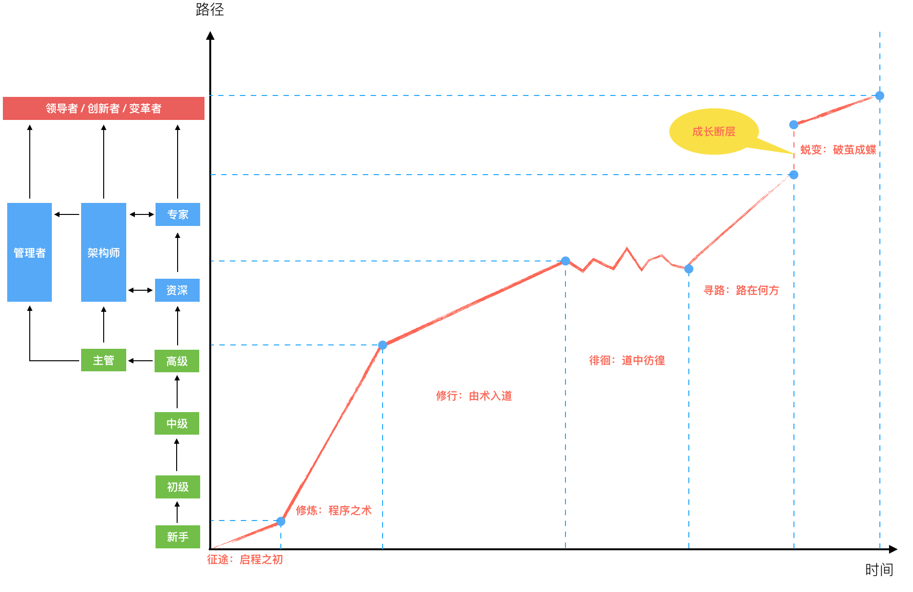

# 程序行知：走在同样的路上，遇见自己的风景

因为这是一个关于路径与行路的专栏，所以也就否定了另一面：它不会提供某一类具体的知识，并且由浅入深地去指导学习。

后面这一类知识，我称之为 “技能性知识”，需要你在日常的学习和工作中勤学苦练，练成之后你就会成为某一类问题的 “解答题高手”。

但前一类是关于路径选择和自我认知的知识，它能让你在成长的不同阶段重新认识自己，因为 “知” 从而改变你的 “行”。**有时选择对了合适的路，比光顾着赶路要重要得多。**

在这条成长的路径上，有期待、有坚持、有故事，也会有迷茫，以及最后穿越迷雾的曙光。而这个专栏的内容正是关于成长路径的，这条路径在我脑海里已形成了清晰的画面，现在我就把它画了出来，如下图：

这是一条成长线的表意图，有两个部分：图上左侧的路径，是匹配不同成长阶段，对应不同职业角色；右侧是一条由不同成长阶段组成的成长线，包括如下：

1. 征途：启程之初
2. 修炼：程序之术
3. 修行：由术入道
4. 徘徊：道中彷徨
5. 寻路：路在何方
6. 蜕变：破茧成蝶

“启程之初”，是你刚踏上程序之路面临的一些问题和感悟。“程序之术”，是你工作早期的主要内容，以修炼编程技能为主。除了编程写代码，还有很多其他的内容，这是另外一个维度的修行之路，也即 “由术入道”。

工作数年，成长到一定阶段，你可能会面临一个成长平台期的困扰，在此就进入了 “道中彷徨” 的徘徊期。这些困扰和彷徨很多都关乎选择，这期间是你发出 “路在何方” 之问的寻路期。最后，你坚定了道路，继续前行，前面的路上还有一道 “断层”，突破之后你将会蜕变，最终 “破茧成蝶”。

最后，你将会收获什么？我想会有如下一些方面：

- 建立技术学习的体系框架与思维模型
- 梳理清晰的成长与进阶路线
- 扫清成长路上的迷茫与障碍
- 形成明确的自我定位与认知

它也许会是一扇观察的窗口，一张行路的地图，一瓶回血的苦药，一份认知的启发。其始于 “知”，需终于 “行”，在行走的道上，会有崎岖与气馁，希望能在这里，帮你找到未来的方向，给予指引；找到有效的方法，破除障碍；找到理想的自我，获得力量。

前路很长，而专栏的时间很短，希望我们有缘一起走上一程：走在同样成长的路上，遇见自己憧憬的风景。

