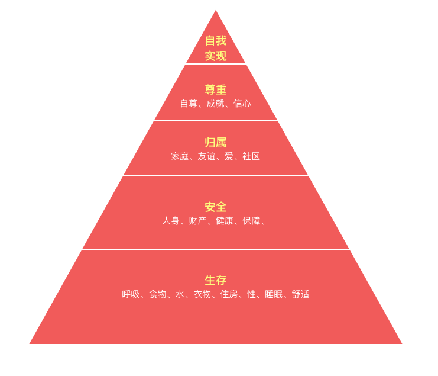

# 根源：计划的愿景——仰望星空

在前面第 2 章节 “程序之术” 中，我已把对“设计”“编程”和“Bug”的思考与理解都分享给你了。今天开始进入第 3 章节，是关于成长修行中 “由术入道” 的部分，而“道”的维度众多，我就先从和个人成长最直接相关的 “计划体系” 讲起。它会有助于你一步一步走向你“理想的自己”，所以可别小看它的重要性。

我想你肯定做过计划，我也不例外。一般在开始一件中长期的活动前，我都会做计划，但更重要的是反问为什么要做这个计划，因为计划是抵达愿望的途径。如果不能清晰地看见计划之路前方的愿景，计划半途而废的概率就很大了。

古希腊哲学家苏格拉底有一句名言：“未经检视的人生不值得活。”那么我们为什么要检视自己的人生呢？正是因为我们有成长的愿望，那么愿望的根源又到底是什么呢？

## 需求模型

上世纪四十年代（1943 年）美国心理学家亚伯拉罕·马斯洛在《人类激励理论》中提出了需求层次理论模型，它是行为科学的理论之一。

该理论认为个体成长发展的内在力量是动机，而动机是由多种不同性质的需要所组成，各种需要之间，有先后顺序与高低层次之分，每一层次的需要与满足，将决定个体人格发展的境界或程度。 其层次模型的经典金字塔图示如下：

马斯洛的经典金字塔图：需求层次模型

在人生的不同阶段，会产生不同层次的目标需求。

在人生的早期，我们努力学习，考一个好大学，拥有一技之长，找一份好工作，带来更高薪的收入，这很大程度都是为了满足图中最底层的生存需求，让生活变得更舒适美好。

成长拼搏数年，事业小成，工作稳定，有房，有车，有娃后，第二层次，也就是安全的需求开始凸显。有人在这阶段开始给自己、父母、老婆、孩子都买人寿保险，开始考虑理财，投资甚至强身健体。然而处在这个阶段时，我却有一种强烈的不安全感，这也许和长年的程序员职业经历养成的习惯也有关系。

我们做系统应用服务时总是需要考虑各种意外和异常事件发生，一般至少提供主备方案。于人生而言，保持持续学习，与时俱进，追求成长，这其实也是一种主备方案：主，指当前支撑生活的工作；备，是通过持续学习，同步成长，保持核心能力的不断积累与时间的付出来获得一份备份保障，以避免 “主” 出现意外时，“备” 的能力已被时代淘汰。

需求金字塔底部两层属于物质层次的 “经济基础”，而再往上则进入了更高精神层次的 “上层建筑”。就个体而言，高层次需求要比低层次需求具有更大的价值。在 “生存” 和 “安全” 基本满足的保障基础之上，我们才会更从容地向内求，更多地探求内心，进而向外索，对外去探索、发现和建立不同的圈层关系，以满足上层的社交 “归属”、获得 “尊重” 与 “自我实现” 的需求。

马斯洛把底层的四类需求：生存、安全、归属、尊重归类为 “缺失性” 需求，它们的满足需要从外部环境去获得。而最顶层的“自我实现” 则属于 “成长性” 需求。成长就是自我实现的过程，成长的动机也来自于 “自我实现” 的吸引。就像很多植物具有天生的向阳性，而对于人，我感觉也有天生的 “自我实现” 趋向性。

人生最激荡人心的时刻，就在于自我实现的创造性过程中，产生出的一种 “高峰体验” 感。正因为人所固有的需求层次模型，我们才有了愿望，愿望产生目标，目标则引发计划。

## 生涯发展

在攀登需求金字塔的过程中，我们创造了关于人生的 “生涯”。而 “生涯” 一词最早来自庄子语：

> 吾生也有涯，而知也无涯。以有涯随无涯，殆已。

“涯” 字的原意是水边，隐喻人生道路的尽头，尽头已经没了路，是终点，是边界。正因如此，人生有限，才需要计划。著名生涯规划师古典有一篇文章《你的生命有什么可能？》对生涯提出了四个维度：高度、宽度、深度和温度。这里就借他山之玉，来谈谈我的理解。

- 高度：背后的价值观是影响与权力。代表性关键词有：追逐竞争、改变世界。
- 深度：背后的价值观是卓越与智慧。代表性关键词有：专业主义、工匠精神。
- 宽度：背后的价值观是博爱与和谐。代表性关键词有：多种角色、丰富平衡。
- 温度：背后的价值观是自由与快乐。代表性关键词有：自我认同、精彩程度。

每个人的人生发展路线都会有这四个维度，只是不同人的偏好、愿望和阶段不同导致了在四个维度分布重心的差异。在不同维度的选择，都代表了不一样的 “生涯”，每一种 “生涯” 都需要一定程度的计划与努力。

虽有四种维度，四个方向，但不代表只能选其一。虽然我们不太可能同时去追求这四个维度，但可以在特定的人生不同阶段，在其中一个维度上，给自己一个去尝试和探索的周期。所以，这就有了选择，有了计划。而计划会有开始，也会有结束，我们需要计划在人生的不同阶段，重点开始哪个维度的追求，以及大概需要持续的周期。

人生本是多维的，你会有多努力、多投入来设计并实现自己的生涯规划呢？不计划和努力一下，也许你永远无法知道自己的边界和所能达到的程度。

上世纪七十年代初，一个文学专业成绩很一般的学生毕业了。他虽然喜欢读文学作品却没写出过什么东西，毕业后就结了婚，和老婆开了个酒吧，生意不错，生活无忧。到了七十年代末，他似乎感受到某种 “召唤”，觉得应该写点什么东西了，于是每天酒吧打烊后，他就在餐桌上写两小时的小说，这一写就写了三十多年。熟悉的人想必已经知道他是谁了？对，就是村上春树。

所以，总要开始计划做点啥，你才能知道自己的 “涯” 到底有多远；而计划就是在系统地探索生涯，甚至人生的无限可能性。

## 回首无悔

关于后悔，有研究说：“我们最后悔的是没做什么，而不是做过什么。”回味一下，这个结论也确实符合我们的感觉。

万维钢写过一篇文章《决策理性批判》，里面引用了一个最新（2018）的关于后悔的研究，这个研究从 “理想的自己” 与 “义务的自己” 两个角度来说明：

> “理想的自己” 就是你想要成为什么人。
>
> “义务的自己” 就是你应该干什么。

若放到前面马斯洛需求金字塔中，“理想的自己” 就是站在顶端 “自我实现” 位置的那个自己；而 “义务的自己” 正在金字塔下面四层，挣扎于现实的处境。如果你从来没有去向 “理想的自己” 望上一眼，走上一步，将来终究会后悔的。事实上，研究结论也证明了这点：70% 以上的人都会后悔没有成为 “理想的自己”。

当我把自己进入大学以后的这十八年分作几个阶段来回顾时，有那么一段的好多时间我就是那样浑浑噩噩地混过去了，以至于现在回忆那段日子发现记忆是如此的粘连与模糊。后悔么？当然。

如果我能好好计划一下那段日子，也许会得到一个更 “理想的自己”。而在最近的这一段，我也感谢好些年前 “曾经的我”，幸运兼有意地做了一些计划。虽然一路走来，有些辛苦，但感觉会充实很多，而且如今再去回首，就没有太多后悔没做的事了。

计划，就是做选择，你在为未来的你做出选择，你在选择未来变成 “谁”。如果你还在为今天的自己而后悔，那就该为明天的自己做出计划了。

人生的征程中，先是恐惧驱动，地狱震颤了你，想要逃离黑暗深渊；后来才是愿望驱动，星空吸引了你，想要征服星辰大海。

逃离与征服的路，是一条计划的路，也是一条更困难的路，而 “你内心肯定有着某种火焰，能把你和其他人区别开来” 才让你选择了它。

最后，你想去到哪片星空？你为它点燃了内心的火焰了吗？

