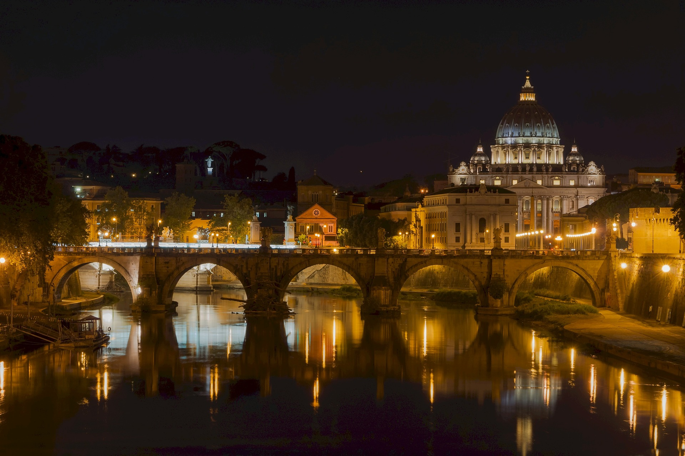

# 时间：塑造基石习惯（上）——感知与测量

至此，咱们专栏已用 4 篇文章分享了我关于“精进思维”这个主题的理解与思考，期待以后你能得心应手并游刃有余地持续进阶。

接下来，咱们专栏又会进入一个新的主题：**习惯**。习惯的重要性想必你也很了然于胸了，习惯的养成，是让成长无意识自然发生的关键。然而习惯对于成长的具体作用是怎样的呢？

想必你也知道，养成好的习惯能帮助我们更快地成长，而在所有的好习惯中，关于时间的习惯是其中的基础，我称之为 “基石” 习惯。如果你的时间习惯不好，那你做其他事情的效率往往也就不高。

那么，该如何塑造好时间这块 “基石”呢？我觉得在有效地应用之前，先需要精确地感知与测量。

## 感知时间

有时，我们觉得时间过得很慢，慢如从周一到周五；有时，又会觉得时间飞逝，快到十年间一恍惚就过去了。

当我站在十年后的这端看十年前的那一端，会惊讶地感叹：啊，时间过得真快！再把时间往前推一点，十多年前，将从学校毕业，走上社会工作岗位，我当时有想过十年后会如何吗？有过怎样的畅想呢？我依稀记得应该是畅想过的，才刚毕业怎么可能不畅想一下即将走出校园，怀揣理想，人生豪迈，激情万丈的未来之路呢？

对，我确实畅想过，可遗憾的是我只能模糊记得有过畅想这回事，而到底畅想过什么具体的内容，却大多记不太清了。唯一还有印象的是，毕业前夕的一个凌晨，月挂高空，星光惆怅，一屋子的室友在校园的花台前，喝着啤酒，畅谈明日的分离，未来将会如何如何，十年后我们还会相约在此见面，再分享一下彼此的人生。

十年过后，当时也有同学记起这个约定，就号召大家再回校园共聚一场。而我却未能赴约，当时正好孩子出生尚在医院，现实的粘连总会拖住理想的浪漫。江湖侠客分别时总喜欢说句：十年之后我们再会于此，就此别过，后会有期。可实际，很多别过都是后会无期的，我们从来不是侠客只是凡人，谁又能轻易承诺得了十年之约。

我还能记起这个看似简单的十年之约，却已然记不起当初对未来十年之路作过何样的畅想与规划。苦苦回忆之后，只觉得当初作为一名软件工程专业的毕业生是清晰地知道最近的将来是会成为一名程序员的，而对于程序员的未来我当初应该想的就是架构师吧。

也许当时我觉得架构师就是一个程序员的顶点，是我能看得到的顶点。而实际情况是这个架构师的称呼也只是当时我从几本翻译的国外技术书籍中的人物介绍中看来的，到我实际工作后却发现前三、四年所在的两个公司都没有架构师这个职位。理论上来说当时我应该感到迷茫，实际却没有，可能因为觉着还太遥远，所以我就不管不顾地走在当下的路上，活在当下。

当你对生活有某种期待与畅想，却又觉得明天实现不了，三个月也实现不了，一年后大概还是实现不了，然后可能你就会不由自主地想大概十年后也许就能实现了。你会以为十年很长，把现在的期望与畅想交托给十年后的未来。

十年也许是一个足够长的时间，长到对个人来说很难去做一个十年的计划，所以我们就这样经常把很多很多的期待放在了十年后，把期待交给了时间。

所以，当我再次回顾彼时彼刻，虽然想不起太具体的当初对十年后期待的内容，但我依然能感受到当初对十年后充满期待的感觉到今天并没有实现。虽然今天我已经是一名架构师了，但这只是我昨日期待中的很小一部分，是我还能记得的具体的一部分。

更大的一部分只剩下一个感觉，我甚至怀疑当初从未仔细地把这部分感觉具象化，所以导致我现在的记忆中只剩下一种感觉。这里再打个比方，若十年时间是一个人，我当初把一个期待的感觉托付给了她，十年后再见时，她依然还了我一个一样的感觉；如今我知道这怪不了她，她并非无所不能，只是我未曾很好地了解她。

“时间如流水，从我们的指缝间悄悄流走；如轻烟，被微风吹散了；如薄雾，被初阳蒸融了”，这些中学语文课本上的关于时间的比喻，突然就从我的脑海中冒出来。时光无形，如流水、轻烟、薄雾，要想精确地感知它可不容易。

从 30 到 40 岁的这十年我已经行程大半，突然就生出一种这十年似乎走得更快了的感觉，怎么一下就过了大半了，而 20 到 30 岁却明明觉得过了好久呀。20 岁之前我们才刚刚经历对中学的告别，此后很多小伙伴可能就将永远只活在我们的记忆中了。但没过几年我们又将经历另一次告别，对校园的告别。曾经的青春呼啸，江河奔流，未曾来得及说一声道别已志在四方了。

一段又一段的校园恋情开始又结束，也许每一段我们都曾觉得刻骨铭心像延续了一生一般，实际不过匆匆几年。后来终于在职场上找到了最后的归属，走入婚姻的殿堂，安置幸福的蜗居，生下一个让你头疼的要命却又羡慕的要死的小家伙，人生的大事就这样一件接一件地完成了。然后一回首发现站在了 30 岁的门槛边，感慨原来这十年我做了这么多事啊，生出一种 “而立” 的感觉。

迈过三十之后，七年瞬息而过，一回首却想不起什么激动人心的大事了呢？曾经在知乎上看到个问题：“为何人随着年龄的增大觉得时间过得越来越快？”这个问题的几句答案，解答了我多年以来的困惑：

> **有共性的回忆趋向粘合在一起，标志性的回忆倾向于鹤立鸡群**。心理学家认为：我们对时间的感知同时和我们的经历有关。如果一件事对于我们来说是 “激动人心” 的，这样的记忆在我们脑海中感觉到的时间会更长。

确实，从 20 到 30 岁经历的每一件人生大事之于我们都是激动人心且独一无二的，自然在我们的记忆中就 “鹤立鸡群” 了，而三十之后就好像缺少了一些这样的大事。生命的精彩程度在慢慢下降，自然没有那么多激动人心的记忆了。

对时间的感觉就这样，粘连在一起，如轻烟般飘走了。

## 测量时间

正因为我们对时间的感知非常模糊而不精确，若想更有效率地用好时间，就需要更精确地测量它。

有一本书叫《奇特的一生》，主要是关于一位苏联科学家柳比歇夫的故事，他通过自创的 “时间统计法” 在一生内取得了惊人的成就。而我在遇到这本书之前，已经在使用一种类似的方法：**我会记下一年来经历的所有有意义的事件（除去每日的例行工作），我称之为 “时间日志”**。

我按每周来记录，每周里面有每天的事件记录和所花费的时间。这个 “时间日志” 的习惯其实源自我小时候养成的记账习惯，那时钱不多就想知道钱花在哪里去了。现在其实都不怎么记金钱的账了，而是记时间的账。方法类似，把记金额明细改成了记时间明细，借此以追踪我的时间都花在哪里去了。

记金钱的消费明细的一个副作用是容易让人变得 “小气”，所以我也一直担心记时间明细是否也有什么不好的副作用。但实践了好几年下来，发现并没有什么明显的坏处，唯一需要的是额外多付出一点点微小的时间成本，但这个记录与测量时间的实践好处却是明显的：

> 它会使你对时间的感觉越来越精确。每个人都感觉 “时间越过越快”，为什么会有这样的感觉？这种感觉会使得我们产生很多不必要的焦虑。而基于 “事件 - 时间日志” 的记录可以调整你对时间的感觉。在估算任何工作时，都更容易确定 “真正现实可行的目标”。

是的，这就是关于时间的第一个 “基石” 习惯，**在精确地感知与测量时间之后，你才可能更准确地“预知” 未来**。

站在当下这端实际是很难看清未来的另一端的，因为存在太多的可能情况。在一部叫《彗星来的那一夜》的电影中假设了这种场景，一个人有很多种平行分支的存在，时间经过的部分形成了稳定的唯一一个版本。

也许，过去的十年你也像我一样，曾站在起点却看不清十年后的终点。而现今，我总会想象站在每一个未来可能的终点去审视当前的自己、当下的决策与行动，就会得到一个完全不一样的理解，从此开启完全不一样的平行分支。

**过去的你也许不曾是时间的旧爱，但未来的你可以成为时间的新欢。**

下篇，我会继续分享切割 “时间原石” 与构建时间基石习惯的方法，敬请期待…

# 时间：塑造基石习惯（下）——切割与构建

上篇，我讲述了关于建立时间习惯的第一步：**感知与测量**；之所以需要先感知与测量，就是为了更好地了解你的时间都花在哪里去了。

下一步，**为了更有效地利用好你每天有限的时间，就需要你重新审视并调整你的时间切割与构建方式**。

## 切割时间

时间无形，逝去匆匆，如流水、轻烟、薄雾，类似这样的比喻把时间看成无形的东西，不容易抓住和把握。但这样的比喻把时间看作了物质，物质有三态，所以轻烟也好，流水也罢，总是可以变成固态来使之更容易把握与塑造。

是的，我想说的就是转换一下你看待时间的方式，有人把它看作流水，任其从指间溜走，你却可以把它看作石头，用它去塑造什么。

一般二十岁出头我们离开校园开始工作，十年穿梭而过后，就至三十岁。古人说，“三十而立”，“立”的又是什么？无意间翻到一本旧书《大教堂与集市》，这是一本探讨程序员如何构建软件系统的书，颠覆传统，影响深远。但作为一名工程师、创建者，难道心里没有一座属于自己的大教堂？三十而立，有人也许三十已经立起了属于自己的大教堂，而有人，也许如你我，才刚刚为心中的大教堂破土奠基。

程序员有时爱把自己的工作比作 “搬砖”，有个流行的关于“搬砖”的故事，大概是这样的：

> 两个工人正在工地搬石头，一个路人正好走过，就问他们在做什么？
>
> 第一个工人说：“我在把石头从这边搬过来，并垒在一起。”
>
> 第二个工人说：“我在盖一座华丽的教堂，盖好后，你再来欣赏我的作品。”

这个故事想说明的是，虽然两个工人都在干同样的 “搬砖” 工作，但第二个工人心中有一座大教堂，也许 “搬砖” 对他的意义就会有所不同。有时想想，过去的每一天、每一刻，难道我们不是都在搬石头吗？只不过，有些石头会被用来修建心中的大教堂，而另一些石头，我们只是拿起来把玩、欣赏。

璀璨剔透的钻石，五彩斑斓的宝石，所有这些美丽、诱人的石头吸引着我们把时间花在去欣赏、迷恋它们，渐渐地就遗忘了，原来曾经我心中还有一座大教堂要建造啊，最后我们无意或有意地避开去搬起那些建造大教堂的沉重石块。

后来当时间过去，我回过头来看，在感叹别人雄奇的大教堂时，发现自己曾经把时间这块原石，切割成了一些看上去漂亮却没用的鹅卵石，更甚者只是切成了一堆土块，最后风化为一堆沙尘。所以，如今我再来看时间时，我更愿把它们切割成用来建造大教堂的石材。

记录测量时间，让我对时间的感知更精确，而面对自然产生的每天一块的“时间原石”，每个清晨就要确定：把它切成什么样？由哪些石块组成？哪些是用来建造大教堂的石材？确定后，将其压在心上，临睡前再记录下今天从心上搬走了哪些石块，以及花了多少时间。这样时间于我就真的变成了一块块石头，比轻烟、流水、薄雾更有形，更易抓住，也没那么容易悄悄地溜走了。

每天搬的石头，不一定都适合建造大教堂，而建造大教堂的时间也可能比我们预期的要长。

位于梵蒂冈的圣彼得大教堂的建造过程前后历时 120 年，由米开朗基罗设计，而文艺复兴时期的大师基本都曾参与其设计。

圣彼得大教堂

而建造历时最长的是德国的科隆大教堂，于公元 1248 年 8 月 15 日动工，从这天起，漫长的修建科隆大教堂的道路开启。600 多年后，到 1880 年 10 月 15 日，这座荣膺当时世界最高建筑物的科隆大教堂举行了盛大的竣工典礼，成为建筑史上最杰出的成就之一。

科隆大教堂

如今看到这些雄奇、壮观、让人赞叹的大教堂，再感受到建造它们的历史过程，就能真切地感觉到时间是如何被切割成了一块块的石材，构建成了最后的大教堂。

这就是关于时间的第二个 “基石” 习惯：**将时间切割成建造你心中“大教堂”的合适“石材”**。

## 构建方式

切割了时间，得到了合适的“石材”，你还需要确定适当的构建方式。

而适当的构建方式，是指在时间的 “基石” 习惯之上，建立其他的习惯。比如，好些年前开始，我会从每周的时间里切出来一块，专用于写作，慢慢就形成了写作的习惯。这意味着，我从现有的 “时间石材” 中拿出了一部分，用于构建写作的习惯，然而 “时间石材” 的总量是有限的，我必须在其上建立有限数量的习惯，我得做出选择。

每一个习惯的构建成本是不同的，甚至同样的习惯对不同的人来讲，构建成本也是不同的。比如，跑步这个事，对有些爱运动的人来说就是每天跑或每周跑几次的习惯，而于我而言，建立跑步这个习惯，从心理到生理都有更大的消耗。

任何行动的发生，都需要两种努力才有可能：第一种，是行动本身固有需要的努力，如跑步，跑一公里和跑十公里固有需要的努力是不等量的；第二种，指决策是否执行这种行动的努力，决定跑一公里还是跑十公里的决策意志力消耗，我想也不会一样。

**构建习惯的目的，以及它们能起作用的原因在于：它能消除行动中第二种努力的决策消耗。**

我之所以选择构建写作习惯而不是跑步习惯的原因是，对一个像我这样的程序员而言，写文章和写代码的感觉很接近，它就好像是一种刚好在程序员的能力边界线外不远处的事情。这样，写作行动所需要付出的两种努力，感觉都还在可以应对的范围，属于能力边界附近不远的事情，也是正适合用来扩张能力边界的事，有一种挑战的刺激感，又不至于望而生畏。

电影《功夫熊猫 3》里，师父对阿宝说：

> 如果你只做能力范围内的事，就不会成长。

所以，在时间 “基石” 习惯之上构建的习惯应该是你能力范围之外的行动。如果一项行动通过习惯慢慢变成了能力范围之内的事，那么你以后再去做类似的事，其实就不需要再付出什么决策努力了，也就不再需要习惯来帮忙了。

有时，习惯会让你产生日复一日、年复一年做一件事的感觉，这样日积月累下来消耗了大量的时间，但付出了这么多未必会产生真正的收获。怎么会这样呢？

**习惯，它的表象和形式给人的感觉是在重复一件事，但它的内在与核心其实是不断产生交付，持续的交付。**

好多万年前，人类的蛮荒时期，还没有进入农业社会，人类是如何生存的？那时的人类，以采集和狩猎为生，每天年轻力壮的男人负责出去狩猎和采集野果，女人则在部落内照料一家老小。这就是进化史上，自然选择让人类养成的共同习惯，并且这个习惯持续了数十万年。

采集与狩猎这个行动习惯的核心就是必须每天产生交付，得有收获，否则一家老小都得饿肚子。而像狩猎这样的活动，就需要高度集中的注意力、熟练的技能运用和瞬间的爆发，它需要狩猎者所有的感官都高度专注在猎物的运动上，并随时调整适应猎物的运动变化。而采集，就需要采集者不断扩大或走出熟悉的边界，因为熟悉的地方可能早就没了果实，而陌生的地界又可能潜藏着未知的危险。

这样的行动习惯，通过数十万年的进化，甚至已经刻画在了我们的基因中。这就是我想说的，**如果你要构建一个习惯，就要运用好基因中本已存在的关于 “采集和狩猎” 的本能：高度专注，跨出边界，持续交付**。

末了，我把上、下两篇的内容一起提炼总结为如下：

- 要形成时间习惯，要通过有意识的感知和测量来发现时间是怎么流失的。
- 要完成建设你心中 “大教堂”，要通过切割 “时间原石” 来完成 “时间石材” 的准备。
- 在养成了时间的基石习惯之上，挑选和构建其他习惯来完成 “大教堂” 的持续建设与交付。

世界上多一些 “大教堂” 会变得更美好，不是吗？

关于时间，你也可以回忆一下过去的数年间，有哪些让你激动不已的时刻？曾经梦想的 “大教堂” 开始破土奠基了吗？欢迎你留言，我们一起分享和探讨。

