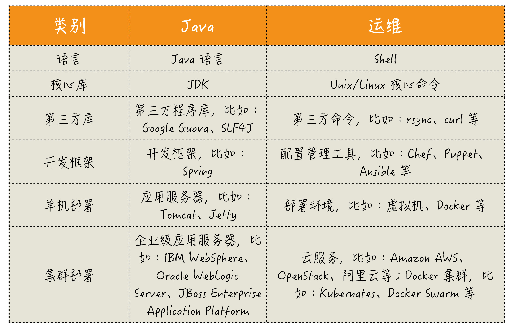
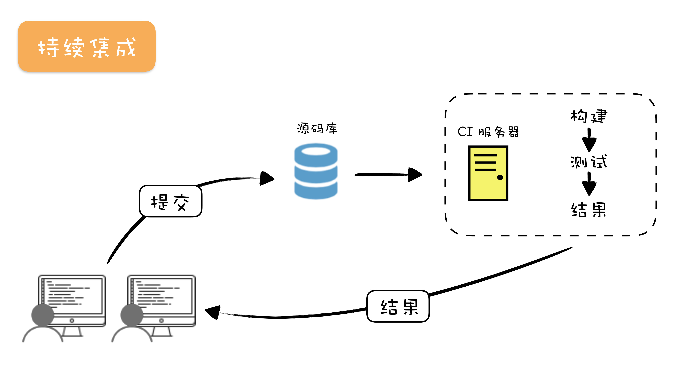
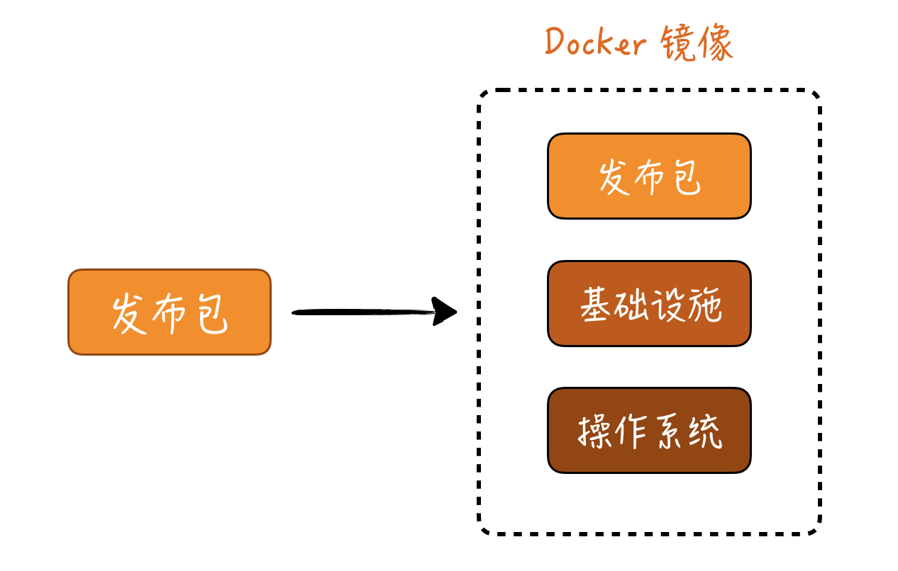
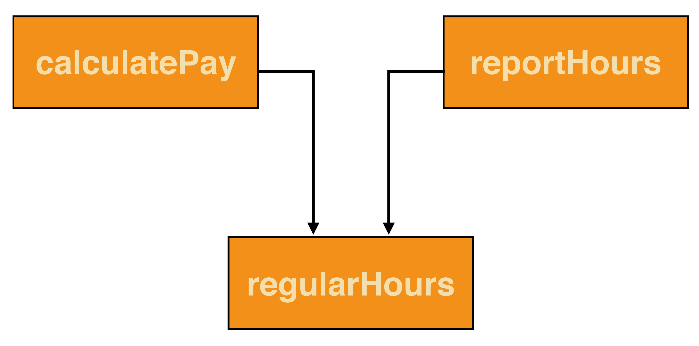
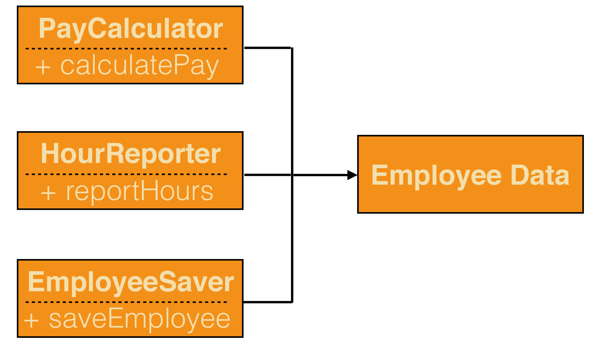
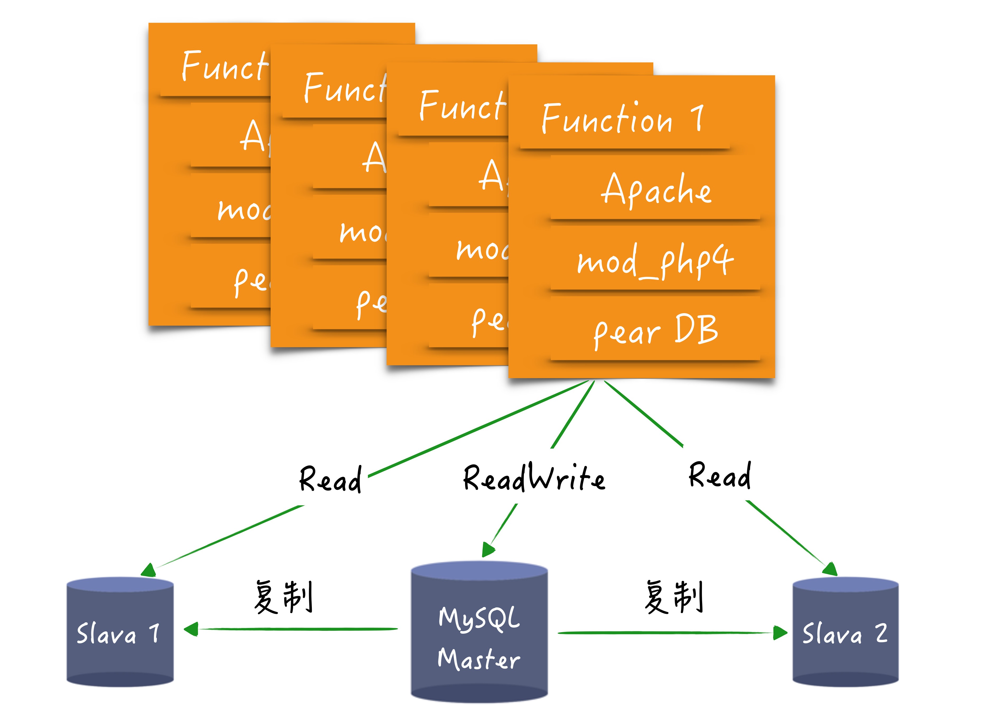
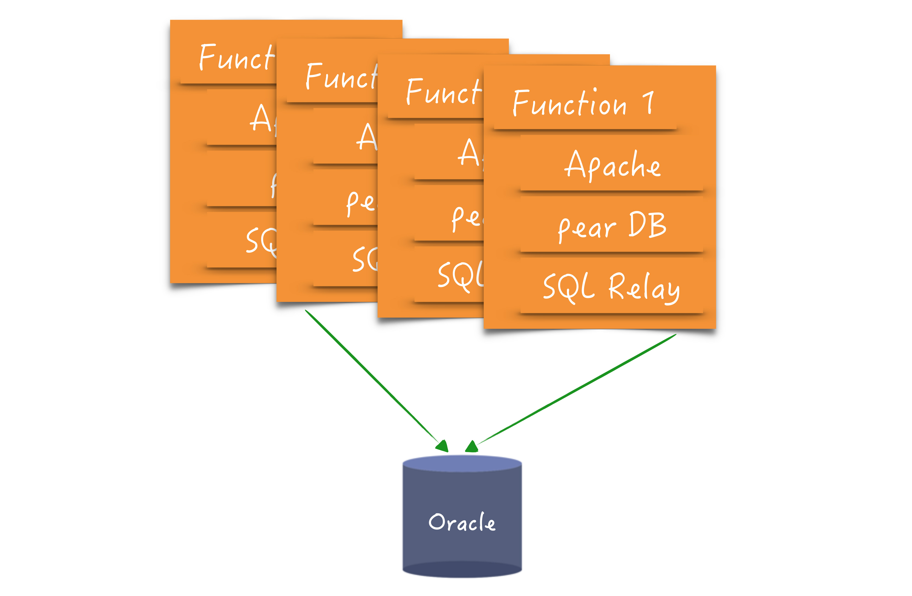

# 自动化

请谨慎地将工作自动化。

将你的工作过程自动化

有体系的学习运维知识。

将部署纳入开发的考量。

将验收测试自动化

把函数写短。

构建好你的领域模型。

用简单技术解决问题，直到问题变复杂。

学习领域驱动设计。

锤炼你的重构技能。


# 懒惰（谨慎自动化）

每每提及自动化，我就会想起 Perl 语言的发明人 Larry Wall 一个经典叙述：优秀程序员应该有三大美德：懒惰、急躁和傲慢（Laziness, Impatience and hubris）。

有人甚至为此专门打造了一个三大美德的网站，阐释这个初看起来匪夷所思的说法。

> 懒惰，是一种品质，它会使你花很大力气去规避过度的精力消耗，敦促你写出节省体力的程序，别人也能很好地利用，你还会为此写出完善的文档，以免别人来问问题。

> 急躁，是计算机偷懒时，你会感到的一种愤怒。它会促使你写出超越预期的程序，而不只是响应需求。

> 傲慢，极度自信，写出（或维护）别人挑不出毛病的程序。

不知道你是否感受到，程序员独有的幽默和透露出的那种骄傲：我做的东西就应该是最好的。

之所以要从 Larry Wall 的这段话开启“自动化”这个模块，因为只要一说到自动化，我就会情不自禁地联想到“偷懒”这个词。是的，我们程序员的工作，本质上就是打造各种自动化的工具，让人们从各种繁复的工作中解脱出来，让人有机会“偷懒”。

不过，我也知道，从机器那里偷来的“懒”很快就被更多的工作填满了。但 Larry Wall 的这段话却可以鼓励我们不断地打造出更好的工具。

作为程序员，你当然知道“自动化”这件事的价值，在日常工作中，也实实在在地践行着打造自动化工具的任务，但很多人对自动化的理解可能有些单薄。今天，我就从一个你可能会忽略的主题开始讨论：不要自动化。


## 不要自动化

我先给你讲一个让我印象深刻的“不自动化”的例子。

之前在 ThoughtWorks 工作时，我们有一项工作是，帮助其他公司启动一些新产品。有一次，我的两个同事被一个公司请去启动一个视频网站的项目。那时候还不像如今的市场，已经由几大视频网站瓜分完毕，当时不少公司看到了视频网站的苗头，觉得自己有机会。这个来请我们的公司也不例外，觉得自己也能分一杯羹。

两个星期之后，我的两个同事回来了。我们饶有兴趣地去问项目的进展，因为项目启动之后，通常会有后续的开发合作，但结果令我们很意外，这个项目停止了。

“出了什么状况吗？”我们问。

“是我们建议用户停掉这个项目的。”他们回答到。

我们“恨恨地”问他们为什么丢掉了一个这么重要的机会。这两个同事的回答也很直白，他们结合着客户的想法算了一笔账：这个项目需要大量的资金投入，投入规模之大，是超出客户想象的，按照现有的规划投入，这个项目肯定会亏本。要么重新规划，要么取消这个项目。客户认真研究了一番，最终决定取消项目。

这件事大约发生在 10 年前，今天我们都看到各大视频网站在烧钱上的投入，以那个公司的实力，想要参加这场比拼，确实还差太多。

这件事之所以给我留下深刻印象，因为它是我职业生涯中见到的第一个通过“主动取消项目”获取项目成功的案例。

或许你不能理解我这里所说的“项目成功”。在我看来，**做有价值的事是重要的，这里面的有价值，不仅仅是“做”了什么，通过“不做”节省时间和成本也是有价值的**。我的两个同事阻止了客户的浪费，所以，我将这个项目视为成功。

对于开发来说，也遵循同样的道理。程序员这个群体技术能力实在太强，做一个技术方案简直是太符合直觉的做法，我们就是忠实地把一个个需求做出来，把“全世界”都自动化了。

但事实上，这个世界太多的浪费就是做了不该做的东西。在我们的专栏里，我反复地说，我们要多问问题，目的就是为了不做那些不该做的事。


## 小心 NIH 综合症

你可以从需求的角度判断哪些工作是可以不做的，但我们也要防止程序员自己“加戏”，我再给你讲一个技术人员普遍存在的问题：NIH 综合症（Not Invented Here Syndrome）。

NIH 是什么意思？就是有人特别看不上别人做的东西，非要自己做出一套来，原因只是因为那个东西不是我做的，可能存在各种问题。

这种现象在开源之前尤为流行，很多公司都要做自己的中间件，做自己的数据库封装。虽然很多公司因此有了自己特色的框架，但是因为水平有限，做出来的东西通常极为难用，很多人一边骂，一边还要继续在上面开发。

开源运动兴起之后，我以为这种现象会好一些，但事实证明，我想多了。

比如，这种乱象在前端领域也出现了，各种各样的框架，让很多前端程序员哭诉，实在学不动了。再比如，我曾经面试过一个接触 Go 比较早的程序员，他就是恨不得把所有框架都自己写。

因为他学 Go 的时候，确实框架比较少，但问题是，如今的 Go 已经不是他学习时的那个 Go 了，现在各种框架已经很丰富了，不需要什么都自己做。当时我问他，如果有一天你离开了，公司怎么办呢？实际上，他从来没考虑过这个问题。

说了这么多，无非就是想说明一件事，写代码之前，先问问自己真的要做吗？能不做就不做，直到你有了足够的理由去做。对应到 Larry Wall 的说法，你要懒惰，花大力气去规避精力消耗。


## 做好自动化

说完了不要自动化的部分，再来说说要自动化的部分。

我还是先从你可能会忽略的问题入手，**你的日常工作是给别人打造自动化，但你自己的工作够自动化吗？**还是问一个更具体的问题吧！如果你写的代码要上线，会经过怎样的过程？

我先给你看一个极其糟糕的例子。刚开始工作不久，我有一次出差到客户现场。临近下班时，我发现了程序的一个 Bug。在那个年代，我们的程序是按照官方推荐做法编写的 EJB（Enterprise JavaBean），今天很多年轻的程序员可能不了解了，它只有部署到应用服务器才能运行。

我的解决方案就是加上一些打印语句，然后部署到应用服务器上，看输出的结果，再加上另外一些语句，再部署，如此往复。那时我们完全是手工打包上传，每次至少要十几分钟。最终，定位到了问题，只修改了一行代码。但几个小时的时间就这样被无谓的消耗了。

那之后，我花了很长时间研究怎么做自动化的增量部署，最终让这个过程简化了下来。但这件事对我的影响很大，这是我第一次认识到一个部署过程可能对开发造成的影响，也让我对自动化在开发过程内的应用有了属于自己的认识。

相比于我刚开始工作那会。现在在工具层面做类似的事已经容易很多了，在后面的内容中，我会结合着具体的场景介绍一下现在的最佳实践。


## 你要懂得软件设计

最后，我们再来说说我们的本职工作，给别人打造自动化工具中需要的能力：软件设计。

软件设计，是很多人既熟悉又陌生的一个词，说熟悉，很多人都知道，做软件要设计，还能顺嘴说出几个设计模式的名字；说陌生，是因为在我的职业生涯中，遇到真正懂软件设计的程序员少之又少。**大多数人都是混淆了设计和实现。**

举个例子。有一次，我要在两个系统之间做一个连接器，让上游系统向下游系统发消息，或许你一听就知道了，这里需要的是一个消息队列。但实际上，我们需要的能力要比消息队列更丰富一些，比如，要将重复的消息去除。一个同事给我推荐了 Kafka 当作这个连接器的基础，我欣然地接受了。

不过，在后续设计的讨论中，我们就经常出现话语体系的分歧。我说，这个连接器要有怎样的能力，他会说 Kafka 能够如何如何。究其根因，我在讨论的是设计，而他说的是实现，所以，我们两个很难把问题讨论到一起。

为什么我会如此看重设计呢？**在软件开发中，其它的东西都是易变的，唯有设计的可变性是你可以控制的。**

同样以前面的讨论为例，尽管 Kafka 在当下比较火热，但是我不敢保证 Kafka 在未来不会被我换掉。因为就在几年前，消息队列还是传统中间件的强项，现在也渐渐被人淡忘了。

我不想让我的设计随着某一个技术选型而不断摇摆。如果工作许多年，知识体系只能靠各种新框架新工具支撑，我们做程序员就只剩下疲于奔命了。不懂软件设计，只专注各种工具，其结果一定是被新技术遗弃，这也是很多人经常抱怨 IT 行业变化快的重要原因。

回到 Larray Wall 的说法上，你要想写出一个别人挑不出毛病的程序，你先要懂得软件设计。幸运的是，软件设计这些年的变化真不大，掌握了软件设计再来看很多框架和工具，学习起来就会容易很多。在这个模块的后半部分，我会与你探讨软件设计的话题，降低自己给自己挖坑的概率。


## 总结时刻

Perl 语言的发明人 Larry Wall 曾经说过，优秀程序员应该有三大美德：懒惰、急躁和傲慢（Laziness, Impatience and hubris）。想要成为一个优秀的程序员，就要让机器为自己很好地工作，而这需要对自动化有着很好地理解。

我们学习自动化，先要知道哪些东西不要自动化，尽最大的努力不做浪费时间的事。一方面，我们要从需求上规避那些没必要做的事；另一方面，我们也从自身防止 NIH 综合症（Not Invented Here Syndrome），争取做一个懒惰的程序员。

对于要自动化的事，我们需要反思一下，在为别人打造自动化工具的同时，我们自己的工作过程有没有很好地自动化。而如果我们想拥有打造良好的自动化工具，我们需要对软件设计有着充分地理解。

如果今天的内容你只能记住一件事，那请记住：**请谨慎地将工作自动化。**

最后，我想请你分享一下，学习了本讲之后，你现在是怎样理解自动化的呢？欢迎在留言区写下你的想法。


# 项目自动化案例（工作过程自动化）

进入自动化这个模块，我准备从程序员的日常工作开始。介绍“[迭代 0](http://time.geekbang.org/column/article/77294)”时，我提到构建脚本是项目准备的一个重要组成部分，但在那一讲中，我并没有具体说构建脚本长成什么样。

今天，我们以一个**典型的 Java REST 服务为例**，介绍一下**最基本的构建脚本应该做到什么样子**。这里我采用的 Java 技术中最为常见的 Spring Boot 作为基础框架，而构建工具，我选择了 [Gradle](http://gradle.org)。

估计很多 Java 程序员心中的第一个问题就是，为什么用 Gradle，而不是 Maven？Maven 明明是 Java 社区最经典的构建工具。答案是因为 **Maven 不够灵活。**

你可以回想一下，你有多少次用 Maven 实现过特定需求？估计大部分人的答案都是没有。随着持续集成、持续交付的兴起，构建脚本的订制能力会变得越来越重要，Maven 则表现得力有不逮。

其实，早在 2012 年，ThoughtWorks 技术雷达就将 Maven 放到了 **暂缓（HOLD）**里面，也就是说，能不用就不用。

为了配合这次的讲解，我写了一个 Demo，放在了 Github 上。它的功能非常简单：

- 通过向 /users POST 一个请求，实现用户注册；
- 访问 /users，查看已注册的用户。

如果方便的话，你最好把这个项目 clone 下来，以便参考。这里我主要是讲解自动化要做成什么样子，如果你想了解具体是怎么实现的，可以参考 Demo 里的代码。

好，我们开始！


## 基础准备

先把这个项目从 Github 上 clone 下来。

```
git clone  https://github.com/dreamhead/geektime-zero.git

```

然后，进入到项目所在的目录中。

```
cd geektime-zero

```

当你准备就绪，我们就开始进一步了解这个项目。


一般我们了解一个项目，都会用**用一个 IDE 打开这个项目，这里我推荐使用 IntelliJ IDEA**，这是目前行业中最好的 Java IDE。自从它的社区版免费之后，它就成为了我向他人推荐的首选。

我知道，开发工具是除了程序设计语言之外，另外一个容易引起“宗教战争”的话题，如果你喜欢其他的 IDE，那就用你最喜欢的 IDE 打开好了，只不过，需要调整一下构建脚本中的配置。


怎么打开这个项目呢？我们先**用 Gradle 命令生成一个 IDEA 工程。**

```
./gradlew idea

```

**这个命令会生成一个.ipr 文件，这就是 IDEA 的工程文件**，用 IDEA 打开即可。


这里有两点需要说明一下。

第一，这里**用的 gradlew，它是 Gradle 命令的一个封装，它会自动下载一个构建这个项目所需的 Gradle，重点是通过这个命令锁定了 Gradle 的版本**，避免因为构建脚本的差异，造成“你成功我失败”的情况。

第二，**IDE 工程是生成的。**很多人直觉的做法是用 IDE 直接打开。有一些团队的项目里有好多个构建文件，究竟用哪个打开，不去问人是根本不知道的，这对项目的新人是非常不友好的。


生成的做法与前面 Gradle 封装是类似的，它可以避免因为本地安装不同版本 IDE 造成各种问题。

另外，因为 IDE 的工程是生成的，如果项目里一旦增加了新的程序库依赖，你只需重新执行一次上面的命令就好了，现在的 IDE 都有很好的自动加载能力，当它检测到工程文件的变化，就会重新加载。

好，现在你可以用 IDE 打开，我们就可以进一步了解这个项目了。


## 初见项目

我们先来了解一点 **Gradle 的配置文件，它也是我们做项目自动化的重点。**

- build.gradle，它是 Gradle 的配置文件。因为 Gradle 是由 Groovy 编写而成，build.gradle 本质上就是一个 Groovy 的脚本，其中的配置就是 Groovy 代码，这也是 Gradle 能够灵活订制的基础。
- settings.gradle，这也是一个 Gradle 配置文件，用以支持多模块。如果说一个项目的每个模块都可以有一个 build.gradle，那整个项目只有一个 settings.gradle。


在 Gradle 里，许多能力都是以插件的形式提供的，比如，前面生成 IDEA 工程就是配置文件中的一句话。

```
apply plugin: 'idea'

```


所以，如果你是其他 IDE 的死忠粉，你可以把这句话，换成你喜欢的 IDE。

（注：这个项目采用[ Lombok ](http://projectlombok.org)简化代码，为了能让代码在你的 IntelliJ IDEA 编译运行，你可以安装 Lombok 插件，然后，在 “Build, Execution, Deployment”-> “Compiler” -> “Annotation Processors“”中，选中 Enable annotation processing）


好，有了基础知识之后，我们来了解一下代码组织。

**首先是分模块**。除非你的代码库规模非常小，否则，分模块几乎是一种必然。一种恰当的划分方式是根据业务划分代码。比如，把用户相关的内容放到一个模块里，把交易订单信息放到一个模块里，把物流信息放到另一个模块里。

如果你未来打算做微服务，那每一个模块就可以成为一个独立的服务。


在我们的项目里，我示例性地划**分了两个模块：**

- **zero-identity，是用户信息的模块；**
- **zero-bootstrap，是多个模块打包成一个可部署应用的模块。**

这两个模块的信息都配置在 settings.gradle 中。

```
include 'zero-bootstrap'
include 'zero-identity'
```


**再来是目录结构**。具体要怎么样组织代码，在 Java 世界里已经是一件约定俗成的事情了。

**src/main/java 下放着你的源代码，src/main/resources 下放配置文件，src/test/java 放测试代码。**

这是**约定优于配置（Convention over Configuration）思想**的体现。如果你用的工具没有约定，你只能自己定好，让其他人遵守。


## 检查

在自动化过程中，一个**最基本的工作是检查**。检查的工作在我们的项目中通过一个 check 任务来执行。

```
./gradlew check

```


这个检查会检查什么呢？这取决于配置。在这个项目里，我们应用了 Java 插件，它就可以编译 Java 文件，检查代码是否可以正常编译，运行测试，检查代码是否功能正常等等。但我要求更多。


讲“迭代 0”时，我说过，最基本的**代码风格检查要放在构建脚本**中，这里我用了 CheckStyle 来做这件事。缺省情况下，你只要应用 Checkstyle 插件即可。

```
apply plugin: 'checkstyle'

```

在这个项目里，我做了一些订制，比如，指定某些文件可以不做检查。

```
style.excludePackages = [
]
 
style.excludeClasses = [
]
```


**测试覆盖率也应该加入到构建脚本**中，这里我用了 JaCoCo。同样，缺省情况下，只要应用 JaCoCo 插件即可。

```
apply plugin: 'jacoco'

```

我依然是做了一些订制，比如，生成结果的 HTML 报表，还有可以忽略某些文件不做检查。

```
coverage.excludePackages = [
]
 
coverage.excludeClasses = [
]
```


这里最特别的地方是，我将**测试覆盖率固定在 1.0，也就是 100% 的测试覆盖**。这是我做新项目的缺省配置，也是我对团队的要求。

如果一个新项目，能把这几个检查都通过，腐坏的速度应该就不会那么快了。当然，你也可以根据自己的需要，添加更多的检查。


## 数据库迁移

讲“迭代 0”时，我还提到了数据库迁移，也就是怎样修改数据库。在示例项目中，我选择的**数据库迁移工具**是
[Flyway](http://flywaydb.org)。

```
plugins {
    id "org.flywaydb.flyway" version "5.2.4"
}
```


下面先要做一些**基本的配置，保证可以连接到数据库**。（注：如果你想直接使用这里的配置，可以在本机的 MySQL 数据库上，创建一个 zero 的用户，密码是 geektime，然后，再创建一个 zero_test 的数据库。）

```
flyway {
    url = 'jdbc:mysql://localhost:3306/zero_test?useUnicode=true&characterEncoding=utf-8&useSSL=false'
    user = 'zero'
    password = 'geektime'
    locations = ["filesystem:$rootDir/gradle/config/migration"]
}
```


那修改数据库会怎么做呢？先添加一个**数据库迁移文件**，比如，在示例项目中，我创建一个迁移文件（gradle/config/migration/V2019.02.15.07.43__Create_user_table.sql），在其中创建了一个 User 表。

```
CREATE TABLE zero_users(
    id bigint(20) not null AUTO_INCREMENT,
    name varchar(100) not null unique,
    password varchar(100) not null,
    primary key(id)
);
```


这里的**迁移文件版本，我选择了以时间戳的方式进行命名**，还有一种方式是以版本号的方式，比如 V1、V2。

时间戳命名方式的好处是，不同的人可以同时开发，**命名冲突的几率很小**，而采用版本号命名的方式，命名冲突的概率会大一些。

添加好数据库迁移文件之后，只要执行下面这个命令就好：

```
./gradlew flywayMigrate

```

这样，对数据库的修改就在数据库里了，你可以打开数据库查看一下。


## 构建应用

做好了最基本的检查，数据库也准备就绪，接下来，我们就应该构建我们的应用了。

首先是**生成构建产物，它只要一个命令**。

```
./gradlew build

```


这个命令会在 zero-bootstrap/build/libs 下生成一个可执行 JAR 包，它就是我们最终的构建产物。此外，build 任务会依赖于 check 任务，也就是说，构建之前，会先对代码进行检查。

从前 Java 程序只是打出一个可部署的包，然后，部署到应用服务器上。感谢现在基础设施的进步，我们可以省去部署的环节，这个包本身就是一个可执行的。我们可以通过命令执行将 JAR 执行起来。

```
java -jar zero-bootstrap/build/libs/zero-bootstrap-*-boot.jar

```


在开发过程中，并不需要每次都将 JAR 包打出来，我们还可以直接通过 Gradle 命令将应用运行起来。

```
./gradlew bootRun

```


不过，我估计你更常用的方式是，在 IDE 中找到 Bootstrap 这个入口类，然后，直接运行它。

既然程序已经运行起来，我们不妨测试一下。我们通过一些工具，比如 Postman 或者 Curl，把下面的内容 POST 到 <http://localhost:8080/users>

```
{
	"username": "foo",
	"password": "bar"
}
```


然后，通过浏览器访问 <http://localhost:8080/users>
我们就可以看见我们刚刚注册的这个用户了。


## 总结时刻

总结一下今天的内容。今天我们通过一个具体的例子展示了**一个最基本的项目自动化，包括了：**

- **生成 IDE 工程；**
- **编译；**
- **打包；**
- **运行测试；**
- **代码风格检查；**
- **测试覆盖率；**
- **数据库迁移；**
- **运行应用。**


但这就是自动化的全部了吗？显然不是，我这里给出的只是一个最基本的示例。实际上，几乎每个重复的工作或是繁琐的工作，都应该自动化。我们不应该把时间和精力浪费在那些机器可以很好地替我们完成的工作上。

今天的基础设施已经让我们的自动化工作变得比以往容易了很多，比如，可执行 JAR 包就比从前部署到应用服务器上简化太多了。Gradle 也让订制构建脚本的难度降低了很多。


这里提到的项目自动化也是持续集成的基础，在持续集成服务上执行的命令，就应该是我们在构建脚本中写好的，比如：

```
./gradlew build

```


2011 年，我在 InfoQ 上发表了一篇《[软件开发地基](http://www.infoq.cn/article/zy-software-development-foundation)》，讨论的就是一个项目的构建脚本应该是什么样子。虽然其中用到的工具今天已经不再流行，但一些基础内容今天看来，依然是有效的。如果有兴趣，你也可以看一下。

如果今天的内容你只能记住一件事，那请记住：**将你的工作过程自动化。**

最后，我想请你分享一下，在日常开发工作中，你还把哪些过程自动化了呢？欢迎在留言区写下你的想法。


# 运维知识（体系学习）

在上一讲中，我们讲到了开发过程的自动化，我们的关注点在于如何构建出一个有效的部署包，这个包最终是要上线部署的，那接下来，我们就来关心一下部署的相关工作。


## 零散的运维知识

在一些稍具规模的公司，为部署工作设置了一个专有职位，称之为运维。当然，这个岗位的职责远不止部署这一件事，还要维护线上系统的稳定。不过，如果你的团队规模不大，或是项目处于初始阶段，这些工作往往也要由程序员自行完成。

对于一个程序员来说，了解自己的程序怎么部署上线，是非常重要的。我们既要了解一个软件的逻辑，也要知道它的物理部署。只有这样，出了问题才知道怎么修复。

更重要的是，我们在设计时，才能尽量规避部署带来的问题。而部署，恰恰也是最适合发挥自动化本领的地方。

好，即便下定决心准备学习运维相关知识，你准备怎么学呢？我先来问你个问题，提到运维，你会想到什么？

如果你是一个刚刚步入这个行业的程序员，你或许会想到 [Docker](http://www.docker.com)，想到 [Kubernetes](http://kubernetes.io)；如果再早一点入行，你或许还会想到 [Chef](http://www.chef.io)、[Puppet](http://puppet.com)、[Ansible](http://www.ansible.com)；更早一些入行的话，你会想到 Shell 脚本。没错，这些东西都是与运维相关的。那我就这么一个一个地都学一遍吗？

就我个人的学习经验而言，如果所有的知识都是零散的，没有一个体系将它们贯穿起来，你原有的知识无法帮助你学习新知识，这种学习方式效率极低，过程也极其痛苦。

如果是有结构的知识，所谓的学习新知识不过是在学习增量，真正要理解的新东西并不多，学习效率自然会大幅度提高。所以，想学好运维知识，首先你要建立起一个有效的知识体系。

你可能会问，这些运维知识看上去就是一个一个独立的工具啊？我曾经也为此困惑了许久，虽然我对各个工具已经有了不少的了解，但依然缺乏一个有效的知识体系，将它们贯穿起来，直到我上了一堂课。

感谢 Odd-e 的[柴锋](https://chaifeng.com/about/)，有一次，他给我上了一堂 [DevOps 课](http://chaifeng.com/devops-tech-stack/)，他对运维知识的讲解让我茅塞顿开，从此，我的运维知识有了体系。

准确地说，他的这堂课就是讲给程序员的运维课。今天，我就把这个体系按照我的理解，重新整理一遍分享给你，也算是完成一次[知识输出](http://time.geekbang.org/column/article/84663)。

好，我们开始！


## Java 知识体系

正如我前面所说，学习一个新东西，最好的办法是学习增量，如果能够找到它与已有知识体系的联系，我们就可以把已有知识的理解方式借鉴过去。

作为程序员，我们其实已经有了一个完善的知识体系，这就是我们对于程序设计的理解，而理解运维的知识体系，刚好可以借鉴这个体系。怎么理解这句话呢？

以最常见的 Java 开发为例，如果要成为一个合格的 Java 程序员，我应该知道些什么呢？


首先肯定是 Java 语言，我需要了解 Java 语言的各种语法特性。不过，只了解语法是写不出什么像样程序的，我们还需要掌握核心库。

对于 Java 来说，就是 JDK 中的各种类，比如，最常见的 String、List、Map 等等。


理论上来说，掌握了基本的语法和核心库，你就可以开发任何程序了。但在实践中，为了避免重新发明“轮子”，减少不必要的工作量，我们还会用到大量的第三方类库，比如，[Google Guava](http://github.com/google/guava)、[SLF4J ](http://www.slf4j.org)等等。

除了功能实现，还有一些结构性的代码也会反复出现。比如说，在常见的 REST 服务中，我们要将数据库表和对象映射到一起，要将结果转换成 JSON，要将系统各个组件组装到一起。

为了减少结构上的代码重复，于是，开发框架出现了，在 Java 中最常见的开发框架就是 [Spring](http://spring.io)。

至此，你就可以完成基本的代码编写，但这还不够。


在 Java 中，你不会从底层完成所有事情，比如，虽然你写 REST 服务，但你很少会接触到最底层的 HTTP 实现，因为这些工作由运行时环境承担了。

我们要做的只是把打好的包部署到这些运行时环境上，在 Java 的世界里，这是 Tomcat、Jetty 之类的容器承担的职责。

如果你刚刚加入这一行，上来就用 Spring Boot 之类的框架写代码，你可能并没有碰到这样的部署过程，因为这些框架已经把容器封装其中，简化了部署过程。


Tomcat、Jetty 往往还只是在一台机器上部署，在现实的场景中，一台机器通常是不够用的，我们可能需要的是一个集群。

你可能会想到用 Nginx 来做一个负载均衡，但如果用原生的 Java 解决方案，这时候就轮到企业级的应用服务器登场了，比如：IBM WebSphere、Oracle WebLogic Server、JBoss Enterprise Application Platform 等等。

至此，一套完整的 Java 应用解决方案已经部署起来了。但我们知道了这些，和我们运维知识有什么关系呢？我们可以用同样的体系去理解运维知识。


## 运维知识体系

首先，要理解运维体系的语言。运维的语言是什么呢？是 Shell，人们最熟悉的应该是 Bash。我们通过操作系统与计算机打交道，但我们无法直接只用操作系统内核，Shell 为我们提供了一个接口，让我们可以访问操作系统内核提供的服务。


你可能会以为我这里用的是比喻，将 Shell 比喻成语言，但还真不是，Shell 本身就是一门编程语言。绝大多数人都知道 Shell 可以编程，但几乎没有人把 Shell 当成一门编程语言来学习，基本上都是在需要的时候，搜一下，然后照猫画虎地将代码复制上去。

这样造成的结果就是，一旦写一个脚本，就要花费大量的时间与语法做斗争，只是为了它能够运行起来。


有了语言，再来就是核心库了。运维的核心库是什么？就是 Shell 提供的各种 Unix/Linux 的核心命令，比如：ls、cd、ps、grep、kill、cut、sort、uniq 等等，它们几乎与操作系统绑定在一起，随着操作系统一起发布。


了解了核心的部分，还需要了解一些第三方库，运维知识的第三方库就是那些不属于操作系统核心命令的命令，比如：rsync、curl 等等。


Java 有框架可用，运维也有框架吗？你可以想一下，Java 的框架提供的是一些通用的能力，在运维工作中，也是有一些通用能力的，比如：在安装某个包之前，要检查一下这个包是否已经安装了；在启动一个服务前，要检查这个服务是否启动了，等等。所以，能够帮我们把这些工作做好的工具，就是我们的运维框架。


到这里，你应该已经明白了，我在说的运维框架其实就是像 Chef、Puppet、Ansible 之类的配置管理工具。它们做的事就是把那些繁琐的工作按照我们的定义帮我们做好。

有了对软件环境的基本配置，接下来，就要找一个运行时的环境将软件跑起来了。这时候，我们要了解像虚拟机、Docker 之类的技术，它们帮我们解决的问题就是在单机上的部署。

一般来说，了解了这些内容，我们就可以构建出一个开发环境或测试环境。除非用户非常少，我们可以在生产环境考虑单机部署，否则，我们迄今为止讨论的各种技术还都是在开发环节的。

如果我们需要一个集群或是高可用环境，我们还需要进一步了解其他技术，这时候，就轮到一些更复杂的技术登场了，比如，云技术，Amazon AWS、OpenStack，包括国内的阿里云。如果你采用的是 Docker 这样的基础技术，就需要 Kubernetes、Docker Swarm 之类的技术。

至此，一个相对完整的运维知识体系已经建立起来了，现在你有了一张知识地图，走在运维大陆上，应该不会轻易地迷失了。希望你可以拿着它，继续不断地开疆拓土。


## 总结时刻

我们今天的关注点在于，将开发过程产生的构建产物部署起来。部署过程要依赖于运维知识，每个程序员都应该学习运维知识，保证我们对软件的运行有更清楚地认识，而且部署工作是非常适合自动化的。

但是，对运维工具的学习是非常困难的，因为我们遇到的很多工具是非常零散的，缺乏体系。

这里，我给你介绍了一个运维的知识体系，这个体系借鉴自 Java 的知识体系，包括了编程语言、核心库、第三方库、开发框架、单机部署和集群部署等诸多方面。我把今天提到的各种技术整理成一个表格列在下面，你可以参考它更好地理解运维知识。



如果今天的内容你只能记住一件事，那请记住：**有体系地学习运维知识。**

最后，我想请你分享一下，你还能想到哪些运维知识可以放到这张知识地图上呢？欢迎在留言区写下你的想法。


## 补充

<div class="_3M6kV3zb_0">现在运维流行DevOps，高级一点就是AI，<br>其中一篇文章《DevOps 详解》不错，链接如下：<br>https://infoq.cn/article/detail-analysis-of-devops<br>《DevOps知识体系与标准化的构建》也不错，下载地址：<br>https://yq.aliyun.com/download/778<br>运维知识体系：<br>https://www.unixhot.com/page/ops<br>Web缓存知识体系：<br>https://www.unixhot.com/page/cache<br><br><br>运维技能：<br>1.懂网络：<br>一般要求CCNA（最好CCNP）或同等水平<br><br>2.懂系统：<br>懂得主流的linux系统操作（Centos、ubuntu、debian等）<br>操作命令、维护、性能优化、故障排查<br><br>3.简单安全：<br>一些简单的安全知识<br><br>4.半个DBA：<br>一般中小公司前期没有DBA，需要运维做<br>最起码会SQL语句、主从<br>群集：redis、mysql、MongoDB等<br><br><br>5.会运维开发：<br>一般用于开发运维工具、运维系统（如CMDB、ELK日志系统等）<br>运维主要语言是shell、python/Go<br>python web框架：Django、tonado等<br>Go web框架：Beego、Gin、Iris等<br>有的还会用PHP及框架（TP、YII、Laravel做web前端）<br>中小公司运维一般都没有专职的前端，需要运维兼职所以要学前端知识<br><br><br>6.懂点开发：<br>般都懂一点本公司开发的语言，如公司用PHP需要学习、如公司用java web也需要学习一下，目标：<br>1）更好的维护网站，排错<br>2）运维自动化、DevOps，因DevOps是基于敏捷开发，极限编程的思想，所以得懂一点软件工程 <br><br><br>7.主职：<br>1）各种环境的搭建：LAMP、LNMP、负载均衡(nginx、haproxy、VLS等)、web群集、数据库群集、主流的docker[必会]<br>2）排错[必会]<br>3）批量安装系统安装：Cobbler[少]<br>4）部署工具：Ansible/SaltStack[重要]<br>5）主流的部署方案：如云、docker、k8s等[必会]<br>6）监控系统：zabbix、Open-Falcon[至少掌握其中一种]<br>7）自动化：gitlab CI/CD、jenkins结合ansible/salt、docker[必会]<br>8）运维流程的制定<br>9）减少背锅的次数：运维是出名的“背锅侠”，制定明确的责任可以减少背锅<br>10）等等<br><br>8.会点构架<br>一般中小公司没有构架师，所以当业务增大出现瓶颈，运维得给出解决方案<br>和开发讨论如何扩展<br><br>总结：<br>在中小公司运维工作就是一件很杂的工作，什么都要求会一点</div>


# 持续交付（带上部署）

在前面两讲，我给你讲了开发过程的自动化，将我们的程序打成发布包；然后讲了部署过程的自动化，通过各种工具将发布包部署起来。

有了这些基础，我们就可以考虑在每次开发完之后，将程序打包部署到环境中。开发完就自动打包，然后自动部署，听起来很像持续集成是不是？

关于持续集成，我在专栏里已经讲过两次，分别讨论了“[为什么要做持续集成](http://time.geekbang.org/column/article/75977)”和“[怎么做好持续集成](http://time.geekbang.org/column/article/83461)”。但持续集成的讨论只停留在开发环节。

有了前面两讲的准备，我们就可以把这个过程再进一步延伸。聪明的你或许已经听出来了，这次我要讲的主题是持续交付。


## 持续交付

让持续交付这个概念广为人知的是一本书，Jez Humble 和 Dave Farley 的《[持续交付](http://book.douban.com/subject/6862062/)》（Continuous Delivery）。

前面讲持续集成的发展历史时，我提到了 CruiseControl，它是持续集成服务器的鼻祖。因为持续集成的不断发展，2007 年，我的老东家 ThoughtWorks 公司有意以 CruiseControl 为基础，提供企业级服务，于是成立了一个团队，打造一个更好的持续集成服务器，Jez Humble 就是在这个团队中工作的。

同样在这个团队工作的还有一个人，乔梁，他是《持续交付》这本书的中文版译者，而且在这本书出版近十年后，他自己写了《[持续交付 2.0](http://book.douban.com/subject/30419555/)》，把自己多年来关于持续交付的新理解整理了进去。

那么，什么叫更好的持续集成服务器呢？当时我的理解很浅薄，只是希望它有更好的界面，更快的构建速度，而 Jez Humble 他们对于这个产品的构想远远超过了我当时的想象，他们将生产环境也纳入了考量。


什么是持续交付？简言之，它就是一种让软件随时处于可以部署到生产环境的能力。从一个打好的发布包到部署到生产环境可用，这中间还差了什么呢？那就是验证发布包，部署到环境中。

验证发布包，你或许会想，这不是测试的事吗？这不是已经在持续集成阶段完成的吗？不尽然。在持续集成阶段验证的包，往往缺少了环境的支持。

因为持续集成的环境往往是单机的，主要强调功能验证，而一些与生产环境相关的测试往往是欠缺的。所以，这里就引出了持续交付中一个需要关注的点：环境。


一般来说，在构建持续交付的基础设施时，会有下面几个不同的环境。

- 持续集成环境，持续集成是持续交付的前提，这个过程主要是执行基本的检查，打出一个可以发布的包。
- 测试环境（Test），这个环境往往是单机的，主要负责功能验证，这里运行的测试基本上都是验收测试级别的，而一般把单元测试和集成测试等执行比较快的测试放到持续集成环境中执行。
- 预生产环境（Staging），这个环境通常与生产环境配置是相同的，比如，负载均衡，集群之类的都要有，只是机器数量上会少一些，主要负责验证部署环境，比如，可以用来发现由多机并发带来的一些问题。
- 生产环境（Production），这就是真实的线上环境了。




你也看出来了，每个环境的作用是有差异的，所以，通常不会将所有的验证放在一起执行，而是要分阶段的去执行，一个阶段不通过，是不能进入下一阶段的，这种按照不同阶段组织构建的方式，称之为构建流水线（Build Pipeline）。

一旦通过了各种验证，就会到构建流水线的最后一个阶段，生产发布。通常来说，生产发布这个过程不是自动化的。我们说，持续交付的关注点在于，让软件具备随时可以发布的能力，但并不等于它要立刻上线，所以，最后这一下，还要由人来决定，到底是不是要上线。


如果把由人决定的是否上线变成自动化的，就成了另外一个实践：持续部署。但通常人们都会比较谨慎，最后这一下还是由人拍板比较稳妥，所以，持续交付是现在的主流。


至此，我们讨论了持续交付的第一个方面，验证发布包。接下来，我们再来看看另外一个重要部分：部署。


## DevOps

早期人们做部署都是自己编写 Shell 脚本完成的，但在上一讲中，我提到的一些工具，比如：Chef、Puppet、Ansible 等等，大幅度地简化了部署脚本的编写。这些工具在业界的兴起与一个概念息息相关：DevOps。

DevOps 是一种软件交付的理念和方法，目的是增强软件的可靠性。从名字便不难发现，DevOps 是将开发（Development）和运维（Operations）组合在了一起。

在传统的 IT 公司中，开发和运维往往是井水不犯河水的两个职位，甚至是两个不同的部门，由此带来了很多问题，比如，开发人员修改了配置，但没有通知运维，造成了新代码不能运行。


DevOps 提倡的就是将二者融合起来，打破壁垒。2009 年，Flickr 做了一个分享《[每天部署 10 次](http://www.slideshare.net/jallspaw/10-deploys-per-day-dev-and-ops-cooperation-at-flickr)》，整个行业受到了极大的冲击，从此 DevOps 运动风起云涌。DevOps 给这个行业带来的理念冲击是很大的，想要做好 DevOps，需要在文化、流程和工具等诸多方面不断改善。

但对我们程序员的日常工作来说，最直接的影响是体现在各种工具上。Chef、Puppet、Ansible 这些工具基本上都是在那之后，兴起或广为人知的。


在上一讲中，我给你讲了这些配置管理工具在运维体系中的角色，它们相当于提供了一个框架。但对于行业来说，这些工具给行业带来了部署的规范。

从前写 Shell 的方式，那就是各村有各村的高招。你在 A 公司学会的东西，到 B 公司是没法用的，甚至在很多人的印象中，部署这件事就应该属于某个特定的场景，换台机器脚本都要重新写过。这种形势就如同 Spring 出现之前，几乎所有的公司都在写自己的框架一样。

Spring 的出现打破这一切，让你的 Java 技能从归属于一个公司变成了行业通用。同样，运维体系中这些配置工具也起到了这样的作用。它们甚至带来了一个新的理念：基础设施即代码（Infrastructure as code），将计算机的管理与配置变成了代码。

一旦成了代码，就可以到处运行，可以版本管理，那种强烈依赖于“英雄”的机器配置工作终于可以平民化了。这在从前是想都不敢想的事。

这些工具采用的都是声明式接口，从 Shell 那种描述怎么做，到描述做什么，抽象程度上了一个台阶，让开发者或系统管理员从琐碎的细节中脱身，把更多的注意力用于思考应该把机器配置成什么样子。


如果这些配置管理工具还需要有一台具体的机器去部署，放在持续交付中，也只能扮演一个部署环境的次要角色，那 Docker 的出现则彻底地改变最终交付物。

我在上一讲说过，Docker 相当于是一台机器。Docker 非常好的一点是，它是一台可以用代码描述的机器，在 Docker 配置文件中描述的就是我们预期中那台机器的样子，然后，生成镜像，部署到具体的机器上。

既然是要描述机器的样子，我们就可以在 Docker 的配置文件中使用前面提到的配置工具，如此一来，我们的配置工作就简单了。那既然我们在讨论持续交付，还可以通过配置工具将我们的发布包也部署到最终的镜像中。这样一来，最终生成的镜像就是包含了我们自己应用的镜像。

你或许已经知道我要说什么了，结合着这些工具，我们的生成产物就由一个发布包变成了一个 Docker 镜像。




Docker 在开发中扮演的角色，是一个构建在我们应用与具体机器之间的中间层。对应用而言，它就是机器，但对机器而言，它只是一个可以部署的镜像，统一了各种应用千奇百怪的部署差异，让部署本身变得更简单了。

到这里，我给你介绍了持续交付中最基础的东西，让你有了一个基本的框架理解持续交付。当然，如果你关注这个领域，就会发现，它早已超出了一个实践的层面，有更多组织、文化的内容。

Jez Humble 写《持续交付》时就已经想到如此完整的一个体系，受限于当时的环境，书中介绍的自动化还比较宽泛，不像今天有更加完善的工具支撑。

只可惜，虽然当时他对持续交付的理解已经到达如此高度，他所在的团队也做出了一个颇具先锋气质的持续交付工具，但是受限于产品推广策略，这个工具并没有成为主流，即便后来开源了。（如果你想了解一下[这个工具](http://www.gocd.org)，可以点击链接去查看）


## 总结时刻

总结一下今天的内容。我们延续了前两讲的内容，在准备好发布包和部署的基础设施之后，我们顺着持续集成的思路，将部署过程也加了进来，这就是持续交付。

持续交付，是一种让软件随时处于可以部署到生产环境的能力。让软件具备部署到生产环境的能力，这里面有两个关键点：验证发布包和部署。

验证发布包，不仅是功能上的验证，还包括与环境结合在一起的验证。所以，通常会用几个不同的环境验证，每一个环境都是一个单独的阶段，一个阶段不通过，是不能进入下一阶段的，这种按照不同阶段组织构建的方式，称之为构建流水线（Build Pipeline）。

与部署相关的一个重要概念是 DevOps，也就是将开发和运维结合起来。DevOps 包含了很多方面，对程序员最直接的影响是各种工具的发展，这些工具推动着另一个理念的发展：基础设施即代码（Infrastructure as code） 。有赖于这些工具的发展，今天定义交付，就不再是一个发布包，而是一个可以部署的镜像。

如果今天的内容你只能记住一件事，那请记住：**将部署纳入开发的考量。**

最后，我想请你分享一下，你对持续交付的理解是什么样的呢？欢迎在留言区写下你的想法。


# 验收测试（自动化实现）

经过前面三讲的讲解，相信你对一个项目自动化应该是什么样子有了一个相对完整的认识：程序员写好程序，用构建脚本执行检查，提交代码，在服务器上打出一个发布镜像，部署到各个环境进行检查，检查好了，随时可以发布上线。

我们在前面的内容中只说了该检查，但怎么检查呢？这就轮到测试发挥作用了。

在“任务分解”的模块，我给你完整地介绍了一下开发者测试的概念，但在那个部分讲解的测试基本上还停留在单元测试和集成测试的范畴。对于整个应用该怎么测，我们并没有仔细讨论。

今天我们就来说说应用测试的话题：验收测试。


## 验收测试

验收测试（Acceptance Testing），是确认应用是否满足设计规范的测试。这种测试往往是站在用户的角度，看整个应用能否满足业务需求。

从名字上来看，验收应该是业务人员的事，但业务人员能做的最多只是验收，测试是他们无论如何也不太可能做仔细的。

所以，验收测试这件事，往往还是由技术团队自己完成，而且在很多公司，这就是测试人员的事。

时至今日，很多测试团队都拥有自动化的能力。所以，自动化验收测试自然是重点的考虑对象。今天，我们的重点就是怎么做好自动化的验收测试。

其实，验收测试应该是人们最早想到的自动化测试，早在单元测试还不流行的年代，人们就开始了对自动化验收测试的探索。有不少团队甚至还构建了自己的框架，只不过，这种框架不是我们今天理解的测试框架，而是针对着一个应用的测试框架。

比如，我曾经见过有人为通信软件构建的一套完整的测试框架，甚至构建了属于自己的语言，测试人员的工作就是用这种特定的语言，对系统进行设置、运行，看它是否满足自己的预期。

相对来说，他们的这种做法已经非常成熟了。但更多团队的现实情况是，自己把对应用的访问做一个简单的封装，然后，写测试就是编写代码调用这个封装。

让验收测试从各自为战的混乱中逐渐有了体系的是行为驱动开发（Behavior Driven Development）这个概念的诞生，也就是很多人知道的 BDD。


## 行为驱动开发BDD

行为驱动开发中的行为，指的是业务行为。BDD 希望促进业务人员与开发团队之间的协作，换句话说，**如果你想做 BDD，就应该用业务语言进行描述。**

这与我们传统上理解的系统测试有着很大的差别，传统意义上的系统测试是站在开发团队的角度，所以，更多的是在描述系统与外部系统之间的交互，用的都是计算机的术语。

而 BDD 则让我们换了一个视角，用业务语言做系统测试，所以，它是一个更高级别的抽象。

BDD 是 2003 年由 Dan North 提出了来的。Dan North 不仅仅提出了概念，为了践行他的想法，他还创造了第一个 BDD 的框架：[JBehave](http://jbehave.org)。后来又改写出基于 [Ruby](http://www.ruby-lang.org/en/) 的版本[ RBehave](http://dannorth.net/2007/06/17/introducing-rbehave/)，这个项目后来被并到 [RSpec](http://rspec.info) 中。


今天最流行的 BDD 框架应该是 [Cucumber](http://cucumber.io)，它的作者就是 RSpec 的作者之一 Aslak Hellesøy。

Cucunber 从最开始的 Ruby BDD 框架发展成今天支持很多不同程序设计语言的 BDD 测试框架，比如，常见的 Java、JavaScript、PHP 等等。


BDD 框架给我们最直观的感受就是它给我们提供的一套语言体系，供我们描述应用的行为，下面是一个例子，它描述了一个交易场景，应用需要根据交易结果判定是否要发出警告。你可以感受一下：

```
Scenario:  trader is not alerted below threshold
 
Given a stock of symbol STK1 and a threshold of 10.0
When the stock is traded at 5.0
Then the alert status should be OFF
 
Scenario:  trader is alerted above threshold
 
Given a stock of symbol STK1 and a threshold of 10.0
When the stock is traded at 11.0
Then the alert status should be ON
```

我们在这里的关注点是这个例子的样子，首先是描述格式：“Given…When…Then”，这个结构对应着这个测试用例中的执行步骤。Given 表示的一个假设前提，When 表示具体的操作，Then 则对应着这个用例要验证的结果。


还记得我们讲过的测试结构吗？前置准备、执行、断言和清理，这刚好与“Given…When…Then”做一个对应，Given 对应前置条件，When 对应执行，Then 则对应着断言。至于清理，它会做一些资源释放，属于实现层面的内容，在业务层面上意义不大。

了解了格式，我们还要关心一下内容。你会看到这里描述的行为都是站在业务的角度进行叙述的，而且 Given、When、Then 都是独立的，可以自由组合。也就是说，一旦基础框架搭好了，我们就可以用这些组成块来编写新的测试用例，甚至可以不需要技术人员参与。

不过，这些内容都是站在业务角度的描述，没有任何实现的内容，那实现的内容放在哪呢？


我们还需要定义一个胶水层，把测试用例与实现联系起来的胶水层，在 Cucumber 的术语里，称之为步骤定义（Step Definition）。这里我也给出了一个例子，你可以参考一下：

```
public class TraderSteps implements En {
    private Stock stock;
 
    public TraderSteps() {
        Given("^a stock of symbol {string} and a threshold of {double}", (String symbol, double threshold) -> {
            stock = new Stock(symbol, threshold);
        });
 
        When("^the stock is traded at {double}$", (double price) -> {
            stock.tradeAt(price);
        });
 
        Then("the alert status should be {string}", (String status) -> {
            assertThat(stock.getStatus().name()).isEqualTo(status);
        })
    }
}
```


## 写好验收测试用例

有了对 BDD 框架的基本了解，接下来的问题就是，怎么用好 BDD 框架。我们举个简单的例子，如果我们要写一个登录的测试用例，你会怎么写呢？


有一种写法是这样的，为了方便叙述，我把它转成了中文描述的格式，Cucumber 本身是支持本地化的，你可以使用自己熟悉的语言编写用例：

```
假定 张三是一个注册用户，其用户名密码是分别是 zhangsan 和 zspassword
当 在用户名输入框里输入 zhangsan，在密码输入框里输入 zspassword
并且 点击登录
那么 张三将登录成功
```

这个用例怎么样呢？或许你会说，这个用例挺好的。如果你这么想，说明你是站在程序员的视角。我在前面已经说过了，BDD 需要站在业务的角度，而这个例子完全是站在实现的角度。


如果登录方式有所调整，用户输完用户名密码自动登录，不需要点击，那这个用例是不是需要改呢？下面我换了一种方式描述，你再感受一下：

```
假定 张三是一个注册用户，其用户名密码是分别是 zhangsan 和 zspassword
当 用户以用户名 zhangsan 和密码 zspassword 登录
那么 张三将登录成功
```

这是一个站在业务视角的描述，除非做业务的调整，不用用户名密码登录了，否则，这个用例不需要改变，即便实现的具体方式调整了，需要改变的也是具体的步骤定义。


所以，**想写好 BDD 的测试用例，关键点在用业务视角描述。**


编写验收测试用例的步骤定义时，还有一个人们经常忽略的点：业务测试的模型。很多人的第一直觉是，一个测试要啥模型？还记得我们讲好测试应该具备的属性吗？其中一点就是 Professional，专业性。想要写好测试，同写好代码是一样的，一个好的模型是不可或缺的。

这方面一个可以参考的例子是，做 Web 测试常用的一个模型：[Page Object](http://martinfowler.com/bliki/PageObject.html)。它把对页面的访问封装了起来，即便你在写的是步骤定义，你也不应该在代码中直接操作 HTML 元素，而是应该访问不同的页面对象。


以前面的登录为例，我们可能会定义这样的页面对象：

```
public class LoginPage {
    public boolean login(String name, String password) {
      ...
    }
}
```

如此一来，在步骤定义中，你就不必关心具体怎么定位到输入框，会让代码的抽象程度得到提升。

当然，这只是一个参考，面对你自己的应用时，你要考虑构建自己的业务测试模型。


## 总结时刻

今天我和你分享了自动化验收测试的话题。验收测试（Acceptance Testing），是确认应用是否满足设计规范的测试。验收测试是技术交付必经的环节，只不过，各个团队实践水平有所差异，有的靠人工，有的用简单自动化，一些做得比较好的团队才有完善的自动化。

自动化验收测试也是一个逐步发展的过程，从最开始的各自为战，到后来逐渐形成了一个完整的自动化验收测试的体系。

今天，我以行为**驱动开发（Behavior Driven Development，BDD）为核心，给你介绍了一种自动化验收测试的方式。**这个在 2003 年由 Dan North 提出的概念已经成为了一套比较完善的体系，尤其是一些 BDD 框架的发展，让人们可以自己的项目中实践 BDD。

我以 Cucumber 为样例，给你介绍了 BDD 验收用例的编写方式，你知道“Given…When…Then”的基本格式，也知道了要编写步骤定义（Step Definition）将测试用例与实现连接起来。

我还给你介绍了编写 BDD 测试用例的最佳实践：用业务的视角描述测试用例。在编写步骤定义时，还要考虑设计自己的业务测试模型。

其实，验收测试的方法不止 BDD 一种，像[实例化需求](http://en.wikipedia.org/wiki/Specification_by_example)（Specification by Example，SbE）也是一种常见的方法。验收测试框架也不止 BDD 框架一类，像 Concordion 这样的工具甚至可以让你把一个验收用例写成一个完整的参考文档。

如果你有兴趣，可以深入地去了解。无论哪种做法，都是为了缩短业务人员与开发团队之间的距离，让开发变得更加高效。

如果今天的内容你只能记住一件事，那请记住：**将验收测试自动化。**

最后，我想请你分享一下，你的团队是怎么做验收测试的呢？欢迎在留言区分享你的做法。


# 软件设计SOLID（把函数写短）

前面几讲，我给你讲了开发过程的各种自动化，从构建、验证到上线部署，这些内容都是站在软件外部看的。从这一讲开始，我准备带领大家进入到软件内部。今天的话题就从写代码开始说起。


## 逐步腐化的代码

代码是程序员改造世界最直接的武器，却也是程序员抱怨最多的东西。为什么程序员会对代码如此不满呢？

你会抱怨写一段代码吗？你肯定不会，毕竟这是你养家糊口的本领，最基本的职业素养我们还是有的。那抱怨的是什么呢？是维护一段代码。

为什么维护代码那么难？因为通常来说，你维护的这段代码是有一定年龄的，所以，你总会抱怨前人没有好好写这段代码。

好，现在你拿到了一个新的需求，要在这段代码上添加一个新功能，你会怎么做呢？很多人的做法是，在原有的代码上添加一段新的逻辑，然后提交完工。

发现问题了吗？**你只是低着头完成了一项任务，而代码却变得更糟糕了。**如果我问你，你为什么这么做？你的答案可能是：“这段代码都这样了，我不敢乱改。”或者是：“之前就是这么写的，我只是遵循别人的风格在写。”

行业里有一个段子，**对程序员最好的惩罚是让他维护自己三个月前写的代码。**你一不小心就成了自己最讨厌的人。

从前，我也认为很多程序员是不负责任，一开始就没有把代码写好，后来，我才知道很多代码其实只是每次加一点。你要知道，一个产品一旦有了生命力，它就会长期存在下去，代码也就随着时间逐渐腐烂了。

而几乎每个程序员的理由都是一样的，他们也很委屈，因为他们只改了一点点。

这样的问题有解吗？一个解决方案自然就是我们前面说过的重构，但重构的前提是，你得知道代码驶向何方。对于这个问题，更好的答案是，你需要了解一些软件设计的知识。


## SOLID 原则

提到软件设计，大部分程序员都知道一个说法“高内聚、低耦合”，但这个说法如同“期待世界和平”一样，虽然没错，但并不能很好地指导我们的具体工作。

人们尝试着用各种方法拆解这个高远的目标，而比较能落地的一种做法就是 Robert Martin 提出的面向对象设计原则：[SOLID](http://butunclebob.com/ArticleS.UncleBob.PrinciplesOfOod)，这其实是五个设计原则的缩写，分别是

- 单一职责原则（Single responsibility principle，SRP）
- 开放封闭原则（Open–closed principle，OCP）
- Liskov 替换原则（Liskov substitution principle，LSP）
- 接口隔离原则（Interface segregation principle，ISP）
- 依赖倒置原则（Dependency inversion principle，DIP）

早在 1995 年，Robert Martin 就提出了[这些设计原则的雏形](http://groups.google.com/forum/?hl=en#!topic/comp.object/WICPDcXAMG8)，然后在他的《[敏捷软件开发：原则、实践与模式](http://groups.google.com/forum/?hl=en#!topic/comp.object/WICPDcXAMG8)》这本书中，比较完整地阐述了这五个原则。后来，他有把这些原则进一步整理，成了今天的 “SOLID”。


学习这些设计原则有什么用呢？

今天的程序员学习软件设计多半是从设计模式入门的，但不知道你是否有这样的感觉，在学习设计模式的时候，有几个设计模式看上去如此相像，如果不是精心比较，你很难记得住它们之间的细微差别。

而且，真正到了工作中，你还能想得起来的可能就剩下几个最简单的模式了，比如工厂方法、观察者等等。

另外，有人常常“为赋新词强说愁”，硬去使用设计模式，反而会让代码变得更加复杂了。你会有一种错觉，我是不是学了一个假的设计模式，人人都说好的东西，我怎么就感受不到呢？


初学设计模式时，我真的就被这个问题困扰了好久。直到我看到了 Robert Martin 的《敏捷软件开发：原则、实践与模式》。这是一本被名字糟蹋了的好书。

这本书出版之际，敏捷软件开发运动正风起云涌，Robert Martin 也不能免俗地蹭了热点，将“敏捷”挂到了书名里。其实，这是一本讲软件设计的书。


当我看到了 SOLID 的五个原则之后，我终于想明白了，原来我追求的方向错了。如果说**设计模式是“术”，设计原则才是“道”**。设计模式并不能帮你建立起知识体系，而设计原则可以。

当我不能理解“道”的时候，“术”只能死记硬背，效果必然是不佳的。想通这些之后，我大大方方地放弃了对于设计模式的追求，只是按照设计原则来写代码，结果是，我反而是时常能重构出符合某个设计模式的代码。至于具体模式的名字，如果不是有意识地去找，我已经记不住了。

当然，我并不是说设计模式不重要，之所以我能够用设计原则来写代码，前提条件是，我曾经在设计模式上下过很多功夫。

道和术，是每个程序员都要有的功夫，在“术”上下过功夫，才会知道“道”的价值，“道”可以帮你建立更完整的知识体系，不必在“术”的低层次上不断徘徊。


## 单一职责原则

好，下面我就单拿 SOLID 中单一职责原则稍微展开讲一下，虽然这个原则听上去是最简单的，但也有很多误解存在。

首先，什么是单一职责原则呢？如果读过《敏捷软件开发：原则、实践与模式》，你对单一职责的理解应该是，一个模块应该仅有一个修改的原因。

2017 年，Robert Martin 出版了《架构整洁之道》（Clean Architecture），他把单一职责原则的定义修改成“一个模块应该仅对一类 actor 负责”，这里的 actor 可以理解为对系统有共同需求的人。


不管是哪个定义，初读起来，都不是那么好理解。

我举个例子，你就知道了。我这里就用 Robert Martin 自己给出的例子：在一个工资管理系统中，有个 Employee 类，它里面有三个方法：

- calculatePay()，计算工资，这是财务部门关心的。
- reportHours()，统计工作时长，这是人力部门关心的。
- save()，保存数据，这是技术部门关心的。

之所以三个方法在一个类里面，因为它们的某些行为是类似的，比如计算工资和统计工作时长都需要计算正常工作时间，为了避免重复，团队引入了新的方法：regularHours()。




接下来，财务部门要修改正常工作时间的统计方法，但人力部门不需要修改。负责修改的程序员只看到了 calculatePay() 调用了 regularHours()，他完成了他的工作，财务部门验收通过。但上线运行之后，人力部门产生了错误的报表。


这是一个真实的案例，最终因为这个错误，给公司造成了数百万的损失。

如果你问程序员，为什么要把 calculatePay() 和 reportHours() 放在一个类里，程序员会告诉你，因为它们都用到了 Employee 这个类的数据。

但是，它们是在为不同的 actor 服务，所以，任何一个 actor 有了新的需求，这个类都需要改，它也就很容易就成为修改的重灾区。


更关键的是，很快它就会复杂到没人知道一共有哪些模块与它相关，改起来会影响到谁，程序员也就越发不愿意维护这段代码了。

我在专栏“[开篇词](http://time.geekbang.org/column/article/73980)”里提到过，人的大脑容量有限，太复杂的东西理解不了。所以，我们唯一能做的就是把复杂的事情变简单。

我在“任务分解”模块中不断强调把事情拆小，同样的道理在写代码中也适用。单一职责原则就是给了你一个指导原则，可以按照不同的 actor 分解代码。


上面这个问题，Robert Martin 给了一个解决方案，就是按照不同的 actor 将类分解，我把分解的结果的类图附在了下面：




## 编写短函数

好，你已经初步了解了单一职责原则，但还有一点值得注意。我先来问个问题，你觉得一个函数多长是合适的？

曾经有人自豪地向我炫耀，他对代码要求很高，超过 50 行的函数绝对要处理掉。

我在专栏中一直强调“小”的价值，能看到多小，就可以在多细的粒度上工作。单一职责这件事举个例子很容易，但在真实的工作场景中，**你能看到一个模块在为多少 actor 服务，就完全取决于你的分解能力了。**

回到前面的问题上，就我自己的习惯而言，通常的函数都在十行以内，如果是表达能力很强的语言，比如 Ruby，函数会更短。

所以，你可想而知我听到“把 50 行代码归为小函数”时的心情。我知道，“函数长短”又是一个非常容易引起争论的话题，不同的人对于这个问题的答案，取决于他看问题的粒度。

所以，不讨论前提条件，只谈论函数的长短，其实是没有意义的。

单一职责原则可以用在不同的层面，写一个类，你可以问问这些方法是不是为一类 actor 服务；写方法时，你可以问问这些代码是不是在一个层面上；甚至一个服务，也需要从业务上考虑一下，它在提供是否一类的服务。总之，你看到的粒度越细，也就越能发现问题。


## 总结时刻

今天，我讲的内容是软件设计，很多代码的问题就是因为对设计思考得不足导致的。

许多程序员学习设计是从设计模式起步的，但这种学法往往会因为缺乏结构，很难有效掌握。设计原则，是一个更好的体系，掌握设计原则之后，才能更好地理解设计模式这些招式。Robert Martin 总结出的“SOLID”是一套相对完整易学的设计原则。

我以“SOLID” 中的单一职责原则为例，给你稍做展开，更多的内容可以去看 Robert Martin 的书。不过，我也给你补充了一些维度，尤其是从“小”的角度告诉你，你能看到多小，就能发现代码里多少的问题。

如果今天的内容你只能记住一件事，那请记住：**把函数写短。**

最后我想请你思考一下，你是怎么理解软件设计的呢？欢迎在留言区写下你的想法。


# 分层与抽象（构建领域模型）

作为程序员，你一定听说过分层，比如，最常见的 Java 服务端应用的三层结构，在《[15 | 一起练习：手把手带你分解任务](http://time.geekbang.org/column/article/78542)》中，我曾提到过：

- 数据访问层，按照传统的说法，叫 DAO（Data Access Object，数据访问对象），按照领域驱动开发的术语，称之为 Repository；
- 服务层，提供应用服务；
- 资源层，提供对外访问的资源，采用传统做法就是 Controller。

这几乎成为了写 Java 服务的标准模式。但不知道你有没有想过，为什么要分层呢？


## 设计上的分解

其实，分层并不是一个特别符合直觉的做法，符合直觉的做法应该是直接写在一起。

在编程框架还不是特别流行的时候，人们就是直接把页面和逻辑混在一起写的。如果你有机会看看写得不算理想的 PHP 程序，这种现象还是大概率会出现的。

即便像 Java 这个如此重视架构的社区，分层也是很久之后才出现的，早期的 JSP 和 PHP 并没有什么本质区别。

那为什么要分层呢？原因很简单，当代码复杂到一定程度，人们维护代码的难度就急剧上升。一旦出现任何问题，在所有一切都混在一起的代码中定位问题，本质上就是一个“大海捞针”的活。

前面讲任务分解的时候，我不断在强调的观点就是，人们擅长解决的是小问题，大问题怎么办？拆小了就好。


**分层架构，实际上，就是一种在设计上的分解。**


回到前面所说的三层架构，这是行业中最早普及的一种架构模式，最开始是 MVC，也就是 Model、View 和 Controller。

MVC 的概念起源于 GUI （Graphical User Interface，图形用户界面）编程，人们希望将图形界面上展示的部分（View）与 UI 的数据模型（Model）分开，它们之间的联动由 Controller 负责。这个概念在 GUI 编程中是没有问题的，但也仅限于在与 UI 有交互的部分。

很多人误以为这也适合服务端程序，他们就把模型部分误解成了数据库里的模型，甚至把它理解成数据库访问。于是，你会看到有人在 Controller 里访问数据库。


不知道你是不是了解 [Ruby on Rails](http://rubyonrails.org)，这是当年改变了行业认知的一个 Web 开发框架，带来很多颠覆性的做法。它采用的就是这样一种编程模型。当年写 Rails 程序的时候我发现，当业务复杂到了一定规模，代码就开始难以维护了。我想了好久，终于发现，在 Rails 的常规做法中少了服务层（Service）的设计。

这个问题在 Java 领域，爆发得要比 Rails 里早，因为 Ruby 语言的优越性，Rails 实现的数据访问非常优雅。正是因为 Rails 的数据访问实在太容易了，很多服务实际上写到 Model 层里。在代码规模不大时，代码看上去是不复杂的，甚至还有些优雅。

而那时的 Java 可是要一行一行地写数据访问，所以，代码不太可能放在 Model 层，而放在 Controller 里也会让代码变复杂，于是，为业务逻辑而生的 Service 层就呼之欲出了。

至此，常见的 Java 服务端开发的基础就全部成型了，只不过，由于后来 REST 服务的兴起，资源层替代了 Controller 层。

到这里，我给你讲了常见的 Java 服务三层架构的来龙去脉。但实际上，在软件开发中，分层几乎是无处不在的，因为好的分层往往需要有好的抽象。


## 无处不在的分层

作为程序员，我们几乎每天都在与分层打交道。比如说，程序员都对网络编程模型很熟悉，无论是 ISO 的七层还是 TCP/IP 的五层。

但不知道你有没有发现，虽然学习的时候，你要学习网络有那么多层，但在使用的时候，大多数情况下，你只要了解最上面的那层，比如，HTTP。

很多人对底层的协议的理解几乎就停留在“学过”的水平上，因为在大多数情况下，除非你要写协议栈，不然你很难用得到。即便偶尔用到，90% 的问题靠搜索引擎就解决了，你也很少有动力去系统学习。


之所以你可以这么放心大胆地“忽略”底层协议，一个关键点就在于，网络模型的分层架构实现得太好了，好到你作为上层的使用者几乎可以忽略底层。而这正是分层真正的价值：**构建一个良好的抽象。**

这种构建良好的抽象在软件开发中随处可见，比如，你作为一个程序员，每天写着在 CPU 上运行的代码，但你读过指令集吗？你之所以可以不去了解，是因为已经有编译器做好了分层，让你可以只用它们构建出的“抽象”——编程语言去思考问题。

比如，每天写着 Java 程序的程序员，你知道 Java 程序是如何管理内存的吗？这可是令很多 C/C++ 程序员寝食难安的问题，而你之所以不用关心这些，正是托了 Java 这种“抽象”的福。对了，你甚至可能没有注意到编程语言也是一种抽象。


## 有抽象有发展

只有构建起抽象，人们才能在此基础上做出更复杂的东西。如果今天的游戏依然是面向显示屏的像素编程，那么，精彩的游戏视觉效果就只能由极少数真正的高手来开发。我们今天的大部分游戏应该依然停留在《超级玛丽》的水准。

同样，近些年前端领域风起云涌，但你是否想过，为什么 Web 的概念早就出现了，但前端作为一个专门的职位，真正的蓬勃发展却是最近十年的事？


2009 年，Ryan Dahl 发布了 Node.js，人们才真正认识到，原来 JavaScript 不仅仅可以用于浏览器，还能做服务器开发。

于是，JavaScript 社区大发展，各种在其他社区已经很流行的工具终于在 JavaScript 世界中发展了起来。正是有了这些工具的支持，人们才能用 JavaScript 构建更复杂的工程，前端领域才能得到了极大的发展。

如今，JavaScript 已经发展成唯一一门全平台语言，当然，发展最好的依然是在它的大本营：前端领域。前端程序员才有了今天幸福的烦恼：各种前端框架层出不穷。

在这里，Node.js 的出现让 JavaScript 成为了一个更好的抽象。


## 构建你的抽象

理解了分层实际上是在构建抽象，你或许会关心，我该怎么把它运用在自己的工作中。

**构建抽象，最核心的一步是构建出你的核心模型。**什么是核心模型呢？就是表达你业务的那部分代码，换句话说，别的东西都可以变，但这部分不能变。


这么说可能还是有点抽象，我们回到前面的三层架构。

在前面介绍三层架构的演变时，提到了一个变迁：REST 服务的兴起，让 Controller 逐渐退出了历史舞台，资源层取而代之。


换句话说，访问服务的方式可能会变。放到计算机编程的发展中，这种趋势就更明显了，从命令行到网络，从 CS（Client-Server） 到 BS（Browser-Server），从浏览器到移动端。所以，怎么访问不应该是你关注的核心。

同样， 关系型数据库也不是你关注的核心，它只是今天的主流而已。从前用文件，今天还有各种 NoSQL。


如此说来，三层架构中的两层重要性都不是那么高，那重要的是什么？答案便呼之欲出了，没错，就是剩下的部分，我们习惯上称之为服务层，但这个名字其实不能很好地反映它的作用，更恰当的说法应该可以叫领域模型（Domain Model）。

它便是我们的核心模型，也是我们在做软件设计时，真正应该着力的地方。


为什么叫“服务层”不是一个好的说法呢？这里会遗漏领域模型中一个重要的组成部分：领域对象。


很多人理解领域对象有一个严重的误区，认为领域对象属于数据层。数据存储只是领域对象的一种用途，它更重要的用途还是用在各种领域服务中。

由此还能引出另一个常见的设计错误，领域对象中只包含数据访问，也就是常说的 getter 和 setter，而没有任何逻辑。

如果只用于数据存储，只有数据访问就够了，但如果是领域对象，就应该有业务逻辑。比如，给一个用户修改密码，用户这个对象上应该有一个 changePassword 方法，而不是每次去 setPassword。


严格地说，领域对象和存储对象应该是两个类，只不过它俩实在太像了，很多人经常使用一个类，这还是个小问题。但很多人却把这种内部方案用到了外部，比如，第三方集成。

为数不少的团队都在自己的业务代码中直接使用了第三方代码中的对象，第三方的任何修改都会让你的代码跟着改，你的团队就只能疲于奔命。


解决这个问题最好的办法就是把它们分开，**你的领域层只依赖于你的领域对象，第三方发过来的内容先做一次转换，转换成你的领域对象**。这种做法称为防腐层。


当我们把领域模型看成了整个设计的核心，看待其他层的视角也会随之转变，它们只不过是适配到不同地方的一种方式而已，而这种理念的推广，就是一些人在说的六边形架构。


怎么设计好领域模型是一个庞大的主题，推荐你去了解一下**领域驱动设计（Domain Driven Design，DDD）**，这个话题我们后面还会再次提到。

讨论其实还可以继续延伸下去，已经构建好的领域模型怎么更好地提供给其他部分使用呢？一个好的做法是封装成**领域特定语言（Domain Specific Language，DSL）**。当然，这也是一个庞大的话题，就不继续展开了。


## 总结时刻

我从最常见的服务端三层架构入手，给你讲了它们的来龙去脉。

**分层架构实际是一种设计上的分解，将不同的内容放在不同的地方，降低软件开发和维护的成本。**


**分层，更关键的是，提供抽象。**

这种分层抽象在计算机领域无处不在，无论是编程语言，还是网络协议，都体现着分层抽象的价值。有了分层抽象，人们才能更好地在抽象的基础上构建更复杂的东西。


在日常工作中，我们应该把精力重点放在构建自己的领域模型上，因为它才是工作最核心、不易变的东西。

如果今天的内容你只能记住一件事，那请记住：**构建好你的领域模型。**

最后我想请你思考一下，你还知道哪些技术是体现分层抽象的思想吗？欢迎在留言区写下你的想法。


# 淘宝系统发展（简单技术解决问题）

今天，我们从软件行业的一个段子说起。

甲方想要做个电商网站，作为乙方的程序员问：“你要做个什么样的呢？”甲方说：“像淘宝那样就好。”程序员问：“那你打算出多少钱？”甲方想了想，“5 万块钱差不多了吧！”

这当然是个调侃客户不懂需求的段子，但你有没有想过，为什么在甲方看来并不复杂的系统，你却觉得困难重重呢？

**因为你们想的根本不是一个东西。**

在客户看来，我要的不就是一个能买东西的网站吗？只要能上线商品，用户能看到能购买不就好了，5 万块钱差不多了。

而你脑中想的却是，“淘宝啊，那得是多大的技术挑战啊，每年一到‘双 11’，那就得考虑各种并发抢购。淘宝得有多少程序员，5 万块你就想做一个，门都没有。”

如果放在前面“沟通反馈”的模块，我可能会讲双方要怎么协调，把想法统一了。但到了“自动化”的模块，我想换个角度讨论这个问题：系统是怎么变复杂的。


## 淘宝的发展历程

既然说到了淘宝，我们就以一些公开资料来看看淘宝的技术变迁过程。2013 年，子柳出版了一本《[淘宝技术这十年](http://book.douban.com/subject/24335672/)》，这本书里讲述了淘宝是怎么一步步变化的。

按照书中的说法，第一个淘宝是“买来的”，买的是一个叫做 PHPAuction 的系统，即便选择了最高配，也才花了 2000 美元左右。这是一个采用 LAMP 架构的系统，也就是 Linux + Apache + MySQL + PHP，这在当年可是典型的开源架构。


团队所做的主要就是一些订制化工作，最大的调整就是将单一数据库的读写进行了拆分，变成了一个主库和两个从库。这种结构在今天来看，依然是很多团队做调整的首选。




当访问量和数据量不断提升，MySQL 数据库率先抗不住了。当年的 MySQL 默认采用的是 MyISAM 引擎，写数据的时候会锁住表，读也会被卡住，当然，这只是诸多问题中的一个。

2003 年底，团队将 MySQL 换成了 Oracle。由于 Oracle 的性能要好上许多，主从的数据库架构又改回了单一数据库。但由于 PHP 访问数据库的缺省方案没有连接池，只好找了开源的 SQL Relay，这也为后续的改进埋下了伏笔。




当数据量继续加大，本地存储就已经无法满足了，只能通过引入网络存储解决问题。数据量进一步增大之后，存储节点一拆再拆，依然不能解决问题，淘宝就踏上了购买小型机的道路。

IBM 的小型机、Oracle 的数据库和 EMC 的存储，这个阶段就踏上了 IOE 之路。


2004 年初，SQL Relay 已经成了一个挥之不去的痛点，于是，只能从更根本的方案上动脑筋：更换程序设计语言。作为当时的主流，Java 成了不二之选。

替换的方案就是给业务分模块，一块一块地替换。老模块只维护，不增加新功能，新功能只在新模块开发，新老模块共用数据库。新功能上线，则关闭老模块对应功能，所有功能替换完毕，则老模块下线。


淘宝的数据量继续增长，单台 Oracle 很快到了上限，团队采用了今天常见的“分库分表”模式，但“分库分表”就会带来新的问题，跨数据库的数据怎么整合？于是，打造出了一个 DBRoute，用以处理分库的数据。

但是，这种做法也带来了一个新的问题，同时连接多个数据库，任何一个数据库出了问题，都会导致整个网站的故障。


当淘宝的数据量再次增长，每次访问都到了数据库，数据库很难承受。一个解决方案就是引入缓存和 CDN（Content Delivery Network，内容分发网络），这样，只读数据的压力就从数据库解放了出来。

当时的缓存系统还不像今天这么成熟，于是，团队基于一个开源项目改出了一个。他们用的 CDN 最开始是一个商用系统，但流量的增加导致这个系统也支撑不住了，只好开始搭建自己的 CDN。


后来，因为 CDN 要消耗大量的服务器资源，为了降低成本，淘宝又开始研发自己的低功耗服务器。

随着业务的不断发展，开发人员越来越多，系统就越来越臃肿，耦合度也逐渐提升，出错的概率也逐渐上升。这时，不得不对系统进行分解，将复用性高的模块拆分出来，比如，用户信息。

业务继续发展，拆分就从局部开始向更大规模发展，底层业务和上层流程逐渐剥离，并逐渐将所有业务都模块化。


有了一个相对清晰地业务划分之后，更多的底层业务就可以应用于不同的场景，一个基础设施就此成型，新的业务就可以使用基础设施进行构建，上层业务便如雨后春笋一般蓬勃发展起来。

在这个过程中，有很多技术问题在当时还没有好的解决方案，或者是不适于他们所在的场景。所以，淘宝的工程师就不得不打造自己的解决方案，比如：分布式文件系统（TFS）、缓存系统（Tair）、分布式服务框架（HSF）等等。还有一些技术探索则是为了节省成本，比如，去 IOE 和研发低功耗服务器等等。

我这里以淘宝网站的发展为例，做了一个快速的梳理，只是为了让你了解一个系统的发展，如果你有兴趣了解更多细节，不妨自己找出这本书读读。当然，现在的淘宝肯定比这更加完整复杂。


## 同样的业务，不同的系统

为什么我们要了解一个系统的演化过程呢？**因为作为程序员，我们需要知道自己面对的到底是一个什么样的系统。**

回到我们今天的主题上，5 万块钱可以不可以做一个淘宝？答案是，取决于你要的是一个什么样的系统。最开始买来的“淘宝”甚至连 5 万块钱都不用，而今天的淘宝和那时的淘宝显然不是一个系统。

从业务上说，今天的淘宝固然已经很丰富了，但最核心的业务相差并不大，无非是卖家提供商品，买家买商品。那他们的本质差别在哪呢？


回顾上面的过程，你就可以看到，每次随着业务量的增长，原有技术无法满足需要，于是，就需要用新的技术去解决这个问题。这里的关键点在于：**不同的业务量。**

一个只服务于几个人的系统，单机就够了，一个刚刚入行的程序员也能很好地实现这个系统。而当业务量到达一台机器抗不住的时候，就需要用多台机器去处理，这个时候就必须考虑分布式系统的问题，可能就要适当地引入中间件。

而当系统变成为海量业务提供服务，就没有哪个已经打造好的中间件可以提供帮助了，需要自己从更底层解决问题。

虽然在业务上看来，这些系统是一样的，但在技术上看来，在不同的阶段，一个系统面对的问题是不同的，因为它面对业务的量级是不同的。**更准确地说，不同量级的系统根本就不是一个系统。**

只要业务在不断地发展，问题就会不断出现，系统就需要不断地翻新。我曾听到一个很形象的比喻：把奥拓开成奥迪。


## 你用对技术了吗？

作为一个程序员，我们都知道技术的重要性，所以，我们都会努力地去学习各种各样的新技术。尤其是当一个技术带有大厂光环的时候，很多人都会迫不及待地去学习。

我参加过很多次技术大会，当大厂有人分享的时候，通常都是人山人海，大家都想学习大厂有什么“先进”技术。

知道了，然后呢？


很多人就想迫不及待地想把这些技术应用在自己的项目中。我曾经面试过很多程序员，给我讲起技术来滔滔不绝，说什么自己在设计时考虑各种分布式的场景，如果系统的压力上来时，他会如何处理。

我就好奇地问了一个问题，“你这个系统有多少人用？”结果，他做的只是一个内部系统，使用频率也不高。

为了技术而技术的程序员不在少数，过度使用技术造成的结果就是引入不必要的复杂度。即便用了牛刀杀鸡，因为缺乏真实场景检验，也不可能得到真实反馈，对技术理解的深度也只能停留在很表面的程度上。

在前面的例子中，**淘宝的工程师之所以要改进系统，真实的驱动力不是技术，而是不断攀升的业务量带来的问题复杂度。**

所以，评估系统当前所处的阶段，采用恰当的技术解决，是我们最应该考虑的问题。

也许你会说，我做的系统没有那么大的业务量，我还想提高技术怎么办？答案是到有好问题的地方去。现在的 IT 行业提供给程序员的机会很多，找到一个有好问题的地方并不是一件困难的事，当然，前提条件是，你自己得有解决问题的基础能力。


## 总结时刻

今天，我以淘宝的系统为例，给你介绍了一个系统逐渐由简单变复杂的发展历程，希望你能认清不同业务量级的系统本质上就不是一个系统。

一方面，有人会因为对业务量级理解不足，盲目低估其他人系统的复杂度；另一方面，也有人会盲目应用技术，给系统引入不必要的复杂度，让自己陷入泥潭。

作为拥有技术能力的程序员，我们都非常在意个人技术能力的提升，但却对在什么样情形下，什么样的技术更加适用考虑得不够。采用恰当的技术，解决当前的问题，是每个程序员都应该仔细考虑的问题。

如果今天的内容你只能记住一件事，那请记住：**用简单技术解决问题，直到问题变复杂。**

最后，我想请你回想一下，你身边有把技术做复杂而引起的问题吗？欢迎在留言区写下你的想法。


# 微服务（领域驱动设计DDD）

在“自动化”模块的最后，我们来聊一个很多人热衷讨论却没做好的实践：微服务。

在今天做后端服务似乎有一种倾向，如果你不说自己做的是微服务，出门都不好意思和人打招呼。


一有技术大会，各个大厂也纷纷为微服务出来站台，不断和你强调自己公司做微服务带来的各种收益，下面的听众基本上也是热血沸腾，摩拳擦掌，准备用微服务拯救自己的业务。

我就亲眼见过这样的例子，几个参加技术大会的人回到公司，跟人不断地说微服务的好，说服了领导，在接下来大的项目改造中启用了微服务。


结果呢？一堆人干了几个月，各自独立开发的微服务无法集成。最后是领导站出来，又花了半个月时间，将这些“微服务”重新合到了一起，勉强将这个系统送上了线。

人家的微服务那么美，为什么到你这里却成了烂摊子呢？因为你只学到了微服务的形。


## 微服务

大部分人对微服务的了解源自 James Lewis 和 Martin Fowler 在 2014 年写的[一篇文章](http://www.martinfowler.com/articles/microservices.html)，他们在其中给了微服务一个更清晰的定义，把它当做了一种新型的架构风格。

但实际上，早在这之前的几年，很多人就开始用“微服务”这个词进行讨论了。


“在企业内部将服务有组织地进行拆分”这个理念则脱胎于 **SOA（Service Oriented Architecture，面向服务的架构）**，只不过，SOA 诞生自那个大企业操盘技术的年代，自身太过于复杂，没有真正流行开来。而微服务由于自身更加轻量级，符合程序员的胃口，才得以拥有更大的发展空间。


谈到微服务，你会想起什么呢？很多人对微服务的理解，就是把一个巨大的后台系统拆分成一个一个的小服务，再往下想就是一堆堆的工具了。

所以，市面上很多介绍微服务的内容，基本上都是在讲工具的用法，或是一些具体技术的讨论，比如，用 Spring Boot 可以快速搭建服务，用 Spring Cloud 建立分布式系统，用 Service Mesh 技术作为服务的基础设施，以及怎么在微服务架构下保证事务的一致性，等等。

确实，这些内容在你实现微服务时，都是有价值的。但必须先回答一个问题，我们为什么要做微服务？

对这个问题的标准回答是，相对于整体服务（Monolithic）而言，微服务足够小，代码更容易理解，测试更容易，部署也更简单。


这些道理都对，但这是做好了微服务的结果。怎么才能到达这个状态呢？这里面有一个关键因素，**怎么划分微服务，也就是一个庞大的系统按照什么样的方式分解。**

这是在很多关于微服务的讨论中所最为欠缺的，也是很多团队做“微服务”却死得很难看的根本原因。

不了解这一点，写出的服务，要么是服务之间互相调用，造成整个系统执行效率极低；要么是你需要花大力气解决各个服务之间的数据一致性。换句话说，服务划分不好，等待团队的就是无穷无尽的偶然复杂度泥潭。只有正确地划分了微服务，它才会是你心目中向往的样子。

**那应该怎么划分微服务呢？你需要了解领域驱动设计。**


## 领域驱动设计

**领域驱动设计（Domain Driven Design，DDD）是 Eric Evans 提出的从系统分析到软件建模的一套方法论**。它要解决什么问题呢？就是将业务概念和业务规则转换成软件系统中概念和规则，从而降低或隐藏业务复杂性，使系统具有更好的扩展性，以应对复杂多变的现实业务问题。

这听上去很自然，不就应该这么解决问题吗？并不然，现实情况可没那么理想。

在此之前，人们更多还是采用面向数据的建模方式，时至今日，还有许多团队一提起建模，第一反应依然是建数据库表。这种做法是典型的面向技术实现的做法。一旦业务发生变化，团队通常都是措手不及。


**DDD 到底讲了什么呢？它把你的思考起点，从技术的角度拉到了业务上。**

贴近业务，走近客户，我们在这个专栏中已经提到过很多次。但把这件事直接体现在写代码上，恐怕还是很多人不那么习惯的一件事。DDD 最为基础的就是通用语言（Ubiquitous Language），让业务人员和程序员说一样的语言。

这一点我在《[21 | 你的代码为谁而写？](http://time.geekbang.org/column/article/82581)》中已经提到过了。使用通用语言，等于把思考的层次从代码细节中拉到了业务层面。越高层的抽象越稳定，越细节的东西越容易变化。


有了通用语言做基础，然后就要进入到 DDD 的实战环节了。


DDD 分为**战略设计（Strategic Design）和战术设计（Tactical Design）。**


战略设计是高层设计，它帮我们将系统切分成不同的领域，并处理不同领域的关系。我在[前面的内容](http://time.geekbang.org/column/article/82581)中给你举过“订单”和“用户”的例子。从业务上区分，把不同的概念放到不同的地方，这是从根本上解决问题，否则，无论你的代码写得再好，混乱也是不可避免的。而这种以业务的角度思考问题的方式就是 DDD 战略设计带给我的。


战术设计，通常是指在一个领域内，在技术层面上如何组织好不同的领域对象。举个例子，国内的程序员喜欢用 myBatis 做数据访问，而非 JPA，常见的理由是 JPA 在有关联的情况下，性能太差。但真正的原因是没有设计好关联。


如果能够理解 DDD 中的聚合根（Aggregate Root），我们就可以找到一个合适的访问入口，而非每个人随意读取任何数据。这就是战术设计上需要考虑的问题。

战略设计和战术设计讨论的是不同层面的事情，不过，这也是 Eric Evans 最初没有讲清楚的地方，导致了人们很长时间都无法理解 DDD 的价值。


## 走向微服务

说了半天，这和微服务有什么关系呢？微服务真正的难点并非在于技术实现，而是业务划分，而这刚好是 DDD 战略设计中**限界上下文（Bounded Context）**的强项。


虽然通用语言打通了业务与技术之间的壁垒，但计算机并不擅长处理模糊的人类语言，所以，通用语言必须在特定的上下文中表达，才是清晰的。就像我们说过的“订单”那个例子，交易的“订单”和物流的“订单”是不同的，它们都有着自己的上下文，而这个上下文就是限界上下文。

**它限定了通用语言自由使用的边界，一旦出界，含义便无法保证。**正是由于边界的存在，一个限界上下文刚好可以成为一个独立的部署单元，而这个部署单元就可以成为一个服务。


所以要做好微服务，第一步应该是识别限界上下文。


你也看出来了，每个限界上下文都应该是独立的，每个上下文之间就不应该存在大量的耦合，困扰很多人的微服务之间大量相互调用，本身就是一个没有划分好边界而带来的伪命题，靠技术解决业务问题，事倍功半。

有了限界上下文就可以做微服务了吧？且慢！


Martin Fowler 在写《[企业应用架构模式](http://book.douban.com/subject/1230559/)》时，提出了一个分布式对象第一定律：不要分布对象。同样的话，在微服务领域也适用，想做微服务架构，首先是不要使用微服务。如果将一个整体服务贸然做成微服务，引入的复杂度会吞噬掉你以为的优势。

你可能又会说了，“我都把限界上下文划出来了，你告诉我不用微服务？”


还记得我在《[30 | 一个好的项目自动化应该是什么样子的？](http://time.geekbang.org/column/article/86561)》中提到的分模块吗？如果你划分出了限界上下文，不妨先按照它划分模块。

以我拙见，一次性把边界划清楚并不是一件很容易的事。大家在一个进程里，调整起来会容易很多。然后，让不同的限界上下文先各自独立演化。等着它演化到值得独立部署了，再来考虑微服务拆分的事情。到那时，你也学到各种关于微服务的技术，也就该派上用场了！


## 总结时刻

微服务是很多团队的努力方向，然而，现在市面上对于微服务的介绍多半只停留在技术层面上，很多人看到微服务的好，大多数是结果，到自己团队实施起来却困难重重。想要做好微服务，关键在于服务的划分，而划分服务，最好先学习 DDD。


Eric Evans 2003 年写了《[领域驱动设计](http://book.douban.com/subject/1629512/)》，向行业介绍了 DDD 这套方法论，立即在行业中引起广泛的关注。但实话说，Eric 在知识传播上的能力着实一般，这本 DDD 的开山之作写作质量难以恭维，想要通过它去学好 DDD，是非常困难的。所以，在国外的技术社区中，有很多人是通过各种交流讨论逐渐认识到 DDD 的价值所在，而在国内 DDD 几乎没怎么掀起波澜。


2013 年，在 Eric Evans 出版《领域驱动设计》十年之后，DDD 已经不再是当年吴下阿蒙，有了自己一套比较完整的体系。Vaughn Vernon 将十年的精华重新整理，写了一本《[实现领域驱动设计](http://book.douban.com/subject/25844633/)》，普通技术人员终于有机会看明白 DDD 到底好在哪里了。所以，你会发现，最近几年，国内的技术社区开始出现了大量关于 DDD 的讨论。


再后来，因为《实现领域驱动设计》实在太厚，Vaughn Vernon 又出手写了一本精华本《[领域驱动设计精粹](http://book.douban.com/subject/30333944/)》，让人可以快速上手 DDD，这本书也是我向其他人推荐学习 DDD 的首选。


即便你学了 DDD，知道了限界上下文，也别轻易使用微服务。我推荐的一个做法是，先用分模块的方式在一个工程内，让服务先演化一段时间，等到真的觉得某个模块可以“毕业”了，再去开启微服务之旅。

如果今天的内容你只能记住一件事，那请记住：**学习领域驱动设计。**


# 重构（锤炼重构技能）

今天（3 月 15 日），Martin Fowler 《重构》第二版的中文版正式发布。前不久，人邮的杨海灵老师找到我，让我帮忙给这本书写推荐语，我毫不犹豫地就答应了，有机会为经典之作写推荐语，实属个人荣幸。

不过，我随即想到，在专栏里，我只是在谈 TDD 的时候提到了重构，并没有把它作为一个专门的话题来讲，于是，我决定给我的专栏读者加餐，专门谈谈重构，毕竟重构是几乎每个程序员都会用到的词汇。但你真的了解重构吗？


## 每个程序员都要做的事

作为程序员，我们都希望自己的代码是完美的。但没有代码是完美的，因为只要你的代码还有生命力，一定会有新的需求进来，而新的需求常常是你在编写这段代码之初始料未及的。

很多人直觉的选择是，顺着既有的代码结构继续写下去，这里添一个 if，那里加一个标记位，长此以往，代码便随时间腐坏了。

如果用一个物理学术语描述这种现象，那就是“熵增”，这也就是大名鼎鼎的热力学第二定律。如果没有外部干预，系统会朝着越来越混乱的方向发展。对抗熵增的一个办法就是引入负熵，让系统变得更加有序。而在代码中引入负熵的过程就是“重构”。

调整代码这件事是程序员都会有的习惯，但把这件事做到比较系统，上升为“重构”这个值得推广的实践是从一个小圈子开始的，这个小圈子的核心就是我们在专栏里前面提到过的两位大师级程序员：Ward Cunningham 和 Kent Beck。

而真正让这个概念走出小圈子，来到大众面前的，则是 Martin Fowler 在 1999 年写下那本软件行业的名著《重构：改善既有代码的设计》（Refactoring: Improving the Design of Existing Code）。

Martin Fowler 的本事就在于他极强的阐述能力，很多名词经过他的定义就会成为行业的流行语（Buzzword），重构就是其中之一。

重构这个说法可比“调整代码”听上去高级多了。时至今日，很多人都会把重构这个词挂在嘴边：“这个系统太乱了，需要重构一下。”

**但遗憾的是，很多程序员对重构的理解是错的。**


## 重构是一种微操作

你理解的重构是什么呢？就以前面那句话为例：这个系统太乱了，需要重构一下。如果我们接着问，你打算怎么重构呢？一些人就会告诉你，他们打算另立门户，重新实现这套系统。对不起，**你打算做的事叫重写（rewrite），而不是重构（refactoring）。**

《重构》是一本畅销书，但以我的了解，很少有人真正读完它，因为 Martin Fowler 是按照两本书（Duplex Book）来写的，这是他常用写书的风格，前半部分是内容讲解，后半部分是手册。

让这本书真正声名鹊起的就是前半部分，这部分写出了重构这件事的意义，而后半部分的重构手册很少有人会看完。很多人以为看了前半部分就懂了重构，所以，在他们看来，重构就是调整代码。调整代码的方法我有很多啊，重写也是其中之一。

如果真的花时间去看这本书的后半部分，你多半会觉得很无聊，因为每个重构手法都是非常细微的，比如，变量改名，提取方法等等。尤其是在今天，这些手法已经成了 IDE 中的菜单。估计这也是很多人就此把书放下，觉得重构不过如此的原因。

所以，行业里流传着各种关于重构的误解，多半是没有理解这些重构手法的含义。


**重构，本质上就是一个“微操作”的实践。**如果你不能理解“微操作”的含义，自然是无法理解重构的真正含义，也就不能理解为什么说“大开大合”的重写并不在重构的范畴之内。

我在《[大师级程序员的工作秘笈](http://time.geekbang.org/column/article/78507)》这篇文章中曾经给你介绍过“微操作”，每一步都很小，小到甚至在很多人眼里它都是微不足道的。


重构，也属于微操作的行列，与我们介绍的任务分解结合起来，你就能很好地理解那些重构手法的含义了：**你需要把做的代码调整分解成若干可以单独进行的“重构”小动作，然后，一步一步完成它。**

比如，服务类中有一个通用的方法，它并不适合在这个有业务含义的类里面，所以，我们打算把它挪到一个通用的类里面。你会怎么做呢？


大刀阔斧的做法一定是创建一个新的通用类，然后把这个方法复制过去，修复各种编译错误。而重构的手法就会把它做一个分解：

- 添加一个新的通用类，用以放置这个方法；
- 在业务类中，添加一个字段，其类型是新添加的通用类；
- 搬移实例方法，将这个方法移动到新的类里面。

得益于现在的 IDE 能力的增强，最后一步，按下快捷键，它就可以帮我们完成搬移和修改各处调用的工作。

**在这个分解出来的步骤里，每一步都可以很快完成，而且，每做完一步都是可以停下来的，这才是微操作真正的含义。**这是大刀阔斧做法做不到的，你修改编译错误的时候，你不知道自己需要修改多少地方，什么时候是一个头。


当然，这是一个很简单的例子，大刀阔斧的改过去也无伤大雅。但事实上，很多稍有规模的修改，如果不能以重构的方式进行，常常很快就不知道自己改到哪了，这也是很多所谓“重写”项目面临的最大风险，一旦开始，不能停止。

你现在理解了，重构不仅仅是一堆重构手法，更重要的是，**你需要有的是“把调整代码的动作分解成一个个重构小动作”的能力。**


## 重构知识地图

下面我准备给你提供一张关于重构的知识地图，帮你了解它与周边诸多知识之间的关系，辅助你更好地理解重构。

学习重构，先要知道重构的定义。关于这点，Martin Fowler 给出了两个定义，一个名词和一个动词。

> 重构（名词）：对软件内部结构的一种调整，目的是在不改变软件可观察行为的前提下，提高其可理解性，降低其修改成本。

> 重构（动词）：使用一系列重构手法，在不改变软件可观察行为的前提下，调整其结构。

之所以要了解重构的定义，因为重构的知识地图就是围绕着这个定义展开的。

首先，我们要对软件的内部结构进行调整，第一个要回答的问题是，我们为什么要调整。Martin Fowler 对于这个问题的回答是：代码的坏味道。

代码的坏味道，在我看来，是这本书给行业最重要的启发。很多人常常是无法嗅到代码坏味道的，因此，他们会任由代码腐坏，那种随便添加 if 或标记的做法就是嗅不出坏味道的表现。

我经常给人推荐《重构》这本书，但我也常常会补上一句，如果你实在没有时间，就去看它的第三章《代码的坏味道》。

顺便说一下，对比两版的《重构》，你会发现它们在坏味道的定义上有所差异，在新版的《重构》中，可变数据（Mutable Data）、循环语句（Loops）都定义成了坏味道，如果你不曾关注近些年的编程发展趋势，这样的定义着实会让人为之震惊。但只要了解了函数式编程的趋势，就不难理解它们的由来了。

换句话说，**函数式编程已然成为时代的主流**。如果你还不了解，赶紧去了解。

我们接着回到重构的定义上，重构是要不改变软件的可观察行为。我们怎么知道是不是改变了可观察行为，最常见的方式就是测试。

关于测试，我在“任务分解”模块已经讲了很多，你现在已经可以更好地理解重构、TDD 这些概念是怎样相互配合一起的了吧！

再来，重构是要提高可理解性，那重构到什么程度算是一个头呢？当年重构讨论最火热的时候，有人给出了一个答案：[重构成模式](http://book.douban.com/subject/1917706/)（Refactoring to Patterns）。当然，这也是一本书的名字，有兴趣的话，可以找来读一读。

我个人有个猜想，如果这个讨论可以延续到 2008 年，等到 Robert Martin 的《Clean Code》出版，也许有人会提“重构成 Clean Code”也未可知。所以，无论是设计模式，亦或是 Clean Code，都是推荐你去学习的。

至此，我把重构的周边知识整理了一番，让你在学习重构时，可以做到不仅仅是只见树木，也可看见森林。当然，重构的具体知识，还是去看 Martin Fowler 的书吧！


## 总结时刻

总结一下今天的内容。今天我介绍了一个大家耳熟能详的概念：重构。不过，这实在是一个让人误解太多的概念，大家经常认为调整代码就是在做重构。

重构，本质上就是一堆微操作。重构这个实践的核心，就是将调整代码的动作分解成一个一个的小动作，如果不能理解这一点，你就很难理解重构本身的价值。

不过，对于我们专栏的读者而言，因为大家已经学过了“任务分解”模块，理解起这个概念，难度应该降低了很多。

既然重构的核心也是分解，它就需要大量的锤炼。就像之前提到任务分解原则一样，我在重构上也下了很大的功夫做了专门的练习，才能让自己一小步一小步地去做。但一个有追求的软件工匠不就应该这样锤炼自己的基本功吗？

如果今天的内容你只记住一件事，那请记住：**锤炼你的重构技能。**


