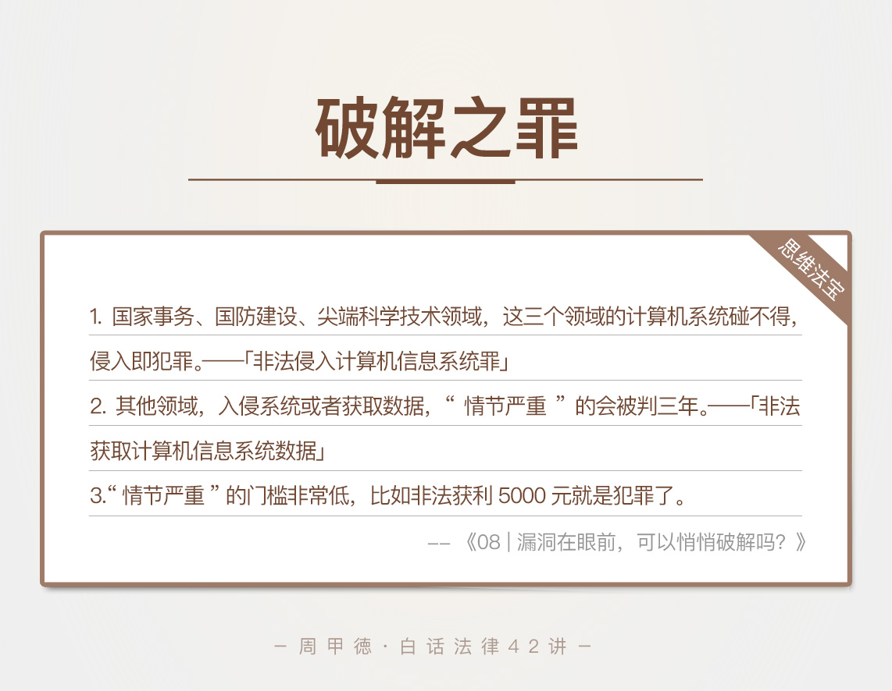

# 漏洞在眼前，可以悄悄破解吗？

网络安全一直是每个 IT 工程师关注的重点，虽然我对技术了解不多，但是因为系统漏洞造成的网络安全事故，比如用户数据泄露等，倒也听过不少。系统存在漏洞，是技术问题，但如果有人利用了这个漏洞，那可不仅仅是技术的范围了。

前不久某鹅厂 23 岁安全工程师的新闻，想必你不会陌生。年轻的工程师，因为对酒店的 Wi-Fi 系统顺手一测，又顺手一发给传播了出去，就被新加坡安全局给抓了。感觉似乎挺冤枉？还真不冤，比如你看这个真实的案例。

小安是一家公司的运维主管，技术也很不错。一次工作中，他发现了公司技术上的漏洞，于是悄悄导出了公司的数据，并在网上出售，最终赚了 26 万元。

等待小安的是什么呢？钱，要补偿给公司，人，也要蹲大牢，罪名是非法获取计算机信息系统数据罪。为什么小小动作的惩罚会这么严重呢？

老规矩，我们还是先来了解下相关的法律知识。

## 法律知识

首先我们来看，“**非法获取计算机信息系统数据罪**”这个罪名。罪名很长，你可以重点先记住前四个字，“非法获取”，跟我们后面讲到的另一个罪名做个区分。

**非法获取计算机信息系统数据罪**是指违反国家规定，

- 侵入计算机信息系统，注意这里是指除了国家事务、国防建设、尖端科学技术领域这三点外的其他领域。
- 或者获取计算机信息系统数据。

并且，符合“情节严重”这一特点的行为。

在这里，我要重点解释几个概念。

首先，这里的“**计算机信息系统数据**”是指计算机里存储、处理、传输的数据，不仅包括了计算机系统数据和应用程序，还包括了你在计算机里存放的各种个人信息。

但是脱离了计算机存放的数据，比如光盘、U 盘中的计算机数据，不适用于这个罪名。比如说，别人 copy 你的 U 盘，然后把里面的信息数据转手在网上卖出去，或者是进行其他操作，就不属于这个罪了。

第二，本罪里面的“**情节严重**”指的是：

- 获得**10 组以上**的网络金融服务的身份认证信息，包括支付结算、证券交易、期货交易等；
- 获得**500 组以上**的其他内容的身份认证信息；
- 非法控制了**20 台以上**的计算机系统；
- 非法收入达到**5000 元以上**；
- 造成经济损失达到**10000 元以上**。

以上的五个情节，只要达到了一点，就要追究刑事责任了。通常会被判处三年以下的有期徒刑或者拘役，可能会有罚金。严重点的，可能就是三年到七年的大牢了。

特别注意的是，违法收入只要达到 5000 元就构成了犯罪，而且即使你没赚钱，只要给公司造成了 10000 元以上的经济损失也同样构成犯罪。这点钱可真不算多，也可以看出，这个罪名的定罪标准是真的很低，国家的保护很严格，如果不对自己多加约束，一不小心可能就犯罪了。

另外，非法获取计算机信息系统数据罪有明确的范围界定，指的就是我们普通的商业或者工业范围，不包括国家事务、国防建设、尖端科学技术领域这三个领域。那如果你触碰的是这三个领域的计算机系统呢？

一定要特别注意我接下来要讲的，这三个领域万万碰不得！一旦你对国家事务、国防建设或是尖端科学技术领域的计算机做小动作，会犯另一个很严重的罪名，**非法侵入计算机信息系统罪**。

这个罪名的重点，你也可以记住前四个字，“非法侵入”。“侵入”二字，一听就比“获取”正式、严重得多。事实上也是这样，我们前面所说的**非法获取计算机信息系统数据**这个罪名，本质上是因为你入侵系统后的其他操作，比如操纵系统、copy 或贩卖数据、或者传播等，也就是我们所说的“情节严重”的行为。

而**非法侵入计算机信息系统罪**不考虑后果，属于行为犯（也就是以某个行为作为判罪的标准），**侵入即犯罪**！这里的“侵入”，是指没有国家部门的授权或批准，非法获取口令或许可证明后，冒充合法使用者，进入国家系统或者截收数据的行为。有些人甚至把自己的计算机和国家系统联网，同样犯罪。

事实上，如果侵入了这些领域，一般会被处三年以下的有期徒刑或者拘役。

其实这也很容易理解，这些关键领域对于保障国家安全、经济发展、和保护我们普通人的生命财产安全等方面，都十分重要。一旦被入侵，不管你是恶意的破坏分子，还是好奇心作祟，或者只是想单纯地秀技术，这种行为都可能导致重要数据被破坏，或重要、敏感的信息被泄露，带来巨大的灾难。所以，这里必须特殊对待，严厉惩罚。

当然，在实际判案中，一些确实无意识的，或是情节很轻微、没有带来巨大危害的行为，可以不按照犯罪来处罚，但是惩罚还是会有的。所以，遵纪守法在这里，真的就不是说说而已了。

## 情景分析

经过上面的学习，小安的问题就很容易分析了。即使公司技术有漏洞，也不是小安做坏事的理由啊。而且，公司有没有损失，并不是小安说了算的。这种事情，一旦越界后被公司发现，轻则开除，重的就是刑事犯罪了。

想想我们上面说到的那五个情节，非法收入达到 5000 元，或是给公司造成损失 10000 元，就可能被判处三年以下有期徒刑。小安卖数据赚了 26 万元，显然既得赔钱，又要坐牢。

事实上也是如此，法院最终判决，小安犯非法获取计算机信息系统数据罪，有期徒刑三年，并处罚金 10000 元人民币。

你看看，权衡一下利弊，其实就是四个字：得不偿失。遇到这种事，我们本应该及时告诉公司，修复漏洞，这对公司来说挽回了一场损失，对你来说，也可能因此得到老板的赏识，获得更好的发展。这也是一个员工的基本职业素养啊！

## 思维法宝

在工作中，我们可能难免会发现公司的管理漏洞或者是技术开发漏洞，抵挡住诱惑并解决，可能会迎来新的发展；利用漏洞并牟利，估计就会锒铛入狱了。

更何况，现在对犯罪的追究，并不只是你在工作期间被发现的违法行为。即使你在职时的违法事儿没被发现，离职后被公司查到了，你一样会受到法律的制裁。

说了这么多，最后，我来总结一下我们今天的内容。我们主要学习了技术从业者的“两堵墙”，分别是**非法获取计算机信息系统数据罪**和**非法侵入计算机信息系统罪**，两个罪名涉及的领域不同，前者也就是“非法获取”这个罪名，强调的是普通领域的侵入和“情节严重”的判定，后者也就是“非法侵入”强调的是三个特殊领域的侵入，并且侵入即犯罪。

两个罪名的判定和后果都不同，但相同的是，判定标准都很低，要特别留心。

还是那句话，技术犯法不仅仅是技术问题，更是背后的动机和应用场景问题，而我们要关注的也不仅仅是技术，更要清楚可能触碰到的红线和后果的严重性，才能在意识和行为中建立好防线。

那么对于今天的内容，你还有哪些不清楚的地方或是想了解的吗？或者是你曾经有过触碰红线的危险经历吗？欢迎留言与我分享，记录下你此时的感悟或是问题。也欢迎你转发给身边的技术朋友，给特别的人特别的关爱。

