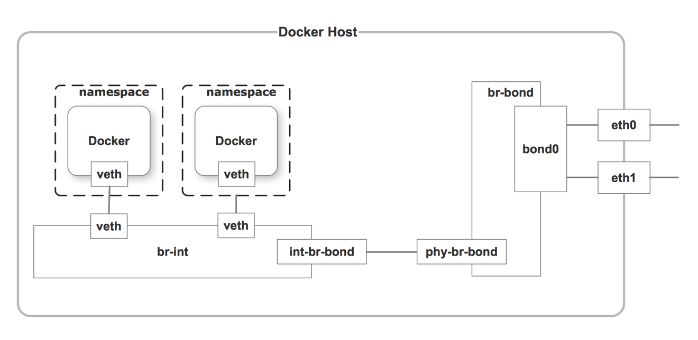
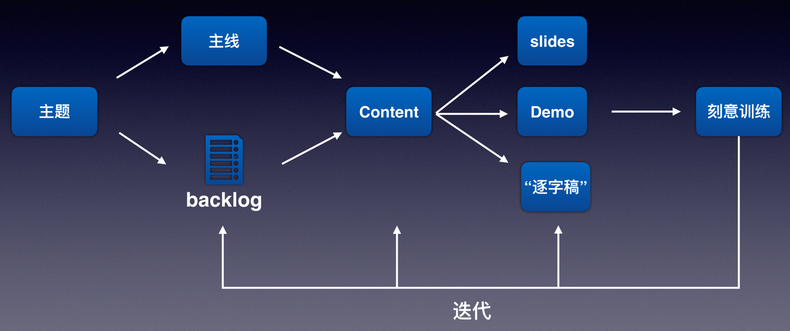

# 演讲之前需要做好哪些准备？

> Stay Hungry, Stay Foolish.

相信很多朋友都知道这句话来自乔布斯在 **2005 年斯坦福毕业典礼上的精彩演讲**，尽管只有短短的 15 分钟，却影响深远。仅 YouTube 上排名第一的该演讲视频点击量就超过 2800 万。

《成为史蒂夫·乔布斯》和《乔布斯传》这两本书中透露了这次演讲背后许多不为人知的细节：

> 乔布斯之前所有的 Keynote 都是自己写的，但从未写过毕业演讲词。最开始，他曾向著名剧作家阿伦·索金求助，但是这家伙一再拖延敷衍，到六月末，他什么也没有发给乔布斯，这时乔布斯慌了，最后他用了一晚上的时间完成讲稿，除了征求妻子的意见，没有任何其他人的帮助。稿子写好以后，他还请库克等朋友帮忙提意见。
>
> 在毕业典礼的前几天，他从楼上走到楼下，从卧室走到厨房，一直在背诵文稿，就好像应对 MacWorld 或是 WWDC 那样。有几次乔布斯在晚饭时向家人朗读演讲稿。
>
> 2005 年 6 月 16 日早上，当乔布斯醒来时，他只觉得胃里天翻地覆。劳伦斯说：“我几乎从没见到他那么紧张过。”乔布斯临时决定不自己开车去斯坦福，而是利用路上的时间再过一次演讲稿。
>
> 在现场 23000 名学生的注视下，乔布斯拿着几张演讲稿走上了讲台。

你可能会觉得对于身经百战的乔布斯来说，毕业典礼演讲应该易如反掌，很难想象连乔布斯也需要做如此的投入和准备！

在此我还想分享一些数据和案例:

1. 新东方老师授课以妙趣横生、言语幽默、段子丰富著称，于欢乐之中就让你记住了很多单词和用法。而这些看似信手拈来的讲课背后的付出是：每 10 个小时的课程，需要撰写逐字稿和练习的时间长达 6 个半月；
2. TED 演讲者通常提前数个月开始准备，TED 会安排专业的团队进行指导和排练。

不难看出，唯有**精心准备 + 刻意训练**方能成就精彩演讲。

## 精心准备

下面我将结合自己过往准备技术演讲的经历给你做一些分享（本篇侧重于技术演讲的分享，部分内容可能不适用于非技术内容的分享或者演讲）。

在谈演讲之前，我们先来说一下沟通。沟通的本质是让对方轻松地弄明白他原来并不知道的东西，更进一步，让对方通过自己已经懂的知识理解他原来并不懂的东西。

举个例子，在幻灯片设计上，通常要注意整齐美观。如果是画图，图上的线和布局要注意对称，如果是文字，要注意缩进。程序员们往往不以为意，但如果你告诉他，这就好比代码风格上合理缩进能提高代码的可读性，他立刻就领会了，而且会非常认同。

演讲最重要的就是主题，所以首当其冲，你需要明确自己的主题。这里面涉及到你与出品人的沟通，以及你对大会的了解。比如，听众的组成是什么样的？参会者对这个领域的了解程度？听众们想听什么？最关键的是通过本次演讲，给听众带来什么价值？

在明确了主题之后，就需要设定好演讲的主线，对于技术类的分享，有一个相对固定的模式：

**Who-What&When-Why-How-Future-Recap**

- **Who:** 自我介绍，让听众了解自己，建立连接；
- **What&When:** 今天要分享的主题，通过简短介绍吸引听众的注意力、好奇心；
- **Why:** 为什么要做这个架构改造、技术升级，整个项目的背景是什么样的，结合对听众的了解，做特定的介绍；
- **How:** 深入浅出 3~4 个最核心的内容点，当然为了全面性，你可以都罗列出来，但介绍的重点建议控制在 3~4 项；
- **Future:** 让大家了解你未来的计划，你对技术趋势的看法等等；
- **Recap:** 对今天的主题再做一个回顾，让听众加深对核心内容记忆。

看到这里，你可能会觉得，往往项目做完了，信息比较零散，一下要总结得这么有条理和全面很难，包括哪些是最值得分享的内容也不是马上就能全部列出来。

这里分享一个我自己的心得，我习惯用 wunderlist App 建一个新的列表，类似 Scrum 里面的 backlog，任何时候自己想到值得分享的内容都丢进去，包括收集到的数据、文档、代码片段等等。

我还有一个小窍门，在跑步的时候思考问题，常常会冒出一些新的灵感，感兴趣的朋友也可以看看村上春树的《当我谈跑步时我谈些什么》。

当然，每个人都有不同的方式来获取灵感，希望你也能找到适合自己的方式。

当你的 backlog 越来越丰富的时候，你就可以开始梳理这些 case，一方面整理自己的思路，调整主线，另一方面看如何把这些 case 分布到主线的每一个环节，或者舍去。

这个环节是持续进行的，任何时候你觉得有新的 idea 或得到了新的反馈，都可以进行调整，关于这点后续还会探讨。

到此你已经把主线以及相关的材料都准备好了，接下来的重点就是如何展示、如何讲述。

## 一、我需要逐字稿吗

对于初次演讲，或者特别重要的演讲场合，如果你想让演讲效果更好、避免紧张一时不知如何表达，逐字稿会给你带来巨大的帮助。

逐字稿能非常好地帮你组织语言，人的大脑非常不擅长做大量信息的前后逻辑处理，但文字和图表能非常高效地帮助你梳理逻辑关系。

使用逐字稿，要避免照本宣科，脑子里不停地回忆逐字稿下一句是什么，而是应该充分理解逐字稿的逻辑。

在演讲时，之前训练过程中脑子里不断预热过的关键词会按这个逻辑很流畅地释放出来，你会逐渐找到感觉，跟随这个感觉变得更投入，最后还能根据实际情况做临场发挥，越来越放松和自如。

## 二、幻灯片设计原则

多少页幻灯片合适？ 还是回到前面我们说的模式：

- **Who:** 1 页
- **What&When:** 1~2 页
- **Why:** 1 页
- **How:** 展开 3~4 点，每点 2~3 页
- **Future:** 1 页
- **Recap:** 1 页

基本控制在 15~20 页的范畴，当然可以根据实际需要再增加，比如为了增加数据对比展示等。

对于技术分享，不太建议大量采用交互式的幻灯片，每句话一张幻灯片，频繁上下文切换，容易让听众分心。而很多复杂的技术逻辑很难在精炼到每页一句话的同时又能让听众容易理解，这样会导致听众无法跟上你的节奏。

去年我负责 QCon 运维与监控专题的出品，最后 QCon 会务组根据听众的打分给讲师反馈，其中一位讲师就来问我，为什么自己的得分不高，其实他的内容很好，讲得也不错，分析下来就是这个原因造成的。

我在 review 幻灯片的时候给他提过一些建议，幻灯片已经从 100 多页缩减到 80 多页，但最终还是无法避免。

对于幻灯片的内容，建议减少大篇幅的文字，用最精简的文字加上图表来展示，不仅使得幻灯片清晰明了，也不会让听众觉得照本宣科，通过 keyword 给自己提示，适当地做一些临场发挥会更好。

下面就是一个很好的例子，试想如果要用文字来描述清楚容器的网络结构，可能需要几百字，而光靠文字，听众要建立起对应的网络模型是极其困难的，无形之中让听众跟不上你的节奏和思维，失去注意力，尤其在今天智能手机使得大家在听讲中有太多的分散注意力的诱惑。

另外可能大家也会注意到，平时听语音信息的速度比你看文字的速度要慢很多，而阅读文字又比从一个图获取信息要低效。尤其在技术分享中涉及复杂逻辑和架构时，更需要注重图表来提高沟通效率，往往能达到一图胜千言的效果。

技术分享的另一个特点就是经常用到 Demo。Demo 看起来很简单，但要做好却不容易：

1. 如何在有限的几分钟里面充分展示技术特点和产品特点？
2. 多个环节、场景如何串联，上下文如何切换更自然？
3. 如何避免 Demo 失败？
4. 万一失败了怎么处理？

建议大家准备 Demo 的时候，一定要多多考虑这几个问题，做好备案。

接下来，经过**主题、主线、backlog、幻灯片、Demo、逐字稿**等精心准备，终于进入下半场：刻意训练。

## 刻意练习

训练的方式多种多样，这里介绍几种常见的方式:

1. **找安静的地方，自我练习。**可以用手机录音、计时。通过录音方便自己纠正口头禅，比如“嗯”“对”等等。
2. **请信任的朋友来试听。**有时候对于自己太熟悉的内容，虽然自己会觉得非常容易，但很可能朋友却不甚了解，或者对于整个项目自己太习以为常，于是跳过了必要的背景介绍，这样就容易和听众之间产生隔阂，所以要结合自己对听众的了解进行调整。
3. **公司内部试讲。**如果能有机会在公司或者社区小范围的进行试讲，也是非常有帮助的，可以提前让自己适应在一定数量的听众面前演讲。
4. **冥想。**这是我比较喜欢的方式之一，睡觉前在脑海里默默地翻幻灯片，想象真实的演讲场景，自己会怎么讲，Demo 流程是否完善，重点内容是否都讲到位了，做到成竹在胸。

刻意训练不等于重复训练，两者最大的差别在于是否根据反馈不断进行迭代改进。

就好像深度学习模型一样，根据损失函数，不断调整参数与偏移量，通过梯度下降等多种优化算法，让模型的准确度越来越高。

综合前面所说的精心准备 + 刻意训练的整体流程，如下图所示：

## 关于演讲前的焦虑和紧张

在大型技术分享会之前，可能会有焦虑，演讲过程中会紧张，那么如何来克服呢？

首先，紧张和焦虑感是普遍存在的，并非自己独有，如开篇时候提到的，即使乔布斯这样的擅长演讲的“神”都会紧张和焦虑，更何况普通人，一旦意识到这点，就会让自己觉得不那么孤立，内心会相对放松一些。另外，确信自己的分享对听众是有价值的，会让自己信心满满，这和前面讲到的主题、主线准备也是一脉相承的。当然，刻意训练和精心准备，则是演讲成功的最关键的因素。

其次，要提前熟悉场地，看看演讲场地的环境，了解听众座位的布局。

开场前，提前 10~20 分钟到场，如果时间允许，听一听前面嘉宾的演讲和听众的反馈，现场了解听众的需求，对于快速进行调整是非常有帮助的。

如果实在担心自己紧张，可以在开场的时候做一些互动，或者准备一个与主题相关的幽默段子。比如，你可以问，在场的朋友有多少人知道这项技术？有多少人在公司里面实际应用过？

请听众举手示意，这样不仅活跃气氛，也能帮你快速了解情况，快速思考自己预先准备的内容是否合适，是否需要在讲的时候临场调整。

## 演讲与软件研发

如上图所示，回顾软件研发的流程与我们前面提到的演讲前的准备步骤，竟然有异曲同工之妙。而近年来最流行的敏捷开发与 Scrum，重点都是前面提到的刻意训练，然后根据反馈再进行优化，试讲过程则对应了灰度上线，真正演讲的时候就是上线，发布生产环境。

当然软件上线后还能回滚，但已经开始的演讲则没有任何机会回滚，所以更离不开精心准备与刻意训练。

所谓的优秀，都是刻意训练和长期的积累在短时间内爆发出来的，大家往往只看到短时间内惊人的爆发力，却忽略了其背后的付出与努力。

以上就是我对演讲前的准备的一些经验总结，希望对你有所启发。

**本文作者**

吴毅挺：携程系统研发部高级总监。

