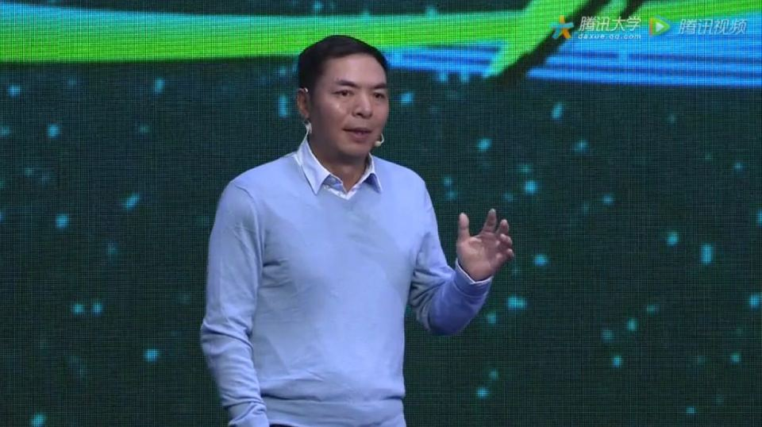
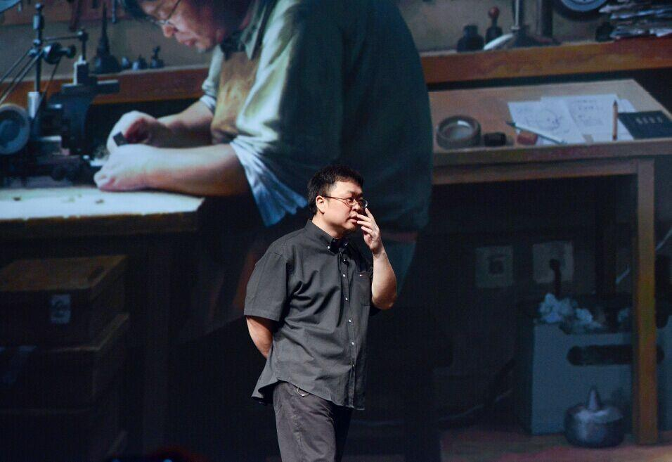
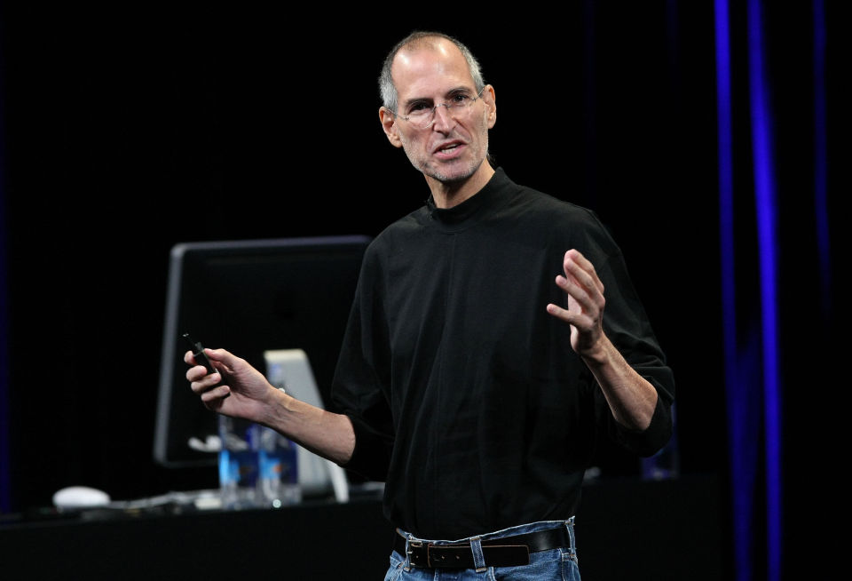
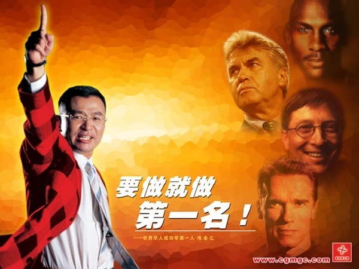
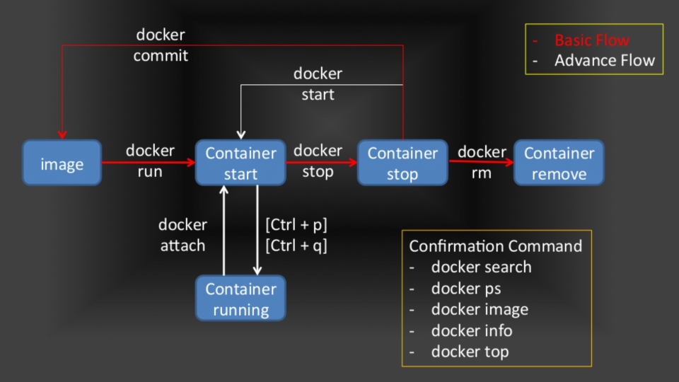

# 如何在演讲中讲个好故事？

无论今天**公众演讲**有多么重要，未来只会更加重要。这句话不是我说的，是 TED 的掌门人克里斯·安德森说的。

在人类漫长的文明史中，**音乐**与**语言**是两样最美好的事物。
音乐传承了人类基因中最触动人心的东西，上天选择了极少数人类精英来创造曼妙的音乐，然后给了全世界所有人欣赏音乐的能力。

而语言和文字则记录了一个时代人们的情感，正是对这些情感和生活经历的记录，形成了一个民族留存到今天的最大依据。到了现代，语言变得更加重要了。

以前信息的传播效率太低，你在大街上喊一嗓子，最多传一个街区就销声匿迹了，这还得是大嗓门。到了互联网时代，无论是音频还是视频，都可以在瞬间传遍互联网。

在这个时代，说话变得如此重要，如果你能够在公众面前当众演讲，并且感染现场的听众，进而把内容和情绪通过互联网传播出去，那就是一个相当了不起的技能。

技术人常常说，我写好代码做好技术不就行了，讲什么讲，让产品经理去讲。

技术固然重要，是我们的安身立命之本，但是，如果能够通过演讲和写作的方式把好的技术和产品传播出去，不仅可以帮助别人，还可以收获个人影响力，并传播好的技术产品。

这些东西与你的技术能力同样重要，有时候甚至更重要一些。

那我没有演讲的天赋怎么办？别着急，我给你举两个例子，他们都是江湖上赫赫有名的人物，和我的工作生活有过一点点交集。

第一个例子就是微信的龙哥，张小龙。

我看过张小龙的产品演讲视频，也去广州现场听过他老人家现场发布微信小程序。

龙哥演讲可谓“重剑无锋，大巧不工”，他的演讲技巧就是没有技巧，一般都是语调平缓，逻辑清晰，平铺直叙，姿态也很单一，右手插兜，左手偶尔比划一下，有时候还拿出手机看一下后续要讲什么，但他的每一句话都会清晰地传递到每个参会者的耳中。

比如龙哥会轻描淡写地说，微信日活到了 8 亿的规模，那听众除了鼓掌就不知道该怎么配合了。

由于微信和张小龙举足轻重的江湖地位，他的演讲不需要技巧，也不讲究姿态，他只要能把想要表达的东西清晰地讲出来就可以了。

另一个例子是锤子科技的罗永浩，老罗。

锤子科技是个“发布会驱动”的公司，演讲和 Keynote 自然是重中之重。

老罗是演讲领域的顶尖高手，他的基因里似乎充满了讲故事的 DNA，从某种程度上来说，老罗是个天才的演讲家，他的巅峰状态在做英语培训的时候，高校巡讲环节他可以全程脱口秀，掌控全场，让你安静，让你大笑，让你伤感，一切尽在掌握。

后来做锤子科技之后，一年就发布会讲几次，加上身体疲劳，水平反倒不如当年了。但是老罗超凡的演讲能力无疑是锤子科技的宣传和市场推广利器。

如果你具备龙哥的影响力或老罗的演讲天分，那么好的演讲必然不期而至。如果不是，别担心，普通人通过一系列技巧和刻意练习，也能获得一个不错的演讲效果。

我会结合自己的经验，从三个方面阐述如何做个好的演讲。

## 以讲故事的方式组织演讲内容

对于传递信息来说，讲故事是最强有力的工具，比其他艺术形式都好。

每个人从小都是“听妈妈讲远方的故事”长大的，故事总是让人更容易理解和接受。

你用生硬的道理去告诉一个人怎么做，远不如通过生动有趣的故事或类比的案例效果好，人们在听故事的时候更容易产生共情作用，也更容易理解你想要表达的信息。

当然，演讲并不是纯粹的讲故事，尤其是技术演讲，那就成故事会了。演讲介于讲故事和报告之间。

报告更倾向于精确的信息和枯燥的细节、事实和图表，做季度或年度汇报的时候用这种方式会比较好，公开演讲则更适合讲故事的方式。故事强调说服和感染，用信息唤起听众的激情。

**那怎么讲个好故事呢？**

给听众一个期望，然后用你讲的故事填满这个期望，让人们采用你的建议和陈述，这就是故事的核心。

比如当年乔布斯发布第一代 Macintosh 的时候，他充满自信地在舞台中央踱步，引用鲍勃·迪伦的歌曲《变革的时代》中的一段歌词，把 Macintosh 描述成大胆、反叛和充满创意的产品，把 IBM 描绘成垄断、独裁、缺乏变革精神的老大哥，而 Macintosh 充当了挑战者的角色，向 IBM 这个庞然大物发起冲击，试图改变个人电脑的格局。

然后 Macintosh 用机械声开始自我介绍：“大家好，我是 Macintosh，我终于从包里出来了”，然后全场陷入疯狂般的掌声中。尽管第一代 Mac 问题多多，但是毫无疑问，这次发布会乔布斯的讲故事能力把产品的发布推上了情绪的高峰。

讲故事的典型方式就是营造氛围，提出问题，分析问题，最后给出自己的解决方案。伟大的演讲与电影剧本常常很类似：

1. 清晰的开始、过程和结尾；
2. 具备有章可循的结构；
3. 通过某个情节来吸引听众的注意力，起承转合；
4. 开始和结束比中间部分短。

有了讲故事的结构，用什么方式把这个故事讲好呢？其实很简单，古人不都说了嘛，赋比兴。什么是赋比兴？

赋就是铺陈直叙，即是人把思想感情事物细节平铺直叙地表达出来。淋漓尽致地细腻铺写，或渲染气氛和情绪。

我们在做技术演讲的时候，常常会从某一个技术细节或者解决的具体技术问题入手，由点到面，层层展开，最后形成我们想要传递给用户的完整信息，就是这种方式。

比就是类比，以彼物比此物，由一件事引入另一件事，通过形象的类比让人们更容易接受你的观点。

类比思考几乎是跨越已知和未知鸿沟的唯一手段，也特别容易让听众产生代入感，并为你的演讲营造出跳脱和画面感。用好类比是非常难的，你需要有足够的知识储备，长时间的积累和优雅的表达方式，才有可能创造出一个绝妙的类比。

作家村上春树是这方面的大师，无论是小说还是随笔，他的类比和隐喻都是随手拈来，读着极其过瘾，比如他在耶路撒冷获奖致辞中写的高墙与鸡蛋：

> 假如这里有坚固的高墙，而那里有一撞就碎的蛋，我将永远站在蛋这一边。

村上在自传体随笔《我的职业是小说家》里也有这种细腻的隐喻。他在描写七十年代生活的时候说：

> 整个世间好像还有不少类似“缝隙”的地方，只要走运，找到适合自己的“缝隙”，总能生存下去。那是一个虽然事事粗枝大叶却也不乏乐趣的时代。

善用类比，会让你的演讲脱胎换骨，增色良多。

兴是托物起兴的意思，加以联想和展望，引出演讲者最终想表达的事物、思想和情感。这种表达手法一般用在演讲的结尾。

一个公开的演讲，要么是推介好的技术和实践，要么是发布自己的产品，要么是传递某种思想和方法论，到了演讲的最后，要把整个演讲的内容做个升华，赋予演讲内容更高级的主题和思想，引发听众的联想。

演讲结束，余音袅袅，引发听众的讨论，效果就达到了。

有了好的故事还不够，你还需要有好的姿态。在公众演讲的时候，好的姿态会为你带来自信，也会把你的感染力传递给听众。

## 演讲中的姿态

谈到演讲姿态，估计很多人会想到正装、酷、有独特的风格，比如冷冷的演讲或热情洋溢地开始自己的表演。

不用这么浮夸，一眼就让人看出你是个新手，都不用在线等。

姿态其实是用一种很自然很舒服的交流态势向台下的听众传递信息的方式。所谓最好的设计就是让人感觉不到设计的存在，如果你的姿态让人感到做作和不自然，那就是失败的表现。

保持自然，目光坚定，勇敢地面对台下千百双眼睛的注视并熟视无睹，就是成功的第一步。好的演讲者与优秀电影演员常常很类似，在台上保持自然放松的体态，不浮夸，自己觉得舒服就可以。

对于技术人员来说，牛仔裤加 T 恤或衬衣，都是不错的选择。有条件的情况下尽可能用耳麦，这样可以解放出双手，一只手拿翻页器，另一只手可以配合你的演讲“指点江山”。

被黑压压的目光注视的压力是非常大的，所以很多演讲者会频频回头看幻灯片，其实没啥可看的，他们主要是想逃避台下听众火辣辣的目光。

正式的演讲最好在演讲者前面放个前置显示屏，作用类似提词器，另外也可以避免演讲者频频回头，显得非常没有安全感。没什么可怕的，即使你讲的再烂，听众也不会打你，最多离席退场嘛。

那该怎么应对听众的目光呢？用灯塔般的目光缓缓扫视全场，这样做的效果是每个人都感觉被你关注到了，又不会形成只盯着一个人看形成对峙的火爆场面。

什么是灯塔般的目光？想象一下灯塔是怎么干活的就知道了，比如下图：

演讲中还有一个很大的忌讳是去读幻灯片上的内容，照本宣科，那人家来听你演讲干什么，还不如下载幻灯片自个儿回家去看。

要用自然的语言去解读幻灯片上的内容，表达你的思想，传递你的信息，幻灯片更多是起到烘托效果和提醒你该讲什么的作用。

提问是演讲中常用的互动形式，演讲者可以在开始、中间或结束之前采用这样的方式与听众互动，但是这种互动方式不要使用多次，用多了听众会产生“到底是你讲还是我们讲”的疑惑。

演讲过程中要使用什么样的手势呢？用自己习惯的手势配合你的演讲内容就好，但是不要手足无措，比如一会儿插兜一会儿抱胸，自己不觉得，台下听众会看得非常清楚。

一个非常自然的手势是“切西瓜”，伸出手臂，摊开手掌，让手掌与地面垂直，然后小幅度上下挥动。这个动作是一位演讲培训师告诉我的，我学会了之后屡试不爽，效果非常自然。

具体的姿势我们借用乔老师的一张演讲照片说明一下，大概是这样的：

我们还可以双手切，左手切，右手切，千变万化，无往不利。

千万不要做出夸张的身体姿势，下面这样的姿态是减分的，甚至让人对你的人格产生怀疑。

最后，你还需要一个好的幻灯片。

## 做一个演讲型的幻灯片

幻灯片分为演讲型和报告型，演讲型注重体验和创意，报告型注重信息和结构化。我一般做的都是演讲型的，报告型的都比较简陋，公司内部用，把事情说清楚就行。

做幻灯片有的人喜欢用 Windows 的 PPT，有的喜欢用 macOS 的 Keynote，我是后者。

演讲型的幻灯片，风格保持“简洁、干净、一致、跳脱”即可。

选择一款干净的主题，白色或者深色，具体可以根据演讲场地的灯光效果确定。如果灯光没问题，我一般都会选用默认主题第三个：渐变，宽幅。有时候会让设计师做一些定制，但不会有复杂的变化。

Keynote 的整体风格一定要简洁，不要搞花里胡哨的东西，可以抛弃主题模板的格式限制，自由发挥，但一定要简约，并突出重点。一幅画，几个字，一个动画转场，让听众抓住重点即可，因为主题内容是通过你讲出来的，而不是念出来。

字体和风格的选择要保持一致性，最好不要用三个以上的颜色。同时 Keynote 的画面要有一点跳跃性，一成不变的节奏会让听众昏昏欲睡。

如果一个演讲不是在下午最容易犯困的时候进行，你愣把听众讲睡着了，那就是个失败的演讲。

保持节奏感，每隔一段时间用一个跳跃的图案或一段有趣的话来吸引听众的注意力，同时让演讲充满趣味性。让演讲具备一定的幽默感，这一点也很重要。

另外，我们使用的动画应该是有意义的，为了表达内容才出现的，不要频繁使用过场动画和场内动画。动画满天飞的 Keynote 一看就是新手做的。

不要长篇累牍，不要贴大片的文字，或者让很多分块的文字交织在一起。听众不会去阅读那些文字。再一次，主题内容是通过你讲出来的，而不是念出来。

一图顶千言，大部分时候画一张清晰的参考图比我们写一屏幕文字的效果要好得多，比如流程图、组织架构图、数据流图等等。下面这张图讲的是 Docker 的状态变更，用图表示，远远好过一堆文字。

好了，现在你知道了讲故事的结构，也学会了演讲的姿态，还做了一个简洁的 Keynote，是不是就可以做一场精彩的演讲了呢？

并不是，你还需要不断地练习。一个重大的演讲，我自己要练习很多次，直到时间控制和演讲效果达到我的要求，另外，还需要去现场彩排。多练出奇迹，这句话一点也没错。

最后，演讲永远不是一件轻松的事，要树立自己独特的风格去吸引你的听众。演讲中你不是英雄，听众才是。只有演讲者采用谦逊的态度时，听众才能领悟和共鸣。

祝每一位读者演讲成功！

**本文作者**

池建强：极客邦科技总裁，MacTalk 公众号作者。

