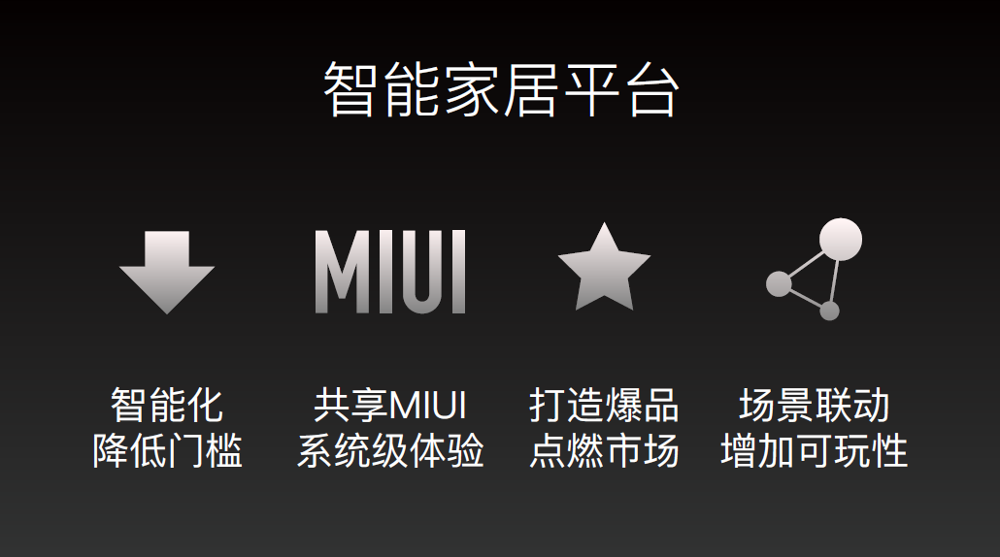
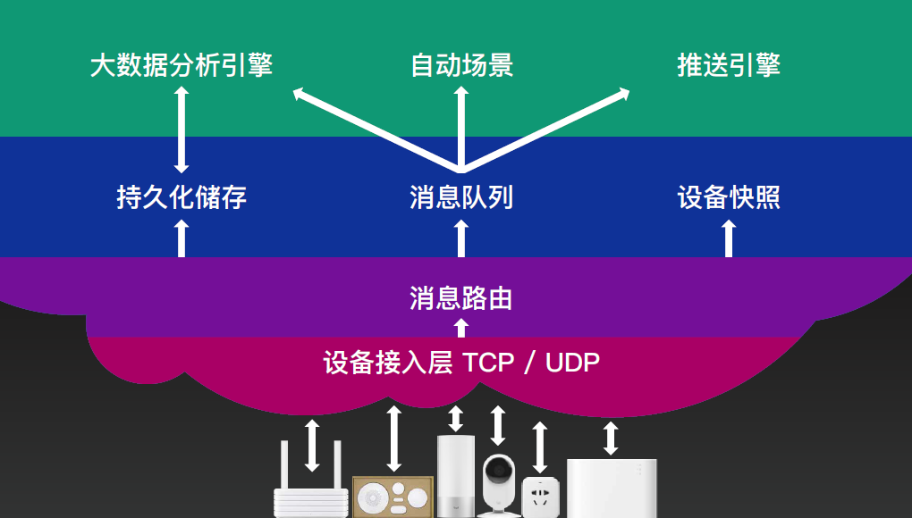
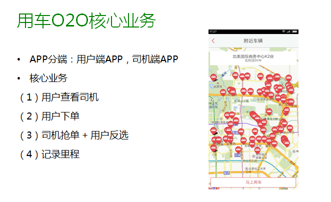
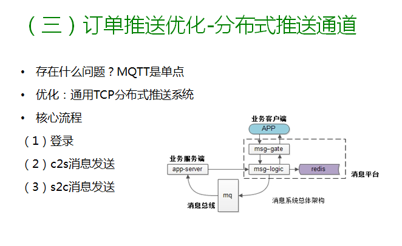

# 8 个技巧，帮你做一场漂亮的技术大会演讲

偶尔会参加一些技术大会并进行演讲，什么样的演讲最受听众欢迎呢？在这里我分享下自己的经验，也希望给你一些启示。我主要分享以下八点：

## 一、提前了解听众的诉求

如同架构设计一样，了解需求永远是第一步的，任何脱离需求的架构设计都是耍流氓。参加技术大会的听众，主要是想学习知识，借鉴经验解决工作中的实际问题。

那么演讲嘉宾可以在 PPT 中针对性地准备这些内容：包括真实案例、碰到的问题、踩到的坑、尝试过的各种解决方案以及解决方案的优缺点、迭代演进和最佳实践等等。

总之，技术大会的演讲，尽量少一些放之四海皆准的原则理论，多一些血肉充实的生动案例。

## 二、紧张是正常的

有一项关于“世界上最令人恐惧的事情”的调查，结果让人出乎意料，“死亡”居然只排在第二，排名首位的是“当众讲话”。

所以我们要清楚，紧张是正常的，紧张说明你内心重视这个事情，有的时候，紧张反而能够帮助你发挥地更好。

往另一方面想，如果讲的内容是我们自己擅长的和熟悉的，何惧之有？除非是在讲别人写的 PPT ，这样才怕露出破绽。

其实，观众眼中演讲者的表现，会比演讲者自我感觉的表现更好。有时候，演讲者不小心漏讲了一个要点，也只有演讲者自己才知道，观众是不会察觉的，所以要明白，“只要不被听众察觉到紧张，那就不是紧张”。

还有一点很重要，微笑和热情能让人更加自信，也能在一定程度上消除紧张感。

有一次主办方向听众调研哪个老师讲得不错，听众反馈说“都不错，尤其是有个笑呵呵的老师感觉挺好的”。那个“笑呵呵的老师”就是我，而听众不知道的是，当时我内心特别紧张。

## 三、好的开场是成功的一半

不管紧张不紧张，既然被推上台了，开场留给观众的第一印象就非常重要。

如果你想不出什么有创意的开场，那我就推荐一个适用于任何场合的开场方式：

首先告诉大家我是谁，来自哪个公司，叫什么名字，职位可以说也可以不说。然后就是简单描述下自己的从业经历，让大家明白我为什么有资格讲这个主题，这个部分讲好了可以增强说服力。再然后就是说一下今天要讲的主要内容，这个我就不多做解释了。

最后，最重要也是最容易被遗忘的一点是，一定要告诉听众，演讲内容对他们有什么帮助。毕竟听你吹了这么多牛之后，听众关注的是这个主题和他有什么关系，能够收获什么，能够解决什么问题。

举个例子，这是我用过的一个开场：

大家好，我是来自 58 到家的架构师沈剑（这一句点名了我的公司、职位和姓名）。

我在百度、58 同城有过多年的架构工作经验（这一句就是吹吹牛，增强信服力）。

接下来我会和大家介绍 58 到家订单中心的架构演进细节（这个就是内容介绍了）。

通过本次分享，希望大家能够了解到对于平台型的业务来说，订单中心究竟是合还是分，以及多种方案的优缺点和我们在实践中遇到过的坑（这句话是为了告诉听众我的演讲主题和他们有什么关系，同时进一步介绍内容）。

## 四、安全的内容结构

开完场，就到了最核心的内容部分。内容结构怎样组织会让人觉得比较有逻辑而不会显得无头无绪呢？

我认为，按照“问题缘起 - 方案 - 优化方案 - 总结”这类“总分总”的结构来组织内容是比较安全的。

首先，我们可以讲一下遇到了什么问题，问题产生的原因是什么，为了解决相应的问题，我们做了些什么，以及为什么要这么做。

然后，我们就可以展开描述解决方案的迭代过程、遇到过的矛盾冲突点，针对这些矛盾，向大家介绍下有哪些传统的解决方案以及传统方案的优缺点，之后再介绍一下我们的递进方案和最佳实践。最后做一个总结。

## 五、PPT 内容呈现清晰简洁

这里主要注意两点：首先是内容呈现需要做到“清晰、简洁、达意”。其次，尽量减少大段的文字，代之以架构图、流程图和表格数字对比。

下面两页是 2015 年某技术大会上小米公司一位工程师的 PPT（正面案例）

接下来的两页是我在同一个大会上用的 PPT（反面案例）

你可以体会下差距，什么是专业的，什么是业余的。作为一个技术人，深感自己在这方面还有很多要改进的地方。

## 六、把控好整体节奏

内容框架搞定了，内容呈现也搞定了，接下来有些讲师会有疑问，“讲的内容这么多，时间不够用怎么办？”有的则表示，“很快就把准备的内容讲完了，好尴尬呀！怎么办？”这就涉及演讲节奏的把控问题了。

如何把控好演讲的整体节奏呢？我的个人经验是，人在紧张的情况下，语速会加快，导致演讲往往会比自己预计的时间更早结束。

所以，在演讲的过程中，时刻提醒自己要放慢语速，语速慢一点，会让听众觉得演讲人更稳重，也给了自己更多的思考时间。

同时，我们也可以多准备一点内容，以防讲太快导致提前结束而尴尬。要知道，讲太快导致要临时想内容撑场面，远比讲太慢最后不得已快速过掉一些内容要难得多。

另外，演讲之前，我们一定要规划好每一页 PPT 要讲什么内容，哪些是要点，要讲多少分钟。

技术大会有一个好处就是中途不会有听众打断你，演讲结束后才会统一提问，所以提前规划好的节奏一般不会被打乱。

想要在正式演讲时能够把控好节奏，提前演练也是必不可少的。我们规划了一页讲 5 分钟，可很多人话匣子一打开讲 high 了就真的收不住。我甚至见过 40 分钟的演讲光自我介绍就讲了 15 分钟的，所以一定要多做演练。

大家看到雷军、罗永浩、柴静在台上举手投足间谈笑风生、镇定自若的样子，殊不知人家每一个眼神、手势、步伐都经过了几十甚至上百遍的演练。

总之，不会被临时提问打断的技术演讲相对比较好控场：我们多准备一些内容，放慢一下语速，做好规划，多多演练，基本上就八九不离十了。

## 七、收尾时要强调重点

随着演讲逐渐进入尾声，一场 40-50 分钟的演讲，由于涉及的架构、流程、方案等技术细节非常多，根据我的经验，第二天还能记得全部内容 10% 的听众少之又少。

听众记住的这 10% 是什么？除了开场灿烂的微笑，大部分就是收尾时演讲人“反复强调”的总结啦，所以最后的总结部分一定要重视。

总结部分的内容在精不在多，听众有收获就达到目的了。总结的时候可以反复强调结论、强调实践。

根据心理学中的“近因效应”：人对演讲末尾部分的印象最为深刻，记忆也最为清晰。要想让听众记住你期望他记住的 2-3 个关键点，以达到分享的目的，在收尾时的总结和强调就至关重要。

## 八、回答提问要讲究技巧

整个内容讲完了，就进入到提问环节。

这个环节也是部分讲师比较头疼的，“万一碰上不会的问题怎么办？”我的个人经验是：首先，不要和提问者起冲突，特别是针对“你讲的我完全不赞同”这类观点。

我们可以表示“这是自己公司的实践，方案有很多，各有优缺点。”然后就可以马上转入“下一个问题”。

不过，这种情况一般比较少，更多的是提的问题虽然与话题相关，但自己并不能 100% 确定问题的答案。

这时我们可以将问题技巧性地转化一下，比如说“这位朋友要问的是不是这样一个问题呢？”而转化后的问题正是自己擅长的。

当然，“术”仅仅是技巧，一般我建议实事求是，即使面对自己不擅长的问题，也大方承认自己不确定答案，但可以讲讲自己的思路，这样的话听众一般也不会苛责。

另外还有一个大招，假如碰到让你比较尴尬的问题，你可以回答“这是个很好的问题，但几句话可能讲不清楚，感兴趣的话，我们线下交流。”这也是一种办法。

## 总结

不知不觉写了这么多，最后做一个总结，要想做一场漂亮的技术演讲，我们需要做到：

1. **提前了解听众的诉求**
2. **认识到紧张是正常的**
3. **好的开场是成功的一半**
4. **采用一个安全的内容结构**
5. **PPT 内容呈现要清晰简洁**
6. **把控好整体节奏**
7. **收尾时要强调重点**
8. **回答提问要讲究技巧**

好了，我要分享的就是这些，希望对你有所帮助。

**本文作者**

沈剑：58 速运 CTO ，架构师之路公众号作者。

