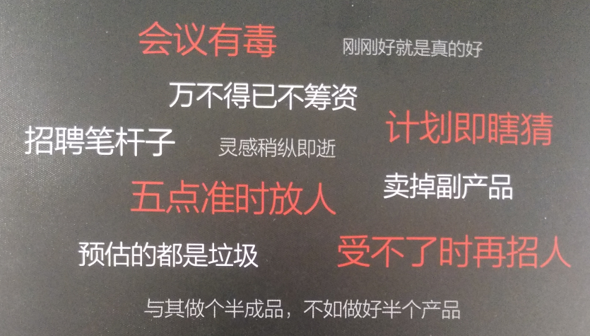

# 读书篇|REWORK（重来） 

## 前言

在过去的一段时间中，我阅读了[37signals](https://baike.baidu.com/item/37signals/6163378)的联合创始人Jason Fried和David Heinemeier Hansson 书写的一书 《Rework》，中文版《重来·更为简单有效的商业思维》。

阅读之后，自己的收获很大，给我的漫长面试路增添了一笔色彩。故，我将其正文内容总结如下，希望大家有机会可以去读一下本书，会有收获的。（尤其是没有工作的伙伴，又或者是已经工作了伙伴。）

## 正文

正文部分，我会先大概介绍一下本书的关键点，接着我会按照文章的章节进行梳理，最后得出我的总结，希望大家会有自己的收获。

### 简介

或许你不知道37signals，但是你应该听过ruby，如果来没有的话，你应该听过编程语言。Ruby on rails 框架是37signals团队开发的开源web框架。

写到这里，我突然想起来ruby之父松本行弘先生，在2019 RubyConf China 中接受二叉树的时候，说过关于技术不能解决所有问题的时候的一句话：“光环效应：当一种新技术产生的时候，受到过度的关注，大众会抱有过高的期待。但是当真正明白这个技术是怎么一回事时，往往又会有点失望。接下来会进入一个稳定期，基本所有技术都会经历这样一个过程。”（详细阅读，请看文末链接。）

----

正如书皮所述：“**没有晦涩术语，没有套路，有的是上百条简明的定律**。”

下面展示的是本书的关键词云：

### First(开局篇)

新的现实，即重新开始，从头来过，整装出发。

### Takedowns(卸负篇)

忘了‘现实世界’，即现实世界与你我都没有关系，别心太大了。

哪来的从错误中学习，即只有成功才可以学习到成功，错误依然还是学到了错误，故失败不是一场值得期待的仪式。

计划即猜想，即计划只是参考，因为计划没有办法，也不可能考虑到所有的情况，故别想太多了，其实无计划也挺好。

何必壮大？即公司的大小，不等于够专业与强大，其实短小精悍也是不错的选择。

工作狂，即工作的本质是解决问题，工作需要节制，并且不要浪费时间。真正的英雄都是早早下班回家了。

受够了“企业家”，即大家喜欢的还是创始人的称呼哦~，需要的是一点创意，一点点自信，一点勇气。

### Go(行动篇)

在宇宙中留下你的足迹，即要做举足轻重的事，我突然想到了彼得蒂尔的投资哲学，见文末。（希望你可以搜一下彼得蒂尔是谁。哈哈！你应该会看到Paypal ，Palantir 等内容。）

挠自己的痒处，即解决自己的实际问题，或许可以创造出主业之外的副业。

着手做点什么，即创意需要的是执行，不是看到别人实现之后，自己拍脑袋。

没时间的借口，即时间都是挤出来，正如我写这篇文章的时候，也都是挤时间。

画沙为界，立场明确，即需要内心的信念，有主心骨 ，自己一定要相信某一个东西，这就是信仰。

不可能的宗旨，即秉承与摈弃，坚守信念，不仅需要写出来，还需要相信，还需要成为你的生活方式。

万不得已不筹资，即创始人与投资人的对决，其中有很多关于这样子的案例，比如：PeopleSoft，中文名是“仁科”。（大家可以搜一下。）

你的需求没有想象的那么多，即反问自己，你真的需要吗？因为将有限的资源做出大事，这才是伟大，需求过多，会让自己迷失。

要成就事业，不能只是创业，即成功的前提是去做真正的事业，可不是简简单单的创业。

破釜沉舟，即你需要的是承诺策略，而不是退出策略。一旦开始，就需要全身心的去实现自己的承诺。注意：你会和一个计划着如何和你分手的人谈恋爱吗？

轻装上阵，即大公司与小公司对于负担是不一样的，相反小公司应该比大公司跑的快，如果跑不快，那就是需要调整了。

### Progress(进阶篇)

条件受限是好事，即少并非是坏事，只有小材大用才是真的好。

与其做一个半成品，不如做好半个产品，即慢慢做一件正事要胜过毛毛躁躁做一对傻事。对应于我们个人而言也是，与其囫囵吞枣，不如只吃一个最大的，并且这种记忆会更加深刻。

从核心出发，即核心的东西，才是最需要经历维护的东西。（问问题的时候也是，抓住核心点，才是关键，别整一个X/Y问题。）

不要过早关注细节，即先把基础打牢，细节会迷失自我，找错真正的核心东西。

做出决定就是取得进展，即只有决定才可以实施，也就才可以看到结果。

当好博物馆长，即只留下有价值的内容，被拿掉的也可以被重新放回来，只是需要不一样的锲机。

在问题上少投入点精力，即精简才是王道，只有将事件抽象为一件最平常的事，这次是你领悟了。

关注不变因素，即关注的焦点不适合在热门中，这也是为什么真正挣钱的行业还是那些最基础的行业，因为人们离不开啊！不可缺少啊！其实，学习也是一样，找到不变的，就找到了方向。

音乐就在你的指尖流淌，即工具不重要，装备只是加分项，并不会改变你原来的样子。

卖掉副产品，即你不会只做一样东西，副产品其实也具有商机。

立马就上线，即把它做出来，这也是很多互联网产品的做法，Facebook也是鼓励如此，已经没有办法在做成一个完美的产品之后，在公布，因为需求在无时无刻的变化。

### Productivity(效率篇)

认知错觉，即拿出实际东西来。最直接的就是自己预估自己的工时，你觉得2小时可能完成的功能，你开发了5小时，还没有结束。

退出的理由，即问自己为什么要这么做？你在解决什么问题？这真的有用吗？你加上去的东西有价值吗？这种改变真的会起作用吗？这种方法更简单吗？有其他更值得做的事吗？这样做值吗？

打岔是效率的敌人，即自己需要主动出击，将打扰降低。

会议有毒，即会议需要严格控制时间，不对谁都不好，浪费大家的时间，并且回忆需要更少的次数。

刚刚好就是真的好，即以小博大是好事，但是千万不要过度设计，过度思考。

速战速决，即不要拖时间，自己的耐心不够用了。

不要逞英雄，即自己需要知难而退。

该睡觉时就睡觉，即睡觉的账单迟早是需要还的，每天8小时的睡觉时间还是可以接受的。

预估的都是垃圾，即提前几周，几个月就去预测未来，属于梦话。只有细分成为更小的时间段，才可以完后意见大事。

罗列问题，不得解决，即代办事务清单，只会是愧疚的清单。使用分而治之的思想，可以很好地解决掉自己的问题清单。

决策宜小不宜大，即每一个小步的前进都是为一个大步的跨越积蓄力量。

### Competition(对手篇)

拒绝照搬，即复制只是表面上完成了任务，但是无法触及 事物的本质。照搬，无法领跑，只可能盲从。

将你的产品去商业化，让自己成为产品的一部分，这就具有了独特性，是没有竞争者可以复制的。

向对手挑战，即眼中有目标，心中就有方向，出手就有力量。

给竞争力做减法，即减少某些产品特性，获取就是一件新的产品。

谁管他们在做什么？即，把目光放到自己身上，不需要管竞争者做什么。这一点很难，我自己就做不到。

### Evolution(进化篇)

养成对客户说不的习惯，即唯唯诺诺很容易，但是时间资源 有限，不可能都做好，还不如做好该做的，其他的再拍一个优先级。

让你的客户超越你，即将自己的产品做成一个基础服务，这样大家都离不开了，难道操作系统不是这样子的吗？还有很多基础平台也是如此。

头脑发热不等于当务之急，即抓住核心的内容，让自己冷静一下，很重要。

家用便利就是好，即用户体验好才是长久之计。

不要逐字记下客户需求，即真正重要的需求客户会一直提醒你的，根本不用记住。忘不掉啊！

### Promotion(推广篇)

甘于低微，即只有在低微的时候才可以犯错，但是一旦不低微了，还敢大量犯错吗？

培养自己的拥护者，即培养自己的用户，即提供一个平台就是一个很好的方式。

普及知识，赢得竞争，即撒大钱无益，普及知识才是制胜的良方，哪怕是现在网络如此发达，想获取真正的知识就真的容易了吗？值得你我的反思。

效仿大厨，即公开自己的烹饪方法，也就是传授经验。

转到幕后看看，即展示最真实的样子给客户，还记得制造业的机械手臂吗？这就是幕后宣传的案例。

假花，即没有人喜欢塑料花，不要害怕暴露不完美，再不完美这也是你自己的东西。

新闻通稿都是垃圾短息，即新闻稿都是没有新意的信息而已。

别惦记着打牌媒体，即需要精准小众的媒体胜过大牌媒体。这一点很像现实中的论文刊物。

药贩子最精明，需要效仿药贩子。关键点在于，可以免费让用户尝试，乃至上瘾付费。

市场营销无处不在，其实市场部门不是一个部门的事，需要全体人员都集体参与的事。

一夜成名只是传说，即一步一个脚印的成长行动，才是现在以及以后最关键的任务。

### Hiring(招聘篇)

亲力亲为，只有这样子，你才知道需要什么样子的人做这件事。正如我之前的面试一样，**总监级别**的面试，对我的收获就很大，因为我可以瞬间看到这个职位需要的是什么样子的人，而我需要学习哪些内容。

受不了时在招人，即招人是需要代价的，需要的是整个岗位真的非常有必要才招人。

放弃牛人，其实牛人与需要是没有关系的，更重要的是我真的需要这么一个人。

鸡酒会上的陌生人，即鸡酒会是大家一起谈心的，而不是寒暄的。

可笑的求职简历，即求职信。这玩儿中国不流行，国内关心的是干活，少说话多干活。

多年的无关经验，即明白，看透什么是先关经验与无关经验。差别在于自己的努力程度，性格差异，以及智力水平。

常规教育不值一提，GPA成绩不重要，即 现实生活的人才库，并不是集中在学术界中，但是国内好像也不是。哎！

人人都需要干活，监工型的人就是累赘，其实公司还是需要人人干活的。

聘用独挡一面的经理人，即需要的是将图纸变成实干到底的人。

招聘笔杆子，即一群人中找一个文章写的好的人。这一点我深刻体会到了，正如我写这篇文章。

高手遍布世界各地，地理上的距离，已经不是距离了，这就是现在的网络世界。

试用期必不可少，即只有在真实的工作环境中，一个人的真实水平才可以被体现出来。这一点，我更是深有体会。

### Damage control(救灾篇)

主动掌控负面新闻，即犯错没有错，关键是承认错误。这也是现实生活中每一个人需要面对的事。

速度改变一切，即回复客户的速度，以及处理问题的速度，才是产品的一大卖点。

如何道歉，做一个聪明人，对不起，对此给您带来的不便我们深感抱歉…..

让每一个人都上前线，即主动与客户沟通，都去尝试沟通才是了解真实客户的一种方式。

深深深呼吸，即改变必然带来不适应，但是适应了改变也就没有什么问题了。

### Culture(文化篇)

企业文不是由谁创造出来的，即企业文化是自然形成的，企业文化是一贯行为的副产品。如果一开始面试就给你强调企业文化，这就是一个糟糕的信号。

决策都是临时性的，即还没有发生的事，并不知道多花心力。

跳过摇滚明星，打造造星环境。

员工不止13岁，信任是继续下去的基石。

5点准时放人，想做成一件事，就去找你能找到的最忙碌的人。好像，我就比较忙碌，对应的事还真的不少。

不要矫枉过正，即规章制度是组织机体上的伤疤。

发出你的心声，诚实方为明智之举。不要害怕做自己。其实，这里我就掉过大坑，吃了亏，才知道自己的对于自己信任的重要性。

需要避开的词汇，即避开词汇雷区。

越快越好事毒药，ASAP（As soon as possible），这个只是心里压力而已。

### Conclusion(总结篇)

灵感稍纵就逝，如果想做一件事，那就马上就去做。这也是本篇文章的由来。

## 结束语

这篇文章有一点长，我在写到2900字的时候，想过分为两篇，但是写完之后，我放弃了。因为这本来就是一篇文章。

在读完这本书的时候，我仿佛悟到了什么，但是我就是说不出来，当这篇文章写完之后，我就知道我悟到了什么。需要将这些东西，融入到自己的生活中，去看，去想，去感受。

顺便说一下，重来2，我已经在看了，收获 更是巨大。希望看到这里的人，也来看看。最后，讨论一个问题：知识来自哪里？

这个问题不好回答，但是大多数学习知识，学着学着就看起**书**来了。暂且认为知识来自于书本吧！好了，本文就到这里了，顺便提醒一下，如果你的学习还没有经历到书的这个过程，那么你可能需要**加个油**了！

## 附录

链接：ruby之父松本行弘先生接受二叉树采访链接：https://mp.weixin.qq.com/s/Ox7ZTHqRMz-6rkUl2CaHFA

彼得 · 蒂尔的投资哲学，按照他在自己的著作《从 0 到 1》中的说法，总结起来就是：“**作为创业者，应该去做一些很有价值而且很少人做的领域；作为投资人，应该去投资潜力很大而且没有被发现的领域。**”

