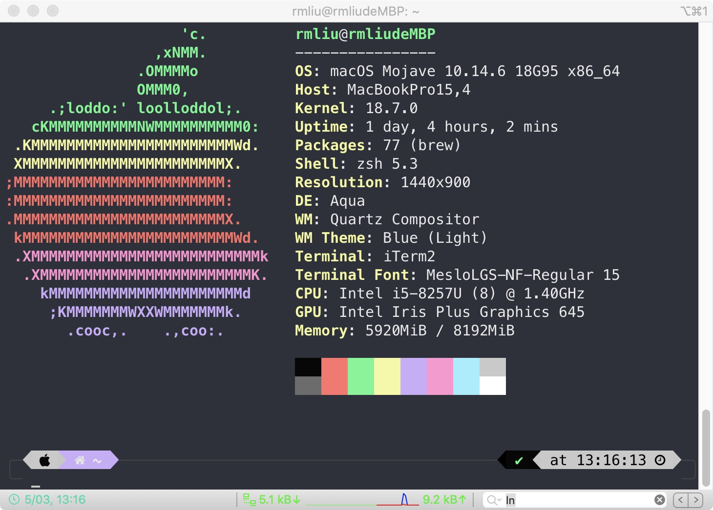
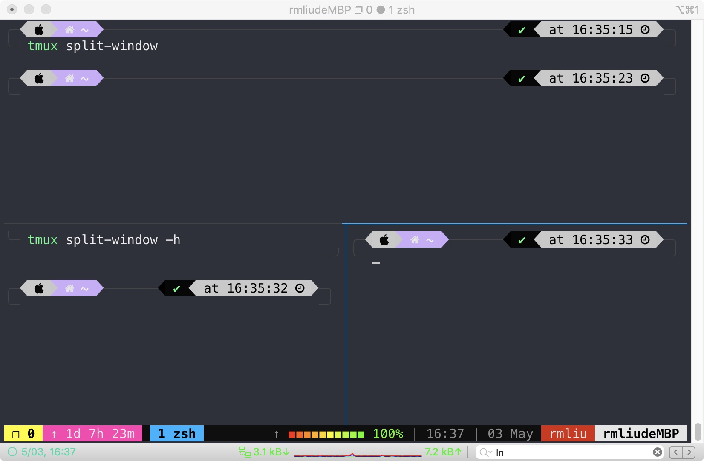

# Mac终端美化

## 前言

> 美化自己的终端，尝试DIY一个属于自己的配色......

早在2019年的时候，就看到过非常漂亮的Mac终端，两个字形容：**酷炫**！

现在算算我在终端上尝试四次左右，终于在第四次成功了，算是总结自己之前的经验，获得了这次的成长。

So，将终端美化的过程了记录下来，分享给需要的人。（只要是操作Linux命令行的伙伴，都可以尝试DIY一番。）

献上最终的结果：




## 正文

全文需要实际操作，才会知道你会遇到什么坑，所以开始动手吧！

那就正式开始了！


### 一、终端工具iTerm

> 聚焦于安装iTerm

终端工具就是常说的**Terminal**。

但是mac自带的Terminal，只是提供简单地四个选项进行自定制，分别是：**General、Profiles、Window Groups、Encodings**。

根据市场法则，一旦某些东西受到限制，必然会有其替代品，所以就出现了其他一些列的终端工具，比如：**iTerm**。

更多关于**iTerm**的详情信息，参考官网：https://www.iterm2.com/。

关于安装**iTerm**，参考官网，直接下载**dmg安装**或者使用**brew安装**。

brew安装命令：```brew cask install iTerm2```.

关于更多brew的内容，参见官网：https://brew.sh/。

备注：不管是学习还是download，都去官网哦！


### 二、命令解释器zsh

> 聚焦于安装zsh，使用zsh

关于命令解释器的更多内容，参见**命令解释器常识**：[https://www.copydays.org/2020/05/03/%e5%91%bd%e4%bb%a4%e8%a7%a3%e9%87%8a%e5%99%a8%e5%b8%b8%e8%af%86/](https://www.copydays.org/2020/05/03/命令解释器常识/)。

手动进行Zsh配置终端的过程比较负责，那就拿现成的轮子，在GitHub上有一个叫做**Oh My Zsh**的项目。

项目网址：https://github.com/ohmyzsh/ohmyzsh。

关于**安装zsh**的内容，参见：https://github.com/ohmyzsh/ohmyzsh#getting-started。

注意：这里进行安装**oh-my-zsh**的时候，如果报443端口的错误，不要担心。只是DNS解析域名被污染而已。

详细解决访问失败问题，参见域名访问被墙解决办法：[https://www.copydays.org/2020/05/03/%e5%9f%9f%e5%90%8d%e8%ae%bf%e9%97%ae%e8%a2%ab%e5%a2%99%e8%a7%a3%e5%86%b3%e5%8a%9e%e6%b3%95/](https://www.copydays.org/2020/05/03/域名访问被墙解决办法/)。

**使用zsh**，打开终端输入：

```bash
chsh -s /bin/zsh
```

关于zsh的各种**插件**参看官网：https://github.com/ohmyzsh/ohmyzsh#using-oh-my-zsh


### 三、美化工具powerlevel9k/powerlevel10k

> 聚焦于安装powerlevel10k，并且配置主题

**powerlevel9k**官网：https://github.com/Powerlevel9k/powerlevel9k

**powerlevel10k**官网：https://github.com/romkatv/powerlevel10k

**解释**：powerlevel9k已经被标记为**遗弃版本**了，新版本为powerlevel10k，推荐直接安装powerlevel10k。

**安装powerlevel10k**，参见网址：https://github.com/romkatv/powerlevel10k#oh-my-zsh

**~/.zshrc文件设置主题**，使用vim打开用户目录下的.zshrc文件，将默认的主题更改为下面：

```sh
ZSH_THEME="powerlevel10k/powerlevel10k"
```

**配置生效**：

```sh
source ~/.zshrc
```

此时就可以看到一个全新的主题了，但是这就够了吗？还可以更没一点，继续向下看。

命令行执行下面的**配置命令**：

```sh
p10k configure
```

开始接下来一些列的**交互窗口**了，这可是powerlevel9k不存在的哦，首先是下载字体，接着是各种配置显示，按照提示一直到结束。

**手动更改配置文件~/.p10k.zsh**，这个文件里面设置的就是上一步交互设置的文件，可以在里面随意更改，进行自己的DIY了。

**注意**：使用powerlevel9k的时候，比较原始，需要自己下载字体，参看官网即可。


### 四、骚操作启动终端的苹果

> 聚焦于启动的图标显示

在每一次启动终端的时候，都可以出现一个本电脑的详细信息，见首页的那张图。（其实这个还不是最靓的那个崽~）

**设置Login Shell Command:**

```sh
# 打开终端后，继续点击 
# iTerm2 >>> Preference >>> Profiles  >>>  General  >>> Command

# 输入命令
export http_proxy="http://127.0.0.1:1087" export https_proxy="http://127.0.0.1:1087";clear&&neofetch
```

**brew 安装neofetch：**

```bash
# 终端输入
brew install neofetch
```

**注意**：neofetch安装的时间比较长，耐心等待。


### 五、终端分屏tmux

> 聚焦于使用tmux的session机制，进行分屏

使用tmux主要是其可以进行一个终端窗口显示多个小窗口，即Tmux 是一个终端复用器（terminal multiplexer）。

**安装tmux:**

```bash
brew install tmux
```

**操作tmux:**

```bash
# 启动tmux
$ tmux

# 新建名字是server 的tmux
tmux new -s server

# tmux与窗口分离，但是进程仍然还在运行
tmux detach

# 查看所有的tmux
tmux ls

# tmux接回当前窗口
tmux attach -t server

# tmux 分为上下两屏
tmux split-window

# tmux 分为左右两屏
tmux split-window -h

# 退出tmux
exit
```

**效果图：**




## 结束语

稍微总结一下本文，在进行终端的配置的时候，最大的问题就是**网络**，所有的文件都是国外的，所以速度很堪忧，一不小心就是**IO error**，这也是阻挡了我三次的原因。

配置一个终端，还真的不是每个人都可以的，至于原因，自行**Google~**


## 参考资料

1.zsh & oh-my-zsh 的配置与使用：https://zhuanlan.zhihu.com/p/58073103

2.打造Mac下最强终端，iTerm2 + Oh My Zsh + powerlevel9k：https://feeeei.com/archives/27/

3.Mac Iterm2 终端美化：https://mp.weixin.qq.com/s/KqfD8eZwyvaDTcRzIKzxkg

4.Failed to connect to raw.githubusercontent.com port 443：https://www.cnblogs.com/huangzs/p/12765284.html

5.ITerm2配色方案：https://www.jianshu.com/p/33deff6b8a63

6.Mac的终端美化教程：https://mp.weixin.qq.com/s/Vi3GhEXS2DW7IwLLaR0YNA

7.让BASH,VIM美美的Powerline：https://www.cnblogs.com/fsjohnhuang/p/6057013.html

8.Tmux 使用教程：https://www.ruanyifeng.com/blog/2019/10/tmux.html


