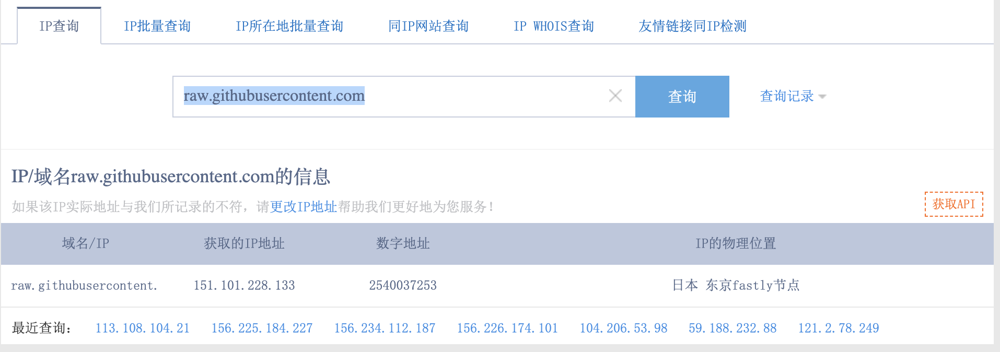

# 域名访问被墙解决办法

## 前言

> 本文是在安装oh-my-zsh，进行终端配置的时候，遇到域名访问被墙的解决方法。

当然，不仅仅只是解决问题，顺带会简单介绍一下域名，IP等一些网络知识。


## 正文

希望本文可以提供的是一种解决问题的办法，而不只是针对这一种。

备注：学习需要的是一通百通哦！


### 一、域名到ip是个什么鬼？

域名是我们网址前面的那部分，比如博客的后台**网址**是：https://www.copydays.org/ws-admin/posts-new.php。

那么**域名**就是www那部分：www.copydays.org。

**IP**是在浏览器看不到的，需要使用一点手段，打开我们的命令行工具，也就是终端，查看ip的方式如下：

```bash
$ ping www.copydays.org                                                     

PING www.copydays.org (155.94.163.194): 56 data bytes
64 bytes from 155.94.163.194: icmp_seq=0 ttl=47 time=257.394 ms
Request timeout for icmp_seq 1
64 bytes from 155.94.163.194: icmp_seq=2 ttl=47 time=254.794 ms
64 bytes from 155.94.163.194: icmp_seq=3 ttl=47 time=265.199 ms
64 bytes from 155.94.163.194: icmp_seq=4 ttl=47 time=254.617 ms
^C
--- www.copydays.org ping statistics ---
5 packets transmitted, 4 packets received, 20.0% packet loss
round-trip min/avg/max/stddev = 254.617/258.001/265.199/4.299 ms
```

借助的是ping命令，在window和mac下都是可以直接使用的，对应域名的ip就会显示在后面。

所以，ip也就是：155.94.163.194。

**注意**：域名是需要去**域名提供商**购买的。IP是去**服务器厂商**购买的，在购买云服务器的时候，会给你提供一个公网IP。如果想将IP和域名关联起来，需要在域名提供商提供的域名解析内部操作。


### 二、DNS又是一个什么？

DNS可以参见Wikipedia的解释：https://zh.wikipedia.org/wiki/域名系统。

直白一点就是，DNS将域名解释为ip，而这也是域名访问被墙的原因。


### 三、解决被墙的密招

我们找到的原因是域名解释到IP的时候，发生了错误，得到的IP不工作。

那么，解决办法就是直接给域名指定可以工作的IP，拿去直接用。

**第一步，根据域名查IP**。

使用网站：http://ip.tool.chinaz.com/

输入ip之后，就可以得到IP，见下图：



所以，得到IP地址为：151.101.228.133。

**第二步，将域名到IP的映射添加至本地hosts中**。

本地电脑有一个文件叫做hosts，主要存储的就是访问域名和IP的映射，一般情况下里面只有会换地址，会在系统运行的时候动态写入与清除。

Windows的操作：打开我的电脑，直接搜索hosts文件，使用管理员权限进行编辑，添加下面这句：

```sh
151.101.228.133 raw.githubusercontent.com
```

mac的操作，使用vim编辑器，编辑hosts文件，如下显示：

```bash
$ vim /etc/hosts

 // 添加域名和ip的映射
 
 // 保存退出
```

**第三步，可以正常访问域名**：raw.githubusercontent.com


## 结束语

以上就是针对域名被墙的基本操作，适用于所有的域名解析错误场景。

最后，记得一通百通哦！


