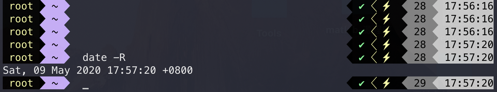
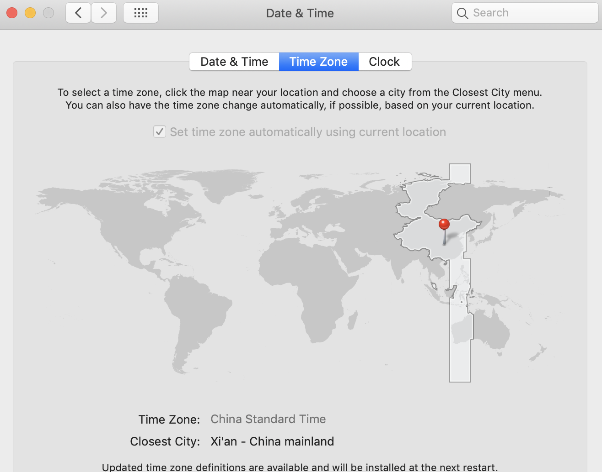

# V2ray failed to handler mux client connection

## 前言

> 本文的目标：帮助遇到 **failed to handler mux client connection** 错误的人，减少不必要的查错时间。

最近学校开学了，激动的心又开始躁动了~~

但是，一激动就花了**一个多小时查错**，期间差点想重**新搭**V2ray ，还好被我找到了原因。

**机器配置信息**：

> 1.台式机 搭载 windows10系统
>
> 2.V2ray  Windows客户端
>
> 3.服务器系统 centos7

## 正文

### 背景介绍

> 纯扯淡，自己发发牢骚~ 
>
> 可以直接看解决办法。

在假期的**3个多月**没有打开过台式电脑，完全放在学校吃灰了。

开学了，是时候同步主机和笔记本的数据，一打开电脑，直接傻眼了，3个月的时间，我都忘记台式电脑里面存了什么了。。。花费了好久还是看着那些文件很陌生，那好办，直接删除了。。。。

是的，我就直接给删除了。。。目前的所有操作只是局限于**单方面的台式机清理**。

接下来，重点来了，我属于重度依赖**Google**的产品，然而Google账号的数据无法同步。

无法同步的原因是，我的**V2ray 没法连上我的服务器**。

由于我也是刚刚开始使用V2ray ，完全不知道借用第三方会出现什么问题，所以，一开始就是不断地重新配置参数，大概尝试了4次，期间有不同版本的尝试，内部配置的更改，各种能尝试的都自己琢磨了。

最终还是没有解决，直接**暴走**了......

### 解决办法

> 针对我的情况，解决办法非常的简单，但是很难发现。我将其称为**时光穿越**......
>
> 继续向下看哦~

在尝试了各种配置之后，我确定了一件事，我的**配置和V2ray 没有问题**，并且确定了报错的内容是：**failed to handler mux client connection** 。

一开始我还以为是V2ray 中的参数设置里面，**开启了Mux多路复用** 的原因，然后关闭多路复用，还是不可以......

接着不就Google一波，看到了一个关键点，**系统时间与服务器时间不对应**。

很棒很棒，**瞅了一眼我的台式机本地时间**，然后看了一下笔记本的本地时间，按照搜索的内容，一顿在服务器上面**操作猛如虎**，我的服务器时间和本地是一样的，但是还是不行.....

关于服务器的时间看下图：

关于本地的时区，看下图：

关于搜索到的**解决办法如下几个链接**，全部都是更改服务器时间的，可以点进去参考一下：

1. V2ray failed to handler mux client connection ： https://fivyex.com/2019/11/23/v2ray-failed-to-handler-mux-client-connection/
2. Linux 修改本地时间 (centos为例) ：https://www.cnblogs.com/vagabond/p/6808315.html
3. Linux+Windows双系统时间不一致 ： https://fivyex.com/2019/11/26/linuxwindows双系统时间不一致/

然后，我**又看了一眼台式机的时间**，是看右下角的那个时间，又看了一眼笔记本的时间，我仿佛发现了什么，是的，我找到了解决的办法，我的**台式机时间比笔记本时间慢5分钟**。

所以，台式机连接到服务器的时间是不对等，这已经不是一个时区的问题，而是**在一个时区，时间不一致**。

所以，这个问题**证明了一件事**：100多天的时间不给台式机通电，它的本地时间与网络时间是不一致的，这个不一致还需要**手动去发现，并更新为网络时间**。毕竟，我出现这个问题的时间电脑已经开机4小时，联网4小时，期间还关机重启若干次。

所以，**最终地解决方案就是：手动更新自己本地时间，并且注意一下时区需要是（UTC+08:00）。**

## 结束语

总结今天的一个多小时，机器给我开了一个时光穿越的玩笑，但是也提醒了我做事需要细心，明明知道是时区的问题，为什么不对一下时间呢？

是我太相信机器了，哈哈！刚好想起来之前**Android手机的另一个时间穿越的故事**，直接结果就是我不知道自己在哪里，我是谁，现在是几点了，我迷失了.......

当我找到原因的时候，别提偶有多开心了，**哈哈哈 ；）**

