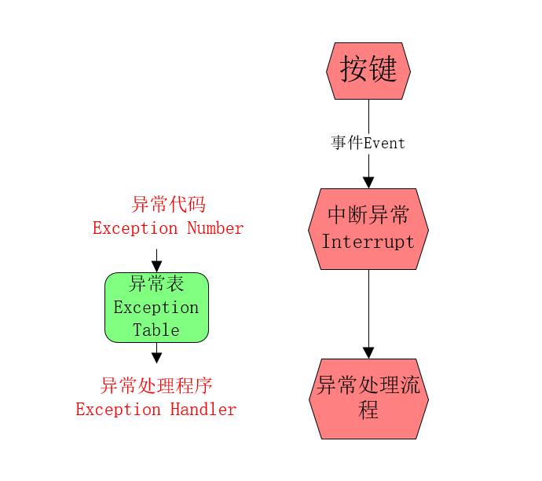

# 异常（Exception）之硬件异常

## 前言

>关于异常的处理，广泛的存在于软件和硬件中，本文会从硬件的角度认识不一样的异常。

广泛的说，**软件的异常需要深入到编程语言**，也就是大家熟知的Exception，当然软件异常也和错误Error有某种关系。

**硬件的异常**，则更加侧重于**软件异常下层封装**，所以必然涉及**硬件与操作系统**。

所以，本文的目的就是**从0开始了解整个硬件异常**，也即非软件异常。


## 正文

> 正文内容全部使用关键字作为指引，引出对应的内容，更多的是概念与理解，还有一些基本的认知尝试。

**注意：硬件异常不只是硬件，还有软件异常，但是绝对区别于编程语言的软件异常，**


### 一、按下键盘之后发生了什么？

使用电脑，就没有见过只使用鼠标的，当你按下按键的那一刻，难道就不好奇，你**输入的内容是怎么呈现到显示屏幕上的吗？**

按键之后，老师会告诉你，此时**按键作为一个事件 Event ，会发送一个信号给到 CPU。**

但是，此时的CPU 不是在那里等你的事件信号，它还在忙着播放你耳机里面的音乐呢，当然如何做到并行就不是本文的重点了。

当按键的事件信号到达CPU的时候，触发了一个**中断（Interrupt）异常**，此时原本CPU执行的程序被打断了，此时CPU内部的晶体管，会有某一个开关的值发生变化，CPU内部会将这个开关的值映射为一个**异常代码 Exception Number**，一旦出现异常代码，CPU 会先保存现场，也就是将当前的执行寄存器数据什么的保存起来，CPU会触发一个异常处理的流程，在获得异常处理程序之后，将后续指令的执行权交给异常处理程序，最终是否会继续执行下一条指令和当前指令，取决于异常处理程序。

已经懵逼的，看下面的图：




**关键一：如何得到异常代码?** 在实现计算机的时候，会预先定义好每一种可能发生的异常，对应的就使用一个异常代码作为标识。CPU 检测到发送的特殊信号，也就是开关值变化的时候，也就可以获得对应的异常代码了。这个代码，俗称为**中断向量 Interrupt  Vector** 。

**关键二：异常处理流程是什么？** 异常处理的流程就会给对应的异常代码，分配对应的**异常处理程序 Exception Handler**。这一步，是CPU 去内存中查询**异常表 Exception Table**，根据表得到异常代码的异常处理程序。异常表一般保存在计算机的内存中，异常表也俗称为 **中断向量表 Interrupt  Vector Table**。

**关键三：CPU保存现场？什么鬼？上下文切换？** 由于异常处理流程，会切换到异常处理程序，需要将当前应用程序执行的程序和所有寄存器都进行压栈，放到程序栈。在发生陷阱异常的时候，会将所有数据放到内核栈中。发生故障异常的时候，执行完异常处理程序之后，还需要重新执行出错的程序指令。上述的压栈，切换执行程序也被称为**上下文切换 Context Switch**。


### 二、常见的异常有哪些？

#### 1）中断异常（Interrupt）

这类异常类比于按键触发的异常，主要发生于**CPU 与外部的 I/O 设备**之间。

处理完异常之后，执行下一条指令，并且属于异步触发。


#### 2）陷阱异常（Trap）

这是一种**主动触发的异常** ，在操作系统中会存在用户态和内核态，来分隔权限操作，当程序的从用户态调用内核态资源的时候，就会触发陷阱异常。常见的调用有文件读取操作，创建进程等。

处理完异常之后，继续执行下一条质量，属于同步触发。


#### 3）故障异常（Fault）

故障异常就**属于意料之外**的了，在计算机中计算两个数平均值操作的时候，就会出现溢出风险，所以就有一种保险的写法，如下：

```python
# python 程序举例

# 会溢出，不推荐
c = （a + b） / 2

# 真确写法
c = a + (b - a) / 2
```

在**内存发生缺页错误的时候**，也会触发故障异常。

注意：内存不是直接拿着使用的，而是有分页，linux 系统默认4k 大小。应用程序不是全部一次加载到内存中的，而是分片，分页加载，使用到哪一页的时候，才会动态加载。

在处理完异常之后，继续执行当前指令，属于同步触发。


#### 4）中止异常（Abort）

中止可以理解为故障的最高等级，**无法恢复**，直接退出程序。

在使用应用程序的时候，内存缺页，还可以加载之后，继续使用，但是**意外中断**，就直接报错，退出了。

中止的处理结果就是退出程序，属于同步触发。


## 结束语

随着技术的发展，很多东西都已经是**固化**的了，在学习的时候，不只是学习它的实现，还需要知道为什么这么做。

如果，计算机不给一个中断信号处理按键的事件，那怎么才能看到输入的字符呢？


