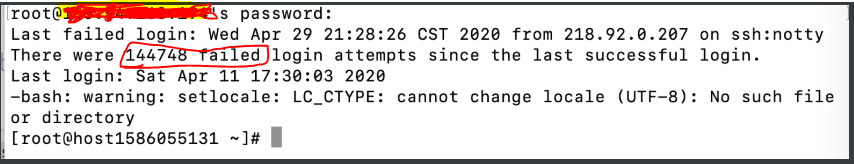
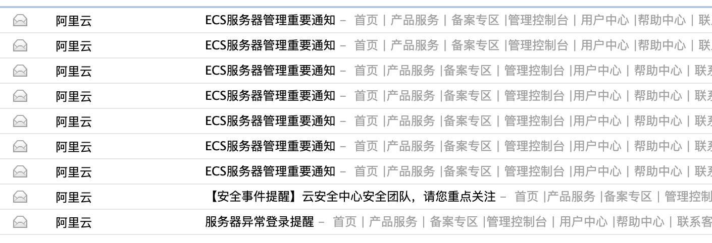
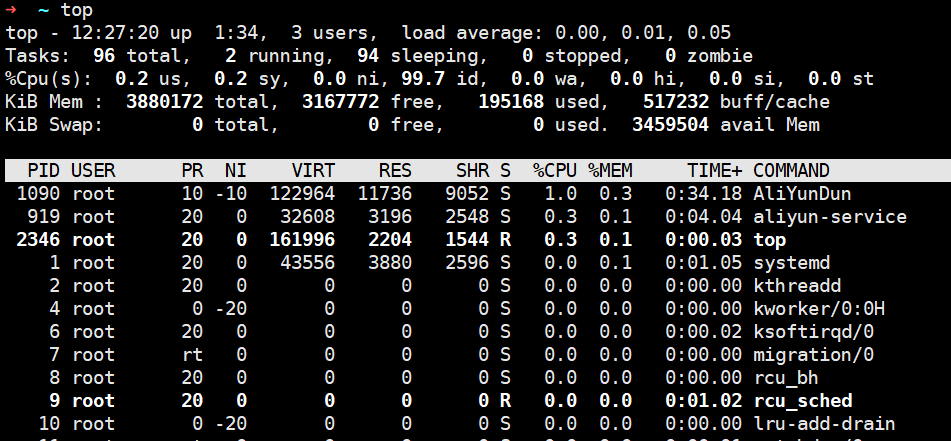

# 服务器被黑-挖矿程序

## 前言

>本文主要纪录一点自己服务被挖矿的某些遗留操作与自己对于黑客意图的推断。

之前也只是听说过**黑客**，虽然说自己的服务器一直有**异地登录失败纪录**，并且很多，看下图：



但是，这一次是直接登录成功了，我震惊了！

被异地登录之后，瞬间**邮箱提醒**多条消息，详细看下图：



同时服务器厂商也会执行访问端口的拦截，但是不影响使用 root 用户登录。

在正文部分，主要会聚焦于解决这次挖矿危机，和删除掉一些植入的文件。


## 正文

> 被植入挖矿程序的时候，还有一丝**窃喜**，终于可以看看黑客是怎么操作的了，算是一次不错的尝试吧！

### 一、杀掉挖矿进程

想要挖矿，就需要资源，想要使用资源，在操作系统层面，必然会有一个或者多个进程，这个进程相当的好找，差不多就是占用 CPU 最多的那个.

所以可以使用 root 用户登录，使用 **top 命令查看**，见下图：



一般情况下，从这里就可以获得以下两个信息：

1.占用CPU 最高的进程PID

2.对应进程的用户，也就是USER 

**可以直接杀死进程吗？**

杀死之后，还会重启进程的哦！需要从根源干掉！


### 二、删掉植入文件

在获得了用户之后，就可以确定就是这个用户的密码已经变成透明的了，当机立断使用 **userdel 命令删掉用户**。

但是内部植入的程序还在哦。如果不信，重启一下服务器，之前的那个进程依然会出现，所以还有问题。

一个问题：如果你是黑客，你会怎么保证你的植入程序，就算被找到了，被kill了，我还可以继续启动起来？

是的，使用定时任务，就可以做到。

瞬间问题简单了，找用户的定时任务，这个**文件在 /var/spool/cron 下**面，没错，就是它，确实在这个文件夹下面存在一个使用用户名命名的文件。

还可以打开看看，这个**定时任务**是怎么工作的，详细内容贴在了下面：

```shell
1 1 */2 * * /home/user2/.configrc/a/upd>/dev/null 2>&1
@reboot /home/user2/.configrc/a/upd>/dev/null 2>&1
5 8 * * 0 /home/user2/.configrc/b/sync>/dev/null 2>&1
0 0 */3 * * /tmp/.X25-unix/.rsync/c/aptitude>/dev/null 2>&1
```

顺带讲解一下**定时任务的格式**：

```shell
1 1 */2 * * /home/user2/.configrc/a/upd>/dev/null 2>&1
# 格式
1分钟 1点 偶数天 每个月 一周的每一天 将/home/user2/.configrc/a/upd  这个文件写到/dev/null文件中，将标准错误(2)也定向到标准输出(1)的输出文件中
# 说人话
在一年中 每一月的 偶数天的 凌晨1点01分开始 给固定文件写入数据，/dev/null是一个字符特殊文件
```

其实，还可以随便看一个源文件是个什么：

```shell
#!/bin/sh
cd /home/user2/.configrc/a
if test -r /home/user2/.configrc/a/bash.pid; then
pid=$(cat /home/user2/.configrc/a/bash.pid)
if $(kill -CHLD $pid >/dev/null 2>&1)
then
exit 0
fi
fi
./run &>/dev/null

```

就不继续看这个挖矿是怎么实现的了，**破坏定时任务**，删除定时任务里面指向的文件，此次挖矿的反挖就算是结束了。


## 结束语

当时我在查找的时候，发现了一个很有意思的点，整个挖矿的植入会让人误以为只是在 /tmp 路径下存在，直到我看到定时任务中的执行，我才明白！

掩护打得很不错，这也就解释了为什么我**清空了 /tmp 路径下的文件，还会重新生成**。

好了，本文就结束了，以后一定要限制系统的用户，搞不好某些用户就被破解了。


