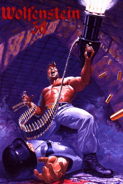
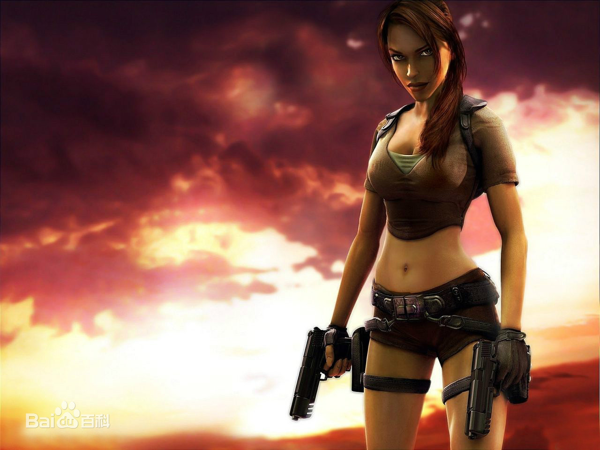
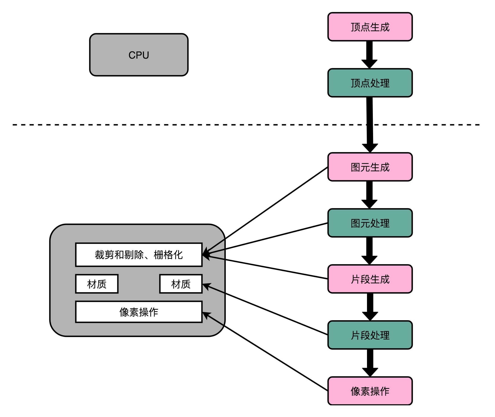
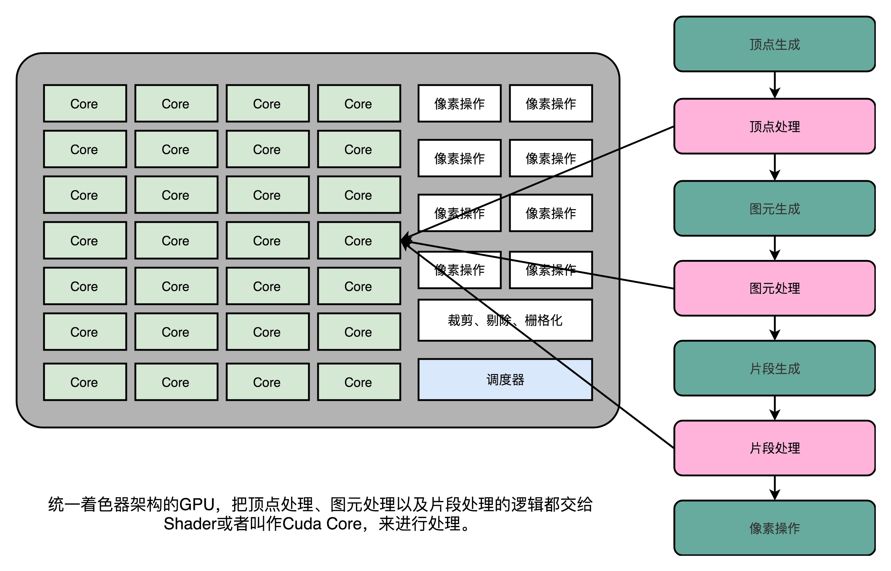
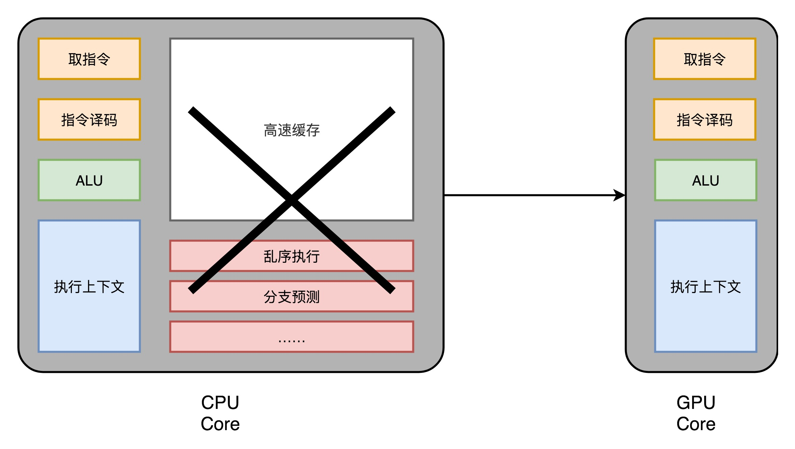
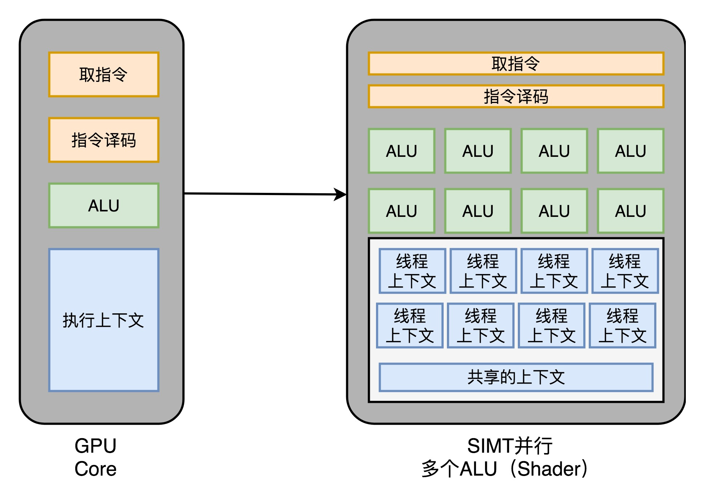

# 浅谈 GPU 发展

## 前言

>关于 GPU 的第一印象，**那就是显卡啊！不就是游戏主机的标配么！**
>
>是的，本文也从一个游戏的图像渲染谈起，浅谈大家熟悉的计算机硬件资源 GPU。

由于此文不涉及 GPU 的架构设计与工作原理，只是介绍整个器件的发展与内部的部件，所以想看点干货的伙伴，可以直接放弃了。

当然，如果你想了解日常很熟悉的 GPU ，但是又不敢说很懂的伙伴，此文很适合你哦！

## 正文

> 全文比较精简干练，需要某些基础常识，比如：**计算机的图像渲染知识，CPU内部机构知识等**。
>
> 如果你没有，那也没关系，我会给你大概介绍一下。

### 一、CPU 的起源

#### 1）SGI公司

这家公司，全称：Silicon Graphics Inc. ，中文名：硅谷图形公司。

创始人是 Jim Clark 教授，同为 网景公司 （Netscape）创始人。

ps：熟悉浏览器历史的应该知道，**网景 与 微软的 IE 之间发生的浏览器之战**，还有目前还可以使用的 **Firefox（火狐） 浏览器**来源。

#### 2）伪 3D游戏

现在的很多3D 游戏，在多年前其实并不是真正的3D ，而是使用事先保存好的图片，当转向一个方向的时候，自动给你加载那个方向的图片。

那么，就会有一个问题：**当转的角度小的时候，其实还是原来的视角，不会进行视角的切换。**

典型的游戏：wolfeniten 3D。

可以看看这个链接的介绍：游戏历史上的今天：《德军总部3D》开创历史：https://www.3dmgame.com/original/3741678.html

#### 3）真3D游戏

真 3D 的效果远远不及现在的手机效果，而当时的**图形渲染使用的 CPU** ，对于整个计算机的性能都是有很大挑战的。

毕竟计算式还需要工作，不能全把资源给用到了游戏的渲染上，那么就会出现一个最常见的问题：**计算机变慢，卡顿等**。

典型的游戏：古墓丽影。

### 二、图像的渲染流程

简短描述：**玩游戏的时候，你看到的场景和人像，都是实时渲染，根据不同的角度，光照，背景进行即时渲染显示的，也被称为多边形建模（Polygon Modeling）。一般，想要流畅的看到3D视图，最好需要 TFLOPS 量级的浮点数运算能力。**

> 一般也将图像的渲染流程称为：图形流水线（Graphic Pipline）。

#### 1）顶点处理（Vertex Processing）

顶端处理的主要目的就是，完成多边形建模的时候，每一个顶点（Vertex ）的确定。

注意，**每一个顶点是三维的，也就是（x, y, z）。**

一旦给定一个**角**度，也就是我们游戏里面的视角，对应的多边形就会有一个主视图，对应的多边形也就是不一样的。最终经过后面的步骤就可以看到 3D 图像。

对应的，**每一个顶点的位置，其实是没有依赖关系的，这也就是 GPU 为什么是并行运算的基础要素。**

#### 2）图元处理（Primitive Processing）

图元处理，主要是将顶点处理得到的每一个点，连接起来，形成一个多边形。

由于屏幕显示的大小是固定的，所以需要对多边形进行**剔除和裁剪（Cull and Clip）。**

#### 3）栅格化（Rasterization）

由于显示屏，是有分辨率的，是由一个个**像素点（Pixel）**组成的，所以需要进行一定大小的栅格化处理。

此时，就已经将一个广域的积分问题，变成了点的积分，也就是定积分了，积分总区间是分辨率，基本单位是一个像素点的大小。

#### 4）片段处理（Fragment Processing）

栅格化得到的结果是黑白的，需要给每一个像素点进行颜色和透明度的计算。

这样子，就得到了单个多边形。

#### 5）像素处理（Pixel Operations）

由于在屏幕显示的是多个多边形的像素点的叠加，那么就会出现重叠和遮盖，此时需要重新定义每一个像素点的颜色。

最终呈现到的结果就是有颜色的3D画面了。

### 三、GPU 之  3dFx Voodoo 和 NVidia TNT

3dFx Voodoo 和 NVidia TNT作为早期的 GPU 代表，很有必要聊聊。

使用计算机渲染图像的时候，并不是直接将整个渲染流程全部扔给了 GPU。而是需要 CPU的辅助完成。

**早期的任务分配：**

CPU：顶点处理。

GPU：图元处理，栅格化，片段处理，像素处理。

**带来的局限性：由于GPU依赖于 CPU 的顶点处理作为输入，所以速度肯定快不了，并且在整个计算机渲染的流程中，CPU的性能决定了计算机的输出图像快慢。**

### 四、GPU 之 GeForce 256

GeForce 256这个显卡是 1999年NVIDIA 推出的，此时的改变是：将原本CPU完成的顶点处理移到了GPU里面，此时整个图像渲染不完全依赖于CPU。

但是**图像的渲染过程是由硬件里面固定的管线来完成的，只能通过更改配置完成不同的图像渲染。**

ps：此时你就把GPU看做是一个完全固化的电路板，给你输入就能得到输出，简单且单一。

### 五、GPU 之 微软 Direct 3D 8.0

微软终于在之前的更改配置上做了一次大的改进，引入了**可编程管线（Programable Function Pipeline）。**

也就是**将顶点处理部分和片段处理部分进行了编程处理，**什么意思？

就是可以直接写程序，将上一部分顶点给我按照程序的流程运行，对应片段处理也是如此。还不能理解吗？

之前是一个死的电路板，现在可以根据程序动态的改变运行的方式。

可以实现的**编程接口被叫做 Shader， 中文名字：着色器。** 

这些接口可以让我们进行**动态的处理光照，亮度，颜色。** 

但是，此时就出现一个可编程带来的**性能问题**：可编程就代表有指令集，有指令集就代表最好统一，但是目前的编程接口是两个，分别是： Vertex Shader 和 Fragment Shader。他们使用的是分开的两个电路，关键还使用的是两个指令集。

对应于流水线的图像渲染流程，必然导致前面的Shader 在运行的时候，后面的Shader 在等着，反之亦然，性能衰减一半！

### 六、GPU 之 微软 XBox 360

如果想解决性能问题，需要做的是重新设计整个CPU对于图像处理的架构，但是呢？

那个时候正是微软捆绑游戏机XBox 360 大卖的时候，有钱啊！

所以，新的**统一着色器架构（Unified Shader Architecture） 出自微软之手**，也不足为奇，毕竟游戏最需要的就是实时的 3D 渲染，并且越真实，客户越喜欢。

此时，**架构上，Shader 统一了 定点处理，图元处理，片段处理，通过一个统一的调度器进行调度。**

此时的 **Shader 已经完美升级了，也被称为：通用模块，也是 GPGPU （General - Purpose Computing on Graphics Processing Units ）通用图像处理器的来源。**

### 七、现代 GPU

> 终于发展了这么多年，来到了现代。

#### 1）GPU 架构组成

GPU 一直都是为了解决：CPU进行图像渲染的大量计算。

由于为了图像渲染服务，而图像渲染是流水线形式，也被称为：**流式处理（Stream Processing）。**

那么，就**不需要类比于 CPU 结构中，为了解决控制冒险的分支预测，解决数据冒险的乱序执行。只需要核心的功能就可以。**

所以，GPU 内部**只需要：取指令，指令译码，ALU，执行上下文。**

#### 2）SIMT 技术

如果你熟悉 CPU ，那你就会知道 **SIMD技术**，程序可以直接调用 CPU的指令集进行运算，大大的提升了程序的性能。

类似的，**GPU 内部使用的  SIMT（Single Instruction Multiple Threads） 技术**，同时将多条数据，交给不同的线程去处理。

那么，我们的GPU就会有多个ALU，关键图像渲染天然可以并行操作，所以不用担心数据冒险等等问题。

#### 3）流水线停顿

由于 GPU 使用的是流式处理，那么必然会存在流水线停顿。那怎么办/

当然是插入一下 NOP了！但是，当前执行的线程栈直接丢弃吗？

肯定不是啊，保存起来呗！直接使用线程上下文寄存器保存就可以的哦！

所以，一个 GPU 内部，至少需要 2倍 ALU数量的  线程上下文寄存器。

### 八、未来 GPU

GPU 不管怎么说，都只是为了解决图像的渲染计算量。

想把 GPU 用在大量的数学计算，还是需要特定硬件电路的新设计，所以最新设计的GPU，内部都加上了新的内核逻辑，**比如加入 Tensor Core，内部直接支持矩阵乘法等复杂运算。**

## 结束语

最后的最后，终于写完了 GPU。

回看整个GPU的历史与发展，解决的痛点没有变，架构却发生了很大的改变，不同的设计产出物也是不一样的。

如果想从原理层面理解程序的执行，理解一下基础知识还是很有必要的，推荐搞定 CPU的运算和存储器。

可以看到这里的伙伴都是真爱了，哈啊哈哈！

阅读愉快！

## 参考链接

1.GPU的历史：https://www.techspot.com/article/650-history-of-the-gpu/

2.现在GPU架构设计：http://117.128.6.33/cache/haifux.org/lectures/267/Introduction-to-GPUs.pdf?ich_args2=528-17122915021655_1a31d6e97ce02c01816f07f468a23d04_10001002_9c896c25d1cbf8d69339518939a83798_3ba1a55c513c76406136b3e9fcf05d3c

3.https://www.cnblogs.com/wwj99/p/12836176.html

