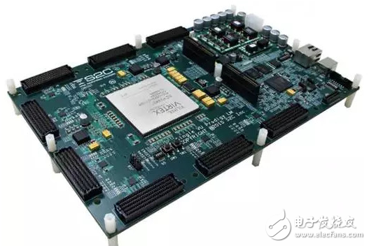
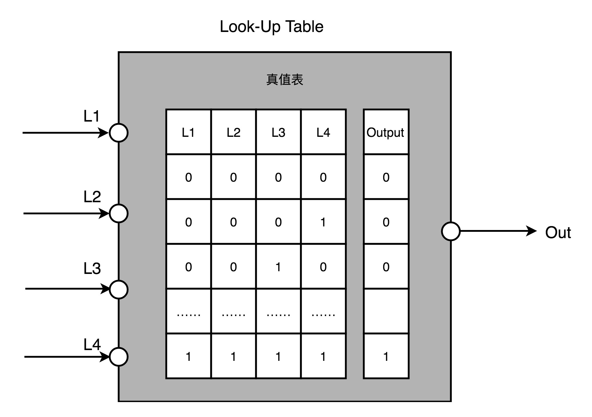
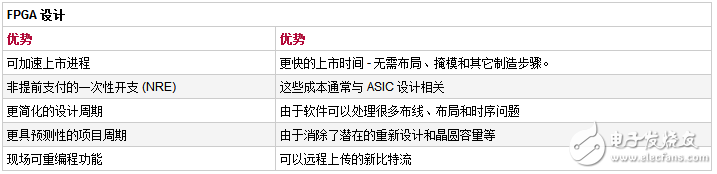

# FPGA 的那些事

## 前言

>本文会简单介绍 FPGA的应用场景和组成原理。

关于 FPGA 自己一直将其归为电路，那么**什么是电路？边界在哪里？......**

很多问题，其实是没有确定的答案的，那么此文希望可以解此疑惑，阅读愉快！

## 正文

> 文中没有繁杂的概念，只需要对于**芯片（CPU， GPU）和编程**有所了解就可以。

### 一、CPU 芯片的硬件实现

大家可能都知道了**芯片的原材料是石英砂**，也就是沙子，但是给你一斤沙子，也就只是价值一斤沙子的钱，和一斤芯片是没法比的。

CPU ，说白了就是一个微电路，使用简单的门电路搭出来。

**最基本的门电路**，无外乎：**与、或、非、异或等**。

稍微组合一下，就会变成：**半加器、全加器、D触发器等。**

继续组合一下，就变成了具有完整功能的 **ALU**，称为运算单元。

电路**完成的功能有：实现计算功能、控制数据访问、创建出寄存器和内存的时序逻辑等。**

以上基本上就构成了大家熟知的CPU，一般CPU内部的晶体管的数量单位是XX亿。

### 二、设计CPU

关于如何设计CPU，肯定是可以使用最简单的逻辑单元，一层一层的组装，但是怎么验证自己的设计呢？

难道是全部设计完成了，测试一遍吗？

肯定不行的，如果设计失败了，那么成本不就没有了，再加上设计CPU使用的时间是按照多少月来算的，不是按照分钟。

那么有没有好的方法完成CPU的设计呢？

有的，**可以直接使用一个硬件，进行编程，根据不同的程序实现不同的硬件电路连接。**

### 三、FPGA

这里只是描述最**本质的内容**，不纠结某某实现中，使用FPGA实现了什么。

**FPGA，全称 Filels Programmable Gate Array，中文名 现场可编程门阵列。**

描述一下其特点：

1）可以使用编程来进行控制硬件地电路连接；

2）可以重复，多次编程，重复利用；

3）编程内部连接的是一个个门电路；

4）FPGA内部存在多个阵列一般的门电路。

#### 1）查找表

FPGA的可编程，不是直接运行代码，运行机器码。而是，在真值表中读取输入对应的输出，操作电路。

那么，什么是真值表呢？

真值表就是在软件里面设计的逻辑电路，算出来的。并且将这个真值表存放在**查找表（Look Up Table）**里面。

在使用的时候，直接去查表，就可以得到对应的输出。在本质的思想算是编程的一种，只是一次就给了所有的可能输入和所有的输出，需要的使用的时候，对照匹配即可。

#### 2）逻辑簇

FPGA需要实现时序逻辑电路，那么可以将D触发器作为寄存器。

**将查找表 LUT 和寄存器组合起来，就变成了逻辑簇（Logic Cluster），也被叫做CLB（Configurable Logic Block）可配置逻辑块。**

#### 3）可编程逻辑布线

可编程逻辑布线就是连接FPGA内部的CLB，同步控制不同的连接线路实现不同的功能组合。

这个控制线路的功能，是通过变成实现的，其实也就是我们知道的查找表。

### 四、FPGA  的优势

关于优势，其实最大的就是可编程，并且没有硬件的研发成本。仅仅需要面向查找表编程即可。

对比见下图。

### 五、FPGA  的劣势

还别说劣势还有很多，最大的就是浪费。

由于FPGA使用的可编程模式，注定每一个逻辑簇内部会有多个门电路，也就是与或非等。相比较一个单片芯片，内部的晶体管数量增加了多倍，那么**成本就高**了！

在芯片规则中，会有一个功耗的问题。

晶体管不是吃空气的，它是**吃电**的，所以晶体管数量多，自然就**功耗大**！

## 结束语

关于FPGA的相关内容就简单地介绍到这里，关键是理解最为**可编程芯片的设计思维。**

具体到场景使用的时候，那就需要针对特定场景设计对应的查找表，综合外部组合配件使用了。

阅读愉快！

