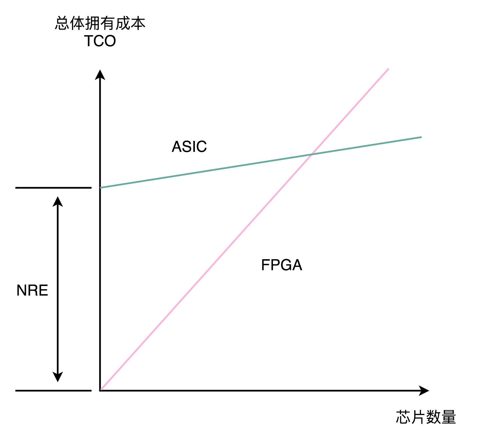
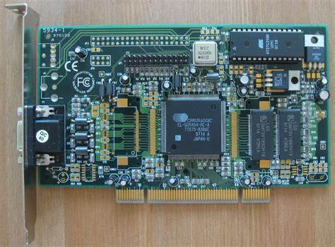
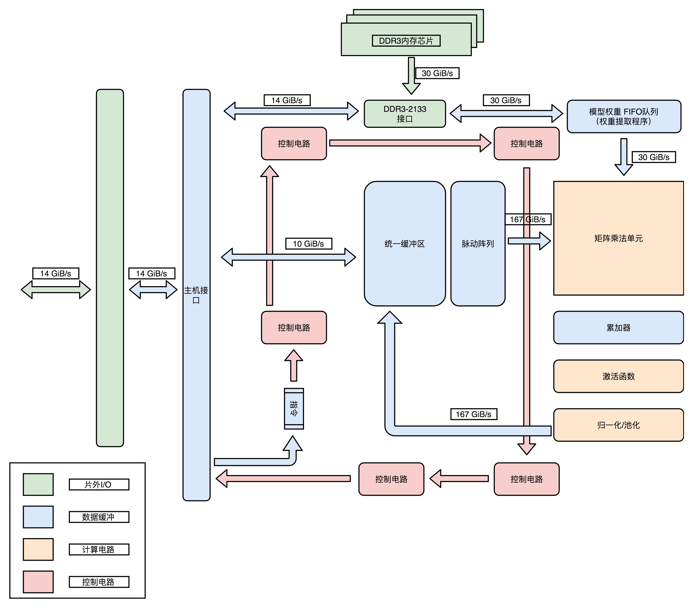
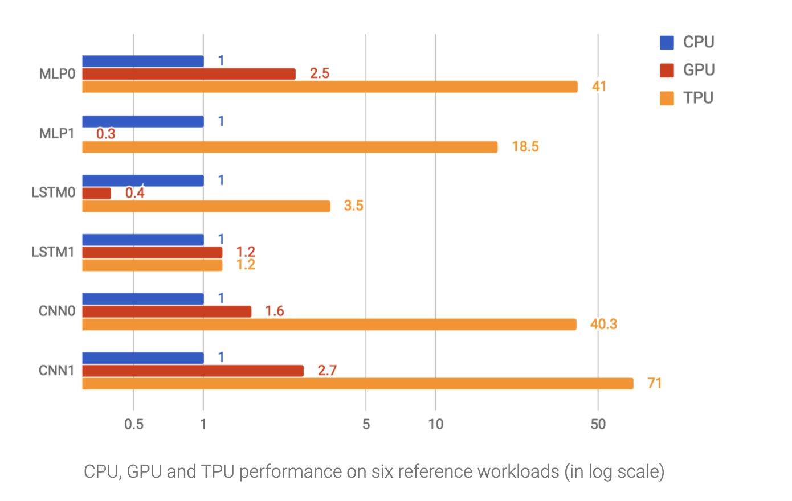

# ASIC 芯片之 TPU

## 前言

>ASIC芯片，看似属于一个陌生的名字，实则存在于生活中的很多地方。
>
>比如：摄像头里面的芯片，音频处理芯片，还有深度学习中的 TPU 芯片。

本文会介绍**ASIC芯片设计原理，成本控制**，应用广泛的T**PU芯片设计逻辑和一点深度学习的知识**。

## 正文

> 文中会有一些生涩的概念，但如果从**科技的发展**来看，就会简单一下。
>
> 顺带思考一下让你来优化，你会怎么做？

### 一、专用芯片之 ASIC

一般意义上的芯片会有：**CPU，GPU，FPGA**。

但是上述的芯片是不够的，那么这就是一个技术的盲区，当然会有新的产品产生，那就是 ASIC设计理念的其他芯片。（理论上，早期的GPU芯片也属于ASIC，对FPGA芯片编程之后就变成了ASIC芯片。）

**ASIC 全称 Application Specific Integrated Circuit，中文名：专用集成电路。**

所以，ASIC属于专用设计的一类芯片，所以电路更加精简，制造成本也就更低。

一般ASIC芯片的电路设计需要经过仿真，验证，流片（Tape out），变成电路板，再变成芯片。

### 二、ASIC的成本控制

由于ASIC新品的整个研发的时长和花费，都很昂贵。

所以在业界，当少量的ASIC芯片使用的时候，可以使用FPGA芯片编程替代ASIC芯片。

对应的**成本控制名词有，总体拥有成本（Total Cost of Ownership），NRE（Non-Recuring Engineering Cost，一次性工程费用）等**。

并且，对于ASIC芯片的生成和成本，还有相应的成本与数量的关系示意图。

### 三、深度学习初探

> 关于深度学习，是一个熟悉名字，但是不熟悉内容的状态。
>
> 毕竟深度学习的专业性还是很强，所以下面的内容只简单说明。

#### 1）初识训练和推断

深度学习的可以大概分为两大部分，**首先是深度学习的训练部分，将训练完成的模型存储下来，根据这个模型输入对应的参数，计算得到一个最终的计算结果，这一步叫做深度学习的推断部分。**

#### 2）理解深度学习的推断

深度学习的推断花费的时间比训练的时间长很多。

所以TPU 主要解决痛点就是：优化深度学习的推断。

一般的深度学习推断具有以下的几点特点：

**1.推断的工作更简单，对灵活性的要求比较低。**那么其电路设计可以更加趋向于流程化的处理思维。

**2.推断的性能，首先保证响应时间的指标。**一般评价性能会有吞吐量（Throughput）和响应时间（Response Time）两个指标，其意思都是字面意思，不难理解。

**3.推断工作的功耗低。**作为成本估计，肯定是尽可能的少点功耗，不就省钱了！

### 四、理解 TPU 设计

> 如果想深入理解TPU，推荐直接看文末的参考链接，直接去看看TPU的开发商Google是怎么讲解的。

#### 1）向前兼容

任何一个产品的设计，想要做大做强，向前兼容，不断地更新，才会越来越好，才能存活下去！

毫无疑问，这就是首选项。

在计算机主板上面，可以跑得最快的方式，除了内嵌的方式，就是使用PIC总线的方式。

一代TPU就是一个插在主板PCI-E接口上的板卡，这样首先保证了主板怎么变，我就只需要完成自己的功能就可以，我们之间的通信只需要PCI就可以！

注意：这种设计，不同于CPU，GPU，没有取指令的电路，只能被动地接受来自CPU和GPU的指令。

#### 2）快速面向市场

在软件开发领域有这么一句话：**Fail Fast !**

当然不是字面的意思，失败的更快？

而是，想通过快速的失败验证自己的猜想，更快的实现某些功能和想法，将其应用于市场上，也就是要快速去市场上接受检验。

当然，产品质量也是一个值得放在第一位的！

#### 3）推断专用电路

关于专用电路的使用，其实对应于一个深度学习中推断过程中一个层（Layer）。

一般是**顺序的串联：矩阵乘法单元（Matric Multiply Unit），累加器模块（Accumulators），激活函数模块（Activation），归一化/池化模块（Normalization/Pool）。**

将上述模块顺序的串联起来，就是整个深度学习的过程，对应于电路设计的时候，也就是一个固定顺序的电路。

那么，这就是一个ASIC的电路了。TPU模块图如下。

#### 4）SRAM 高速缓存

在这个TPU的设计中，必然会有缓存区的存在，由于在整个推断的过程中，会被反复的进行矩阵乘法单元读写，完成计算。

那么，在高速缓存的设计中，CPU使用了SRAM，那么TPU也可以这么玩。

在TPU的内部，有一个统一缓存区（Unified Budder），是使用SRAM完成的，其具有远远大于内存的读取速度。

TPU的芯片布局图如下所示。

#### 5）8 Bits存放浮点数

一般CPU 内部存储浮点数使用的是32Bits，但是在 深度学习的过程中，会使得数据的变化不大，一般不需要那么高的精度。

至于为什么数据变化不大，可以自己查查，其实和归一化/池化模块（Normalization/Pool）的处理有关。

关于浮点数的表述，涉及很多内容，可以自行了解，顺带理解一下定点数，大数吃小数问题。

#### 6）TPU的性能

关于性能，还是直接看Google的论文，在文末，我只贴上一张图，了解一下关于CPU，GPU，TPU的性能对比。

## 结束语

关于ASIC和TPU的内容就介绍到这里了！

关于后续的了解，其实已经属于自己的爱好了，但是对于这个芯片领域，每一款产品的出现都不是巧合，而是硬需求与硬质量。比如手机的ARM芯片。

既然谈到TPU了，顺带延伸一下就到分布式，数据中心，还有大家都熟悉的虚拟机，云端的镜像等等。

莫着急，慢慢来，我给你慢慢全部写出来，勾勒一个科技的地图。

## 参考链接

1.Why Software Is Eating the World：https://a16z.com/2011/08/20/why-software-is-eating-the-world/

2.A New Golden Age for Computer Architecture：https://cacm.acm.org/magazines/2019/2/234352-a-new-golden-age-for-computer-architecture/fulltext

3.In-Datacenter Performance Analysis of a Tensor Processing Unit：https://arxiv.org/ftp/arxiv/papers/1704/1704.04760.pdf

4.An in-depth look at Google’s first Tensor Processing Unit (TPU)：https://cloud.google.com/blog/products/gcp/an-in-depth-look-at-googles-first-tensor-processing-unit-tpu

