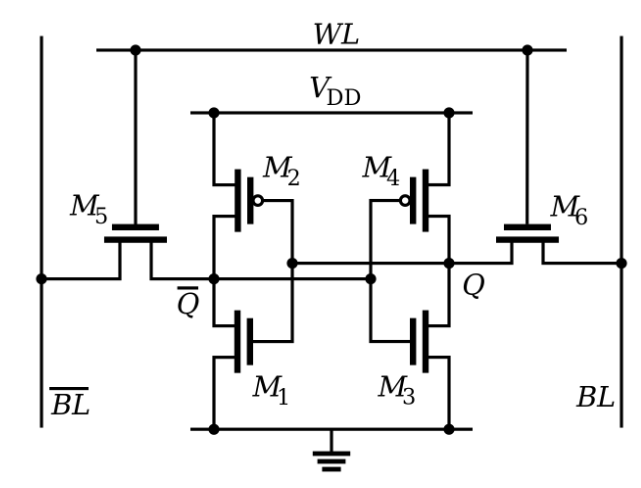

# 计算机存储器的层次结构简介

## 前言

>之前写过GPU、FPGA、ASIC、TPU，这些芯片的组成与原理。
>
>接下来将从存储出发，一起看看那些熟悉又陌生的名词。

本文的内容涉及：寄存器（Register），缓存（Cache），内存（Memory），硬盘（SSD/HDD）等。

并不深入到每一个细节，但是会有其组成结构、性能和价格的比较。算是一篇科普文。

## 正文

> 全文，规划的是总分式描述，全方位了解整个存储器层次结构。

### 一、存储器全景图

总览计算机的存储器全景图。

其中，一共分为了**三大块：CPU，内存，硬盘。**

**六小块：CPU内部寄存器，CPU L1 Cache，CPU L2 Cache，CPU L3 Cache，内存，SSD硬盘，HDD硬盘。**

从寄存器到HDD硬盘，I/O速度越来越慢，价格越来越低，容量越来越大。

所有的存储器，只可以和自己相邻的兄弟之间进行数据的交换，体现了软硬件共存在的一个现象：分层处理，减少耦合。

关于具体每一部分的性能，价格，成本，对比，参看链接：https://colin-scott.github.io/personal_website/research/interactive_latency.html

### 二、寄存器（Register）

寄存器是直接在CPU内部的，在学习微机原理的时候，内部会介绍很多寄存器，比如：移位寄存器，标志位寄存器，等等。

准确的描述：**寄存器和ALU等功能单元组成了CPU。**

寄存器只能存放有限的信息，但是速度是最快的，和CPU同步触发。

### 三、CPU 高速缓存（CPU Cache L1）

这里我将高速缓存三件套拆开描述。

L1 Cache，不仅仅只是缓存使用，与其对标的还有另一种计算机体系结构，那就是哈佛结构。

其中，**每一个CPU核心，会有自己独立的L1 Cache，并且每一个L1 Cache分为两半，一半作为指令的缓存，另一半作为数据的缓存。**

**一般会将L1 Cache嵌入到CPU的核心使用**，目的是降低物理大小带来的电信号传输距离，带来的耗时，所以L1 Cache都是很小的。（瞬间感觉这个设计的考量是非常厉害的，竟然使用到了物理尺寸对于电信号传输的延迟。）

而**数据缓存与指令的分别缓存也是哈弗结构的核心思想，**只奈何冯诺依曼体系结构描述了通用的计算模式，也即：**任何能被看作输入的数据，都可以通过计算，得到输出**。这已经不仅仅是计算机了，深入到哲学就是一个苦海无涯回头是岸的大结局了，由于其描述的边界宽而泛，必然会是一个创世之举。

### 四、CPU 高速缓存（CPU Cache L2）

关于CPU Cache L2，类似于L1 Cache，也是每一个CPU核心自己的，属于私有。

只不过L2 Cache，就不内嵌到CPU核心了，而是比L1 Cache远一点的存储器，所以其访问速度比L1 Cache慢，但是因为离得远，复杂度就会稍微低一点，自然价格也就便宜。

### 五、CPU 高速缓存（CPU Cache L3）

CPU Cache L3，是多个CPU核心公用的存储器，尺寸会更大，访问的速度也就比 L1 Cache 和 L2 Cache 慢。

但是更便宜。

也正是这种CPU的三级（或者叫做四级缓存），会出现并发编程的bug，由于数据在每一个CPU核心内部的隔离性，会出现数据的并发问题。

这里还可以扩展谈谈并发编程中的可见性，也就是大家熟知的Happen-before规则。

### 六、SRAM芯片

SRAM，全称：Static Random-Access Memory，中文名字：静态随机存取存储器。

SRAM是一种芯片，其组成了上面提到的CPU高速缓存。

SRAM具有的特性：断电数据丢失，想要保存数据必须通电。当然不是通220v的啊！

SRAM的设计，使用6~8个晶体管，存储一个比特的数据，所以其存储数据的密度先比较后面说的DRAM就很低了。在相同的物理空间中，存储的数据有限。但是由于其结构简单，所以访问的数据很快，这也是作为CPU高速缓存使用的原因！

SRAM的电路结构图，如下所示：

### 七、内存（Memory）

关于内存，大家是非常熟悉的。

一般用户会说：我电脑的内存不够使用了，程序员兄弟们会说：内存泄漏.......

内存作为一个独立的硬件，可以直接插拔于电脑的主板上，并且和使用主板的双通道功能，组合多个内存变成一个大号的内存，从而可以使用更大的内存空间，而我现在使用的主机就是使用了两个8G的内存。

**一般组合内存条的时候，需要保证内存条的同频率，同厂商，同大小。**频率是必须保证的，后两个最好一直，不然计算机会出现莫名的错误，一般内存出现问题，计算机是直接挂掉的，并且迅速挂掉，没有一丝犹疑。

同样，内存的作用大家也都是知道的。

内存属于断电丢失的硬件，由于远离CPU，具备体积大，价格相比较便宜，容量更大的特点。

### 八、DRAM芯片

DRAM，全称：Dynamic Random Access Memory，中文名：动态随机存取存储器。

DRAM的组成：一般使用一个晶体管和一个电容存储一个比特的内容。所以，它相比于SRAM的内部存储密度就高，并且同样地物理空间，存储的数据也就更多。

DRAM的工作原理：需要不断地刷新，保证电容不断电，进而保证数据被存储起来。电容这个器件，会在使用的过程中自己释放电，这也就是你的电容式充电宝，时间长了，里面的电量就没有的原因。

关于DRAM的数据访问电路和刷新电路比SRAM复杂，所以访问的时长也就更长。但是，便宜！

### 九、SSD硬盘

关于SSD的速度，大家不会陌生，现在的老电脑，换一个SSD，瞬间电脑年轻了好几岁，哈哈！

其实，电脑变慢的原因也还和存储器使用的时长有关，只是没有换SSD来的实在。

SSD，英文名：Solid-state drive，中文名：固态硬盘。

其实，大家都是知道这个好，这个厉害，大家不知道的是，其实你买的240GB得固态硬盘，其实真是的大小是250GB多，一般会有多余的10%空间，至于为什么，会在后续的文章进行介绍，敬请脐带。

SSD内部使用的是NAND芯片，价格已经很亲民了，还没有使用过的，可以考虑618入手尝尝了。

由于SSD是外部设备，价格肯定亲民，容量也足够大，当然还有一大，那就是体积大，哈哈！（相比之下，体积可以忽略了，也就巴掌大，再小一点，不好拿手上了。）

### 十、HDD硬盘

HDD，全称：Hard Disk Driver，中文名：机械硬盘。

HDD的内部设计，使用的是磁盘的结构，里面有一个电机，在那里转转转，由于磁盘的结构天然受限，速度不及SSD。

但是，机械硬盘比SSD耐用，使用的时间会长一些，SSD内部的存储块是有使用时限的，不能无限的擦除重写，当然这也和NAND相关的算法实现有关了。

## 结束语

本文属于干货和认知的大集合。

其中内部抛出来了很多问题，有关于并发编程的，有SSD工作原理的，有计算机体系结构的....

最后，感谢你看到这里，其实完全可以将这篇文章作为一个指引，自己去深入了解每一部分的内容，想想都很刺激，这就是一个折腾的旅途啦！

阅读开心，增长知识与见识！

## 参考链接

1.Latency Numbers Every Programmer Should Know：https://colin-scott.github.io/personal_website/research/interactive_latency.html

2.Teach Yourself Programming in Ten Years：http://norvig.com/21-days.html

3.Building Software Systems at Google and Lessons Learned：https://static.googleusercontent.com/media/research.google.com/en//people/jeff/Stanford-DL-Nov-2010.pdf

