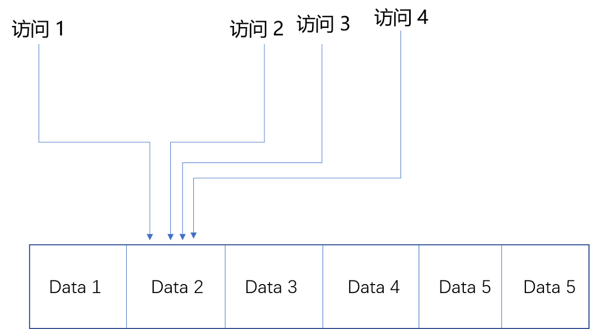

# 局部性原理

## 前言

>局部性原理，属于一种思想，其分为**时间局部性和空间局部性**。
>

最近在文章比较分散，但是又有很多关联，比如**最近的文章脉络主线：从存储区出发，认识整个存储器的层次，从业务开发的角度了解局部性原理，懂得缓存的设计考量，进而延展到链表这种数据结构，并且使用链表实现LRU缓存淘汰算法。**

看似没有关系的，存储器，局部性原理，聊表，LRU缓存淘汰算法，其实内部错综复杂，并称为一体。

敬请期待后续更新。

## 正文

> 本文主要从局部性原理的描述出发，基于常见存储器件，分析商城类网站的存储考量。
>
> 内容偏理论，但是知识无边界。

### 一、局部性原理（Principle of Locality）

关于局部性原理，需要知道局部性原理应用于生活的方方面面。

举个例子：网站使用的开源缓存Redis，Memcach；编程语言的数组结构，在加载内存的时候是直接将一排取走，尤其是在遍历的时候，可不是一个Byte的取数据啊；浏览器本地的Cache，当发现某一个请求出现304状态码，那这就是使用的电脑本地的存储，根本就没有走网络请求.......还有很多就不一一描述了。

所以，我们可以**使用局部性原理，制定策略管理和访问我们的数据，**可以看做是一个投机取巧的方式，但是其实实在在的减少了成本。

在完成某个项目的时候，有两个关键性的因素：一个是成本可控，另一个是质量过关。既然可以降低成本，何乐不为！

在物理世界中，将局部性原理分为：时间局部性原理和空间局部性原理。

### 二、时间局部性原理（Temporal Locality）

时间局部性原理，描述的是：一个数据被访问之后，它还会在接下来的一段时间内被再次访问到。

举个例子：网站的缓存中间件。

其实，这么说，还是很抽象的，需要自己想一些例子。

### 三、空间局部性原理（Spatial Locality）

空间局部性，描述的是：如果一个数据被访问之后，那么它的相邻数据也会被访问到。

举个例子：数组这种数据结构在加载到内存的方式。

### 四、计算机存储器性能与价格

再一次出现计算机存储器的标题，主要描述不同存储器的成本和访问延时，进行不同数据存储的实战分析。

先来看看计算机存储器的层次结构简介中，提到的不同存储器的价格图。

一般的业务缓存数据存储，不会直接将不会直接换到CPU内部，CPU内部缓存的是计算的数据，并且这么贵的器件用来缓存业务数据，操作系统也不答应啊！

所以业务的缓存数据就只会在内存中，硬盘（SSD和HDD）里面。

**内存：一秒可以访问的次数大约是100万（1s / 100ns），价格是0.015美元/MB。**

**SSD硬盘：一秒可以访问的次数大约是6666（1s / 150 微妙），价格是0.0004美元/MB。**

**HDD硬盘：一秒可以访问的次数大约是100（1s / 10ms），价格是0.00004美元/MB。**

### 五、商城类网站存储考量

> 在开始之前，你需要明白，任何业务程序扛不住请求的时候，都是存储先扛不住。
>
> 所以数据库领域，已经研究了**关系型存储，非关系型存储，对象存储，文件存储，块存储，键值存储等形式。**

假设现在有一个商城网站，存储10亿的商品信息，一份商品信息为10MB大小。

那么占用的存储空间是3800TB（10亿 * 4MB）。

#### 1）所有信息全部存储在内存

选择使用的内存是一条8GB，价格是120美元（8 * 1024 * 0.015美元/MB）。

那么需要内存的条数：48.6 万（3800TB / 8GB）。

总共的花费：5800万美元（48.6 万 * 120美元）。

一秒可以访问的次数大约是100万，所有内存全部使用，最大可以支持的最大访问量是5亿（48.6 万 * 100万）

当然，并不是所有的数据全部直接都进入了内存中，必须要使用硬盘进行配合。所以成本很高！但是我们的访问量多啊，所有的数据全部都进行了缓存。

#### 2）所有信息存储在HDD硬盘

选择使用的硬盘是4TB大小，价格是170美元（4 * 1024 * 1024 *0.00004美元/MB）。

那么需要硬盘的数量：950（3800TB / 4TB）。

总共的花费：16万美元（950 * 170美元）。

这里面的16万美元，已经是很少了，还不如全部使用的内存的零头。但是我们忽略了另一个因素那就是，硬盘的访问延迟。

硬盘一秒可以访问的次数大约是100，此时我们所有的硬盘全部工作，可以支持的最大访问量是9.5万（950 * 100）。

相比较内存，这个数量值，直接可以被忽略。

#### 3）局部性原理之缓存

由于商城的很多数据其实是并不会被经常访问的。所以将其存储于硬盘，而那些经常使用的数据，直接缓存在内存中，在机器提供服务之前就进行热点数据的预判，进行热加载。

如果将1%的数据，存放在内存中，99%的数据存放硬盘，使用时间局部性的原理进行数据存储。

那么成本不用计算就知道肯定降下来了，并且降低的非常多，对应的访问性能，相比较全部使用HDD硬盘好很多。

使用缓存之后的成本，大约是 590万（5800万美元 * 0.1 + 16万美元 * 0.9）。

### 六、缓存

缓存的分配利用上具体使用的是时间局部性原理，将经常访问的数据存储于链表的数据结构中，将不长用的数据剔除。

保证了内存中的数据一直都是热乎的~

当然，缓存的实现最常见的就是**LRU缓存算法（Least Recentlt Used）。**

其中，在实际的业务场景中，需要结合业务量，用户量，动态的选择缓存的数据量，其中有一项衡量指标，**缓存命中率（Hit Rate /Hit Ratio）。**

缓存命中率，太低就浪费了缓存，太高，老板给奖励！

## 结束语

稍微总结一下，局部性原理只是一个学习道路上的一条加餐菜。

不知道也没关系，但是知道了，你就可以组成一个串串，挨个去查点自己的知识掌握程度。

关于缓存，这还没玩哈！后续还有链表等你玩，最起码自己实现一个LRU缓存算法。

