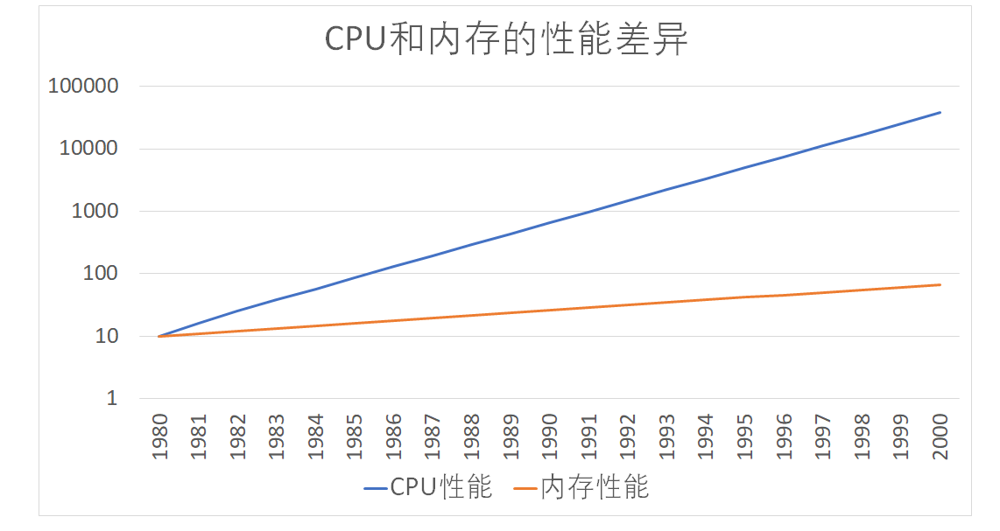
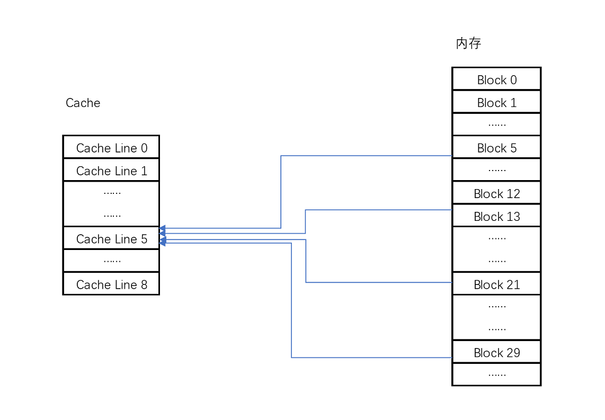
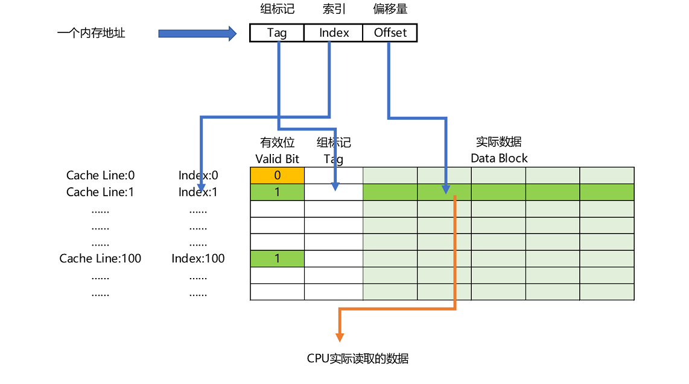

# CPU Cache之数据读取

## 前言

>在之前介绍了计算的存储层次体系，了解了时间与空间局部性原理。
>
>从现在开始，将进入存储器对于数据读写的设计。

关于存储器之间的数据读取，所有的设计与思想都是非常巧妙的，也会非常烧脑。

一般情况下，你需要**掌握二进制的各种操作，一些公认的存储大小，有性能优化的思想......**

## 正文

> 本文描述的是**CPU流水线中的取指令，取数据是怎么从内存和CPU Cache中获得的，会介绍直接映射Cache的实现策略。**
>
> 耐心看，我也耐心的写！

### 一、摩尔定律

关于摩尔定律，详细的内容就不描述了，只简单介绍一下：它描述了，计算机中**CPU的访问速度每18个月便会翻一番，相当于每年增长60%。**

但是作为直接和CPU打交道的**内存（Memory），每年的访问速度增长只有7%。**

那么随着时间的推移，这两者之间的访问速度差，必然会越来越大，那么CPU就在那里睡大觉了，这不可以吧！

从CPU的Cycle角度来看，访问一次内存需要100多个Cycle，也就是CPU的访问速度比内存块100多倍，这个差距是非常大的。

所以，CPU高速缓存，CPU Cache也就应运而出，关于为什么分为3级缓存，就只能自己领悟了。

根据有关统计，CPU的L1-L3 Cache 会将CPU 95%的访问全部拦截，只有5%才会直接去访问内存。这就大大的节省了等待的时间。

### 二、缓存块（Cache Line）

**缓存块（Cache Line），表示我们的CPU从内存读取数据到CPU Cache的过程中，是一块一块的读取。**

也就是说，内存存储的就算是连续的（array），我们每次读取的数据也被硬性的给你分成一块一块，并且这个块的大小是固定的。

就好像，我只有固定大小的水壶，每次只能灌满这一壶水，你水很多，我装不下啊！

**在PC和Intel服务器中，Cache line 的大小是64字节**，也就是我的水壶只装64字节，其他的不要。

了解操作系统的伙伴，会知道有一个叫做**内存页**的东西，它表示的是我的内存中固定大小的存储的最小单位，linux默认的事4kb，哪怕你存一个字符，我的文件也是4kb，可以自己测试一下的。（内存页和缓存块类似，都有大小的限制，但是本质完全不是一个东西，别乱了）

你还需要注意一点，内存的数据加载是操作系统完成的，而CPU Cache的数据加载是缓存访问策略实现的。

### 三、CPU数据读取

在存储器的层次结构图中，可以看到**CPU读取数据，先去高速缓存中找，找不到才去内存中加载缓存块到高速缓存，之后从高速缓存中取出某一个内存地址的数据。**

**CPU的读取的具体哪一个数据，是由内存地址决定**，记住了，是内存地址。（缓存策略需要使用内存地址进行计算）

注意：不要觉得CPU先去高速缓存找会耗时，你回忆摩尔定律就知道了。CPU访问速度太快，就算花10个Cycle去找数据，也比去内存，花100多个Cycle快。

### 四、直接映射Cache（Direct Mapped Cache）

> 直接映射Cache是CPU在高速缓存中找数据的一种策略，实现同种功能的策略还有很多：**全相连 Cache（Fuly Associative Cache），组相连 Cache（Set Associative Cache）。**
>
> **所有的策略本质都是制定了一种内存地址映射高速缓存的算法与高速缓存的数据结构**，想清楚了就不难了。

下面，我会从一个数据读取的过程来讲解直接映射Cache（Direct Mapped Cache）策略。

#### 1）被访问的内存地址

CPU首先知道的是一个内存地址，不然源头都么有，这不是白瞎了。

所以，此时CPU需要访问一个内存地址，由于缓存策略中会限制缓存的缓存块大小，所以，只需要稍微一计算，就知道我要取的内存块地址。

#### 2）mod运算

我们已经有一个内存块的地址了，内部会有一堆的数据。

现在需要将内存中的内存块数据加载到高速缓存中，需要使用取模（mod）运算，将整个内存取余全部映射到高速缓存中。

由于成本，物理空间限制，高速缓存的大小其实远远比内存小，那就一模，就可以均分映射了，只是会存在一个问题：内存块对高速缓存是多对一。

多对一只需要特定的地址解析策略就可以实现，问题不大。

此时，我们就可以将内存块存到高速缓存中的某一块中了。为什么是高速缓存中的一块，是因为直接映射cache 的高速缓存数据结构。

实际计算的时候，需要**使用一个小技巧，那就是将高速缓存块的数量设置为2的N次方，在计算取模的时候，直接取内存地址的低N位即可。**

主要是因为计算机的内存地址使用的是二进制表示，虽然为了好看，使用的是16进制显示，但是本质还是二进制。对应于电路层面，就是直接将低N位的晶体管保存即可。

#### 3）高速缓存块数据结构

高速缓存块的数据结构：**索引，组标记（Tag），有效位（valid bit），实际数据（缓存块）。**

**索引，表示你是高速缓存的第几个**，类似于数据表的索引。

**组标记，纪录的是mod之后剩下高位值**。也就是将低位作为高速缓存快的位置，高位纪录下来。CPU 拿着一个内存地址来，直接用低N位找到缓存块，使用高位与此时这个数据结构中的组标记进行对比，如果一样，那就找到了。如果不是就需要重新加载到缓存块。

**有效位，主要是用来标记，标记对应的缓存块中的数据是否是有效的。**当机器刚启动的时候是空数据，那么有效位就是0，此时CPU直接带着内存地址去内存中 取值加载到高速缓存。并发编程中的可见性其实是可以直接操作这个有效位，保证每次CPU直接去内存取值，不用自身缓存中的值，保证数据安全。

**实际数据，就是我们那个水壶中的数据，这是一个固定大小的内容。**对应于内存中的某一个地址块。

#### 4）内存地址

在CPU取数据的时候，由于它**最终要的是一个内存地址的值**，为什么加载一个缓存块大小的数据呢？

是因为空间局部性原理，顺带将隔壁的数据也取了，我估计你等会会使用，哈哈！

CPU想要读取的那一个值，通常也叫做一个字（Word）。

具体取得哪个值，通过偏移量（Offset）来决定。回忆数组的存储方式的过程，是不是一个道理。

所以，**一个内存地址包括：组标记，索引，偏移量。**

组标记就是具体到内存中地址的取模高位，索引就是具体到内存中地址的取模低位，偏移量就是具体的数值的偏移量。

注意，一般直接去内存加载的时候，偏移量其实是0，但是在高速缓存中找到的，那么偏移量就不是0。

### 五、CPU数据加载的过程

> 为了加深，CPU的数据加载，如何从高速缓存中取数据，内存加载数据的过程，分别讨论每一步的实现流程。

#### 1）数据命中高速缓存

当数据在高速缓存找到了，就简单了，只需要下面的几步就可以了：

1.拿这内存地址来高速缓存找数据；

2.取出内存地址的mod计算，取出N地位的值，去找对应数据结构中的索引，也就可以找到内存映射的高速缓存块；

3.根据数据结构中的有效位判断，是否有效。有效则继续，无效则直接去内存中加载缓存块。

4.此时取出内存地址的高位，也就是除了低N位的其他位，与数据结构中的组标记对比。如果一样就继续，如果不一样，就直接去内存中加载缓存块。

5.取出内存地址的偏移位，在数据结构的真实数据区域找到对应的数据，进行加载数据。

6.此时就找到了数据。

#### 2）数据没命中高速缓存-有效位失效

有效位失效，那么就需要重现去内存加载。判断有效之前都是与命中缓存一致的。从第四步不一样了。

4.根据内存地址的，找到内存中的位置，按照缓存块的大小向后取值，加载到数据结构的的真实数据中。

5.根据内存地址，计算新的组标记，写入数据结构中。

6.将数据结构中的有效位更改。

7.取出内存地址的偏移位，在数据结构的真实数据区域找到对应的数据，进行加载数据。

8.此时就找到了数据。

#### 3）数据没命中高速缓存-组标记不一致

由于组标记的问题，数据没有命中缓存，那么此时前面四步与命中缓存是一致的，

5.根据内存地址的，找到内存中的位置，按照缓存块的大小向后取值，加载到数据结构的的真实数据中。

6.根据内存地址，计算新的组标记，写入数据结构中。

7.取出内存地址的偏移位，在数据结构的真实数据区域找到对应的数据，进行加载数据。

8.此时就找到了数据。

## 结束语

关于CPU的高速缓存，还有其他的实现策略，本质都是一样的，所以理解关键点即可。

对于数据的访问远远不只是这么简单地，还有很多标志的检查，并且还有很多专门特定场景的硬件优化，比如：增加旁路电路，增加寄存器等。

关于Cache的读取，只是定义了策略，不存在数据安全的问题，但是数据的写入就麻烦了。由于缓存的存在，又因为现在的CPU都是多核心的，那么必然会有数据可见性问题。这是硬件结构决定的，但是日常的计算也并没有出错啊，难道真的就不存在出错了吗？

后续更精彩~

## 参考链接

1.摩尔定律：[https://zh.wikipedia.org/wiki/%E6%91%A9%E5%B0%94%E5%AE%9A%E5%BE%8B](https://zh.wikipedia.org/wiki/摩尔定律)

2.What Every Programmer Should Know About Memory：https://people.freebsd.org/~lstewart/articles/cpumemory.pdf

