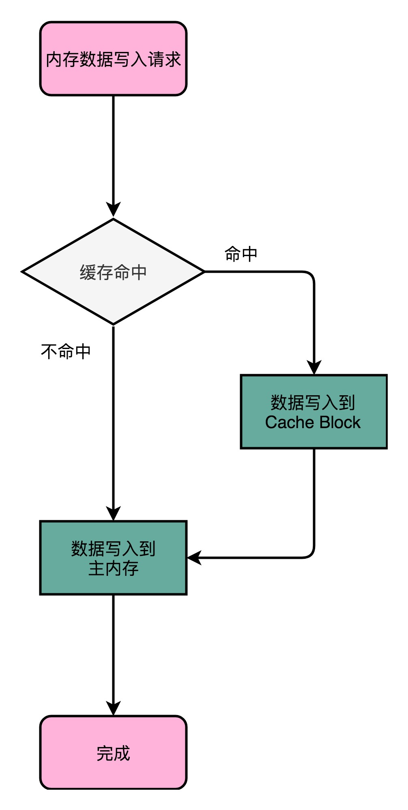
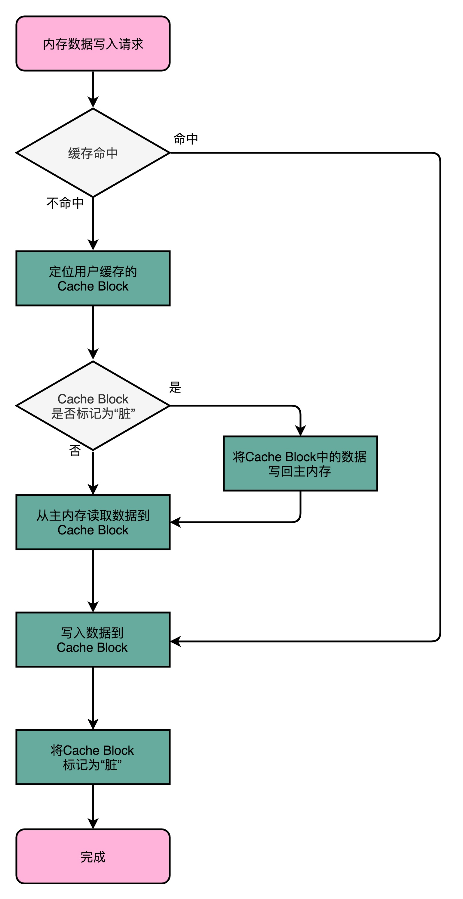

# CPU Cache之数据写回

## 前言

>对于数据的操作，除了读取，剩下的就是写入了，而写入的问题也是层出不断，因为**写入涉及更改数据**，那么存储器件的写入策略是什么，数据的一致性如何保证，这都是不小问题。

关于数据的写入，本文主要介绍**CPU写回数据的两种策略：写直达 和写回。**

关于多核数据的缓存一致性会在后续进行介绍。


## 正文

> 本文的阅读有一定门槛，需要知道 CPU 、高速缓存、内存三件套。还需要熟悉一门编程语言，看得懂程序也可以。
>
> 如果熟悉java语言，还需要知道JMM（Java 内存模型）。

### 一、回顾CPU、高速缓存和内存

**回顾数据操作的顺序：**

在数据读取和写入操作的时候，

首先是找到数据，那么CPU，**首先找的就是高速缓存中的数据，找不到才会去内存中加载数据到高速缓存；**

**再接着看看，是读操作还是写操作**。关于读操作在CPU Cache之数据读取中介绍过，写操作，就是本文的重点。

**回顾CPU、高速缓存和内存之间的关系：**

现在使用的CPU都是多核心的，每一个CPU核心里面，会有属于自己的L1、L2的Cache，然后有多个CPU核公用的L3的Cache和主内存。

CPU Cache的访问速度比主内存快很多，在CPU Cache中，L1/L2的Cache由于是各个核心自己的，所以速度也会比公共的L3 Cache快。

所以，基于速度的差异和计算机对应性能的极致追求，那么会有这么**两个问题：**

**1.由于写入高速缓存的速度快于写入内存，那么我们是将数据写回到哪里呢？**

**2.由于多个核心的CPU有自己的Cache，那么这些缓存是如何保证数据一致性呢？**


### 二、写回策略-写直达（Write-Through）

> 顾名思义：就是直接将数据写回到主内存。

这是一种最简单，最直观的策略了，直接可以将数据写回到主内存。

**在写内存之前，会先判断数据是否在高速缓存中，如果存在，就需要更新缓存中的数据，再继续将数据写回到主内存。如果不存在，那就直接写回到主内存。**

**注意：**这里的写回的数据，是根据内存地址进行判断，内存地址只是代表内存的一块区域，记住了，是内存，不是高速缓存，高速缓存为什么可以将值表示为内存中的值，使用的是映射的策略，关于这个策略在CPU Cache之数据读取中有详细的介绍。

写直达的性能问题，由于需要将数据写回到主内存，那么这个I/O的速度也是很可观的，远远大于将数据写到高速缓存。这也就表明，为了优化性能，是可以将数据写入到高速缓存的。




### 三、写回策略-写回（Write-Back）

> 顾名思义：就是数据写到高速缓存中，再根据标识，写回到主内存。

这种策略就比较麻烦了，但是只要记住我们操作的是数据，就还是很好理解的。

**写回策略的步骤：**首先去找高速缓存中找数据，如果存在，那么就将数据写回到高速缓存，并且标记数据为脏数据（Dirty），也就是标记为这个数据已经被更改了。

如果数据不存在，还需要检查一下，这个已经存在的高速缓存行，是不是已经被标记为脏数据，如果是脏数据，就将原来的那个数据写回到主内存中，然后将需要写入得数据加载到高速缓存中；如果检查之后，这个数据不是脏数据，那就直接去主内存中读取数据到高速缓存中。

此时的高速缓存中的数据，一定就是我们需要更改的数据了，直接写入新的数据，并且标记这个数据是脏数据。

注意：这一块一定搞清楚操作的顺序，不然很容易就给晕掉了。并且，在写回的策略中，一旦存在覆盖掉高速缓存中数据的时候，就需要先去检查是不是脏数据，如果是脏数据，就需要将数据写回到主内存，再加载数据。

写回策略的性能，如果我们在的数据操作有很多写回到不同的高速缓存内存块，那么性能是倍数的提高，后续只需要在使用到同一个高速缓存的时候，统一写回到主内存就可以。保证了瞬时的性能提升。




### 四、Java的关键字之Volatile

> Volatile关键字是Java编程语言**保证数据的读写，都是一定从主内存中获取的**，而不是CPU的高速缓存中读写。

由于学习东西的时候，很多知识点都是串联的，所以，对于Volatile关键字，涉及Java内存模型，（JMM，Java Memory Model），并且还需要知道Happen-before规则。

#### 1）Volatile示例程序-忙等待监听

在编程的时候，经常会使用volatile修饰变量，保证变量的可见性。所以，可以查看下面的程序。

内部启动两个线程，一个监听，一个改变volatile修饰的变量。

运行的结果表明，每次更改之后就可以看到对应的数据更改。

```java
package VolatileTest;

public class VolatileTest {
    private static volatile int COUNTER = 0;

    public static void main(String[] args) {
        new ChangeListener().start();
        new ChangeMaker().start();
    }

    static class ChangeListener extends Thread {
        @Override
        public void run() {
            int threadValue = COUNTER;
            while (threadValue < 5) {
                if (threadValue != COUNTER) {
                    System.out.println("Got Change for COUNTER : " + COUNTER + "");
                    threadValue = COUNTER;
                }
            }
        }
    }

    static class ChangeMaker extends Thread {
        @Override
        public void run() {
            int threadValue = COUNTER;
            while (COUNTER < 5) {
                System.out.println("Incrementing COUNTER to : " + (threadValue + 1) + "");
                COUNTER = ++threadValue;
                try {
                    Thread.sleep(500);
                } catch (InterruptedException e) {
                    e.printStackTrace();
                }
            }
        }
    }
}

/*
result:
    Incrementing COUNTER to : 1
    Got Change for COUNTER : 1
    Incrementing COUNTER to : 2
    Got Change for COUNTER : 2
    Incrementing COUNTER to : 3
    Got Change for COUNTER : 3
    Incrementing COUNTER to : 4
    Got Change for COUNTER : 4
    Incrementing COUNTER to : 5
    Got Change for COUNTER : 5
 */
```


#### 2）非volatile示例程序-忙等待监听

将变量不使用volatile修饰的时候，可以看看下面的程序。

执行的结果表明，监听程序只可以在第一次的时候，监听到程序改变了，后续监听程序一直使用while进行忙等待，没有时间去主内存中获取值，所以每一次的变量的取值都是使用缓存中的数值，那么就直接给夯住了。此时就很尴尬！

```java
package VolatileTest;

public class VolatileTestChangeVolatile {
    private static int COUNTER = 0;

    public static void main(String[] args) {
        new ChangeListener().start();
        new ChangeMaker().start();
    }

    static class ChangeListener extends Thread {
        @Override
        public void run() {
            int threadValue = COUNTER;
            while (threadValue < 5) {
                if (threadValue != COUNTER) {
                    System.out.println("Got Change for COUNTER : " + COUNTER + "");
                    threadValue = COUNTER;
                }
            }
        }
    }

    static class ChangeMaker extends Thread {
        @Override
        public void run() {
            int threadValue = COUNTER;
            while (COUNTER < 5) {
                System.out.println("Incrementing COUNTER to : " + (threadValue + 1) + "");
                COUNTER = ++threadValue;
                try {
                    Thread.sleep(500);
                } catch (InterruptedException e) {
                    e.printStackTrace();
                }
            }
        }
    }
}  

/*
result:
    Incrementing COUNTER to : 1
    Got Change for COUNTER : 1
    Incrementing COUNTER to : 2
    Incrementing COUNTER to : 3
    Incrementing COUNTER to : 4
    Incrementing COUNTER to : 5
    ...
 */
```


#### 3）非volatile示例程序-非等待监听

可以继续将非volatile示例程序-忙等待监听的程序更改，将监听的时间，添加上线程的sleep，此时我们的监听程序就是去内存中取变量了，可以看到结果又恢复正常了。

```java
package VolatileTest;

public class VolatileTestChangeVolatileAddTime {
    private static int COUNTER = 0;

    public static void main(String[] args) {
        new ChangeListener().start();
        new ChangeMaker().start();
    }

    static class ChangeListener extends Thread {
        @Override
        public void run() {
            int threadValue = COUNTER;
            while (threadValue < 5) {
                if (threadValue != COUNTER) {
                    System.out.println("Got Change for COUNTER : " + COUNTER + "");
                    threadValue = COUNTER;
                }

                try {
                    Thread.sleep(5);
                } catch (InterruptedException e) {
                    e.printStackTrace();
                }
            }
        }
    }

    static class ChangeMaker extends Thread {
        @Override
        public void run() {
            int threadValue = COUNTER;
            while (COUNTER < 5) {
                System.out.println("Incrementing COUNTER to : " + (threadValue + 1) + "");
                COUNTER = ++threadValue;
                try {
                    Thread.sleep(500);
                } catch (InterruptedException e) {
                    e.printStackTrace();
                }
            }
        }
    }
}  

/*
result:
    Incrementing COUNTER to : 1
    Got Change for COUNTER : 1
    Incrementing COUNTER to : 2
    Got Change for COUNTER : 2
    Incrementing COUNTER to : 3
    Got Change for COUNTER : 3
    Incrementing COUNTER to : 4
    Got Change for COUNTER : 4
    Incrementing COUNTER to : 5
    Got Change for COUNTER : 5
 */
```


## 结束语

关于数据的写回策略，基于已有的存储体系结构，也就只会是写回到内存或者写回到高速缓存中，所以并不难。

关于控制数据的多核心CPU还可以一致性，需要使用MESI协议，作为缓存一致性的协议。

并且基于数据的读取方式，可以类比于volatile关键字，更加形象的理解Java内存模型和并发编程。


## 参考链接

1.Java Volatile Keyword Explained by Example：https://dzone.com/articles/java-volatile-keyword-0

2.Fixing the Java Memory Model, Part 2：https://www.ibm.com/developerworks/java/library/j-jtp03304/index.html

3.Java theory and practice: Fixing the Java Memory Model, Part 2 How will the JMM change under JSR 133?：https://www.ibm.com/developerworks/java/library/j-jtp03304/j-jtp03304-pdf.pdf


