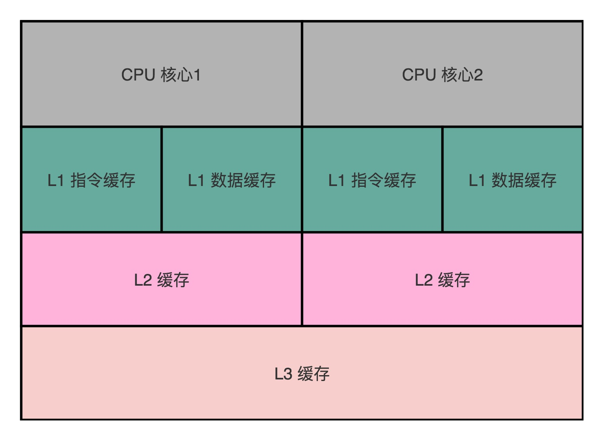
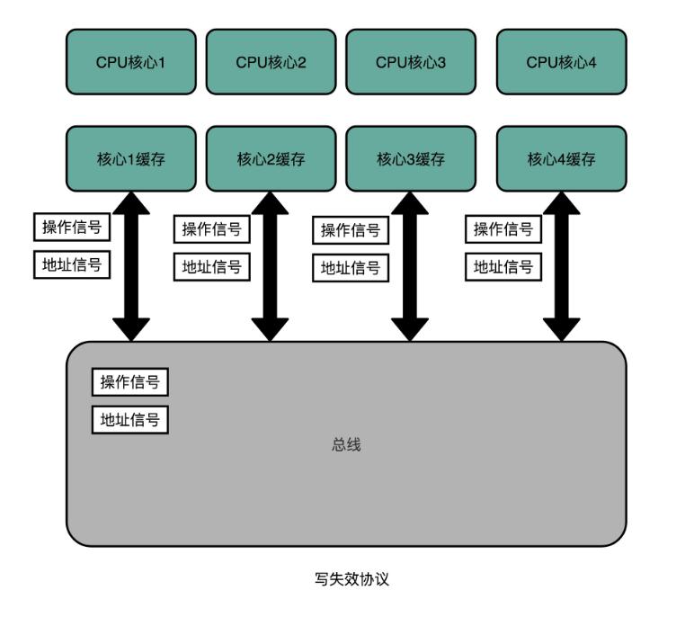
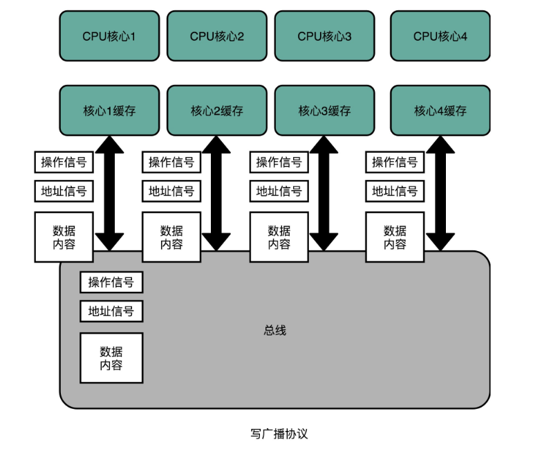
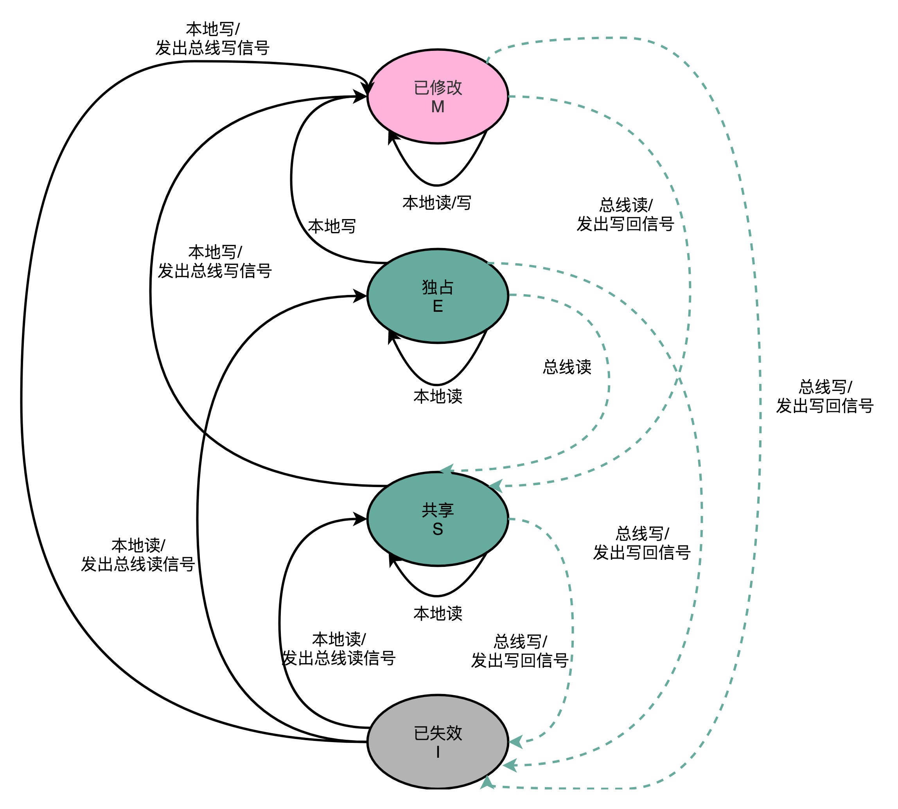

# 缓存一致性之MESI协议

## 前言

>关于缓存一致性，更多的涉及的事通用的解决方案，不管是在操作系统层面，还是分布式层面，其实实现思路都是一样的，--基于有限状态机的流转。

之前介绍了关于CPU Cache相关的数据读写，其中一旦涉及**多核心CPU**，数据的一致性是无法保证的，必须通过一些协议，在进行某些操作之后，自动触发完成标志位级别的状态更改。

## 正文

> 本文需要的基础知识，熟悉CPU，CPU Cache和主内存，可以知道一点总线的知识，还需要知道什么叫做事务。虽然异步编程，异步 回调如火如荼，但是真正对于一个数据的写操作，能随便异步吗？
>
> 本文主要介绍如何保证缓存的一致性，并介绍MESI这种最常见的写失效协议，顺带提一下写广播协议。

### 一、多核CPU

关于多核心CPU，已经是最长的的CPU了。

在CPU的发展历史中，最早出现的是单核心的CPU，但是由于对于性能的追求，必然只能提高CPU的主频，俗称：让CPU跑得更快。

但是CPU主频，遇到技术瓶颈的时候，就开始使用多核心的CPU，来增加同一时间下的吞吐率，来完成CPU性能的提升。

由于单核心CPU内部，私有的高速缓存有L1 Cache和L2 Cache，公有的高速缓存是L3 Cache和主内存。那么不管数据如何变成，都没有问题。哪怕是使用数据写回的策略，也只是将数据写回到主内存就可以，并不会存在缓存一致性问题。

但是，对于多核心CPU，一切都不一样了。多核心带来的是吞吐率的提升，但是多个核心的私有高速缓存内部进行数据的更改之后，不会主动同步到其他的CPU核心缓存中。

那么，这就引出了数据的一致性问题，也就是缓存的一致性。

### 二、缓存一致性（Caceh Coherence）

缓存一致性问题，只存在于**多核心CPU**，现在的CPU其实已经很少存在单核心CPU了，所以在技术的发展中，对于这个问题的解决方案，其实在**Pentium时代**就已经被解决了。

缓存一致性，最简单的描述：**多核核心CPU修改高速缓存中的数据之后，没有同步到内存中，导致高速缓存中的数据不一致。**

### 三、写传播（Write Propagation）

关于写传播，描述的是：**在一个CPU的核心中，当某一个CPU的高速缓存中数据更新之后，可以同时传播到其他缓存当前数据的CPU中。**

这里可以只是告知你的缓存失效了，也可以直接将缓存的数据直接都改了。前者对应的是写失效协议，后者对应的是写广播协议。

### 四、事务串行化（Transaction Serialization）

事务串行化，描述的是：**在一个CPU核心 里面的读取和写入操作，在其他的核心中看到的是顺序化的。**

当存在多核心CPU修改同一个数据的时候，每一个CPU修改的数据需要排一个顺序，也就是需要保证其他的第三方CPU看来，这个数据的修改是串行操作的。

其中，事务的串行化的应用领域还是比较多的，最明显的就是**缓存一致性**，其实在**数据库**层面的 最终写入也是需要串行化的，尤其是和金额相关的数据库操作。

最常见的事务操作就是**锁**，所以编程语言层面有很多读写锁，数据库底层也有锁。

### 五、总线嗅探（Bus Snooping）

总线嗅探就是微机原理的那个总线，也就是大家熟知的总线。

嗅探，就是保证存在数据的CPU核心可以知道当前数据的状态。

简言之：**总线嗅探本质上就是将所有数据的读写请求，通过总线光波到所有的CPU核心，然后让各个核心去嗅探这些请求，再根据本地的数据是否存在，状态等进行响应。**

总线的在计算机组成中，非常适合广播进行数据传输，也是CPU进行缓存一致性处理的解决方案。

基于总线嗅探机制，有很多缓存一致性的协议，最常见就是MESI协议。

### 六、写失效（Write Invalidate）

写失效协议，最常见的协议也就是MESI协议。

在写失效协议里面，只有一个CPU核心负责写入数据，其他的核心，只是同步读取到这个写入。

在CPU核心写入Cache之后，会去光波一个失效请求，告诉其他的CPU核心。其他的核心，会去自己的高速缓存中查看是否存在同一个缓存行，如果存在就进行写回策略中的标志，将其标识为脏数据。

### 七、写广播（Write Broadcast）

写广播协议，是与写失效完成同样功能的协议，只是写广播，不仅仅只是进行通知数据的失效，还进行数据的重现更新写回。

也就是说，写广播，会告知其他的CPU核心数据失效了，还会将更改后的数据更新至CPU的高速缓存行中。

这种方式，会更加的占用总线的带宽，并不常用。

### 八、MESI协议

MESI协议，主要是约定了缓存行数据的四种状态，分别是：已修改，独占，共享和已失效。

在这个状态流转中，状态的触发时间操作，可能来自于于当前CPU核心，也可能来自CPU核心广播的信号。

状态图见下面：

#### 1）已修改（M，Modified）

已修改最简单的就是，使用写回策略，将缓存行的数据标识为脏数据。

此时的缓存行数据，就是我已经修改了，但是我还没有写回到主内存中。

#### 2）已失效（I，Invalidated）

已失效就是，这个数据已经是脏数据。

当需要使用这个数据的时候，需要去更新这个脏数据，才可以进行使用，这是缓存的写入策略决定的。

#### 3）独占（E，Exclusive）

独占状态，很有意思。

它表示缓存行的数据一定是可以使用的，并且毫无悬念的可以。所以，此时缓存行的数据和主内存的数据是一致的。

在独占的状态的时候，当前的数据只加载了当前的CPU核心，所以可以类比于单核心CPU，所以，才可以对变得读写数据进行各种操作，完全不用担心缓存一致性。

#### 4）共享（S，Shared）

共享，是在独占的状态下，收到了来自动总线，一个读取同一个内存地址到另一个CPU的请求，此时该缓存行的状态就变成了共享状态。

此时，会有多个CPU核心存在同一份数据。

如果，进行数据的更改，需要先在总线中广播一个请求，将其他核心的CPU内部的缓存行，全部变成已失效的状态，当前的CPU核心变成独占的状态，才可以修改当前缓存行的数据。

这个广播操作叫做**RFO（Request For Ownership）**，也就是获取当前对应的Cache  Block数据的所有权，变成独占的。

## 结束语

关于缓存一致性的内容，就算是讨论完了。缓存一致性最常见的解决方案是MESI协议，当然还有MSI协议等等。

缓存一致，面对的是多核心CPU，一切的目的就是为了更高的性能，但是提高性能的时候，带来系统的复杂度，必然带来了新的问题，比如缓存一致性。

解决一致性的最简单方案就是拆分，假设处所有的状态，制定一个协议，相互遵循即可。

## 参考链接

1.MESI协议：[https://zh.wikipedia.org/wiki/MESI%E5%8D%8F%E8%AE%AE](https://zh.wikipedia.org/wiki/MESI协议)

