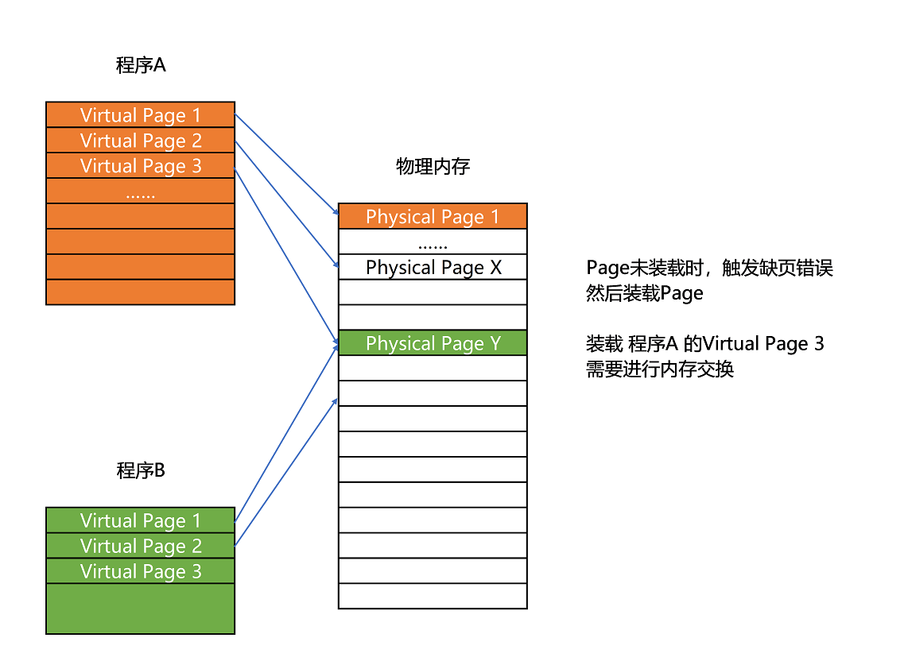
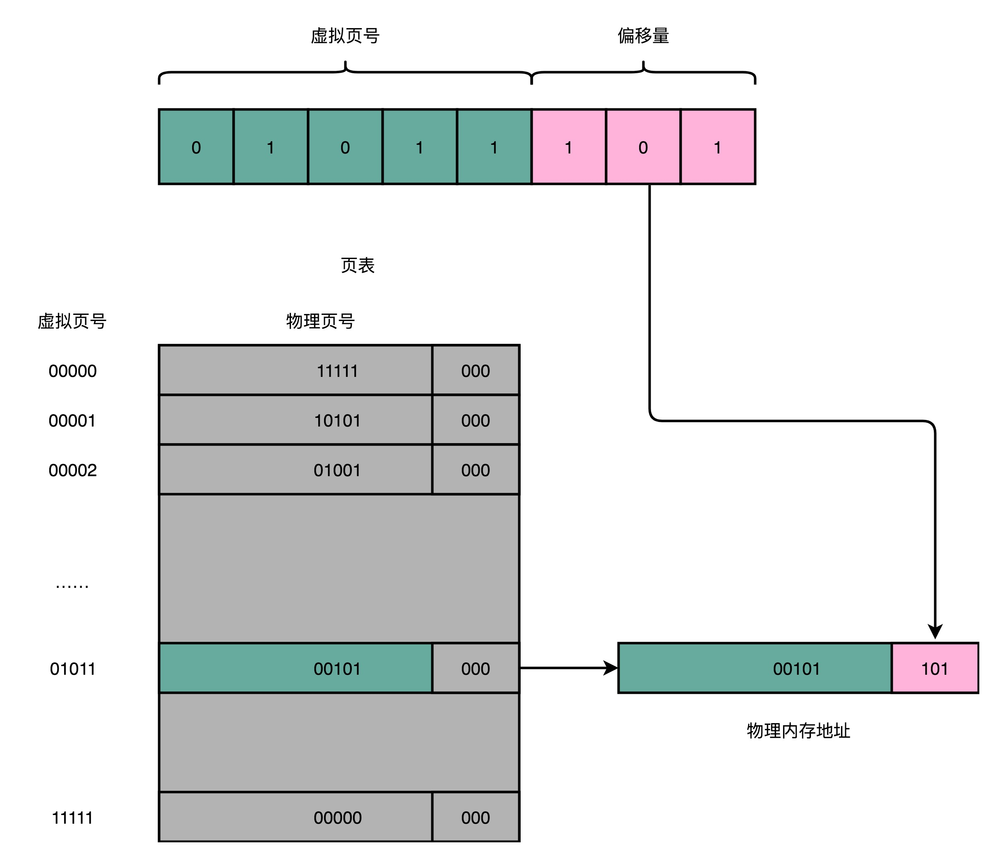
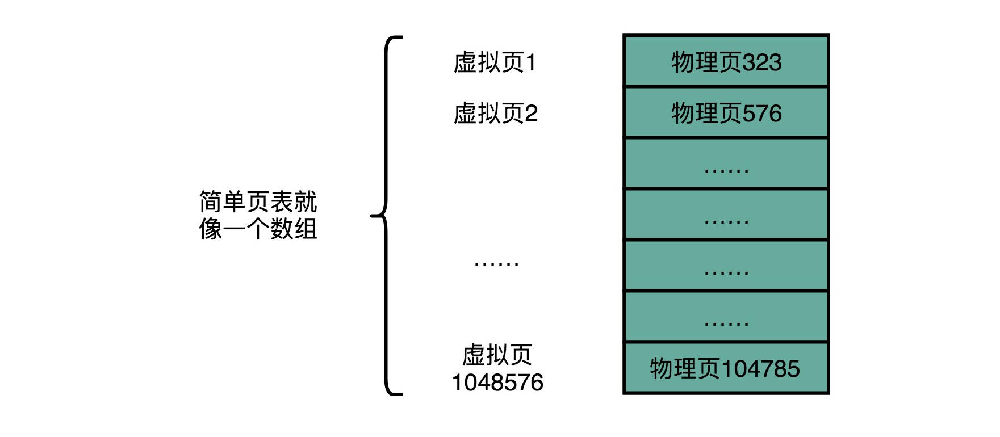
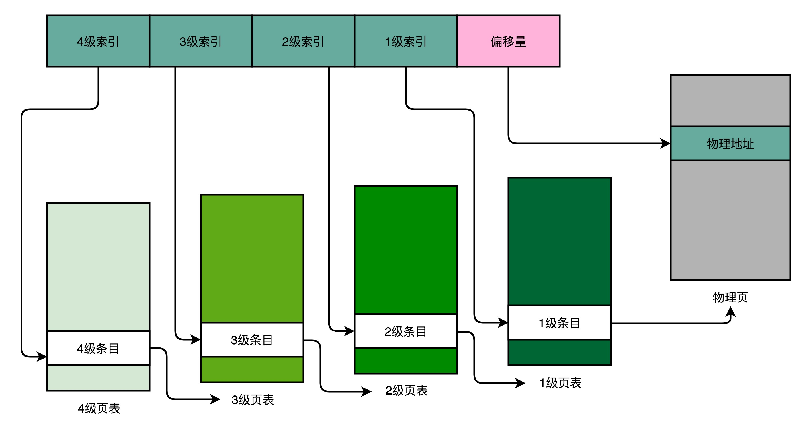
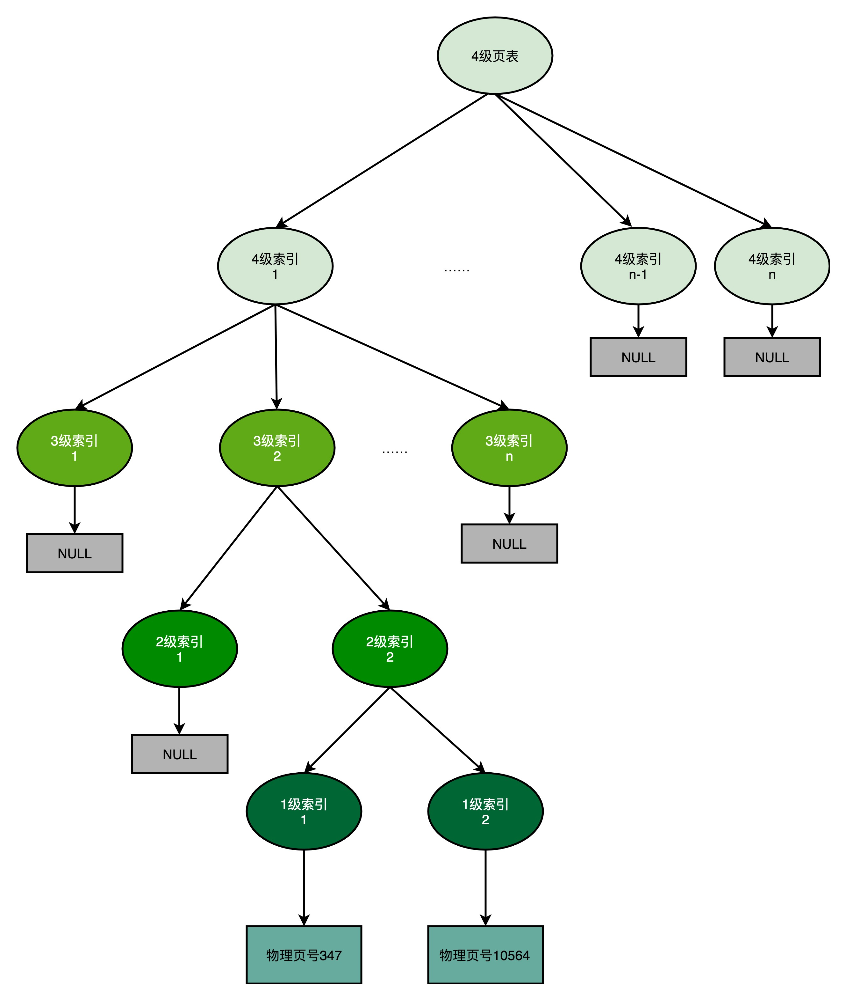

# 虚拟内存之页表设计

## 前言

>应用程序在加载到内存的时候，如何进行虚拟内存地址映射到真实的物理内存地址，存在一个一个**页表**的设计。
>
>一般最简单的就是使用**数组**的形式存储，但是实践证明使用**多级页表**才是最好的选择！

在前面多篇文章，介绍了关于**CPU与高速缓存和内存之间的数据读写**，还有关于**时间与空间局部性原理**。今天将来看看程序加载过程中，那一个一个虚拟内存地址是在CPU执行的时候找到的。

## 正文

> 必备知识：了解内存分页，知道程序的编译连接之后存在的虚拟地址，内存加载的方式，时间与空间互换思想。
>
> 还有基本的程序栈知识，知道程序执行的方式。

### 一、程序加载到内存的过程

由于操作系统的作用，从应用程序的角度看，我（应用程序）是独占整个物理内存地址。

但是，这种独占只是局限于程序加载，其实，哪里来的岁月静好，全部给你用啊！还不是操作系统给你处理内存不够，内存缺页的问题。

所以，虽然应用程序看到的是整个屋里内存的空间，但是执行的时候，真实占用的内存地址其实也只是那真正在内存中的那一点，那么，问题来了，我到底占用了多大的地方呢？

这就需要查表了，查的就是**页表（Page Table）**。

我们使用的**内存，被分成大小固定的页（Page），通过页表，将虚拟内存地址（Virtual Address）映射到物理内存地址（Physical Address），这个过程叫做地址转换（Address Trandlation）。**

这个地址转换的过程是执行每一个应用程序都需要做的事，因为程序只能看到自己的虚拟内存地址，只有物理内存地址的内容才可以在CPU中执行。

### 二、页表映射原理

页表需要实现的功能：**实现虚拟内存里面的页，到物理内存里面的页的映射。**

一般页表的地址转换，**把一个内存地址分成页号（Directory）和偏移量（Offset）**。

一个内存地址的转换，可以分为下面的几步：

**1）将虚拟内存地址，切分成页号和偏移量的组合。**

**2）从页表里面查询出虚拟页号，对应的物理页号。**

**3）直接拿到物理页号，加上前面的偏移量，就得到了物理内存地址。**

看着懵逼，可以直接想一想**查表**的过程，这就是一个查表的操作。

注意：由于内存中存在一个分页的操作，一页不是只是存储一个数据，而是存储很多数据，并且每一个数据对应于一个偏移量。这是一种**分层的设计**，先找到对应的内存页，在基于偏移量定位到某一个需要的数据的内存地址。

### 三、数组页表

数组属于一种数据结构，也是编程语言中最基础的数据结构，可以将其作为页表。

如果了解数组，你会知道，**数组的随机访问性能是非常高的，时间复杂度O(1)。**

但是数组的存储，需要连续的空间结构，必须是连续的。

所以使用数组，作为页表，存储虚拟内存地址到物理内存地址中虚拟页号和物理页号的映射，会存在占用空间的问题。

具体怎么占用空间的呢？

由于应用程序的看到的所有物理内存共享，那么将会把所有的虚拟内存页全部映射到物理内存页，这个时候其实程序在运行的时候，是有很多空间不使用的，但是**页表还必须存储这个虚拟页到物理页的所有映射内容**，这就是浪费了。

并且这还只是一个应用程序，机器启动之后，那可是有很多系统级别的进程和应用级别的进程都在运行，浪费太大。

就算现在使用的8GB内存，这也不够啊，并且这么浪费，也肯定是有解决办法的。

### 三、多级页表

由于数组页表的浪费，那么解决办法就是多级页表了，一个更好的解决办法。

在数组页表中，存储了所有的物理页的映射，其实**只需要存储已经加载到内存的物理页地址映射**不就可以了么！

实践中使用**多级页表（Multi-Level Page Table）**提高性能。

一个进程在运行的时候，整个进程的内存空间地址，**内存地址从顶部向下，不断分配占用的栈空间，内存地址从底向上，不断分配占用的堆空间。**

所以，在实际的程序进程中，**虚拟内存占用的内存地址，通常是两段连续的空间**，而不是完全随机访问的内存地址。

一个4级的多级页表中，将原来数组页表中的虚拟页号分成四等分，分成四个级别。

其中**每一级页表的里面都存储着下一级页表的条目（Entry）的索引**，一次就可以串联查找到1级条目，并且找到对应存储的物理内存页号。

此时，只需要使用物理内存页号和偏移量就可以找到对应的物理内存地址。

理解不了的，可以将多级页表看做是一个**页表树（Page Table Tree）**。

由于虚拟内存地址的分布是连续的，树的第一层节点的指针，很多都是空的，**只有存在物理地址，才可以产生对应的每一级页表**。这是一个**逆向的生成过程**。

所以，使用多级页表的时候，由于我们的应用程序并没有全部加载到了内存中，只是一部分需要使用的程序才加载到了内存，那么最终我们的页表，只需要完成这一部分的物理页到虚拟页的映射。

使用**多级页表就可以保证，我只存储已经加载到了内存中的物理页的查找，其他的虚拟页，查不到**，因为多级页表的生成是逆向的，只能是从物理页反向生成最高级别页表。那么，自然就省空间了啊！

### 四、时间换空间设计思想

在时间与空间局部性原理中，描述过时间局部性和空间局部性，其中关键操作就是加一个中间层：缓存。

其实关于时间和空间，在算法中也有很多，熟悉**链表和数组**的就知道，这两种数据结构在进行随机访问性能的选择中，对应的就是你选择查的快的不易扩容的，还是选择查的慢，但是扩容简单的数据结构。

**关于数组页表和多级页表，最直接表示就是：**

**要么选择，进行一次地址转换，一次访问内存就可以找到物理页号的方式，得到物理内存地址；**

**还是选择，使用所及页表，进行多次访问内存，才可以找到物理页号。**

所以，使用数组页表的时候，就省下了时间，但是使用多级页表，就省下了空间。

## 结束语

关于页表，其实内容不多，但是引申内容很多，可以扩展到最基础的两种数据结构：数组和链表。

其实，硬说，还可以扩展到散列表和跳表这种数据结构.......

其中，关于时间换空间的设计思想更是应用广泛。

**时间荏苒，一切都是需要负重前行的啦！**

