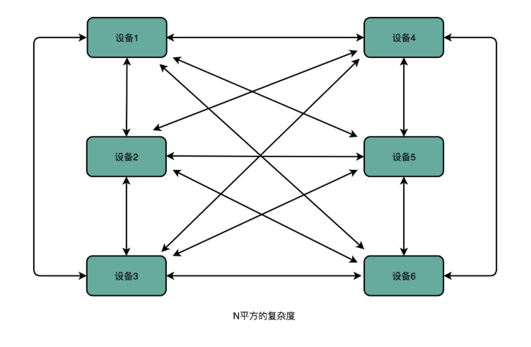
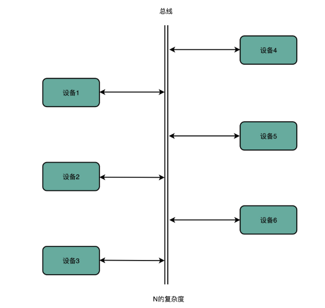
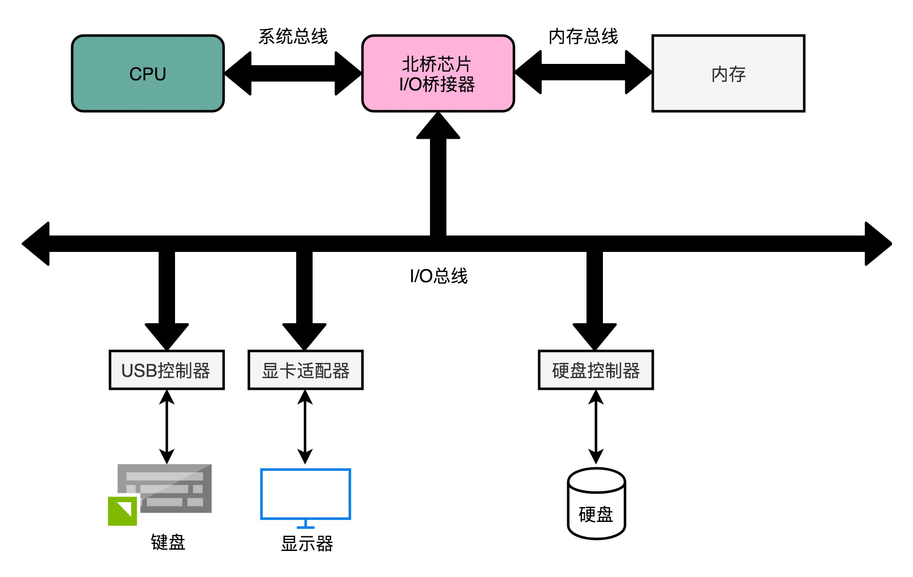
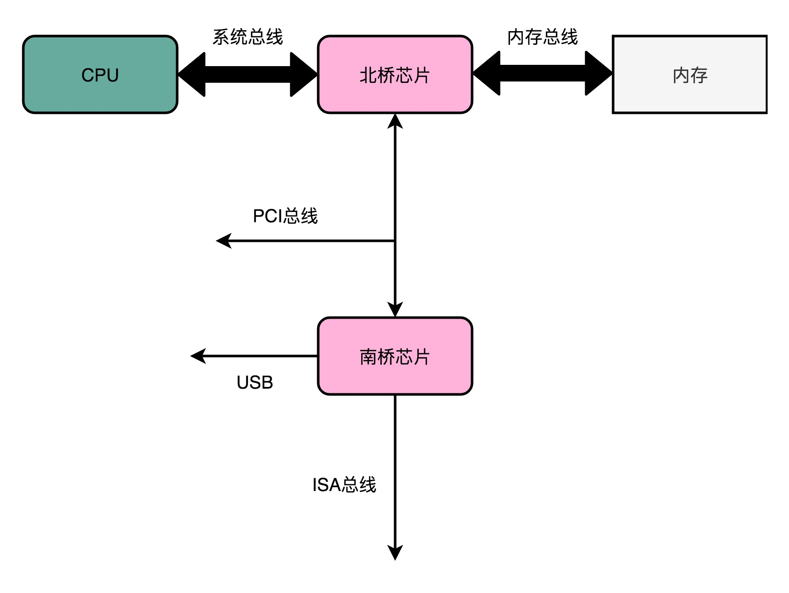
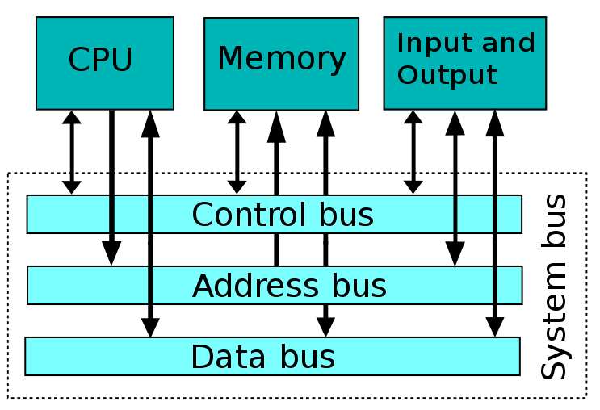
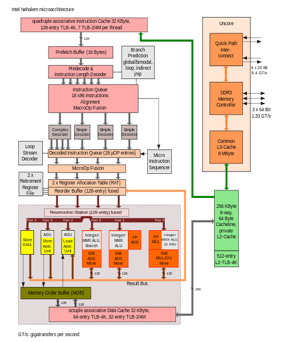
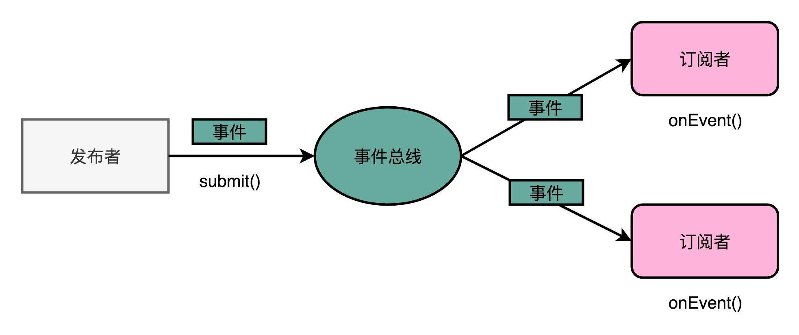

# 计算机总线与事件总线设计模式

## 前言

>在大学的计算机基础课程中，永远不变的主题有这么一个：**计算机的组成包括：运算器，控制器，存储器，输入和输出设备。**
>
>但是，关于这五部分的通信方式，只是介绍了两个汉字，一个英文单词，也即：**总线（Bus）。**
>
>所以，本文就是一个**典型的科普文**，主要目的是**介绍计算机中的总线设计初衷，目前的总线种类，总线的竞争，最新研究中计算机各个部分通信方式，以及基于总线引申出来的事件总线设计模式。**

不管什么知识点还是技术，其本质与衍生出来的内容，才是**串联**整个体系的关键所在。

## 正文

>本文需要具备的基础知识：**了解计算机的各个组成部分，知道总线这个东西，有一定的编程能力。**

### 一、总线设计初衷

关于总线的实际作用，从每一个物理的连接器件的角度来看，**总线就是连接CPU，内存，和大量的输入输出设备（键盘，显示器，鼠标，U盘等）。**

针对上述所有的设备，都只是采用：**我要和谁通信就直接去发一个信号的方式。**

那么可以预见的**通信复杂度和设备数之间是平方关系。**

所以，这个复杂度太高了，必须降低，降到最简单就可以。此时，**总线应运而生。**

### 二、总线（Bus）

**总线，就是使用一组线路，进行CPU、内存和输入输出设备等，相互间的通信。**

所以，总线的通信复杂度与设备数量的关系就是**线性关系**了！

### 三、总线的种类

#### 1）Intel CPU体系结构下的总线

在Intel CPU体系结构下，有很多条总线。

CPU和内存以及高速缓存的通信总线，有两种形式，这种方式叫做**双独立总线（DIB，Dual Independent Bus）。**

第一种较快的总线叫做，**本地总线（Local Bus），其主要是进行CPU和其内部的高速缓存芯片通信。有的时候，也可以将本地总线叫做后端总线（Back-side Bus）**。

第二种较慢的总线叫做，**前端总线（Front-side Bus），其主要是进行CPU和主内存或输入输出设备通信。有的时候，也可以将前端总线叫做处理器总线（Processor Bus）或者内存总线（Memory Bus）或者系统总线（System Bus）。**

CPU内部的内存接口，直接和系统总线通信，然后系统总线接入一个**I/O桥接器（I/O Bridge）**。

I/O桥接器，一端连接**内存总线**，使得CPU和内存通信；另一端连接**I/O总线**，用来连接I/O设备。

#### 2）真实计算机下的总线

在真实的计算机李曼，总线被拆分的更细，根据主板上不同的设备，将其拆分为独立的PCI总线和ISA总线等。

#### 3）按照功能拆分下的总线

总线可以看做是物理层面的电线，但还是电线不只是单纯的传输电信号，还会根据传输的内容，拆分为不同总线。

1.数据线（Data Bus），传输实际的数据信息；

2.地址线（Address Bus），传输把数据传输到哪里去，是内存的某个位置，还是某个I/O设备；

3.控制线（Control Bus），用来控制对于总线的访问。

上面的内容是不是很熟悉，是的，微机原理课本也会讲。

此时，在上述总线的分工中，首先需要控制总线，获得我占用总线的时间，再接着把需要传输的数据按照对应的地址传输过去。

这个过程是不是有点类似于现在的网络协议传输，各自分工，制作好自己该做的内容。

### 四、总线竞争之总线裁决

由于总线的设计是直接将所有的设备都给连到一起，那么**在控制总线的时候，就会存在一个竞争。**

因为，总线是公用的，所以同一时刻，不能大家一起公用，只能你使用的时候，我等着。

此时就需要一个机制，来保证什么时候把总线给谁用，此时，**总线裁决（Bus Arbitraction ）**就应运而生了。

关于总线裁决的实现实现方式大致分为**两种：异步（Asynchronous arbiters），同步裁决（Synchronous arbiters）。**

详细的实现，可以参看文末的参考链接。

### 五、新总线技术之快速通道互联（Intel QuickPath Interconnect）

快速通道互联（Intel QuickPath Interconnect），这是Intel 在2008年11月，开始使用在桌面处理器的新技术，最先使用的CPU是[Intel Core i7-9xx](https://en.wikipedia.org/wiki/Bloomfield_(microprocessor)) and [X58](https://en.wikipedia.org/wiki/Intel_X58) [chipset](https://en.wikipedia.org/wiki/Chipset)。

QPI是英特尔Nehalem微架构的一个非核心组件，其架构图如下所示。

### 六、事件总线设计模式

**事件总线（Event Bus）设计模式**，是类似于总线的设计方式，只不过前者用于软件，后者用于硬件。

此时，不知道你是否可以感受到硬件和软件的设计里面是有很多是相同的，如之前的局部性原理等等。

在**微服务架构**下的应用系统，内部各个组件之间需要相互通信，模块之间不可能只是双方之间制定协议，那么此时就可以基于事件总线设计模式了。

在事件总线的设计模式中，只需要**各个模块触发对应的事件，并且把这个事件发送到总线上，就可以根据事件的对象类型或者对象内容，接收方决定是否进行事件的处理与响应**。

事件总线设计模式，**类似于发布者与订阅者模式**，每一个模块都是一个**发布者（Publisher）**，并且每一个模块都会将自己注册到总线上，监听总线上的事件，最终根据事件作出处理与响应。

## 结束语

关于总线，其实真的不是两个汉字，一个单词。

内部会有各种复杂 的分类与学究，其中竟然还能扯上设计模式，所以，不要小看任何一个简单的概念。

那些看着简单的内容，其实都是不简单的哈！

阅读愉快！

## 参考链接

1.Bus (computing)：https://en.wikipedia.org/wiki/Bus_(computing)

2.System bus：https://en.wikipedia.org/wiki/System_bus

3.Arbiter (electronics)：https://en.wikipedia.org/wiki/Arbiter_(electronics)

4.Intel QuickPath Interconnect：https://en.wikipedia.org/wiki/Intel_QuickPath_Interconnect

5.EventBusExplained：https://github.com/google/guava/wiki/EventBusExplained

6.Design Patterns: Event Bus：https://dzone.com/articles/design-patterns-event-bus

