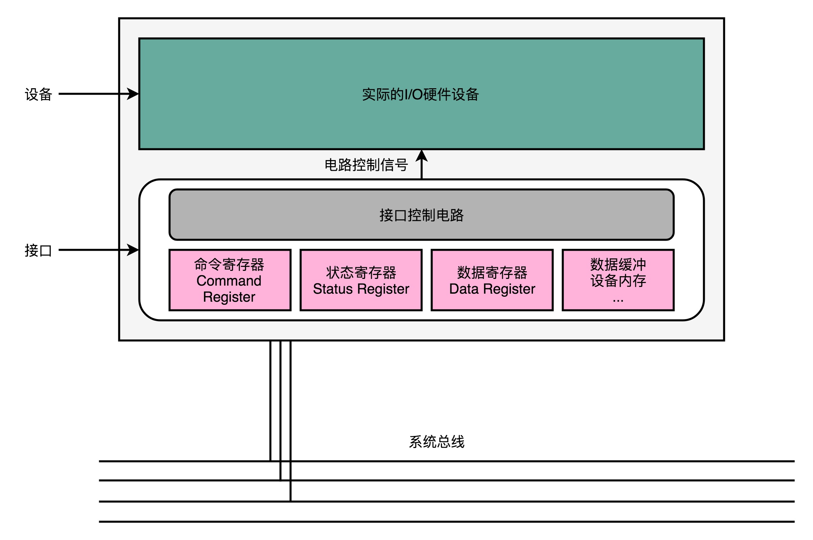
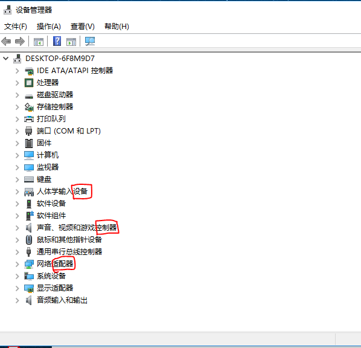
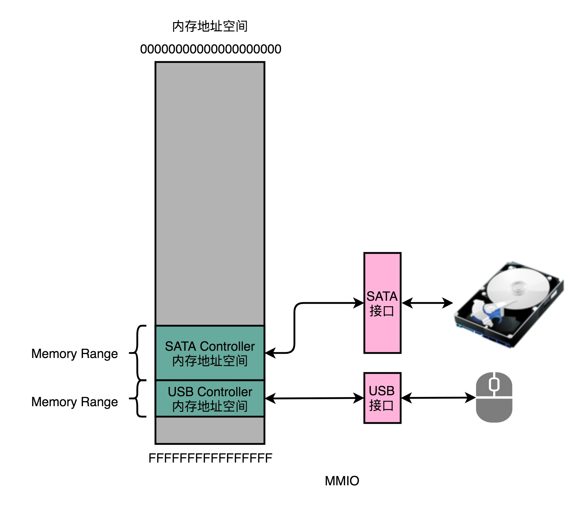
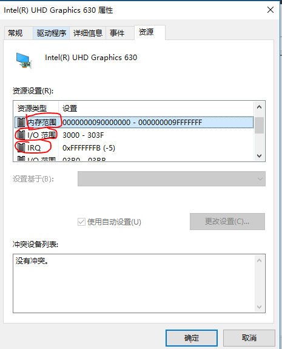

# 浅谈输入输出设备

## 前言

>在计算机的所有部件中，关于输入输出设备定义已经很模式，由于链式调用，必然存在上一阶段是下一阶段的输入，而下一阶段也是下下阶段的输入。
>
>基于一个模糊的输入输出概念，来看看耳熟能详的输入输出设备。
>
>其中，**I/O设备的组成，常见的寄存器种类，经典的I/O设备通信方式等等。**

在写这篇文章的时候，观看了北京大学在Coursera上的计算机组成原理课，学到了很多，推荐大家直接点击文末的参考链接，也看看！

## 正文

>本文需要的基础知识：了解计算机的输入输出设备种类，如果拆过就更好了，还需要具备CPU指令集的认知，不需要明确知道那几千个指令集是什么，只需要大概知道指令集与计算机的一些体系结构。
>
>如果还需要的知识，那就是知道指令，数据和状态三个寄存器。

### 一、计算与交互

关于计算机，想到的就是计算，但是你**看到的计算机，其实并不是只是会进行计算。**

随着触屏的到来，开始了**交互**，甚至还可以使用语音进行交互，这一切的变化不仅仅是技术的提升，而是对于整个技术架构的演进。

从最初的冯诺依曼体系架构发展到现在，虽然最基本的核心没变，但是**计算的边界已经越来越模糊**了，并且在整个意识形态，其实可以将整个体系，抽象为，输入进行计算，得到输出的过程。

所以，对应于常见的输入输出设备，不是你输出的是什么，展示的就是什么，而是给你进行的转换，一个交互的操作。

### 二、输入输出设备组成

一般的输入输出设备，不只是一个设备，一般有两部分组成。

**1）接口（Interface）**：其本身是一个电路板，俗称接口电路。

**2）实际的I/O设备(Actual I/O Device)**：完成存储或者操作的功能。

我们知道，**只有通过总线才可以和计算机进行通信**，所以设备也不是直接连接到总线上和CPU进行通信的，而是**将接口连接到总线上，通过接口这种中间层与CPU通信。**

### 三、主板内置接口

计算机主板上有很多接口，如：**并行接口（Paralel Interfaxe），串行接口（Serial Interface），USB接口** 等。

但是，在**台式机比较特殊**，一般会有两个或者四个接口是机箱的，内部其实也是连接到主板上的，但是他不是主板上的，所以这就是为什么使用这个慢的原因。

连接这些内置接口的设备常见的有：使用并口的打印机，使用串口的老式鼠标，使用USB的U盘。

注意：接口可以内置在主板上，但是接口其实也可以可以集成在设备上，老式硬盘IDE硬盘就是一种集成设备电路（Integrated  Device Environment）。它的接口电路直接在设备上，不在主板上，所以需要一个多余的线缆，将集成的设备连接到主板上。（应该很好理解，就是台式机的那个USB，就是类似的这种方式。）

### 四、接口电路

接口电路，被归为接口中，它才是**真正和CPU通信的装置**，上接CPU，下接真正执行操作的设备。

接口电路中一般都会有三种寄存器，分别是：**状态寄存器（Status Register），命令寄存器（Command Register），数据寄存器（Data Register）。**

**在使用输入输出设备的时候，CPU通过向这个控制电路传输信号，控制实际的硬件。**其中就包括向上面的三种寄存器发送信号。

### 五、面向接口编程

**面向接口编程描述**的是使用面向对象，进行接口设计，在实现功能的时候，只需要实现接口的内容就可以了，整个功能的框架其实就是这些结构。

### 六、输入输出设备的分类

一般的输入输出设备也会按照一定的方式进行分类：

**第一种，设备，即 Devices，描述的是实际的I/O设备本身；**

**第二种，控制器，Controllers，描述的是输入输出设备接口里面的控制电路；**

**第三种，适配器，Adaptors，描述的是将接口作为一个适配器，后面可以插上不同的实际设备。**

详细的内容，可以看一下电脑的中的设备管理器，你也许就会明白了。

### 七、CPU和I/O设备通信之MMIO

前面介绍的都是输入输出设备的组成，分类等等，也顺带提了一下，通过CPU控制接口电路进行数据的传输与通信。

**在CPU和I/O设备的通信中，其实是通过CPU支持的机器指令来执行的。**

**计算机会将I/O设备的各个寄存器，以及设备中的内存地址，都映射到主内存的地址空间。**

**在主内存的地址空间中，会给不同的I/O设备预留一段一段的内存地址。**

**当CPU想和哪个I/O设备通信的时候，就向这些地址发送数据。地址是通过地址线传输的，数据是通过数据线传输的。**

**I/O设备，会监控地址线，在CPU向自己的地址线发送数据的时候，把对应的数据线里面传输的数据，接入到对应的设备里面的寄存器和内存里面。**

上述的方式叫做**内存映射（MMIO，Memory Mapped I/O）。**

注意：上述将发送的数据传输到了输入输出设备上的过程是：首先会将数据发给地址线的位置，这也是操作系统可以看到的数据传输，但是数据真正到设备上的时候，其实此时并没有完成，如果查看磁盘的读写，你就会发现数据很可能还在传输，如果你误以为数据传送结束了，拔断了连接线，那么数据就不完整了。

PS:曾经吃过的亏，尤其是手机和电脑互传数据，大于2GB文件时，效果很明显。

### 八、CPU和I/O设备通信之PMIO

在使用精简指令集的CPU上，只能使用MMIO（内存映射）。

对于Intel的X86体系结构下，可以设计专门进行I/O设备通信的指令，也就是in 和 out 指令。

另一种比较常见的通信方式就是：**端口映射I/O（PMIO，Port Mapped I/O），也被称为独立输入输出（Isolated I/O）。**

在使用端口映射I/O的时候，访问设备的地址，不是在内存地址空间中，而是一个专门的**端口（Port），这个端口不是一个指定硬件上的插口，而是一个和CPU通信的抽象的概念。**

### 九、通信总结

不管是MMIO还是PMIO，都是一种和CPU通信的方式，整体流程如下：

**CPU传送一条二进制的数据，给到I/O设备对应的地址。**

**设备自己接口电路，去解码这个数据，解码之后的数据，就会变成设备支持的一条指令。**

**接口电路基于这条指令，在设备中操纵硬件实现功能。**

在实际的电脑中，可以看到，如下所示**的显卡设备的资源信息：**

**内存范围（Memory Range） ：显卡设备映射到内存的地址，MMIO；**

**I/O范围（I/O Range）：通过端口访问显卡设备，PMIO；**

**IRQ：来自显卡设备的中断信号。**

## 结束语

关于输入输出设备的内容还有很多，至于具体的接口电路如何设计，还需要后续的学习。

其中，最**关键的就是MMIO和PMIO**，光有硬件是不够的，还需要交互起来，进行通信，但是通信不可以使用直联的方式，那么就需要通信的技术手段了。

对于其衍生出来的知识还是比较多的，可以了解一下**适配器设计模式，多写写编程中的接口等等。**

## 参考链接

1.计算机组成 Computer Organization：https://www.coursera.org/learn/jisuanji-zucheng

2.Open architecture：https://en.wikipedia.org/wiki/Open_architecture

