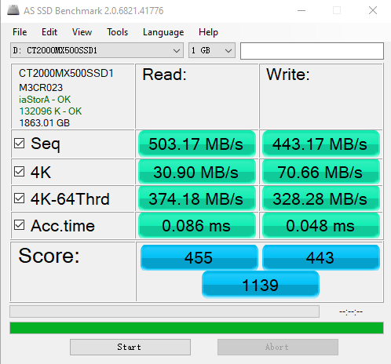
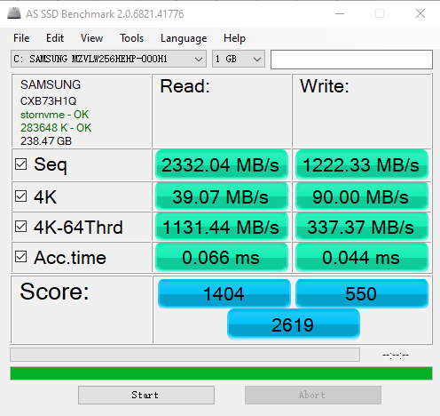

# IO Wait与性能 

## 前言

> 在IO中，存在一个wait的概念，其实它也属于性能的范畴。
>
> 只是在目前的应用系统中，更加关注的性能，但是性能的瓶颈最多的都会出在I/O上，所以，这也就证明了，在并发的场景下，机器扛不住了，不是算不动了，而是存储扛不住了，所以最先挂掉的是存储层。
>
> 其优化的策略，可以将数据提前预热到内存中，但是内存空间是固定的，所以一般情况下大多数的服务请求，最终还是需要经历硬盘的I/O操作，对于热点数据的处理是不一样的。

所以，本文主要讲解，**常见硬盘的I/O与其性能的评判标准，基本的性能参数等，还会基于Aliyun 的服务器，进行相应的I/O Wait定位。**


## 正文

>阅读正文，必备基础知识：**知道常见的硬盘，对于其性能有一定的认识，有linux操作的经验。**

### 一、I/O性能指标

关于性能指标，一般有两个，**一个是响应时间（Response Time），另一个是数据传输率（Data Transfer Rate）。**

**响应时间，简单说就是跑的快；**

**数据传输率，简单说就是吃的多。**


### 二、HHD和SSD硬盘

目前市面上使用的硬盘，分为两种，**一种是HHD硬盘，另一种是SSD硬盘。**（不缺分厂商，只区分规格）

**HHD硬盘，也就是机械硬盘，使用的是SATA 3.0的接口。**

**SSD硬盘，也就是固态硬盘，使用的事SATA 3.0的接口和PCI Express的接口。**

SATA 3.0的接口，带宽是6Gb/s，每秒可以传输768MB的数据，其实这是理论值，一般能到500MB多已经很好了。

在使用HHD硬盘的时候，虽然使用的是SATA 3.0的接口，但是每秒也就200MB。为什么这么慢，我会在机械硬盘的原理中介绍。


### 三、测试 SATA 接口的SSD硬盘

下面的数据是使用**AS SSD软件**测试的，Win的用户可以试试，Mac的用户就不要尝试了。

注意：在测试的过程中，关注测试结果的指标即可。

**1.Sep 指标：顺序读写数据的时候，对应的传输速率。**

**2.4K 指标：随机读取磁盘上某一个4KB大小的数据，一秒可以读写的数据。（硬盘的设计是写优化，所以随机读会慢随机写）**

**3.4K-64Thrd 指标：随机生成64个16MB大小的测试文件，共计1GB，以4KB的大小，同时在这64个文件中进行读写测试，最后取平均数。**

**4.Acc.time 指标：程序发起一个硬盘的写入请求时间，知道这个请求返回的时间。**




### 四、测试 PCI Express接口的SSD硬盘

下面的数据是使用**AS SSD软件**测试的，Win的用户可以试试，Mac的用户就不要尝试了。

注意：在测试的过程中，关注测试结果的指标即可。

**1.Sep 指标：顺序读写数据的时候，对应的传输速率。**

**2.4K 指标：随机读取磁盘上某一个4KB大小的数据，一秒可以读写的数据。（硬盘的设计是写优化，所以随机读会慢随机写）**

**3.4K-64Thrd 指标：随机生成64个16MB大小的测试文件，共计1GB，以4KB的大小，同时在这64个文件中进行读写测试，最后取平均数。**

**4.Acc.time 指标：程序发起一个硬盘的写入请求时间，知道这个请求返回的时间。**




### 五、SATA 与  PCI Express接口性能对比

在上面进行了两种不同接口的测试，得到得结果可以看出性能差异。

**Sep 指标：**SATA 接口，数据传输也就500MB/S，就已经跑不动了，PCI Express接口的数据传输可以到2GB/s，这个差距还是很大的。如果使用HHD硬盘，这个差距就更大了，HHD数据传输也就200MB/s。

**4K 指标：**在随机读写的时候，两个接口的差距并不大，此时的速度影响不是接口本身速度了，而是随机数据的位置。

**4K-64Thrd 指标：**这个指标其实和Seq指标很相似，自己领悟吧！

**Acc.time 指标：**不管哪个接口的时间都是微妙量级的，但是如果使用HHD硬盘，那就是毫秒级别了。

**IOPS指标：**这个指标描述的是每秒读写的次数，也就是每秒的输入输出操作，需要使用4K 指标的数值除以4KB得到，SSD硬盘的读OIPS大概是一万，写IOPS大概是2万，HHD硬盘的IOPS大概是100，这个差距是非常大的。
（推荐回看一下[局部性原理](https://www.copydays.org/2020/05/22/局部性原理/)中的[商城类网站存储考量](https://www.copydays.org/2020/05/22/局部性原理/#五、商城类网站存储考量)，你就懂得了什么叫做真正的差距。）

注意：在实际的应用中，关注更多的是数据的随机访问，也就是4K 指标，因为服务器在并发操作数据的时候，都是多用户，多数据的操作，除了那些热点的数据，其他的都是直接读硬盘的，总不可能所有的数据全部存在内存中吧，这得多少预算啊！


### 六、定位服务性能的IO Wait

我们知道服务变慢，更多的是磁盘读写慢，那么我们下面就来看看到底是哪里慢。

下面的内容是在**linux系统**下的操作，如果你有云主机，那就一起操练起来吧！

PS：我的云主机是Aliyun， centos7，双核的配置，可能和你显示的结果有一定的偏差。


#### 1）stress

**使用stress命令，模拟高I/O的复杂情况，需要安装，直接yum安装就可以。**

使用stress之后，需要重新开一个ssh连接，本进程会被夯住。

```bash
# 启动stress
# 2个I/O 的进程从内存中向硬盘中写数据

➜  ~ stress -i 2
stress: info: [11362] dispatching hogs: 0 cpu, 2 io, 0 vm, 0 hdd
```


#### 2）top

top命令：查看服务的负载情况（load average），关于那些平均负载采集的的内容就不看了。

**在%CPU中，wa指标，表示的是iowait，也就是CPU等待IO操作的时间占CPU的百分比。sy 指标，表示的是系统调用。**

```bash
# top
# 可见sy很高，但是wa只是稍微高了一点

➜  ~ top
top - 11:57:22 up 16 days,  1:04,  2 users,  load average: 1.68, 0.63, 0.26
Tasks:  98 total,   2 running,  96 sleeping,   0 stopped,   0 zombie
%Cpu(s):  0.2 us, 58.0 sy,  0.0 ni, 41.7 id,  0.2 wa,  0.0 hi,  0.0 si,  0.0 st
KiB Mem :  3880172 total,   567292 free,   212332 used,  3100548 buff/cache
KiB Swap:        0 total,        0 free,        0 used.  3371904 avail Mem 

  PID USER      PR  NI    VIRT    RES    SHR S  %CPU %MEM     TIME+ COMMAND                         
11363 root      20   0    7312     96      0 R  57.5  0.0   1:05.21 stress                          
11364 root      20   0    7312     96      0 D  57.5  0.0   1:05.28 stress                          
```


#### 3）iostat

**iosat命令，主要是展示实际的硬盘读写情况。**

可以显示CPU等待时间的百分比，还有一些更加具体的指标，还可以按照机器安装的多块不同硬盘进行划分。

其中，**tps指标，就是性能对比的IOPS性能，其中kB_read/s和kB_wrtn/s指标，对应着我们的数据传输率指标。**

```bash
➜  ~ iostat
Linux 3.10.0-1062.18.1.el7.x86_64 (rmliu) 	05/30/2020 	_x86_64_	(2 CPU)

avg-cpu:  %user   %nice %system %iowait  %steal   %idle
           0.00    0.00   57.93    0.25    0.00   41.81

Device:            tps    kB_read/s    kB_wrtn/s    kB_read    kB_wrtn
vda              50.00         0.00         0.00          0          0


```


#### 4）iotop

**iotop命令，可以看到具体是哪一个进程实际占用了大量的I/O。**

此时，就可以针对具体的进程进行相应的处理了。

```bash
➜  ~ iotop
Total DISK READ :	0.00 B/s | Total DISK WRITE :       0.00 B/s
Actual DISK READ:	0.00 B/s | Actual DISK WRITE:       0.00 B/s
  TID  PRIO  USER     DISK READ  DISK WRITE  SWAPIN     IO>    COMMAND                               
11450 be/4 root        0.00 B/s    0.00 B/s  0.00 %  1.04 % stress -i 2
11451 be/4 root        0.00 B/s    0.00 B/s  0.00 %  0.26 % stress -i 2
```


## 结束语

在这篇文章中，我们将I/O性能问题，聚焦到硬盘的读写上，并且测试了不同接口的实际性能表现，亲自动手在云主机上进形了IO Wait问题的定位。

其实这些内容只是表面而谈而已，真正内核的是接下来的机械硬盘原理和SSD硬盘原理带你了解自己使用的硬盘到底是个什么鬼，还记之前我提到的SSD硬盘真实的存储其实比实际标注的存储大，但是多余的内容你用不了，哈哈！很尴尬！（所以，此时只能说买SSD，买不到吃亏，买不到上当，哈哈！）


## 参考链接

1.IOPS：https://en.wikipedia.org/wiki/IOPS

2.[Understanding IOPS, Latency and Storage Performance](https://louwrentius.com/understanding-iops-latency-and-storage-performance.html)：https://louwrentius.com/understanding-iops-latency-and-storage-performance.html


