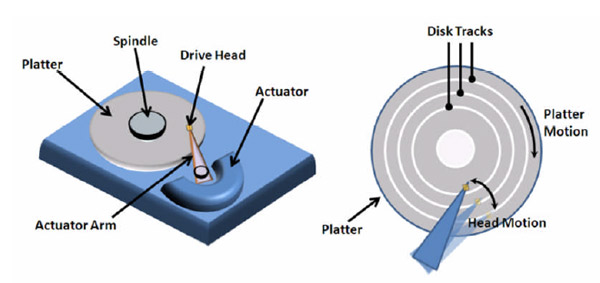
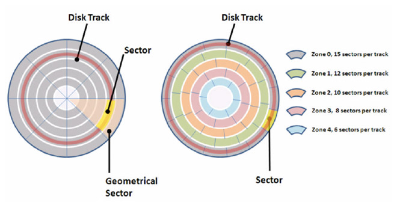

# 机械硬盘与Partial Stroking

## 前言

> 目前市面上的硬盘还是机械硬盘居多的，虽然SSD有后来居上的趋势，但是由于机械硬盘真的是历史悠久，所以，这个取代的时间还是需要一定的时间。
>
> 所以，机械硬盘还是很有必要好好聊聊的，并且不只是聊机械硬盘的基本组成与数据读取，还聊一下IOPS性能优化，如何实现优雅的性能翻倍！

关于机械硬盘，文章很多很多，但是如何一篇就直接入门，还是比较难的。

对于其他知识也是如此，需要时间来洗刷，留下的就是精华，洗去的就是糟粕！

阅读愉快！

-----------------

## 正文

>阅读本文，只需要了解有的电脑里面，其实使用了机械硬盘，哪怕现在的laptop比较高配，也应该是一块SSD和一块HHD。
>
>最好了解了一般的I/O wait，知道性能优化的思路（对于存储器，基本上都离不开空间换时间的思路）。

-----------------

### 一、存储的历史

从最初的3.5寸和5 寸**软盘**到之后的**机械硬盘**。

再接着就是90后，都熟知的**光盘（碟片）**，其中根据编码方式还分为了VCD和DVD。其，本质的制造原理都是一样的。

最后就是2010年左右，开始流行的**SSD硬盘**，不仅带来了速度的体验，也带来了价格的体验。

当然，数据的存储其实不仅仅只是这几种，这是这几种相当的有代表，其实**U盘，磁带和SD卡**也算是一段历史了。

----------------

### 二、机械硬盘物理构造

一块机械硬盘一般由三部分组成，分别是：

#### 1）盘面（Disk Platter）

盘面也就是实际存储数据的盘片，类似于光盘。

盘身的材料一般是铝，玻璃或者陶瓷的材质，在盘面上有一层磁性的涂层，所有存储的数据就是在这个涂层中的。

盘面是两面的磁性介质，这是不同于光盘的。

一块硬盘中，不只是两个盘面，而是上下堆叠了很多个盘面，各个盘面都是平行的，每个盘面的正反面都是有磁头。（自己想一下，或者搜一下）

在盘面的中心还会有一个受点击控制的转轴，这个转轴控制了盘面的旋转，这也是5400转，7200转，10000转的由来。

关于盘面的**转速**，指的是盘面中间电机控制转轴的旋转速度，英文单位是RPM（每分钟的转转圈数，Rotations Per minute）。

-----------

#### 2）磁头（Drive Head）

磁头做的是数据的读取和写入工作。

数据不可以直接从盘面直接传输到计算机中的总线，而是通过磁头，从盘面上读取到，然后通过电路信号传输到硬盘的控制电路，接着通过接口，再到总线上。

一般一个盘面会有两个磁头，分别在盘面的正反面。

---------------

#### 3）悬臂（Actutor Arm）

悬臂是帮助磁头定位的，只是给一个磁头，没法进行定位。

悬臂连接到磁头上，并且在一定范围内会把磁头定位到盘面的某一个特定的**磁道（Track）**上。

---------------

### 三、机械硬盘的数据读取

读取数据一般分为两个步骤：

#### 1）定位几何扇区（Geometrical Sector）

首先是将盘面旋转到某一个位置，在这个位置上，整个悬臂可以定位到整个盘面的某一个子区间，这个子区间就叫做几何扇区。

注意，几何扇区是一个沿着盘面轴向移动的，不是磁道。

一般，会将一个磁道（旋转的圆环），分成一个一个的**扇区（Sector）**。

上下平行的一个一个盘面的相同扇区，加做一个**柱面（Cylinder）**。

-----------------

#### 2）定位实际扇区

在几何扇区的基础上，可以将悬臂移动到特定的磁道的特定扇区，此时就定位到了实际的数据区域，就可以读取数据。

-----------

### 四、机械硬盘随机访问时间

一般将机械硬盘的随机访问时间分为两部分，

#### 1）平均延时（Average Latency）

这个平均延时对应的就是数据读取的第一步，也就是定位几何扇区的时间。

**这个时间的计算和机械硬盘的转速相关，随机情况下，平均找到一个几何扇区，需要旋转半圈盘面。**

当使用**7200转的硬盘**，一秒钟可以旋转120圈，也就可以旋转240个半圈。

那么，平均延时就是 4.17ms （1s / 240）。

当使用**5400转的硬盘**，一秒钟可以旋转90圈，也就可以旋转180个半圈。

那么，平均延时就是 5.56ms （1s / 180）。

-------------

#### 2）平均寻道时间（Average Seek Time）

这个时间表示的是悬臂定位到扇区的时间。

基本上现在的机械硬盘中已经是固定的了，**大约是4-10 ms。**

-------------

#### 3）随机访问时间

此时，就可以得到随机访问时间为：

当使用**7200转的硬盘**，是8.17 - 14.17 ms。

当使用**7200转的硬盘**，是9.56 - 15.56 ms。

--------------

#### 4）随机访问IOPS

在讲解I/O Wait中[SATA 与 PCI Express接口性能对比](https://www.copydays.org/2020/05/30/io-wait与硬盘性能/#五、SATA_与_PCI_Express接口性能对比)的时候，提到了IOPS的概念，将其描述为：这个指标描述的是每秒读写的次数，也就是每秒的输入输出操作。

并且[计算机存储器的层次结构简介](https://www.copydays.org/2020/05/21/173/#计算机存储器的层次结构简介)，基于存储材料的响应式时间估算，HHD硬盘的IOPS大概是每秒100左右。

在基于随机访问时间可以得到随机访问IOPS，表示为;

当使用**7200转的硬盘**，是70  -- 122 IOPS。

当使用**7200转的硬盘**，是64 - 104 IOPS。

所以，想要提升性能，可以保证数据顺序读写，就可以提高IOPS。尽量保证数据存放在同一个柱面上，此时只需要进行一次寻道，就可以写入或者读取，同一个垂直空间上的多个盘面的数据。

-------------

### 五、Partial Striking

目前数据中心好一点使用的是SSD硬盘，差一点使用的也是7200转的HHD。

但是在SSD还没有普及的时候，如何让HHD的性能得到提升呢？

可以进行硬件的优化，但这是厂商需要做的，用户没法完成。当然厂商可以做的就是让HHD转的更快，减少定位几何扇区的时间。

所以，一种新的优化手段，**Partial Striking（缩短行程）的技术**应运而生。

**Partial Striking，通过软件层面的控制，减少了一个磁盘的存储的数据量，而达到提升IOPS的能力。**

**其优化的手段是：缩短磁盘的平均寻道时间，也就是只让数据存储最外层磁道，那么对应的寻道时间就变少了。**

如果直接将磁头固定在最外层磁道上，这样的寻道时间就是0了，此时的IOPS就是：100 - 250 IOPS。（提升了很多了）

---------------------------

**如果使用7200转的硬盘，平均寻道时间是5ms，那么IOPS就是： 1s / (4.17ms + 5ms) = 109 IOPS。**

**只存储最外层 1/2的磁道，那么IOPS就是： 1s / (4.17ms + 5ms / 2) = 149 IOPS。**

此时只是使用了一半的存储空间，就带来了0.5倍的提升，感觉还是不错的。所以对于性能的优化，其实这就够了。

当然使用的时候，不是所有的硬盘直接存储一半的数据，在这也太亏了，在存储容量和IOPS之间是有一个阈值的，根据实际的测试进行选择。

-----------------

### 六、空间换时间思想

在Partial Striking中，使用的技术，就是通过减少存储的空间来换取更高的IOPS的技术。

所以，在这个物理的空间中，空间与时间互换的思想，其实应用非常广泛，其也就是局部性原理的衍生。

最后，直接证明了，很多技术的实现思路都是基于简单的原理，尤其是在性能优化中，大多数都是离不开时间与空间互换的。

--------------

## 结束语

关于机械硬盘，只需要知道大概的组成以及Partial Striking就可以。

如果还想衍生，那就可以好好思考一些时间与空间互换这个思想，还可以看看存储的性能优化方式。

知识都是互通的，在数据库领域遇到的问题，在编程中同样存在，在网络中也存在，更存在于现实的生活中。

------------------

## 参考链接

1.Getting The Hang Of IOPS v1.3 ：https://community.broadcom.com/symantecenterprise/communities/community-home/librarydocuments/viewdocument?DocumentKey=e6fb4a1b-fa13-4956-b763-8134185c0c0a&CommunityKey=63b01f30-d5eb-43c7-9232-72362b508207&tab=librarydocuments

2.西数硬盘：[https://baike.baidu.com/item/%E8%A5%BF%E6%95%B0%E7%A1%AC%E7%9B%98/2245224?fr=aladdin](https://baike.baidu.com/item/西数硬盘/2245224?fr=aladdin)

3.3.5寸软盘：[http://image.baidu.com/search/index?tn=baiduimage&ps=1&ct=201326592&lm=-1&cl=2&nc=1&ie=utf-8&word=3.5%E5%AF%B8%E8%BD%AF%E7%9B%98](http://image.baidu.com/search/index?tn=baiduimage&ps=1&ct=201326592&lm=-1&cl=2&nc=1&ie=utf-8&word=3.5寸软盘)

