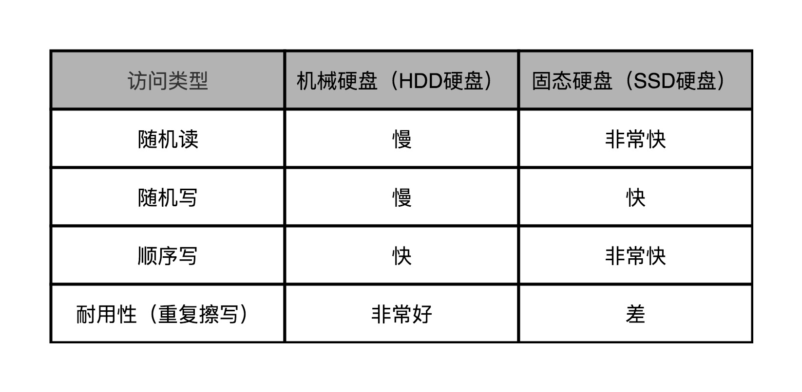
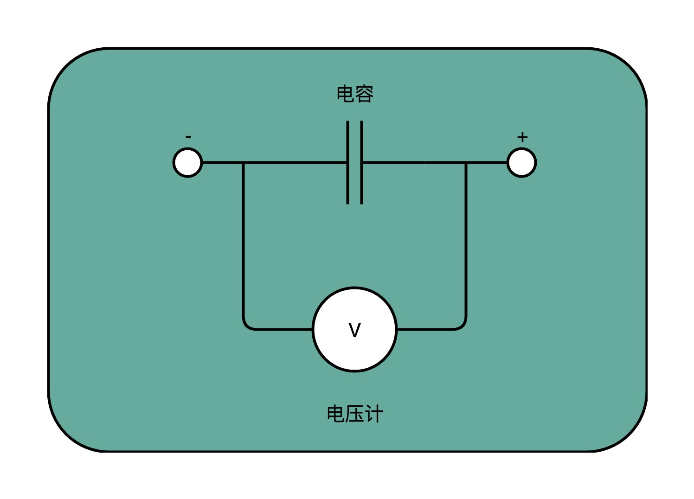
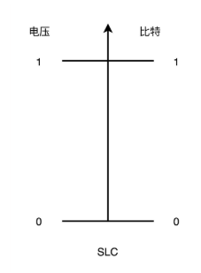
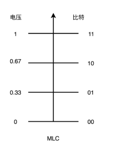
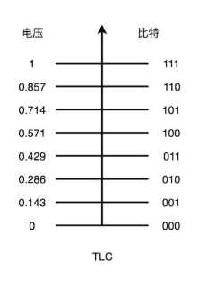
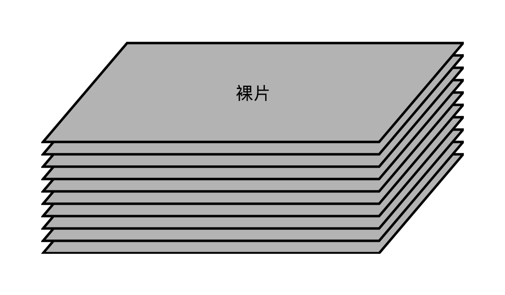
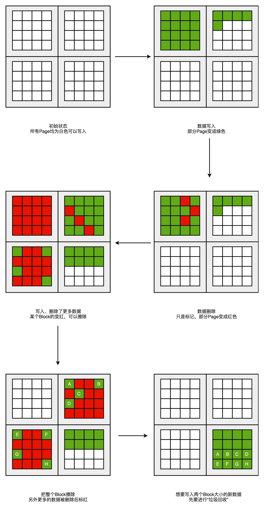
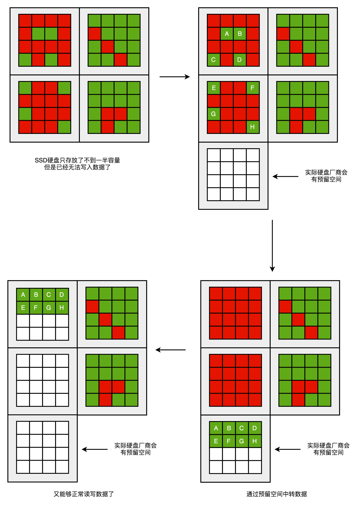

# 浅谈SSD硬盘

## 前言

> 关于SSD硬盘，已经是非常普及，还记得当时的第一台笔记本，还是一个很垃圾的机械硬盘，但是现在随便一个好一点的电脑，直接使用的都是SSD硬盘，价格的下降，必然是技术的进步！
>
> 所以，文本会带你看看你的SSD硬盘，到底是个什么样子，包括基本的组成与存储实现原理，还有就是数据的读写原理，还会解答之前在[计算机存储器的层次结构简介](https://www.copydays.org/2020/05/21/173/#计算机存储器的层次结构简介)中留下的SSD真实大小问题。

So，这篇文章会带你刷新你对于SSD硬盘的认识。

## 正文

>本文必备基础知识：计算机存储的概念有一定的认识，知道SSD很快，也就足够了！
>

### 一、SSD与HHD性能对比

关于机械硬盘（HHD）的内容，在[机械硬盘与Partial Stroking](https://www.copydays.org/2020/06/01/机械硬盘与partial-stroking/)文中，已经详细的介绍了。

大家对于SSD的**第一印象，一般都是好！**

但是有一个致命的缺点，并没有被商家提出，那就是**不耐用**，相比较机械硬盘已经很差了，哪怕技术很好，算法很棒，还是不耐用。

（这就是很多性价比好的笔记本都是SSD配HHD，尤其是台式机用户，更是如此。使用SSD作为系统盘，保证数据读写快，而存储的文件，则使用机械硬盘。）

一般在数据中心，多读少写的场景使用SSD硬盘，写多的场景使用HHD硬盘，使用这种方式权衡性价比，毕竟SSD贵。

注意，此时就应该知道，并不是什么存储都直接使用SSD就是最好了，哈哈！

### 二、SSD 存储原理

对于SSD内部的存储，可以借用高速缓存中的SRAM，使用一个电容存放一个比特的数据。

只是由于电容可以根据电量进行存储数据的转换，所以还需要一个测量电容中的电压的器件，将其叫做电压计。

#### 1）SLC（Single-Level Cell）

从SLC就可以看出来，这是单个的意思。

所以，其实表示的是一个存储单元只有一位数据。

也就是说，使用一个电容，直接表示一位数据。这个SLC的方式，一般叫做SLC颗粒。

#### 2）MLC（Multi-Level Cell）

由于使用SLC的时候，只是一个电容表示一位数据，那么这有点浪费。

其实可以将这个电容对应的电压，分成4个状态，此时不就可以表示两位数据了。

但是，此时MLC颗粒的SSD，由于电容的充电和放电需要保证对应的精度，多以速度就会比SLC慢一半。

#### 3）TLC（Triple-Level Cell）

对应于MLC，THC也就是将电容的电压分成8个状态，用来表示三位数据。

此时的MLC颗粒SSD会更慢。

#### 4）QLC（Quad-Level Cell）

QLC，也就是将电容的电压分成16个状态，用来表示四位数据。

此时的QLC颗粒SSD会更更慢。

### 三、SSD硬件结构

#### 1）接口和控制电路

由于存储器属于输入输出设备，在[浅谈输入输出设备](https://www.copydays.org/2020/05/29/浅谈输入输出设备/)中，讲过I/O设备，是必须要有的接口和控制电路的。

所以，SSD也不例外，也会有接口和控制电路。

只不过，**SSD的接口形式还分为两种，一种是：SATA接口，另一种是PCI Exprss接口。**

并且，**在控制电路中，还有一个很重要的模块，叫做FTL（Flash-Translation Layer），叫做内存转换层，其主要控制SSD硬盘内部的块的擦除，直接和SSD的寿命和性能有关。**

#### 2）真实的I/O设备

##### 1.裸片（Die）

现在市面上的SSD，都是使用的3D封装技术，**类似于HHD硬盘的盘面（Platter）堆叠技术，SSD也是将多个裸片（Die）堆叠在一起。**

这样的多层结构，保证了同样空间可以放下更多的容量。

##### 2.平面（Plane）|块（Block）|页（Page）

SSD中的每一个裸片上面，还有多个平面（Plane），一般一个平面的存储容量大小是GB级别。

一个平面上，还有多个块（Block），一般一个块的存储容量大小是几百KB到几MB级别。

一个块上面，还有多个页（Page），一般一个页的容量是4KB。

### 四、SSD数据读写

#### 1）写入（Program）

对于SSD的数据写入，一般叫做**Program**。

**SSD的数据写入，如果已经存储满了，或者存储需要擦除了，就需要先擦除（Erase），获得足够的空间，才可以进行数据的写入。**

对于HHD硬盘，是可以直接通过覆写（Overwrite）完成数据写入。

数据写入的**基本单位是SSD结构中的页**，哪怕是不足够一个页的大小，内部会插入idle，撑满整个页。在linux内部写入数据的时候，也是这个原理。

#### 2）擦除（Erase）

由于SSD不存在覆写的情况，那么擦除是怎么触发的，以及存储空间的管理又是怎么做到的，这就是控制电路FTL（Flash-Translation Layer）模块的作用了。当然会涉及相应的算法。

**在擦除的时候，最小的基本单位是块**，块？那如果页里面存在数据怎么办？这个就需要控制电路来保证了，并且设计读写的生命周期。

所以，这就表明了一个块，不能一直擦除，时间常量就坏了，这不就是SSD硬盘寿命短的原因么。

一般使用SLC存储的SSD硬盘，块的擦除次数大概是10万次；

使用MLC存储的SSD硬盘，块的擦除次数大概是1万次；

使用TLC和QLC存储的SSD硬盘，块的擦除次数大概是几千次。

在市场上，由于厂商使用的存储颗粒不同，对应的SSD硬盘价格也是不一样的，这就是为什么容量一样，价格不一样的原因，并不是坑你，而是有原因的。

### 五、SSD读写的生命周期

#### 1）数据操作SSD的变化

在使用SSD硬盘的时候，一般可以归结为读，写，删除。

读，不涉及数据在SSD中存储的搬移等；

写，会有数据在SSD中的新增，当存储页不足的时候，会触发擦除和数据搬移操作；

删除，会在SSD中产生删除的页。

所以，**将绿色表示新增数据，红色表示已经删除的数据，白色表示空白的数据。**

下面的图中，表示了数据的写入，与删除，并且自行进行触发擦除的操作，有的时候还会触发数据搬移操作。

#### 2）SSD中的预留空间（Over Provisiong）

在使用SSD的时候，会出现某一个块全部被删除了，那么就要将这个块擦除了，准备放入存储新的数据。

但是，有的时候也会存在另一种情况，这个块上面的数据其实并没有全部删除，但是已经没有多余的空间了，那么些事也还会触发一个擦除操作，只不过这个数据的擦除操作之前，还需要进行数据的搬移。

但是数据搬移，数据删除，并没有规律，这是一个概率事件，所以一般的SSD硬盘都会进行存储空间的预留，也就是**240GB的可见空间，对应的其实是256GB的真实存储空间**。一般这个预留空间是实际存储的7%-15%之间，容量越大，预留空间越大。

（这就是看似花钱买了240GB，其实你买的事256GB）

这个预留空间是做什么的，就是做数据搬移的，保证240GB可以完全存储下来，

下面的图，展示了预留空间的作用。

## 结束语

关于SSD硬盘的内容，是很多的，尤其它的算法，所以掌握基本的存储原理，数据的操作方式就可以了。

后续还会讲解SSD的算法，是如何实现保证SSD的性能的，别擦着擦着就坏了，哈哈！

## 补充内容

一般的存储器中，除非将存储的位置放上新的数据，一般都会保留原本存储的数据。所以这也就是你只是删除了文件，并不会真的删除，人家数据还是静静的躺在原来的位置，只是你看不到而已（如何做到看不到，可以基于操作系统层面，也可以基于硬盘控制电路层面）。

在控制电路进行了删除标记，使用数据恢复技术仍然会可以恢复的。这个操作仅限于机械硬盘，SSD硬盘不可以保证是否会自己触发的擦除操作，擦除了，数据就真的没有了！

## 参考链接

1.Understanding TLC NAND：https://www.anandtech.com/show/5067/understanding-tlc-nand

