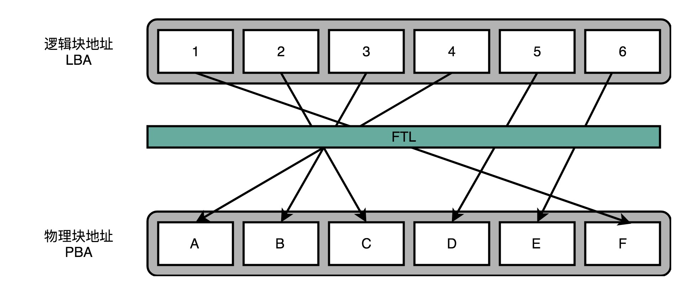
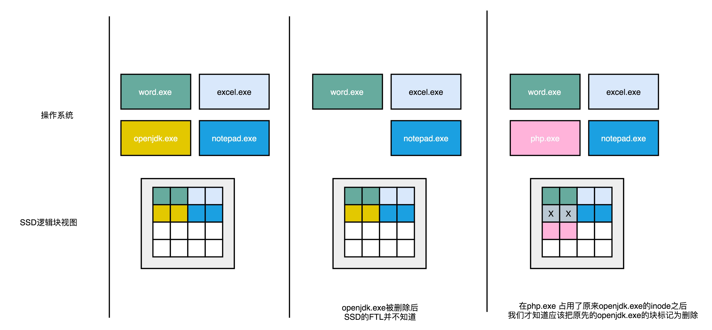
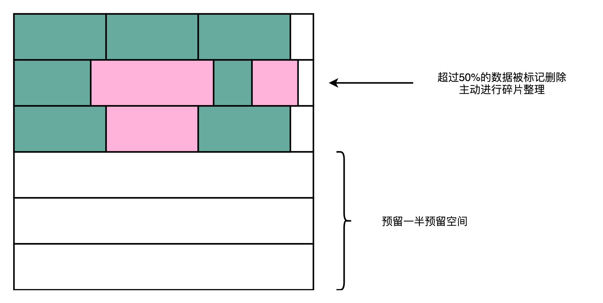

# SSD硬盘的性能优化

## 前言

> 不管在硬件还是软件中，性能优化都是一个永远存在的话题，对于SSD硬盘，其实也是存在的。
>
> 本文会从SSD的性能优化出发，看看是如何做到磨损均衡，保证操作系统与SSD硬件之间的状态是如何同步的，最后还是一起看看一个曾经很棒的Key-Value数据库。

由于文中涉及的是性能优化，所以会有一些新名词与一些基础知识的认识，稍有难度！

## 正文

>本文的阅读门槛，需要首先阅读[浅谈SSD硬盘](https://www.copydays.org/2020/06/03/浅谈ssd硬盘/#浅谈SSD硬盘)，然后对于SSD硬盘为什么寿命短有一个认识。知道一些数据库方面的知识。
>

### 一、磁盘碎片整理功能

针对磁盘碎片整理功能，很多人都是陌生的，除非特定情况才会使用，本质上，在windows操作系统下使用磁盘碎片管理，属于性能优化的范畴。

但是，上述也只是针对机械硬盘，**由于HHD的存储原理，对于寿命是没影响的。**

**将磁盘碎片整理，使用在SSD上面，就属于人为降低SSD寿命**了，所以对于SSD硬盘，千万别使用磁盘碎片整理。

所以，频繁的人为碎片整理和频繁的写入数据，会导致SSD硬盘局部的颗粒不可用，你也知道存储的介质是电容，使用时间长了就坏了。

PS:磁盘碎片整理操作在Win磁盘的属性中。

### 二、磨损均衡（Wear-Leveling）

由于频繁的操作SSD局部的颗粒，就会导致局部的使用次数太多了，那么SSD硬盘的可用颗粒变少了，那么容量也就变少了。

所以，**需要一种策略保证SSD硬盘每个块的擦次次数，均匀分摊到每一个块上。那么，这个策略就是磨损均衡。**

实现这种策略，使用的思路是**添加中间层**。

而这个中间层，就是[浅谈SSD硬盘](https://www.copydays.org/2020/06/03/浅谈ssd硬盘/#浅谈SSD硬盘)中讲过的**内存转换层（FTL）**。

### 三、内存转换层（FTL）

使用FTL的主要作用就是，**将操作系统中看到的逻辑块地址（Logical Block Address，LBA），映射到真实的物理块地址（Physical Block Address，PBA）。**

当操作系统访问硬盘地址的时候，使用的是逻辑地址，FEL会将其转为物理地址，进行相应的数据读写操作。

在数据操作的过程中，操作系统只是一个命令的发出者，FTL会进行具体的操作，那么FTL就可以纪录下来每一次操作某一个块的次数。

在FTL中，基于纪录下来的擦除次数，进行物理块之间的数据搬移，最终操作系统来读取数据的时候，还是之前的逻辑地址，只是真实的物理地址被FTL进行的更改。

### 四、TRIM指令

由于只是适用FTL进行物理块之间的数据搬移，更改逻辑块的映射方式，还是**不可以做到删除数据的状态同步。**

**操作系统删除一个数据的时候，并不知道直接在物理层面删除数据，只是在文件系统中，把对应inode中的元信息清除掉**，所以只要找到这个inode，重新挂载到文件系统中，数据仍然是可以使用的。（回忆[浅谈SSD硬盘](https://www.copydays.org/2020/06/03/浅谈ssd硬盘/#浅谈SSD硬盘)中的补充内容）

但是，在SSD中，操作系统层面的删除，并不会同步到SSD中的块中，所以，这就会导致一个**问题：SSD自身在擦除数据的时候，需要进行数据搬移，那么这个数据搬移会将那些已经在操作系统层面删除的数据进行搬移，不仅仅是浪费空间，还是浪费SSD的寿命。**

上述问题也会导致摸索不均衡。所以，现**在的操作系统和SSD的主控芯片，引入了一个信号量的概念。其实就是一个TRIM指令，这个指令会在文件被删除的时候，让操作系统去通知SSD硬盘，将对应的物理块标记为已删除。**

下图，显示的是操作系统层面和SSD逻辑块层面中关于删除数据的操作过程图，只有当重新使用原来的inode的时候，才会知道原本的SSD数据块其实已经被删除了。

### 五、写入放大

在使用SSD的时候，会出现越用越慢，这个一方面是因为使用时长的原因，另一方面是由于可用空间不足，出现的写入放大的原因。

关**于写入放大，可以表示为：写入放大=实际闪存写入的数据量 / 系统通过FTL写入的数据量。**

当SSD硬盘中存储了很多数据，导致剩余空间变少的时候，每一次写入数据都会进行物理层面的数据搬移，腾出来足够的空间写入数据，那么这个写入速度就会变慢。

可能会出现，**在操作系统中只是写入了几MB的数据，但是FTL确需要搬移几十MB的数据。此时花费的时间也就是好多倍了。**

PS：使用SSD硬盘，要么存储那些读多写少，要么就只存储六七成的数据。

### 六、AeroApike数据库

**AeroApike是一个专门针对SSD硬盘特殊设计的键值存储数据库（Key-Value），属于针对专门的硬件设计的软件。**

关于AeroApike，可以总结为一下几点：

**1）AeroApike直接操作SSD硬盘中的块和页，不需要通过操作系统这个中间层，性能自然高；**

**2）AeroApike在写入数据的时候，会首先在内存中以一个固定大小的筐，攒着数据，等到一定大小之后（一般128KB），才会触发写入数据，此时写入的就是一个大块数据，也保证的数据读取的空间局部性；**

**3）AeroApike在读数据的时候，尤其写入的大数据块，那么读取的空间局部性就可以进行数据读取的性能优化，并且AeroApike支持读取很小的数据（512Bytes），保证了数据读取之后可以很方便在网络传出中使用，就不需要进行重新分片传输了；**

**4）AeroApike会主动进行磁盘碎片管理，使用的是高水位（High Watermark）算法，一旦一个物理块里面的数据碎片超过50%，就会自动触发数据搬运，并进行数据擦除；**

**5）使用AeroApike，最佳实践给出，最好预留SSD磁盘空间的一半，保证SSD的写放大效应最小。这个就有点使用HHD的Partial Stroking机制提升性能了，参看：[机械硬盘与Partial Stroking](https://www.copydays.org/2020/06/01/机械硬盘与partial-stroking/)。**

## 结束语

本文属于一个比较总结的话题，一旦涉及性能优化必然会提出问题，然后解决掉。

所以这就需要综合知识，基本的东西是都需要知道的。

关于SSD硬盘的内容，就结束了，但是SSD扩展出来的业界最佳实践才刚刚开始，AeroSpike 算是一个开端，还有很多，慢慢聊起来！尤其是在现在的分布式中，存储架构的设计可离不开SSD硬盘，总不能全上HHD吧，这不科学，哈哈！

## 参考链接

1.Getting The Most Out Of Your Flash/SSDs：https://www.slideshare.net/AerospikeDB/getting-the-most-out-of-your-flashssds

2.NoSQL Benchmark Compares Aerospike, Cassandra, Couchbase and MongoDB：https://www.infoq.com/news/2013/04/NoSQL-Benchmark/

