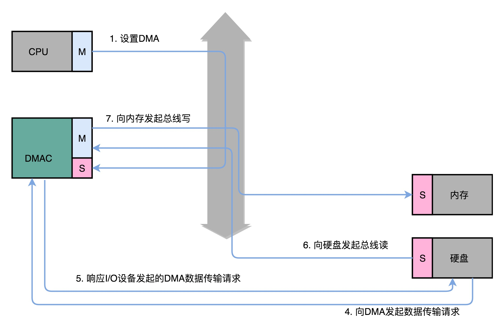
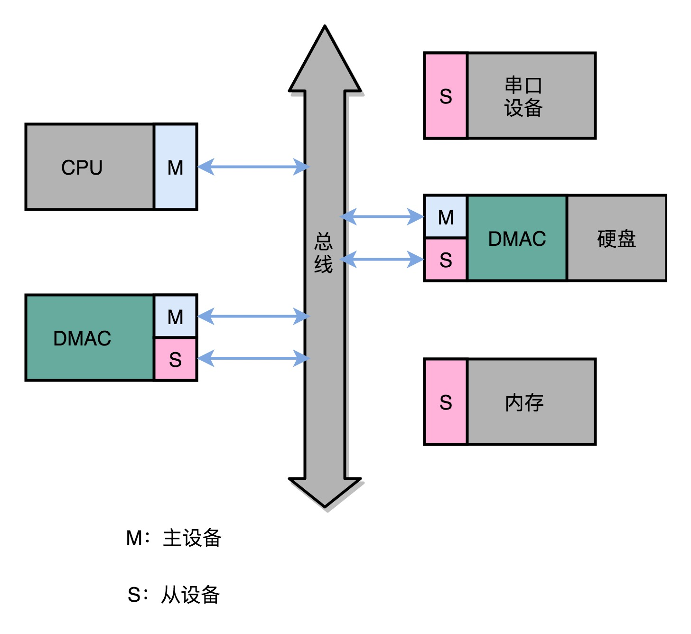
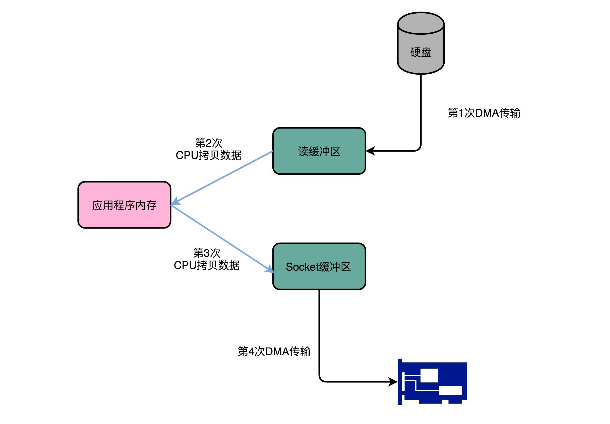

# DMA技术和Kafka

## 前言

> 不管是在硬件还是软件层面，性能的优化与高回报率一直都是大家追求的目标。
>
> 本文会从数据的I/O出发，看看直接内存访问（DMA）技术，理解数据从I/O设备到内存，再到硬盘与CPU之间的交互，最后基于零拷贝（zero-copy）技术，看看Kafka这个开源项目是如何利用DMA进行数据的高效传输。

本文归属于性能优化，所以需要具备一定的基础知识，难度适中，综合性强，扩展性强！


## 正文

>阅读本文的门槛：知道数据读写操作是如何进行，知道常见I/O设备，知道一般硬件的IOPS，了解网络数据传输，会一点编程。
>

### 一、源起性能优化

不管是前些年的大数据，还是分布式的日志监控，**I/O才是限制性能的关键。**

所以，从硬件设备的角度优化，那就是**将原本的HHD硬盘，升级为SSD硬盘，将原本SATA接口的SSD，升级为PCI Express接口的SSD，再进而直接使用傲腾（Optane）技术的内存。**

但是，从IOPS的角度来看，CPU随便跑跑都是20亿+，但是SSD跑满也才2万+，这个差距已经是非常大了，查看[摩尔定律](https://www.copydays.org/2020/05/23/cpu-cache之数据读取/#一、摩尔定律)的描述。

所以，只是单纯的使用CPU操作硬盘这种I/O设备，速度太慢了，**需要某一种芯片来给I/O设备帮忙，减少CPU的等待。**


### 二、初识直接内存访问（DMA）

**直接内存访问，全称 Direct Memory Access，简称DMA。**

DMA，属于计算机主板上的一块独立芯片。

**将原来CPU直接操作I/O设备，升级为CPU告诉DMA需要的是哪种数据，DMA去与I/O设备交互，将数据写入内存。**在这个过程中，使用**DMA控制器（DMA Controller，DMAC）控制数据传输，也被称为协处理器（Co-Processor）。**

使用DMA技术，可以做到当传输的数据特别大时，速度就特别快，数据特别小时，速度就有特别慢。（快是好事，慢不一定是坏事哦！）


### 三、主设备与从设备

在描述设备数据传输的时候，可以基于主动和被动的形式，分为两种：**主设备（Master），从设备（Slave）。**

**主设备：只能主动发起数据传输，如CPU；**

**从设备：只能接受数据传输，如硬盘。**

一般CPU，会从I/O设备读取数据，向I/O设备写入数据。I/O设备，会向CPU请求数据读写，但是不能自己主动推送和拉取数据。（刚刚和手机接受的推送消息相反）

而，DMAC，相对于CPU属于从设备，相对于硬盘属于主设备 。


### 四、DMAC数据传输过程

使用DMAC的设备，初衷是提升数据的传输，下面来看看整个数据传输的过程：

1）在需要数据传输的时候，**CPU会将数据源地址的初始值以及传输时候的增减方式告诉DMAC，将目标地址的初始值以及传输时候的地址增减方式，数据的传输长度，都通过配置文件的形式，配置到DMAS的寄存器中。**

2）从硬盘向内存写入数据的时候，**硬盘会向DMAC发送一个数据传输请求**，该请求通过额外的连线，不是通过总线。

3）**DMAC，通过额外的连线响应数据传输请求。**

4）DMAC，**向硬盘发起总线读的传输请求，将数据读到DMAC的控制器中。**

5）DMAC，**向内存发起总线写的传输请求，将数据写到内存中。**

6）DMAC，**重复上述4，5步骤**，直到最后DMAC传输的数据等于设置的数据传输长度。

7）数据传输完成 之后，**DMAC恢复空闲状态（idle）。**




### 五、I/O设备中的DMAC

由于使用DMA技术，可以提高数据的读写性能，已经不局限于存在于主板了，**现在的I/O设备内部也集成了自己的DMAC芯片。**

各个I/O设备内部的DMAC芯片，可以很好根据自身设备应用场景进行各自的优化，也算是一个百花齐放的结局。




### 六、数据网络传输过程

将本地的数据发送到网络上，一般都不是直接的将数据扔到网卡，中间会经过各种缓存，简单描述为：

**1）通过DMA技术，将硬盘中的数据传输到操作西游内核的缓冲区；**

**2）通过CPU搬运，将数据从内核缓冲区，复制到应用程序的私有内存空间中；**

**3）通过CPU搬运，将数据从应用的私有内存空间，复制到操作系统的Socket缓冲区；**

**4）通过DMA技术，将Socket缓冲区的数据，写到网卡的缓冲区。**

上述的过程，完成了一个数据从硬盘到网络的基本过程，内部关于网卡的包装，分片什么的就不关注了。




### 七、开源项目：kafka

关于kafka，使用过消息队列的伙伴都应该是知道的，其内部实现机制使用的就是DMA技术。

如果挖源码，你会看到下面这一段：

```java
@Override
public long transferFrom(FileChannel fileChannel, long position, long count) throws IOException {
    return fileChannel.transferTo(position, count, socketChannel);
}
```

这一段中，调用Java NIO 库中 FileChannel 里面的 transferTo 方法。直接实现了数据写入到对应的网络设备。

在缓冲区基于Socket描述符信息，将数据直接写入到网卡的缓冲区，详细过程见下图。

**在这个数据传输中，没有进行内存层面的数据复制，所以其也被称为零拷贝（Zero-copy）。**


## 结束语

本文从性能的角度出发，探讨了数据读取当值CPU等待的优化方案，那就是使用协处理器DMAC，简单描述了DMAC如何进行数据传输，以及现在的I/O设备使用DMAC芯片的情况。

最后，通过一个网络传输的过程，探讨零拷贝技术以及看看开源项目kafka。

从技术的角度看一写技术的出现，其实是必然，但是出现的实际则是偶然了，不管哪个硬件还是工具，传输的都是信息流，信息流做的就是搬运数据，那么如何做好一个"mastering CRUD"，还需要深刻思考一番。


## 参考链接

1.Efficient data transfer through zero copy：https://developer.ibm.com/articles/j-zerocopy/

2.Kafka: a Distributed Messaging System for Log Processing：http://notes.stephenholiday.com/Kafka.pdf